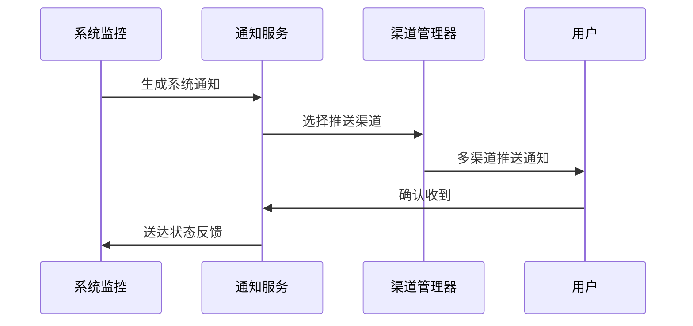

# IOE-DREAM 通知管理业务指南

**文档版本**: v2.0.0
**更新日期**: 2025-12-16
**业务模块**: 通知管理
**服务名称**: ioedream-common-service (通知模块)
**端口**: 8088

---

## 📋 业务概述

### 业务定义
通知管理是IOE-DREAM智慧园区管理平台的核心支撑模块，提供多渠道、多场景的消息通知服务，支持系统通知、业务通知、安全通知和提醒通知等多种类型。

### 业务价值
- **及时沟通**: 确保信息及时传达给相关人员
- **多渠道覆盖**: 支持邮件、短信、微信、APP推送等多种渠道
- **个性定制**: 支持模板自定义和个性化消息
- **高效送达**: 高可靠性、高并发的消息推送

### 核心特性
- ✅ **多渠道通知**: 邮件、短信、微信、APP推送、钉钉
- ✅ **模板管理**: 丰富的消息模板，支持自定义模板
- ✅ **实时推送**: 毫秒级消息推送，支持大规模并发
- ✅ **智能路由**: 根据用户偏好自动选择最佳推送渠道
- ✅ **消息追踪**: 完整的消息状态跟踪和送达确认
- ✅ **限流保护**: 防止消息轰炸，保护用户体验

---

## 🎯 业务场景

### 1. 系统通知场景

#### 场景描述
系统运行状态变化、系统维护公告、安全警告等系统级消息通知。

#### 典型应用
- **系统维护通知**: 系统升级维护公告
- **安全警告**: 异常登录、安全威胁警告
- **功能更新**: 新功能上线通知
- **故障通知**: 系统故障、服务中断通知

**业务流程**:


### 2. 业务通知场景

#### 场景描述
业务流程中的关键节点通知，如审批结果、状态变更、业务提醒等。

#### 典型应用
- **审批通知**: 访客预约审批结果通知
- **考勤提醒**: 上下班打卡提醒
- **门禁通知**: 访客通行、异常进入通知
- **消费通知**: 账户余额提醒、消费成功通知

**消息分类**:
```json
{
  "businessNotifications": {
    "access": ["访客预约", "通行记录", "异常告警"],
    "attendance": ["打卡提醒", "考勤异常", "排班变更"],
    "consume": ["消费成功", "余额不足", "补贴到账"],
    "visitor": ["预约审批", "访客到达", "访问结束"]
  }
}
```

### 3. 安防通知场景

#### 场景描述
安全相关事件的实时通知，确保安全隐患及时处理。

#### 典型应用
- **入侵检测**: 非法闯入实时告警
- **异常行为**: 可疑行为自动识别通知
- **设备故障**: 门禁、监控设备故障通知
- **紧急事件**: 火灾、地震等紧急情况通知

### 4. 提醒通知场景

#### 场景描述
个性化提醒服务，帮助用户管理日常事务。

#### 典型应用
- **日程提醒**: 会议、约会提醒
- **生日祝福**: 员工生日、节日祝福
- **到期提醒**: 证件到期、权限到期提醒
- **健康提醒": 健康检查、运动提醒

---

## 🏗️ 系统架构

### 微服务架构
```
ioedream-common-service (通知模块)
├── notification-controller/          # 通知API控制器
├── notification-service/             # 通知业务服务
├── notification-manager/             # 通知业务编排
├── notification-dao/                 # 通知数据访问
├── template-service/                 # 模板管理服务
├── channel-service/                  # 渠道管理服务
├── push-service/                     # 推送服务
└── integration/
    ├── email-service/                # 邮件服务集成
    ├── sms-service/                  # 短信服务集成
    ├── wechat-service/               # 微信服务集成
    ├── push-service/                 # APP推送服务
    └── dingtalk-service/             # 钉钉服务集成
```

### 技术栈
- **消息队列**: RabbitMQ (异步消息处理)
- **缓存**: Redis (消息状态缓存、限流)
- **数据库**: MySQL 8.0 + MyBatis-Plus
- **邮件服务**: JavaMail + SMTP
- **短信服务**: 阿里云短信服务
- **推送服务**: 极光推送、华为推送
- **模板引擎**: Thymeleaf (邮件模板)、Freemarker

### 部署架构
- **高可用**: 多实例部署，负载均衡
- **异步处理**: 消息队列异步处理
- **监控告警**: Prometheus + Grafana
- **日志追踪**: ELK Stack + 分布式追踪

---

## 📊 业务数据模型

### 核心实体

#### 1. 通知消息实体 (NotificationMessageEntity)
```java
@Entity
@Table(name = "t_notification_message")
public class NotificationMessageEntity extends BaseEntity {
    @TableId(type = IdType.ASSIGN_ID)
    private Long messageId;                 // 消息ID

    @NotBlank
    @Size(max = 100)
    @TableField("message_no")
    private String messageNo;               // 消息编号

    @NotNull
    @TableField("notification_type")
    private Integer notificationType;       // 通知类型(1-系统 2-业务 3-安全 4-提醒)

    @NotNull
    @Size(max = 200)
    @TableField("title")
    private String title;                   // 消息标题

    @NotBlank
    @Column(columnDefinition = "TEXT")
    @TableField("content")
    private String content;                 // 消息内容

    @TableField("template_id")
    private Long templateId;                // 模板ID

    @TableField("template_params")
    private String templateParams;          // 模板参数(JSON)

    @NotNull
    @TableField("sender_type")
    private Integer senderType;             // 发送者类型(1-系统 2-用户 3-设备)

    @TableField("sender_id")
    private Long senderId;                  // 发送者ID

    @TableField("sender_name")
    private String senderName;              // 发送者姓名

    @NotNull
    @TableField("receiver_type")
    private Integer receiverType;           // 接收者类型(1-用户 2-角色 3-部门 4-全部)

    @TableField("receiver_ids")
    private String receiverIds;             // 接收者ID列表(JSON)

    @TableField("priority")
    private Integer priority;               // 优先级(1-高 2-中 3-低)

    @TableField("channels")
    private String channels;                // 推送渠道(JSON)

    @TableField("send_time")
    private LocalDateTime sendTime;         // 发送时间

    @TableField("expire_time")
    private LocalDateTime expireTime;        // 过期时间

    @NotNull
    @TableField("status")
    private Integer status;                 // 状态(1-待发送 2-发送中 3-已发送 4-发送失败 5-已过期)

    @TableField("total_count")
    private Integer totalCount;             // 总接收人数

    @TableField("success_count")
    private Integer successCount;           // 成功发送数

    @TableField("fail_count")
    private Integer failCount;              // 失败发送数

    @Size(max = 1000)
    @TableField("remark")
    private String remark;                  // 备注
}
```

#### 2. 通知记录实体 (NotificationRecordEntity)
```java
@Entity
@Table(name = "t_notification_record")
public class NotificationRecordEntity extends BaseEntity {
    @TableId(type = IdType.ASSIGN_ID)
    private Long recordId;                  // 记录ID

    @NotNull
    @TableField("message_id")
    private Long messageId;                 // 消息ID

    @NotNull
    @TableField("receiver_id")
    private Long receiverId;                // 接收者ID

    @TableField("receiver_name")
    private String receiverName;            // 接收者姓名

    @TableField("receiver_email")
    private String receiverEmail;           // 接收者邮箱

    @TableField("receiver_phone")
    private String receiverPhone;           // 接收者手机号

    @NotNull
    @TableField("channel")
    private Integer channel;                // 推送渠道(1-邮件 2-短信 3-微信 4-APP 5-钉钉)

    @TableField("channel_address")
    private String channelAddress;          // 渠道地址(邮箱、手机号等)

    @NotNull
    @TableField("send_status")
    private Integer sendStatus;             // 发送状态(1-待发送 2-发送中 3-成功 4-失败)

    @TableField("send_time")
    private LocalDateTime sendTime;         // 发送时间

    @TableField("read_time")
    private LocalDateTime readTime;         // 阅读时间

    @TableField("click_time")
    private LocalDateTime clickTime;        // 点击时间

    @TableField("error_code")
    private String errorCode;               // 错误码

    @TableField("error_message")
    private String errorMessage;            // 错误信息

    @TableField("retry_count")
    private Integer retryCount;             // 重试次数

    @TableField("external_id")
    private String externalId;              // 外部系统ID

    @TableField("callback_data")
    private String callbackData;            // 回调数据(JSON)
}
```

#### 3. 消息模板实体 (NotificationTemplateEntity)
```java
@Entity
@Table(name = "t_notification_template")
public class NotificationTemplateEntity extends BaseEntity {
    @TableId(type = IdType.ASSIGN_ID)
    private Long templateId;                // 模板ID

    @NotBlank
    @Size(max = 100)
    @TableField("template_code")
    private String templateCode;            // 模板编码

    @NotBlank
    @Size(max = 200)
    @TableField("template_name")
    private String templateName;            // 模板名称

    @NotNull
    @TableField("template_type")
    private Integer templateType;           // 模板类型(1-邮件 2-短信 3-微信 4-APP)

    @NotNull
    @TableField("notification_type")
    private Integer notificationType;       // 通知类型

    @NotBlank
    @Size(max = 200)
    @TableField("title_template")
    private String titleTemplate;           // 标题模板

    @NotBlank
    @Column(columnDefinition = "TEXT")
    @TableField("content_template")
    private String contentTemplate;         // 内容模板

    @TableField("template_params")
    private String templateParams;          // 模板参数定义(JSON)

    @TableField("example_params")
    private String exampleParams;           // 示例参数(JSON)

    @NotNull
    @TableField("status")
    private Integer status;                 // 状态(1-启用 0-禁用)

    @TableField("usage_count")
    private Integer usageCount;             // 使用次数

    @Size(max = 1000)
    @TableField("remark")
    private String remark;                  // 备注
}
```

#### 4. 用户通知配置实体 (UserNotificationConfigEntity)
```java
@Entity
@Table(name = "t_user_notification_config")
public class UserNotificationConfigEntity extends BaseEntity {
    @TableId(type = IdType.ASSIGN_ID)
    private Long configId;                  // 配置ID

    @NotNull
    @TableField("user_id")
    private Long userId;                    // 用户ID

    @NotNull
    @TableField("notification_type")
    private Integer notificationType;       // 通知类型

    @TableField("channel_enabled")
    private String channelEnabled;          // 渠道启用状态(JSON)

    @TableField("time_enabled")
    private String timeEnabled;             // 免打扰时间段(JSON)

    @TableField("frequency_limit")
    private Integer frequencyLimit;         // 频率限制(每小时最大条数)

    @NotNull
    @TableField("status")
    private Integer status;                 // 状态(1-启用 0-禁用)

    @TableField("last_update_time")
    private LocalDateTime lastUpdateTime;   // 最后更新时间
}
```

---

## 🔧 业务功能详解

### 1. 消息模板管理

#### 1.1 模板设计
**功能描述**: 提供丰富的消息模板，支持动态参数替换。

**模板类型**:
- **邮件模板**: HTML格式，支持富文本
- **短信模板**: 纯文本，字数限制
- **微信模板**: XML格式，支持图文
- **APP模板**: 支持推送标题、内容、图标

**模板语法**:
```html
<!-- 邮件模板示例 -->
<!DOCTYPE html>
<html>
<head>
    <title>${title}</title>
</head>
<body>
    <h2>尊敬的${userName}，您好！</h2>
    <p>${content}</p>
    <#if (linkUrl)??>
        <p><a href="${linkUrl}">点击查看详情</a></p>
    </#if>
    <p>发送时间：${sendTime?string('yyyy-MM-dd HH:mm:ss')}</p>
</body>
</html>
```

#### 1.2 模板管理
**功能描述**: 模板的增删改查，支持版本管理和审核流程。

**管理功能**:
- **模板创建**: 支持可视化模板编辑器
- **模板预览**: 实时预览模板效果
- **参数验证**: 模板参数完整性验证
- **版本控制**: 模板版本管理和回滚
- **审核流程**: 模板发布审核机制

### 2. 多渠道推送

#### 2.1 渠道管理
**功能描述**: 统一管理各种推送渠道，支持渠道配置和监控。

**支持的渠道**:
- **邮件**: SMTP协议，支持HTML和纯文本
- **短信**: 阿里云短信服务，支持模板短信
- **微信**: 企业微信API，支持应用消息
- **APP推送**: 极光推送、华为推送等
- **钉钉**: 钉钉机器人API

**渠道配置**:
```json
{
  "email": {
    "smtpHost": "smtp.example.com",
    "smtpPort": 587,
    "username": "noreply@example.com",
    "password": "encrypted_password",
    "useSSL": true
  },
  "sms": {
    "accessKey": "aliyun_access_key",
    "secretKey": "aliyun_secret_key",
    "signName": "IOE-DREAM",
    "templateCode": "SMS_123456789"
  },
  "wechat": {
    "corpId": "wechat_corp_id",
    "corpSecret": "wechat_corp_secret",
    "agentId": 1000001
  }
}
```

#### 2.2 智能路由
**功能描述**: 根据用户偏好、消息类型、时段等自动选择最佳推送渠道。

**路由策略**:
```java
public class NotificationRouter {

    public List<Integer> selectChannels(NotificationMessage message, Long userId) {
        // 1. 获取用户偏好设置
        UserNotificationConfig config = getUserConfig(userId);

        // 2. 根据消息类型确定优先渠道
        List<Integer> priorityChannels = getPriorityChannels(message.getNotificationType());

        // 3. 检查时间窗口限制
        List<Integer> availableChannels = checkTimeWindow(priorityChannels, config);

        // 4. 考虑渠道容量和成本
        return optimizeChannels(availableChannels, message);
    }
}
```

### 3. 消息推送服务

#### 3.1 实时推送
**功能描述**: 支持实时消息推送，毫秒级响应。

**推送流程**:
1. 消息接收和验证
2. 接收者解析和扩展
3. 渠道路由选择
4. 模板渲染和参数替换
5. 多渠道并发推送
6. 状态跟踪和回调

**并发处理**:
```java
@Service
public class NotificationPushService {

    @Async("notificationExecutor")
    public CompletableFuture<PushResult> pushAsync(NotificationMessage message) {
        // 异步推送处理
        return CompletableFuture.completedFuture(doPush(message));
    }

    public void pushBatch(List<NotificationMessage> messages) {
        // 批量推送处理
        messages.parallelStream()
                .forEach(this::pushAsync);
    }
}
```

#### 3.2 可靠性保障
**功能描述**: 确保消息推送的可靠性，支持重试和补偿机制。

**可靠性机制**:
- **消息持久化**: 消息入库，防止丢失
- **重试机制**: 失败自动重试，指数退避
- **补偿机制**: 定时任务补偿失败消息
- **幂等性**: 防止重复推送

### 4. 用户偏好管理

#### 4.1 个性化设置
**功能描述**: 用户可以自定义通知偏好，包括渠道选择、免打扰时间等。

**设置项**:
```json
{
  "channelPreference": {
    "system": ["APP", "EMAIL"],
    "business": ["APP", "SMS", "WECHAT"],
    "security": ["APP", "SMS", "PHONE"],
    "reminder": ["APP", "EMAIL"]
  },
  "doNotDisturb": {
    "enabled": true,
    "startTime": "22:00",
    "endTime": "08:00",
    "exceptions": ["SECURITY"]
  },
  "frequencyLimit": {
    "maxPerHour": 10,
    "maxPerDay": 50
  }
}
```

#### 4.2 智能推荐
**功能描述**: 基于用户行为数据，智能推荐通知偏好设置。

**推荐算法**:
- **行为分析**: 分析用户点击率、阅读时间
- **时段分析**: 识别用户活跃时段
- **渠道分析**: 分析各渠道的响应率
- **内容分析**: 分析用户感兴趣的内容类型

### 5. 消息统计分析

#### 5.1 实时统计
**功能描述**: 实时统计消息推送的各项指标。

**统计指标**:
- **发送统计**: 发送量、成功率、失败率
- **渠道统计**: 各渠道的发送量和成功率
- **用户统计**: 活跃用户、阅读率、点击率
- **性能统计**: 平均响应时间、并发处理能力

#### 5.2 报表分析
**功能描述**: 提供丰富的报表分析功能，支持数据导出。

**报表类型**:
- **日报**: 每日消息推送统计
- **周报**: 一周趋势分析
- **月报**: 月度汇总分析
- **自定义报表**: 根据需求定制报表

---

## 📱 移动端集成

### APP推送集成
```java
// 极光推送集成示例
@Service
public class JPushService {

    private JPushClient jPushClient;

    public void pushToUser(Long userId, String title, String content) {
        // 获取用户设备注册ID
        List<String> registrationIds = getUserRegistrationIds(userId);

        // 构建推送消息
        PushPayload payload = PushPayload.newBuilder()
                .setPlatform(Platform.all())
                .setAudience(Audience.registrationIds(registrationIds))
                .setNotification(Notification.newBuilder()
                        .setAlert(content)
                        .addPlatformNotification(AndroidNotification.newBuilder()
                                .setTitle(title)
                                .build())
                        .addPlatformNotification(IosNotification.newBuilder()
                                .setTitle(title)
                                .build())
                        .build())
                .build();

        // 发送推送
        try {
            PushResult result = jPushClient.sendPush(payload);
            log.info("APP推送成功: {}", result);
        } catch (Exception e) {
            log.error("APP推送失败", e);
        }
    }
}
```

### 消息接收处理
```javascript
// 移动端消息接收处理
class NotificationHandler {

    // APP推送消息处理
    handlePushMessage(message) {
        const { type, title, content, data } = message;

        switch (type) {
            case 'SYSTEM':
                this.showSystemNotification(title, content);
                break;
            case 'BUSINESS':
                this.showBusinessNotification(title, content, data);
                break;
            case 'SECURITY':
                this.showSecurityAlert(title, content, data);
                break;
        }

        // 记录消息已读
        this.markAsRead(message.id);
    }

    // 显示系统通知
    showSystemNotification(title, content) {
        uni.showToast({
            title: title,
            icon: 'none',
            duration: 2000
        });

        // 存储到本地通知列表
        this.saveLocalNotification({
            type: 'SYSTEM',
            title: title,
            content: content,
            timestamp: Date.now()
        });
    }
}
```

---

## 💻 管理端功能

### 通知管理界面
- **消息列表**: 分页查询、高级搜索、批量操作
- **消息详情**: 发送状态、接收者列表、渠道分析
- **模板管理**: 模板编辑、预览、发布管理
- **统计分析**: 图表展示、数据导出、趋势分析

### 核心管理功能
```vue
<template>
  <div class="notification-management">
    <!-- 消息查询 -->
    <div class="search-panel">
      <el-form :model="searchForm" inline>
        <el-form-item label="消息类型">
          <el-select v-model="searchForm.type" placeholder="请选择">
            <el-option label="系统通知" value="1" />
            <el-option label="业务通知" value="2" />
            <el-option label="安全通知" value="3" />
            <el-option label="提醒通知" value="4" />
          </el-select>
        </el-form-item>
        <el-form-item label="发送时间">
          <el-date-picker
            v-model="searchForm.dateRange"
            type="datetimerange"
            range-separator="至"
            start-placeholder="开始日期"
            end-placeholder="结束日期" />
        </el-form-item>
        <el-form-item>
          <el-button type="primary" @click="queryMessages">查询</el-button>
        </el-form-item>
      </el-form>
    </div>

    <!-- 消息列表 -->
    <div class="message-list">
      <el-table :data="messageList" stripe>
        <el-table-column prop="title" label="标题" />
        <el-table-column prop="type" label="类型" :formatter="formatType" />
        <el-table-column prop="status" label="状态" :formatter="formatStatus" />
        <el-table-column prop="sendTime" label="发送时间" />
        <el-table-column prop="totalCount" label="总接收数" />
        <el-table-column prop="successCount" label="成功数" />
        <el-table-column label="操作">
          <template #default="scope">
            <el-button size="small" @click="viewDetail(scope.row)">详情</el-button>
            <el-button size="small" @click="viewStatistics(scope.row)">统计</el-button>
          </template>
        </el-table-column>
      </el-table>
    </div>
  </div>
</template>
```

---

## 🔗 系统集成

### 1. 业务系统集成
各业务模块通过API调用通知服务：
```java
// 业务系统集成示例
@Service
public class VisitorNotificationService {

    @Resource
    private NotificationService notificationService;

    // 预约审批通知
    public void sendAppointmentApprovalNotification(AppointmentEntity appointment) {
        NotificationMessage message = NotificationMessage.builder()
                .type(NotificationType.BUSINESS)
                .title("访客预约审批结果")
                .templateCode("VISITOR_APPROVAL_RESULT")
                .receiverType(ReceiverType.USER)
                .receiverIds(Collections.singletonList(appointment.getVisitorUserId()))
                .templateParams(Map.of(
                    "visitorName", appointment.getVisitorName(),
                    "appointmentNo", appointment.getAppointmentNo(),
                    "approvalResult", appointment.getStatus() == 2 ? "通过" : "拒绝",
                    "approvalComment", appointment.getApprovalComment()
                ))
                .channels(Arrays.asList(ChannelType.APP, ChannelType.SMS))
                .priority(Priority.HIGH)
                .build();

        notificationService.sendMessage(message);
    }
}
```

### 2. 第三方服务集成
- **邮件服务**: SMTP协议集成
- **短信服务**: 阿里云短信API
- **微信服务**: 企业微信API
- **推送服务**: 极光推送API

---

## 📊 性能优化

### 1. 消息队列优化
- **异步处理**: 所有消息推送异步化
- **批量处理**: 批量发送提高效率
- **优先级队列**: 高优先级消息优先处理
- **死信队列**: 处理失败消息

### 2. 数据库优化
- **索引优化**: 关键查询字段建立索引
- **分区表**: 大数据量按时间分区
- **读写分离**: 查询使用只读副本
- **缓存策略**: 热点数据缓存

### 3. 渠道优化
- **连接池**: 复用HTTP连接
- **限流控制**: 防止渠道超限
- **熔断机制**: 渠道故障自动切换
- **负载均衡**: 多渠道负载分发

---

## 🔒 安全管控

### 1. 数据安全
- **敏感信息**: 手机号、邮箱等敏感信息加密存储
- **访问控制**: 基于角色的数据访问控制
- **操作审计**: 完整的操作日志记录
- **数据脱敏**: 日志中敏感信息脱敏

### 2. 发送安全
- **频率限制**: 防止消息轰炸
- **内容审核**: 消息内容安全审核
- **黑名单**: 恶意用户加入黑名单
- **签名验证**: 第三方回调签名验证

### 3. 隐私保护
- **用户同意**: 用户授权后才推送
- **撤回机制**: 支持消息撤回
- **匿名统计**: 统计数据匿名化处理
- **合规要求**: 符合GDPR等隐私法规

---

## 📈 监控告警

### 1. 业务监控
- **发送量监控**: 实时监控发送量趋势
- **成功率监控**: 各渠道成功率监控
- **延迟监控**: 消息发送延迟监控
- **异常监控**: 异常情况实时告警

### 2. 系统监控
- **服务健康**: 微服务健康状态监控
- **性能指标**: JVM、数据库性能监控
- **资源使用**: CPU、内存、网络监控
- **错误监控**: 错误日志、异常堆栈监控

### 3. 告警配置
```yaml
# 告警规则配置
alerts:
  - name: "notification_send_failure_rate"
    condition: "failure_rate > 10%"
    duration: "5m"
    severity: "critical"
    channels: ["email", "sms", "dingtalk"]

  - name: "notification_queue_size"
    condition: "queue_size > 1000"
    duration: "2m"
    severity: "warning"
    channels: ["email", "dingtalk"]
```

---

## 🚀 运维管理

### 1. 日常运维
- **健康检查**: 定期检查服务健康状态
- **数据备份**: 消息数据定期备份
- **日志清理**: 定期清理历史日志
- **性能调优**: 根据监控数据调优

### 2. 故障处理
- **故障预案**: 制定常见故障处理预案
- **快速定位**: 通过监控快速定位问题
- **影响评估**: 评估故障影响范围
- **恢复机制**: 快速恢复服务

### 3. 容量规划
- **容量评估**: 评估系统容量需求
- **扩容策略**: 制定自动扩容策略
- **资源优化**: 优化资源配置
- **成本控制**: 控制运维成本

---

## 🔮 未来规划

### 1. 智能化升级
- **AI推荐**: 智能推荐最佳推送时间和渠道
- **内容优化**: AI优化消息内容提高点击率
- **用户画像**: 基于行为分析的用户画像
- **预测分析**: 预测用户对消息的响应

### 2. 渠道扩展
- **语音通知**: 电话语音通知
- **视频通知**: 短视频消息通知
- **IoT设备**: 智能硬件设备通知
- **AR/VR**: 增强现实/虚拟现实通知

### 3. 生态建设
- **开放API**: 提供开放的通知API
- **插件体系**: 支持第三方渠道插件
- **开发者社区**: 建设开发者生态
- **行业标准**: 参与制定行业标准

---

## 📞 支持与服务

### 技术支持
- **文档支持**: 完整的API文档和开发指南
- **SDK支持**: 多语言SDK支持
- **技术社区**: 开发者社区支持
- **专家咨询**: 技术专家咨询服务

### 服务保障
- **SLA保障**: 服务级别协议保障
- **7x24支持**: 全天候技术支持
- **快速响应**: 快速问题响应机制
- **持续改进**: 持续服务质量改进

---

**文档维护**: IOE-DREAM通知管理团队
**最后更新**: 2025-12-16
**版本**: v2.0.0
**审核状态**: 已审核