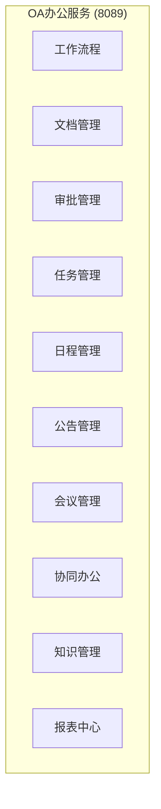
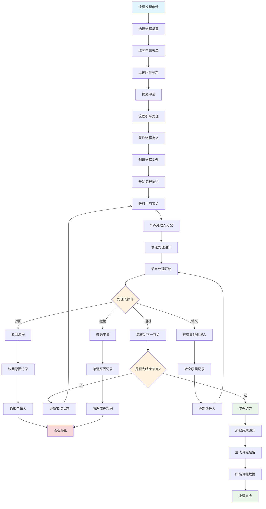
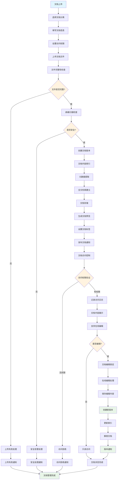
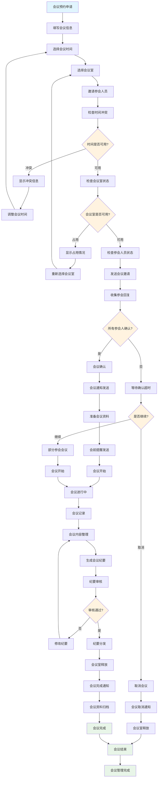
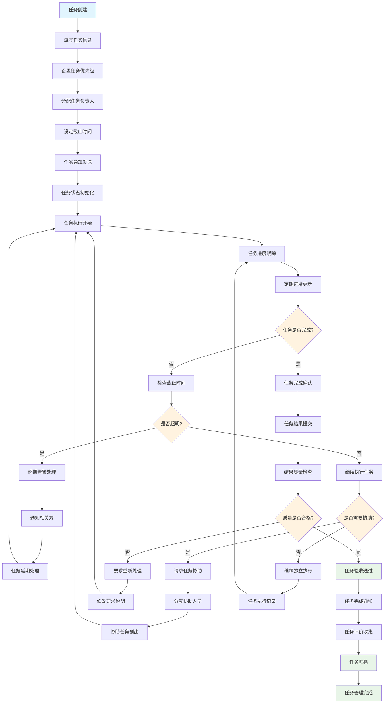
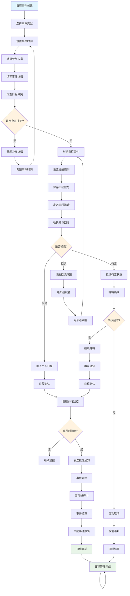
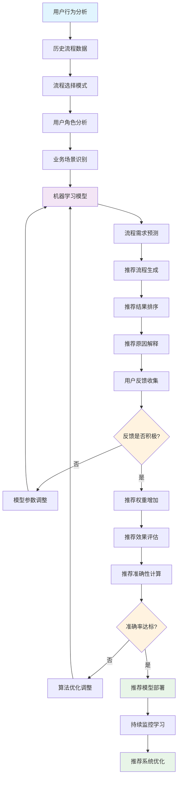
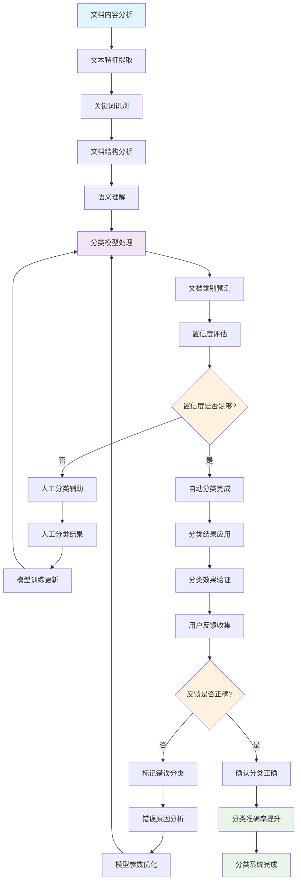
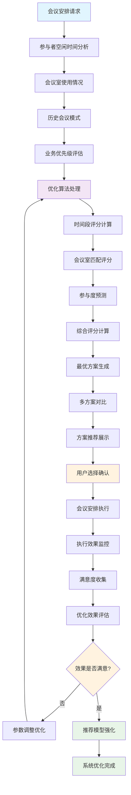

# IOE-DREAM OA办公业务流程图

> **模块名称**: ioedream-oa-service
> **端口**: 8089
> **完成度**: 30%
> **P0级缺失功能**: 工作流程引擎、文档管理系统、多级审批流程
> **创建时间**: 2025-12-16
> **业务场景**: 企业办公自动化，包括流程审批、文档管理、会议管理、协同办公

---

## 📋 OA办公服务架构

### 核心功能模块



### 系统边界

- **输入**: 流程申请、文档上传、任务分配、会议预约
- **输出**: 审批结果、文档版本、任务状态、会议纪要
- **集成**: 人事系统、财务系统、邮件系统、第三方办公软件

---

## 🔄 核心业务流程

### 1. 工作流程管理流程



**流程说明**:
- 灵活的工作流引擎，支持复杂的业务流程定义和执行
- 多节点处理支持，包括串行、并行、条件分支等流程模式
- 完整的审批流程，支持通过、驳回、转交、撤销等操作
- 流程状态实时跟踪，提供流程处理进度和结果通知

### 2. 文档管理流程



**流程说明**:
- 完整的文档生命周期管理，从创建到归档的全过程管理
- 多版本控制，自动保存编辑历史和版本对比
- 安全访问控制，基于角色和权限的文档访问管理
- 全文检索支持，快速查找和定位文档内容

### 3. 会议管理流程



**流程说明**:
- 智能会议调度，自动检测时间冲突和会议室占用情况
- 参会人员管理，邀请发送和回复状态跟踪
- 会议资料管理，会前资料准备和会后资料归档
- 会议纪要管理，自动生成、审核和分发机制

### 4. 任务管理流程



**流程说明**:
- 完整的任务生命周期管理，从创建到完成的全过程跟踪
- 智能任务分配，根据人员能力和工作负载自动分配
- 协作任务支持，多人协作和任务分解功能
- 任务绩效评估，完成质量和效率的综合评价

### 5. 日程管理流程



**流程说明**:
- 智能日程调度，自动检测时间冲突和资源占用
- 多人日程协调，邀请回复和状态跟踪
- 灵活的提醒机制，多种提醒方式和支持
- 日程共享功能，团队和个人日历的统一管理

---

## 🧠 智能功能流程

### 1. 智能工作流推荐流程



### 2. 智能文档分类流程



### 3. 智能会议安排优化流程



---

## 💾 数据库设计

### 核心表结构

#### 1. 工作流程定义表 (t_workflow_definition)

```sql
CREATE TABLE `t_workflow_definition` (
    `definition_id` BIGINT NOT NULL AUTO_INCREMENT COMMENT '流程定义ID',
    `process_key` VARCHAR(100) NOT NULL COMMENT '流程标识',
    `process_name` VARCHAR(200) NOT NULL COMMENT '流程名称',
    `process_version` INT DEFAULT 1 COMMENT '流程版本',
    `process_category` VARCHAR(50) COMMENT '流程分类',
    `description` TEXT COMMENT '流程描述',
    `bpmn_xml` LONGTEXT NOT NULL COMMENT 'BPMN流程定义',
    `start_form_key` VARCHAR(100) COMMENT '开始表单标识',
    `deployment_id` VARCHAR(100) COMMENT '部署ID',
    `diagram_resource_name` VARCHAR(500) COMMENT '流程图资源名',
    `suspended` TINYINT DEFAULT 0 COMMENT '是否挂起 1-挂起 0-激活',
    `tenant_id` BIGINT DEFAULT 1 COMMENT '租户ID',
    `version_comment` VARCHAR(500) COMMENT '版本说明',
    `create_user_id` BIGINT COMMENT '创建人ID',
    `create_time` DATETIME NOT NULL DEFAULT CURRENT_TIMESTAMP COMMENT '创建时间',
    `update_time` DATETIME NOT NULL DEFAULT CURRENT_TIMESTAMP ON UPDATE CURRENT_TIMESTAMP COMMENT '更新时间',
    `deleted_flag` TINYINT DEFAULT 0 COMMENT '删除标记 0-未删除 1-已删除',
    PRIMARY KEY (`definition_id`),
    UNIQUE KEY `uk_process_key_version` (`process_key`, `process_version`),
    KEY `idx_process_category` (`process_category`),
    KEY `idx_suspended` (`suspended`),
    KEY `idx_tenant_id` (`tenant_id`),
    KEY `idx_create_time` (`create_time`)
) ENGINE=InnoDB DEFAULT CHARSET=utf8mb4 COLLATE=utf8mb4_unicode_ci COMMENT='工作流程定义表';
```

#### 2. 文档信息表 (t_document)

```sql
CREATE TABLE `t_document` (
    `document_id` BIGINT NOT NULL AUTO_INCREMENT COMMENT '文档ID',
    `document_code` VARCHAR(100) NOT NULL COMMENT '文档编号',
    `document_name` VARCHAR(200) NOT NULL COMMENT '文档名称',
    `document_type` TINYINT NOT NULL COMMENT '文档类型 1-公文 2-合同 3-报告 4-其他',
    `category_id` BIGINT COMMENT '分类ID',
    `file_path` VARCHAR(500) NOT NULL COMMENT '文件路径',
    `file_name` VARCHAR(200) NOT NULL COMMENT '文件名',
    `file_extension` VARCHAR(10) NOT NULL COMMENT '文件扩展名',
    `file_size` BIGINT NOT NULL COMMENT '文件大小(字节)',
    `mime_type` VARCHAR(100) COMMENT 'MIME类型',
    `content_hash` VARCHAR(64) COMMENT '文件内容哈希',
    `version_number` INT DEFAULT 1 COMMENT '版本号',
    `status` TINYINT DEFAULT 1 COMMENT '状态 1-草稿 2-发布 3-归档 4-删除',
    `security_level` TINYINT DEFAULT 1 COMMENT '安全等级 1-公开 2-内部 3-机密 4-绝密',
    `access_level` TINYINT DEFAULT 1 COMMENT '访问等级 1-所有 2-部门 3-指定 4-私有',
    `download_count` INT DEFAULT 0 COMMENT '下载次数',
    `view_count` INT DEFAULT 0 COMMENT '浏览次数',
    `author_id` BIGINT NOT NULL COMMENT '作者ID',
    `department_id` BIGINT COMMENT '所属部门ID',
    `keywords` VARCHAR(500) COMMENT '关键词',
    `description` TEXT COMMENT '文档描述',
    `tags` VARCHAR(500) COMMENT '标签(逗号分隔)',
    `publish_date` DATETIME COMMENT '发布日期',
    `archive_date` DATETIME COMMENT '归档日期',
    `expire_date` DATETIME COMMENT '过期日期',
    `create_time` DATETIME NOT NULL DEFAULT CURRENT_TIMESTAMP COMMENT '创建时间',
    `update_time` DATETIME NOT NULL DEFAULT CURRENT_TIMESTAMP ON UPDATE CURRENT_TIMESTAMP COMMENT '更新时间',
    `deleted_flag` TINYINT DEFAULT 0 COMMENT '删除标记 0-未删除 1-已删除',
    PRIMARY KEY (`document_id`),
    UNIQUE KEY `uk_document_code` (`document_code`),
    KEY `idx_document_type` (`document_type`),
    KEY `idx_category_id` (`category_id`),
    KEY `idx_status` (`status`),
    KEY `idx_security_level` (`security_level`),
    KEY `idx_author_id` (`author_id`),
    KEY `idx_department_id` (`department_id`),
    KEY `idx_publish_date` (`publish_date`),
    KEY `idx_create_time` (`create_time`),
    KEY `idx_content_hash` (`content_hash`)
) ENGINE=InnoDB DEFAULT CHARSET=utf8mb4 COLLATE=utf8mb4_unicode_ci COMMENT='文档信息表';
```

#### 3. 会议信息表 (t_meeting)

```sql
CREATE TABLE `t_meeting` (
    `meeting_id` BIGINT NOT NULL AUTO_INCREMENT COMMENT '会议ID',
    `meeting_title` VARCHAR(200) NOT NULL COMMENT '会议标题',
    `meeting_type` TINYINT NOT NULL COMMENT '会议类型 1-常规 2-紧急 3-视频 4-电话',
    `meeting_room_id` BIGINT COMMENT '会议室ID',
    `meeting_room_name` VARCHAR(100) COMMENT '会议室名称',
    `start_time` DATETIME NOT NULL COMMENT '开始时间',
    `end_time` DATETIME NOT NULL COMMENT '结束时间',
    `duration` INT NOT NULL COMMENT '会议时长(分钟)',
    `organizer_id` BIGINT NOT NULL COMMENT '组织者ID',
    `department_id` BIGINT COMMENT '主办部门ID',
    `participant_count` INT DEFAULT 0 COMMENT '参会人数',
    `required_participants` TEXT COMMENT '必需参会人(JSON)',
    `optional_participants` TEXT COMMENT '可选参会人(JSON)',
    `meeting_agenda` TEXT COMMENT '会议议程',
    `meeting_materials` TEXT COMMENT '会议材料(JSON)',
    `meeting_status` TINYINT DEFAULT 1 COMMENT '会议状态 1-计划中 2-确认 3-进行中 4-已完成 5-已取消',
    `is_recurring` TINYINT DEFAULT 0 COMMENT '是否循环会议 1-是 0-否',
    `recurring_pattern` VARCHAR(100) COMMENT '循环模式',
    `meeting_url` VARCHAR(500) COMMENT '会议链接',
    `dial_in_info` VARCHAR(200) COMMENT '电话拨入信息',
    `password` VARCHAR(50) COMMENT '会议密码',
    `recording_enabled` TINYINT DEFAULT 0 COMMENT '是否录制 1-是 0-否',
    `minutes_required` TINYINT DEFAULT 1 COMMENT '是否需要纪要 1-是 0-否',
    `minutes_status` TINYINT DEFAULT 0 COMMENT '纪要状态 0-不需要 1-待写 2-已提交 3-已审核',
    `meeting_cost` DECIMAL(10,2) DEFAULT 0.00 COMMENT '会议费用',
    `external_participants` TEXT COMMENT '外部参会人(JSON)',
    `notes` TEXT COMMENT '备注',
    `create_time` DATETIME NOT NULL DEFAULT CURRENT_TIMESTAMP COMMENT '创建时间',
    `update_time` DATETIME NOT NULL DEFAULT CURRENT_TIMESTAMP ON UPDATE CURRENT_TIMESTAMP COMMENT '更新时间',
    `deleted_flag` TINYINT DEFAULT 0 COMMENT '删除标记 0-未删除 1-已删除',
    PRIMARY KEY (`meeting_id`),
    KEY `idx_meeting_type` (`meeting_type`),
    KEY `idx_meeting_room_id` (`meeting_room_id`),
    KEY `idx_start_time` (`start_time`),
    KEY `idx_end_time` (`end_time`),
    KEY `idx_organizer_id` (`organizer_id`),
    KEY `idx_department_id` (`department_id`),
    KEY `idx_meeting_status` (`meeting_status`),
    KEY `idx_is_recurring` (`is_recurring`),
    KEY `idx_create_time` (`create_time`)
) ENGINE=InnoDB DEFAULT CHARSET=utf8mb4 COLLATE=utf8mb4_unicode_ci COMMENT='会议信息表';
```

#### 4. 任务信息表 (t_task)

```sql
CREATE TABLE `t_task` (
    `task_id` BIGINT NOT NULL AUTO_INCREMENT COMMENT '任务ID',
    `task_code` VARCHAR(100) NOT NULL COMMENT '任务编号',
    `task_title` VARCHAR(200) NOT NULL COMMENT '任务标题',
    `task_type` TINYINT NOT NULL COMMENT '任务类型 1-个人 2-部门 3-项目 4-临时',
    `priority` TINYINT DEFAULT 3 COMMENT '优先级 1-最高 2-高 3-中 4-低 5-最低',
    `task_status` TINYINT DEFAULT 1 COMMENT '任务状态 1-待开始 2-进行中 3-暂停 4-已完成 5-已取消',
    `progress` INT DEFAULT 0 COMMENT '完成进度(百分比)',
    `assignee_id` BIGINT NOT NULL COMMENT '负责人ID',
    `assigner_id` BIGINT NOT NULL COMMENT '分配人ID',
    `department_id` BIGINT COMMENT '所属部门ID',
    `project_id` BIGINT COMMENT '项目ID',
    `parent_task_id` BIGINT COMMENT '父任务ID',
    `task_level` INT DEFAULT 1 COMMENT '任务层级',
    `estimated_hours` DECIMAL(5,2) COMMENT '预估工时',
    `actual_hours` DECIMAL(5,2) DEFAULT 0.00 COMMENT '实际工时',
    `start_time` DATETIME COMMENT '开始时间',
    `due_time` DATETIME COMMENT '截止时间',
    `complete_time` DATETIME COMMENT '完成时间',
    `task_description` TEXT COMMENT '任务描述',
    `acceptance_criteria` TEXT COMMENT '验收标准',
    `attachment_urls` TEXT COMMENT '附件链接(JSON)',
    `collaborators` TEXT COMMENT '协作人员(JSON)',
    `tags` VARCHAR(300) COMMENT '标签(逗号分隔)',
    `reminder_time` DATETIME COMMENT '提醒时间',
    `reminder_sent` TINYINT DEFAULT 0 COMMENT '是否已发送提醒',
    `completion_notes` TEXT COMMENT '完成说明',
    `quality_score` DECIMAL(3,1) COMMENT '质量评分(1-5)',
    `efficiency_score` DECIMAL(3,1) COMMENT '效率评分(1-5)',
    `feedback` TEXT COMMENT '反馈意见',
    `create_time` DATETIME NOT NULL DEFAULT CURRENT_TIMESTAMP COMMENT '创建时间',
    `update_time` DATETIME NOT NULL DEFAULT CURRENT_TIMESTAMP ON UPDATE CURRENT_TIMESTAMP COMMENT '更新时间',
    `deleted_flag` TINYINT DEFAULT 0 COMMENT '删除标记 0-未删除 1-已删除',
    PRIMARY KEY (`task_id`),
    UNIQUE KEY `uk_task_code` (`task_code`),
    KEY `idx_task_type` (`task_type`),
    KEY `idx_priority` (`priority`),
    KEY `idx_task_status` (`task_status`),
    KEY `idx_assignee_id` (`assignee_id`),
    KEY `idx_assigner_id` (`assigner_id`),
    KEY `idx_department_id` (`department_id`),
    KEY `idx_project_id` (`project_id`),
    KEY `idx_parent_task_id` (`parent_task_id`),
    KEY `idx_due_time` (`due_time`),
    KEY `idx_create_time` (`create_time`)
) ENGINE=InnoDB DEFAULT CHARSET=utf8mb4 COLLATE=utf8mb4_unicode_ci COMMENT='任务信息表';
```

---

## 🔧 技术接口设计

### 1. 工作流程引擎接口

```java
/**
 * 工作流程引擎服务
 */
public interface WorkflowEngineService {

    /**
     * 部署流程定义
     * @param deploymentRequest 部署请求
     * @return 部署结果
     */
    WorkflowDeploymentResult deployProcess(WorkflowDeploymentRequest deploymentRequest);

    /**
     * 启动流程实例
     * @param startRequest 启动请求
     * @return 流程实例
     */
    ProcessInstance startProcess(WorkflowStartRequest startRequest);

    /**
     * 完成任务
     * @param taskId 任务ID
     * @param variables 流程变量
     * @return 完成结果
     */
    TaskCompleteResult completeTask(String taskId, Map<String, Object> variables);

    /**
     * 获取待办任务
     * @param assignee 处理人
     * @param query 查询条件
     * @return 任务列表
     */
    List<TaskInfo> getPendingTasks(String assignee, TaskQuery query);

    /**
     * 流程转交
     * @param taskId 任务ID
     * @param assignee 新处理人
     * @return 转交结果
     */
    TaskTransferResult transferTask(String taskId, String assignee);

    /**
     * 查询流程实例状态
     * @param processInstanceId 流程实例ID
     * @return 流程状态
     */
    ProcessInstanceStatus getProcessInstanceStatus(String processInstanceId);
}

/**
 * 工作流启动请求
 */
@Data
public class WorkflowStartRequest {
    private String processKey;           // 流程标识
    private String businessKey;          // 业务标识
    private String processName;          // 流程名称
    private Long initiatorId;            // 发起人ID
    private Map<String, Object> variables; // 流程变量
    private List<String> candidateUsers; // 候选处理人
    private String tenantId;             // 租户ID
    private Map<String, Object> customProperties; // 自定义属性
}
```

### 2. 文档管理服务接口

```java
/**
 * 文档管理服务
 */
public interface DocumentManagementService {

    /**
     * 上传文档
     * @param uploadRequest 上传请求
     * @return 上传结果
     */
    DocumentUploadResult uploadDocument(DocumentUploadRequest uploadRequest);

    /**
     * 下载文档
     * @param documentId 文档ID
     * @param userId 用户ID
     * @return 文档内容
     */
    FileDownloadResult downloadDocument(Long documentId, Long userId);

    /**
     * 搜索文档
     * @param searchRequest 搜索请求
     * @return 搜索结果
     */
    PageResult<DocumentInfo> searchDocuments(DocumentSearchRequest searchRequest);

    /**
     * 更新文档版本
     * @param documentId 文档ID
     * @param updateRequest 更新请求
     * @return 更新结果
     */
    DocumentVersionResult updateVersion(Long documentId, DocumentUpdateRequest updateRequest);

    /**
     * 设置文档权限
     * @param documentId 文档ID
     * @param permissionRequest 权限请求
     * @return 权限设置结果
     */
    DocumentPermissionResult setPermission(Long documentId, DocumentPermissionRequest permissionRequest);

    /**
     * 获取文档历史版本
     * @param documentId 文档ID
     * @return 版本列表
     */
    List<DocumentVersionInfo> getDocumentVersions(Long documentId);
}
```

### 3. 会议管理服务接口

```java
/**
 * 会议管理服务
 */
public interface MeetingManagementService {

    /**
     * 预约会议
     * @param meetingRequest 会议请求
     * @return 预约结果
     */
    MeetingBookingResult bookMeeting(MeetingBookingRequest meetingRequest);

    /**
     * 更新会议信息
     * @param meetingId 会议ID
     * @param updateRequest 更新请求
     * @return 更新结果
     */
    MeetingUpdateResult updateMeeting(Long meetingId, MeetingUpdateRequest updateRequest);

    /**
     * 取消会议
     * @param meetingId 会议ID
     * @param cancelReason 取消原因
     * @return 取消结果
     */
    MeetingCancelResult cancelMeeting(Long meetingId, String cancelReason);

    /**
     * 获取会议列表
     * @param query 查询条件
     * @return 会议列表
     */
    PageResult<MeetingInfo> getMeetingList(MeetingQuery query);

    /**
     * 检查会议冲突
     * @param conflictCheckRequest 冲突检查请求
     * @return 冲突检查结果
     */
    MeetingConflictCheckResult checkMeetingConflicts(MeetingConflictCheckRequest conflictCheckRequest);

    /**
     * 生成会议纪要
     * @param meetingId 会议ID
     * @param minutesRequest 纪要请求
     * @return 纪要生成结果
     */
    MeetingMinutesResult generateMinutes(Long meetingId, MeetingMinutesRequest minutesRequest);
}
```

---

## 📊 功能完成度分析

### 已实现功能 (30%)

#### ✅ 基础功能完成
- **基础文档管理**: 文档上传、下载、简单版本控制
- **基础会议管理**: 会议创建、简单时间检查、参会人邀请
- **基础任务管理**: 任务创建、分配、状态跟踪
- **数据库设计**: 完整的OA相关表结构

#### 🔄 部分实现功能
- **工作流程**: 简单的流程定义和执行，缺少复杂流程支持
- **文档协作**: 基础权限控制，缺少在线编辑和协作
- **日程管理**: 基础日程记录，缺少冲突检测和提醒
- **知识管理**: 基础文档分类，缺少智能搜索和推荐

### 未实现功能 (70%)

#### ❌ P0级缺失功能
- **工作流程引擎**: 复杂流程定义、并行处理、条件分支
- **文档管理系统**: 在线编辑、全文检索、版本对比
- **多级审批流程**: 灵活的审批流程配置和执行
- **智能会议安排**: 自动冲突检测、最优时间推荐

#### ❌ P1级缺失功能
- **协同办公**: 实时协作、文档共享、团队沟通
- **知识管理系统**: 智能分类、知识图谱、专家推荐
- **绩效管理**: 工作量统计、效率分析、绩效考核
- **移动办公支持**: 移动端审批、文档查看、任务处理

#### ❌ P2级缺失功能
- **AI智能助手**: 智能提醒、自动分类、预测分析
- **集成能力**: 第三方系统集成、API开放平台
- **数据分析**: 办公效率分析、决策支持报表
- **安全加固**: 文档加密、访问审计、权限精细控制

---

## 🚀 实施计划

### 第一阶段：P0级功能实现 (4-5周)

1. **工作流程引擎开发**
   - BPMN 2.0流程定义支持
   - 复杂流程执行引擎
   - 并行和条件分支处理
   - 流程监控和管理界面

2. **文档管理系统完善**
   - 全文检索引擎实现
   - 在线编辑功能开发
   - 版本控制和对比
   - 文档安全和权限控制

3. **多级审批流程实现**
   - 灵活的审批流程配置
   - 多条件审批路由
   - 审批过程跟踪
   - 审批效率优化

### 第二阶段：P1级功能完善 (3-4周)

1. **协同办公平台建设**
   - 实时协作功能
   - 团队沟通工具
   - 文档共享机制
   - 项目协作管理

2. **知识管理系统开发**
   - 智能文档分类
   - 知识图谱构建
   - 专家推荐系统
   - 知识搜索优化

3. **绩效管理系统**
   - 工作量统计分析
   - 效率指标计算
   - 绩效评估模型
   - 绩效报表生成

### 第三阶段：P2级功能优化 (2-3周)

1. **AI智能功能集成**
   - 智能助手开发
   - 自动化分类推荐
   - 预测分析模型
   - 自然语言处理

2. **系统集成和开放**
   - 第三方系统集成
   - API开放平台
   - 数据同步机制
   - 标准化接口

---

## 📈 技术架构要求

### 性能要求
- **流程处理**: 支持10000+并发流程实例
- **文档检索**: 全文检索响应时间<2秒
- **并发用户**: 支持5000+并发用户访问
- **文件处理**: 支持100MB+文件上传下载

### 可靠性要求
- **系统可用性**: 99.9%以上
- **数据安全**: 文档数据加密存储
- **备份恢复**: 完整的数据备份和恢复机制
- **版本控制**: 文档版本100%可追溯

### 扩展性要求
- **模块化设计**: 支持功能模块独立部署
- **插件机制**: 支持第三方插件扩展
- **API开放**: 提供完整的API接口
- **多租户**: 支持多租户隔离

---

## 📋 验收标准

### 功能验收
- ✅ 所有P0级功能100%实现
- ✅ 工作流程执行准确率≥99.9%
- ✅ 文档检索准确率≥95%
- ✅ 会议冲突检测准确率≥98%

### 性能验收
- ✅ 流程处理延迟≤5秒
- ✅ 文档检索响应时间≤2秒
- ✅ 文件上传下载速度≥10MB/s
- ✅ 并发用户数≥5000

### 用户体验验收
- ✅ 界面操作流畅，响应时间≤3秒
- ✅ 移动端功能完整，操作便捷
- ✅ 智能推荐准确率≥80%
- ✅ 用户满意度≥90%

---

**文档版本**: v1.0.0
**创建时间**: 2025-12-16
**适用范围**: IOE-DREAM OA办公模块
**下次更新**: 功能实现完成后更新