# IOE-DREAM 视频监控业务流程图

> **文档版本**: v1.0.0
> **创建日期**: 2025-12-16
> **业务模块**: 视频监控
> **流程类型**: 核心技术流程
> **关联系统**: 门禁、考勤、访客、安防

---

## 📋 流程图总览

| 流程名称 | 状态 | 优先级 | 关联模块 |
|---------|------|--------|---------|
| 视频流接入流程 | ❌ 未实现 | P0 | 设备通讯 |
| 实时监控流程 | ❌ 未实现 | P0 | 所有业务模块 |
| 录像回放流程 | ❌ 未实现 | P0 | 审计查询 |
| PTZ控制流程 | ❌ 未实现 | P1 | 设备管理 |
| AI智能分析流程 | ⚠️ 部分实现 | P1 | 安防系统 |
| 视频告警流程 | ❌ 未实现 | P0 | 安全管理 |
| 视频存储流程 | ❌ 未实现 | P1 | 数据管理 |

---

## 🎥 1. 视频流接入流程图

### 1.1 流程概述
**流程名称**: 视频流实时接入处理流程
**流程类型**: 核心技术流程
**预计时长**: 实时启动
**涉及角色**: 设备管理员、运维人员

### 1.2 详细流程图

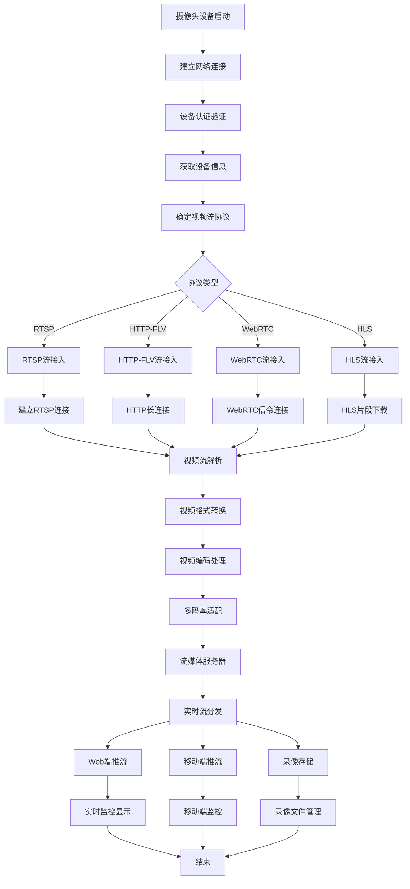

### 1.3 设备发现和注册流程

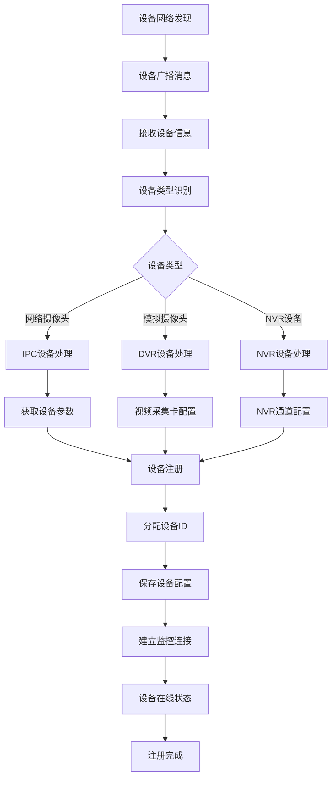

### 1.4 异常处理流程

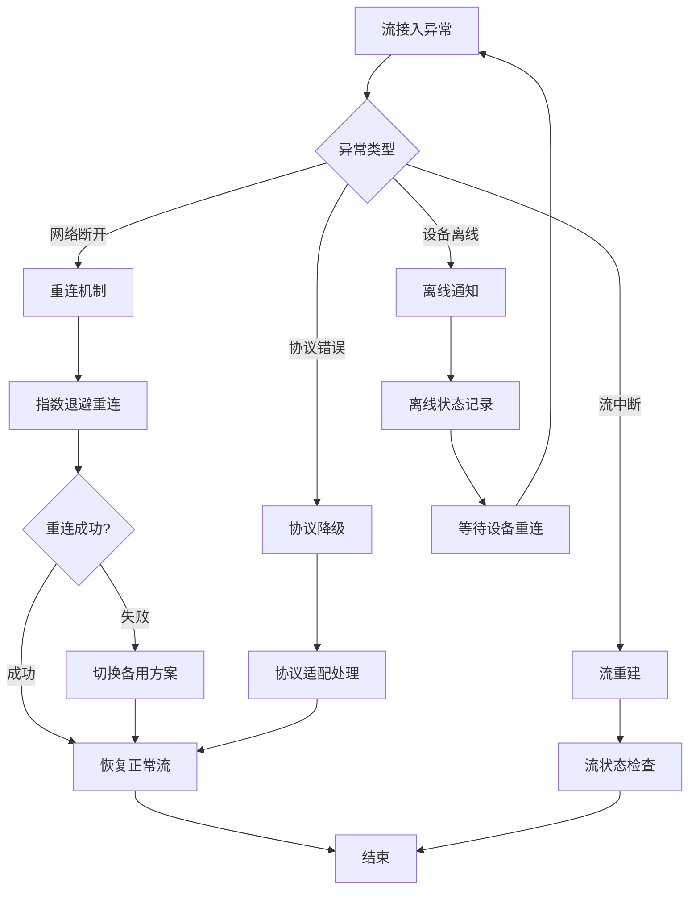

---

## 👁 2. 实时监控流程图

### 2.1 流程概述
**流程名称**: 实时视频监控操作流程
**流程类型**: 核心操作流程
**预计时长**: 实时响应
**涉及角色**: 监控人员、管理人员

### 2.2 详细流程图

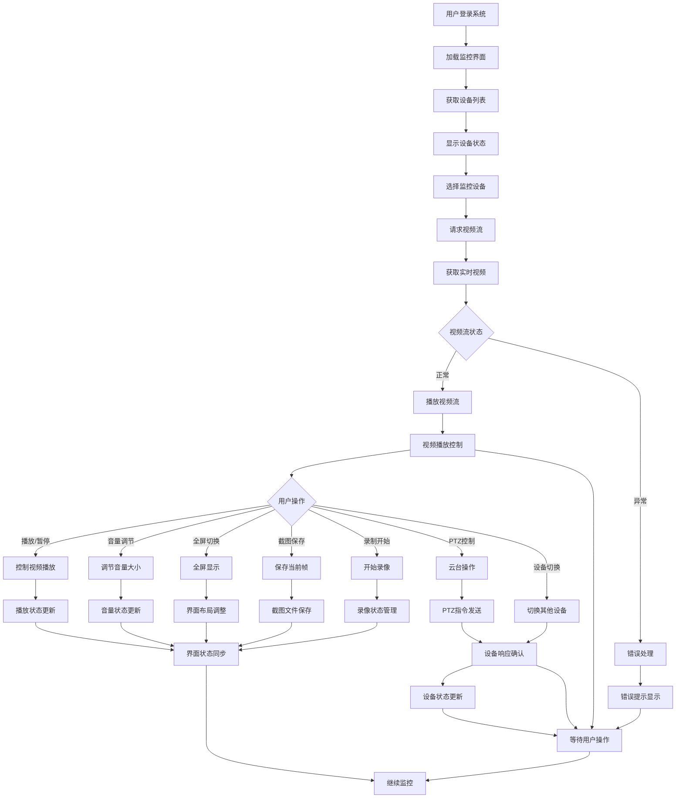

### 2.3 多屏监控流程

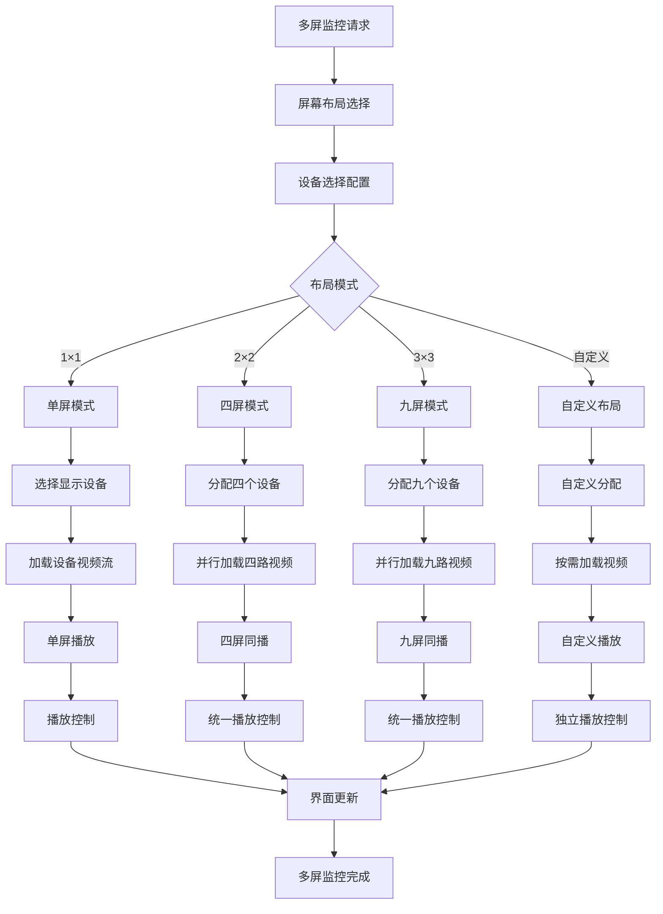

### 2.4 云台PTZ控制流程

```mermaid流程 TD
    A[PTZ控制请求] --> B{控制类型}
    B -->|预设位| C[调用预设位置]
    B -->|方向控制| D[方向控制]
    B -->|变倍控制| E[变倍操作]
    B -->|自动巡航| F[启动自动巡航]

    C --> G[发送预设指令]
    D --> H[发送方向指令]
    E --> I[发送变倍指令]
    F --> J[配置巡航参数]

    G --> K[设备移动到预设位]
    H --> L[云台方向转动]
    I --> M[镜头变倍调整]
    J --> N[启动巡航模式]

    K --> O[移动完成确认]
    L --> P[转动完成确认]
    M --> Q[变倍完成确认]
    N --> R[巡航执行中]

    O --> S[更新当前位置]
    P --> T[更新当前角度]
    Q --> U[更新当前倍率]
    R --> V[巡航状态更新]

    S --> W[界面状态同步]
    T --> W
    U --> W
    V --> W
    W --> X[PTZ控制完成]
```

---

## 🔙 3. 录像回放流程图

### 3.1 流程概述
**流程名称**: 历史视频录像回放流程
**流程类型**: 核心功能流程
**预计时长**: 取决于录像时长
**涉及角色**: 监控人员、审计人员

### 3.2 详细流程图

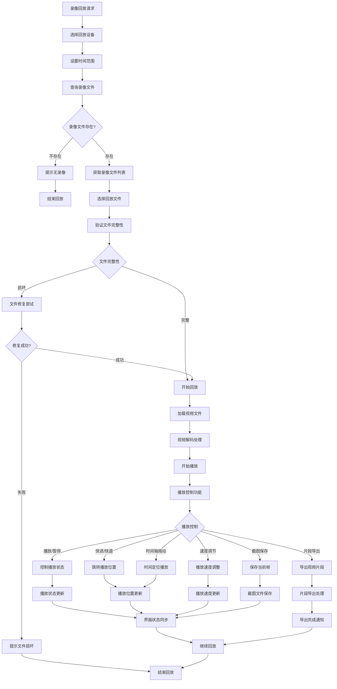

### 3.3 录像存储管理流程

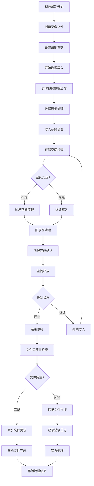

---

## 🤖 4. AI智能分析流程图

### 4.1 流程概述
**流程名称**: AI视频智能分析处理流程
**流程类型**: 智能分析流程
**预计时长**: 实时分析
**涉及角色**: AI分析师、安全人员

### 4.2 详细流程图

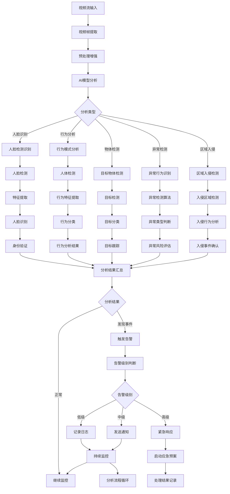

### 4.3 人脸识别子流程

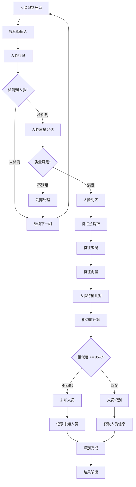

---

## 🚨 5. 视频告警流程图

### 5.1 流程概述
**流程名称**: 智能视频告警处理流程
**流程类型**: 安全事件流程
**预计时长**: 实时响应
**涉及角色**: 安保人员、值班人员、管理人员

### 5.2 详细流程图

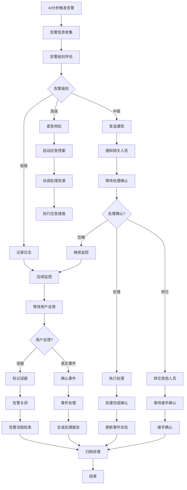

### 5.3 告警联动处理流程

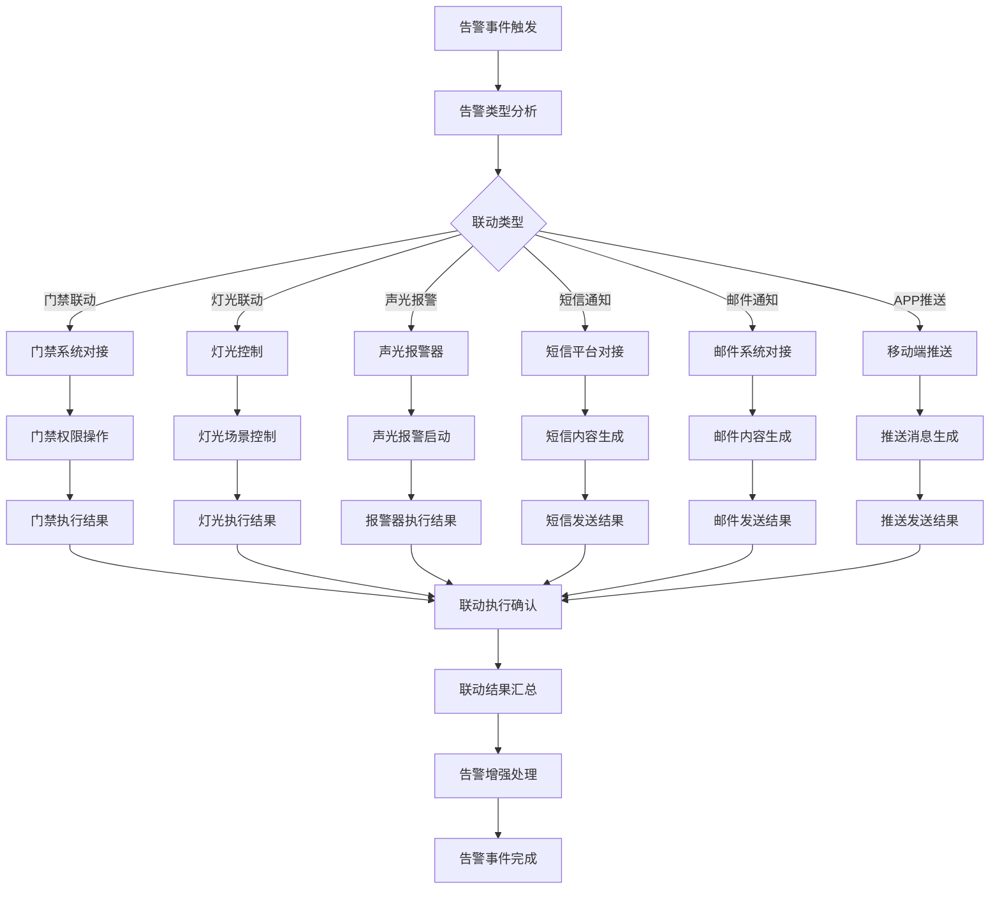

---

## 🔧 6. PTZ控制流程图

### 6.1 流程概述
**流程名称: 摄像机云台PTZ控制流程**
**流程类型**: 设备控制流程
**预计时长**: 实时响应
**涉及角色**: 监控人员、设备管理员

### 6.2 详细流程图

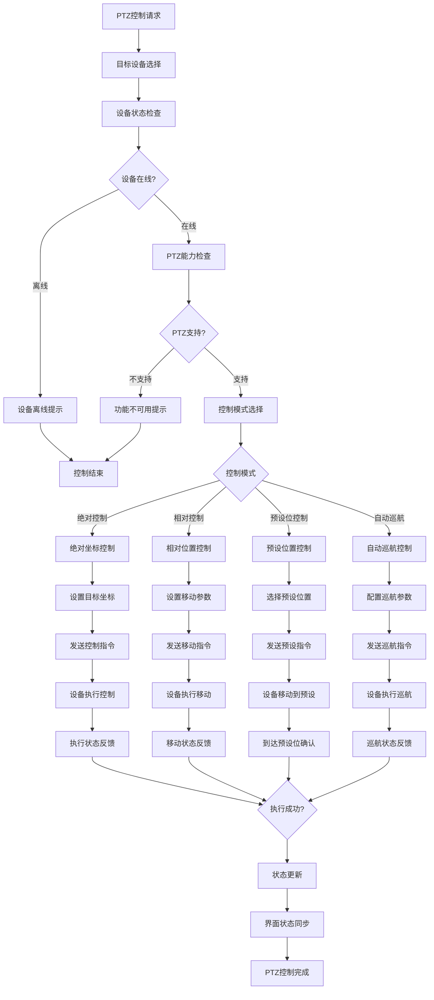

### 6.3 预设位管理流程

```mermaid流程 TD
    A[预设位管理] --> B[预设位列表]
    B --> C{管理操作}

    C -->|添加预设| D[调整到目标位置]
    C -->|编辑预设| E[修改预设信息]
    C -->|删除预设| F[删除预设位]
    C -->|调用预设| G[执行预设调用]

    D --> H[精细调整位置]
    H --> I[设置预设名称]
    I --> J[保存预设位置]
    J --> K[预设位创建完成]

    E --> L[修改预设参数]
    L --> M[更新预设信息]
    M --> N[预设位更新完成]

    F --> O[删除确认]
    O --> P[清除预设数据]
    P --> Q[预设位删除完成]

    G --> R[发送预设指令]
    R --> S[设备执行预设]
    S --> T[到达预设位]
    T --> U[预设调用完成]

    K --> V[预设管理完成]
    N --> V
    Q --> V
    U --> V
    V --> W[结束]
```

---

## 📊 7. 视频存储流程图

### 7.1 流程概述
**流程名称**: 视频文件存储管理流程
**流程类型**: 数据管理流程
**预计时长**: 后台持续运行
**涉及角色**: 系统管理员、运维人员

### 7.2 详细流程图

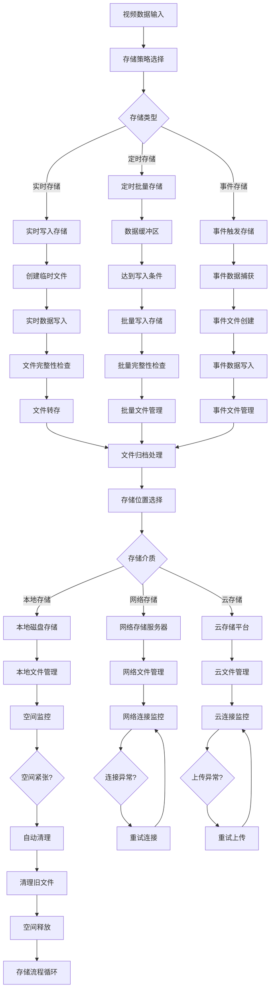

### 7.3 存储优化策略

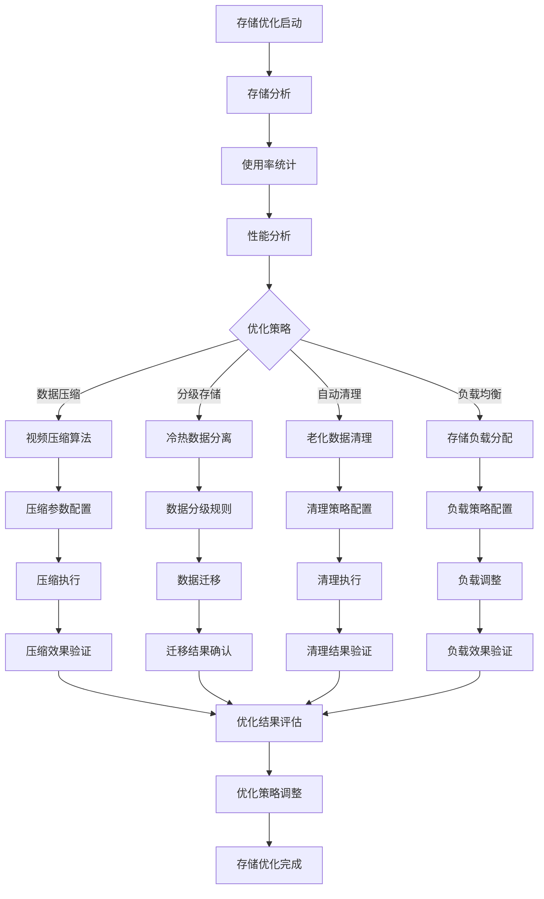

---

## 📋 8. 流程图使用说明

### 8.1 技术实现状态

| 流程名称 | Controller实现 | Service实现 | Manager实现 | DAO实现 | 集成状态 |
|---------|----------------|---------------|--------------|-----------|----------|
| 视频流接入 | ❌ | ⚠️ 部分 | ✅ 完整 | ✅ 完整 | 🔴 严重缺失 |
| 实时监控 | ❌ | ⚠️ 部分 | ✅ 完整 | ✅ 完整 | 🔴 严重缺失 |
| 录像回放 | ❌ | ⚠️ 部分 | ✅ 完整 | ✅ 完整 | 🔴 严重缺失 |
| PTZ控制 | ❌ | ⚠️ 部分 | ✅ 完整 | ✅ 完整 | 🔴 严重缺失 |
| AI智能分析 | ⚠️ 部分 | ⚠️ 部分 | ✅ 完整 | ✅ 完整 | 🟡 需要集成 |
| 视频告警 | ❌ | ❌ 缺失 | ✅ 完整 | ✅ 完整 | 🔴 严重缺失 |
| 视频存储 | ❌ | ❌ 缺失 | ⚠️ 部分 | ✅ 完整 | 🔴 严重缺失 |

### 8.2 集成优先级

**P0级（立即实现）**:
1. 实时监控Controller层实现
2. 视频流接入基础功能
3. 基础PTZ控制功能
4. 视频告警基础框架

**P1级（1个月内）**:
1. 录像回放完整实现
2. AI智能分析集成
3. 视频存储管理
4. 高级PTZ控制功能

**P2级（3个月内）**:
1. 高级AI分析功能
2. 分布式存储优化
3. 多屏监控优化
4. 性能调优

### 8.3 关键技术点

**视频流处理**:
- RTSP/HTTP/WebRTC协议支持
- H.264/H.265视频编解码
- 低延迟流媒体传输
- 多码率自适应

**AI分析集成**:
- 人脸识别算法集成
- 行为分析模型对接
- 实时分析性能优化
- 异常检测准确率提升

**存储优化**:
- 分布式文件系统
- 冷热数据分层存储
- 自动存储空间管理
- 数据完整性保障

---

## 🔗 9. 系统集成关系图

### 9.1 微服务集成

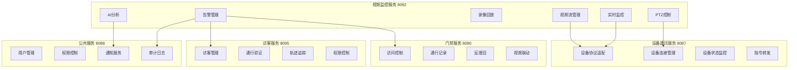

### 9.2 数据流向

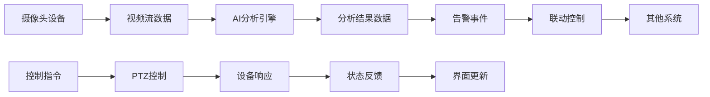

### 9.3 事件触发关系

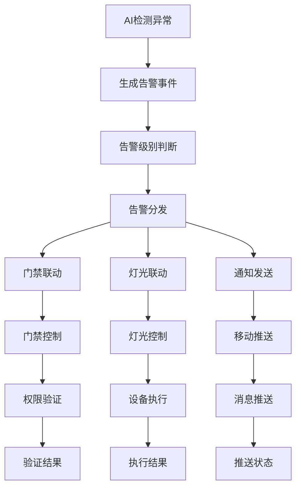

---

## 📝 10. 文档维护

### 10.1 版本控制

- **当前版本**: v1.0.0
- **维护责任**: 视频监控团队
- **审核周期**: 每月一次
- **更新触发**: 业务流程变更时

### 10.2 更新日志

| 版本 | 日期 | 更新内容 | 更新人 |
|------|------|----------|--------|
| v1.0.0 | 2025-12-16 | 初始版本创建 | Claude AI |

### 10.3 实现建议

**第一阶段（1-2周）**:
1. 实现实时监控基础Controller
2. 完善视频流接入基础功能
3. 添加PTZ控制基础接口

**第二阶段（3-4周）**:
1. 完成录像回放功能实现
2. 集成AI分析Manager到Controller
3. 实现基础告警功能

**第三阶段（1-2个月）:
1. 完善高级视频功能
2. 优化性能和稳定性
3. 添加高级监控功能

### 10.4 相关文档

- [视频监控API文档](./VIDEO_API_DOCUMENTATION.md)
- [视频监控数据库设计](./VIDEO_DATABASE_DESIGN.md)
- [视频监控架构设计](./VIDEO_ARCHITECTURE_DESIGN.md)
- [设备协议适配器文档](./DEVICE_PROTOCOL_ADAPTER.md)

---

**📞 技术支持**: IOE-DREAM开发团队
**📧 邮件地址**: support@ioedream.com
**🌐 项目地址**: https://github.com/IOE-DREAM/video-service