# IOE-DREAM 访客管理业务流程图

> **文档版本**: v1.0.0
> **创建日期**: 2025-12-16
> **业务模块**: 访客管理
> **流程类型**: 核心业务流程
> **关联系统**: 门禁、考勤、视频、OA

---

## 📋 流程图总览

| 流程名称 | 状态 | 优先级 | 关联模块 |
|---------|------|--------|---------|
| 访客预约流程 | ✅ 已实现 | P0 | 门禁、OA |
| 访客登记流程 | ⚠️ 部分实现 | P0 | 身份验证 |
| 访客通行流程 | ✅ 已实现 | P0 | 门禁、视频 |
| 访客权限管理流程 | ⚠️ 部分实现 | P0 | 门禁、考勤 |
| 访客黑名单流程 | ✅ 已实现 | P0 | 安全系统 |
| 访客轨迹追踪流程 | ❌ 未实现 | P1 | 视频、门禁 |

---

## 🔄 1. 访客预约流程图

### 1.1 流程概述
**流程名称**: 访客预约申请审批流程
**流程类型**: 核心业务流程
**预计时长**: 5-30分钟
**涉及角色**: 访客、被访者、审批人、前台管理员

### 1.2 详细流程图

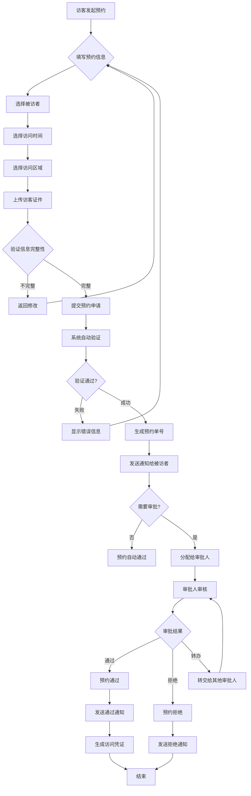

### 1.3 流程节点说明

| 节点 | 处理人 | 处理内容 | 系统操作 |
|------|--------|----------|----------|
| 填写预约信息 | 访客 | 访客姓名、电话、身份证号、来访事由 | 表单验证 |
| 选择被访者 | 访客 | 搜索/选择内部员工 | 员工信息查询 |
| 选择访问时间 | 访客 | 预约时间段选择 | 时间冲突检查 |
| 选择访问区域 | 访客 | 访问目的区域选择 | 权限验证 |
| 上传访客证件 | 访客 | 身份证照片、人脸照片 | 文件上传存储 |
| 信息验证 | 系统 | 表单数据完整性检查 | 自动验证 |
| 审批人审核 | 审批人 | 访客信息真实性确认 | 审批记录 |
| 生成访问凭证 | 系统 | 二维码、临时卡片 | 凭证生成 |

### 1.4 异常处理流程

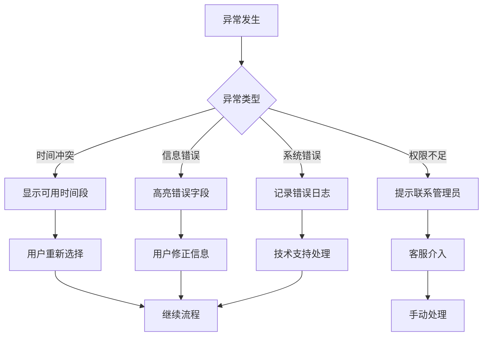

---

## 👤 2. 访客登记流程图

### 2.1 流程概述
**流程名称**: 访客现场登记核验流程
**流程类型**: 核心操作流程
**预计时长**: 2-10分钟
**涉及角色**: 前台管理员、访客、被访者

### 2.2 详细流程图

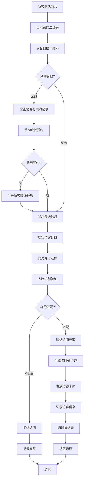

### 2.3 身份验证详细子流程

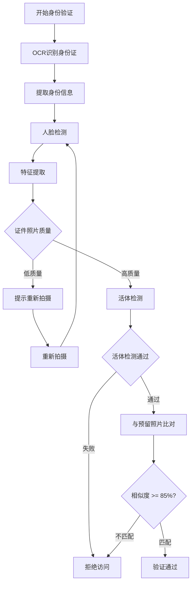

### 2.4 现场预约子流程

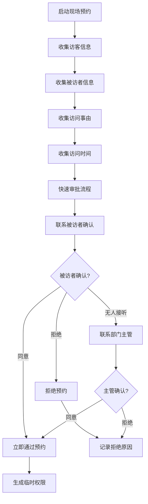

---

## 🚪 3. 访客通行流程图

### 3.1 流程概述
**流程名称**: 访客门禁通行验证流程
**流程类型**: 核心操作流程
**预计时长**: 5-15秒
**涉及角色**: 访客、门禁系统、监控系统

### 3.2 详细流程图

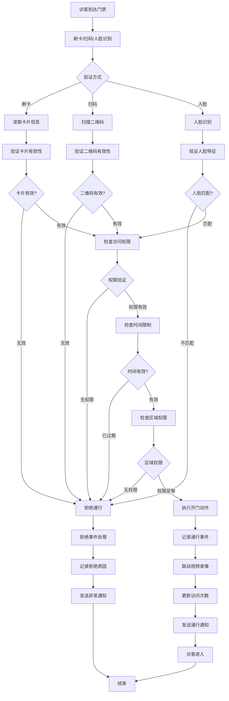

### 3.3 多级权限验证流程

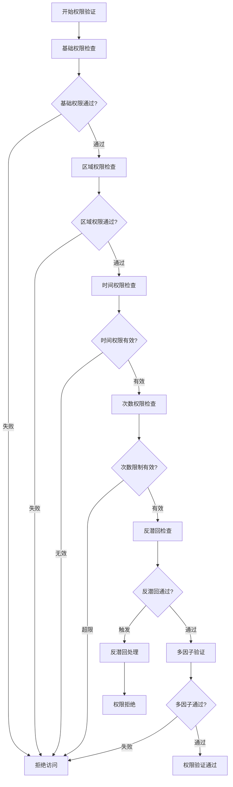

### 3.4 异常处理流程

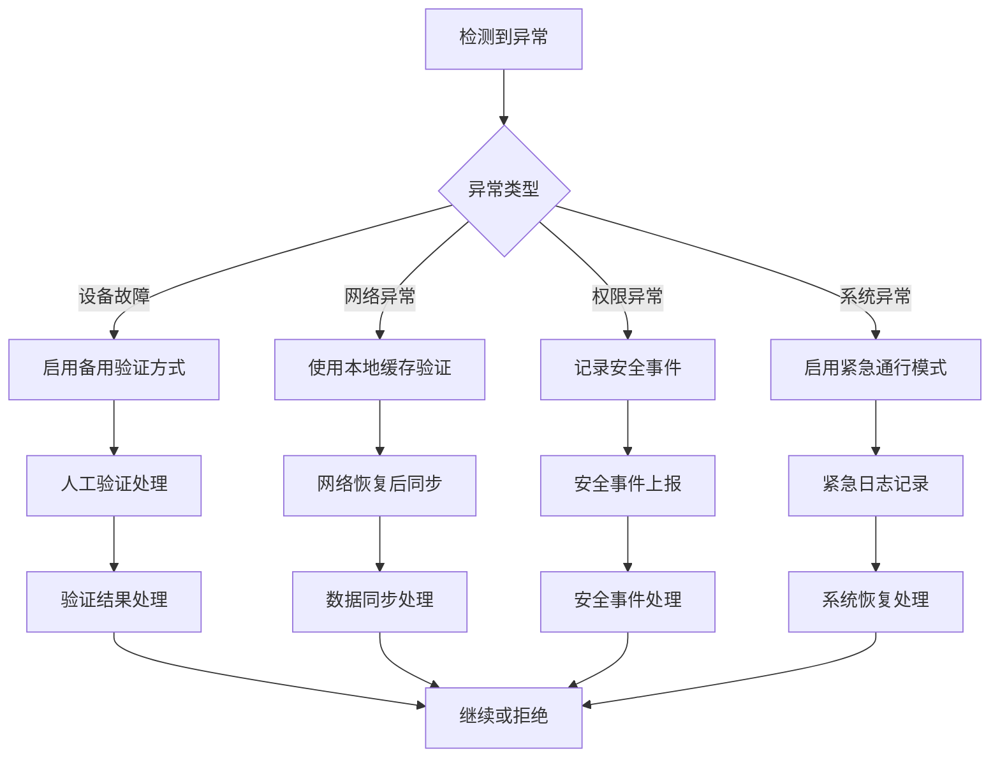

---

## 🔐 4. 访客权限管理流程图

### 4.1 流程概述
**流程名称**: 访客权限动态管理流程
**流程类型**: 管理流程
**预计时长**: 实时
**涉及角色**: 管理员、被访者、访客

### 4.2 详细流程图

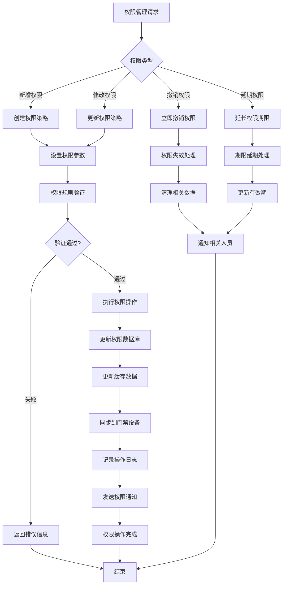

### 4.3 权限参数配置流程

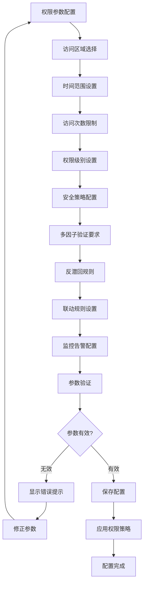

---

## 🚨 5. 访客黑名单流程图

### 5.1 流程概述
**流程名称**: 访客黑名单管理流程
**流程类型**: 安全管理流程
**预计时长**: 实时
**涉及角色**: 安全员、管理员、系统

### 5.2 详细流程图

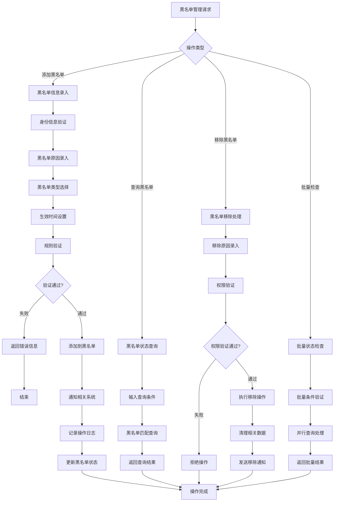

### 5.3 黑名单类型决策流程

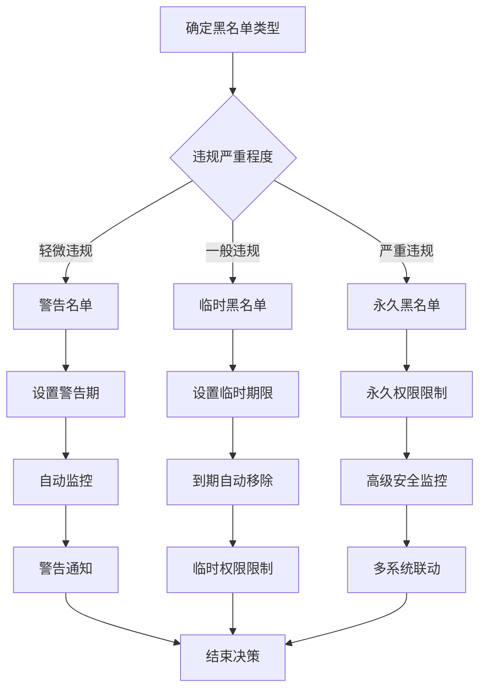

---

## 📍 6. 访客轨迹追踪流程图

### 6.1 流程概述
**流程名称**: 访客全程轨迹追踪流程
**流程类型**: 监控分析流程
**预计时长**: 实时
**涉及角色**: 安保人员、监控系统、分析引擎

### 6.2 详细流程图

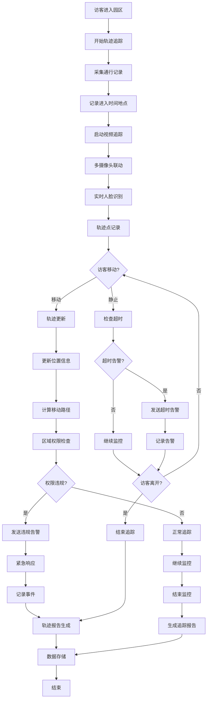

### 6.3 智能分析流程

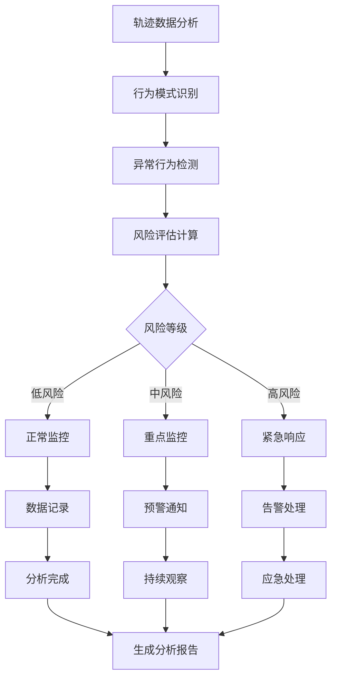

---

## 📊 7. 流程图使用说明

### 7.1 流程图符号说明

| 符号 | 含义 | 说明 |
|------|------|------|
| ⭕️ | 开始/结束 | 流程的起点或终点 |
| ▢ | 操作步骤 | 具体的业务操作 |
| 🔶 | 判断条件 | 需要决策的节点 |
| ⬆ | 数据流向 | 流程执行方向 |
| 🔴 | 异常/错误 | 异常情况处理 |
| 🟡 | 警告/提示 | 需要关注的事件 |

### 7.2 颜色说明

| 颜色 | 状态 | 含义 |
|------|------|------|
| 🟢 | 已实现 | 功能已完成开发 |
| 🟡 | 部分实现 | 功能部分完成 |
| 🔴 | 未实现 | 功能尚未实现 |
| 🔵 | 计划中 | 计划后续实现 |

### 7.3 使用建议

1. **流程执行顺序**: 按照优先级顺序执行相关流程
2. **异常处理**: 每个流程都包含完整的异常处理机制
3. **系统集成**: 注意流程间的数据传递和状态同步
4. **性能优化**: 关键节点需要考虑性能和并发处理
5. **安全防护**: 所有身份验证环节都需要多重防护

---

## 🔗 8. 集成关系图

### 8.1 系统间集成

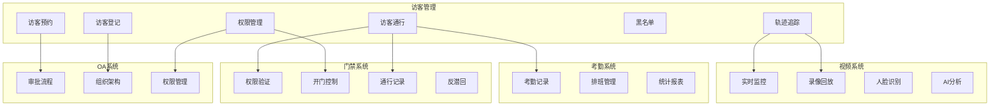

### 8.2 数据流向

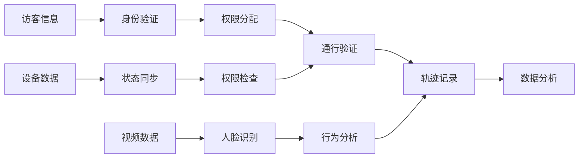

---

## 📝 9. 文档维护

### 9.1 版本控制

- **当前版本**: v1.0.0
- **维护责任**: 访客模块团队
- **审核周期**: 每月一次
- **更新触发**: 业务流程变更时

### 9.2 更新日志

| 版本 | 日期 | 更新内容 | 更新人 |
|------|------|----------|--------|
| v1.0.0 | 2025-12-16 | 初始版本创建 | Claude AI |

### 9.3 相关文档

- [访客模块架构设计](./VISITOR_ARCHITECTURE_DESIGN.md)
- [访客数据库设计](./VISITOR_DATABASE_DESIGN.md)
- [访客API接口文档](./VISITOR_API_DOCUMENTATION.md)
- [访客前端设计规范](./VISITOR_FRONTEND_DESIGN.md)

---

**📞 技术支持**: IOE-DREAM开发团队
**📧 邮件地址**: support@ioedream.com
**🌐 项目地址**: https://github.com/IOE-DREAM/visitor-service