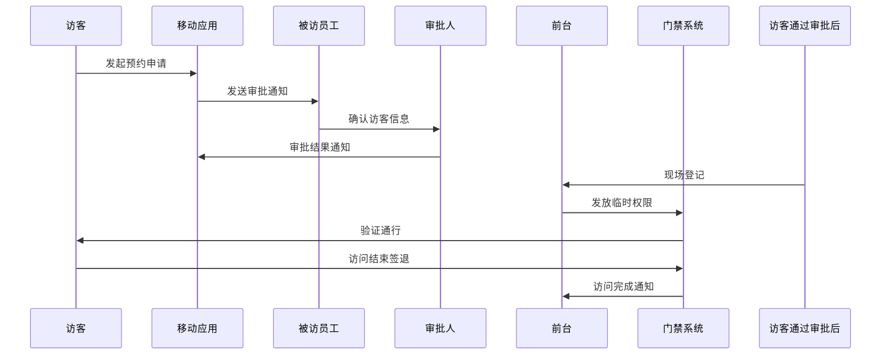

# IOE-DREAM 访客管理业务指南

**文档版本**: v2.0.0
**更新日期**: 2025-12-16
**业务模块**: 访客管理
**服务名称**: ioedream-visitor-service
**端口**: 8095

---

## 📋 业务概述

### 业务定义
访客管理是IOE-DREAM智慧园区管理平台的核心业务模块之一，提供完整的访客生命周期管理功能，包括访客预约、身份验证、权限控制、轨迹追踪等核心功能。

### 业务价值
- **安全管控**: 多重身份验证，确保园区安全
- **体验优化**: 在线预约，减少等待时间
- **效率提升**: 自动化流程，提高管理效率
- **数据洞察**: 访客数据分析，支持决策优化

### 核心特性
- ✅ **多模态生物识别**: 人脸、指纹、虹膜识别
- ✅ **在线预约系统**: 移动端预约，审批流程自动化
- ✅ **智能权限控制**: 动态权限分配，区域访问控制
- ✅ **实时轨迹追踪**: 全程监控，异常行为检测
- ✅ **多系统集成**: 门禁、视频、OA系统无缝集成

---

## 🎯 业务场景

### 1. 企业访客管理场景

#### 场景描述
企业需要管理外来访客（客户、合作伙伴、供应商等）的访问权限，确保安全的同时提供良好的访问体验。

#### 业务流程


#### 关键功能
- **在线预约**: 访客通过移动端提前预约
- **审批流程**: 多级审批，确保合规性
- **身份验证**: 多模态生物识别验证
- **权限控制**: 时间、区域、设备权限管理
- **轨迹追踪**: 实时监控访客位置

### 2. 智慧园区访客管理场景

#### 场景描述
大型智慧园区包含办公区、生产区、仓储区等多个功能区域，需要对不同区域的访客进行差异化管理。

#### 业务特点
- **区域分级**: 按安全等级划分访问区域
- **权限差异**: 不同区域不同权限要求
- **多系统集成**: 门禁、监控、考勤系统联动
- **数据分析**: 访客流量统计和行为分析

### 3. 高安全场景访客管理

#### 场景描述
涉及敏感信息或重要资产的区域（如研发中心、数据中心）需要更高级别的安全管控。

#### 安全措施
- **多重验证**: 身份证+人脸+指纹三重验证
- **陪同制度**: 敏感区域需要员工陪同
- **实时监控**: 视频全程跟踪，异常告警
- **黑名单管理**: 违规访客自动限制访问

---

## 🏗️ 系统架构

### 微服务架构

```
ioedream-visitor-service (8095)
├── visitor-mobile-controller/     # 移动端API
├── visitor-pc-controller/         # PC端API
├── visitor-service/               # 业务服务层
├── visitor-manager/               # 业务编排层
├── visitor-dao/                   # 数据访问层
└── integration/
    ├── access-service/            # 门禁系统集成
    ├── video-service/             # 视频系统集成
    ├── oa-service/                # OA系统集成
    └── notification-service/      # 通知系统集成
```

### 技术栈
- **后端框架**: Spring Boot 3.5.8
- **数据库**: MySQL 8.0 + MyBatis-Plus 3.5.15
- **缓存**: Redis (访问权限缓存)
- **消息队列**: RabbitMQ (异步通知)
- **认证**: Sa-Token + JWT
- **API文档**: Knife4j (Swagger)

### 部署架构
- **容器化**: Docker + Kubernetes
- **负载均衡**: Nginx
- **监控**: Prometheus + Grafana
- **日志**: ELK Stack

---

## 📊 业务数据模型

### 核心实体

#### 1. 访客预约实体 (VisitorAppointmentEntity)
```java
@Entity
@Table(name = "t_visitor_appointment")
public class VisitorAppointmentEntity extends BaseEntity {
    @TableId(type = IdType.ASSIGN_ID)
    private Long appointmentId;           // 预约ID

    @NotBlank
    @Size(max = 100)
    @TableField("appointment_no")
    private String appointmentNo;          // 预约编号

    @NotBlank
    @Size(max = 50)
    @TableField("visitor_name")
    private String visitorName;            // 访客姓名

    @NotBlank
    @Pattern(regexp = "^1[3-9]\\d{9}$")
    @TableField("visitor_phone")
    private String visitorPhone;           // 访客手机号

    @TableField("visitor_id_card")
    private String visitorIdCard;         // 访客身份证号

    @NotNull
    @TableField("host_user_id")
    private Long hostUserId;               // 接待人用户ID

    @TableField("host_name")
    private String hostName;               // 接待人姓名

    @NotBlank
    @Size(max = 500)
    @TableField("visit_purpose")
    private String visitPurpose;           // 访问目的

    @NotNull
    @TableField("visit_date")
    private LocalDate visitDate;            // 访问日期

    @NotNull
    @TableField("visit_start_time")
    private LocalTime visitStartTime;      // 访问开始时间

    @NotNull
    @TableField("visit_end_time")
    private LocalTime visitEndTime;        // 访问结束时间

    @TableField("area_ids")
    private String areaIds;                // 访问区域ID列表(JSON)

    @TableField("device_ids")
    private String deviceIds;              // 访问设备ID列表(JSON)

    @TableField("status")
    private Integer status;                // 状态(1-待审批 2-已通过 3-已拒绝 4-已完成)

    @TableField("check_in_time")
    private LocalDateTime checkInTime;      // 签到时间

    @TableField("check_out_time")
    private LocalDateTime checkOutTime;     // 签退时间

    @TableField("qr_code")
    private String qrCode;                 // 二维码

    @Size(max = 1000)
    @TableField("remark")
    private String remark;                 // 备注

    @TableField("attachments")
    private String attachments;            // 附件URL列表(JSON)
}
```

#### 2. 访客记录实体 (VisitorRecordEntity)
```java
@Entity
@Table(name = "t_visitor_record")
public class VisitorRecordEntity extends BaseEntity {
    @TableId(type = IdType.ASSIGN_ID)
    private Long recordId;                  // 记录ID

    @NotNull
    @TableField("appointment_id")
    private Long appointmentId;             // 预约ID

    @NotNull
    @TableField("visitor_name")
    private String visitorName;             // 访客姓名

    @NotNull
    @TableField("visitor_phone")
    private String visitorPhone;            // 访客手机号

    @TableField("visitor_id_card")
    private String visitorIdCard;          // 访客身份证号

    @NotNull
    @TableField("host_user_id")
    private Long hostUserId;                // 接待人用户ID

    @TableField("host_name")
    private String hostName;                // 接待人姓名

    @NotNull
    @TableField("access_time")
    private LocalDateTime accessTime;       // 通行时间

    @NotNull
    @TableField("access_type")
    private Integer accessType;             // 通行类型(1-进入 2-离开)

    @NotNull
    @TableField("device_id")
    private Long deviceId;                  // 设备ID

    @TableField("device_name")
    private String deviceName;              // 设备名称

    @TableField("area_id")
    private Long areaId;                    // 区域ID

    @TableField("area_name")
    private String areaName;                // 区域名称

    @TableField("verify_method")
    private Integer verifyMethod;           // 验证方式(1-刷卡 2-扫码 3-人脸)

    @TableField("verify_result")
    private Integer verifyResult;           // 验证结果(1-成功 0-失败)

    @TableField("fail_reason")
    private String failReason;              // 失败原因

    @TableField("photo_url")
    private String photoUrl;                // 照片URL

    @TableField("location_info")
    private String locationInfo;            // 位置信息(JSON)
}
```

#### 3. 访客黑名单实体 (VisitorBlacklistEntity)
```java
@Entity
@Table(name = "t_visitor_blacklist")
public class VisitorBlacklistEntity extends BaseEntity {
    @TableId(type = IdType.ASSIGN_ID)
    private Long blacklistId;               // 黑名单ID

    @NotBlank
    @Size(max = 100)
    @TableField("visitor_name")
    private String visitorName;             // 访客姓名

    @Pattern(regexp = "^1[3-9]\\d{9}$")
    @TableField("visitor_phone")
    private String visitorPhone;            // 访客手机号

    @TableField("visitor_id_card")
    private String visitorIdCard;          // 访客身份证号

    @NotNull
    @TableField("blacklist_type")
    private Integer blacklistType;          // 黑名单类型(1-警告 2-临时 3-永久)

    @NotNull
    @Size(max = 1000)
    @TableField("reason")
    private String reason;                  // 加入原因

    @TableField("effective_time")
    private LocalDateTime effectiveTime;    // 生效时间

    @TableField("expire_time")
    private LocalDateTime expireTime;       // 失效时间

    @NotNull
    @TableField("status")
    private Integer status;                // 状态(1-生效 0-失效)

    @TableField("operator_id")
    private Long operatorId;                // 操作人ID

    @TableField("operator_name")
    private String operatorName;            // 操作人姓名
}
```

---

## 🔧 业务功能详解

### 1. 访客预约管理

#### 1.1 在线预约
**功能描述**: 访客通过移动端应用提交预约申请，包含个人信息、访问事由、访问时间等。

**关键流程**:
1. 访客填写预约信息
2. 系统验证信息完整性
3. 发送审批通知给被访员工
4. 审批人确认访客信息
5. 审批结果通知访客
6. 生成访问凭证（二维码）

**业务规则**:
- 预约时间必须在工作时间内
- 敏感区域访问需要额外审批
- 单日访问次数有限制
- 预约可提前取消或修改

#### 1.2 审批流程
**功能描述**: 多级审批流程，确保访客访问合规性。

**审批类型**:
- **自动审批**: 普通访客，非敏感区域
- **一级审批**: 部门内部访客
- **二级审批**: 跨部门访客
- **特殊审批**: 敏感区域访问

**审批规则**:
- 被访员工有第一审批权
- 部门主管有最终审批权
- 特殊区域需要安全部门审批
- 审批时限：24小时内响应

### 2. 身份验证管理

#### 2.1 多模态验证
**功能描述**: 支持多种身份验证方式，确保身份准确性。

**验证方式**:
- **人脸识别**: 1:N人脸比对，准确率99.5%
- **指纹验证**: 指纹特征匹配，防假指纹
- **虹膜识别**: 高精度生物识别
- **身份证验证**: OCR识别+公安系统验证
- **二维码验证**: 动态二维码，防伪造

**验证流程**:
1. 采集生物特征信息
2. 活体检测防伪
3. 特征提取比对
4. 相似度评分
5. 验证结果确认

#### 2.2 活体检测
**功能描述**: 防止照片、视频、硅胶面具等攻击手段。

**检测技术**:
- **动作检测**: 眨眼、张嘴、摇头
- **3D结构光**: 深度信息分析
- **红外检测**: 真实体温感知
- **微表情分析**: 自然的表情变化

### 3. 权限控制管理

#### 3.1 动态权限分配
**功能描述**: 根据访客类型、访问目的、访问区域动态分配权限。

**权限维度**:
- **时间权限**: 访问时间段控制
- **区域权限**: 可访问区域范围
- **设备权限**: 可通行的门禁设备
- **次数权限**: 访问次数限制
- **功能权限**: 特殊功能访问权限

**权限策略**:
```java
// 权限策略配置示例
{
  "timePermission": {
    "startTime": "09:00",
    "endTime": "18:00",
    "workingDays": [1, 2, 3, 4, 5]
  },
  "areaPermission": {
    "allowedAreas": [101, 102, 103],
    "restrictedAreas": [201, 202],
    "requireEscort": [301, 302]
  },
  "devicePermission": {
    "allowedDevices": [1001, 1002, 1003],
    "verifyMethods": ["FACE", "CARD", "QR_CODE"]
  },
  "countPermission": {
    "maxVisits": 3,
    "maxDuration": 240,  // 分钟
    "cooldownPeriod": 30   // 分钟
  }
}
```

#### 3.2 反潜回控制
**功能描述**: 防止访客将卡片交给他人使用或逆向通行。

**反潜回规则**:
- **时间反潜**: 合理通行时间间隔检查
- **位置反潜**: 空间位置逻辑验证
- **方向反潜**: 通行方向一致性检查
- **次数反潜**: 异常通行次数检测

### 4. 轨迹追踪管理

#### 4.1 实时定位
**功能描述**: 通过多系统联动，实时追踪访客位置。

**定位技术**:
- **WiFi定位**: 室内精准定位
- **蓝牙Beacon**: 高精度区域定位
- **视频追踪**: 人脸识别位置追踪
- **门禁记录**: 通行点位置记录

#### 4.2 行为分析
**功能描述**: 基于轨迹数据进行访客行为分析。

**分析维度**:
- **停留分析**: 异常长时间停留检测
- **路径分析**: 偏离预设路径告警
- **访问分析**: 频繁访问敏感区域检测
- **聚集分析**: 多人聚集异常检测

**告警机制**:
```java
// 异常行为检测配置
{
  "abnormalStay": {
    "maxStayTime": 1800,  // 秒
    "sensitiveAreas": [301, 302]
  },
  "pathDeviation": {
    "maxDeviationDistance": 50,  // 米
    "requirePatrol": true
  },
  "frequentAccess": {
    "maxAccessCount": 5,
    "timeWindow": 3600  // 秒
  },
  "groupGathering": {
    "maxGroupSize": 3,
    "sensitiveAreas": [201, 202]
  }
}
```

---

## 📱 移动端应用

### 功能模块
1. **预约管理**: 在线预约、预约查询、预约取消
2. **签到签退**: 现场签到、离开签退、位置确认
3. **访客查询**: 访客记录搜索、预约状态查询
4. **通知中心**: 预约通知、审批结果、安全提醒
5. **个人中心**: 个人信息、访问历史、设置管理

### 技术实现
- **框架**: UniApp 3.0 + Vue 3
- **UI组件**: uni-ui
- **状态管理**: Pinia
- **网络请求**: uni.request + 适配器
- **本地存储**: uni.setStorage
- **生物识别**: uni.biometric

### 关键页面
```vue
<!-- 预约申请页面 -->
<template>
  <view class="appointment-form">
    <uni-forms ref="form" :model="formData" :rules="rules">
      <uni-forms-item label="访客姓名" name="visitorName" required>
        <uni-easyinput v-model="formData.visitorName" placeholder="请输入访客姓名" />
      </uni-forms-item>

      <uni-forms-item label="手机号码" name="visitorPhone" required>
        <uni-easyinput v-model="formData.visitorPhone" type="number" placeholder="请输入手机号码" />
      </uni-forms-item>

      <uni-forms-item label="访问事由" name="visitPurpose" required>
        <uni-textarea v-model="formData.visitPurpose" placeholder="请输入访问事由" />
      </uni-forms-item>

      <uni-forms-item label="访问时间" name="visitDateTime" required>
        <uni-datetime-picker
          v-model="formData.visitDateTime"
          type="datetime"
          :start="startTime"
          :end="endTime" />
      </uni-forms-item>
    </uni-forms>

    <view class="submit-btn">
      <button type="primary" @click="submitAppointment">提交预约</button>
    </view>
  </view>
</template>
```

---

## 💻 PC端管理

### 功能模块
1. **访客管理**: 访客记录查询、信息维护
2. **预约审批**: 预约申请处理、批量审批
3. **权限管理**: 权限策略配置、权限分配
4. **黑名单管理**: 黑名单维护、策略配置
5. **统计报表**: 访客统计、趋势分析、异常报告
6. **系统设置**: 参数配置、策略管理、设备管理

### 关键界面
- **访客列表**: 分页查询、高级搜索、批量操作
- **审批工作台**: 待处理事项、批量审批、审批历史
- **监控大屏**: 实时访客状态、异常告警、统计数据
- **报表中心**: 图表展示、数据导出、趋势分析

---

## 🔗 系统集成

### 1. 门禁系统集成
**集成方式**: HTTP API + WebSocket
**核心功能**:
- 权限下发到门禁设备
- 实时接收通行记录
- 设备状态监控
- 远程开门控制

### 2. 视频系统集成
**集成方式**: SDK + HTTP API
**核心功能**:
- 实时视频流获取
- 人脸识别比对
- 轨迹追踪分析
- 录像回放查询

### 3. OA系统集成
**集成方式**: HTTP API
**核心功能**:
- 员工信息同步
- 组织架构获取
- 审批流程集成
- 权限验证

### 4. 通知系统集成
**集成方式**: 消息队列 + HTTP API
**核心功能**:
- 短信通知发送
- 邮件通知发送
- 推送通知发送
- 微信通知发送

---

## 📊 业务分析

### 1. 访客流量分析
- **日流量统计**: 每日访客数量趋势
- **时段分析**: 高峰时段识别
- **区域分析**: 热点访问区域
- **部门分析**: 各部门访客分布

### 2. 访客行为分析
- **停留时间**: 平均停留时间统计
- **访问频率**: 重复访客分析
- **访问模式**: 行为模式识别
- **异常检测**: 异常行为预警

### 3. 效率分析
- **预约效率**: 预约到访率
- **审批效率**: 平均审批时间
- **通关效率**: 平均验证时间
- **满意度**: 访客满意度调查

---

## 🔒 安全管控

### 1. 数据安全
- **数据加密**: 敏感数据AES256加密
- **访问控制**: 基于角色的数据访问
- **操作审计**: 完整的操作日志记录
- **数据备份**: 定期数据备份策略

### 2. 系统安全
- **接口安全**: JWT Token认证
- **传输安全**: HTTPS加密传输
- **输入验证**: 严格的参数验证
- **防攻击**: SQL注入、XSS攻击防护

### 3. 业务安全
- **身份验证**: 多因子身份验证
- **权限控制**: 最小权限原则
- **异常监控**: 实时异常行为检测
- **黑名单**: 违规访客限制机制

---

## 📈 性能优化

### 1. 数据库优化
- **索引优化**: 关键字段建立索引
- **分库分表**: 大数据量分表存储
- **读写分离**: 主从数据库配置
- **缓存策略**: Redis缓存热点数据

### 2. 接口优化
- **并发控制**: 线程池优化配置
- **响应优化**: 接口响应时间优化
- **数据压缩**: 响应数据压缩
- **CDN加速**: 静态资源CDN分发

### 3. 系统优化
- **负载均衡**: 多实例负载均衡
- **资源优化**: JVM参数调优
- **监控告警**: 系统性能监控
- **容错机制**: 降级熔断保护

---

## 🚀 运维监控

### 1. 系统监控
- **服务监控**: 微服务健康状态
- **性能监控**: JVM、数据库性能
- **业务监控**: 关键业务指标
- **异常监控**: 错误率、告警信息

### 2. 日志管理
- **日志收集**: ELK Stack日志收集
- **日志分析**: 日志检索分析
- **日志归档**: 历史日志归档
- **日志告警**: 关键日志告警

### 3. 运维工具
- **部署自动化**: CI/CD流水线
- **配置管理**: 配置中心管理
- **版本管理**: 应用版本控制
- **故障恢复**: 快速故障恢复

---

## 📋 运营管理

### 1. 用户培训
- **管理员培训**: 系统管理功能培训
- **员工培训**: 日常操作使用培训
- **访客指南**: 访客使用说明
- **FAQ文档**: 常见问题解答

### 2. 系统维护
- **日常维护**: 系统健康检查
- **定期升级**: 系统版本升级
- **数据维护**: 数据清理维护
- **安全检查**: 定期安全检查

### 3. 持续优化
- **用户反馈**: 收集用户反馈意见
- **需求分析**: 分析业务需求变化
- **功能优化**: 持续功能迭代优化
- **性能优化**: 系统性能持续优化

---

## 🔮 未来规划

### 1. 技术升级
- **AI智能化**: 引入更多AI算法
- **边缘计算**: 边缘设备部署
- **5G应用**: 5G网络优化
- **物联网**: IoT设备集成

### 2. 功能扩展
- **访客自助**: 自助服务终端
- **VIP通道**: 重要访客通道
- **多语言**: 国际化支持
- **移动办公**: 移动端管理

### 3. 生态建设
- **第三方集成**: 更多系统集成
- **开放API**: API开放平台
- **合作伙伴**: 生态合作
- **标准制定**: 行业标准制定

---

## 📞 支持与服务

### 技术支持
- **在线支持**: 7x24小时在线支持
- **电话支持**: 工作时间电话支持
- **远程协助**: 远程技术协助
- **现场服务**: 必要时现场服务

### 服务保障
- **SLA保障**: 服务级别协议
- **故障响应**: 快速故障响应
- **数据保障**: 数据安全保障
- **服务升级**: 持续服务升级

---

**文档维护**: IOE-DREAM访客管理团队
**最后更新**: 2025-12-16
**版本**: v2.0.0
**审核状态**: 已审核