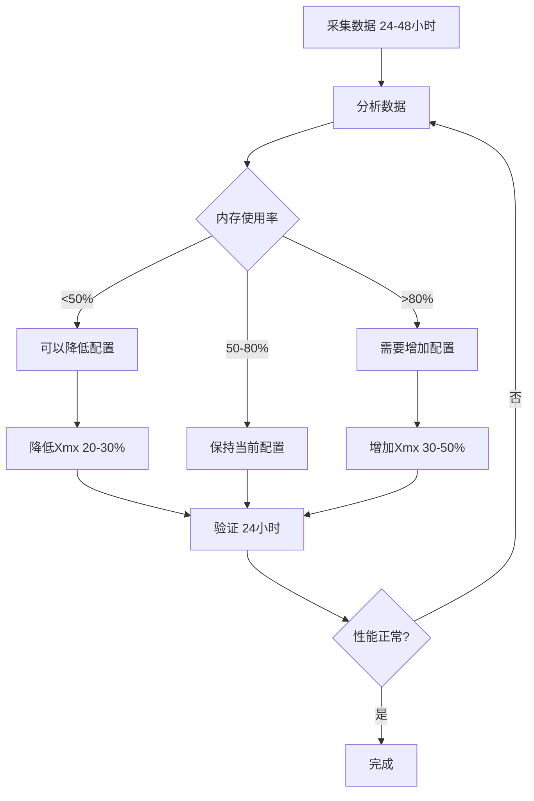

# 内存数据采集与配置微调指南

## 一、数据采集工具使用

### 1.1 快速开始

```powershell
# 快照模式 - 立即查看当前内存状态
.\scripts\memory-monitor-enterprise.ps1 -Mode snapshot

# 持续监控模式 - 每30秒采集一次，持续1小时
.\scripts\memory-monitor-enterprise.ps1 -Mode continuous -Interval 30 -Duration 3600

# 分析模式 - 分析采集的数据
.\scripts\memory-monitor-enterprise.ps1 -Mode analyze -DataFile logs\memory-data.csv

# 报告模式 - 生成Markdown报告
.\scripts\memory-monitor-enterprise.ps1 -Mode report -DataFile logs\memory-data.csv
```

### 1.2 参数说明

| 参数 | 默认值 | 说明 |
|------|--------|------|
| `-Mode` | continuous | 模式：continuous/snapshot/analyze/report |
| `-Interval` | 30 | 采集间隔（秒） |
| `-Duration` | 3600 | 持续时间（秒） |
| `-DataFile` | logs\memory-data.csv | 数据保存路径 |
| `-WarningThresholdMB` | 1024 | 单服务警告阈值 |
| `-CriticalThresholdMB` | 2048 | 单服务严重警告阈值 |
| `-TotalWarningThresholdGB` | 12 | 总内存警告阈值 |
| `-EnableAlert` | false | 启用告警记录 |

### 1.3 推荐采集策略

#### 开发环境
```powershell
# 快速采集，5分钟
.\scripts\memory-monitor-enterprise.ps1 -Mode continuous -Interval 10 -Duration 300
```

#### 测试环境
```powershell
# 中等采集，30分钟
.\scripts\memory-monitor-enterprise.ps1 -Mode continuous -Interval 30 -Duration 1800
```

#### 生产环境
```powershell
# 长时间采集，24小时
.\scripts\memory-monitor-enterprise.ps1 -Mode continuous -Interval 60 -Duration 86400 -EnableAlert
```

---

## 二、数据分析方法

### 2.1 CSV数据格式

```csv
Timestamp,PID,ServiceName,MemoryMB,CPUPercent,ThreadCount,HandleCount
2025-12-15 10:00:00,12345,Gateway,450,5.2,120,350
2025-12-15 10:00:00,12346,Access,380,2.1,95,280
...
```

### 2.2 关键指标分析

| 指标 | 健康范围 | 警告范围 | 危险范围 |
|------|---------|---------|---------|
| 单服务内存 | <512MB | 512-1024MB | >1024MB |
| 总内存 | <8GB | 8-12GB | >12GB |
| 线程数 | <150 | 150-300 | >300 |
| CPU使用率 | <30% | 30-70% | >70% |

### 2.3 分析命令

```powershell
# 自动分析并生成配置建议
.\scripts\memory-monitor-enterprise.ps1 -Mode analyze -DataFile logs\memory-data.csv
```

**输出示例**：
```
============================================================
 内存数据分析报告
============================================================

服务名          最小(MB)    最大(MB)    平均(MB)    建议配置
----------------------------------------------------------------------
Gateway         380         520         450         512 MB
Access          300         450         380         512 MB
Attendance      280         420         350         512 MB
Consume         450         780         600         768 MB
OA              400         650         520         768 MB
Visitor         250         380         320         512 MB
Video           500         850         680         1024 MB
Device          280         400         340         512 MB

============================================================
 配置建议
============================================================

# Gateway 服务配置建议：
spring:
  application:
    java-opts: >-
      -Xms256m
      -Xmx512m
...
```

---

## 三、配置微调指南

### 3.1 微调原则

1. **基于数据**：所有配置调整必须基于实际监控数据
2. **保守调整**：每次调整不超过30%
3. **逐步验证**：调整后至少观察24小时
4. **留有余量**：生产环境配置 = 平均值 × 1.5

### 3.2 配置调整流程



### 3.3 各服务配置建议模板

根据监控数据，使用以下公式计算配置：

```
Xmx = ceil(平均内存使用 × 1.5 / 256) × 256
Xms = Xmx / 2
```

#### Gateway服务（轻量级）
```yaml
# 适用于实际平均内存 < 400MB
spring:
  application:
    java-opts: >-
      -Xms${JVM_HEAP_MIN:-256m}
      -Xmx${JVM_HEAP_MAX:-512m}
      -XX:MaxMetaspaceSize=128m
      -XX:MetaspaceSize=64m
      -XX:+UseG1GC
      -XX:+UseStringDeduplication
```

#### 业务服务（标准）
```yaml
# 适用于实际平均内存 400-600MB
spring:
  application:
    java-opts: >-
      -Xms${JVM_HEAP_MIN:-256m}
      -Xmx${JVM_HEAP_MAX:-768m}
      -XX:MaxMetaspaceSize=192m
      -XX:MetaspaceSize=96m
      -XX:+UseG1GC
      -XX:+UseStringDeduplication
```

#### 核心服务（重量级）
```yaml
# 适用于实际平均内存 > 600MB
spring:
  application:
    java-opts: >-
      -Xms${JVM_HEAP_MIN:-512m}
      -Xmx${JVM_HEAP_MAX:-1536m}
      -XX:MaxMetaspaceSize=256m
      -XX:MetaspaceSize=128m
      -XX:+UseG1GC
      -XX:+UseStringDeduplication
      -XX:MaxGCPauseMillis=200
```

### 3.4 配置文件位置

| 服务 | 配置文件路径 |
|------|------------|
| gateway | `ioedream-gateway-service/src/main/resources/bootstrap.yml` |
| access | `ioedream-access-service/src/main/resources/bootstrap.yml` |
| attendance | `ioedream-attendance-service/src/main/resources/bootstrap.yml` |
| consume | `ioedream-consume-service/src/main/resources/bootstrap.yml` |
| oa | `ioedream-oa-service/src/main/resources/bootstrap.yml` |
| visitor | `ioedream-visitor-service/src/main/resources/bootstrap.yml` |
| video | `ioedream-video-service/src/main/resources/bootstrap.yml` |
| device | `ioedream-device-comm-service/src/main/resources/bootstrap.yml` |
| common | `ioedream-common-service/src/main/resources/bootstrap.yml` |

### 3.5 Docker配置调整

**docker-compose-dev.yml**：
```yaml
services:
  service-name:
    deploy:
      resources:
        limits:
          memory: ${MEMORY_LIMIT:-1G}  # 根据监控数据调整
        reservations:
          memory: ${MEMORY_RESERVE:-512M}
```

**调整公式**：
```
Docker memory limit = Xmx × 1.5 + 256MB（系统开销）
```

---

## 四、常见问题处理

### 4.1 内存持续增长

**症状**：内存使用持续上升，不回落

**可能原因**：
1. 内存泄漏
2. 缓存未设置过期
3. 连接池泄漏

**解决方案**：
```powershell
# 1. 启用GC日志
-Xlog:gc*:file=logs/gc.log

# 2. 生成堆转储
jmap -dump:format=b,file=heap.hprof <PID>

# 3. 分析堆转储
jhat heap.hprof
# 或使用 Eclipse MAT
```

### 4.2 GC频繁

**症状**：CPU使用率高，响应变慢

**可能原因**：
1. 堆内存配置过小
2. 对象创建过多

**解决方案**：
```yaml
# 增加堆内存
-Xmx1024m

# 调整G1参数
-XX:MaxGCPauseMillis=200
-XX:G1HeapRegionSize=16m
```

### 4.3 启动缓慢

**症状**：服务启动时间过长

**可能原因**：
1. Bean加载过多
2. 初始内存分配大

**解决方案**：
```yaml
# 降低初始堆内存
-Xms256m

# 启用Bean懒加载
spring:
  main:
    lazy-initialization: true
```

---

## 五、监控告警配置

### 5.1 Prometheus指标

服务已暴露以下JVM指标：

```
# JVM内存
jvm_memory_used_bytes
jvm_memory_max_bytes
jvm_memory_committed_bytes

# GC
jvm_gc_pause_seconds_count
jvm_gc_pause_seconds_sum

# 线程
jvm_threads_live_threads
jvm_threads_daemon_threads
```

### 5.2 Grafana告警规则

```yaml
# 内存使用率告警
- alert: HighMemoryUsage
  expr: jvm_memory_used_bytes / jvm_memory_max_bytes > 0.8
  for: 5m
  labels:
    severity: warning
  annotations:
    summary: "JVM内存使用率过高"
    description: "{{ $labels.application }} 内存使用率超过80%"

# GC频率告警
- alert: HighGCFrequency
  expr: rate(jvm_gc_pause_seconds_count[5m]) > 1
  for: 5m
  labels:
    severity: warning
  annotations:
    summary: "GC频率过高"
    description: "{{ $labels.application }} GC频率超过1次/秒"
```

---

## 六、最佳实践

### 6.1 监控频率

| 环境 | 采集间隔 | 保留时间 |
|------|---------|---------|
| 开发 | 10秒 | 1天 |
| 测试 | 30秒 | 7天 |
| 生产 | 60秒 | 30天 |

### 6.2 告警阈值

| 指标 | 警告 | 严重 |
|------|------|------|
| 单服务内存 | 80% | 90% |
| 总内存 | 10GB | 12GB |
| GC停顿 | 500ms | 1000ms |

### 6.3 配置审核

每月审核一次配置，根据最新数据调整：

1. 导出过去30天的监控数据
2. 分析各服务内存使用趋势
3. 根据趋势调整配置
4. 记录调整历史

---

**文档版本**: v1.0.0  
**更新时间**: 2025-12-15  
**作者**: IOE-DREAM架构团队
