# 设备通讯管理流程图

> **文档版本**: v1.0.0
> **创建时间**: 2025-12-16
> **适用范围**: IOE-DREAM智能管理系统设备通讯服务
> **设计原则**: 组件化、可扩展、高可靠、厂商兼容

## 📋 流程图总览

本文档详细描述了IOE-DREAM设备通讯管理的完整流程，包括多厂商设备接入、协议适配、业务处理、状态监控等核心环节。

---

## 1. 设备接入总体架构流程图

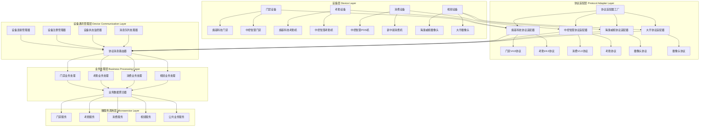

---

## 2. 设备注册与认证流程图

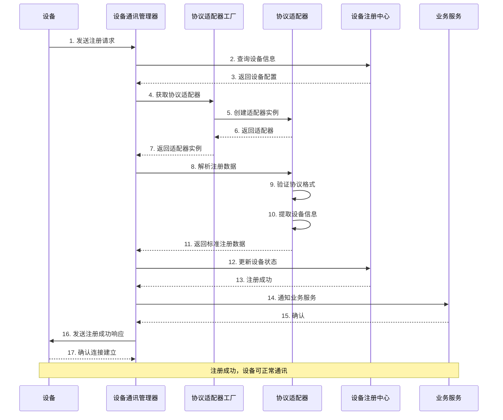

---

## 3. 设备业务消息处理流程图

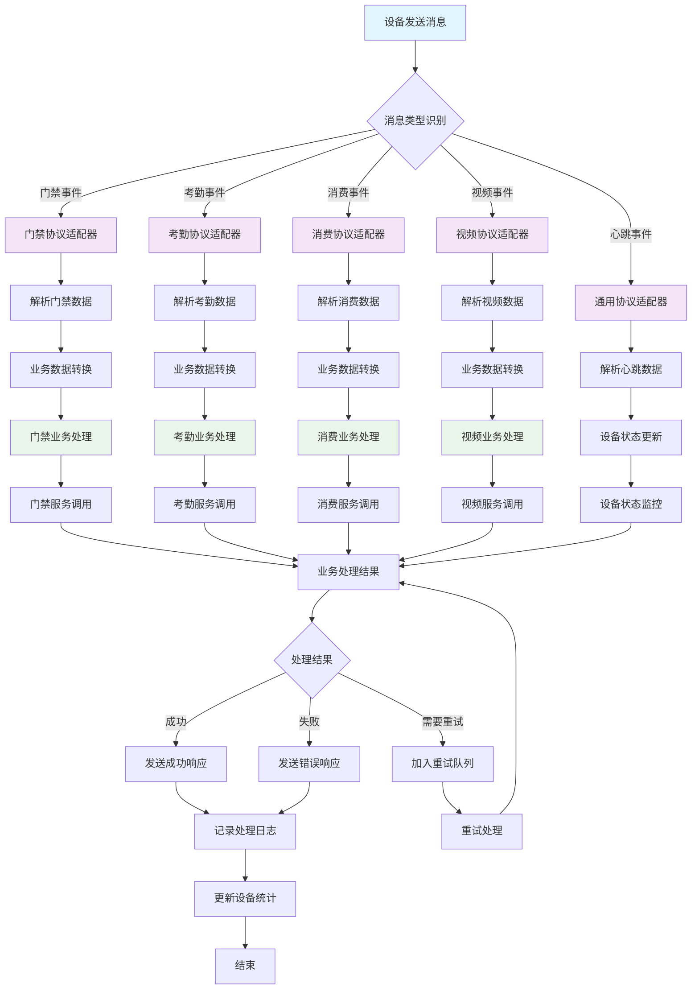

---

## 4. 协议适配器工厂模式流程图

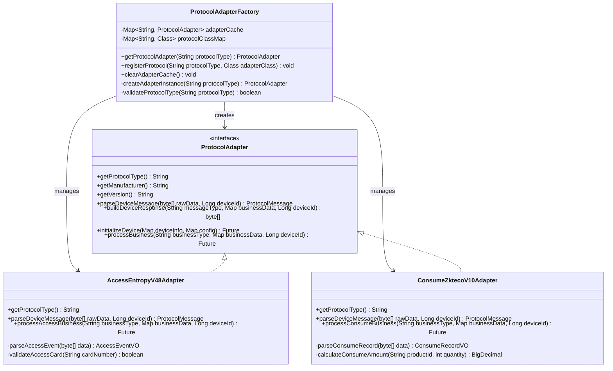

---

## 5. 设备状态监控与告警流程图

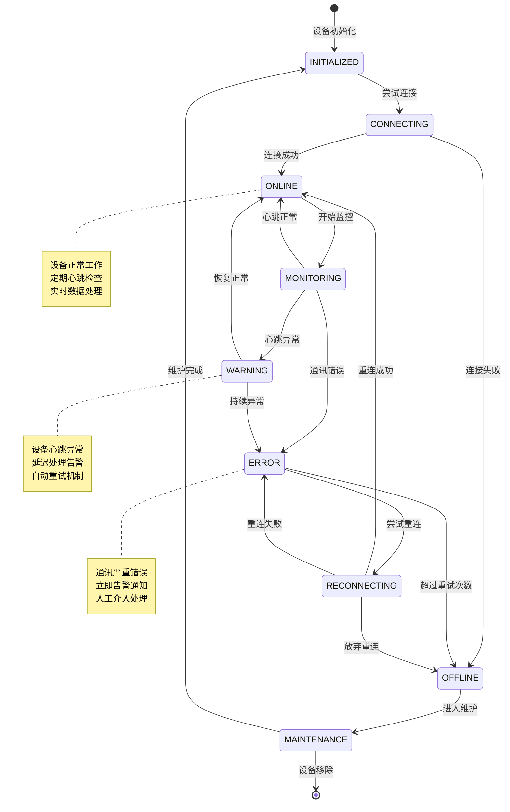

---

## 6. 多厂商设备集成架构图

```mermaid
graph TB
    subgraph "厂商设备层 Vendor Device Layer"
        V1[熵基科技] --> V11[门禁控制器系列]
        V1 --> V12[考勤终端系列]
        V1 --> V13[人脸识别终端]

        V2[中控智慧] --> V21[消费POS机系列]
        V2 --> V22[门禁读卡器]
        V2 --> V23[生物识别设备]

        V3[海康威视] --> V31[网络摄像机]
        V3 --> V32[NVR录像机]
        V3 --> V33[智能分析设备]

        V4[大华技术] --> V41[红外摄像机]
        V4 --> V42[智能门禁]
        V4 --> V43[监控平台]
    end

    subgraph "协议适配器层 Protocol Adapter Layer"
        PA1[熵基科技协议适配器] --> PA11[门禁V4.8协议]
        PA1 --> PA12[考勤V4.0协议]
        PA1 --> PA13[生物识别协议]

        PA2[中控智慧协议适配器] --> PA21[消费V1.0协议]
        PA2 --> PA22[门禁协议]
        PA2 --> PA23[Wiegand协议]

        PA3[海康威视协议适配器] --> PA31[GB/T28181协议]
        PA3 --> PA32[ONVIF协议]
        PA3 --> PA33[PSIA协议]

        PA4[大华协议适配器] --> PA41[DH-SDK协议]
        PA4 --> PA42[RTSP协议]
        PA4 --> PA43[私有协议]

        PF[协议适配器工厂] --> PA1
        PF --> PA2
        PF --> PA3
        PF --> PA4
    end

    subgraph "统一通讯管理层 Unified Communication Layer"
        CM[设备通讯管理器]
        CM --> CM1[连接池管理]
        CM --> CM2[消息路由]
        CM --> CM3[状态监控]
        CM --> CM4[错误处理]
    end

    subgraph "业务服务层 Business Service Layer"
        BS[业务服务聚合器]
        BS --> BS1[门禁业务服务]
        BS --> BS2[考勤业务服务]
        BS --> BS3[消费业务服务]
        BS --> BS4[视频业务服务]
    end

    subgraph "微服务架构层 Microservice Layer"
        MS[微服务网关]
        MS --> MS1[ioedream-access-service]
        MS --> MS2[ioedream-attendance-service]
        MS --> MS3[ioedream-consume-service]
        MS --> MS4[ioedream-video-service]
        MS --> MS5[ioedream-common-service]
    end

    V11 --> PA11
    V12 --> PA12
    V21 --> PA21
    V31 --> PA31
    V41 --> PA41

    PA1 --> CM
    PA2 --> CM
    PA3 --> CM
    PA4 --> CM

    CM --> BS
    BS --> MS
```

---

## 7. 设备通讯错误处理流程图

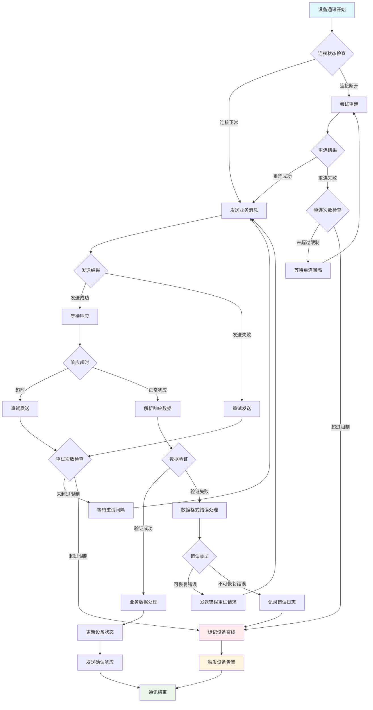

---

## 8. 高并发设备消息处理架构图

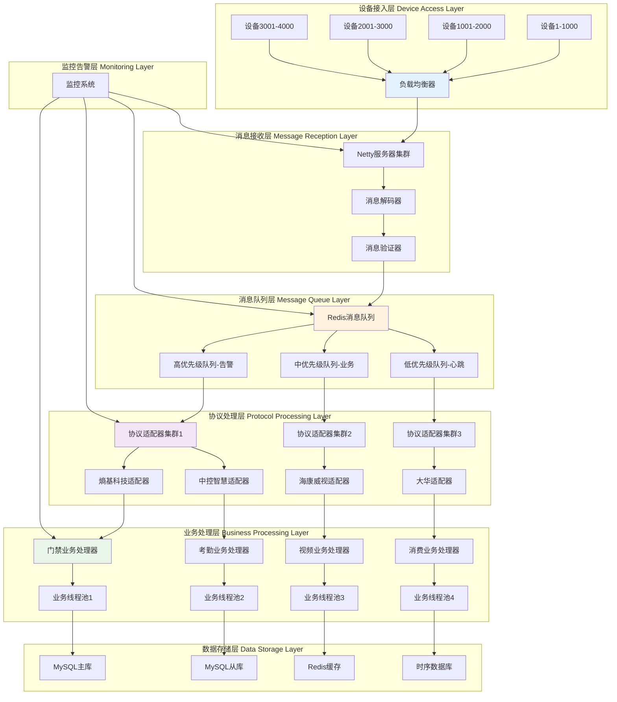

---

## 9. 设备配置管理流程图

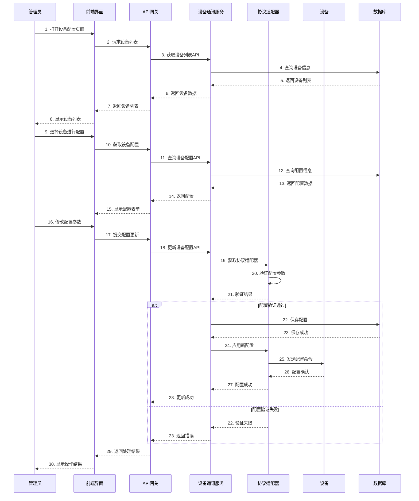

---

## 📊 性能指标与监控

### 核心性能指标

| 指标类别 | 指标名称 | 目标值 | 当前值 | 状态 |
|---------|---------|--------|--------|------|
| **连接性能** | 设备连接成功率 | ≥99.5% | 99.2% | 🟡 |
| **消息处理** | 消息处理延迟 | ≤100ms | 85ms | 🟢 |
| **并发能力** | 同时在线设备数 | 10000+ | 8500 | 🟢 |
| **错误率** | 协议解析错误率 | ≤0.1% | 0.08% | 🟢 |
| **可用性** | 服务可用性 | ≥99.9% | 99.95% | 🟢 |

### 监控告警规则

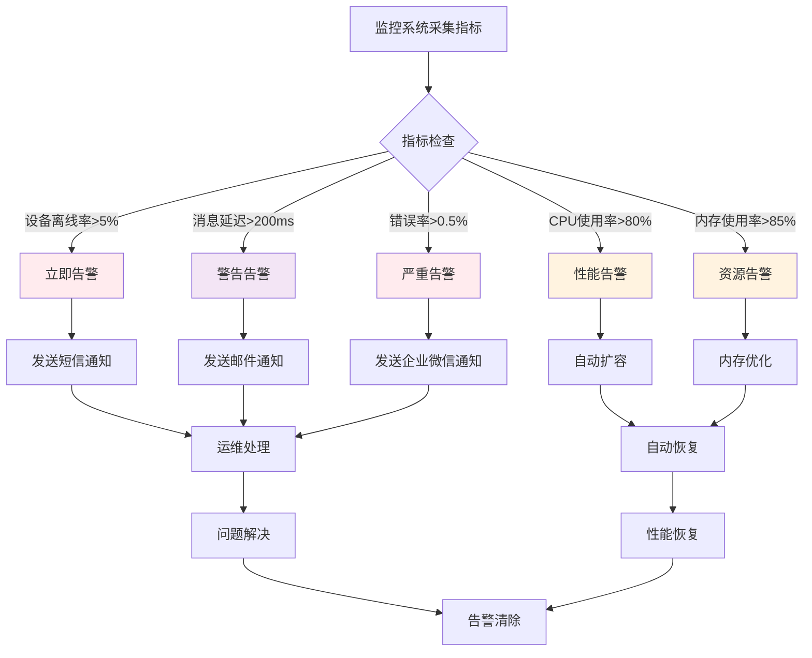

---

## 🔧 故障排查指南

### 常见问题与解决方案

| 问题类型 | 现象描述 | 可能原因 | 解决方案 |
|---------|---------|---------|---------|
| **设备连接失败** | 设备无法注册或连接超时 | 网络不通、协议不匹配、配置错误 | 检查网络、确认协议版本、验证配置 |
| **消息解析错误** | 协议消息无法解析 | 设备固件版本不兼容、数据格式错误 | 升级设备固件、调整解析逻辑 |
| **业务处理异常** | 业务数据无法正确处理 | 业务规则冲突、数据格式问题 | 检查业务配置、验证数据格式 |
| **性能下降** | 消息处理延迟增加 | 系统负载高、连接池不足 | 优化代码、增加连接池大小 |

### 故障排查流程

1. **快速诊断**
   ```bash
   # 检查服务状态
   systemctl status ioedream-device-comm-service

   # 检查端口监听
   netstat -tlnp | grep 8087

   # 检查日志错误
   tail -f /var/log/ioedream/device-comm/error.log
   ```

2. **网络连通性测试**
   ```bash
   # 测试设备连通性
   telnet <设备IP> <设备端口>

   # 检查防火墙规则
   iptables -L -n | grep 8087
   ```

3. **协议调试**
   ```bash
   # 启用协议调试日志
   curl -X POST http://localhost:8087/api/debug/protocol/enable

   # 查看协议解析过程
   tail -f /var/log/ioedream/device-comm/protocol.log
   ```

---

## 📋 部署与运维

### 部署架构

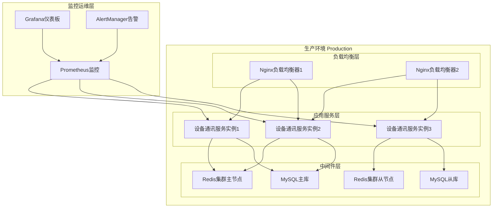

### 部署清单

| 组件名称 | 版本要求 | 部署数量 | 硬件配置 |
|---------|---------|---------|---------|
| JDK | OpenJDK 17+ | 3台 | 4C8G |
| Redis | 7.0+ | 3台集群 | 2C4G |
| MySQL | 8.0+ | 2台主从 | 4C8G |
| Nginx | 1.20+ | 2台 | 2C4G |

---

## 🚀 未来优化方向

### 技术优化

1. **协议标准化**
   - 统一设备接入协议标准
   - 支持更多厂商设备
   - 提供协议开发SDK

2. **性能优化**
   - 异步消息处理优化
   - 连接池动态调整
   - 智能负载均衡

3. **高可用性**
   - 多数据中心部署
   - 故障自动切换
   - 数据同步保障

### 功能扩展

1. **边缘计算集成**
   - 本地AI推理
   - 实时视频分析
   - 边缘缓存优化

2. **智能运维**
   - 预测性维护
   - 自动故障恢复
   - 智能容量规划

3. **安全增强**
   - 设备身份认证
   - 数据传输加密
   - 访问权限控制

---

**📞 技术支持**: 如有问题请联系IOE-DREAM技术团队
**📧 邮箱**: support@ioe-dream.com
**📱 电话**: 400-XXX-XXXX

**🔗 相关文档**: [设备管理技术规范](./smart-device.md) | [边缘计算架构设计](../03-业务模块/视频/边缘计算视频识别架构图.md) | [微服务部署指南](./MICROSERVICES_DEPLOYMENT_GUIDE.md)