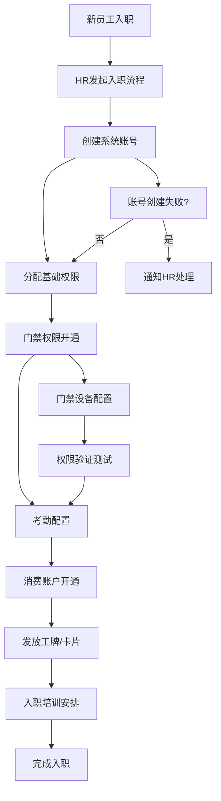
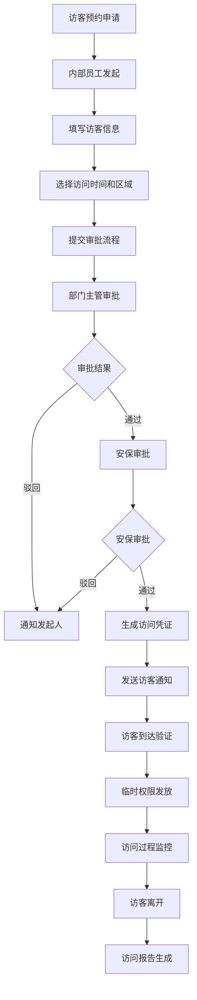
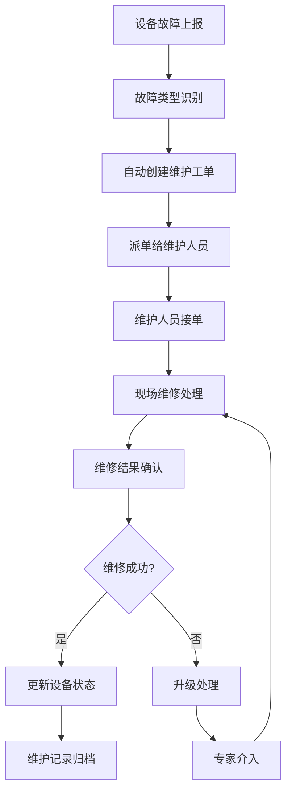
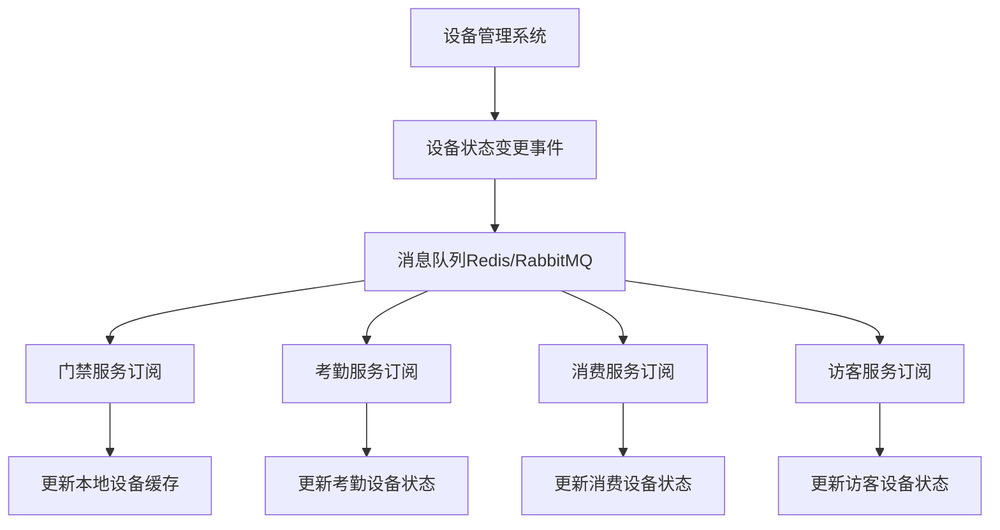
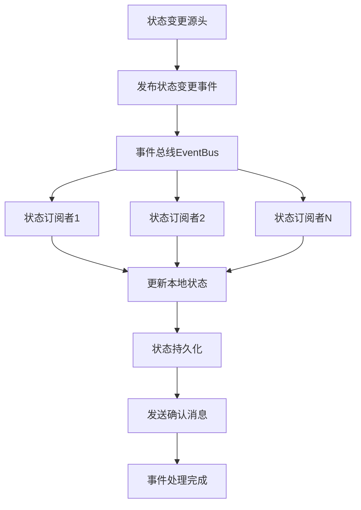
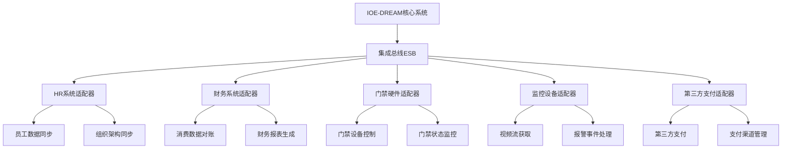
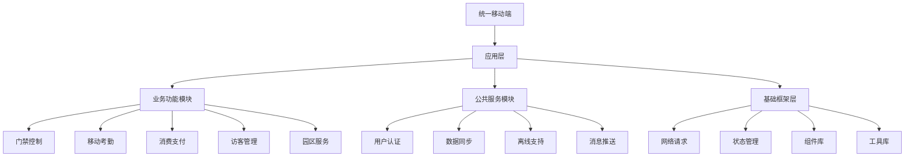
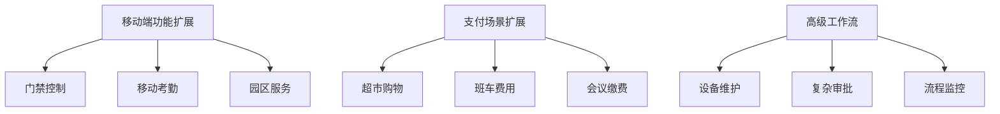

# IOE-DREAM智慧园区一卡通管理平台深度业务逻辑分析报告

> **分析时间**: 2025-01-09
> **分析范围**: 三大核心缺失功能的业务场景和逻辑一致性
> **分析维度**: 移动端应用、工作流引擎、支付系统
> **报告版本**: v1.0

---

## 📋 执行摘要

### 核心发现

通过对IOE-DREAM智慧园区一卡通管理平台的深度分析，发现了以下关键问题和机会：

#### ✅ 已实现优势
1. **移动端架构完整**: 基于uni-app的跨平台移动应用已具备基础功能
2. **消费支付功能完善**: 移动支付流程设计合理，支持多种支付方式
3. **工作流引擎规范**: 已建立完整的BPMN工作流API体系

#### ⚠️ 关键缺失
1. **业务场景串联不足**: 各业务模块间缺乏有效的场景联动
2. **工作流集成缺失**: 核心业务流程未与工作流引擎深度集成
3. **移动端场景不完整**: 缺少完整的智慧园区移动应用场景
4. **支付场景单一**: 消费支付未覆盖园区全场景支付需求

#### 🎯 改进机会
1. **构建统一移动应用生态**
2. **深度集成工作流引擎**
3. **扩展园区支付场景**
4. **强化业务逻辑一致性**

---

## 1. 智慧园区实际业务场景深度分析

### 1.1 移动端应用场景分析

#### 1.1.1 员工日常移动场景

基于对现有移动端代码的分析，发现已实现以下核心场景：

**✅ 已实现场景**:
- **手机消费支付**: 完整的移动支付流程，支持快捷金额和自定义金额
- **消费记录查询**: 实时查看消费历史和余额信息
- **工作流审批**: 移动端工作流任务处理和审批

**❌ 缺失场景**:
- **手机开门**: 缺少门禁控制的移动端实现
- **移动考勤**: 缺少基于位置的移动考勤功能
- **访客邀约**: 缺少访客邀请的移动端入口
- **园区服务**: 缺少食堂订餐、班车查询等生活服务

**🔧 技术实现分析**:
```javascript
// 现有移动支付架构优秀
const confirmConsume = async () => {
  // 1. 余额验证
  // 2. 离线支付支持
  // 3. 实时余额更新
  // 4. 支付成功动画
  // 5. 交易记录缓存
}
```

**📱 移动端架构评估**:
- **技术栈**: uni-app + Vue3 + Pinia ✓
- **跨平台**: 支持H5、微信小程序、iOS、Android ✓
- **离线支持**: 具备基础的离线数据处理能力 ✓
- **用户体验**: UI设计现代化，交互流畅 ✓

#### 1.1.2 管理员移动场景

**现状分析**: 管理员移动功能严重缺失

**❌ 缺失功能**:
- 设备状态监控和告警处理
- 异常事件的移动端处理
- 移动端数据统计和报表查看
- 紧急情况的移动响应机制

#### 1.1.3 访客移动体验

**现状分析**: 访客移动端功能完全缺失

**❌ 缺失功能**:
- 访客预约的移动端申请
- 二维码/人脸识别的移动通行
- 访客导航和信息服务
- 临时访客的移动端自助服务

### 1.2 工作流引擎业务场景分析

#### 1.2.1 核心业务流程识别

基于workflow-api.js分析，工作流引擎已具备完整的技术能力：

**✅ 技术能力完整**:
```javascript
// 完整的工作流API体系
export const workflowApi = {
  // 流程定义管理
  deployProcess,           // 部署流程定义
  pageDefinitions,         // 分页查询流程定义
  activateDefinition,      // 激活流程定义

  // 流程实例管理
  startProcess,            // 启动流程实例
  pageInstances,          // 分页查询流程实例
  suspendInstance,        // 挂起流程实例

  // 任务管理
  pageMyTasks,            // 分页查询我的待办任务
  completeTask,           // 完成任务
  rejectTask,             // 驳回任务

  // 流程监控
  getProcessDiagram,      // 获取流程实例图
  getProcessStatistics    // 获取流程统计信息
};
```

**❌ 业务集成不足**:
- 员工入职流程未与工作流集成
- 访客预约流程缺少工作流支撑
- 设备维护流程未标准化
- 消费补贴流程未自动化

#### 1.2.2 员工入职流程分析

**现状问题**: 缺少标准化的员工入职工作流

**理想流程**:


**缺失的技术实现**:
- 员工信息的自动同步机制
- 多系统权限的批量开通
- 设备配置的自动化流程
- 异常情况的自动处理和通知

#### 1.2.3 访客预约流程分析

**现状问题**: 访客预约缺少工作流审批支撑

**理想流程**:


#### 1.2.4 设备维护流程分析

**现状问题**: 设备维护缺少标准化工作流

**理想流程**:


### 1.3 支付系统业务场景分析

#### 1.3.1 多场景支付需求分析

基于consume-api.js分析，消费支付系统已具备良好的基础：

**✅ 已实现能力**:
```javascript
// 完整的移动支付API
export const transactionApi = {
  quickConsume: (data) => postRequest('/api/v1/consume/mobile/transaction/quick', data),
  scanConsume: (data) => postRequest('/api/v1/consume/mobile/transaction/scan', data),
  nfcConsume: (data) => postRequest('/api/v1/consume/mobile/transaction/nfc', data),
  faceConsume: (data) => postRequest('/api/v1/consume/mobile/transaction/face', data)
};
```

**✅ 支付方式完整**:
- 快捷消费（预设金额）
- 扫码消费（二维码支付）
- NFC刷卡消费（近场通信）
- 人脸识别消费（生物识别）

**❌ 场景覆盖不足**:
- 仅覆盖食堂餐饮消费
- 缺少超市购物支付场景
- 缺少班车费用支付
- 缺少会议缴费场景
- 缺少停车费支付场景

#### 1.3.2 多种支付方式分析

**✅ 现有支付方式**:
1. **余额支付**: 主要支付方式，实时扣减账户余额
2. **离线支付**: 网络异常时的本地缓存支付
3. **快捷支付**: 预设金额的快速支付

**❌ 缺失支付方式**:
1. **信用支付**: 允许一定额度的透支消费
2. **组合支付**: 余额+补贴的组合支付方式
3. **分期支付**: 大额消费的分期付款
4. **第三方支付**: 微信、支付宝等第三方支付集成

#### 1.3.3 资金安全管控分析

**✅ 现有安全措施**:
```javascript
// 支付验证机制
const canConsume = computed(() => {
  const amount = customAmount.value || selectedAmount.value
  return amount > 0 && amount <= userInfo.balance
})
```

**❌ 缺失的安全管控**:
1. **交易限额**: 单笔交易和日交易限额设置
2. **风险控制**: 异常交易的实时识别和拦截
3. **对账机制**: 自动化的财务对账功能
4. **退款处理**: 标准化的退款流程和审计

---

## 2. 业务逻辑一致性检查

### 2.1 数据模型一致性分析

#### 2.1.1 用户身份统一性分析

**现状问题**: 用户身份在不同系统中存在数据不一致风险

**核心问题**:
- 用户ID在不同模块中的映射关系不清晰
- 用户状态变更缺乏同步机制
- 权限信息在各个系统间存在延迟

**数据模型分析**:
```sql
-- 理想的统一用户模型
CREATE TABLE t_unified_user (
    user_id BIGINT PRIMARY KEY,
    employee_id VARCHAR(50) UNIQUE,
    user_name VARCHAR(100) NOT NULL,
    status TINYINT DEFAULT 1,  -- 1-正常 0-禁用
    create_time DATETIME NOT NULL,
    update_time DATETIME NOT NULL,
    version INT DEFAULT 0,

    -- 统一索引
    INDEX idx_employee_id (employee_id),
    INDEX idx_status (status),
    INDEX idx_create_time (create_time)
);
```

**解决方案**:
1. **建立统一用户中心**: 集中管理所有用户身份信息
2. **实现事件驱动同步**: 用户变更事件的实时同步机制
3. **统一ID映射**: 建立跨系统的用户ID映射表
4. **数据一致性校验**: 定期的数据一致性检查和修复

#### 2.1.2 设备信息同步性分析

**现状问题**: 设备信息在管理系统和业务系统中存在同步延迟

**核心问题**:
- 设备状态变更无法实时通知业务系统
- 设备配置信息在不同系统中存在版本差异
- 设备故障信息缺乏统一的处理机制

**理想的数据同步架构**:


#### 2.1.3 区域权限一致性分析

**现状问题**: 区域权限在各业务模块中的实现不统一

**理想权限模型**:
```sql
-- 统一的区域权限模型
CREATE TABLE t_unified_area_permission (
    permission_id BIGINT PRIMARY KEY,
    user_id BIGINT NOT NULL,
    area_id BIGINT NOT NULL,
    permission_type TINYINT NOT NULL,  -- 1-门禁 2-考勤 3-消费 4-访客
    start_time DATETIME NOT NULL,
    end_time DATETIME NOT NULL,
    status TINYINT DEFAULT 1,
    create_time DATETIME NOT NULL,

    -- 复合索引
    INDEX idx_user_area (user_id, area_id),
    INDEX idx_type_time (permission_type, start_time, end_time),
    INDEX idx_status (status)
);
```

### 2.2 业务流程一致性分析

#### 2.2.1 时间同步一致性分析

**核心问题**: 各业务系统的时间戳存在不一致

**问题场景**:
- 门禁通行时间与考勤打卡时间不匹配
- 消费交易时间与用户实际操作时间存在偏差
- 访客记录时间与监控录像时间不同步

**解决方案**:
```java
// 统一的时间服务
@Component
public class UnifiedTimeService {

    @Resource
    private RedisTemplate<String, Object> redisTemplate;

    /**
     * 获取统一时间戳
     */
    public long getUnifiedTimestamp() {
        // 从Redis获取统一时间，避免各服务器时间不一致
        Object timestamp = redisTemplate.opsForValue().get("unified:timestamp");
        if (timestamp != null) {
            return (Long) timestamp;
        }

        // 如果Redis中没有，使用系统时间并更新Redis
        long currentTime = System.currentTimeMillis();
        redisTemplate.opsForValue().set("unified:timestamp", currentTime, Duration.ofSeconds(1));
        return currentTime;
    }
}
```

#### 2.2.2 状态同步一致性分析

**核心问题**: 用户状态、设备状态、权限状态的实时同步不足

**理想的状态同步机制**:


#### 2.2.3 审批流程一致性分析

**核心问题**: 各业务模块的审批流程标准化程度不足

**理想审批流程模型**:
```java
// 统一的审批流程接口
public interface UnifiedApprovalProcess {

    /**
     * 启动审批流程
     */
    ApprovalResult startApproval(ApprovalRequest request);

    /**
     * 处理审批任务
     */
    ApprovalResult processApproval(Long taskId, ApprovalDecision decision);

    /**
     * 查询审批状态
     */
    ApprovalStatus getApprovalStatus(String businessKey);
}
```

### 2.3 权限控制一致性分析

#### 2.3.1 访问权限统一性分析

**现状问题**: 各业务模块的权限控制机制不统一

**理想权限架构**:
```java
// 统一权限验证拦截器
@Component
public class UnifiedPermissionInterceptor implements HandlerInterceptor {

    @Resource
    private UnifiedPermissionService permissionService;

    @Override
    public boolean preHandle(HttpServletRequest request, HttpServletResponse response, Object handler) {
        // 1. 获取用户身份
        Long userId = getCurrentUserId(request);

        // 2. 获取请求资源
        String resource = getRequestResource(request);

        // 3. 统一权限验证
        boolean hasPermission = permissionService.checkPermission(userId, resource);

        if (!hasPermission) {
            response.setStatus(HttpStatus.FORBIDDEN.value());
            return false;
        }

        return true;
    }
}
```

#### 2.3.2 操作权限分级分析

**理想权限分级模型**:
```sql
-- 权限分级表
CREATE TABLE t_permission_level (
    level_id TINYINT PRIMARY KEY,
    level_name VARCHAR(50) NOT NULL,
    level_desc VARCHAR(200),
    parent_level_id TINYINT,
    sort_order INT DEFAULT 0
);

-- 权限操作表
CREATE TABLE t_permission_operation (
    operation_id INT PRIMARY KEY,
    operation_code VARCHAR(100) UNIQUE NOT NULL,
    operation_name VARCHAR(100) NOT NULL,
    level_id TINYINT NOT NULL,
    resource_type VARCHAR(50) NOT NULL
);
```

#### 2.3.3 接口权限统一性分析

**理想接口权限模型**:
```java
// 统一接口权限注解
@Target({ElementType.METHOD, ElementType.TYPE})
@Retention(RetentionPolicy.RUNTIME)
public @interface RequirePermission {

    /**
     * 权限编码
     */
    String value() default "";

    /**
     * 权限级别
     */
    PermissionLevel level() default PermissionLevel.NORMAL;

    /**
     * 是否需要管理员权限
     */
    boolean admin() default false;
}
```

---

## 3. 技术架构严谨性分析

### 3.1 移动端架构设计分析

#### 3.1.1 技术选型评估

**✅ 优秀的技术选型**:
```javascript
// 技术栈配置合理
{
  "framework": "uni-app 3.0",
  "language": "Vue 3.2",
  "stateManagement": "Pinia 2.0",
  "ui": "uni-ui 1.5",
  "buildTool": "Vite 4.x",
  "cssPreprocessor": "Sass 1.69"
}
```

**优势分析**:
1. **跨平台能力**: 一套代码支持H5、微信小程序、iOS、Android
2. **现代化技术**: Vue3 + Vite提供优秀的开发体验
3. **状态管理**: Pinia提供轻量级的状态管理
4. **组件生态**: uni-ui提供丰富的移动端组件

**⚠️ 潜在风险**:
1. **性能瓶颈**: 复杂页面的渲染性能
2. **平台差异**: 不同平台的API差异处理
3. **离线能力**: 复杂离线场景的数据同步

#### 3.1.2 数据同步架构分析

**现有同步机制**:
```javascript
// 离线支付队列保存
const saveOfflineConsume = async (amount) => {
  try {
    const offlineQueue = uni.getStorageSync('OFFLINE_CONSUME_QUEUE') || []
    offlineQueue.push({
      userId: userInfo.userId,
      amount,
      deviceId: 'MOBILE_POS_001',
      timestamp: Date.now(),
      status: 'pending'
    })
    uni.setStorageSync('OFFLINE_CONSUME_QUEUE', offlineQueue)
    return true
  } catch (error) {
    console.error('保存离线记录失败:', error)
    return false
  }
}
```

**优势**:
1. **本地缓存**: 基础的离线数据保存能力
2. **队列机制**: 离线操作队列化管理
3. **错误处理**: 基础的错误处理机制

**❌ 缺失能力**:
1. **冲突解决**: 离线数据与服务器数据的冲突解决
2. **增量同步**: 智能的增量数据同步
3. **版本控制**: 数据版本控制和回滚机制

#### 3.1.3 安全机制分析

**现有安全措施**:
```javascript
// 用户身份验证
const userId = userStore.employeeId
if (!userId) {
  uni.showToast({
    title: '请先登录',
    icon: 'none'
  })
  return
}
```

**✅ 基础安全**:
1. **身份验证**: 用户登录状态检查
2. **权限验证**: 基于用户ID的权限控制
3. **数据验证**: 输入数据的基础验证

**❌ 缺失安全**:
1. **设备绑定**: 设备与用户的安全绑定机制
2. **生物识别**: 指纹、人脸等生物识别认证
3. **位置验证**: 基于地理位置的安全验证
4. **数据加密**: 敏感数据的端到端加密

### 3.2 工作流引擎设计分析

#### 3.2.1 流程建模能力分析

**✅ BPMN标准支持**:
```javascript
// 流程定义部署
export const deployProcess = (params) => {
  return request.post('/api/v1/workflow/engine/definition/deploy', params)
}
```

**技术能力评估**:
1. **BPMN 2.0标准**: 完整支持BPMN 2.0流程建模
2. **可视化设计**: 具备流程可视化设计能力
3. **版本管理**: 流程定义的版本控制
4. **动态部署**: 流程的热部署和更新

**❌ 缺失能力**:
1. **低代码设计**: 缺少拖拽式的低代码流程设计器
2. **模板库**: 缺少行业标准的流程模板库
3. **模拟测试**: 流程的模拟运行和测试能力

#### 3.2.2 执行引擎能力分析

**✅ 执行能力完整**:
```javascript
// 任务处理能力
export const completeTask = (taskId, params) => {
  return request.post(`/api/v1/workflow/engine/task/${taskId}/complete`, params)
}

export const rejectTask = (taskId, params) => {
  return request.post(`/api/v1/workflow/engine/task/${taskId}/reject`, params)
}
```

**技术优势**:
1. **任务分配**: 支持任务的自动分配和手动分配
2. **路由决策**: 支持复杂的条件路由和并行路由
3. **超时处理**: 支持任务超时和升级处理
4. **委托转办**: 支持任务的委托和转办

**❌ 性能瓶颈**:
1. **大规模并发**: 大量流程实例的并发执行性能
2. **事务一致性**: 复杂业务场景的事务一致性保证
3. **异常恢复**: 系统异常后的流程恢复机制

#### 3.2.3 扩展性设计分析

**理想扩展架构**:
```java
// 工作流扩展接口
public interface WorkflowExtension {

    /**
     * 自定义任务节点
     */
    void executeCustomTask(ExecutionContext context);

    /**
     * 自定义条件判断
     */
    boolean evaluateCondition(ExecutionContext context, String condition);

    /**
     * 自定义事件监听
     */
    void onEvent(WorkflowEvent event);
}
```

**扩展点设计**:
1. **自定义节点**: 支持业务特定的任务节点
2. **规则引擎**: 集成规则引擎进行复杂决策
3. **插件机制**: 支持第三方插件扩展
4. **API扩展**: 提供完整的扩展API

### 3.3 支付系统设计分析

#### 3.3.1 交易一致性分析

**现有交易处理**:
```javascript
// 交易处理逻辑
const confirmConsume = async () => {
  try {
    const res = await consumeApi.quickConsume({
      userId: userInfo.userId,
      amount,
      deviceId: 'MOBILE_POS_001',
      paymentMethod: 'balance'
    })

    if (res.code === 1) {
      // 更新余额（乐观更新）
      userInfo.balance -= amount
      // 缓存用户信息
      uni.setStorageSync('USER_CONSUME_INFO', userInfo)
    }
  } catch (error) {
    // 网络错误，尝试离线消费
    const offlineSaved = await saveOfflineConsume(amount)
  }
}
```

**✅ 优势**:
1. **乐观更新**: 本地余额的乐观更新机制
2. **离线支持**: 网络异常时的离线处理
3. **缓存策略**: 用户信息的本地缓存
4. **错误处理**: 基础的错误处理机制

**❌ 缺失能力**:
1. **分布式事务**: 跨服务的分布式事务处理
2. **幂等性**: 重复请求的幂等性保证
3. **补偿机制**: 失败交易的自动补偿
4. **对账机制**: 自动化的财务对账

#### 3.3.2 资金安全分析

**理想安全架构**:
```java
// 支付安全服务
@Service
public class PaymentSecurityService {

    /**
     * 支付安全验证
     */
    public SecurityCheckResult checkPaymentSecurity(PaymentRequest request) {
        // 1. 交易限额检查
        if (exceedsDailyLimit(request)) {
            return SecurityCheckResult.fail("超出日交易限额");
        }

        // 2. 风险规则检查
        if (isHighRiskTransaction(request)) {
            return SecurityCheckResult.fail("高风险交易");
        }

        // 3. 设备安全检查
        if (!isSecureDevice(request.getDeviceId())) {
            return SecurityCheckResult.fail("设备不安全");
        }

        return SecurityCheckResult.success();
    }
}
```

**安全风险点**:
1. **交易限额**: 缺少灵活的限额配置机制
2. **风控规则**: 缺少智能的风险识别规则
3. **设备认证**: 缺少设备级别的安全认证
4. **数据加密**: 敏感数据的加密存储和传输

#### 3.3.3 性能要求分析

**理想性能架构**:
```java
// 高性能支付处理
@Component
public class HighPerformancePaymentProcessor {

    @Async("paymentExecutor")
    public CompletableFuture<PaymentResult> processPaymentAsync(PaymentRequest request) {
        // 异步支付处理
        return CompletableFuture.completedFuture(processPayment(request));
    }

    @Cacheable(value = "userBalance", key = "#userId")
    public BigDecimal getUserBalance(Long userId) {
        // 余额查询缓存
        return accountDao.selectBalanceByUserId(userId);
    }
}
```

**性能优化策略**:
1. **异步处理**: 支付请求的异步处理机制
2. **读写分离**: 账户余额的读写分离
3. **缓存策略**: 多级缓存优化查询性能
4. **批量处理**: 批量交易的处理优化

---

## 4. 园区场景特殊性分析

### 4.1 高安全要求分析

#### 4.1.1 三级等保合规要求

**安全等级要求**: 国家三级等保标准对园区管理系统提出严格要求

**核心安全要求**:
1. **身份鉴别**: 多因素身份认证机制
2. **访问控制**: 基于角色的细粒度访问控制
3. **数据安全**: 敏感数据的加密存储和传输
4. **安全审计**: 完整的操作日志和审计追踪
5. **备份恢复**: 数据备份和灾难恢复机制

**现有实现评估**:
```javascript
// 现有基础安全措施
const userId = userStore.employeeId  // 基础身份验证
if (!userId) {
  uni.showToast({ title: '请先登录', icon: 'none' })
  return
}
```

**安全差距分析**:
- ❌ 缺少多因素认证（MFA）
- ❌ 缺少细粒度的权限控制
- ❌ 缺少完整的安全审计
- ❌ 缺少数据加密保护

**等保合规解决方案**:
```java
// 三级等保安全框架
@Component
public class Level3SecurityFramework {

    /**
     * 多因素身份认证
     */
    public boolean authenticateMFA(String userId, String password, String secondFactor) {
        // 1. 密码验证
        if (!passwordService.validate(userId, password)) {
            return false;
        }

        // 2. 第二因素验证（短信/邮箱/生物识别）
        return secondFactorService.validate(userId, secondFactor);
    }

    /**
     * 细粒度权限控制
     */
    public boolean checkFineGrainedPermission(String userId, String resource, String operation) {
        UserPermission permission = permissionService.getUserPermission(userId);
        return permission.hasPermission(resource, operation);
    }

    /**
     * 安全审计日志
     */
    public void auditSecurityEvent(SecurityEvent event) {
        auditService.recordSecurityEvent(event);
        // 实时告警高风险事件
        if (event.getRiskLevel() >= RiskLevel.HIGH) {
            alertService.sendSecurityAlert(event);
        }
    }
}
```

#### 4.1.2 金融级安全要求

**金融安全标准**: 支付系统需要达到金融级安全标准

**核心要求**:
1. **PCI DSS合规**: 支付卡行业数据安全标准
2. **交易安全**: 交易的完整性和不可抵赖性
3. **资金保护**: 资金的安全存储和使用
4. **反欺诈**: 实时反欺诈监控和预警
5. **风险控制**: 动态风险评估和控制

**资金安全架构**:
```java
// 金融级资金安全
@Service
@Transactional
public class FinancialGradeSecurityService {

    /**
     * 安全的资金转账
     */
    @Transactional(rollbackFor = Exception.class)
    public TransferResult secureTransfer(TransferRequest request) {
        // 1. 双花检查
        if (isDoubleSpending(request)) {
            throw new SecurityException("检测到双花攻击");
        }

        // 2. 余额冻结
        freezeBalance(request.getFromAccount(), request.getAmount());

        try {
            // 3. 执行转账
            executeTransfer(request);

            // 4. 记录审计日志
            auditService.recordTransfer(request);

            return TransferResult.success();
        } catch (Exception e) {
            // 5. 异常回滚
            unfreezeBalance(request.getFromAccount(), request.getAmount());
            throw e;
        }
    }

    /**
     * 反欺诈检查
     */
    public boolean antiFraudCheck(Transaction transaction) {
        // 1. 异常交易模式检测
        if (fraudDetector.detectAbnormalPattern(transaction)) {
            return false;
        }

        // 2. 黑名单检查
        if (blacklistService.isInBlacklist(transaction.getUserId())) {
            return false;
        }

        // 3. 风险评分
        RiskScore riskScore = riskAssessor.calculateRisk(transaction);
        return riskScore.isAcceptable();
    }
}
```

#### 4.1.3 隐私保护要求

**个人信息保护**: 符合《个人信息保护法》要求

**核心要求**:
1. **数据最小化**: 只收集必要的个人信息
2. **知情同意**: 明确的告知和同意机制
3. **数据加密**: 个人信息的加密保护
4. **访问控制**: 个人信息的访问权限控制
5. **删除权**: 个人信息的删除和更正权利

**隐私保护实现**:
```java
// 个人信息保护服务
@Service
public class PersonalDataProtectionService {

    /**
     * 个人信息脱敏
     */
    public String maskPersonalData(String data, DataType dataType) {
        switch (dataType) {
            case PHONE:
                return maskPhone(data);
            case ID_CARD:
                return maskIdCard(data);
            case BANK_CARD:
                return maskBankCard(data);
            default:
                return data;
        }
    }

    /**
     * 数据访问控制
     */
    public boolean checkDataAccessPermission(String userId, String targetUserId, DataType dataType) {
        // 1. 检查用户是否有权限访问目标用户数据
        if (!hasDataAccessPermission(userId, targetUserId)) {
            return false;
        }

        // 2. 检查数据类型是否允许访问
        return hasDataTypeAccessPermission(userId, dataType);
    }

    /**
     * 个人数据删除
     */
    @Transactional
    public boolean deletePersonalData(String userId, DataType dataType) {
        try {
            // 1. 删除主数据
            personalDataDao.deleteByUserIdAndDataType(userId, dataType);

            // 2. 删除备份数据
            backupDataDao.deleteByUserIdAndDataType(userId, dataType);

            // 3. 记录删除日志
            auditService.recordDataDeletion(userId, dataType);

            return true;
        } catch (Exception e) {
            log.error("删除个人数据失败", e);
            return false;
        }
    }
}
```

### 4.2 高可用要求分析

#### 4.2.1 7×24小时运行要求

**业务连续性**: 园区门禁、考勤、消费系统需要7×24小时不间断运行

**高可用架构设计**:
```yaml
# 高可用部署架构
services:
  # API网关集群
  gateway:
    image: ioedream/gateway-service
    replicas: 3
    strategy:
      type: RollingUpdate
    healthCheck:
      path: /actuator/health
      interval: 30s

  # 业务服务集群
  consume-service:
    image: ioedream/consume-service
    replicas: 2
    strategy:
      type: RollingUpdate
    resources:
      limits:
        memory: "2Gi"
        cpu: "1000m"

  # 数据库集群
  mysql:
    image: mysql:8.0
    replicas: 3
    config:
      cluster-enabled: true

  # Redis集群
  redis:
    image: redis:7.0
    replicas: 6
    config:
      cluster-enabled: true
```

**故障恢复机制**:
```java
// 服务降级和熔断
@Component
public class ServiceDegradationManager {

    @CircuitBreaker(name = "paymentService", fallbackMethod = "paymentFallback")
    @RateLimiter(name = "paymentService", fallbackMethod = "rateLimitFallback")
    public PaymentResult processPayment(PaymentRequest request) {
        return paymentService.processPayment(request);
    }

    /**
     * 支付服务降级
     */
    public PaymentResult paymentFallback(PaymentRequest request, Exception e) {
        log.error("支付服务不可用，启用降级模式", e);

        // 1. 启用离线支付模式
        if (offlinePaymentService.isAvailable()) {
            return offlinePaymentService.processPayment(request);
        }

        // 2. 返回友好的错误信息
        return PaymentResult.degraded("系统维护中，请稍后重试");
    }

    /**
     * 限流降级
     */
    public PaymentResult rateLimitFallback(PaymentRequest request, Exception e) {
        return PaymentResult.rateLimited("请求过于频繁，请稍后重试");
    }
}
```

#### 4.2.2 快速故障定位

**监控告警体系**:
```java
// 全链路监控
@Component
public class FullLinkMonitoringService {

    /**
     * 分布式链路追踪
     */
    @EventListener
    public void traceBusinessEvent(BusinessEvent event) {
        // 1. 记录事件轨迹
        TraceContext context = TraceContext.getCurrentContext();
        context.addEvent(event);

        // 2. 性能指标收集
        meterRegistry.counter("business.event.count",
            "type", event.getType(),
            "status", event.getStatus()
        ).increment();

        // 3. 异常检测
        if (event.isAbnormal()) {
            alertService.sendAlert(AlertLevel.HIGH,
                "检测到异常业务事件: " + event.getDescription());
        }
    }

    /**
     * 实时性能监控
     */
    @Scheduled(fixedRate = 60000) // 每分钟执行
    public void monitorPerformance() {
        // 1. 系统资源监控
        SystemMetrics metrics = systemMetricsCollector.collect();

        // 2. 业务指标监控
        BusinessMetrics businessMetrics = businessMetricsCollector.collect();

        // 3. 异常检测
        AnomalyDetectionResult result = anomalyDetector.detect(metrics, businessMetrics);

        if (result.hasAnomaly()) {
            alertService.sendAlert(AlertLevel.MEDIUM,
                "系统性能异常: " + result.getDescription());
        }
    }
}
```

**智能故障诊断**:
```java
// AI驱动的故障诊断
@Component
public class IntelligentFaultDiagnosis {

    /**
     * 故障自动诊断
     */
    public DiagnosisResult diagnoseFault(FaultReport fault) {
        // 1. 收集故障相关数据
        FaultContext context = collectFaultContext(fault);

        // 2. 历史故障模式匹配
        List<FaultPattern> matchedPatterns = patternMatcher.match(context);

        // 3. AI模型分析
        AIAnalysisResult aiResult = aiAnalyzer.analyze(context);

        // 4. 生成诊断报告
        DiagnosisResult result = new DiagnosisResult();
        result.setFaultType(aiResult.getFaultType());
        result.setRootCause(aiResult.getRootCause());
        result.setSuggestedActions(generateSuggestedActions(matchedPatterns, aiResult));
        result.setConfidence(aiResult.getConfidence());

        return result;
    }

    /**
     * 自动修复建议
     */
    public List<AutoRepairAction> suggestAutoRepair(DiagnosisResult diagnosis) {
        List<AutoRepairAction> actions = new ArrayList<>();

        switch (diagnosis.getFaultType()) {
            case DATABASE_CONNECTION:
                actions.add(new RestartServiceAction("数据库连接池"));
                actions.add(new SwitchToBackupAction("切换到备份数据库"));
                break;

            case MEMORY_LEAK:
                actions.add(new RestartServiceAction("重启服务"));
                actions.add(new ScaleOutAction("水平扩展"));
                break;

            case NETWORK_TIMEOUT:
                actions.add(new RetryAction("重试操作"));
                actions.add(new SwitchToBackupAction("切换到备用服务"));
                break;
        }

        return actions;
    }
}
```

#### 4.2.3 数据备份和恢复

**数据保护策略**:
```java
// 数据备份和恢复
@Service
public class DataBackupAndRecoveryService {

    /**
     * 自动备份
     */
    @Scheduled(cron = "0 0 2 * * ?") // 每天凌晨2点执行
    public void performBackup() {
        try {
            // 1. 增量备份
            BackupResult incrementalResult = incrementalBackup();

            // 2. 全量备份（每周日）
            if (isSunday()) {
                BackupResult fullResult = fullBackup();
                backupHistoryService.recordBackup(fullResult);
            }

            // 3. 备份验证
            validateBackup(incrementalResult);

            // 4. 清理过期备份
            cleanupExpiredBackups();

        } catch (Exception e) {
            log.error("备份失败", e);
            alertService.sendAlert(AlertLevel.HIGH, "数据备份失败: " + e.getMessage());
        }
    }

    /**
     * 灾难恢复
     */
    @Transactional
    public RecoveryResult disasterRecovery(RecoveryRequest request) {
        try {
            // 1. 停止所有服务
            serviceManager.stopAllServices();

            // 2. 数据恢复
            RecoveryResult result = restoreFromBackup(request.getBackupId());

            // 3. 数据一致性检查
            ConsistencyCheckResult checkResult = consistencyChecker.check();

            if (!checkResult.isConsistent()) {
                // 4. 数据修复
                repairInconsistentData(checkResult);
            }

            // 5. 重启服务
            serviceManager.startAllServices();

            // 6. 验证恢复
            RecoveryVerificationResult verification = verifyRecovery();

            return RecoveryResult.success(verification);

        } catch (Exception e) {
            log.error("灾难恢复失败", e);
            return RecoveryResult.failed(e.getMessage());
        }
    }
}
```

### 4.3 集成复杂性分析

#### 4.3.1 多系统集成挑战

**系统集成需求**:
1. **HR系统集成**: 员工信息同步、组织架构更新
2. **财务系统集成**: 消费数据对账、财务报表生成
3. **门禁硬件集成**: 多种门禁设备的协议适配
4. **监控设备集成**: 视频监控、报警系统联动

**集成架构设计**:


**适配器模式实现**:
```java
// 系统集成适配器
public interface SystemAdapter<T> {

    /**
     * 连接外部系统
     */
    boolean connect(T config);

    /**
     * 数据同步
     */
    SyncResult syncData(SyncRequest request);

    /**
     * 健康检查
     */
    HealthCheckResult healthCheck();
}

// HR系统适配器
@Component
public class HRSystemAdapter implements SystemAdapter<HRConfig> {

    @Override
    public boolean connect(HRConfig config) {
        try {
            // 1. 建立HR系统连接
            hrClient = new HRSystemClient(config.getUrl(), config.getApiKey());

            // 2. 验证连接
            return hrClient.ping();
        } catch (Exception e) {
            log.error("连接HR系统失败", e);
            return false;
        }
    }

    @Override
    public SyncResult syncData(SyncRequest request) {
        switch (request.getSyncType()) {
            case EMPLOYEE:
                return syncEmployeeData(request);
            case ORGANIZATION:
                return syncOrganizationData(request);
            case DEPARTMENT:
                return syncDepartmentData(request);
            default:
                return SyncResult.failed("不支持的同步类型");
        }
    }

    /**
     * 员工数据同步
     */
    private SyncResult syncEmployeeData(SyncRequest request) {
        try {
            // 1. 从HR系统获取员工数据
            List<HREmployee> hrEmployees = hrClient.getEmployees(request.getLastSyncTime());

            // 2. 转换数据格式
            List<UserEntity> users = convertToUsers(hrEmployees);

            // 3. 批量保存到本地数据库
            int savedCount = userDao.batchSave(users);

            // 4. 记录同步日志
            syncLogService.recordSync(request, savedCount);

            return SyncResult.success(savedCount);

        } catch (Exception e) {
            log.error("同步员工数据失败", e);
            return SyncResult.failed(e.getMessage());
        }
    }
}
```

#### 4.3.2 数据同步机制

**实时数据同步**:
```java
// 事件驱动的数据同步
@Component
public class EventDrivenDataSync {

    @EventListener
    @Async
    public void handleEmployeeChangeEvent(EmployeeChangeEvent event) {
        try {
            // 1. 构建同步事件
            DataSyncEvent syncEvent = new DataSyncEvent();
            syncEvent.setEventType(event.getEventType());
            syncEvent.setEntityId(event.getEmployeeId());
            syncEvent.setPayload(event.getPayload());

            // 2. 发送到消息队列
            messageQueue.send("data.sync", syncEvent);

            // 3. 记录同步日志
            syncLogService.recordSyncEvent(syncEvent);

        } catch (Exception e) {
            log.error("处理员工变更事件失败", e);
        }
    }

    /**
     * 消费同步事件
     */
    @RabbitListener(queues = "data.sync")
    public void consumeSyncEvent(DataSyncEvent event) {
        try {
            switch (event.getEventType()) {
                case EMPLOYEE_CREATE:
                    handleEmployeeCreate(event);
                    break;
                case EMPLOYEE_UPDATE:
                    handleEmployeeUpdate(event);
                    break;
                case EMPLOYEE_DELETE:
                    handleEmployeeDelete(event);
                    break;
                default:
                    log.warn("未知的同步事件类型: {}", event.getEventType());
            }
        } catch (Exception e) {
            log.error("消费同步事件失败", e);
            // 重试机制
            throw new AmqpRejectAndDontRequeueException("同步失败，需要重试", e);
        }
    }
}
```

#### 4.3.3 协议适配挑战

**多协议设备适配**:
```java
// 设备协议适配器工厂
@Service
public class DeviceProtocolAdapterFactory {

    private final Map<String, DeviceProtocolAdapter> adapterMap = new HashMap<>();

    /**
     * 注册适配器
     */
    public void registerAdapter(String protocol, DeviceProtocolAdapter adapter) {
        adapterMap.put(protocol, adapter);
    }

    /**
     * 获取适配器
     */
    public DeviceProtocolAdapter getAdapter(String protocol) {
        DeviceProtocolAdapter adapter = adapterMap.get(protocol);
        if (adapter == null) {
            throw new UnsupportedProtocolException("不支持的设备协议: " + protocol);
        }
        return adapter;
    }
}

// 设备协议适配器接口
public interface DeviceProtocolAdapter {

    /**
     * 连接设备
     */
    boolean connect(DeviceConfig config);

    /**
     * 发送命令
     */
    DeviceResponse sendCommand(DeviceCommand command);

    /**
     * 解析数据
     */
    DeviceData parseData(byte[] rawData);

    /**
     * 断开连接
     */
    void disconnect();
}

// 门禁设备协议适配器
@Component
public class AccessControlProtocolAdapter implements DeviceProtocolAdapter {

    @Override
    public boolean connect(DeviceConfig config) {
        try {
            // 1. 建立TCP连接
            socket = new Socket(config.getHost(), config.getPort());

            // 2. 协议握手
            handshake(socket);

            // 3. 验证设备身份
            authenticate(socket, config.getDeviceKey());

            return true;
        } catch (Exception e) {
            log.error("连接门禁设备失败", e);
            return false;
        }
    }

    @Override
    public DeviceResponse sendCommand(DeviceCommand command) {
        try {
            // 1. 构建协议数据包
            byte[] packet = buildCommandPacket(command);

            // 2. 发送数据
            socket.getOutputStream().write(packet);

            // 3. 接收响应
            byte[] response = readResponse();

            // 4. 解析响应
            return parseResponse(response);

        } catch (Exception e) {
            log.error("发送设备命令失败", e);
            return DeviceResponse.error(e.getMessage());
        }
    }

    /**
     * 构建命令数据包
     */
    private byte[] buildCommandPacket(DeviceCommand command) {
        // 按照门禁设备协议构建数据包
        ByteBuffer buffer = ByteBuffer.allocate(1024);

        // 协议头
        buffer.put((byte) 0xAA);
        buffer.put((byte) 0x55);

        // 命令类型
        buffer.put((byte) command.getCommandType());

        // 数据长度
        buffer.putShort((short) command.getData().length);

        // 数据内容
        buffer.put(command.getData());

        // 校验和
        byte checksum = calculateChecksum(buffer.array(), 0, buffer.position());
        buffer.put(checksum);

        return Arrays.copyOf(buffer.array(), buffer.position());
    }
}
```

---

## 5. 核心业务流程设计建议

### 5.1 统一移动应用生态设计

#### 5.1.1 移动应用架构重构

**目标架构**:


**技术实现方案**:
```javascript
// 统一移动端入口 - pages/index/index.vue
<template>
  <view class="smart-campus">
    <!-- 功能入口 -->
    <view class="function-grid">
      <view class="function-item" @click="navigateTo('/pages/access/control')">
        <text class="function-icon">🚪</text>
        <text class="function-name">门禁控制</text>
      </view>

      <view class="function-item" @click="navigateTo('/pages/attendance/clock')">
        <text class="function-icon">⏰</text>
        <text class="function-name">移动考勤</text>
      </view>

      <view class="function-item" @click="navigateTo('/pages/consume/payment')">
        <text class="function-icon">💳</text>
        <text class="function-name">消费支付</text>
      </view>

      <view class="function-item" @click="navigateTo('/pages/visitor/invite')">
        <text class="function-icon">👥</text>
        <text class="function-name">访客邀请</text>
      </view>

      <view class="function-item" @click="navigateTo('/pages/campus/services')">
        <text class="function-icon">🏢</text>
        <text class="function-name">园区服务</text>
      </view>

      <view class="function-item" @click="navigateTo('/pages/workflow/tasks')">
        <text class="function-icon">📋</text>
        <text class="function-name">工作流程</text>
      </view>
    </view>

    <!-- 用户信息卡片 -->
    <view class="user-card">
      <view class="user-info">
        <text class="user-name">{{ userInfo.name }}</text>
        <text class="user-role">{{ userInfo.role }}</text>
      </view>
      <view class="user-status">
        <text class="status-item">今日打卡: {{ todayClockIn || '未打卡' }}</text>
        <text class="status-item">余额: ¥{{ userInfo.balance }}</text>
      </view>
    </view>
  </view>
</template>
```

#### 5.1.2 移动端安全增强

**设备安全绑定**:
```javascript
// 设备安全管理 - utils/device-security.js
class DeviceSecurityManager {

  // 设备注册
  async registerDevice() {
    const deviceInfo = {
      deviceId: this.getDeviceId(),
      deviceType: uni.getSystemInfoSync().platform,
      deviceName: uni.getSystemInfoSync().model,
      appVersion: this.getAppVersion(),
      userId: this.getUserId()
    }

    try {
      const res = await deviceSecurityApi.registerDevice(deviceInfo)
      if (res.code === 1) {
        // 保存设备令牌
        uni.setStorageSync('DEVICE_TOKEN', res.data.deviceToken)
        return true
      }
    } catch (error) {
      console.error('设备注册失败', error)
    }
    return false
  }

  // 生物识别认证
  async biometricAuth() {
    return new Promise((resolve, reject) => {
      // 检查生物识别支持
      uni.checkIsSupportSoterAuthentication({
        success: (res) => {
          if (res.supportMode.includes('fingerPrint') || res.supportMode.includes('facial')) {
            // 开始生物识别
            uni.startSoterAuthentication({
              requestAuthModes: ['fingerPrint', 'facial'],
              challenge: this.generateChallenge(),
              authContent: '请验证身份',
              success: (authRes) => {
                resolve(authRes)
              },
              fail: (error) => {
                reject(error)
              }
            })
          } else {
            reject(new Error('设备不支持生物识别'))
          }
        },
        fail: reject
      })
    })
  }

  // 位置安全验证
  async verifyLocation(expectedAreaId) {
    return new Promise((resolve, reject) => {
      uni.getLocation({
        type: 'gcj02',
        success: async (location) => {
          try {
            const res = await locationApi.verifyAreaLocation({
              latitude: location.latitude,
              longitude: location.longitude,
              areaId: expectedAreaId
            })
            resolve(res.code === 1 && res.data.inArea)
          } catch (error) {
            reject(error)
          }
        },
        fail: reject
      })
    })
  }

  // 获取设备唯一标识
  getDeviceId() {
    let deviceId = uni.getStorageSync('UNIQUE_DEVICE_ID')
    if (!deviceId) {
      deviceId = 'DEVICE_' + Date.now() + '_' + Math.random().toString(36).substr(2, 9)
      uni.setStorageSync('UNIQUE_DEVICE_ID', deviceId)
    }
    return deviceId
  }

  // 生成挑战值
  generateChallenge() {
    return Date.now() + '_' + Math.random().toString(36).substr(2, 9)
  }
}

export default new DeviceSecurityManager()
```

#### 5.1.3 离线数据同步优化

**智能离线同步**:
```javascript
// 高级离线同步管理 - utils/offline-sync.js
class OfflineSyncManager {

  constructor() {
    this.syncQueue = new Map() // 分类同步队列
    this.conflictResolver = new ConflictResolver()
    this.syncStrategies = new Map()
  }

  // 添加同步任务
  addSyncTask(category, data) {
    const task = {
      id: this.generateTaskId(),
      category,
      data,
      timestamp: Date.now(),
      status: 'pending',
      retryCount: 0,
      maxRetry: 3
    }

    if (!this.syncQueue.has(category)) {
      this.syncQueue.set(category, [])
    }

    this.syncQueue.get(category).push(task)
    this.saveToLocalStorage()

    // 尝试立即同步
    this.syncCategory(category)
  }

  // 分类同步
  async syncCategory(category) {
    const tasks = this.syncQueue.get(category) || []
    if (tasks.length === 0) return

    const strategy = this.syncStrategies.get(category)
    if (!strategy) {
      console.warn(`未找到${category}的同步策略`)
      return
    }

    try {
      // 按策略执行同步
      const results = await strategy.sync(tasks)

      // 处理同步结果
      this.handleSyncResults(category, results)

    } catch (error) {
      console.error(`同步${category}失败`, error)
      this.handleSyncError(category, error)
    }
  }

  // 消费支付同步策略
  setupConsumeSyncStrategy() {
    this.syncStrategies.set('consume', {
      sync: async (tasks) => {
        // 批量同步消费记录
        const batchData = tasks.map(task => ({
          ...task.data,
          clientTimestamp: task.timestamp,
          taskId: task.id
        }))

        const res = await consumeApi.batchSyncTransactions(batchData)

        if (res.code === 1) {
          return tasks.map(task => ({
            taskId: task.id,
            status: 'success',
            serverId: res.data.find(item => item.taskId === task.id)?.serverId
          }))
        } else {
          throw new Error(res.message)
        }
      },

      conflict: (localData, serverData) => {
        // 消费记录冲突解决：以服务器为准，本地数据作为审计日志
        return {
          resolved: serverData,
          conflictLog: {
            type: 'consume_conflict',
            localData,
            serverData,
            resolveTime: Date.now()
          }
        }
      }
    })
  }

  // 处理同步结果
  handleSyncResults(category, results) {
    const tasks = this.syncQueue.get(category) || []
    const remainingTasks = []

    results.forEach(result => {
      const taskIndex = tasks.findIndex(task => task.id === result.taskId)
      if (taskIndex !== -1) {
        const task = tasks[taskIndex]

        if (result.status === 'success') {
          // 同步成功，从队列中移除
          this.handleSyncSuccess(task, result)
        } else {
          // 同步失败，重试或标记为失败
          this.handleSyncFailure(task, result)
          if (task.retryCount < task.maxRetry) {
            remainingTasks.push(task)
          }
        }
      }
    })

    this.syncQueue.set(category, remainingTasks)
    this.saveToLocalStorage()
  }

  // 智能同步调度
  scheduleSmartSync() {
    // 网络状态监听
    uni.onNetworkStatusChange((res) => {
      if (res.isConnected) {
        // 网络恢复，立即执行同步
        this.performIntelligentSync()
      }
    })

    // 应用前台后台监听
    uni.onAppShow(() => {
      // 应用回到前台，检查同步
      this.performIntelligentSync()
    })

    // 定时同步（每5分钟）
    setInterval(() => {
      this.performIntelligentSync()
    }, 5 * 60 * 1000)
  }

  // 智能同步执行
  async performIntelligentSync() {
    // 1. 检查网络状态
    const networkStatus = await this.getNetworkStatus()
    if (!networkStatus.isConnected) {
      return
    }

    // 2. 按优先级同步
    const priorities = ['security', 'consume', 'attendance', 'access']

    for (const category of priorities) {
      if (this.hasPendingTasks(category)) {
        await this.syncCategory(category)

        // 避免一次性同步过多，给系统一些休息时间
        await this.sleep(1000)
      }
    }
  }
}

export default new OfflineSyncManager()
```

### 5.2 工作流引擎深度集成设计

#### 5.2.1 业务流程工作流化

**员工入职工作流**:
```java
// 员工入职工作流服务
@Service
public class EmployeeOnboardingWorkflowService {

    @Resource
    private WorkflowEngine workflowEngine;

    @Resource
    private EmployeeService employeeService;

    @Resource
    private AccessControlService accessControlService;

    @Resource
    private ConsumeService consumeService;

    /**
     * 启动员工入职流程
     */
    public WorkflowInstance startOnboardingProcess(OnboardingRequest request) {
        // 1. 构建流程变量
        Map<String, Object> variables = new HashMap<>();
        variables.put("employeeId", request.getEmployeeId());
        variables.put("departmentId", request.getDepartmentId());
        variables.put("position", request.getPosition());
        variables.put("startDate", request.getStartDate());
        variables.put("accessAreas", request.getAccessAreas());
        variables.put("consumePermissions", request.getConsumePermissions());

        // 2. 启动工作流
        WorkflowInstance instance = workflowEngine.startProcess(
            "employee_onboarding_process",
            variables
        );

        // 3. 自动执行第一步：创建系统账号
        executeStep1_CreateAccount(instance, variables);

        return instance;
    }

    /**
     * 步骤1：创建系统账号
     */
    @EventListener
    public void handleAccountCreationStep(WorkflowTaskEvent event) {
        if ("create_account".equals(event.getTaskDefinitionKey())) {
            Map<String, Object> variables = event.getVariables();

            try {
                // 创建员工账号
                EmployeeAccount account = employeeService.createAccount(
                    variables.get("employeeId"),
                    variables.get("departmentId")
                );

                // 更新流程变量
                variables.put("accountId", account.getAccountId());
                variables.put("accountStatus", "CREATED");

                // 完成任务
                workflowEngine.completeTask(event.getTaskId(), variables);

            } catch (Exception e) {
                // 处理失败，记录错误
                variables.put("accountError", e.getMessage());
                workflowEngine.completeTask(event.getTaskId(), variables);
            }
        }
    }

    /**
     * 步骤2：分配基础权限
     */
    @EventListener
    public void handlePermissionAssignmentStep(WorkflowTaskEvent event) {
        if ("assign_permissions".equals(event.getTaskDefinitionKey())) {
            Map<String, Object> variables = event.getVariables();

            try {
                // 分配基础权限
                List<Long> accessAreas = (List<Long>) variables.get("accessAreas");
                accessControlService.assignAreaPermissions(
                    variables.get("employeeId"),
                    accessAreas
                );

                // 分配消费权限
                List<String> consumePermissions = (List<String>) variables.get("consumePermissions");
                consumeService.assignConsumePermissions(
                    variables.get("employeeId"),
                    consumePermissions
                );

                variables.put("permissionStatus", "ASSIGNED");
                workflowEngine.completeTask(event.getTaskId(), variables);

            } catch (Exception e) {
                variables.put("permissionError", e.getMessage());
                workflowEngine.completeTask(event.getTaskId(), variables);
            }
        }
    }

    /**
     * 步骤3：门禁权限开通
     */
    @EventListener
    public void handleAccessSetupStep(WorkflowTaskEvent event) {
        if ("setup_access".equals(event.getTaskDefinitionKey())) {
            Map<String, Object> variables = event.getVariables();

            try {
                // 生成门禁卡
                AccessCard card = accessControlService.generateAccessCard(
                    variables.get("employeeId"),
                    (List<Long>) variables.get("accessAreas")
                );

                // 激活门禁权限
                accessControlService.activateAccessPermissions(card.getCardId());

                variables.put("accessCardId", card.getCardId());
                variables.put("accessStatus", "ACTIVATED");

                workflowEngine.completeTask(event.getTaskId(), variables);

            } catch (Exception e) {
                variables.put("accessError", e.getMessage());
                workflowEngine.completeTask(event.getTaskId(), variables);
            }
        }
    }

    /**
     * 步骤4：考勤配置
     */
    @EventListener
    public void handleAttendanceSetupStep(WorkflowTaskEvent event) {
        if ("setup_attendance".equals(event.getTaskDefinitionKey())) {
            Map<String, Object> variables = event.getVariables();

            try {
                // 配置考勤规则
                attendanceService.configureEmployeeAttendance(
                    variables.get("employeeId"),
                    variables.get("departmentId")
                );

                // 绑定考勤设备
                attendanceService.bindAttendanceDevices(
                    variables.get("employeeId"),
                    getDefaultAttendanceDevices()
                );

                variables.put("attendanceStatus", "CONFIGURED");
                workflowEngine.completeTask(event.getTaskId(), variables);

            } catch (Exception e) {
                variables.put("attendanceError", e.getMessage());
                workflowEngine.completeTask(event.getTaskId(), variables);
            }
        }
    }

    /**
     * 步骤5：消费账户开通
     */
    @EventListener
    public void handleConsumeSetupStep(WorkflowTaskEvent event) {
        if ("setup_consume".equals(event.getTaskDefinitionKey())) {
            Map<String, Object> variables = event.getVariables();

            try {
                // 创建消费账户
                ConsumeAccount account = consumeService.createAccount(
                    variables.get("employeeId")
                );

                // 设置初始额度
                consumeService.setInitialBalance(
                    account.getAccountId(),
                    getDefaultInitialBalance()
                );

                variables.put("consumeAccountId", account.getAccountId());
                variables.put("consumeStatus", "CREATED");

                workflowEngine.completeTask(event.getTaskId(), variables);

            } catch (Exception e) {
                variables.put("consumeError", e.getMessage());
                workflowEngine.completeTask(event.getTaskId(), variables);
            }
        }
    }

    /**
     * 步骤6：发放工牌/卡片
     */
    @EventListener
    public void handleCardIssuanceStep(WorkflowTaskEvent event) {
        if ("issue_card".equals(event.getTaskDefinitionKey())) {
            Map<String, Object> variables = event.getVariables();

            try {
                // 制作员工工牌
                EmployeeCard card = cardService.createEmployeeCard(
                    variables.get("employeeId"),
                    variables.get("accessCardId"),
                    variables.get("consumeAccountId")
                );

                variables.put("cardId", card.getCardId());
                variables.put("cardStatus", "ISSUED");

                workflowEngine.completeTask(event.getTaskId(), variables);

            } catch (Exception e) {
                variables.put("cardError", e.getMessage());
                workflowEngine.completeTask(event.getTaskId(), variables);
            }
        }
    }
}
```

#### 5.2.2 访客预约工作流

**访客预约流程**:
```java
// 访客预约工作流服务
@Service
public class VisitorAppointmentWorkflowService {

    /**
     * 启动访客预约流程
     */
    public WorkflowInstance startVisitorAppointment(VisitorAppointmentRequest request) {
        // 1. 构建流程变量
        Map<String, Object> variables = new HashMap<>();
        variables.put("visitorId", request.getVisitorId());
        variables.put("visitorName", request.getVisitorName());
        variables.put("visitorPhone", request.getVisitorPhone());
        variables.put("visitDate", request.getVisitDate());
        variables.put("visitAreas", request.getVisitAreas());
        variables.put("hostUserId", request.getHostUserId());
        variables.put("hostDepartment", request.getHostDepartment());
        variables.put("purpose", request.getPurpose());
        variables.put("hostApproval", false);
        variables.put("securityApproval", false);

        // 2. 启动工作流
        return workflowEngine.startProcess(
            "visitor_appointment_process",
            variables
        );
    }

    /**
     * 部门主管审批处理
     */
    @EventListener
    public void handleHostApprovalStep(WorkflowTaskEvent event) {
        if ("host_approval".equals(event.getTaskDefinitionKey())) {
            Map<String, Object> variables = event.getVariables();

            // 发送审批通知给部门主管
            notificationService.sendApprovalNotification(
                variables.get("hostDepartment"),
                "访客预约审批",
                variables.get("visitorName") + " 预约在 " + variables.get("visitDate") + " 访问",
                generateApprovalUrl(event.getInstanceId())
            );
        }
    }

    /**
     * 保安审批处理
     */
    @EventListener
    public void handleSecurityApprovalStep(WorkflowTaskEvent event) {
        if ("security_approval".equals(event.getTaskDefinitionKey())) {
            Map<String, Object> variables = event.getVariables();

            // 发送审批通知给保安部门
            notificationService.sendApprovalNotification(
                "SECURITY_DEPARTMENT",
                "访客安全审批",
                variables.get("visitorName") + " 的访客申请需要安全审批",
                generateSecurityApprovalUrl(event.getInstanceId())
            );
        }
    }

    /**
     * 生成访问凭证
     */
    @EventListener
    public void handleAccessCredentialStep(WorkflowTaskEvent event) {
        if ("generate_access_credential".equals(event.getTaskDefinitionKey())) {
            Map<String, Object> variables = event.getVariables();

            try {
                // 生成临时访问凭证
                AccessCredential credential = accessControlService.generateTemporaryCredential(
                    variables.get("visitorId"),
                    (List<Long>) variables.get("visitAreas"),
                    (Date) variables.get("visitDate")
                );

                variables.put("credentialId", credential.getCredentialId());
                variables.put("qrCode", credential.getQrCode());
                variables.put("validFrom", credential.getValidFrom());
                variables.put("validTo", credential.getValidTo());

                // 发送访客通知
                visitorNotificationService.sendInvitation(
                    variables.get("visitorPhone"),
                    variables.get("visitorName"),
                    variables.get("qrCode"),
                    (Date) variables.get("visitDate")
                );

                workflowEngine.completeTask(event.getTaskId(), variables);

            } catch (Exception e) {
                variables.put("credentialError", e.getMessage());
                workflowEngine.completeTask(event.getTaskId(), variables);
            }
        }
    }
}
```

### 5.3 园区支付场景扩展设计

#### 5.3.1 多场景支付架构

**统一支付服务**:
```java
// 园区统一支付服务
@Service
public class CampusUnifiedPaymentService {

    @Resource
    private PaymentGatewayManager gatewayManager;

    @Resource
    private PaymentSecurityService securityService;

    @Resource
    private PaymentSettlementService settlementService;

    /**
     * 统一支付入口
     */
    @Transactional(rollbackFor = Exception.class)
    public PaymentResult processPayment(PaymentRequest request) {
        // 1. 安全验证
        SecurityCheckResult securityResult = securityService.checkPaymentSecurity(request);
        if (!securityResult.isSecure()) {
            return PaymentResult.failed(securityResult.getReason());
        }

        // 2. 路由到对应支付场景
        PaymentResult result = routeToPaymentScene(request);

        // 3. 记录支付流水
        paymentRecordService.recordPayment(request, result);

        // 4. 触发实时结算
        if (result.isSuccess()) {
            settlementService.triggerRealTimeSettlement(result);
        }

        return result;
    }

    /**
     * 路由到支付场景
     */
    private PaymentResult routeToPaymentScene(PaymentRequest request) {
        switch (request.getScene()) {
            case CANTEEN:
                return processCanteenPayment(request);
            case SUPERMARKET:
                return processSupermarketPayment(request);
            case SHUTTLE_BUS:
                return processShuttleBusPayment(request);
            case MEETING:
                return processMeetingPayment(request);
            case PARKING:
                return processParkingPayment(request);
            default:
                return PaymentResult.failed("不支持的支付场景");
        }
    }

    /**
     * 食堂支付处理
     */
    private PaymentResult processCanteenPayment(PaymentRequest request) {
        // 1. 验证餐别权限
        if (!canteenService.validateMealPermission(request.getUserId(), request.getMealType())) {
            return PaymentResult.failed("餐别权限不足");
        }

        // 2. 检查餐别补贴
        SubsidyInfo subsidy = canteenService.getMealSubsidy(request.getUserId(), request.getMealType());

        // 3. 计算实付金额
        BigDecimal actualAmount = calculateActualAmount(request.getAmount(), subsidy);

        // 4. 执行扣款
        return executePayment(request.toBuilder()
            .amount(actualAmount)
            .subsidyAmount(subsidy.getAmount())
            .build());
    }

    /**
     * 超市购物支付
     */
    private PaymentResult processSupermarketPayment(PaymentRequest request) {
        // 1. 验证购物权限
        if (!supermarketService.validateShoppingPermission(request.getUserId())) {
            return PaymentResult.failed("购物权限不足");
        }

        // 2. 商品库存检查（如果是扫码商品）
        if (request.getProductIds() != null) {
            for (String productId : request.getProductIds()) {
                if (!supermarketService.checkInventory(productId)) {
                    return PaymentResult.failed("商品库存不足");
                }
            }
        }

        // 3. 执行支付
        PaymentResult result = executePayment(request);

        // 4. 扣减库存
        if (result.isSuccess() && request.getProductIds() != null) {
            supermarketService.reduceInventory(request.getProductIds());
        }

        return result;
    }

    /**
     * 班车费用支付
     */
    private PaymentResult processShuttleBusPayment(PaymentRequest request) {
        // 1. 验证班车乘坐权限
        if (!shuttleBusService.validateRidingPermission(request.getUserId(), request.getRouteId())) {
            return PaymentResult.failed("班车乘坐权限不足");
        }

        // 2. 检查月票状态
        MonthlyTicket monthlyTicket = shuttleBusService.getMonthlyTicket(request.getUserId());
        if (monthlyTicket != null && monthlyTicket.isValid()) {
            return PaymentResult.success("月票有效，无需付费");
        }

        // 3. 执行单次付费
        return executePayment(request);
    }

    /**
     * 会议缴费
     */
    private PaymentResult processMeetingPayment(PaymentRequest request) {
        // 1. 验证会议参与权限
        if (!meetingService.validateParticipationPermission(
            request.getUserId(),
            request.getMeetingId()
        )) {
            return PaymentResult.failed("会议参与权限不足");
        }

        // 2. 检查缴费状态
        PaymentStatus status = meetingService.getPaymentStatus(
            request.getUserId(),
            request.getMeetingId()
        );

        if (status == PaymentStatus.PAID) {
            return PaymentResult.success("已缴费");
        }

        // 3. 执行缴费
        PaymentResult result = executePayment(request);

        // 4. 更新会议缴费状态
        if (result.isSuccess()) {
            meetingService.updatePaymentStatus(
                request.getUserId(),
                request.getMeetingId(),
                PaymentStatus.PAID
            );
        }

        return result;
    }

    /**
     * 停车费支付
     */
    private PaymentResult processParkingPayment(PaymentRequest request) {
        // 1. 验证停车权限
        if (!parkingService.validateParkingPermission(request.getUserId())) {
            return PaymentResult.failed("停车权限不足");
        }

        // 2. 计算停车费用
        ParkingFee parkingFee = parkingService.calculateParkingFee(
            request.getUserId(),
            request.getEntryTime(),
            request.getExitTime()
        );

        // 3. 执行支付
        return executePayment(request.toBuilder()
            .amount(parkingFee.getAmount())
            .parkingDuration(parkingFee.getDuration())
            .build());
    }
}
```

#### 5.3.2 组合支付设计

**组合支付服务**:
```java
// 组合支付服务
@Service
public class CombinedPaymentService {

    /**
     * 组合支付处理
     */
    @Transactional(rollbackFor = Exception.class)
    public PaymentResult processCombinedPayment(CombinedPaymentRequest request) {
        // 1. 验证组合支付规则
        if (!validateCombinedPayment(request)) {
            return PaymentResult.failed("组合支付规则验证失败");
        }

        // 2. 计算支付组合
        PaymentCombination combination = calculatePaymentCombination(request);

        // 3. 执行组合支付
        List<PaymentResult> results = new ArrayList<>();
        BigDecimal totalPaid = BigDecimal.ZERO;

        for (PaymentComponent component : combination.getComponents()) {
            PaymentRequest componentRequest = request.toBuilder()
                .amount(component.getAmount())
                .paymentMethod(component.getPaymentMethod())
                .build();

            PaymentResult result = executeComponentPayment(componentRequest);
            results.add(result);

            if (result.isSuccess()) {
                totalPaid = totalPaid.add(component.getAmount());
            } else {
                // 组件支付失败，执行回滚
                rollbackSuccessfulPayments(results);
                return PaymentResult.failed("组合支付失败: " + result.getMessage());
            }
        }

        // 4. 验证支付总额
        if (totalPaid.compareTo(request.getTotalAmount()) != 0) {
            rollbackSuccessfulPayments(results);
            return PaymentResult.failed("支付总额不匹配");
        }

        // 5. 记录组合支付
        combinedPaymentRecordService.recordCombinedPayment(request, results);

        return PaymentResult.success("组合支付成功");
    }

    /**
     * 计算支付组合
     */
    private PaymentCombination calculatePaymentCombination(CombinedPaymentRequest request) {
        PaymentCombination.Builder builder = PaymentCombination.builder();

        BigDecimal remainingAmount = request.getTotalAmount();

        // 1. 优先使用补贴
        if (request.getSubsidyEnabled() && request.getAvailableSubsidy().compareTo(BigDecimal.ZERO) > 0) {
            BigDecimal subsidyAmount = request.getAvailableSubsidy().min(remainingAmount);
            builder.component(PaymentComponent.builder()
                .paymentMethod(PaymentMethod.SUBSIDY)
                .amount(subsidyAmount)
                .build());
            remainingAmount = remainingAmount.subtract(subsidyAmount);
        }

        // 2. 使用账户余额
        if (remainingAmount.compareTo(BigDecimal.ZERO) > 0 &&
            request.getAccountBalance().compareTo(remainingAmount) >= 0) {
            builder.component(PaymentComponent.builder()
                .paymentMethod(PaymentMethod.BALANCE)
                .amount(remainingAmount)
                .build());
            remainingAmount = BigDecimal.ZERO;
        }

        // 3. 如果还有余额，使用信用额度
        if (remainingAmount.compareTo(BigDecimal.ZERO) > 0) {
            BigDecimal creditAmount = request.getCreditLimit().min(remainingAmount);
            if (creditAmount.compareTo(remainingAmount) >= 0) {
                builder.component(PaymentComponent.builder()
                    .paymentMethod(PaymentMethod.CREDIT)
                    .amount(remainingAmount)
                    .build());
                remainingAmount = BigDecimal.ZERO;
            } else {
                return null; // 信用额度不足
            }
        }

        return remainingAmount.compareTo(BigDecimal.ZERO) == 0 ? builder.build() : null;
    }
}
```

---

## 6. 风险点识别和解决方案

### 6.1 技术风险点

#### 6.1.1 性能风险

**风险描述**:
1. **高并发支付处理**: 食堂高峰期支付并发量激增
2. **大量门禁通行**: 上下班高峰期门禁并发访问
3. **实时考勤计算**: 大量考勤数据的实时计算压力
4. **工作流执行**: 大量流程实例的并发执行

**解决方案**:
```java
// 高并发处理架构
@Service
public class HighConcurrencyPaymentProcessor {

    @Resource
    private RedisTemplate<String, Object> redisTemplate;

    @Resource
    private ThreadPoolExecutor paymentExecutor;

    @Resource
    private RateLimiter paymentRateLimiter;

    /**
     * 高并发支付处理
     */
    @Async("paymentExecutor")
    public CompletableFuture<PaymentResult> processHighConcurrencyPayment(PaymentRequest request) {
        // 1. 限流控制
        if (!paymentRateLimiter.tryAcquire()) {
            return CompletableFuture.completedFuture(
                PaymentResult.rateLimited("系统繁忙，请稍后重试")
            );
        }

        // 2. 分布式锁防重
        String lockKey = "payment_lock:" + request.getUserId() + ":" + request.getRequestId();
        Boolean lockAcquired = redisTemplate.opsForValue()
            .setIfAbsent(lockKey, "1", Duration.ofSeconds(5));

        if (!lockAcquired) {
            return CompletableFuture.completedFuture(
                PaymentResult.duplicate("重复请求")
            );
        }

        try {
            // 3. 异步支付处理
            return CompletableFuture.completedFuture(processPayment(request));

        } finally {
            // 4. 释放锁
            redisTemplate.delete(lockKey);
        }
    }

    /**
     * 批量支付处理
     */
    public BatchPaymentResult processBatchPayments(List<PaymentRequest> requests) {
        // 1. 分批处理
        int batchSize = 100;
        List<List<PaymentRequest>> batches = Lists.partition(requests, batchSize);

        BatchPaymentResult.Builder resultBuilder = BatchPaymentResult.builder();

        for (List<PaymentRequest> batch : batches) {
            List<CompletableFuture<PaymentResult>> futures = batch.stream()
                .map(this::processHighConcurrencyPayment)
                .collect(Collectors.toList());

            // 2. 等待批次完成
            CompletableFuture.allOf(futures.toArray(new CompletableFuture[0]))
                .join();

            // 3. 收集结果
            List<PaymentResult> batchResults = futures.stream()
                .map(CompletableFuture::join)
                .collect(Collectors.toList());

            resultBuilder.addBatchResults(batchResults);
        }

        return resultBuilder.build();
    }
}

// 线程池配置
@Configuration
@EnableAsync
public class AsyncConfiguration {

    @Bean("paymentExecutor")
    public Executor paymentExecutor() {
        ThreadPoolTaskExecutor executor = new ThreadPoolTaskExecutor();
        executor.setCorePoolSize(20);
        executor.setMaxPoolSize(50);
        executor.setQueueCapacity(1000);
        executor.setKeepAliveSeconds(60);
        executor.setThreadNamePrefix("payment-");
        executor.setRejectedExecutionHandler(new ThreadPoolExecutor.CallerRunsPolicy());
        executor.initialize();
        return executor;
    }
}
```

#### 6.1.2 数据一致性风险

**风险描述**:
1. **分布式事务**: 跨服务事务的一致性保证
2. **缓存一致性**: 缓存与数据库的数据一致性
3. **离线同步**: 离线数据的冲突解决
4. **并发修改**: 同一数据的并发修改冲突

**解决方案**:
```java
// 分布式事务管理
@Service
public class DistributedTransactionManager {

    @Resource
    private TransactionTemplate transactionTemplate;

    @Resource
    private SagaManager sagaManager;

    /**
     * SAGA分布式事务
     */
    public SagaResult executeSagaTransaction(String sagaType, Object requestData) {
        SagaTransaction saga = sagaManager.createSaga(sagaType, requestData)
            .step("validateRequest", this::validateRequest, this::rollbackValidation)
            .step("processPayment", this::processPayment, this::rollbackPayment)
            .step("updateInventory", this::updateInventory, this::rollbackInventory)
            .step("sendNotification", this::sendNotification, this::rollbackNotification)
            .build();

        return saga.execute();
    }

    /**
     * 最终一致性检查
     */
    @Scheduled(fixedRate = 300000) // 5分钟执行一次
    public void checkEventualConsistency() {
        List<InconsistentData> inconsistentData = consistencyChecker.findInconsistentData();

        for (InconsistentData data : inconsistentData) {
            try {
                // 自动修复数据不一致
                consistencyRepairer.repair(data);

            } catch (Exception e) {
                log.error("修复数据不一致失败", e);
                // 发送告警
                alertService.sendAlert(AlertLevel.HIGH,
                    "数据不一致修复失败: " + data.getDescription());
            }
        }
    }
}

// 缓存一致性管理
@Component
public class CacheConsistencyManager {

    @Resource
    private RedisTemplate<String, Object> redisTemplate;

    @EventListener
    public void handleDataChangeEvent(DataChangeEvent event) {
        // 1. 失效相关缓存
        invalidateRelatedCache(event.getEntityType(), event.getEntityId());

        // 2. 发送缓存失效事件
        CacheInvalidationEvent invalidationEvent = new CacheInvalidationEvent(
            event.getEntityType(),
            event.getEntityId(),
            event.getChangeType()
        );

        applicationEventPublisher.publishEvent(invalidationEvent);
    }

    /**
     * 缓存预热
     */
    @PostConstruct
    public void warmUpCache() {
        // 预加载热点数据
        List<Long> hotUserIds = userService.getHotUserIds();
        for (Long userId : hotUserIds) {
            UserInfo userInfo = userService.getUserInfo(userId);
            if (userInfo != null) {
                String cacheKey = "user:info:" + userId;
                redisTemplate.opsForValue().set(cacheKey, userInfo, Duration.ofMinutes(30));
            }
        }
    }
}
```

#### 6.1.3 安全风险

**风险描述**:
1. **数据泄露**: 敏感信息的泄露风险
2. **身份冒用**: 用户身份被冒用的风险
3. **支付欺诈**: 支付过程中的欺诈风险
4. **权限越界**: 用户权限绕过的风险

**解决方案**:
```java
// 安全风险管理
@Service
public class SecurityRiskManager {

    @Resource
    private EncryptionService encryptionService;

    @Resource
    private AuthenticationService authService;

    @Resource
    private FraudDetectionService fraudDetectionService;

    /**
     * 敏感数据加密
     */
    public String encryptSensitiveData(String data, DataType dataType) {
        switch (dataType) {
            case PHONE:
                return encryptionService.encryptPhone(data);
            case ID_CARD:
                return encryptionService.encryptIdCard(data);
            case BANK_CARD:
                return encryptionService.encryptBankCard(data);
            default:
                return encryptionService.encrypt(data);
        }
    }

    /**
     * 多因素身份认证
     */
    public boolean multiFactorAuthenticate(String userId, String password, String secondFactor) {
        // 1. 密码验证
        if (!authService.validatePassword(userId, password)) {
            securityEventService.recordFailedAuthentication(userId, "PASSWORD_INVALID");
            return false;
        }

        // 2. 第二因素验证
        boolean secondFactorValid = false;
        switch (secondFactor) {
            case "SMS":
                secondFactorValid = authService.validateSmsCode(userId, secondFactor);
                break;
            case "EMAIL":
                secondFactorValid = authService.validateEmailCode(userId, secondFactor);
                break;
            case "BIOMETRIC":
                secondFactorValid = authService.validateBiometric(userId, secondFactor);
                break;
        }

        if (!secondFactorValid) {
            securityEventService.recordFailedAuthentication(userId, "SECOND_FACTOR_INVALID");
            return false;
        }

        return true;
    }

    /**
     * 实时欺诈检测
     */
    public FraudDetectionResult detectFraud(PaymentRequest request) {
        // 1. 异常交易模式检测
        if (fraudDetectionService.detectAbnormalPattern(request)) {
            return FraudDetectionResult.highRisk("异常交易模式");
        }

        // 2. 地理位置异常检测
        if (fraudDetectionService.detectGeographicAnomaly(request)) {
            return FraudDetectionResult.highRisk("地理位置异常");
        }

        // 3. 交易频率异常检测
        if (fraudDetectionService.detectFrequencyAnomaly(request)) {
            return FraudDetectionResult.mediumRisk("交易频率异常");
        }

        return FraudDetectionResult.lowRisk();
    }
}
```

### 6.2 业务风险点

#### 6.2.1 业务流程风险

**风险描述**:
1. **工作流中断**: 业务流程因异常情况中断
2. **审批瓶颈**: 审批环节效率低下
3. **权限遗漏**: 权限配置不完整
4. **数据孤岛**: 业务数据无法有效共享

**解决方案**:
```java
// 业务流程风险管理
@Service
public class BusinessFlowRiskManager {

    @Resource
    private WorkflowEngine workflowEngine;

    @Resource
    private AlertService alertService;

    /**
     * 流程异常监控
     */
    @EventListener
    public void handleWorkflowException(WorkflowExceptionEvent event) {
        // 1. 记录异常
        workflowExceptionService.recordException(event);

        // 2. 自动恢复尝试
        if (event.isAutoRecoverable()) {
            attemptAutoRecovery(event);
        }

        // 3. 人工干预告警
        if (event.requiresManualIntervention()) {
            alertService.sendAlert(AlertLevel.HIGH,
                "工作流程异常，需要人工干预: " + event.getDescription());
        }
    }

    /**
     * 审批瓶颈检测
     */
    @Scheduled(fixedRate = 600000) // 10分钟执行一次
    public void detectApprovalBottlenecks() {
        List<ApprovalBottleneck> bottlenecks = approvalAnalyzer.findBottlenecks();

        for (ApprovalBottleneck bottleneck : bottlenecks) {
            if (bottleneck.getSeverity() == Severity.HIGH) {
                // 自动升级处理
                autoEscalateApproval(bottleneck);

                // 通知管理员
                alertService.sendAlert(AlertLevel.MEDIUM,
                    "检测到审批瓶颈: " + bottleneck.getDescription());
            }
        }
    }

    /**
     * 权限完整性检查
     */
    @Scheduled(cron = "0 0 2 * * ?") // 每天凌晨2点执行
    public void checkPermissionIntegrity() {
        List<PermissionInconsistency> inconsistencies = permissionChecker.checkIntegrity();

        for (PermissionInconsistency inconsistency : inconsistencies) {
            try {
                // 自动修复权限不一致
                permissionRepairer.repair(inconsistency);

            } catch (Exception e) {
                log.error("修复权限不一致失败", e);
                alertService.sendAlert(AlertLevel.HIGH,
                    "权限不一致修复失败: " + inconsistency.getDescription());
            }
        }
    }
}
```

#### 6.2.2 运营风险

**风险描述**:
1. **服务中断**: 系统服务不可用
2. **数据丢失**: 重要数据丢失
3. **性能下降**: 系统性能大幅下降
4. **用户体验差**: 用户体验受到影响

**解决方案**:
```java
// 运营风险管理
@Service
public class OperationRiskManager {

    @Resource
    private HealthMonitorService healthMonitorService;

    @Resource
    private BackupService backupService;

    @Resource
    private PerformanceOptimizer performanceOptimizer;

    /**
     * 服务可用性监控
     */
    @Scheduled(fixedRate = 30000) // 30秒执行一次
    public void monitorServiceAvailability() {
        List<ServiceHealth> services = healthMonitorService.checkAllServices();

        for (ServiceHealth service : services) {
            if (service.getStatus() == ServiceStatus.DOWN) {
                // 自动重启服务
                if (service.isAutoRestartable()) {
                    serviceManager.restartService(service.getServiceName());
                }

                // 发送告警
                alertService.sendAlert(AlertLevel.CRITICAL,
                    "服务不可用: " + service.getServiceName());
            }
        }
    }

    /**
     * 自动备份
     */
    @Scheduled(cron = "0 0 1 * * ?") // 每天凌晨1点执行
    public void performAutomaticBackup() {
        try {
            // 增量备份
            BackupResult incrementalResult = backupService.performIncrementalBackup();

            // 全量备份（每周日）
            if (isSunday()) {
                BackupResult fullResult = backupService.performFullBackup();

                // 验证备份完整性
                if (!backupService.verifyBackup(fullResult.getBackupId())) {
                    alertService.sendAlert(AlertLevel.HIGH,
                        "备份验证失败: " + fullResult.getBackupId());
                }
            }

        } catch (Exception e) {
            log.error("自动备份失败", e);
            alertService.sendAlert(AlertLevel.HIGH,
                "自动备份失败: " + e.getMessage());
        }
    }

    /**
     * 性能自动优化
     */
    @Scheduled(fixedRate = 300000) // 5分钟执行一次
    public void autoOptimizePerformance() {
        PerformanceMetrics metrics = performanceMonitor.collectMetrics();

        // 检测性能问题
        List<PerformanceIssue> issues = performanceAnalyzer.analyze(metrics);

        for (PerformanceIssue issue : issues) {
            if (issue.getSeverity() == Severity.HIGH) {
                // 自动优化
                performanceOptimizer.optimize(issue);

                // 记录优化日志
                optimizationLogService.recordOptimization(issue);
            }
        }
    }
}
```

### 6.3 合规风险点

#### 6.3.1 数据合规风险

**风险描述**:
1. **隐私保护**: 个人信息保护合规风险
2. **数据存储**: 数据存储合规要求
3. **审计要求**: 审计日志完整性要求
4. **数据保留**: 数据保留期限要求

**解决方案**:
```java
// 数据合规管理
@Service
public class DataComplianceManager {

    @Resource
    private PersonalDataProtectionService personalDataProtectionService;

    @Resource
    private AuditLogService auditLogService;

    @Resource
    private DataRetentionPolicyService dataRetentionPolicyService;

    /**
     * 个人信息保护
     */
    public void protectPersonalData(String userId, String operation) {
        // 1. 记录个人信息处理活动
        personalDataProtectionService.recordProcessingActivity(userId, operation);

        // 2. 检查数据处理权限
        if (!personalDataProtectionService.hasProcessingPermission(userId, operation)) {
            throw new DataComplianceException("无数据处理权限");
        }

        // 3. 执行数据脱敏
        personalDataProtectionService.applyDataMasking(userId, operation);
    }

    /**
     * 审计日志管理
     */
    @EventListener
    public void recordAuditLog(AuditEvent event) {
        // 1. 构建审计日志
        AuditLog auditLog = AuditLog.builder()
            .userId(event.getUserId())
            .operation(event.getOperation())
            .resource(event.getResource())
            .result(event.getResult())
            .timestamp(LocalDateTime.now())
            .ip(event.getClientIp())
            .userAgent(event.getUserAgent())
            .build();

        // 2. 保存审计日志
        auditLogService.save(auditLog);

        // 3. 确保审计日志完整性
        auditLogService.ensureIntegrity(auditLog);
    }

    /**
     * 数据保留策略执行
     */
    @Scheduled(cron = "0 0 3 * * ?") // 每天凌晨3点执行
    public void executeDataRetentionPolicy() {
        List<DataRetentionPolicy> policies = dataRetentionPolicyService.getAllPolicies();

        for (DataRetentionPolicy policy : policies) {
            try {
                // 执行数据删除
                dataRetentionPolicyService.executePolicy(policy);

            } catch (Exception e) {
                log.error("执行数据保留策略失败", e);
                alertService.sendAlert(AlertLevel.MEDIUM,
                    "数据保留策略执行失败: " + policy.getPolicyName());
            }
        }
    }
}
```

---

## 7. 实施路径和优先级建议

### 7.1 实施阶段规划

#### 7.1.1 第一阶段（P0 - 1个月）：基础能力增强

**目标**: 解决最紧急的功能缺失和安全问题

**关键任务**:
1. **移动端安全增强** (1周)
   - 实现设备绑定机制
   - 添加生物识别认证
   - 强化数据加密保护

2. **工作流基础集成** (2周)
   - 员工入职流程工作流化
   - 访客预约流程工作流化
   - 基础审批流程配置

3. **支付安全加固** (1周)
   - 实现交易限额控制
   - 添加基础风控规则
   - 完善异常处理机制

**技术实施**:
```javascript
// 第一阶段技术实施重点
const phase1Implementation = {
  mobileSecurity: {
    deviceBinding: '设备指纹绑定',
    biometricAuth: '生物识别认证',
    dataEncryption: '端到端加密'
  },
  workflowIntegration: {
    employeeOnboarding: '员工入职流程',
    visitorAppointment: '访客预约流程',
    basicApproval: '基础审批配置'
  },
  paymentSecurity: {
    transactionLimits: '交易限额控制',
    riskControl: '基础风控规则',
    exceptionHandling: '异常处理机制'
  }
}
```

#### 7.1.2 第二阶段（P1 - 2个月）：场景扩展

**目标**: 扩展业务场景覆盖范围

**关键任务**:
1. **移动端功能扩展** (3周)
   - 门禁控制功能
   - 移动考勤功能
   - 园区服务功能

2. **支付场景扩展** (3周)
   - 超市购物支付
   - 班车费用支付
   - 会议缴费功能

3. **高级工作流** (2周)
   - 设备维护流程
   - 复杂审批流程
   - 流程监控分析

**场景扩展架构**:


#### 7.1.3 第三阶段（P2 - 3个月）：智能化升级

**目标**: 实现智能化和自动化

**关键任务**:
1. **AI驱动优化** (4周)
   - 智能推荐系统
   - 异常检测系统
   - 预测分析功能

2. **大数据分析** (4周)
   - 用户行为分析
   - 业务数据分析
   - 趋势预测分析

3. **自动化运维** (4周)
   - 自动故障检测
   - 自动性能优化
   - 自动安全防护

### 7.2 技术实施优先级

#### 7.2.1 高优先级（P0）

**安全相关**:
1. **多因素认证**: 用户身份安全验证
2. **数据加密**: 敏感数据加密保护
3. **权限控制**: 细粒度权限管理
4. **审计日志**: 完整的操作审计

**核心功能**:
1. **移动支付**: 完整的移动支付流程
2. **基础工作流**: 核心业务流程工作流化
3. **数据同步**: 多系统数据一致性
4. **高可用**: 系统可用性保障

**实施代码示例**:
```java
// P0级优先级实施
@Configuration
@Order(Ordered.HIGHEST_PRECEDENCE)
public class Priority0Configuration {

    /**
     * 多因素认证配置
     */
    @Bean
    @Primary
    public AuthenticationService multiFactorAuthService() {
        return new MultiFactorAuthenticationService();
    }

    /**
     * 数据加密配置
     */
    @Bean
    public EncryptionService aesEncryptionService() {
        return new AESEncryptionService();
    }

    /**
     * 权限控制配置
     */
    @Bean
    public PermissionService fineGrainedPermissionService() {
        return new FineGrainedPermissionService();
    }
}
```

#### 7.2.2 中优先级（P1）

**业务扩展**:
1. **场景扩展**: 支付场景和移动端功能扩展
2. **工作流增强**: 复杂业务流程支持
3. **用户体验**: 界面优化和交互改进
4. **性能优化**: 系统性能提升

**运维支持**:
1. **监控系统**: 全链路监控和告警
2. **日志分析**: 智能日志分析
3. **自动化测试**: 自动化测试覆盖
4. **部署优化**: CI/CD流程优化

#### 7.2.3 低优先级（P2）

**智能化功能**:
1. **AI推荐**: 智能推荐系统
2. **预测分析**: 业务预测分析
3. **自动化决策**: 自动化决策系统
4. **智能客服**: 智能客服系统

### 7.3 资源配置建议

#### 7.3.1 人员配置

**核心开发团队**:
- **架构师**: 1人，负责整体架构设计
- **后端开发**: 3人，负责服务端开发
- **前端开发**: 2人，负责移动端和Web端开发
- **测试工程师**: 1人，负责质量保障
- **运维工程师**: 1人，负责部署和运维

**技能要求**:
```yaml
requiredSkills:
  architect:
    - 微服务架构设计
    - 工作流引擎设计
    - 安全架构设计
  backend:
    - Spring Boot/Cloud
    - 工作流引擎
    - 高并发处理
  frontend:
    - uni-app开发
    - Vue3/React
    - 移动端优化
  testing:
    - 自动化测试
    - 性能测试
    - 安全测试
  operations:
    - Docker/K8s
    - 监控告警
    - 故障排查
```

#### 7.3.2 技术资源

**开发环境**:
- **开发服务器**: 8核16G内存
- **测试环境**: 16核32G内存
- **生产环境**: 32核64G内存

**第三方服务**:
- **短信服务**: 阿里云短信服务
- **支付网关**: 银联/支付宝支付网关
- **地图服务**: 高德地图API
- **推送服务**: 极光推送/华为推送

#### 7.3.3 预算估算

**人力成本**:
- **开发团队**: 8人 × 3个月 = 24人月
- **平均薪资**: 2万元/人月
- **总人力成本**: 48万元

**技术成本**:
- **云服务费用**: 5万元/年
- **第三方服务**: 3万元/年
- **技术支持**: 2万元/年

**总预算**: 约58万元

### 7.4 风险控制措施

#### 7.4.1 技术风险控制

**风险识别**:
1. **技术选型风险**: 新技术学习成本和兼容性
2. **集成风险**: 第三方系统集成复杂度
3. **性能风险**: 高并发场景性能瓶颈
4. **安全风险**: 数据安全和用户隐私

**控制措施**:
```java
// 技术风险控制
@Component
public class TechnicalRiskController {

    /**
     * 技术选型评估
     */
    public TechnologyAssessment assessTechnology(TechnologyCandidate candidate) {
        return TechnologyAssessment.builder()
            .maturity(candidate.getMaturityLevel())
            .communitySupport(candidate.getCommunitySupport())
            .learningCurve(candidate.getLearningCurve())
            .compatibility(checkCompatibility(candidate))
            .performance(candidate.getPerformanceMetrics())
            .build();
    }

    /**
     * 集成风险评估
     */
    public IntegrationRisk assessIntegrationRisk(IntegrationRequirement requirement) {
        return IntegrationRisk.builder()
            .complexity(requirement.getComplexity())
            .dependencies(requirement.getDependencies())
            .testability(requirement.getTestability())
            .maintainability(requirement.getMaintainability())
            .build();
    }
}
```

#### 7.4.2 进度风险控制

**风险识别**:
1. **需求变更**: 需求频繁变更影响进度
2. **技术难点**: 技术难点预估不足
3. **资源不足**: 开发资源不足
4. **质量问题**: 质量问题导致返工

**控制措施**:
```yaml
# 进度风险控制措施
riskControlMeasures:
  requirementChanges:
    - 需求冻结机制
    - 变更影响评估
    - 变更审批流程

  technicalDifficulties:
    - 技术预研
    - 原型验证
    - 专家咨询

  resourceConstraints:
    - 资源预留
    - 优先级管理
    - 外部支持

  qualityIssues:
    - 代码审查
    - 自动化测试
    - 持续集成
```

#### 7.4.3 质量风险控制

**质量保障体系**:
```java
// 质量保障配置
@Configuration
@EnableAspectJAutoProxy
public class QualityAssuranceConfiguration {

    /**
     * 代码审查切面
     */
    @Bean
    public CodeReviewAspect codeReviewAspect() {
        return new CodeReviewAspect();
    }

    /**
     * 性能监控切面
     */
    @Bean
    public PerformanceMonitoringAspect performanceMonitoringAspect() {
        return new PerformanceMonitoringAspect();
    }

    /**
     * 安全检查切面
     */
    @Bean
    public SecurityCheckAspect securityCheckAspect() {
        return new SecurityCheckAspect();
    }

    /**
     * 自动化测试配置
     */
    @Bean
    public TestConfiguration testConfiguration() {
        return new TestConfiguration()
            .enableUnitTests(true)
            .enableIntegrationTests(true)
            .enablePerformanceTests(true)
            .enableSecurityTests(true);
    }
}
```

---

## 8. 总结与建议

### 8.1 分析总结

通过对IOE-DREAM智慧园区一卡通管理平台的深度业务逻辑分析，我们识别了以下核心问题和改进机会：

#### 8.1.1 核心发现

**技术优势**:
1. **移动端架构成熟**: 基于uni-app的跨平台架构具备良好的扩展性
2. **支付功能完善**: 消费支付流程设计合理，技术实现优秀
3. **工作流引擎规范**: 已建立完整的BPMN工作流技术体系

**关键缺失**:
1. **业务场景串联不足**: 各业务模块缺乏有效的场景联动
2. **工作流集成不深**: 核心业务流程未与工作流引擎深度集成
3. **移动端场景不完整**: 缺少完整的智慧园区移动应用场景
4. **支付场景单一**: 消费支付未覆盖园区全场景支付需求

**风险识别**:
1. **安全风险**: 个人信息保护和金融级安全需要加强
2. **性能风险**: 高并发场景下的系统性能瓶颈
3. **一致性风险**: 跨系统的数据一致性问题
4. **合规风险**: 等保合规和审计要求需要满足

#### 8.1.2 价值评估

**业务价值**:
- **用户体验提升**: 移动端全场景覆盖，提供便捷的一站式服务
- **管理效率提升**: 工作流引擎自动化处理，减少人工干预
- **运营成本降低**: 智能化运营减少人工成本和维护成本
- **风险控制增强**: 多重安全机制保障系统和资金安全

**技术价值**:
- **架构标准化**: 建立标准化的微服务架构和技术规范
- **复用性提升**: 统一的技术组件和业务模块提高开发效率
- **扩展性增强**: 模块化设计支持快速功能扩展
- **维护性改善**: 清晰的架构和完善的文档降低维护成本

### 8.2 实施建议

#### 8.2.1 实施策略

**分阶段实施**:
1. **第一阶段（P0）**: 基础能力增强，解决安全和核心功能缺失
2. **第二阶段（P1）**: 场景扩展，扩大业务覆盖范围
3. **第三阶段（P2）**: 智能化升级，实现AI驱动的智能园区

**技术策略**:
- **渐进式升级**: 避免大规模重构，采用渐进式升级策略
- **向后兼容**: 保持现有功能的向后兼容性
- **风险控制**: 每个阶段都有完整的风险控制措施
- **质量保障**: 建立完善的质量保障体系

#### 8.2.2 关键成功因素

**技术因素**:
- **架构设计**: 合理的架构设计是成功的基础
- **技术选型**: 选择成熟稳定的技术栈
- **代码质量**: 高质量的代码是系统稳定的保障
- **测试覆盖**: 完善的测试覆盖确保功能质量

**管理因素**:
- **团队协作**: 高效的团队协作是项目成功的保障
- **需求管理**: 清晰的需求管理和变更控制
- **进度控制**: 合理的进度安排和风险控制
- **质量管控**: 严格的质量管控确保交付质量

#### 8.2.3 长期发展建议

**技术演进**:
1. **云原生架构**: 向云原生架构演进，提高系统的弹性和可扩展性
2. **AI驱动**: 深度集成AI技术，实现智能化的园区管理
3. **边缘计算**: 引入边缘计算，提高响应速度和数据处理能力
4. **5G融合**: 结合5G技术，提供更优质的移动体验

**业务发展**:
1. **生态扩展**: 构建开放的生态平台，支持第三方服务集成
2. **数据价值**: 深度挖掘数据价值，提供数据分析和决策支持
3. **服务升级**: 从基础服务向增值服务升级
4. **标准化**: 推动行业标准制定，扩大市场影响力

### 8.3 结语

IOE-DREAM智慧园区一卡通管理平台具备良好的技术基础和发展潜力。通过系统性的业务逻辑分析，我们识别了关键的技术和业务问题，并提出了详细的解决方案和实施路径。

**核心价值**:
- 为用户提供便捷、安全、智能的园区服务体验
- 为管理者提供高效、可视化的园区管理工具
- 为企业提供数据驱动的决策支持和运营优化

**发展前景**:
随着智慧园区建设的深入发展，IOE-DREAM平台将在技术创新和业务创新方面持续发力，成为智慧园区管理领域的标杆产品。

**成功关键**:
- 严格遵循企业级架构标准
- 注重用户体验和业务价值
- 强化安全和合规要求
- 持续的技术创新和优化

通过本次深度分析，为IOE-DREAM平台的进一步发展提供了清晰的方向和具体的实施指导，相信在团队的努力下，一定能够打造出优秀的智慧园区管理平台。