# IOE-DREAM系统概述

<cite>
**本文档引用的文件**
- [README.md](file://README.md)
- [AdminApplication.java](file://smart-admin-api-java17-springboot3/sa-admin/src/main/java/net/lab1024/sa/admin/AdminApplication.java)
- [package.json](file://smart-admin-web-javascript/package.json)
- [package.json](file://smart-app/package.json)
- [pom.xml](file://smart-admin-api-java17-springboot3/pom.xml)
- [SwaggerConfig.java](file://smart-admin-api-java17-springboot3/sa-base/src/main/java/net/lab1024/sa/base/config/SwaggerConfig.java)
- [consumption-api.js](file://smart-admin-web-javascript/src/api/business/consumption/consumption-api.js)
- [consumption-const.js](file://smart-admin-web-javascript/src/constants/business/consumption/consumption-const.js)
- [login-fail-api.js](file://smart-admin-web-javascript/src/api/support/login-fail-api.js)
- [Level3ProtectConfigForm.java](file://smart-admin-api-java17-springboot3/sa-base/src/main/java/net/lab1024/sa/base/module/support/securityprotect/domain/Level3ProtectConfigForm.java)
- [AdminDataMaskingDemoController.java](file://smart-admin-api-java17-springboot3/sa-admin/src/main/java/net/lab1024/sa/admin/module/system/support/AdminDataMaskingDemoController.java)
</cite>

## 目录
1. [项目简介](#项目简介)
2. [核心特性](#核心特性)
3. [技术架构](#技术架构)
4. [业务模块](#业务模块)
5. [系统架构](#系统架构)
6. [安全体系](#安全体系)
7. [开发规范](#开发规范)
8. [部署环境](#部署环境)
9. [项目发展历程](#项目发展历程)
10. [总结](#总结)

## 项目简介

IOE-DREAM（智能企业数字化运营管理系统）是由中国·洛阳1024创新实验室基于SpringBoot3+Sa-Token+Mybatis-Plus和Vue3+Ant Design Vue+Uni-App构建的企业级全栈管理平台。该项目是国内首个满足《网络安全-三级等保》、《数据安全》功能要求的开源项目，支持登录限制、接口国产加解密、数据脱敏等一系列安全要求。

### 项目定位
- **企业级全栈管理平台**：提供完整的数字化运营解决方案
- **高安全性**：满足国家三级等保要求，具备完善的安全防护体系
- **高性能**：支持千万级数据处理能力，具备良好的扩展性
- **易维护**：采用标准化的开发规范，降低维护成本

### 目标用户
- 中大型企业的信息化管理部门
- 需要建设数字化运营平台的企业
- 对数据安全和系统稳定性有较高要求的组织

## 核心特性

### 安全体系
- **三级等保合规**：完全满足国家网络安全三级等保要求
- **双因子认证**：支持用户名密码+短信验证码的双重认证
- **密码策略**：强制密码复杂度，定期更换密码
- **登录保护**：连续登录失败锁定、登录超时自动退出
- **数据脱敏**：敏感数据自动脱敏处理

### 接口安全
- **国密算法支持**：支持SM2/SM3/SM4等国产加密算法
- **国际加密算法**：支持RSA、AES等国际标准算法
- **参数加密**：请求参数和响应内容自动加密解密
- **防重放攻击**：具备完善的防重放攻击机制

### 功能特色
- **智能视频监控**：实时视频监控、智能分析、告警联动
- **消费管理**：企业消费系统、账户管理、报表分析
- **企业OA**：办公自动化、通知公告、审批流程
- **系统管理**：用户权限、部门管理、系统配置

## 技术架构

### 前端技术栈

```mermaid
graph TB
subgraph "前端架构"
A[Vue3 + Vite5] --> B[Pinia状态管理]
A --> C[Ant Design Vue 4.x]
A --> D[TypeScript/JavaScript双版本]
B --> E[路由管理]
C --> F[组件库]
D --> G[国际化]
E --> H[业务页面]
F --> H
G --> H
H --> I[消费管理]
H --> J[智能视频]
H --> K[OA办公]
H --> L[系统管理]
end
```


**前端技术特点：**
- **Vue3 Composition API**：采用最新的Vue3开发模式
- **Vite5构建工具**：快速的开发体验和高效的构建性能
- **TypeScript支持**：提供更好的类型安全和开发体验
- **组件化设计**：高度模块化的组件架构

### 后端技术栈 (按照CLAUDE.md v4.0.0标准)

```mermaid
graph TB
subgraph "后端架构 (7微服务)"
A[Spring Boot 3.5.8] --> B[Java 17 LTS]
A --> C[Sa-Token权限框架]
A --> D[MyBatis-Plus ORM]
A --> E[Nacos服务发现]
A --> F[Druid连接池]
B --> G[Jakarta EE 3.0+]
C --> H[RBAC权限模型]
D --> I[BaseMapper<Entity>]
E --> J[服务注册发现]
F --> K[数据库连接管理]
end
```


**后端技术特点：**
- **Spring Boot 3.5.8**：按照CLAUDE.md标准，现代化Spring框架
- **Jakarta EE 3.0+**：禁止使用javax包名，统一使用jakarta包名
- **四层架构规范**：严格遵循Controller→Service→Manager→DAO
- **依赖注入统一**：强制使用@Resource注解，禁止@Autowired
- **DAO层标准化**：统一使用@Mapper + Dao后缀，继承BaseMapper<Entity>
- **Druid连接池**：强制使用Druid数据库连接池
- **Nacos统一治理**：基于Nacos的服务注册发现和配置管理

### 技术栈标准版本 (CLAUDE.md v4.0.0)
| 技术组件 | 版本要求 | 规范要求 | 说明 |
|---------|---------|---------|------|
| **Spring Boot** | 3.5.8 | 必须使用 | 核心框架版本 |
| **Java** | 17 LTS | 必须使用 | JVM版本 |
| **Jakarta EE** | 3.0+ | 强制迁移 | 禁止javax包名 |
| **MyBatis-Plus** | 3.5.x | 继承BaseMapper | ORM框架 |
| **Druid** | 最新版 | 强制使用 | 数据库连接池 |
| **Nacos** | 2.3.2+ | 统一使用 | 服务注册发现 |
| **Redis** | 7.x | 统一使用db=0 | 缓存数据库 |

### 移动端架构

```mermaid
graph TB
subgraph "移动端架构"
A[uni-app Vue3] --> B[跨平台开发]
A --> C[uni-ui组件库]
A --> D[原生应用支持]
B --> E[APP端]
B --> F[H5网页]
B --> G[小程序]
C --> H[统一UI组件]
D --> I[原生功能调用]
E --> J[Android/iOS]
F --> K[Web浏览器]
G --> L[微信/支付宝等]
end
```


**移动端特点：**
- **一套代码多端运行**：同时支持APP、H5、小程序
- **原生功能支持**：可调用摄像头、GPS等原生功能
- **性能优化**：针对不同平台进行性能优化

## 业务模块

### 智能视频监控模块
智能视频监控系统提供完整的视频监控解决方案，包括：

- **实时监控**：支持多路视频实时预览
- **智能分析**：人脸识别、行为分析、异常检测
- **告警管理**：智能告警、告警联动、历史告警查询
- **设备管理**：摄像机管理、设备分组、状态监控

### 消费管理模块
企业消费管理系统提供完整的消费运营解决方案：

```mermaid
flowchart TD
A[消费管理] --> B[账户管理]
A --> C[消费统计]
A --> D[报表分析]
A --> E[参数配置]
B --> F[账户类别]
B --> G[账户明细]
B --> H[充值管理]
C --> I[交易统计]
C --> J[消费排行]
D --> K[经营报表]
D --> L[财务报表]
E --> M[消费规则]
E --> N[优惠策略]
```



**消费管理核心功能：**
- **账户体系**：支持多种账户类型的管理
- **消费统计**：实时统计消费数据和趋势
- **报表分析**：提供丰富的数据分析报表
- **参数配置**：灵活的系统参数和业务规则配置

### 企业OA模块
OA办公系统提供完整的办公自动化解决方案：

- **通知公告**：信息发布、阅读统计、权限控制
- **企业信息**：发票管理、银行账户、员工信息
- **审批流程**：自定义审批流程、节点管理
- **文档管理**：文档上传、版本控制、权限管理

## 系统架构

### 整体架构图 - 七微服务架构

```mermaid
graph TB
subgraph "客户端层"
A[Web浏览器]
B[移动APP]
C[小程序]
D[平板设备]
end
subgraph "网关层"
E[API Gateway 8080<br/>ioedream-gateway-service]
F[负载均衡]
G[SSL/TLS加密]
end
subgraph "七微服务架构"
H[公共模块服务 8088<br/>ioedream-common-service<br/>认证/授权/配置/监控/通知]
I[设备通信服务 8087<br/>ioedream-device-comm-service<br/>设备协议适配/通信管理]
J[OA微服务 8089<br/>ioedream-oa-service<br/>文档管理/工作流/企业信息]
K[门禁服务 8090<br/>ioedream-access-service<br/>门禁控制/权限管理]
L[考勤服务 8091<br/>ioedream-attendance-service<br/>考勤管理/排班统计]
M[视频服务 8092<br/>ioedream-video-service<br/>视频监控/智能分析]
N[消费服务 8094<br/>ioedream-consume-service<br/>消费管理/支付/商户]
O[访客服务 8095<br/>ioedream-visitor-service<br/>访客管理/预约登记]
end
subgraph "基础设施层"
P[Nacos配置中心 8848]
Q[MySQL数据库集群]
R[Redis缓存集群]
S[文件存储]
end
subgraph "容器化层"
T[Docker容器]
U[Kubernetes集群]
V[监控系统]
W[日志系统]
end
A --> E
B --> E
C --> E
D --> E
E --> F
F --> G
G --> H
G --> I
G --> J
G --> K
G --> L
G --> M
G --> N
G --> O
H --> P
I --> P
J --> P
K --> P
L --> P
M --> P
N --> P
O --> P
H --> Q
I --> Q
J --> Q
K --> Q
L --> Q
M --> Q
N --> Q
O --> Q
H --> R
I --> R
J --> R
K --> R
L --> R
M --> R
N --> R
O --> R
H --> S
I --> S
J --> S
K --> S
L --> S
M --> S
N --> S
O --> S
H --> T
I --> T
J --> T
K --> T
L --> T
M --> T
N --> T
O --> T
T --> U
U --> V
U --> W
```


**架构特点：**
- **七微服务架构**：严格按照CLAUDE.md v4.0.0规范实现的7个核心微服务
- **四层架构规范**：严格遵循Controller→Service→Manager→DAO分层架构
- **统一服务治理**：基于Nacos的统一服务注册发现和配置管理
- **容器化部署**：基于Docker和Kubernetes的云原生部署
- **高可用设计**：多实例部署，支持故障自动切换和负载均衡
- **性能优化**：多级缓存架构、连接池优化、数据库分库分表

### 四层架构规范 (强制执行)

按照CLAUDE.md v4.0.0规范，严格遵循四层架构模式：

```mermaid
graph TB
subgraph "四层架构规范 (CLAUDE.md)"
A[Controller层<br/>接口控制层] --> B[Service层<br/>核心业务层]
B --> C[Manager层<br/>复杂流程管理层]
C --> D[DAO层<br/>数据访问层]
end
```



#### 🎯 Controller层 - 接口控制层
**核心职责**：
- 接收HTTP请求，参数验证(@Valid)
- 调用Service层，暴露REST API
- 封装ResponseDTO，处理HTTP状态码
- 异常统一处理和错误码返回

**标准代码模板**：
```java
@RestController
@RequestMapping("/api/v1/consume")
public class ConsumeController {

    @Resource  // ✅ 统一使用@Resource
    private ConsumeService consumeService;

    @PostMapping("/consume")
    public ResponseDTO<ConsumeResultDTO> consume(@Valid @RequestBody ConsumeRequestDTO request) {
        ConsumeResultDTO result = consumeService.consume(request);
        return ResponseDTO.ok(result);
    }

    // ❌ 禁止使用@Autowired
    // @Autowired
    // private ConsumeService consumeService;
}
```

#### ⚙️ Service层 - 核心业务层
**核心职责**：
- 核心业务逻辑实现
- 事务管理(@Transactional)
- 调用Manager层进行复杂流程编排
- 业务规则验证和数据转换

**标准代码模板**：
```java
@Service
@Transactional(rollbackFor = Exception.class)
public class ConsumeServiceImpl implements ConsumeService {

    @Resource
    private ConsumeManager consumeManager;

    @Override
    public ConsumeResultDTO consume(ConsumeRequestDTO request) {
        // 业务规则验证
        validateConsumeRequest(request);

        // 核心业务逻辑
        return consumeManager.executeConsumption(request);
    }
}
```

#### 🔧 Manager层 - 复杂流程管理层
**核心职责**：
- 复杂业务流程编排
- 多DAO数据组装和计算
- 缓存策略管理
- 第三方服务集成
- SAGA分布式事务协调

**标准代码模板**：
```java
@Component
public class ConsumeManagerImpl implements ConsumeManager {

    @Resource
    private AccountDao accountDao;
    @Resource
    private GatewayServiceClient gatewayServiceClient;

    @Override
    @Transactional(rollbackFor = Exception.class)
    public ConsumeResultDTO executeConsumption(ConsumeRequestDTO request) {
        // 多级缓存查询
        AccountEntity account = getAccountWithCache(request.getAccountId());

        // 复杂业务流程编排
        return processComplexConsumption(request, account);
    }
}
```

#### 🗄️ DAO层 - 数据访问层
**核心职责**：
- 数据库CRUD操作
- 继承BaseMapper<Entity>
- 统一使用@Mapper注解
- 统一使用Dao后缀命名

**标准代码模板**：
```java
// ✅ 正确示例
@Mapper
public interface AccountDao extends BaseMapper<AccountEntity> {

    @Transactional(readOnly = true)
    AccountEntity selectByUserId(@Param("userId") Long userId);

    @Transactional(rollbackFor = Exception.class)
    int updateBalance(@Param("accountId") Long accountId, @Param("amount") BigDecimal amount);
}

// ❌ 错误示例 - 禁止使用
@Repository  // 禁止使用@Repository注解
public interface AccountRepository extends JpaRepository<AccountEntity, Long> {  // 禁止Repository后缀
}
```

#### 🚫 严格禁止事项
- ❌ **禁止跨层访问**（如Controller直接调用DAO）
- ❌ **禁止DAO包含业务逻辑**（只处理数据访问）
- ❌ **禁止Controller处理事务**（事务只在Service和DAO层）
- ❌ **禁止Service直接访问数据库**（通过DAO层访问）
- ❌ **禁止使用@Autowired注解**（统一使用@Resource）
- ❌ **禁止使用Repository后缀**（统一使用Dao后缀）

### 数据流架构

```mermaid
sequenceDiagram
participant C as 客户端
participant G as 网关
participant S as 业务服务
participant D as 数据库
participant R as Redis缓存
C->>G : 发送请求
G->>G : 请求验证
G->>S : 转发请求
S->>R : 检查缓存
alt 缓存命中
R-->>S : 返回缓存数据
else 缓存未命中
S->>D : 查询数据库
D-->>S : 返回数据
S->>R : 更新缓存
end
S-->>G : 返回响应
G-->>C : 返回结果
```


## 安全体系

### 三级等保合规
系统完全满足国家网络安全三级等保要求：

```mermaid
graph LR
subgraph "身份鉴别"
A[用户名密码]
B[短信验证码]
C[双因子认证]
end
subgraph "访问控制"
D[权限矩阵]
E[角色管理]
F[资源授权]
end
subgraph "安全审计"
G[操作日志]
H[登录日志]
I[审计报表]
end
subgraph "入侵防范"
J[防火墙]
K[DDoS防护]
L[恶意IP拦截]
end
A --> D
B --> E
C --> F
D --> G
E --> H
F --> I
G --> J
H --> K
I --> L
```



**安全特性详解：**

1. **登录保护机制**
   - 连续登录失败次数限制
   - 登录失败自动锁定
   - 登录超时自动退出
   - 双因子登录支持

2. **数据安全**
   - 敏感数据自动脱敏
   - 数据传输加密
   - 数据存储加密
   - 数据备份恢复

3. **接口安全**
   - 请求参数加密
   - 响应内容加密
   - 国密算法支持
   - 防重放攻击

### 安全配置示例
系统提供了完整的安全配置选项：

| 配置项 | 默认值 | 说明 |
|--------|--------|------|
| 登录失败最大次数 | 5次 | 连续登录失败超过此次数将被锁定 |
| 锁定时间 | 30分钟 | 登录失败锁定持续时间 |
| 最低活跃时间 | 30分钟 | 用户最低活跃时间要求 |
| 双因子登录 | 启用 | 是否启用双因子认证 |
| 密码复杂度 | 启用 | 强制密码复杂度要求 |

**节来源**
- [Level3ProtectConfigForm.java](file://smart-admin-api-java17-springboot3/sa-base/src/main/java/net/lab1024/sa/base/module/support/securityprotect/domain/Level3ProtectConfigForm.java#L1-L37)

## 开发规范

### 前端开发规范
项目提供了完整的前端开发规范，确保代码质量和一致性：

**文件命名规范：**
- API文件：`模块-api.js`
- 常量文件：`模块-const.js`
- 组件文件：`PascalCase.vue`
- 页面文件：`kebab-case.vue`

**代码组织规范：**
- 统一的文件头注释
- 标准的导入导出格式
- 一致的代码缩进和格式
- 完善的类型定义

### 后端开发规范
后端采用四层架构模式，确保代码的可维护性和可扩展性：

```mermaid
graph TB
subgraph "四层架构"
A[Controller层] --> B[Service层]
B --> C[Manager层]
C --> D[DAO层]
A --> E[请求处理]
B --> F[业务逻辑]
C --> G[业务协调]
D --> H[数据访问]
end
```



**开发规范特点：**
- **职责分离**：每层职责明确，避免耦合
- **异常处理**：统一的异常处理机制
- **日志记录**：完整的操作日志记录
- **单元测试**：完善的单元测试覆盖

### 代码生成器
系统内置了强大的代码生成器，支持：
- 基于数据库表的代码自动生成
- 在线预览和下载
- 多种编程语言支持
- 自定义模板配置

## 部署环境

### 多环境配置
系统支持五种部署环境：

| 环境 | 用途 | 配置文件 | 特点 |
|------|------|----------|------|
| 开发环境(dev) | 本地开发 | dev/ | 功能完整，调试友好 |
| 测试环境(test) | 功能测试 | test/ | 模拟生产环境 |
| 预发布环境(pre) | 上线前测试 | pre/ | 生产环境镜像 |
| 生产环境(prod) | 正式上线 | prod/ | 高性能优化 |

### 数据库支持
系统支持多种数据库：

**主流数据库：**
- MySQL 8.0+
- PostgreSQL 12+
- MariaDB

**国产数据库：**
- 达梦数据库
- 金仓数据库
- 南大通用
- 海量数据
- 神州通用
- OceanBase
- GaussDB高斯
- 阿里PolarDB
- GoldenDB

### 部署架构

```mermaid
graph TB
subgraph "部署架构"
A[负载均衡器] --> B[应用服务器1]
A --> C[应用服务器2]
A --> D[应用服务器N]
B --> E[数据库集群]
C --> E
D --> E
B --> F[Redis集群]
C --> F
D --> F
B --> G[文件存储]
C --> G
D --> G
end
```


**部署特点：**
- **水平扩展**：支持多实例部署
- **高可用**：数据库和缓存集群
- **灾备**：完善的备份和恢复机制
- **监控**：实时监控和告警

**节来源**
- [pom.xml](file://smart-admin-api-java17-springboot3/pom.xml#L388-L420)

## 项目发展历程

### 版本演进
IOE-DREAM项目经历了长期的发展和完善：

**第一阶段：基础框架搭建（2012-2018）**
- 建立基础开发框架
- 完成核心功能模块
- 建立开发规范

**第二阶段：功能完善（2019-2022）**
- 增强安全功能
- 优化系统性能
- 扩展业务模块

**第三阶段：现代化升级（2023-至今）**
- 升级到Spring Boot 3
- 迁移到Vue3
- 增强移动端支持
- 完善三级等保合规

### 技术创新
项目在多个方面实现了技术创新：

1. **安全体系创新**
   - 国密算法集成
   - 双因子认证
   - 数据脱敏技术

2. **架构设计创新**
   - 微服务架构
   - 容器化部署
   - 云原生支持

3. **开发效率创新**
   - 代码生成器
   - AI辅助开发
   - 标准化规范

### 社区贡献
项目获得了广泛的认可和应用：

- **企业验证**：千余家企业的实际应用验证
- **开源社区**：持续的开源贡献和社区支持
- **技术推广**：多次技术分享和培训活动

## 总结

IOE-DREAM项目作为企业级全栈管理平台，具有以下核心优势：

### 技术优势
- **现代化技术栈**：采用最新的Spring Boot 3、Vue3等技术
- **高安全性**：完全满足三级等保要求
- **高性能**：支持大规模数据处理
- **易扩展**：模块化设计，便于功能扩展

### 业务价值
- **降低开发成本**：标准化的开发规范和工具
- **提高开发效率**：代码生成器和AI辅助开发
- **保证系统质量**：完善的测试和监控机制
- **满足合规要求**：内置的三级等保合规功能

### 应用前景
IOE-DREAM项目适用于各种规模的企业，特别适合：

- **中大型企业**：复杂的业务流程和数据管理需求
- **政府机构**：对安全性和合规性要求较高的场景
- **金融机构**：需要高安全性的金融业务系统
- **制造业**：需要生产管理和监控的场景

通过持续的技术创新和功能完善，IOE-DREAM将继续为企业数字化转型提供强有力的技术支撑，助力企业实现智能化、数字化的运营管理目标。