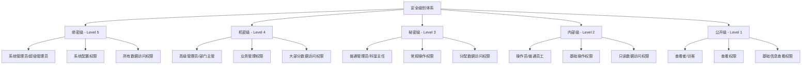
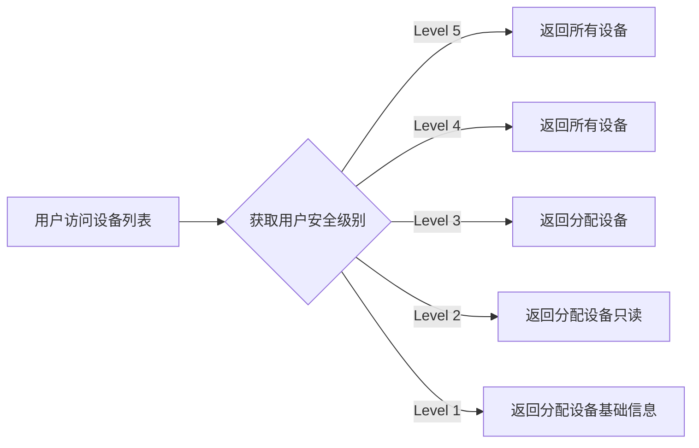
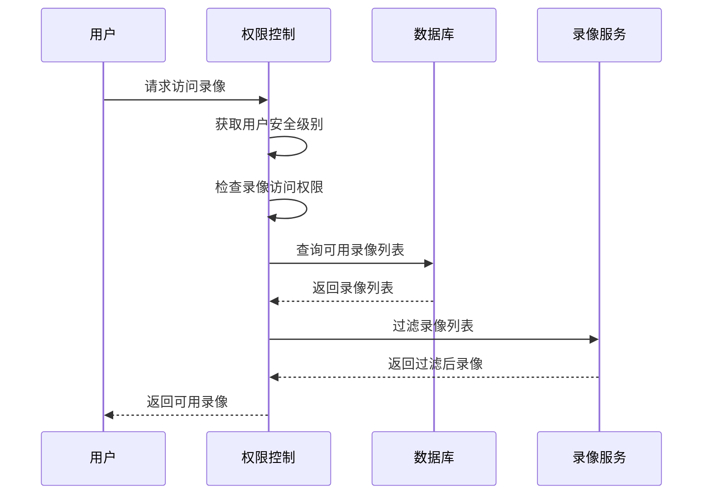
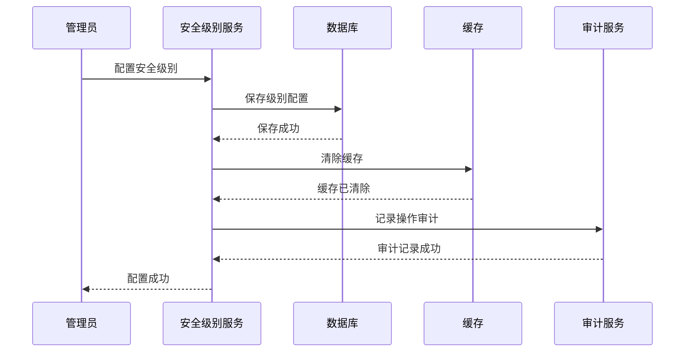

# 安全级别详细设计文档

## 📋 概述

安全级别体系是智能视频模块的核心安全机制，通过5级安全级别控制用户对功能和数据的访问权限，确保系统的安全性和合规性。本文档详细定义了安全级别的概念、权限模型、控制机制和实现方案。

## 🔐 安全级别体系

### 1. 五级安全级别定义



### 2. 安全级别详细说明

#### 2.1 绝密级 (Level 5) - 最高权限

**典型用户**：
- 系统超级管理员
- 系统安全管理员
- 审计员

**功能权限**：
- ✅ 系统配置管理（全局参数、安全策略、备份恢复）
- ✅ 用户权限管理（用户CRUD、角色分配、权限配置）
- ✅ 安全级别管理（级别定义、权限矩阵、审计配置）
- ✅ 系统监控管理（性能监控、资源监控、健康检查）
- ✅ 数据备份恢复（备份策略、数据恢复、灾难恢复）
- ✅ 解密上墙管理（解码器配置、大屏管理、全局联动）
- ✅ 算法库管理（AI算法配置、模型更新、性能调优）

**数据权限**：
- ✅ 所有设备数据（设备列表、配置信息、状态数据）
- ✅ 所有录像数据（实时录像、历史录像、备份录像）
- ✅ 所有告警数据（实时告警、历史告警、处理记录）
- ✅ 所有用户数据（用户信息、操作日志、审计日志）
- ✅ 所有系统日志（操作日志、错误日志、性能日志）

**操作权限**：
- ✅ 所有增删改查操作
- ✅ 系统配置修改
- ✅ 用户权限变更
- ✅ 数据导出导入
- ✅ 系统维护操作

#### 2.2 机密级 (Level 4) - 高权限

**典型用户**：
- 高级管理员
- 部门主管
- 项目经理

**功能权限**：
- ✅ 设备管理（所有设备注册、配置、删除）
- ✅ 实时监控（所有监控点预览、控制）
- ✅ 录像回放（所有录像查询、回放、下载）
- ✅ 行为分析（所有分析规则、结果查看、算法配置）
- ✅ 告警管理（所有告警配置、处理、统计）
- ✅ 解码上墙（所有解码器控制、大屏操作）
- ✅ 报表统计（所有统计报表、数据导出）
- ❌ 系统配置管理（无权限）
- ❌ 用户权限管理（无权限）

**数据权限**：
- ✅ 所有业务数据（设备、录像、告警、分析）
- ✅ 所有统计数据（报表、趋势、分析）
- ❌ 系统配置数据（无权限）
- ❌ 用户权限数据（无权限）
- ❌ 审计日志数据（无权限）

**操作权限**：
- ✅ 所有业务操作
- ✅ 数据导出操作
- ❌ 系统配置修改
- ❌ 权限变更操作

#### 2.3 秘密级 (Level 3) - 中权限

**典型用户**：
- 普通管理员
- 科室主任
- 区域负责人

**功能权限**：
- ✅ 设备管理（分配设备的注册、配置、删除）
- ✅ 实时监控（分配监控点的预览、控制）
- ✅ 录像回放（分配设备录像的查询、回放、下载）
- ✅ 行为分析（分配设备的分析规则、结果查看）
- ✅ 告警管理（分配设备告警的处理、统计）
- ✅ 解码上墙（分配解码器的控制、大屏操作）
- ✅ 报表统计（分配区域的统计报表、数据导出）
- ❌ 全局配置（无权限）
- ❌ 用户管理（无权限）
- ❌ 跨区域数据（无权限）

**数据权限**：
- ✅ 分配设备的所有数据
- ✅ 分配区域的统计数据
- ❌ 非分配设备数据
- ❌ 系统配置数据

**操作权限**：
- ✅ 分配数据的增删改查
- ✅ 分配设备的所有操作
- ❌ 全局配置修改
- ❌ 权限变更操作

#### 2.4 内部级 (Level 2) - 低权限

**典型用户**：
- 操作员
- 普通员工
- 维护人员

**功能权限**：
- ✅ 实时监控（分配监控点的预览查看）
- ✅ 录像回放（分配设备录像的查看）
- ✅ 告警管理（分配设备告警的查看和处理）
- ✅ 基础设备操作（重启、固件升级）
- ❌ 设备配置修改（无权限）
- ❌ 录像下载（无权限）
- ❌ 录像删除（无权限）
- ❌ 解码上墙操作（无权限）
- ❌ 数据导出（无权限）

**数据权限**：
- ✅ 分配设备的实时数据（只读）
- ✅ 分配设备的录像数据（只读）
- ✅ 分配设备的告警数据（只读）

**操作权限**：
- ✅ 查看权限
- ✅ 告警处理权限
- ✅ 基础操作权限（重启等）
- ❌ 修改权限
- ❌ 删除权限

#### 2.5 公开级 (Level 1) - 最低权限

**典型用户**：
- 查看者
- 访客
- 临时用户

**功能权限**：
- ✅ 实时监控（分配监控点的只读预览）
- ✅ 录像回放（分配设备录像的只读查看）
- ✅ 告警信息（分配设备告警的只读查看）
- ❌ 所有控制操作（无权限）
- ❌ 所有配置操作（无权限）
- ❌ 所有修改操作（无权限）

**数据权限**：
- ✅ 分配设备的基础信息（只读）
- ✅ 分配设备的实时状态（只读）
- ✅ 分配设备的告警信息（只读）

**操作权限**：
- ✅ 只读权限
- ❌ 所有写权限
- ❌ 所有操作权限

## 📊 功能权限矩阵

### 1. 设备管理模块权限矩阵

| 功能项 | 绝密级 | 机密级 | 秘密级 | 内部级 | 公开级 |
|--------|--------|--------|--------|--------|--------|
| **设备注册** |
| 手动新增设备 | ✅ | ✅ | ✅ | ❌ | ❌ |
| 批量导入设备 | ✅ | ✅ | ✅ | ❌ | ❌ |
| 自动检测设备 | ✅ | ✅ | ✅ | ❌ | ❌ |
| 设备模板管理 | ✅ | ✅ | ✅ | ❌ | ❌ |
| **设备配置** |
| 基础信息配置 | ✅ | ✅ | ✅ | ❌ | ❌ |
| 视频参数配置 | ✅ | ✅ | ✅ | ❌ | ❌ |
| 录像参数配置 | ✅ | ✅ | ✅ | ❌ | ❌ |
| 网络参数配置 | ✅ | ✅ | ✅ | ❌ | ❌ |
| AI算法配置 | ✅ | ✅ | ❌ | ❌ | ❌ |
| **设备操作** |
| 设备重启 | ✅ | ✅ | ✅ | ✅ | ❌ |
| 固件升级 | ✅ | ✅ | ✅ | ❌ | ❌ |
| 设备删除 | ✅ | ✅ | ❌ | ❌ | ❌ |
| 设备分组 | ✅ | ✅ | ✅ | ❌ | ❌ |
| **设备查看** |
| 设备列表查看 | ✅ | ✅ | ✅ | ✅ | ✅ |
| 设备详情查看 | ✅ | ✅ | ✅ | ✅ | ✅ |
| 设备状态查看 | ✅ | ✅ | ✅ | ✅ | ✅ |
| 设备性能查看 | ✅ | ✅ | ✅ | ✅ | ❌ |

### 2. 实时监控模块权限矩阵

| 功能项 | 绝密级 | 机密级 | 秘密级 | 内部级 | 公开级 |
|--------|--------|--------|--------|--------|--------|
| **画面预览** |
| 单画面预览 | ✅ | ✅ | ✅ | ✅ | ✅ |
| 4画面预览 | ✅ | ✅ | ✅ | ✅ | ❌ |
| 9画面预览 | ✅ | ✅ | ✅ | ✅ | ❌ |
| 16画面预览 | ✅ | ✅ | ✅ | ❌ | ❌ |
| 25画面预览 | ✅ | ✅ | ✅ | ❌ | ❌ |
| 全屏预览 | ✅ | ✅ | ✅ | ✅ | ✅ |
| **云台控制** |
| 方向控制 | ✅ | ✅ | ✅ | ✅ | ❌ |
| 变焦控制 | ✅ | ✅ | ✅ | ✅ | ❌ |
| 预置位设置 | ✅ | ✅ | ✅ | ❌ | ❌ |
| 巡航设置 | ✅ | ✅ | ✅ | ❌ | ❌ |
| **画面操作** |
| 截图功能 | ✅ | ✅ | ✅ | ✅ | ❌ |
| 录像功能 | ✅ | ✅ | ✅ | ❌ | ❌ |
| 画面调节 | ✅ | ✅ | ✅ | ✅ | ❌ |
| 电子放大 | ✅ | ✅ | ✅ | ✅ | ✅ |

### 3. 录像回放模块权限矩阵

| 功能项 | 绝密级 | 机密级 | 秘密级 | 内部级 | 公开级 |
|--------|--------|--------|--------|--------|--------|
| **录像查询** |
| 时间段查询 | ✅ | ✅ | ✅ | ✅ | ✅ |
| 设备查询 | ✅ | ✅ | ✅ | ✅ | ✅ |
| 事件查询 | ✅ | ✅ | ✅ | ✅ | ❌ |
| 高级查询 | ✅ | ✅ | ✅ | ✅ | ❌ |
| **回放控制** |
| 播放/暂停 | ✅ | ✅ | ✅ | ✅ | ✅ |
| 倍速播放 | ✅ | ✅ | ✅ | ✅ | ✅ |
| 时间跳转 | ✅ | ✅ | ✅ | ✅ | ✅ |
| 单帧播放 | ✅ | ✅ | ✅ | ✅ | ❌ |
| **录像操作** |
| 录像下载 | ✅ | ✅ | ✅ | ❌ | ❌ |
| 录像删除 | ✅ | ✅ | ❌ | ❌ | ❌ |
| 录像备份 | ✅ | ✅ | ✅ | ❌ | ❌ |
| 录像剪辑 | ✅ | ✅ | ✅ | ❌ | ❌ |
| **统计报表** |
| 录像统计 | ✅ | ✅ | ✅ | ✅ | ❌ |
| 存储分析 | ✅ | ✅ | ✅ | ✅ | ❌ |

### 4. 行为分析模块权限矩阵

| 功能项 | 绝密级 | 机密级 | 秘密级 | 内部级 | 公开级 |
|--------|--------|--------|--------|--------|--------|
| **算法配置** |
| 算法模型管理 | ✅ | ✅ | ❌ | ❌ | ❌ |
| 算法参数配置 | ✅ | ✅ | ✅ | ❌ | ❌ |
| 算法性能调优 | ✅ | ✅ | ❌ | ❌ | ❌ |
| **检测规则** |
| 检测区域设置 | ✅ | ✅ | ✅ | ❌ | ❌ |
| 检测规则配置 | ✅ | ✅ | ✅ | ❌ | ❌ |
| 告警阈值设置 | ✅ | ✅ | ✅ | ❌ | ❌ |
| **分析结果** |
| 实时分析查看 | ✅ | ✅ | ✅ | ✅ | ✅ |
| 历史结果查看 | ✅ | ✅ | ✅ | ✅ | ✅ |
| 结果导出 | ✅ | ✅ | ✅ | ❌ | ❌ |
| 结果删除 | ✅ | ✅ | ❌ | ❌ | ❌ |
| **模型管理** |
| 模型训练 | ✅ | ✅ | ❌ | ❌ | ❌ |
| 模型更新 | ✅ | ✅ | ❌ | ❌ | ❌ |
| 模型评估 | ✅ | ✅ | ✅ | ❌ | ❌ |

### 5. 告警管理模块权限矩阵

| 功能项 | 绝密级 | 机密级 | 秘密级 | 内部级 | 公开级 |
|--------|--------|--------|--------|--------|--------|
| **告警配置** |
| 告警规则配置 | ✅ | ✅ | ✅ | ❌ | ❌ |
| 告警联动配置 | ✅ | ✅ | ✅ | ❌ | ❌ |
| 告警通知配置 | ✅ | ✅ | ❌ | ❌ | ❌ |
| 告警模板管理 | ✅ | ✅ | ✅ | ❌ | ❌ |
| **告警处理** |
| 实时告警查看 | ✅ | ✅ | ✅ | ✅ | ✅ |
| 告警确认 | ✅ | ✅ | ✅ | ✅ | ❌ |
| 告警处理 | ✅ | ✅ | ✅ | ✅ | ❌ |
| 告警反馈 | ✅ | ✅ | ✅ | ✅ | ❌ |
| **告警操作** |
| 告警查询 | ✅ | ✅ | ✅ | ✅ | ✅ |
| 告警导出 | ✅ | ✅ | ✅ | ❌ | ❌ |
| 告警删除 | ✅ | ✅ | ❌ | ❌ | ❌ |
| 告警统计 | ✅ | ✅ | ✅ | ✅ | ❌ |

### 6. 解码上墙模块权限矩阵

| 功能项 | 绝密级 | 机密级 | 秘密级 | 内部级 | 公开级 |
|--------|--------|--------|--------|--------|--------|
| **解码器管理** |
| 解码器注册 | ✅ | ✅ | ✅ | ❌ | ❌ |
| 解码器配置 | ✅ | ✅ | ✅ | ❌ | ❌ |
| 解码器删除 | ✅ | ✅ | ❌ | ❌ | ❌ |
| **大屏控制** |
| 大屏布局配置 | ✅ | ✅ | ✅ | ❌ | ❌ |
| 窗口管理 | ✅ | ✅ | ✅ | ✅ | ❌ |
| 显示内容配置 | ✅ | ✅ | ✅ | ✅ | ❌ |
| **上墙操作** |
| 实时视频上墙 | ✅ | ✅ | ✅ | ✅ | ✅ |
| 录像回放上墙 | ✅ | ✅ | ✅ | ✅ | ❌ |
| 图片上墙 | ✅ | ✅ | ✅ | ✅ | ❌ |
| 多屏联动 | ✅ | ✅ | ✅ | ❌ | ❌ |

### 7. 报表统计模块权限矩阵

| 功能项 | 绝密级 | 机密级 | 秘密级 | 内部级 | 公开级 |
|--------|--------|--------|--------|--------|--------|
| **统计报表** |
| 综合统计 | ✅ | ✅ | ✅ | ✅ | ❌ |
| 设备统计 | ✅ | ✅ | ✅ | ✅ | ❌ |
| 告警统计 | ✅ | ✅ | ✅ | ✅ | ❌ |
| 存储统计 | ✅ | ✅ | ✅ | ✅ | ❌ |
| **报表操作** |
| 报表生成 | ✅ | ✅ | ✅ | ✅ | ❌ |
| 报表导出 | ✅ | ✅ | ✅ | ❌ | ❌ |
| 报表打印 | ✅ | ✅ | ✅ | ✅ | ❌ |
| 报表计划 | ✅ | ✅ | ✅ | ❌ | ❌ |

## 🔒 数据权限控制

### 1. 设备数据权限

#### 1.1 设备列表访问权限


#### 1.2 设备详情访问权限
```sql
-- 设备数据权限控制SQL示例
SELECT d.*
FROM ivs_device d
WHERE
    -- Level 5: 所有设备
    (d.create_by IN (
        SELECT user_id FROM user_security_level WHERE security_level_id = 5
    ))
    OR
    -- Level 4: 所有设备
    (d.create_by IN (
        SELECT user_id FROM user_security_level WHERE security_level_id = 4
    ))
    OR
    -- Level 3: 分配设备
    (d.device_id IN (
        SELECT device_id FROM user_device_permission
        WHERE user_id = :currentUserId
    ))
    OR
    -- Level 2: 分配设备只读
    (d.device_id IN (
        SELECT device_id FROM user_device_permission
        WHERE user_id = :currentUserId
        AND permission_type = 'READ'
    ))
    OR
    -- Level 1: 分配设备基础信息
    (d.device_id IN (
        SELECT device_id FROM user_device_permission
        WHERE user_id = :currentUserId
        AND permission_type = 'VIEW'
    ))
```

### 2. 录像数据权限

#### 2.1 录像访问权限矩阵
| 安全级别 | 访问范围 | 操作权限 |
|---------|---------|----------|
| Level 5 | 所有录像 | 全部操作 |
| Level 4 | 所有录像 | 除删除外的操作 |
| Level 3 | 分配设备录像 | 增删改查 |
| Level 2 | 分配设备录像 | 只读 |
| Level 1 | 分配设备基础录像 | 只读 |

#### 2.2 录像权限控制流程


### 3. 告警数据权限

#### 3.1 告警访问权限
- **Level 5**: 查看所有告警，处理所有告警
- **Level 4**: 查看所有告警，处理业务告警
- **Level 3**: 查看分配设备告警，处理分配设备告警
- **Level 2**: 查看分配设备告警，处理权限内告警
- **Level 1**: 查看分配设备告警，无处理权限

#### 3.2 告警处理权限控制
```java
// 告警处理权限检查
public class AlarmPermissionChecker {

    public boolean canProcessAlarm(User user, Alarm alarm) {
        int userLevel = getUserSecurityLevel(user.getId());
        Device device = alarm.getDevice();

        switch (userLevel) {
            case 5: // 绝密级
                return true;
            case 4: // 机密级
                return true;
            case 3: // 秘密级
                return isUserAssignedDevice(user.getId(), device.getId());
            case 2: // 内部级
                return isUserAssignedDevice(user.getId(), device.getId())
                    && hasProcessPermission(user.getId(), alarm.getType());
            case 1: // 公开级
                return false;
            default:
                return false;
        }
    }
}
```

## 🛡️ 权限控制实现

### 1. 前端权限控制

#### 1.1 菜单权限控制
```javascript
// 菜单权限控制
class MenuPermission {
    // 检查菜单权限
    static checkMenuPermission(menuCode, userLevel) {
        const menuConfig = this.getMenuConfig(menuCode);
        return userLevel >= menuConfig.minLevel;
    }

    // 动态菜单生成
    static generateMenu(userLevel) {
        const allMenus = this.getAllMenus();
        const allowedMenus = allMenus.filter(menu => {
            return this.checkMenuPermission(menu.code, userLevel);
        });
        return allowedMenus;
    }
}

// 页面级权限控制
const withPermission = (requiredLevel) => (WrappedComponent) => {
    return (props) => {
        const { userLevel } = useAuth();
        const hasPermission = userLevel >= requiredLevel;

        if (!hasPermission) {
            return <UnauthorizedPage />;
        }

        return <WrappedComponent {...props} />;
    };
};

// 使用示例
@withPermission(3) // 需要Level 3以上权限
class DeviceManagement extends Component {
    // 组件实现
}
```

#### 1.2 按钮权限控制
```javascript
// 按钮权限控制组件
const PermissionButton = ({ level, permission, children, ...props }) => {
    const { userLevel } = useAuth();

    const hasPermission = () => {
        if (userLevel >= level && permission) {
            return checkPermission(permission);
        }
        return userLevel >= level;
    };

    if (!hasPermission()) {
        return null;
    }

    return (
        <button {...props}>
            {children}
        </button>
    );
};

// 使用示例
<PermissionButton level={3} permission="device:add">
    新增设备
</PermissionButton>

<PermissionButton level={2}>
    查看监控
</PermissionButton>
```

#### 1.3 数据权限控制
```javascript
// 数据权限控制
class DataPermission {
    // 过滤设备列表
    static filterDevices(devices, userId, userLevel) {
        switch (userLevel) {
            case 5: // 绝密级
                return devices;
            case 4: // 机密级
                return devices;
            case 3: // 秘密级
                return this.getAssignedDevices(userId);
            case 2: // 内部级
                return this.getAssignedDevices(userId).map(d => ({
                    ...d,
                    readonly: true
                }));
            case 1: // 公开级
                return this.getAssignedDevices(userId).map(d => ({
                    ...d,
                    basic: true
                }));
            default:
                return [];
        }
    }

    // 获取用户分配设备
    static getAssignedDevices(userId) {
        return api.getUserDevices(userId).then(res => res.data);
    }
}

// 组件中使用
const DeviceList = () => {
    const { userId, userLevel } = useAuth();
    const [devices, setDevices] = useState([]);

    useEffect(() => {
        api.getDevices().then(res => {
            const filteredDevices = DataPermission.filterDevices(
                res.data,
                userId,
                userLevel
            );
            setDevices(filteredDevices);
        });
    }, [userId, userLevel]);

    return <DeviceTable devices={devices} />;
};
```

### 2. 后端权限控制

#### 2.1 权限注解
```java
// 安全级别注解
@Target({ElementType.METHOD, ElementType.TYPE})
@Retention(RetentionPolicy.RUNTIME)
@Documented
public @interface SecurityLevel {
    int value() default 1;
    String[] permissions() default {};
    String description() default "";
}

// 功能权限注解
@Target({ElementType.METHOD, ElementType.TYPE})
@Retention(RetentionPolicy.RUNTIME)
@Documented
public @interface Permission {
    String value();
    String description() default "";
}

// 数据权限注解
@Target({ElementType.METHOD, ElementType.TYPE})
@Retention(RetentionPolicy.RUNTIME)
@Documented
public @interface DataPermission {
    String value();
    String description() default "";
}
```

#### 2.2 权限切面
```java
@Aspect
@Component
public class SecurityPermissionAspect {

    @Around("@annotation(securityLevel)")
    public Object checkSecurityLevel(ProceedingJoinPoint joinPoint, SecurityLevel securityLevel) throws Throwable {
        // 获取当前用户
        User currentUser = SecurityUtils.getCurrentUser();
        if (currentUser == null) {
            throw new UnauthorizedException("用户未登录");
        }

        // 检查安全级别
        int userLevel = getUserSecurityLevel(currentUser.getId());
        if (userLevel < securityLevel.value()) {
            throw new ForbiddenException("安全级别不足，需要Level " + securityLevel.value());
        }

        // 检查功能权限
        if (securityLevel.permissions().length > 0) {
            for (String permission : securityLevel.permissions()) {
                if (!hasPermission(currentUser.getId(), permission)) {
                    throw new ForbiddenException("缺少权限：" + permission);
                }
            }
        }

        return joinPoint.proceed();
    }

    @Around("@annotation(dataPermission)")
    public Object checkDataPermission(ProceedingJoinPoint joinPoint, DataPermission dataPermission) throws Throwable {
        User currentUser = SecurityUtils.getCurrentUser();
        if (currentUser == null) {
            throw new UnauthorizedException("用户未登录");
        }

        // 获取方法参数
        Object[] args = joinPoint.getArgs();
        Object dataId = extractDataId(args);

        // 检查数据权限
        if (!hasDataPermission(currentUser.getId(), dataPermission.value(), dataId)) {
            throw new ForbiddenException("无数据访问权限");
        }

        return joinPoint.proceed();
    }

    // 获取用户安全级别
    private int getUserSecurityLevel(Long userId) {
        UserSecurityLevel userLevel = userSecurityLevelService.getByUserId(userId);
        if (userLevel == null) {
            return 1; // 默认Level 1
        }
        return securityLevelConfigService.getById(userLevel.getSecurityLevelId()).getLevelValue();
    }

    // 检查功能权限
    private boolean hasPermission(Long userId, String permission) {
        return permissionService.hasPermission(userId, permission);
    }

    // 检查数据权限
    private boolean hasDataPermission(Long userId, String dataType, Object dataId) {
        int userLevel = getUserSecurityLevel(userId);
        switch (dataType) {
            case "device":
                return checkDevicePermission(userId, userLevel, (Long) dataId);
            case "record":
                return checkRecordPermission(userId, userLevel, (Long) dataId);
            case "alarm":
                return checkAlarmPermission(userId, userLevel, (Long) dataId);
            default:
                return false;
        }
    }
}
```

#### 2.3 权限服务实现
```java
@Service
public class PermissionServiceImpl implements PermissionService {

    @Autowired
    private UserSecurityLevelMapper userSecurityLevelMapper;

    @Autowired
    private SecurityLevelConfigMapper securityLevelConfigMapper;

    @Autowired
    private FunctionPermissionConfigMapper functionPermissionMapper;

    @Autowired
    private UserDevicePermissionMapper userDevicePermissionMapper;

    @Override
    public boolean hasPermission(Long userId, String permission) {
        // 获取用户安全级别
        int userLevel = getUserSecurityLevel(userId);

        // 查询功能权限配置
        FunctionPermissionConfig config = functionPermissionMapper.selectByPermissionCode(permission);
        if (config == null) {
            return false;
        }

        // 解析允许的安全级别
        List<Integer> allowedLevels = parseAllowedLevels(config.getSecurityLevels());

        // 检查用户级别是否在允许范围内
        return allowedLevels.contains(userLevel);
    }

    @Override
    public boolean hasDevicePermission(Long userId, Long deviceId, String operation) {
        // 获取用户安全级别
        int userLevel = getUserSecurityLevel(userId);

        // Level 5和4有所有设备权限
        if (userLevel >= 4) {
            return true;
        }

        // 查询用户设备权限
        UserDevicePermission permission = userDevicePermissionMapper.selectByUserAndDevice(userId, deviceId);
        if (permission == null) {
            return false;
        }

        // 根据安全级别和操作类型检查权限
        return checkDeviceOperationPermission(userLevel, operation, permission);
    }

    @Override
    public List<Long> getAccessibleDeviceIds(Long userId) {
        // 获取用户安全级别
        int userLevel = getUserSecurityLevel(userId);

        // Level 5和4可以访问所有设备
        if (userLevel >= 4) {
            return deviceMapper.selectAllDeviceIds();
        }

        // Level 3及以下只能访问分配设备
        return userDevicePermissionMapper.selectDeviceIdsByUserId(userId);
    }

    private int getUserSecurityLevel(Long userId) {
        UserSecurityLevel userLevel = userSecurityLevelMapper.selectByUserId(userId);
        if (userLevel == null) {
            return 1; // 默认Level 1
        }

        SecurityLevelConfig config = securityLevelConfigMapper.selectById(userLevel.getSecurityLevelId());
        return config.getLevelValue();
    }

    private List<Integer> parseAllowedLevels(String securityLevelsJson) {
        // 解析JSON格式的安全级别配置
        // 实现JSON解析逻辑
    }

    private boolean checkDeviceOperationPermission(int userLevel, String operation, UserDevicePermission permission) {
        // 根据安全级别和操作类型检查权限
        // Level 3: 全部操作权限
        // Level 2: 只读和部分操作权限
        // Level 1: 只读权限
        switch (userLevel) {
            case 3:
                return true;
            case 2:
                return permission.getReadOnly() || hasWritePermission(operation);
            case 1:
                return permission.getViewOnly();
            default:
                return false;
        }
    }
}
```

## 📊 权限审计

### 1. 审计日志记录

```sql
-- 权限审计日志表
CREATE TABLE security_audit_log (
    id BIGINT PRIMARY KEY AUTO_INCREMENT COMMENT 'ID',
    user_id BIGINT NOT NULL COMMENT '用户ID',
    user_name VARCHAR(100) NOT NULL COMMENT '用户名',
    security_level INT NOT NULL COMMENT '用户安全级别',
    operation_type VARCHAR(50) NOT NULL COMMENT '操作类型：LOGIN/LOGOUT/ACCESS/DENY',
    operation_module VARCHAR(50) NOT NULL COMMENT '操作模块：DEVICE/RECORD/ALARM/...',
    operation_function VARCHAR(100) NOT NULL COMMENT '操作功能',
    resource_type VARCHAR(50) COMMENT '资源类型',
    resource_id VARCHAR(100) COMMENT '资源ID',
    resource_name VARCHAR(200) COMMENT '资源名称',
    operation_data TEXT COMMENT '操作数据（JSON格式）',
    permission_checked VARCHAR(200) COMMENT '检查的权限',
    check_result TINYINT NOT NULL COMMENT '权限检查结果：0-失败,1-成功',
    failure_reason VARCHAR(500) COMMENT '失败原因',
    client_ip VARCHAR(50) COMMENT '客户端IP',
    user_agent VARCHAR(500) COMMENT '用户代理',
    operation_time DATETIME DEFAULT CURRENT_TIMESTAMP COMMENT '操作时间',
    INDEX idx_user_id (user_id),
    INDEX idx_security_level (security_level),
    INDEX idx_operation_time (operation_time),
    INDEX idx_operation_type (operation_type),
    INDEX idx_check_result (check_result)
) ENGINE=InnoDB DEFAULT CHARSET=utf8mb4 COMMENT='权限审计日志表';
```

### 2. 权限审计查询

```sql
-- 权限使用统计查询
SELECT
    security_level,
    operation_module,
    operation_function,
    COUNT(*) AS operation_count,
    SUM(CASE WHEN check_result = 1 THEN 1 ELSE 0 END) AS success_count,
    SUM(CASE WHEN check_result = 0 THEN 1 ELSE 0 END) AS failure_count,
    ROUND(AVG(CASE WHEN check_result = 1 THEN 1 ELSE 0 END) * 100, 2) AS success_rate
FROM security_audit_log
WHERE operation_time >= DATE_SUB(NOW(), INTERVAL 7 DAY)
GROUP BY security_level, operation_module, operation_function
ORDER BY operation_count DESC;
```

### 3. 异常权限检测

```java
// 异常权限检测服务
@Service
public class AnomalyPermissionDetectionService {

    // 检测越权访问
    public void detectUnauthorizedAccess() {
        // 查询异常访问记录
        List<SecurityAuditLog> anomalies = securityAuditLogMapper.selectUnauthorizedAccess();

        for (SecurityAuditLog anomaly : anomalies) {
            // 发送告警通知
            sendAnomalyAlert(anomaly);

            // 记录异常日志
            logAnomaly(anomaly);

            // 自动封禁IP（如果启用）
            if (isAutoBlockEnabled()) {
                blockIP(anomaly.getClientIp());
            }
        }
    }

    // 检测权限滥用
    public void detectPermissionAbuse() {
        // 统计用户权限使用情况
        List<UserPermissionStat> stats = calculateUserPermissionStats();

        for (UserPermissionStat stat : stats) {
            // 检测异常高频操作
            if (stat.getOperationCount() > getAbuseThreshold()) {
                sendAbuseAlert(stat);
            }

            // 检测异常时间段操作
            if (isUnusualTimeOperation(stat)) {
                sendUnusualTimeAlert(stat);
            }
        }
    }

    // 检测权限变更
    public void detectPermissionChanges() {
        // 查询权限变更记录
        List<PermissionChange> changes = permissionChangeMapper.selectRecentChanges();

        for (PermissionChange change : changes) {
            // 检查权限变更是否异常
            if (isSuspiciousChange(change)) {
                // 发送审批请求
                submitChangeForApproval(change);
            }
        }
    }
}
```

## 🔄 权限缓存策略

### 1. 缓存设计

```java
// 权限缓存管理器
@Component
public class PermissionCacheManager {

    private static final String USER_LEVEL_KEY = "user:level:";
    private static final String USER_PERMISSIONS_KEY = "user:perms:";
    private static final String USER_DEVICES_KEY = "user:devices:";
    private static final long CACHE_EXPIRE_TIME = 3600; // 1小时

    @Autowired
    private RedisTemplate<String, Object> redisTemplate;

    // 缓存用户安全级别
    public void cacheUserSecurityLevel(Long userId, Integer level) {
        String key = USER_LEVEL_KEY + userId;
        redisTemplate.opsForValue().set(key, level, CACHE_EXPIRE_TIME, TimeUnit.SECONDS);
    }

    // 获取用户安全级别
    public Integer getUserSecurityLevel(Long userId) {
        String key = USER_LEVEL_KEY + userId;
        Integer level = (Integer) redisTemplate.opsForValue().get(key);
        if (level == null) {
            level = loadUserSecurityLevel(userId);
            cacheUserSecurityLevel(userId, level);
        }
        return level;
    }

    // 缓存用户权限
    public void cacheUserPermissions(Long userId, Set<String> permissions) {
        String key = USER_PERMISSIONS_KEY + userId;
        redisTemplate.opsForValue().set(key, permissions, CACHE_EXPIRE_TIME, TimeUnit.SECONDS);
    }

    // 获取用户权限
    public Set<String> getUserPermissions(Long userId) {
        String key = USER_PERMISSIONS_KEY + userId;
        Set<String> permissions = (Set<String>) redisTemplate.opsForValue().get(key);
        if (permissions == null) {
            permissions = loadUserPermissions(userId);
            cacheUserPermissions(userId, permissions);
        }
        return permissions;
    }

    // 缓存用户可访问设备列表
    public void cacheUserDevices(Long userId, List<Long> deviceIds) {
        String key = USER_DEVICES_KEY + userId;
        redisTemplate.opsForValue().set(key, deviceIds, CACHE_EXPIRE_TIME, TimeUnit.SECONDS);
    }

    // 获取用户可访问设备列表
    public List<Long> getUserDevices(Long userId) {
        String key = USER_DEVICES_KEY + userId;
        List<Long> deviceIds = (List<Long>) redisTemplate.opsForValue().get(key);
        if (deviceIds == null) {
            deviceIds = loadUserDevices(userId);
            cacheUserDevices(userId, deviceIds);
        }
        return deviceIds;
    }

    // 清除用户缓存
    public void clearUserCache(Long userId) {
        redisTemplate.delete(USER_LEVEL_KEY + userId);
        redisTemplate.delete(USER_PERMISSIONS_KEY + userId);
        redisTemplate.delete(USER_DEVICES_KEY + userId);
    }

    // 批量清除用户缓存
    @EventListener
    public void handlePermissionChange(PermissionChangeEvent event) {
        clearUserCache(event.getUserId());
    }
}
```

### 2. 缓存更新策略

```java
// 权限变更事件
@Component
public class PermissionChangeEventPublisher {

    @Autowired
    private ApplicationEventPublisher publisher;

    // 发布权限变更事件
    public void publishPermissionChange(Long userId, String changeType, String details) {
        PermissionChangeEvent event = new PermissionChangeEvent(this);
        event.setUserId(userId);
        event.setChangeType(changeType);
        event.setDetails(details);
        event.setChangeTime(new Date());

        publisher.publishEvent(event);
    }
}

// 权限变更事件监听器
@Component
public class PermissionChangeEventListener {

    @Autowired
    private PermissionCacheManager cacheManager;

    @EventListener
    public void handlePermissionChange(PermissionChangeEvent event) {
        Long userId = event.getUserId();

        // 清除用户缓存
        cacheManager.clearUserCache(userId);

        // 记录变更日志
        logPermissionChange(event);

        // 通知用户权限已变更
        notifyUserPermissionChanged(userId);
    }
}
```

## 📋 安全级别管理

### 1. 安全级别配置界面设计

```
┌─────────────────────────────────────────────────────────────┐
│ 安全级别管理                                                  │
├─────────────────────────────────────────────────────────────┤
│ 面包屑: 首页 > 系统管理 > 安全级别管理                       │
├─────────────────────────────────────────────────────────────┤
│ 工具栏                                                         │
│ ┌──────┬──────┬──────┬──────┐                               │
│ │新增级别│级别配置│权限矩阵│用户分配│                               │
│ └──────┴──────┴──────┴──────┘                               │
├─────────────────────────────────────────────────────────────┤
│ 安全级别列表                                                   │
│ ┌─────┬────────┬────────┬──────┬────────┐                   │
│ │级别值│级别名称 │级别代码 │用户数 │操作     │                   │
│ │  5  │ 绝密级  │  TOP   │  10   │配置|用户│                   │
│ │  4  │ 机密级  │ HIGH   │  25   │配置|用户│                   │
│ │  3  │ 秘密级  │ MEDIUM │  50   │配置|用户│                   │
│ │  2  │ 内部级  │ NORMAL │ 100   │配置|用户│                   │
│ │  1  │ 公开级  │ BASIC  │ 200   │配置|用户│                   │
│ └─────┴────────┴────────┴──────┴────────┘                   │
└─────────────────────────────────────────────────────────────┘
```

### 2. 安全级别配置流程



### 3. 用户权限分配

```
┌─────────────────────────────────────────────────────────────┐
│ 用户安全级别分配                                               │
├─────────────────────────────────────────────────────────────┤
│ 选择用户                                                       │
│ ┌─────────────────────────────────────────────────────────┐ │
│ │ 用户名称: [______________] 部门: [全部▼] [搜索]          │ │
│ └─────────────────────────────────────────────────────────┘ │
├─────────────────────────────────────────────────────────────┤
│ 当前安全级别                                                   │
│ ┌─────────────────────────────────────────────────────────┐ │
│ │ 用户: 张三                                        │     │ │
│ │ 当前级别: 内部级 (Level 2)                         │     │ │
│ │ 分配时间: 2024-01-01                              │     │ │
│ │ 有效期至: 2024-12-31                              │     │ │
│ └─────────────────────────────────────────────────────────┘ │
├─────────────────────────────────────────────────────────────┤
│ 安全级别分配                                                   │
│ ┌─────────────────────────────────────────────────────────┐ │
│ │ 新的安全级别: [机密级 (Level 4)               ▼] │     │ │
│ │ 生效时间: [2024-01-15 00:00:00    ]              │     │ │
│ │ 过期时间: [2024-12-31 23:59:59    ]              │     │ │
│ │ 分配原因: [__________________________________] │     │ │
│ └─────────────────────────────────────────────────────────┘ │
├─────────────────────────────────────────────────────────────┤
│ 权限预览                                                       │
│ ┌─────────────────────────────────────────────────────────┐ │
│ │ ✅ 系统配置管理                                      │     │ │
│ │ ✅ 用户权限管理                                      │     │ │
│ │ ✅ 所有设备管理                                      │     │ │
│ │ ✅ 所有监控预览                                      │     │ │
│ │ ❌ 安全级别管理                                      │     │ │
│ └─────────────────────────────────────────────────────────┘ │
├─────────────────────────────────────────────────────────────┤
│ 操作按钮                                                       │
│ ┌─────────────────┬─────────────────┬─────────────────┐     │
│ │      保存       │      取消       │     预览变更     │     │
│ └─────────────────┴─────────────────┴─────────────────┘     │
└─────────────────────────────────────────────────────────────┘
```

## 📝 总结

安全级别设计是智能视频模块的核心安全机制，通过5级安全级别控制用户对功能和数据的访问权限。

### 核心特性
- **5级安全体系**：绝密、机密、秘密、内部、公开
- **细粒度权限控制**：功能、数据、操作三级权限控制
- **完整审计机制**：记录所有权限相关操作
- **高效缓存策略**：提升权限检查性能

### 安全保证
- **身份认证**：多因子身份认证
- **权限验证**：实时权限验证
- **操作审计**：完整的操作审计
- **异常检测**：异常权限行为检测

该设计方案确保了系统的安全性、合规性和可扩展性，为智能视频模块提供了强大的安全保障。

---

*本文档详细阐述了智能视频模块的安全级别设计，包括权限模型、控制机制和实现方案。*
