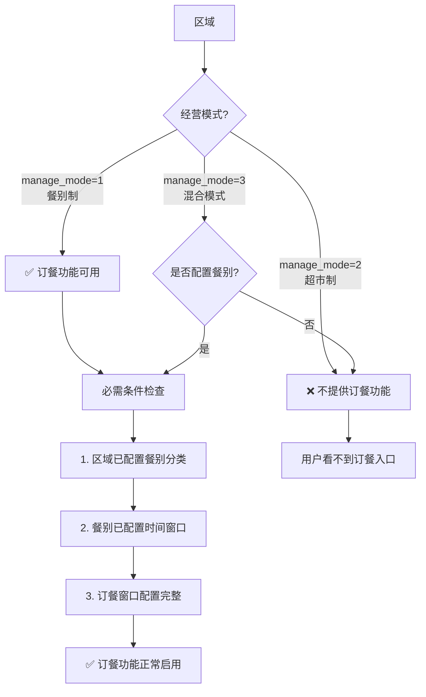
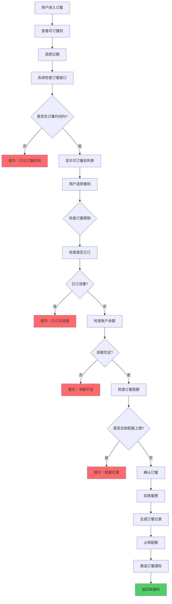
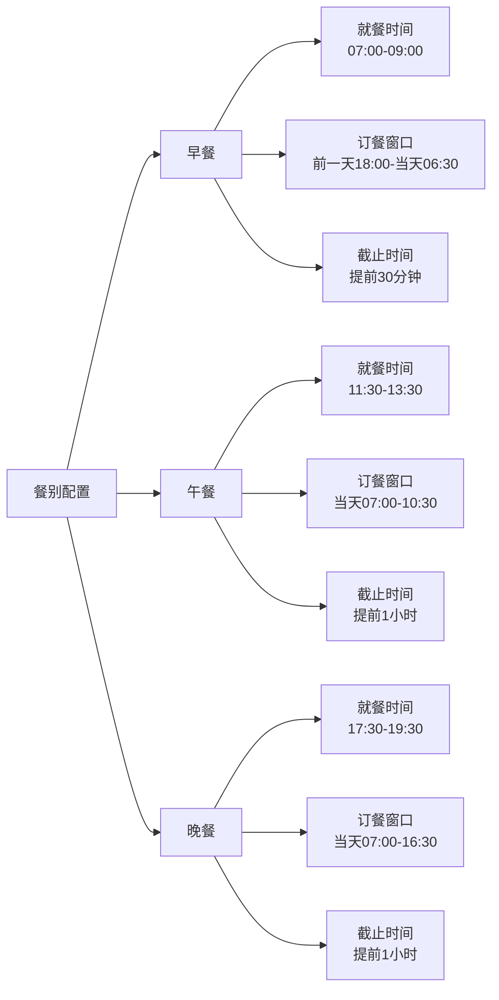
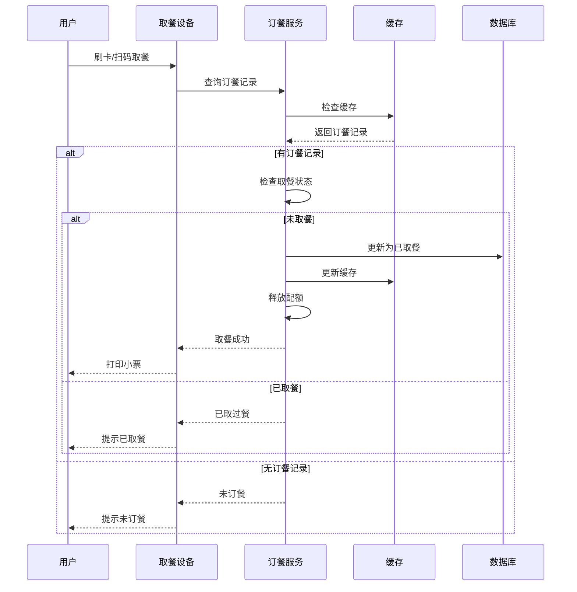
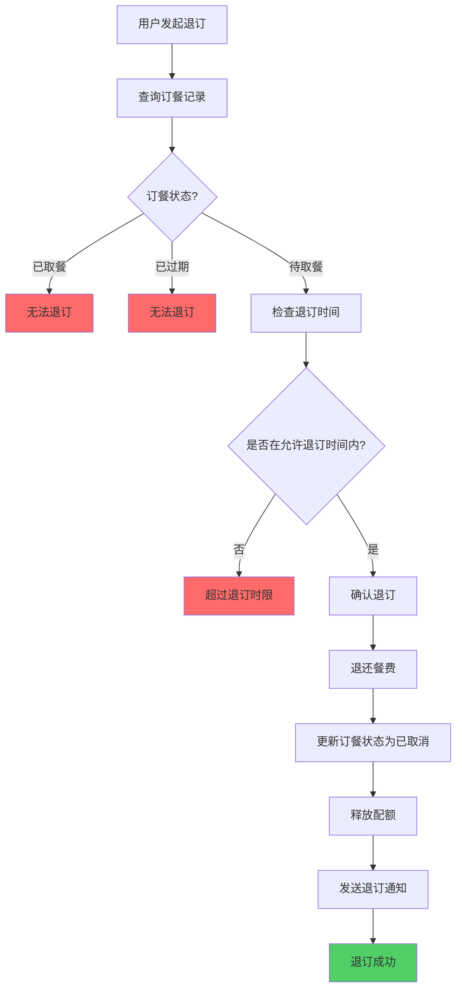
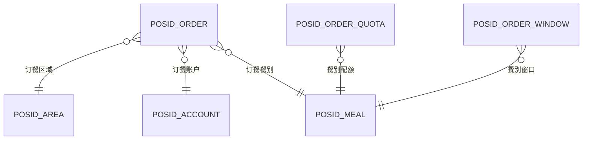
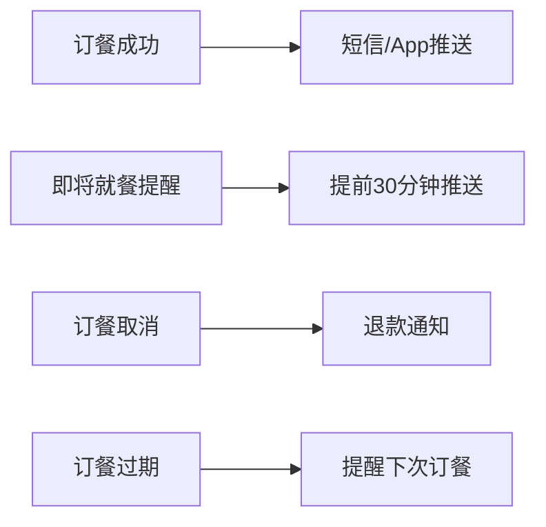

# 07-订餐管理流程重构设计

## 📋 模块概述

**重构目标**：构建灵活的订餐管理系统，支持多种订餐模式和支付方式。

**核心问题**：
- 订餐时间窗口管理混乱
- 订餐数量统计不准确
- 取餐核销流程繁琐
- 缺乏订餐限额控制
- **未明确订餐功能的适用场景**

**重构收益**：
- ✅ 灵活的订餐时间窗口配置
- ✅ 准确的库存和配额管理
- ✅ 快速的取餐核销流程
- ✅ 完整的订餐统计报表
- ✅ **明确订餐功能在不同经营模式中的应用**

---

## 🏗️ 订餐功能与经营模式关系

### 核心原则

**订餐功能主要服务于餐别制和混合模式区域**：

| 经营模式 | 是否支持订餐 | 适用场景 | 业务说明 |
|---------|------------|---------|---------|
| **餐别制<br/>(manage_mode=1)** | ✅ **支持** | 食堂、餐厅、快餐店 | 预订固定餐次，避免高峰拥挤，提前备餐 |
| **超市制<br/>(manage_mode=2)** | ❌ **不支持** | 超市、便利店 | 商品即买即走，无需预订 |
| **混合模式<br/>(manage_mode=3)** | ⚠️ **可选** | 综合餐厅+便利店 | 定值餐品可订餐，自选商品不可订 |

### 订餐功能启用条件



### 订餐业务规则矩阵

| 检查项 | 餐别制 | 超市制 | 混合模式（有餐别） | 混合模式（无餐别） |
|--------|--------|--------|------------------|------------------|
| **显示订餐入口** | ✅ 显示 | ❌ 不显示 | ✅ 显示 | ❌ 不显示 |
| **可订餐别** | 所有餐别 | - | 仅定值餐别 | - |
| **订餐时间窗口** | 必需配置 | - | 必需配置 | - |
| **取餐核销** | 支持 | - | 支持 | - |
| **订餐限额** | 支持 | - | 支持 | - |
| **退订功能** | 支持 | - | 支持 | - |

---

## 🔄 业务流程设计

### 1.1 完整订餐流程



### 1.2 订餐时间窗口配置



### 1.3 取餐核销流程



### 1.4 退订流程



---

## 🗄️ 数据库设计

### 2.1 核心表结构

```sql
-- 订餐记录表
CREATE TABLE POSID_ORDER (
    id VARCHAR(50) PRIMARY KEY,
    order_no VARCHAR(32) UNIQUE COMMENT '订单号',
    
    -- 用户信息
    account_id VARCHAR(50) NOT NULL,
    person_id VARCHAR(50) NOT NULL,
    person_name VARCHAR(100),
    
    -- 餐别信息
    meal_id VARCHAR(50) NOT NULL,
    meal_name VARCHAR(100),
    area_id VARCHAR(50) NOT NULL,
    area_name VARCHAR(100),
    
    -- 订餐日期和时间
    order_date DATE NOT NULL COMMENT '订餐日期',
    meal_time VARCHAR(20) COMMENT '就餐时段',
    
    -- 金额信息
    meal_price INT NOT NULL COMMENT '餐费（分）',
    paid_money INT NOT NULL COMMENT '实付金额（分）',
    
    -- 订餐状态
    status VARCHAR(20) NOT NULL COMMENT 'PENDING-待取餐 TAKEN-已取餐 CANCELLED-已取消 EXPIRED-已过期',
    
    -- 支付方式
    payment_type VARCHAR(20) COMMENT 'PREPAY-预付 POSTPAY-后付',
    payment_time DATETIME COMMENT '支付时间',
    
    -- 取餐信息
    take_time DATETIME COMMENT '取餐时间',
    take_device_id VARCHAR(50) COMMENT '取餐设备',
    
    -- 时间信息
    order_time DATETIME NOT NULL COMMENT '订餐时间',
    create_time DATETIME NOT NULL DEFAULT CURRENT_TIMESTAMP,
    
    INDEX idx_account(account_id, order_date),
    INDEX idx_meal(meal_id, order_date),
    INDEX idx_status(status, order_date),
    INDEX idx_order_no(order_no)
) COMMENT='订餐记录表'
PARTITION BY RANGE (TO_DAYS(order_date)) (
    PARTITION p202501 VALUES LESS THAN (TO_DAYS('2025-02-01'))
);

-- 订餐配额表
CREATE TABLE POSID_ORDER_QUOTA (
    id VARCHAR(50) PRIMARY KEY,
    meal_id VARCHAR(50) NOT NULL,
    area_id VARCHAR(50) NOT NULL,
    order_date DATE NOT NULL,
    
    -- 配额设置
    total_quota INT NOT NULL COMMENT '总配额',
    used_quota INT DEFAULT 0 COMMENT '已使用配额',
    remaining_quota INT COMMENT '剩余配额',
    
    -- 时间信息
    create_time DATETIME NOT NULL,
    update_time DATETIME,
    
    UNIQUE KEY uk_meal_date(meal_id, area_id, order_date),
    INDEX idx_date(order_date)
) COMMENT='订餐配额表';

-- 订餐窗口配置表
CREATE TABLE POSID_ORDER_WINDOW (
    id VARCHAR(50) PRIMARY KEY,
    meal_id VARCHAR(50) NOT NULL,
    area_id VARCHAR(50),
    
    -- 订餐窗口时间
    window_type VARCHAR(20) COMMENT 'ADVANCE-提前订餐 CURRENT-当天订餐',
    advance_days INT DEFAULT 1 COMMENT '可提前订餐天数',
    start_time VARCHAR(10) COMMENT '窗口开始时间 HH:mm',
    end_time VARCHAR(10) COMMENT '窗口结束时间 HH:mm',
    cutoff_minutes INT DEFAULT 60 COMMENT '截止提前分钟数',
    
    -- 限制设置
    max_orders_per_person INT DEFAULT 1 COMMENT '每人每餐最多订餐数',
    allow_cancel BOOLEAN DEFAULT TRUE COMMENT '是否允许退订',
    cancel_deadline_minutes INT DEFAULT 60 COMMENT '退订截止时间（提前分钟）',
    
    UNIQUE KEY uk_meal_area(meal_id, area_id),
    INDEX idx_meal(meal_id)
) COMMENT='订餐窗口配置表';
```

### 2.2 ER关系图



---

## 💾 缓存策略设计

### 3.1 核心缓存

| 缓存项 | Redis Key | 过期时间 | 说明 |
|-------|-----------|---------|------|
| 用户订餐记录 | `order:user:{accountId}:{date}` | 24小时 | 用户某天的订餐 |
| 餐别配额 | `order:quota:{mealId}:{date}` | 实时更新 | 剩余配额数 |
| 订餐窗口 | `order:window:{mealId}` | 1小时 | 窗口配置 |
| 取餐码 | `order:code:{orderNo}` | 24小时 | 取餐验证码 |

### 3.2 配额扣减策略

**Redis原子操作保证并发安全：**
```
DECR order:quota:{mealId}:{date}
检查结果 >= 0 → 订餐成功
检查结果 < 0  → INCR回滚，订餐失败
```

---

## 🚀 性能优化设计

### 4.1 并发订餐优化

**问题：** 配额只有10份，100人同时抢订

**方案1：Redis预扣减**
```
1. Redis DECR扣减配额
2. 异步写入数据库
3. 定时任务校准数据一致性
```

**方案2：消息队列削峰**
```
1. 订餐请求入队（Kafka/RabbitMQ）
2. 后台消费者处理（FIFO）
3. 处理结果异步通知
```

### 4.2 查询优化

**优化1：索引优化**
```sql
-- 用户查询自己的订餐（高频）
INDEX idx_account_date(account_id, order_date, status)

-- 餐厅统计订餐数量（中频）
INDEX idx_meal_date(meal_id, order_date, status)
```

**优化2：分表策略**
- 按月分表
- 历史数据归档（3个月前）

---

## 📊 统计报表

### 5.1 实时统计

| 报表 | 更新频率 | 数据源 |
|------|---------|--------|
| 今日订餐总数 | 实时 | Redis Counter |
| 各餐别订餐数 | 实时 | Redis Hash |
| 配额使用率 | 实时 | Redis计算 |

### 5.2 离线报表

| 报表 | 更新频率 | 用途 |
|------|---------|------|
| 每日订餐统计 | 每天凌晨 | 历史分析 |
| 订餐趋势分析 | 每周 | 配额调整 |
| 取餐率分析 | 每月 | 浪费分析 |

---

## 🔔 通知机制

### 6.1 通知场景



### 6.2 通知渠道

| 渠道 | 优先级 | 使用场景 |
|------|-------|---------|
| App推送 | 高 | 所有通知 |
| 短信 | 中 | 重要通知（订餐成功、退款） |
| 微信公众号 | 低 | 辅助提醒 |

---

## ⚠️ 异常处理

### 7.1 常见异常

| 异常 | 处理策略 | 用户提示 |
|------|---------|---------|
| 配额不足 | 拒绝订餐 | "该餐别配额已满，请选择其他餐别" |
| 已订过餐 | 拒绝订餐 | "您已订过该餐，请勿重复订餐" |
| 余额不足 | 拒绝订餐 | "账户余额不足，请充值" |
| 超过时间窗口 | 拒绝订餐 | "已过订餐时间" |
| 支付失败 | 重试3次 | "支付失败，请重试" |
| 系统故障 | 人工处理 | "系统繁忙，请联系管理员" |

### 7.2 补偿机制

**场景：订餐成功但支付失败**
```
1. 释放占用的配额
2. 删除订餐记录
3. 通知用户重新订餐
```

---

## 📈 监控指标

### 8.1 核心指标

| 指标 | 告警阈值 |
|------|---------|
| 订餐成功率 | < 95% |
| 平均响应时间 | > 500ms |
| 配额使用率 | > 95%（需要扩容） |
| 取餐率 | < 80%（浪费严重） |
| 退订率 | > 20%（配额浪费） |

### 8.2 业务指标

- 各时段订餐高峰分布
- 热门餐别TOP10
- 订餐vs现场消费占比
- 提前订餐天数分布

---

## 🎯 总结

### 重构成果

✅ **灵活窗口配置**：支持提前订餐、当天订餐  
✅ **准确配额管理**：Redis原子操作保证并发安全  
✅ **快速取餐核销**：缓存优化，3秒内完成  
✅ **完整通知机制**：3种通知渠道  
✅ **丰富统计报表**：实时+离线双重统计

### 关键设计

1. **订餐窗口**：灵活配置，支持多种模式
2. **配额管理**：Redis原子操作，并发安全
3. **取餐核销**：缓存优化，快速响应
4. **异常处理**：完整补偿机制
5. **通知推送**：多渠道覆盖

### 支持场景

- 🎓 **校园食堂**：3000人订餐，高峰不卡顿
- 🏥 **医院餐厅**：病人餐提前预定，营养配餐
- 🏢 **企业园区**：员工订餐，食堂备餐精准
- 🏭 **工厂食堂**：多班次订餐，配额独立管理

---

## 📝 更新说明

### v2.0 (2025-10-31)

**核心更新**：
- ✅ 新增"订餐功能与经营模式关系"章节
- ✅ 明确订餐功能的适用场景（餐别制/混合模式）
- ✅ 新增订餐功能启用条件流程图
- ✅ 补充订餐业务规则矩阵

**业务影响**：
- 订餐功能仅在餐别制区域(`manage_mode=1`)和配置了餐别的混合模式区域(`manage_mode=3`)可用
- 超市制区域(`manage_mode=2`)不提供订餐功能，用户看不到订餐入口
- 混合模式区域需根据是否配置餐别来判断订餐功能可用性

---

**文档版本**：v2.0  
**创建时间**：2025-10-31  
**适用版本**：POSID v3.13.1+

