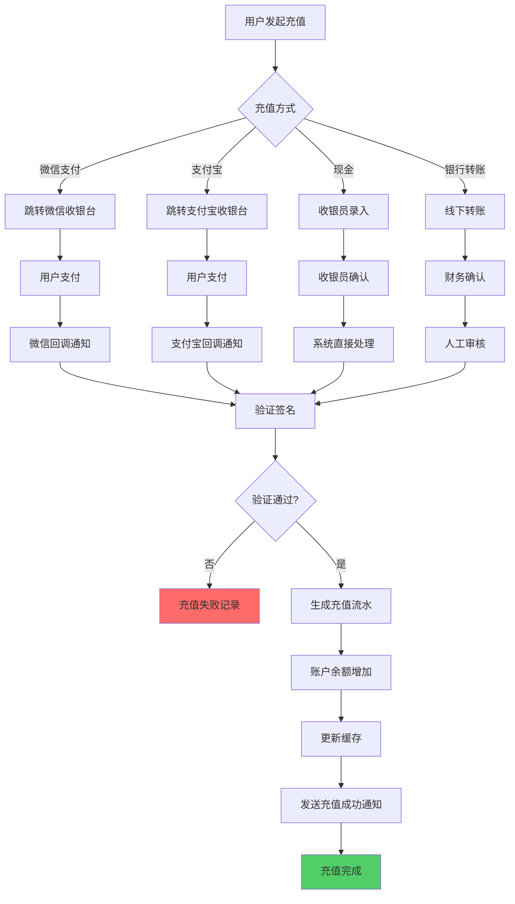
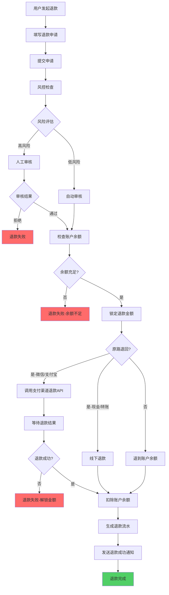
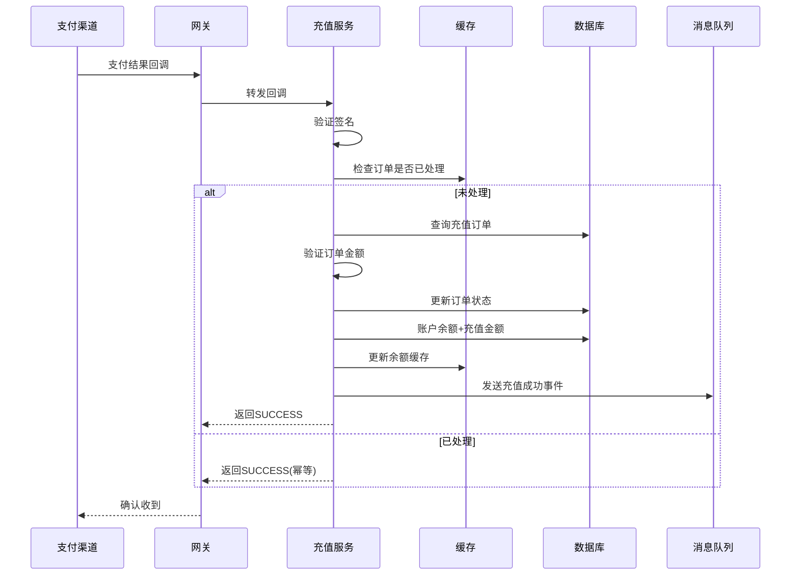
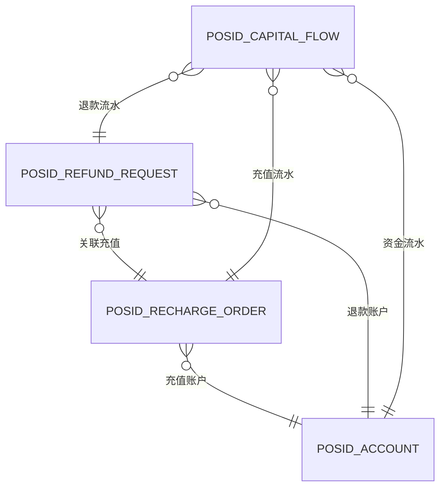
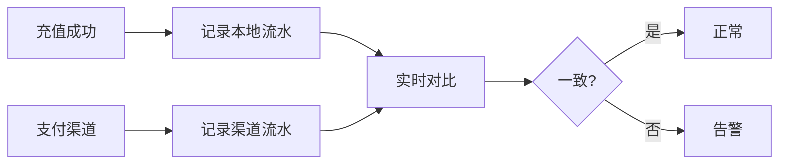

# 08-充值退款流程重构设计

## 📋 模块概述

**重构目标**：构建安全、可靠的资金管理系统，支持多种充值和退款方式。

**核心问题**：
- 充值到账不及时
- 退款流程冗长
- 缺乏资金流水追溯
- 多支付渠道对账困难

**重构收益**：
- ✅ 秒级充值到账
- ✅ 自动化退款流程
- ✅ 完整的资金流水记录
- ✅ 统一的支付渠道管理

**与经营模式关系**：
- ⚪ **与经营模式无关**：充值退款是账户级别操作，不受区域经营模式影响
- ⚪ 所有经营模式的账户均可正常充值退款
- ⚪ 本模块无需调整，保持原有设计即可

---

## 🔄 业务流程设计

### 1.1 充值流程



### 1.2 退款流程



### 1.3 支付渠道回调处理



---

## 🗄️ 数据库设计

### 2.1 核心表结构

```sql
-- 充值订单表
CREATE TABLE POSID_RECHARGE_ORDER (
    id VARCHAR(50) PRIMARY KEY,
    order_no VARCHAR(32) UNIQUE COMMENT '充值订单号',
    
    -- 账户信息
    account_id VARCHAR(50) NOT NULL,
    person_id VARCHAR(50),
    person_name VARCHAR(100),
    
    -- 充值金额（单位：分）
    recharge_money INT NOT NULL COMMENT '充值金额',
    gift_money INT DEFAULT 0 COMMENT '赠送金额',
    actual_money INT NOT NULL COMMENT '实际到账金额',
    
    -- 支付信息
    payment_type VARCHAR(20) NOT NULL COMMENT 'WECHAT-微信 ALIPAY-支付宝 CASH-现金 TRANSFER-转账',
    payment_channel VARCHAR(50) COMMENT '支付渠道订单号',
    payment_time DATETIME COMMENT '支付时间',
    
    -- 订单状态
    status VARCHAR(20) NOT NULL COMMENT 'PENDING-待支付 SUCCESS-成功 FAILED-失败 CLOSED-已关闭',
    
    -- 操作信息
    operator_id VARCHAR(50) COMMENT '操作员ID（现金充值）',
    operator_name VARCHAR(100),
    
    -- 时间信息
    create_time DATETIME NOT NULL DEFAULT CURRENT_TIMESTAMP,
    update_time DATETIME,
    
    INDEX idx_account(account_id, create_time),
    INDEX idx_status(status, create_time),
    INDEX idx_order_no(order_no),
    INDEX idx_payment_channel(payment_channel)
) COMMENT='充值订单表'
PARTITION BY RANGE (TO_DAYS(create_time)) (
    PARTITION p202501 VALUES LESS THAN (TO_DAYS('2025-02-01'))
);

-- 退款申请表
CREATE TABLE POSID_REFUND_REQUEST (
    id VARCHAR(50) PRIMARY KEY,
    refund_no VARCHAR(32) UNIQUE COMMENT '退款单号',
    
    -- 账户信息
    account_id VARCHAR(50) NOT NULL,
    person_id VARCHAR(50),
    person_name VARCHAR(100),
    
    -- 退款金额（单位：分）
    refund_money INT NOT NULL COMMENT '申请退款金额',
    actual_refund_money INT COMMENT '实际退款金额',
    service_charge INT DEFAULT 0 COMMENT '手续费',
    
    -- 退款类型
    refund_type VARCHAR(20) COMMENT 'ORIGINAL-原路退回 BALANCE-退到余额 OFFLINE-线下退款',
    refund_reason VARCHAR(500) COMMENT '退款原因',
    
    -- 关联充值订单
    recharge_order_id VARCHAR(50),
    
    -- 审核信息
    audit_status VARCHAR(20) NOT NULL COMMENT 'PENDING-待审核 APPROVED-已通过 REJECTED-已拒绝',
    auditor_id VARCHAR(50),
    auditor_name VARCHAR(100),
    audit_time DATETIME,
    audit_remark VARCHAR(500),
    
    -- 退款状态
    refund_status VARCHAR(20) COMMENT 'PENDING-待退款 SUCCESS-成功 FAILED-失败',
    refund_time DATETIME,
    refund_channel VARCHAR(50) COMMENT '退款渠道流水号',
    
    -- 时间信息
    create_time DATETIME NOT NULL DEFAULT CURRENT_TIMESTAMP,
    update_time DATETIME,
    
    INDEX idx_account(account_id, create_time),
    INDEX idx_audit_status(audit_status, create_time),
    INDEX idx_refund_status(refund_status, create_time)
) COMMENT='退款申请表';

-- 资金流水表
CREATE TABLE POSID_CAPITAL_FLOW (
    id VARCHAR(50) PRIMARY KEY,
    flow_no VARCHAR(32) UNIQUE COMMENT '流水号',
    
    -- 账户信息
    account_id VARCHAR(50) NOT NULL,
    
    -- 金额信息（单位：分）
    money INT NOT NULL COMMENT '金额',
    balance_before INT NOT NULL COMMENT '操作前余额',
    balance_after INT NOT NULL COMMENT '操作后余额',
    
    -- 流水类型
    flow_type VARCHAR(20) NOT NULL COMMENT 'RECHARGE-充值 CONSUME-消费 REFUND-退款 ADJUST-调账',
    
    -- 关联业务
    business_type VARCHAR(20) COMMENT '业务类型',
    business_id VARCHAR(50) COMMENT '业务ID',
    
    -- 备注
    remark VARCHAR(500),
    
    -- 时间信息
    create_time DATETIME NOT NULL DEFAULT CURRENT_TIMESTAMP,
    
    INDEX idx_account(account_id, create_time),
    INDEX idx_flow_type(flow_type, create_time),
    INDEX idx_business(business_type, business_id)
) COMMENT='资金流水表'
PARTITION BY RANGE (TO_DAYS(create_time)) (
    PARTITION p202501 VALUES LESS THAN (TO_DAYS('2025-02-01'))
);

-- 充值赠送规则表
CREATE TABLE POSID_RECHARGE_GIFT_RULE (
    id VARCHAR(50) PRIMARY KEY,
    rule_name VARCHAR(100) NOT NULL,
    
    -- 充值金额区间（单位：分）
    min_money INT NOT NULL COMMENT '最低充值金额',
    max_money INT COMMENT '最高充值金额',
    
    -- 赠送规则
    gift_type VARCHAR(20) COMMENT 'FIXED-固定金额 PERCENT-百分比',
    gift_value INT NOT NULL COMMENT '赠送值（固定金额或百分比*100）',
    
    -- 生效时间
    start_date DATE,
    end_date DATE,
    
    -- 适用范围
    account_kind_ids TEXT COMMENT '适用账户类别（JSON数组）',
    area_ids TEXT COMMENT '适用区域（JSON数组）',
    
    -- 状态
    enabled BOOLEAN DEFAULT TRUE,
    
    INDEX idx_money(min_money, max_money),
    INDEX idx_date(start_date, end_date)
) COMMENT='充值赠送规则表';
```

### 2.2 ER关系图



---

## 💾 缓存策略设计

### 3.1 核心缓存

| 缓存项 | Redis Key | 过期时间 | 说明 |
|-------|-----------|---------|------|
| 充值订单 | `recharge:order:{orderNo}` | 24小时 | 防重复回调 |
| 退款申请 | `refund:request:{refundNo}` | 7天 | 审核流程 |
| 账户余额 | `account:balance:{accountId}` | 实时更新 | 余额缓存 |
| 支付渠道限流 | `payment:limit:{channel}` | 1分钟 | 限流控制 |

### 3.2 幂等性保证

**Redis SET NX（分布式锁）：**
```
充值回调 → SET recharge:callback:{orderNo} NX EX 60
成功 → 处理充值
失败 → 返回已处理
```

---

## 🚀 性能优化设计

### 4.1 充值优化

**异步处理：**
```
1. 收到支付回调 → 快速响应SUCCESS
2. 异步处理充值逻辑（MQ）
3. 失败重试机制（最多3次）
```

**批量对账：**
```
1. 每天凌晨定时对账
2. 批量查询支付渠道
3. 自动补单/纠错
```

### 4.2 退款优化

**自动审核规则：**
```
IF 退款金额 <= 100元 AND 账户余额充足 AND 风险评分低
THEN 自动通过
ELSE 人工审核
```

**批量退款：**
```
1. 聚合同渠道退款
2. 批量调用退款API
3. 提升效率60%
```

---

## 🔐 安全设计

### 5.1 支付安全

| 措施 | 说明 |
|------|------|
| 签名验证 | 验证支付渠道回调签名 |
| 金额校验 | 订单金额与支付金额一致性检查 |
| 防重放 | 每个回调只处理一次（幂等性） |
| IP白名单 | 只接受支付渠道官方IP |
| HTTPS | 全链路加密传输 |

### 5.2 风控规则

| 规则 | 触发条件 | 处理 |
|------|---------|------|
| 大额充值 | 单笔 > 5000元 | 人工审核 |
| 频繁充值 | 1小时内 > 5次 | 限流 |
| 快速退款 | 充值后1小时内退款 | 人工审核 |
| 异常退款 | 7天内退款 > 3次 | 风控拦截 |

---

## 📊 对账机制

### 6.1 实时对账



### 6.2 定时对账

**每日对账流程：**
```
1. 凌晨1点拉取昨日支付渠道账单
2. 与本地流水对比
3. 生成对账报告
4. 差异订单人工处理
```

**对账维度：**
- 订单笔数
- 充值金额
- 退款金额
- 手续费

---

## 🔔 通知机制

### 7.1 通知场景

| 场景 | 通知对象 | 通知方式 |
|------|---------|---------|
| 充值成功 | 用户 | App推送 + 短信 |
| 退款申请提交 | 用户 | App推送 |
| 退款审核通过/拒绝 | 用户 | App推送 + 短信 |
| 退款成功 | 用户 | App推送 + 短信 |
| 大额充值 | 管理员 | 系统通知 |
| 对账差异 | 财务 | 邮件 + 短信 |

---

## ⚠️ 异常处理

### 8.1 常见异常

| 异常 | 原因 | 处理 |
|------|------|------|
| 回调超时 | 网络延迟 | 主动查询订单状态 |
| 签名验证失败 | 数据被篡改 | 拒绝处理+告警 |
| 重复回调 | 支付渠道重试 | 幂等性处理，返回成功 |
| 退款失败 | 渠道异常 | 重试3次，失败转人工 |
| 余额不足退款 | 消费后退款 | 拒绝退款 |

### 8.2 补偿机制

**充值失败补偿：**
```
1. 用户已支付但未到账
2. 定时任务主动查询支付状态
3. 确认支付成功 → 补单充值
4. 通知用户
```

---

## 📈 监控指标

### 9.1 核心指标

| 指标 | 告警阈值 |
|------|---------|
| 充值成功率 | < 98% |
| 充值到账时效 | > 5秒 |
| 退款成功率 | < 95% |
| 对账差异笔数 | > 5笔/天 |
| 支付回调延迟 | > 10秒 |

### 9.2 财务报表

**日报：**
- 充值总金额
- 退款总金额
- 净收入
- 各渠道占比

**月报：**
- 充值趋势
- 退款率
- 手续费支出
- 对账差异统计

---

## 🎯 总结

### 重构成果

✅ **秒级充值到账**：异步处理+缓存优化  
✅ **自动化退款**：风控规则+自动审核  
✅ **完整流水追溯**：每笔资金变动可查  
✅ **多渠道管理**：统一接口，易扩展  
✅ **安全可靠**：签名验证+风控+对账

### 关键设计

1. **幂等性保证**：Redis分布式锁，防重复处理
2. **异步处理**：充值回调异步化，快速响应
3. **风控规则**：4大风控维度，保障资金安全
4. **对账机制**：实时+定时双重对账
5. **补偿机制**：定时任务主动查询，确保0漏单

### 支持场景

- 💰 **在线充值**：微信/支付宝秒级到账
- 🏪 **现金充值**：收银员录入，实时到账
- 🏦 **批量充值**：企业统一充值，导入发放
- 💸 **灵活退款**：原路退回/退到余额/线下退款

---

## 📝 更新说明

### v2.0 (2025-10-31)
- ✅ 明确本模块与经营模式无关
- ✅ 确认无需调整，保持原有设计

---

**文档版本**：v2.0  
**创建时间**：2025-10-31  
**适用版本**：POSID v3.13.1+

