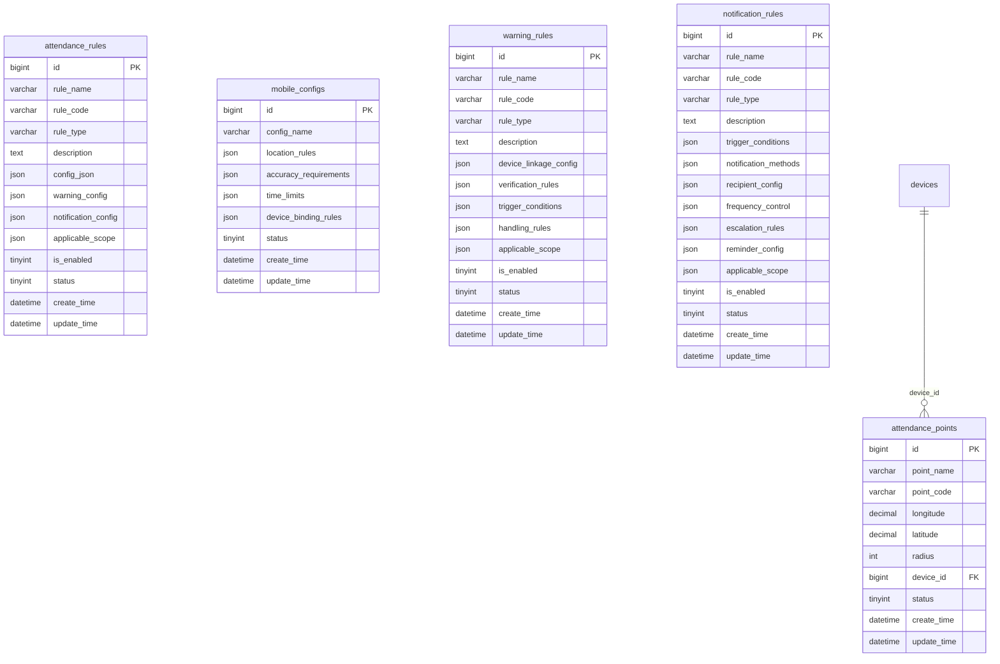

# 考勤规则配置模块设计

## 模块概述
考勤规则配置模块负责管理考勤系统的各种规则配置，包括考勤基础规则、预警规则、通知规则、移动端规则等，为考勤计算、异常检测和通知提醒提供规则支撑。

## 涉及的核心数据表

### 1. attendance_rules（考勤规则表）
```sql
CREATE TABLE attendance_rules (
    bigint id PK "主键ID，自增长"
    varchar rule_name "规则名称，如：标准考勤规则"
    varchar rule_code "规则编码，唯一标识，如：RULE001"
    varchar rule_type "规则类型：考勤规则/预警规则/通知规则"
    text description "规则描述，详细说明规则用途"
    json config_json "规则配置JSON，包含具体规则参数"
    json warning_config "预警配置JSON，包含预警阈值和级别"
    json notification_config "通知配置JSON，包含通知方式和频率"
    json applicable_scope "适用范围JSON，指定适用部门/岗位/员工"
    tinyint is_enabled "是否启用：0-禁用，1-启用"
    tinyint status "状态：0-删除，1-正常"
    datetime create_time "创建时间，记录规则创建时间"
    datetime update_time "更新时间，记录最后修改时间"
);
```

### 2. attendance_points（考勤点表）
```sql
CREATE TABLE attendance_points (
    bigint id PK "主键ID，自增长"
    varchar point_name "考勤点名称，如：一楼大厅考勤点"
    varchar point_code "考勤点编码，唯一标识，如：POINT001"
    decimal longitude "经度坐标，用于GPS定位"
    decimal latitude "纬度坐标，用于GPS定位"
    int radius "有效半径(米)，打卡有效范围"
    bigint device_id FK "关联设备ID，关联devices表"
    tinyint status "状态：0-禁用，1-启用"
    datetime create_time "创建时间，记录考勤点创建时间"
    datetime update_time "更新时间，记录最后修改时间"
);
```

### 3. mobile_configs（移动端配置表）
```sql
CREATE TABLE mobile_configs (
    bigint id PK "主键ID，自增长"
    varchar config_name "配置名称，如：移动端考勤配置"
    json location_rules "位置规则JSON，包含GPS精度要求"
    json accuracy_requirements "精度要求JSON，包含定位精度阈值"
    json time_limits "时间限制JSON，包含打卡时间窗口"
    json device_binding_rules "设备绑定规则JSON，包含设备绑定策略"
    tinyint status "状态：0-禁用，1-启用"
    datetime create_time "创建时间，记录配置创建时间"
    datetime update_time "更新时间，记录最后修改时间"
);
```

### 4. warning_rules（预警规则表）
```sql
CREATE TABLE warning_rules (
    bigint id PK "主键ID，自增长"
    varchar rule_name "规则名称，如：设备联动预警规则"
    varchar rule_code "规则编码，唯一标识，如：WARN001"
    varchar rule_type "规则类型：设备联动/双重验证/异常检测"
    text description "规则描述，详细说明预警规则用途"
    json device_linkage_config "设备联动配置JSON，包含联动设备信息"
    json verification_rules "验证规则JSON，包含验证方法和阈值"
    json trigger_conditions "触发条件JSON，包含触发条件和阈值"
    json handling_rules "处理规则JSON，包含处理流程和动作"
    json applicable_scope "适用范围JSON，指定适用部门/岗位/员工"
    tinyint is_enabled "是否启用：0-禁用，1-启用"
    tinyint status "状态：0-删除，1-正常"
    datetime create_time "创建时间，记录规则创建时间"
    datetime update_time "更新时间，记录最后修改时间"
);
```

### 5. notification_rules（通知规则表）
```sql
CREATE TABLE notification_rules (
    bigint id PK "主键ID，自增长"
    varchar rule_name "规则名称，如：打卡提醒通知规则"
    varchar rule_code "规则编码，唯一标识，如：NOTIFY001"
    varchar rule_type "规则类型：打卡提醒/未打卡通知/考勤异常通知/通用通知"
    text description "规则描述，详细说明通知规则用途"
    json trigger_conditions "触发条件配置JSON，包含触发条件和时间窗口"
    json notification_methods "通知方式配置JSON，包含短信/邮件/微信等"
    json recipient_config "接收人配置JSON，包含接收人类型和范围"
    json frequency_control "频率控制配置JSON，包含通知频率和间隔"
    json escalation_rules "升级规则配置JSON，包含升级条件和动作"
    json reminder_config "提醒配置JSON，包含提醒时间和内容"
    json applicable_scope "适用范围JSON，指定适用部门/岗位/员工"
    tinyint is_enabled "是否启用：0-禁用，1-启用"
    tinyint status "状态：0-删除，1-正常"
    datetime create_time "创建时间，记录规则创建时间"
    datetime update_time "更新时间，记录最后修改时间"
);
```

## 表之间的关联关系

### ER图关系


### 关联说明
1. **考勤点-设备关联**：考勤点关联具体的考勤设备
2. **规则独立配置**：各类规则表独立配置，通过适用范围控制影响范围
3. **JSON配置灵活**：大量使用JSON字段存储复杂配置信息

## 关键业务逻辑说明

### 1. 考勤基础规则逻辑
- **迟到早退规则**：定义迟到早退的判断标准和容忍时间
- **旷工规则**：定义旷工的判断条件和处理方式
- **加班规则**：定义加班的认定标准和计算方式
- **出勤统计规则**：定义出勤率、工时计算等统计规则

### 2. 预警规则逻辑
- **异常检测**：检测考勤异常模式（如频繁迟到、连续缺勤）
- **阈值设置**：设置各类预警的触发阈值
- **预警级别**：定义预警的严重程度和优先级
- **设备联动**：支持多设备联动验证（如摄像头+门禁）

### 3. 通知规则逻辑
- **提醒通知**：定时发送打卡提醒、未打卡通知
- **异常通知**：考勤异常时的实时通知
- **频率控制**：控制通知频率，避免过度打扰
- **升级机制**：通知未响应时的升级处理

### 4. 移动端规则逻辑
- **位置验证**：GPS定位精度和范围要求
- **时间限制**：移动端打卡的时间窗口限制
- **设备绑定**：移动设备绑定和验证规则
- **安全控制**：防作弊、防代打卡的安全规则

### 5. 考勤点管理逻辑
- **地理围栏**：基于GPS的虚拟考勤点
- **有效范围**：考勤点的有效打卡半径
- **设备关联**：考勤点与物理设备的关联
- **多点考勤**：支持多点考勤和路径验证

## JSON配置结构说明

### 1. config_json（考勤规则配置）JSON结构
```json
{
  "rule_name": "标准考勤规则",
  "attendance_settings": {
    "late_tolerance_minutes": 10,           // 迟到容忍时间
    "early_tolerance_minutes": 10,          // 早退容忍时间
    "absent_threshold_hours": 4,            // 旷工阈值小时数
    "min_work_hours": 8.0,                  // 最小工作时长
    "break_inclusion": false,               // 是否包含休息时间
    "overtime_calculation_method": "daily", // 加班计算方式
    "weekend_overtime_multiplier": 2.0,     // 周末加班倍数
    "holiday_overtime_multiplier": 3.0      // 节假日加班倍数
  },
  "work_time_rules": {
    "flexible_start_time": "08:00",         // 弹性开始时间
    "flexible_end_time": "20:00",           // 弹性结束时间
    "core_start_time": "10:00",             // 核心开始时间
    "core_end_time": "16:00",               // 核心结束时间
    "break_settings": {
      "auto_deduct": true,                  // 自动扣除休息
      "break_duration": 60,                 // 休息时长（分钟）
      "break_start_time": "12:00",          // 休息开始时间
      "break_end_time": "13:00"             // 休息结束时间
    }
  },
  "special_rules": {
    "holiday_handling": "double_pay",       // 节假日处理方式
    "weekend_handling": "normal_overtime",  // 周末处理方式
    "night_shift_settings": {
      "night_start": "22:00",               // 夜班开始时间
      "night_end": "06:00",                 // 夜班结束时间
      "night_shift_bonus": 0.2              // 夜班补贴比例
    }
  }
}
```

### 2. warning_config（预警配置）JSON结构
```json
{
  "warning_types": [
    {
      "type": "no_clock_in",               // 预警类型：未打卡
      "threshold": 3,                      // 阈值：连续3次未打卡
      "level": "high",                     // 预警级别：high/medium/low
      "description": "连续3次未打卡预警",
      "auto_actions": ["notify_manager", "notify_hr"]
    },
    {
      "type": "attendance_abnormal",       // 预警类型：考勤异常
      "threshold": 5,                      // 阈值：连续5天考勤异常
      "level": "high",
      "description": "连续5天考勤异常预警",
      "auto_actions": ["notify_manager", "notify_hr", "escalate"]
    },
    {
      "type": "late_frequent",             // 预警类型：频繁迟到
      "threshold": 3,                      // 阈值：7天内迟到3次
      "time_range_days": 7,
      "level": "medium",
      "description": "频繁迟到预警",
      "auto_actions": ["notify_employee", "notify_manager"]
    }
  ],
  "escalation_rules": [
    {
      "condition": "consecutive_days >= 3",
      "action": "notify_manager",
      "description": "连续3天异常通知直属领导"
    },
    {
      "condition": "consecutive_days >= 7",
      "action": "notify_hr",
      "description": "连续7天异常通知HR"
    }
  ]
}
```

### 3. trigger_conditions（触发条件）JSON结构
```json
{
  "clock_reminder_rules": [
    {
      "reminder_type": "clock_in",
      "time_offset_minutes": -30,
      "description": "上班前30分钟提醒"
    },
    {
      "reminder_type": "clock_in",
      "time_offset_minutes": -10,
      "description": "上班前10分钟提醒"
    },
    {
      "reminder_type": "clock_out",
      "time_offset_minutes": 0,
      "description": "下班时间提醒"
    }
  ],
  "no_clock_in_rules": [
    {
      "condition": "consecutive_days >= 1",
      "description": "连续1天未打卡"
    },
    {
      "condition": "consecutive_days >= 3",
      "description": "连续3天未打卡"
    }
  ],
  "attendance_abnormal_rules": [
    {
      "condition": "late_count >= 3 AND time_range = '7_days'",
      "description": "7天内迟到3次"
    },
    {
      "condition": "absent_days >= 2 AND time_range = '7_days'",
      "description": "7天内旷工2天"
    }
  ],
  "time_windows": {
    "check_time": "09:00",
    "notification_delay_minutes": 30,
    "workday_only": true,
    "exclude_holidays": true
  }
}
```

### 4. device_linkage_config（设备联动配置）JSON结构
```json
{
  "linkage_type": "camera_access_control",
  "devices": [
    {
      "device_id": 1001,
      "device_type": "camera",
      "linkage_role": "primary_verification",
      "verification_method": "face_recognition",
      "confidence_threshold": 0.85
    },
    {
      "device_id": 1002,
      "device_type": "access_control",
      "linkage_role": "secondary_verification",
      "verification_method": "card_swipe"
    }
  ],
  "verification_sequence": "sequential",
  "timeout_seconds": 30,
  "retry_attempts": 3,
  "failure_handling": "block_clock_in"
}
```

## 数据流转过程

### 1. 规则配置流程
```
选择规则类型 -> 配置规则参数 -> 设置适用范围 -> 验证规则有效性 -> 保存规则配置 -> 生效规则
```

### 2. 规则应用流程
```
触发考勤事件 -> 加载适用规则 -> 执行规则判断 -> 生成考勤结果 -> 触发预警通知 -> 更新考勤记录
```

### 3. 预警处理流程
```
检测异常情况 -> 匹配预警规则 -> 确定预警级别 -> 执行预警动作 -> 记录预警日志 -> 跟踪处理状态
```

### 4. 通知发送流程
```
触发通知条件 -> 匹配通知规则 -> 生成通知内容 -> 选择通知渠道 -> 控制发送频率 -> 执行通知发送 -> 记录发送结果
```

## 模块间的接口依赖

### 1. 依赖其他模块
- **基础信息管理模块**：需要员工和部门信息配置适用范围
- **考勤设备区域管理模块**：需要设备和区域信息配置联动规则

### 2. 被其他模块依赖
- **考勤数据采集模块**：需要移动端配置进行打卡验证
- **考勤数据计算模块**：需要考勤规则进行计算
- **系统配置与通知模块**：需要通知规则进行消息发送

### 3. 核心接口定义

#### 考勤规则接口
```javascript
// 获取规则列表
GET /api/attendance-rules?type={type}&enabled={enabled}
// 创建规则
POST /api/attendance-rules
// 更新规则
PUT /api/attendance-rules/{id}
// 删除规则
DELETE /api/attendance-rules/{id}
// 启用/禁用规则
POST /api/attendance-rules/{id}/toggle
// 规则预览
POST /api/attendance-rules/preview
```

#### 考勤点管理接口
```javascript
// 获取考勤点列表
GET /api/attendance-points
// 创建考勤点
POST /api/attendance-points
// 更新考勤点
PUT /api/attendance-points/{id}
// 删除考勤点
DELETE /api/attendance-points/{id}
// 验证考勤点位置
POST /api/attendance-points/{id}/verify-location
```

#### 预警规则接口
```javascript
// 获取预警规则列表
GET /api/warning-rules?type={type}&enabled={enabled}
// 创建预警规则
POST /api/warning-rules
// 更新预警规则
PUT /api/warning-rules/{id}
// 测试预警规则
POST /api/warning-rules/{id}/test
```

#### 通知规则接口
```javascript
// 获取通知规则列表
GET /api/notification-rules?type={type}&enabled={enabled}
// 创建通知规则
POST /api/notification-rules
// 更新通知规则
PUT /api/notification-rules/{id}
// 发送测试通知
POST /api/notification-rules/{id}/test
```

#### 移动端配置接口
```javascript
// 获取移动端配置
GET /api/mobile-configs
// 创建移动端配置
POST /api/mobile-configs
// 更新移动端配置
PUT /api/mobile-configs/{id}
// 获取当前生效配置
GET /api/mobile-configs/current
```

## 前端页面设计建议

### 1. 规则配置页面
- **规则类型选择**：左侧导航选择不同规则类型
- **规则编辑器**：可视化规则配置界面
- **配置预览**：实时预览规则配置效果

### 2. 考勤点管理页面
- **地图视图**：在地图上显示考勤点位置
- **考勤点列表**：表格展示考勤点信息
- **位置配置**：可视化配置考勤点范围

### 3. 预警规则页面
- **预警类型配置**：按预警类型分组配置
- **阈值设置**：直观的阈值设置界面
- **联动配置**：设备联动关系配置

### 4. 通知规则页面
- **通知模板管理**：管理各类通知模板
- **触发条件配置**：配置通知触发条件
- **发送渠道配置**：配置多渠道发送规则

## 开发优先级建议

### 1. 高优先级（核心功能）
- 基础考勤规则配置
- 通知规则管理
- 移动端基础配置
- 预警规则基础功能

### 2. 中优先级（增强功能）
- 设备联动规则
- 复杂预警逻辑
- 高级通知配置
- 考勤点管理

### 3. 低优先级（扩展功能）
- 可视化规则配置
- 规则模板管理
- 高级统计分析
- 智能规则推荐

## 技术实现要点

### 1. 规则引擎
- 规则定义和解析
- 规则执行和优化
- 规则冲突检测
- 规则版本管理

### 2. 配置管理
- 配置项动态加载
- 配置变更热更新
- 配置验证和校验
- 配置历史管理

### 3. 预警系统
- 实时监控和检测
- 预警算法优化
- 预警去重和合并
- 预警处理跟踪

### 4. 通知系统
- 多渠道通知支持
- 通知模板引擎
- 发送频率控制
- 通知效果统计