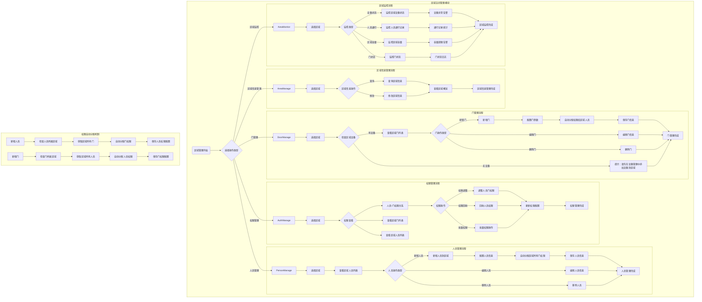
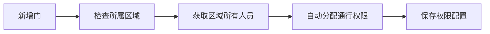
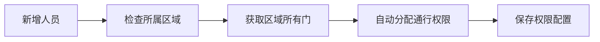

# ZKBioSecurity-ACC门禁系统 - 区域空间管理模块流程图

## 区域空间管理模块概述

基于公共区域模块统一维护，门禁系统的区域管理模块主要负责：
- 区域信息查询和修改
- 区域内门禁管理
- 区域内人员权限管理
- 区域权限自动分配
- 区域通行监控

## 区域空间管理模块流程图

## 核心功能说明

### 区域信息管理
1. **区域查询**：查询区域基本信息、区域概览统计
2. **区域修改**：修改区域名称、描述等基本信息（区域由公共模块统一维护）
3. **区域概览**：查看区域内的门数量、人员数量、设备数量等统计信息
4. **权限概览**：查看区域整体权限配置情况

### 门管理流程
1. **设备前置检查**：新增门前检查区域是否有关联的设备
2. **门列表管理**：查看、编辑、删除区域内的门
3. **自动权限分配**：新增门后，区域内所有人员自动获得该门的通行权限
4. **门信息配置**：设置门的验证方式、开放时间等参数
5. **权限继承**：门权限自动继承区域人员权限

### 人员管理流程
1. **人员列表管理**：查看、编辑、移除区域内的人员
2. **区域人员分配**：将人员分配到指定区域
3. **自动门权限**：新增人员后自动获得区域内所有门的通行权限
4. **权限继承**：人员权限自动继承区域门权限
5. **权限范围**：人员只能访问所属区域的门

### 权限管理流程
1. **权限矩阵查看**：以矩阵形式查看人员-门的权限关系
2. **权限调整**：在自动分配基础上进行个性化权限调整
3. **权限回收**：回收人员的门禁通行权限
4. **批量权限操作**：支持批量调整人员权限
5. **权限验证**：确保权限配置的合法性和一致性

### 区域监控
1. **设备状态监控**：实时监控区域内设备在线状态
2. **门状态监控**：监控门的开关状态、异常告警
3. **人员通行监控**：统计区域内人员通行记录
4. **容量监控**：监控区域人员容量，超限告警
5. **异常告警**：设备离线、异常通行等告警

## 权限自动分配机制

### 新增门权限自动分配

### 新增人员权限自动分配

## 重要特性

### 权限继承机制
- **人员继承门的权限**：新增人员自动获得区域内所有门的权限
- **门继承人员的权限**：新增门自动对区域内所有人员开放
- **区域权限边界**：人员只能访问所属区域的门禁

### 设备依赖机制
- 门管理依赖于设备管理中已关联到区域的设备
- 无设备的区域无法创建门，需要先在设备管理中添加设备

### 数据一致性
- 权限自动分配确保数据一致性
- 区域变更时同步更新相关权限
- 权限变更实时生效

## 与设备管理的关系

### 设备管理职责
- 设备添加时选择关联的区域ID
- 设备区域关联和变更管理
- 设备配置和维护功能

### 区域管理职责
- 基于已关联设备进行门管理
- 区域内人员权限管理
- 权限自动分配和调整
- 区域通行监控

### 协作流程
1. **设备管理**：添加设备并关联区域
2. **区域管理**：基于关联设备创建门
3. **权限自动分配**：门和人员权限自动同步
4. **监控**：区域和设备状态统一监控