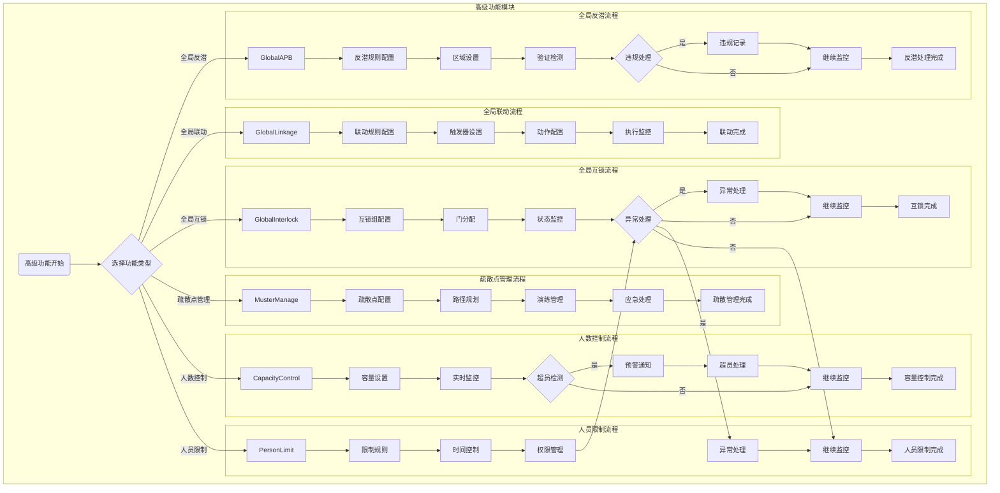

# ZKBioSecurity-ACC门禁系统 - 高级功能模块流程图

## 高级功能模块流程图

## 流程说明

### 全局反潜流程
1. **反潜规则配置**：配置反潜验证规则和参数
2. **区域设置**：设置需要反潜控制的区域
3. **验证检测**：实时检测人员的验证行为
4. **违规处理**：检测到违规时记录并处理
5. **继续监控**：持续进行反潜监控

### 全局联动流程
1. **联动规则配置**：配置设备间的联动规则
2. **触发器设置**：设置联动事件的触发条件
3. **动作配置**：配置联动触发后的执行动作
4. **执行监控**：监控联动动作的执行情况

### 全局互锁流程
1. **互锁组配置**：配置需要互锁的门组
2. **门分配**：将门分配到相应的互锁组
3. **状态监控**：实时监控门的互锁状态
4. **异常处理**：处理互锁异常情况

### 疏散点管理流程
1. **疏散点配置**：配置疏散点位置和容量
2. **路径规划**：规划紧急疏散路径
3. **演练管理**：组织和管理疏散演练
4. **应急处理**：紧急情况下的疏散处理

### 人数控制流程
1. **容量设置**：设置区域的最大容量
2. **实时监控**：实时统计区域内人数
3. **超员检测**：检测是否超过容量限制
4. **预警通知**：超员时发送预警通知
5. **超员处理**：采取超员控制措施

### 人员限制流程
1. **限制规则**：配置人员访问限制规则
2. **时间控制**：设置时间段的访问限制
3. **权限管理**：根据限制规则管理权限
4. **异常处理**：处理违规访问情况

## 高级功能详细说明

### 全局反潜类型
1. **区域反潜**：防止同一人员在短时间内重复验证
2. **逻辑反潜**：根据逻辑关系判断验证合理性
3. **定时反潜**：在特定时间段内启用反潜
4. **精准反潜**：基于人员轨迹的精确反潜

### 联动触发条件
1. **门禁事件**：刷卡、人脸等验证事件
2. **报警事件**：设备故障、非法闯入等
3. **时间事件**：定时触发或时间段触发
4. **系统事件**：系统启动、停止等

### 互锁类型
1. **两门互锁**：两门不能同时开启
2. **多门互锁**：多个门中只能开启一扇
3. **区域互锁**：区域内门的互锁控制
4. **时间互锁**：特定时间段的互锁

### 疏散点类型
1. **主要疏散点**：主要的紧急疏散集合点
2. **次要疏散点**：备用的疏散集合点
3. **备用疏散点**：应急情况下的备用点

## 关键控制点
- 反潜规则需要合理设置，避免误报
- 联动规则需要充分测试，确保执行可靠
- 互锁配置不能影响正常通行和紧急疏散
- 疏散路径需要定期检查，确保畅通无阻
- 容量控制需要区分不同类型人员
- 人员限制需要考虑紧急情况的例外处理

## 性能要求
- 反潜检测延迟：≤ 1秒
- 联动执行响应：≤ 2秒
- 互锁状态更新：≤ 500毫秒
- 人数统计延迟：≤ 3秒
- 疏散引导响应：≤ 5秒
- 限制权限生效：≤ 1秒

## 注意事项
- 高级功能配置需要专业人员进行
- 功能启用前需要进行充分测试
- 需要建立完善的异常处理机制
- 定期检查和更新配置参数
- 做好功能使用记录和维护日志
- 确保高级功能不影响系统基本性能