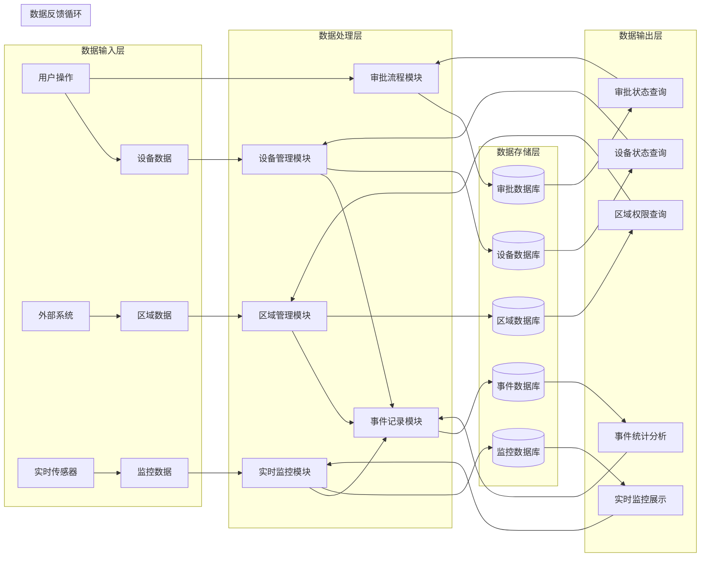

# ZKBioSecurity-ACC门禁系统 - 数据流转图

## 数据流转图

## 数据流转详细说明

### 数据输入层
**用户操作数据**
- 登录认证信息
- 设备管理操作
- 权限申请数据
- 配置修改请求
- 查询操作指令

**设备数据**
- 设备状态信息
- 门禁验证记录
- 设备性能指标
- 通信状态数据
- 故障告警信息

**区域数据**
- 区域基本信息
- 权限分配数据
- 占用统计信息
- 区域层级关系
- 安全级别设置

**监控数据**
- 实时状态监控
- 视频联动数据
- 人员轨迹信息
- 报警事件数据
- 环境传感器数据

### 数据处理层
**设备管理模块处理**
- 设备配置数据处理
- 设备状态分析
- 通信协议转换
- 远程控制指令
- 设备性能统计

**区域管理模块处理**
- 区域权限计算
- 占用人数统计
- 权限冲突检测
- 区域关联分析
- 容量预警判断

**实时监控模块处理**
- 实时数据聚合
- 异常模式识别
- 报警级别判断
- 视频关联处理
- 位置轨迹计算

**事件记录模块处理**
- 事件分类处理
- 多媒体数据关联
- 异常事件分析
- 统计数据计算
- 历史数据归档

**审批流程模块处理**
- 申请路由计算
- 审批状态跟踪
- 超时判断处理
- 权限生效处理
- 审批统计分析

### 数据存储层
**设备数据库**
- 设备基本信息表
- 设备状态历史表
- 设备配置参数表
- 设备通信日志表
- 设备维护记录表

**区域数据库**
- 区域信息表
- 区域权限表
- 区域设备关联表
- 区域占用记录表
- 区域配置参数表

**监控数据库**
- 实时状态缓存表
- 报警事件表
- 视频联动记录表
- 人员轨迹表
- 监控配置表

**事件数据库**
- 事件主表
- 多媒体证据表
- 异常事件表
- 事件统计表
- 报表配置表

**审批数据库**
- 审批流程定义表
- 审批实例表
- 审批记录表
- 申请模板表
- 用户角色权限表

### 数据输出层
**设备状态查询**
- 设备列表查询
- 设备状态查询
- 设备历史记录
- 设备统计报表
- 设备性能分析

**区域权限查询**
- 区域信息查询
- 权限分配查询
- 占用状态查询
- 区域统计分析
- 权限审计报告

**实时监控展示**
- 实时状态展示
- 报警信息展示
- 视频监控画面
- 人员轨迹展示
- 监控统计分析

**事件统计分析**
- 事件记录查询
- 异常事件统计
- 趋势分析报告
- 自定义报表
- 数据导出功能

**审批状态查询**
- 申请状态查询
- 审批进度跟踪
- 审批统计分析
- 模板管理
- 权限审计

## 数据流特征

### 数据流向
1. **上行数据流**：从输入层到存储层
2. **下行数据流**：从存储层到输出层
3. **横向数据流**：模块间的数据交换
4. **反馈数据流**：输出层反馈到处理层

### 数据类型
1. **结构化数据**：数据库表中的关系数据
2. **半结构化数据**：JSON、XML格式的配置数据
3. **非结构化数据**：图片、视频、音频等多媒体数据
4. **流式数据**：实时传感器数据、事件流数据

### 数据处理模式
1. **实时处理**：实时监控、报警处理
2. **批量处理**：统计分析、报表生成
3. **流式处理**：事件流处理、数据流计算
4. **事务处理**：数据一致性、ACID特性

## 数据质量控制

### 数据完整性
- 主键约束确保数据唯一性
- 外键约束确保引用完整性
- 检查约束确保数据有效性
- 触发器确保数据一致性

### 数据准确性
- 数据验证规则
- 业务逻辑校验
- 数据清洗机制
- 异常数据检测

### 数据及时性
- 实时数据同步
- 定时批量更新
- 数据缓存机制
- 增量数据同步

### 数据安全性
- 数据加密存储
- 访问权限控制
- 操作审计日志
- 数据备份保护

## 性能优化策略

### 数据库优化
- 索引优化设计
- 查询语句优化
- 数据库连接池
- 读写分离架构

### 缓存策略
- Redis缓存热点数据
- 应用级缓存
- 数据库查询缓存
- CDN缓存静态资源

### 数据分区
- 按时间分区历史数据
- 按区域分区数据
- 按业务类型分区
- 分区表管理策略

## 数据治理

### 数据标准
- 数据字典定义
- 命名规范统一
- 数据类型标准
- 数据格式规范

### 数据生命周期
- 数据创建规范
- 数据使用规则
- 数据归档策略
- 数据销毁流程

### 数据质量管理
- 数据质量监控
- 数据质量报告
- 问题数据修复
- 持续改进机制