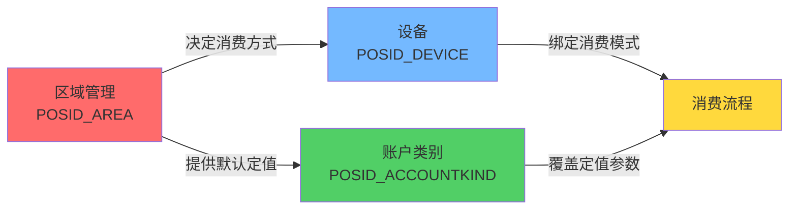
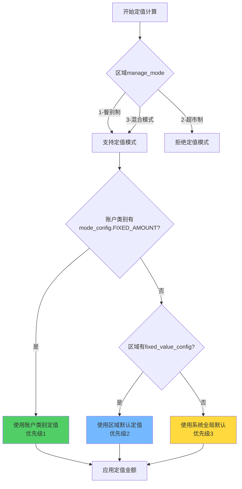
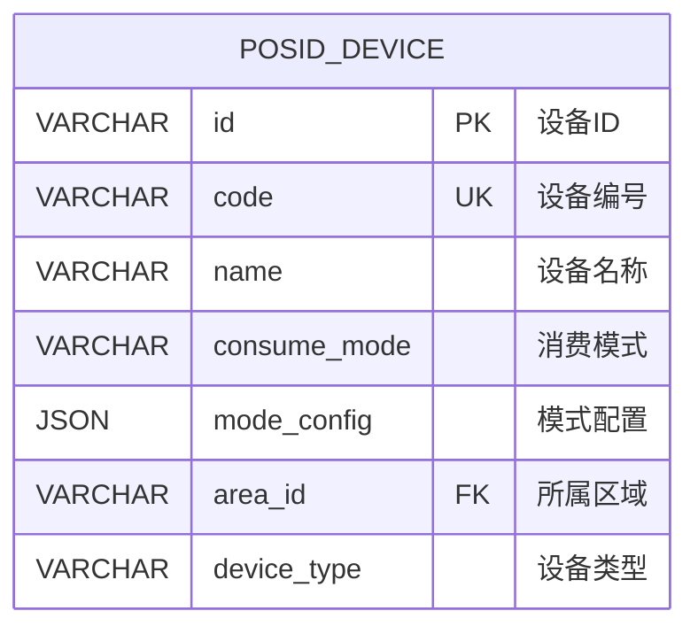
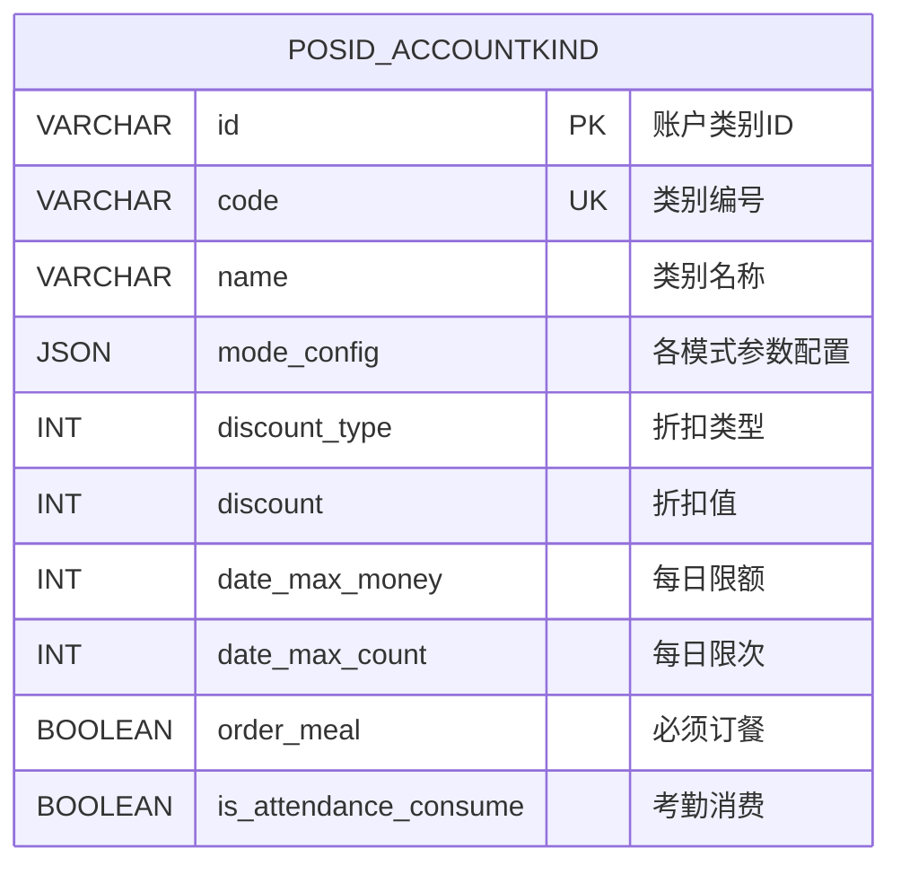
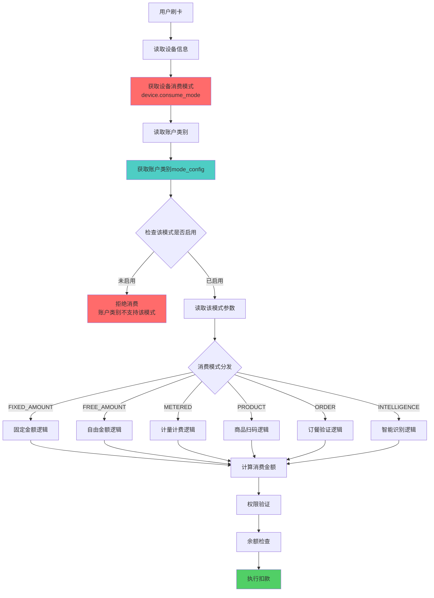
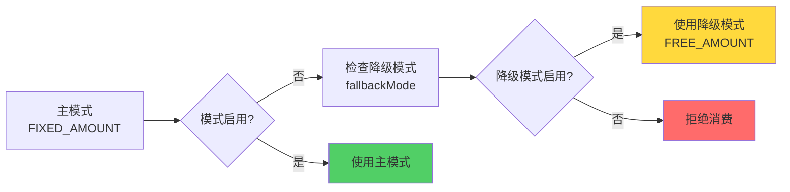
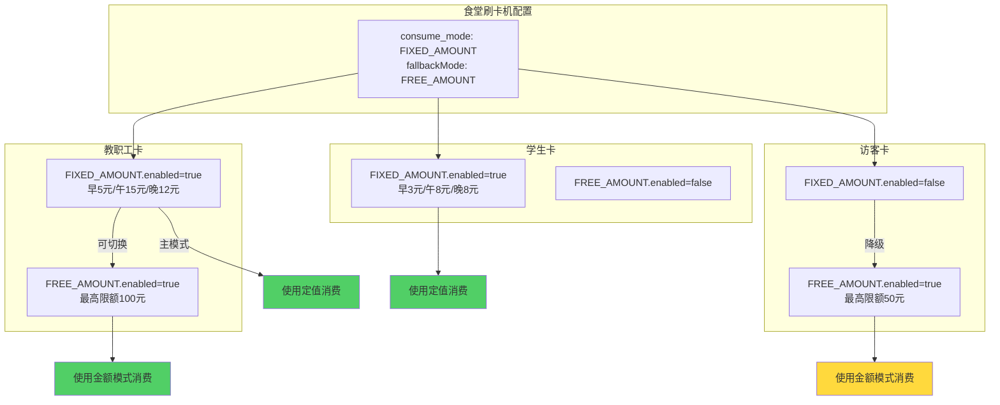
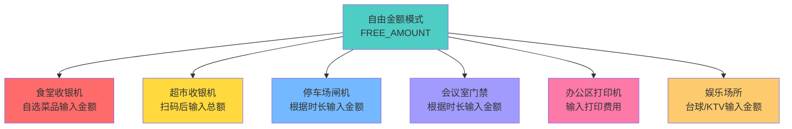
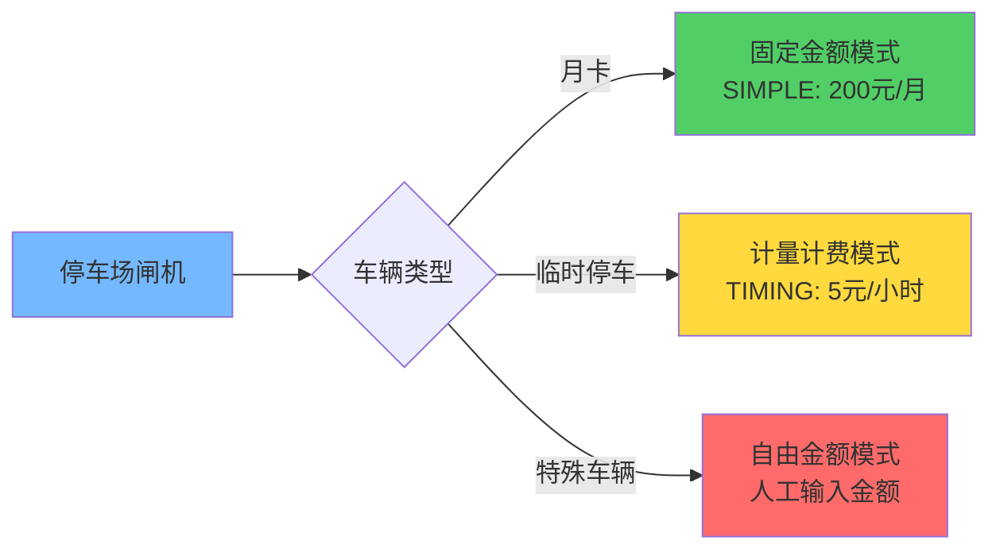

# 03-账户类别与消费模式设计

## 📋 模块概述

**设计目标**：基于设备绑定原则，构建通用化消费模式体系，降低配置复杂度。

**原有9种模式的问题**：
- 🔴 定值、键值、分段定值本质相同，配置分散
- 🔴 计次、计时都是计量计费，可统一
- 🔴 记账模式使用率低，增加复杂度
- 🔴 缺乏通用性思考，模式场景固化

**重构方案**：
- ✅ **合并为6个核心模式**，降低40%配置复杂度
- ✅ 每种模式保持**场景通用性**（金额模式可用于食堂/超市/停车场等）
- ✅ **设备绑定模式**，账户类别提供参数
- ✅ 移除记账模式，保留差异化配置能力

---

## 🔗 与区域管理模块的关联

### 配置层级关系

**三层配置架构**：



### 关键字段关联

| 模块 | 字段 | 作用 | 与消费模式的关系 |
|------|------|------|---------------|
| **区域管理** | `manage_mode` | 决定消费方式 | 餐别制(1)/超市制(2)/混合(3) |
| **区域管理** | `fixed_value_config` | 区域默认定值 | 仅餐别制和混合模式使用 |
| **设备** | `consume_mode` | 设备支持的消费模式 | FIXED_AMOUNT/FREE_AMOUNT/PRODUCT等6种 |
| **账户类别** | `mode_config` | 账户类别参数配置 | 可覆盖区域默认定值 |

### 定值配置优先级（核心规则）

**当消费模式为FIXED_AMOUNT时**：



**优先级说明**：
1. **最高**：账户类别 `mode_config.FIXED_AMOUNT.values`
2. **次高**：区域 `fixed_value_config`
3. **兜底**：系统全局默认值

**配置示例**：

**区域fixed_value_config**（区域级默认）：
```json
{
  "breakfast": {"amount": 5.00, "unit": "元"},
  "lunch": {"amount": 12.00, "unit": "元"},
  "dinner": {"amount": 10.00, "unit": "元"}
}
```

**账户类别mode_config**（账户级覆盖）：
```json
{
  "FIXED_AMOUNT": {
    "enabled": true,
    "subType": "SECTION",
    "values": [
      {"key": "breakfast", "amount": 8.00, "time": "06:00-09:00"},
      {"key": "lunch", "amount": 15.00, "time": "11:00-13:30"}
    ],
    "allowOverride": false
  }
}
```

**实际计算结果**：
- 早餐：使用账户类别定值 **8元**（覆盖区域默认5元）
- 午餐：使用账户类别定值 **15元**（覆盖区域默认12元）
- 晚餐：使用区域默认定值 **10元**（账户类别未配置）

---

## 🎯 消费模式合并策略
## 📋 IOE-DREAM七微服务架构

**核心架构组成**:
- **Gateway Service (8080)**: API网关
- **Common Service (8088)**: 公共模块微服务
- **DeviceComm Service (8087)**: 设备通讯微服务
- **OA Service (8089)**: OA微服务
- **Access Service (8090)**: 门禁服务
- **Attendance Service (8091)**: 考勤服务
- **Video Service (8092)**: 视频服务
- **Consume Service (8094)**: 消费服务
- **Visitor Service (8095)**: 访客服务

**架构特点**:
- 基于Spring Boot 3.5.8 + Java 17
- 严格遵循企业级微服务规范
- 支持高并发、高可用、水平扩展

**技术栈标准**:
- **数据库**: MySQL 8.0 + Druid连接池
- **缓存**: Redis + Caffeine多级缓存
- **注册中心**: Nacos
- **配置中心**: Nacos Config
- **认证授权**: Sa-Token

## 🏗️ 四层架构规范

**标准架构模式**:
```
Controller (接口控制层)
    ↓
Service (核心业务层)
    ↓
Manager (流程管理层)
    ↓
DAO (数据访问层)
```

**层级职责**:
- **Controller层**: HTTP请求处理、参数验证、权限控制
- **Service层**: 核心业务逻辑、事务管理、业务规则验证
- **Manager层**: 复杂流程编排、多数据组装、第三方服务集成
- **DAO层**: 数据库CRUD操作、SQL查询实现、数据访问边界

**严格禁止跨层访问**: Controller不能直接调用Manager/DAO！
### 模式合并对照表
## ⚠️ IOE-DREAM零容忍规则（强制执行）

**必须遵守的架构规则**:
- ✅ **必须使用 @Resource 注入依赖**
- ✅ **必须使用 @Mapper 注解** (禁止@Repository)
- ✅ **必须使用 Dao 后缀** (禁止Repository)
- ✅ **必须使用 @RestController 注解**
- ✅ **必须使用 @Valid 参数校验**
- ✅ **必须返回统一ResponseDTO格式**
- ✅ **必须遵循四层架构边界**

**严格禁止事项**:
- ❌ **禁止使用 @Autowired 注入**
- ❌ **禁止使用 @Repository 注解**
- ❌ **禁止使用 Repository 后缀命名**
- ❌ **禁止跨层访问**
- ❌ **禁止在Controller中包含业务逻辑**
- ❌ **禁止直接访问数据库**

**违规后果**: P0级问题，立即修复，禁止合并！

| 原模式 | 新模式 | 子类型 | 通用场景 |
|-------|-------|-------|---------|
| 定值模式 | **固定金额模式** | SIMPLE（简单定值） | 食堂、班车、门票 |
| 键值模式 | **固定金额模式** | KEYVALUE（键值定值） | 食堂、充电桩、打印 |
| 分段定值 | **固定金额模式** | SECTION（分段定值） | 食堂（早午晚）、停车（分时） |
| 金额模式 | **自由金额模式** | - | 超市、食堂、停车场、会议室、办公消费 |
| 计时模式 | **计量计费模式** | TIMING（计时） | 会议室、停车场、娱乐设施、充电桩 |
| 计次模式 | **计量计费模式** | COUNT（计次） | 健身房、游泳池、洗浴、门禁 |
| 商品模式 | **商品模式** | - | 超市、便利店、面包房、水果店 |
| 订餐模式 | **订餐模式** | - | 企业食堂、学校食堂、外卖 |
| 智能模式 | **智能模式** | - | 智能取餐、自助售货、无人超市 |
| ~~记账模式~~ | ~~移除~~ | - | - |

### 核心设计理念

```mermaid
graph TB
    subgraph 设备层：决定消费模式
        D1[食堂刷卡机]
        D2[超市收银机]
        D3[停车场闸机]
        D4[会议室门禁]
        D5[订餐取餐机]
    end
    
    subgraph 模式层：6种核心模式
        M1[固定金额模式]
        M2[自由金额模式]
        M3[计量计费模式]
        M4[商品模式]
        M5[订餐模式]
        M6[智能模式]
    end
    
    subgraph 账户层：提供模式参数
        A[账户类别mode_config]
    end
    
    D1 -->|可选择| M1
    D1 -->|可选择| M2
    D1 -->|可选择| M5
    
    D2 -->|可选择| M2
    D2 -->|可选择| M4
    
    D3 -->|可选择| M2
    D3 -->|可选择| M3
    
    D4 -->|可选择| M2
    D4 -->|可选择| M3
    
    D5 -->|可选择| M5
    D5 -->|可选择| M6
    
    M1 --> A
    M2 --> A
    M3 --> A
    M4 --> A
    M5 --> A
    M6 --> A
    
    style D1 fill:#ff6b6b
    style D2 fill:#ffd93d
    style D3 fill:#74b9ff
    style D4 fill:#a29bfe
    style D5 fill:#fd79a8
```

**关键设计点**：
1. **设备决定模式**：同一设备可配置使用哪种模式（如食堂既可用定值也可用金额）
2. **模式通用化**：金额模式可用于食堂、超市、停车场等多种场景
3. **账户类别提供参数**：每种模式的具体配置（定值金额、限额、单价等）

---

## 🗄️ 数据模型设计

### 1. 设备表（绑定消费模式）



**consume_mode 枚举值**：
- `FIXED_AMOUNT`：固定金额模式
- `FREE_AMOUNT`：自由金额模式
- `METERED`：计量计费模式
- `PRODUCT`：商品模式
- `ORDER`：订餐模式
- `INTELLIGENCE`：智能模式

**mode_config 示例**：
```json
{
  "subType": "SIMPLE",  // 固定金额模式的子类型
  "allowModeSwitch": true,  // 是否允许临时切换模式
  "fallbackMode": "FREE_AMOUNT"  // 降级模式
}
```

### 2. 账户类别表（提供模式参数）



---

## 🔑 六大核心模式详细设计

### 1. 固定金额模式（FIXED_AMOUNT）

**适用场景**：食堂、班车、门票、打印、充电桩、停车（固定费用）

**子类型**：
- `SIMPLE`：简单定值（一个固定金额，如：午餐15元）
- `KEYVALUE`：键值定值（多个快捷金额，如：3元/5元/10元按键）
- `SECTION`：分段定值（不同时段/餐段不同金额，如：早餐5元/午餐15元/晚餐12元）

**mode_config.FIXED_AMOUNT 配置**：
```json
{
  "enabled": true,
  "subType": "SECTION",
  "simple": {
    "amount": 1500  // 简单定值：15元
  },
  "keyvalue": {
    "keys": [
      {"key": "1", "amount": 300, "label": "3元"},
      {"key": "2", "amount": 500, "label": "5元"},
      {"key": "3", "amount": 1000, "label": "10元"}
    ]
  },
  "section": {
    "enableSection": true,
    "sections": [
      {
        "id": "breakfast",
        "name": "早餐",
        "timeRange": "06:00-09:00",
        "consumeTimes": [
          {"times": 1, "amount": 500, "enabled": true},
          {"times": 2, "amount": 300, "enabled": true}
        ]
      },
      {
        "id": "lunch",
        "name": "午餐",
        "timeRange": "11:00-14:00",
        "consumeTimes": [
          {"times": 1, "amount": 1500, "enabled": true},
          {"times": 2, "amount": 1000, "enabled": false}
        ]
      }
    ]
  },
  "allowOverride": false  // 是否允许用户输入金额覆盖
}
```

**场景示例**：
- 🍽️ **食堂**：早餐5元/午餐15元/晚餐12元（分段定值）
- 🚌 **班车**：固定2元（简单定值）
- 🔌 **充电桩**：快充5元/慢充3元（键值定值）
- 🅿️ **停车场**：白天10元/晚上5元（分段定值）

---

### 2. 自由金额模式（FREE_AMOUNT）

**适用场景**：超市、食堂、办公区、会议室、停车场、娱乐场所等**所有需要灵活金额的场景**

**核心特点**：
- ✅ **通用性最强**：任何需要输入金额的场景都可使用
- ✅ 收银员/用户输入任意金额
- ✅ 可配置最小/最大限额
- ✅ 支持折扣

**mode_config.FREE_AMOUNT 配置**：
```json
{
  "enabled": true,
  "minAmount": 1,  // 最小金额：0.01元
  "maxAmount": 100000,  // 最大金额：1000元
  "applyDiscount": true,  // 是否应用账户折扣
  "requireConfirm": true  // 是否需要二次确认
}
```

**场景示例**：
- 🏪 **超市收银**：扫码商品后输入总额
- 🍽️ **食堂**：用户自选菜品后输入金额
- 🅿️ **停车场**：根据时长计算后输入金额
- 🏢 **办公区**：打印、复印等输入金额
- 🎮 **娱乐场所**：台球、KTV等输入消费金额
- ☕ **咖啡厅**：点单后输入金额

---

### 3. 计量计费模式（METERED）

**适用场景**：会议室、停车场、健身房、游泳池、娱乐设施、充电桩

**子类型**：
- `TIMING`：计时子类型（按时长计费）
- `COUNT`：计次子类型（按次数计费）

**mode_config.METERED 配置**：
```json
{
  "enabled": true,
  "subType": "TIMING",
  "timing": {
    "pricePerHour": 5000,  // 每小时50元
    "minMinutes": 30,  // 最少30分钟
    "maxHours": 8,  // 最多8小时
    "roundingRule": "UP",  // 计费原则：UP-向上取整，DOWN-向下取整，EXACT-精确计算
    "freeMinutes": 15,  // 前15分钟免费
    "useDevicePrice": false  // 是否使用设备配置的单价
  },
  "count": {
    "pricePerTime": 2000,  // 每次20元
    "maxTimesPerDay": 3,  // 每天最多3次
    "applyDiscount": true  // 是否应用折扣
  }
}
```

**场景示例**：
- 🏢 **会议室**：按小时计费（计时）
- 🅿️ **停车场**：按小时计费（计时）
- 🏋️ **健身房**：按次数计费（计次）
- 🏊 **游泳池**：按次数计费（计次）
- 🔌 **充电桩**：按时长计费（计时）
- 🎮 **游戏机**：按次数或时长计费

---

### 4. 商品模式（PRODUCT）

**适用场景**：超市、便利店、面包房、水果店

**依赖模块**：商品管理模块（12-商品管理模块）

**mode_config.PRODUCT 配置**：
```json
{
  "enabled": true,
  "allowedCategories": null,  // 允许的商品分类（null=不限制）
  "maxItemsPerTransaction": 50,  // 单次最多购买50件
  "applyDiscount": true,  // 是否应用账户折扣
  "requireStock": true  // 是否检查库存
}
```

**业务流程**：
1. 扫描商品条码
2. 查询商品信息（价格、库存）
3. 加入购物车
4. 计算总价（应用折扣）
5. 扣除账户余额
6. 扣减库存

**场景示例**：
- 🏪 **校园超市**：文具、零食、日用品
- 🏬 **企业便利店**：员工购物
- 🍞 **面包房**：面包、糕点、饮料
- 🍎 **水果店**：称重商品、组合商品

---

### 5. 订餐模式（ORDER）

**适用场景**：企业食堂、学校食堂、外卖

**依赖模块**：订餐管理模块（07-订餐管理流程）

**mode_config.ORDER 配置**：
```json
{
  "enabled": true,
  "mustOrder": false,  // 是否必须订餐（true则未订餐无法消费）
  "allowOnSiteOrder": true,  // 是否允许现场订餐
  "applyDiscount": true  // 是否应用折扣
}
```

**业务流程**：
1. 用户在订餐窗口订餐
2. 扣除餐费，生成订餐记录
3. 取餐时刷卡验证
4. 核销订餐记录

**场景示例**：
- 🍽️ **企业食堂**：员工提前订餐
- 🎓 **学校食堂**：学生订餐
- 🚗 **外卖取餐**：订餐后凭码取餐

---

### 6. 智能模式（INTELLIGENCE）

**适用场景**：智能取餐、自助售货、无人超市

**mode_config.INTELLIGENCE 配置**：
```json
{
  "enabled": true,
  "recognitionType": "FACE",  // 识别类型：FACE-人脸，PRODUCT-商品，AUTO-自动
  "autoDeduct": true,  // 是否自动扣费
  "confirmTimeout": 5  // 确认超时（秒）
}
```

**业务流程**：
1. 人脸识别或商品识别
2. 自动读取账户信息
3. 自动计算金额
4. 自动扣费（或需确认）

**场景示例**：
- 🤖 **智能取餐**：刷脸取餐自动扣费
- 🏪 **无人超市**：商品识别自动结算
- 🥤 **自助售货机**：刷脸自动扣费

---

## 🔄 消费流程设计

### 完整消费流程



### 模式降级策略



---

## 📊 业务场景示例

### 场景1：食堂设备支持多种模式



### 场景2：金额模式的通用性



### 场景3：停车场支持多种计费模式



---

## 💾 缓存策略

### 核心缓存

| 缓存项 | Redis Key | 过期时间 | 说明 |
|-------|-----------|---------|------|
| 账户类别配置 | `accountkind:config:{id}` | 1小时 | 包含mode_config |
| 设备消费模式 | `device:mode:{id}` | 30分钟 | 设备模式配置 |
| 账户今日消费次数 | `account:times:{id}:{date}` | 到23:59 | 用于分段定值次数判断 |
| 设备模式支持列表 | `device:modes:support:{id}` | 1小时 | 该设备支持的模式列表 |

---

## 🎯 总结

### 核心设计

1. **设备绑定模式**：设备表的`consume_mode`字段决定使用哪种模式
2. **模式通用化**：每种模式适用于多种场景（金额模式可用于食堂/超市/停车场等）
3. **账户类别提供参数**：`mode_config` JSON统一管理6种模式的参数
4. **模式降级支持**：主模式不可用时自动切换到降级模式

### 关键优势

✅ **通用性强**：金额模式、计量模式等可跨场景使用  
✅ **灵活性高**：固定金额模式支持简单/键值/分段三种子类型  
✅ **配置简化**：9种模式合并为6种，减少40%配置项  
✅ **易扩展**：新增场景无需新增模式，复用现有模式即可

### 支持场景

- 🍽️ **食堂**：固定金额（分段定值）、自由金额、订餐
- 🏪 **超市**：自由金额、商品模式
- 🅿️ **停车场**：固定金额（月卡）、计量计费（临时）、自由金额（特殊）
- 🏢 **会议室**：计量计费（计时）、自由金额
- 🏋️ **健身房**：计量计费（计次）、固定金额（会员卡）
- 🔌 **充电桩**：固定金额（快充/慢充）、计量计费（计时）
- 🤖 **智能设备**：智能模式（刷脸取餐、无人超市）

---

**文档版本**：v4.0  
**创建时间**：2025-10-31  
**更新时间**：2025-10-31  
**适用版本**：POSID v3.13.1+  
**更新说明**：
- v4.0: 新增与区域管理模块的关联章节，明确manage_mode、fixed_value_config与mode_config的配置层级关系和优先级
- v3.0: 合并消费模式为6种通用模式，统一配置结构
