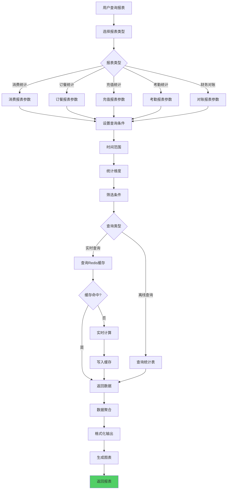
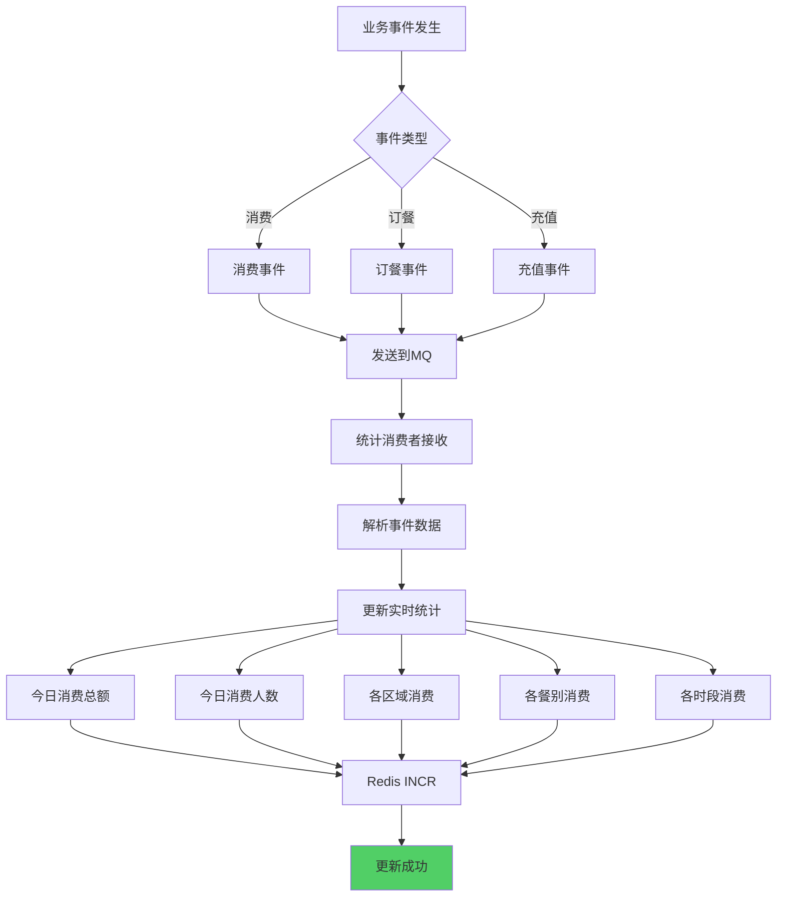
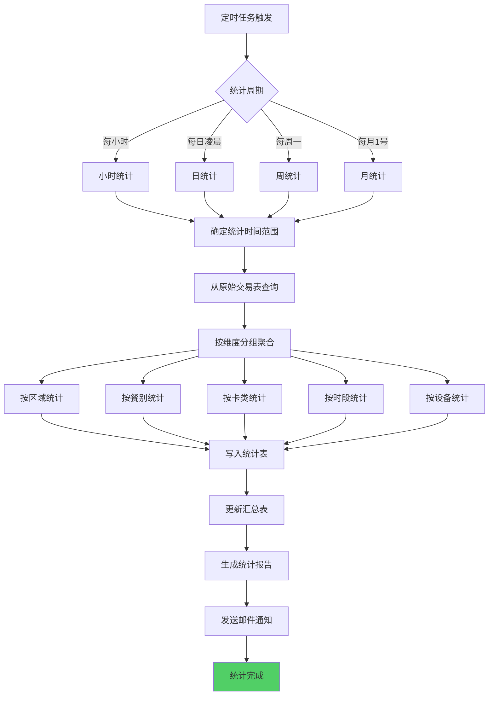
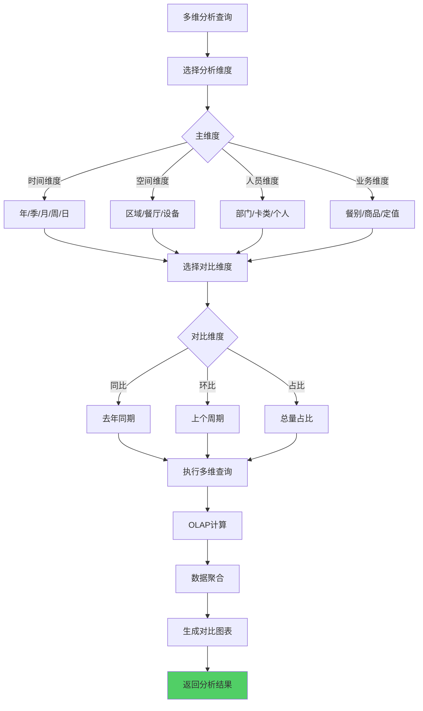
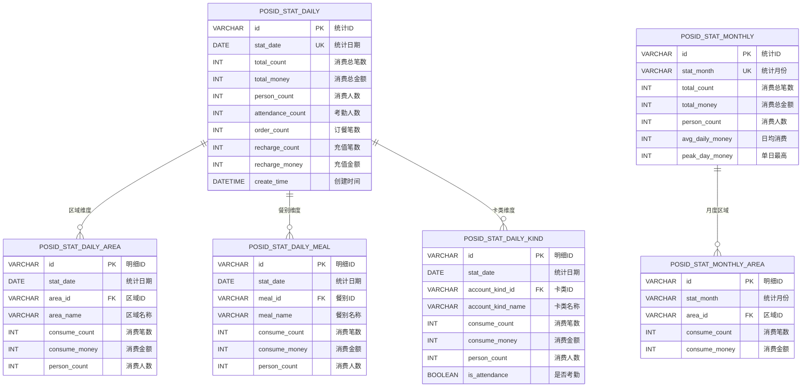
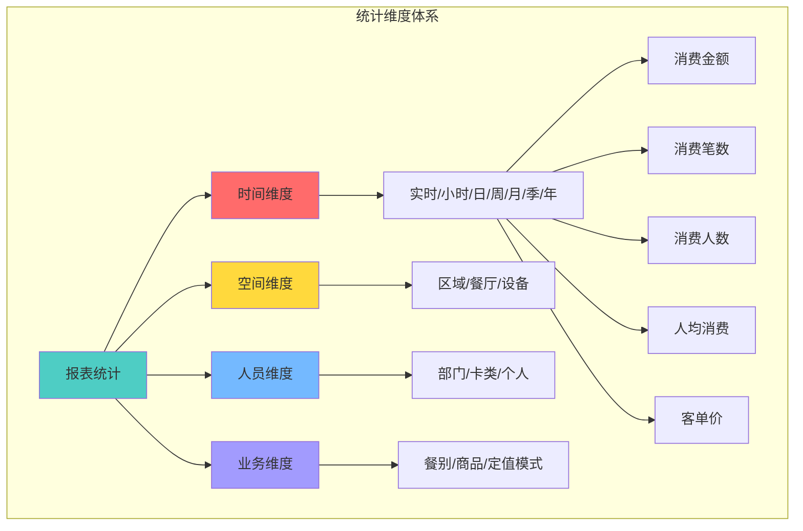
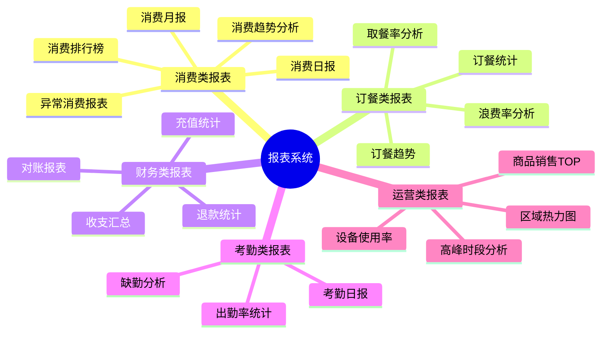
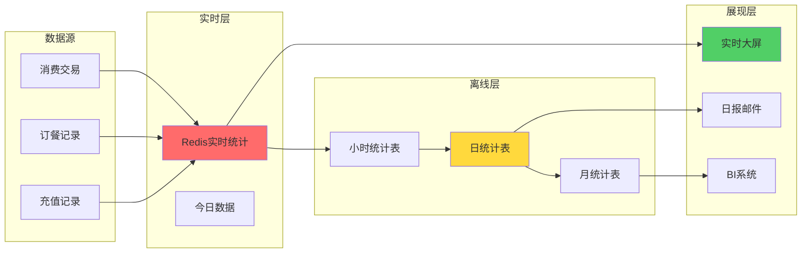

# 13-报表统计模块重构设计

## 📋 模块概述

**重构目标**：构建完整的数据统计分析体系，为业务决策提供数据支撑。

**核心问题**：
- 报表统计逻辑分散
- 统计维度单一
- 实时统计性能差
- 缺乏数据可视化
- **缺少经营模式和区域类型统计维度**

**重构收益**：
- ✅ 统一的报表服务
- ✅ 多维度数据分析
- ✅ 实时+离线双重统计
- ✅ 丰富的图表展示
- ✅ **新增经营模式和定值来源统计维度**

---

## 🏗️ 新增统计维度

### 核心统计维度补充

**新增4个统计维度**：

| 统计维度 | 字段来源 | 统计价值 | 报表示例 |
|---------|---------|---------|---------|
| **经营模式** | `manage_mode` | 对比不同模式的经营效益 | 餐别制vs超市制营收对比 |
| **区域类型** | `area_sub_type` | 分析不同场所的消费特征 | 食堂/餐厅/超市消费分析 |
| **定值来源** | 消费流水中的定值来源标记 | 评估配置优先级合理性 | 账户定值/区域定值/系统默认占比 |
| **是否考勤消费** | `is_attendance_consume` | 区分就餐消费与其他消费 | 考勤消费vs非考勤消费统计 |

### 统计报表矩阵

| 报表类型 | 原有维度 | 新增维度 | 业务价值 |
|---------|---------|---------|---------|
| **消费流水报表** | 时间、区域、人员 | + 经营模式、区域类型 | 多维度消费分析 |
| **金额统计报表** | 现金、补贴 | + 定值来源 | 优化定值配置策略 |
| **区域经营报表** | 区域、餐别 | + 经营模式、区域类型 | 经营模式效益对比 |
| **考勤消费报表** | NEW | 是否考勤消费 | 就餐率统计分析 |

### 业务分析场景

**场景1：经营模式对比分析**
```
SELECT 
  manage_mode,
  COUNT(*) as 消费笔数,
  SUM(amount) as 总消费金额,
  AVG(amount) as 平均消费金额
FROM POSID_TRANSACTION
WHERE consume_time BETWEEN '2025-10-01' AND '2025-10-31'
GROUP BY manage_mode
```

**场景2：定值来源分析**
```
SELECT 
  amount_source,  -- 账户定值/区域定值/系统默认
  COUNT(*) as 使用次数,
  ROUND(COUNT(*) * 100.0 / SUM(COUNT(*)) OVER(), 2) as 占比
FROM POSID_TRANSACTION
WHERE manage_mode = 1  -- 仅餐别制
GROUP BY amount_source
```

**场景3：区域类型经营效益**
```
SELECT 
  area_sub_type,
  manage_mode,
  SUM(amount) as 营收,
  COUNT(DISTINCT person_id) as 消费人数
FROM POSID_TRANSACTION
GROUP BY area_sub_type, manage_mode
ORDER BY 营收 DESC
```

---

## 🔄 业务流程设计
## 📋 IOE-DREAM七微服务架构

**核心架构组成**:
- **Gateway Service (8080)**: API网关
- **Common Service (8088)**: 公共模块微服务
- **DeviceComm Service (8087)**: 设备通讯微服务
- **OA Service (8089)**: OA微服务
- **Access Service (8090)**: 门禁服务
- **Attendance Service (8091)**: 考勤服务
- **Video Service (8092)**: 视频服务
- **Consume Service (8094)**: 消费服务
- **Visitor Service (8095)**: 访客服务

**架构特点**:
- 基于Spring Boot 3.5.8 + Java 17
- 严格遵循企业级微服务规范
- 支持高并发、高可用、水平扩展

**技术栈标准**:
- **数据库**: MySQL 8.0 + Druid连接池
- **缓存**: Redis + Caffeine多级缓存
- **注册中心**: Nacos
- **配置中心**: Nacos Config
- **认证授权**: Sa-Token

## 🏗️ 四层架构规范

**标准架构模式**:
```
Controller (接口控制层)
    ↓
Service (核心业务层)
    ↓
Manager (流程管理层)
    ↓
DAO (数据访问层)
```

**层级职责**:
- **Controller层**: HTTP请求处理、参数验证、权限控制
- **Service层**: 核心业务逻辑、事务管理、业务规则验证
- **Manager层**: 复杂流程编排、多数据组装、第三方服务集成
- **DAO层**: 数据库CRUD操作、SQL查询实现、数据访问边界

**严格禁止跨层访问**: Controller不能直接调用Manager/DAO！
### 1.1 报表查询流程
## ⚠️ IOE-DREAM零容忍规则（强制执行）

**必须遵守的架构规则**:
- ✅ **必须使用 @Resource 注入依赖**
- ✅ **必须使用 @Mapper 注解** (禁止@Repository)
- ✅ **必须使用 Dao 后缀** (禁止Repository)
- ✅ **必须使用 @RestController 注解**
- ✅ **必须使用 @Valid 参数校验**
- ✅ **必须返回统一ResponseDTO格式**
- ✅ **必须遵循四层架构边界**

**严格禁止事项**:
- ❌ **禁止使用 @Autowired 注入**
- ❌ **禁止使用 @Repository 注解**
- ❌ **禁止使用 Repository 后缀命名**
- ❌ **禁止跨层访问**
- ❌ **禁止在Controller中包含业务逻辑**
- ❌ **禁止直接访问数据库**

**违规后果**: P0级问题，立即修复，禁止合并！



### 1.2 实时统计流程



### 1.3 离线统计流程



### 1.4 多维分析流程



---

## 🗄️ 数据库设计

### 2.1 ER关系图



### 2.2 统计维度体系



### 2.3 核心报表清单



### 2.4 报表数据流



---

## 💾 缓存策略设计

### 3.1 实时统计缓存

| 缓存项 | Redis Key | 数据结构 | 过期时间 | 说明 |
|-------|-----------|---------|---------|------|
| 今日消费总额 | `stat:today:money` | String | 到23:59 | INCR累加 |
| 今日消费人数 | `stat:today:persons` | Set | 到23:59 | SADD去重 |
| 各区域消费 | `stat:today:area` | Hash | 到23:59 | HINCRBY |
| 各餐别消费 | `stat:today:meal` | Hash | 到23:59 | HINCRBY |
| 实时排行榜 | `stat:today:rank:area` | ZSet | 到23:59 | ZINCRBY |

### 3.2 报表缓存

| 缓存项 | Redis Key | 过期时间 | 说明 |
|-------|-----------|---------|------|
| 昨日报表 | `report:daily:{date}` | 7天 | 历史报表 |
| 月度报表 | `report:monthly:{month}` | 90天 | 月度汇总 |
| 热门查询 | `report:hot:{hash}` | 1小时 | 常用查询 |

---

## 📊 核心报表设计

### 4.1 消费日报

**统计内容：**
- 消费总笔数、总金额、人数、人均
- 各区域消费排行TOP10
- 各餐别消费分布
- 各时段消费高峰
- 考勤人数统计
- 同比、环比数据

**图表类型：**
- 折线图：消费趋势
- 柱状图：各区域对比
- 饼图：餐别占比
- 热力图：时段分布

### 4.2 考勤统计报表

**统计内容：**
- 考勤总人数（is_attendance_consume=TRUE）
- 各部门出勤率
- 缺勤人员名单
- 考勤异常分析

### 4.3 财务对账报表

**统计内容：**
- 充值总额、笔数、渠道分布
- 消费总额、笔数
- 退款总额、笔数
- 账户余额总额
- 补贴发放、使用、清零
- 收支平衡校验

---

## 🎯 总结

### 关键设计

✅ **实时统计**：Redis实时聚合，秒级刷新  
✅ **离线统计**：定时任务批量计算，T+1可查  
✅ **多维分析**：时间/空间/人员/业务4大维度  
✅ **图表丰富**：折线/柱状/饼图/热力图多种展示  
✅ **自动推送**：日报邮件、异常告警自动发送

### 支持场景

- 📊 **管理决策**：经营数据分析、趋势预测
- 💰 **财务核算**：收支统计、对账报表
- 👥 **人事考勤**：出勤率统计、缺勤分析
- 🏪 **运营优化**：高峰分析、资源调配

---

## 📝 更新说明

### v2.0 (2025-10-31)
- ✅ 新增4个统计维度（经营模式、区域类型、定值来源、是否考勤消费）
- ✅ 补充统计报表矩阵
- ✅ 新增3个业务分析场景示例

---

**文档版本**：v2.0  
**创建时间**：2025-10-31  
**适用版本**：POSID v3.13.1+

