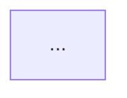
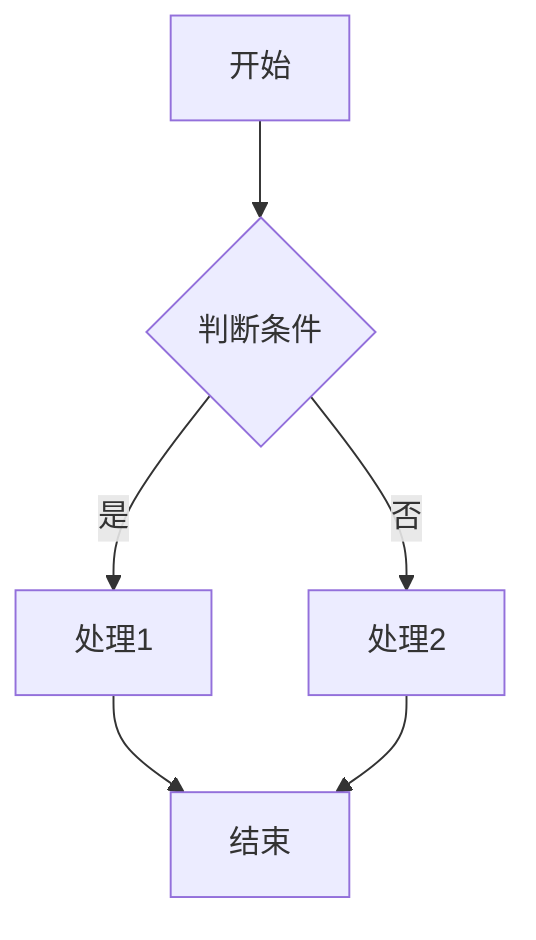
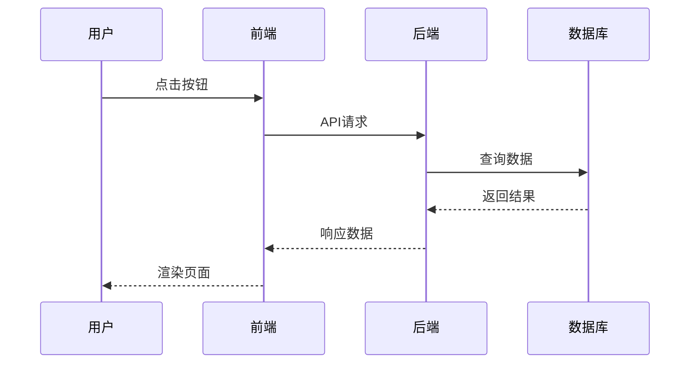
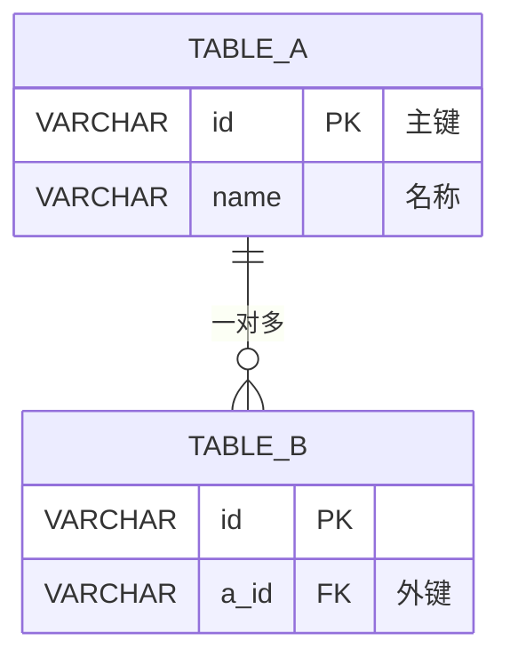

# AI提问模板 - 功能点拆分专用

## 🎯 通用提示词模板

```
我正在开发一个园区消费管理系统，需要你帮我拆分【功能模块名称】的所有功能点。

## 背景信息
- 系统类型：ToB消费管理系统
- 技术栈：Java Spring Boot + MySQL + Redis + Vue3
- 业务场景：【简要描述场景，如：食堂消费、商店购物、订餐等】

## 输出要求
## 📋 IOE-DREAM七微服务架构

**核心架构组成**:
- **Gateway Service (8080)**: API网关
- **Common Service (8088)**: 公共模块微服务
- **DeviceComm Service (8087)**: 设备通讯微服务
- **OA Service (8089)**: OA微服务
- **Access Service (8090)**: 门禁服务
- **Attendance Service (8091)**: 考勤服务
- **Video Service (8092)**: 视频服务
- **Consume Service (8094)**: 消费服务
- **Visitor Service (8095)**: 访客服务

**架构特点**:
- 基于Spring Boot 3.5.8 + Java 17
- 严格遵循企业级微服务规范
- 支持高并发、高可用、水平扩展

**技术栈标准**:
- **数据库**: MySQL 8.0 + Druid连接池
- **缓存**: Redis + Caffeine多级缓存
- **注册中心**: Nacos
- **配置中心**: Nacos Config
- **认证授权**: Sa-Token
请按照以下结构，详细拆分每个功能点：
## 🏗️ 四层架构规范

**标准架构模式**:
```
Controller (接口控制层)
    ↓
Service (核心业务层)
    ↓
Manager (流程管理层)
    ↓
DAO (数据访问层)
```

**层级职责**:
- **Controller层**: HTTP请求处理、参数验证、权限控制
- **Service层**: 核心业务逻辑、事务管理、业务规则验证
- **Manager层**: 复杂流程编排、多数据组装、第三方服务集成
- **DAO层**: 数据库CRUD操作、SQL查询实现、数据访问边界

**严格禁止跨层访问**: Controller不能直接调用Manager/DAO！

## ⚠️ IOE-DREAM零容忍规则（强制执行）

**必须遵守的架构规则**:
- ✅ **必须使用 @Resource 注入依赖**
- ✅ **必须使用 @Mapper 注解** (禁止@Repository)
- ✅ **必须使用 Dao 后缀** (禁止Repository)
- ✅ **必须使用 @RestController 注解**
- ✅ **必须使用 @Valid 参数校验**
- ✅ **必须返回统一ResponseDTO格式**
- ✅ **必须遵循四层架构边界**

**严格禁止事项**:
- ❌ **禁止使用 @Autowired 注入**
- ❌ **禁止使用 @Repository 注解**
- ❌ **禁止使用 Repository 后缀命名**
- ❌ **禁止跨层访问**
- ❌ **禁止在Controller中包含业务逻辑**
- ❌ **禁止直接访问数据库**

**违规后果**: P0级问题，立即修复，禁止合并！
### 1. 页面菜单结构
```
一级菜单
├── 二级菜单1
│   ├── 按钮1（功能描述）
│   ├── 按钮2（功能描述）
│   └── 弹窗1（交互说明）
└── 二级菜单2
    ├── 按钮3（功能描述）
    └── 表单1（字段说明）
```

### 2. 每个功能点包含
- **功能编号**：唯一标识
- **功能名称**：准确描述
- **触发方式**：按钮/链接/自动触发
- **业务流程图**（Mermaid格式）：
  - 用户操作步骤
  - 系统处理逻辑
  - 数据流转路径
  - 异常处理分支
- **数据库ER图**（Mermaid格式）：
  - 涉及的表
  - 字段定义
  - 关联关系
  - 索引设计
- **接口定义**：
  - 请求方法、路径
  - 请求参数
  - 响应数据
- **缓存策略**：
  - 缓存键设计
  - 过期时间
  - 更新时机

### 3. 优先级标注
- P0（核心功能）：必须实现
- P1（重要功能）：优先实现
- P2（辅助功能）：后期优化

## 参考示例
参考【区域管理模块】的拆分方式，每个功能点都需要同样详细的说明。
```

---

## 📝 具体场景提示词

### 场景1：拆分"区域管理"模块

```
我需要拆分【区域管理模块】的所有功能点，对应管理后台的"区域管理"菜单。

## 业务背景
- 原系统：餐厅和区域分离管理
- 重构目标：统一为区域模型，支持层级结构（园区→楼栋→楼层→区域）
- 使用场景：配置消费区域、分配权限、关联设备

## 请详细拆分以下功能：

### 页面层面
1. **区域列表页**
   - 树形结构展示按钮
   - 新增顶级区域按钮
   - 新增子区域按钮（右键菜单）
   - 编辑区域按钮
   - 删除区域按钮
   - 启用/禁用切换按钮
   - 搜索过滤功能
   - 批量操作功能

2. **区域新增/编辑弹窗**
   - 基础信息表单（编号、名称、类型）
   - 父区域选择器
   - 餐别分类多选框（餐饮类型专用）
   - 营业时间配置
   - 扩展属性JSON编辑器
   - 保存按钮
   - 取消按钮

3. **区域详情页**
   - 基础信息展示
   - 关联设备列表
   - 关联账户类别列表
   - 子区域列表
   - 操作日志

### 每个功能点需要包含：
- 完整的业务流程图（用户点击→前端验证→API调用→后端处理→数据库操作→缓存更新→返回结果）
- 数据库ER图（POSID_AREA表及关联表）
- RESTful接口设计
- Redis缓存策略（键设计、过期策略）

请逐一详细输出。
```

---

### 场景2：拆分"消费处理"流程

```
我需要拆分【消费处理流程】的所有功能点，对应POS设备端和管理后台的消费相关功能。

## 业务背景
- 支持6种消费模式：固定金额、自由金额、计量计费、商品消费、订餐消费、智能消费
- 涉及：余额扣款、补贴使用、权限验证、设备交互、流水记录
- 核心场景：用户刷卡/刷脸→设备识别→权限验证→扣款→生成流水

## 请拆分以下功能：

### POS设备端功能
1. **识别身份**
   - 刷卡识别
   - 人脸识别
   - 二维码扫码
   - 手机号输入

2. **选择消费模式**
   - 固定金额选择
   - 自由金额输入
   - 商品扫码/选择
   - 订餐确认

3. **确认支付**
   - 显示扣款金额
   - 余额/补贴使用提示
   - 确认按钮
   - 取消按钮

### 管理后台功能
1. **实时消费监控**
   - 消费流水实时刷新
   - 设备状态监控
   - 异常交易告警

2. **消费记录管理**
   - 流水查询（多条件筛选）
   - 流水详情查看
   - 流水导出
   - 异常流水处理（退款/补扣）

### 每个功能点需要：
- 完整时序图（设备→后端→缓存→数据库的交互）
- 6种消费模式的分支处理流程
- 涉及的表：POSID_TRANSACTION、POSID_ACCOUNT、POSID_SUBSIDY_ACCOUNT等
- 分布式事务处理（SAGA模式）
- 缓存预加载策略

请逐个功能点详细说明。
```

---

### 场景3：拆分"账户充值"功能

```
我需要拆分【账户充值功能】的所有细节，对应管理后台的"充值管理"和用户端的充值入口。

## 业务背景
- 充值方式：现金充值、微信支付、支付宝、银行卡
- 充值类型：个人充值、批量充值、自动充值
- 业务规则：充值限额、手续费、充值赠送、充值审核

## 功能拆分维度：

### 管理后台
1. **单人充值**
   - 搜索用户（姓名/工号/卡号）
   - 输入充值金额
   - 选择充值方式
   - 填写备注
   - 提交审核（可选）
   - 确认充值

2. **批量充值**
   - 导入Excel模板
   - 数据验证
   - 批量预览
   - 提交处理
   - 进度显示
   - 结果反馈（成功/失败明细）

3. **充值审核**
   - 待审核列表
   - 审核详情
   - 通过/驳回按钮
   - 审核意见

4. **充值记录**
   - 充值流水查询
   - 充值统计报表
   - 导出功能

### 每个功能包含：
- 用户操作流程图
- 支付流程时序图（对接第三方支付）
- 数据库设计（充值流水表、审核记录表）
- 事务保证（充值失败回滚）
- 通知机制（短信/邮件通知）

请按照优先级（P0/P1/P2）标注并详细说明。
```

---

### 场景4：拆分"报表统计"模块

```
我需要拆分【报表统计模块】的所有功能点，对应管理后台的"数据分析"和"报表中心"。

## 业务背景
- 报表类型：实时统计、日报、周报、月报、自定义报表
- 统计维度：按时间、按区域、按人员、按消费模式、按设备
- 数据来源：消费流水、充值记录、补贴发放、账户余额

## 功能拆分：

### 1. 仪表盘（Dashboard）
- 今日交易笔数卡片
- 今日交易金额卡片
- 在线设备数卡片
- 活跃用户数卡片
- 实时交易趋势图（ECharts）
- Top10消费区域饼图
- 消费模式分布图

### 2. 消费报表
- 按时间统计（小时/日/月）
- 按区域统计（树形结构）
- 按餐别统计
- 按账户类别统计
- 导出Excel功能

### 3. 财务报表
- 收入统计
- 充值统计
- 补贴使用统计
- 退款统计
- 对账报表

### 4. 自定义报表
- 选择统计维度
- 选择统计指标
- 设置筛选条件
- 生成报表
- 保存为模板

### 每个报表需要：
- 查询流程图（实时查询 vs 离线统计）
- 数据聚合逻辑
- 缓存策略（Redis预统计）
- SQL优化方案
- 大数据量分页方案

请详细说明每个报表的实现细节。
```

---

## 🔧 提示词优化技巧

### 1. 明确输入范围
```
请仅针对【页面A的功能B】进行拆分，不要涉及其他页面。
```

### 2. 指定输出格式
```
请按照以下格式输出：
## 功能点 X.X - [功能名称]
### 业务流程图

### 数据库ER图
```mermaid
erDiagram
...
```
```

### 3. 引用已有文档
```
参考【docs/POSID重构设计文档/01-区域管理模块重构设计.md】的写作风格和详细程度。
```

### 4. 分批次拆解
```
第一轮：仅输出所有功能点的清单（编号+名称）
第二轮：针对功能点 1.1 输出完整的流程图和ER图
第三轮：针对功能点 1.2 输出...
```

### 5. 明确技术约束
```
技术要求：
- 前端使用 Vue3 + Element Plus
- 后端使用 Spring Boot + MyBatis
- 数据库使用 MySQL 8.0
- 缓存使用 Redis 7.0
- 流程图使用 Mermaid 语法
```

---

## 📋 功能点拆分检查清单

完成拆分后，检查每个功能点是否包含：

- [ ] 功能编号和名称
- [ ] 触发方式（按钮/链接/自动）
- [ ] 业务流程图（Mermaid）
- [ ] 数据库ER图（Mermaid）
- [ ] RESTful接口定义
- [ ] 请求参数和响应格式
- [ ] 缓存策略设计
- [ ] 异常处理分支
- [ ] 权限控制说明
- [ ] 优先级标注（P0/P1/P2）

---

## 🎨 Mermaid语法速查

### 流程图


### 时序图


### ER图


---

**使用建议**：
1. 先用"通用模板"让AI输出功能清单
2. 再用"具体场景"模板逐个细化
3. 多次迭代，不断补充细节

