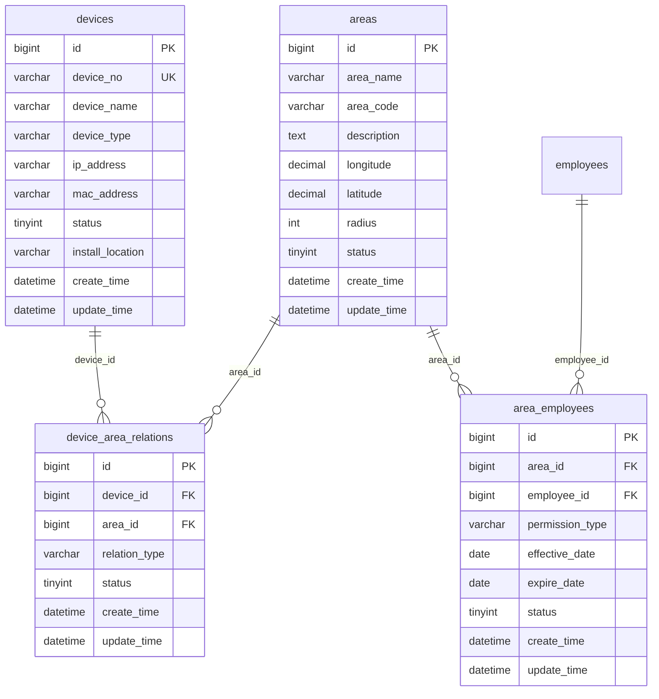

# 考勤设备区域管理模块设计

## 模块概述
考勤设备区域管理模块负责管理考勤设备、考勤区域以及设备与区域的关联关系，支持多种设备类型和基于位置的考勤管理。

## 涉及的核心数据表

### 1. devices（设备表）
```sql
CREATE TABLE devices (
    bigint id PK "主键ID，自增长"
    varchar device_no UK "设备编号，唯一标识，如：DEV001"
    varchar device_name "设备名称，如：一楼门禁机"
    varchar device_type "设备类型：考勤机/门禁/摄像头/移动端"
    varchar ip_address "设备IP地址，用于网络通信"
    varchar mac_address "设备MAC地址，用于设备识别"
    tinyint status "状态：0-离线，1-在线"
    varchar install_location "安装位置，如：一楼大厅"
    datetime create_time "创建时间，记录设备注册时间"
    datetime update_time "更新时间，记录最后修改时间"
);
```

### 2. areas（区域表）
```sql
CREATE TABLE areas (
    bigint id PK "主键ID，自增长"
    varchar area_name "区域名称，如：办公区A、生产车间"
    varchar area_code "区域编码，唯一标识，如：AREA001"
    text description "区域描述，详细说明区域用途"
    decimal longitude "经度坐标，用于GPS定位"
    decimal latitude "纬度坐标，用于GPS定位"
    int radius "有效半径(米)，打卡有效范围"
    tinyint status "状态：0-禁用，1-启用"
    datetime create_time "创建时间，记录区域创建时间"
    datetime update_time "更新时间，记录最后修改时间"
);
```

### 3. device_area_relations（设备区域关联表）
```sql
CREATE TABLE device_area_relations (
    bigint id PK "主键ID，自增长"
    bigint device_id FK "设备ID，关联devices表"
    bigint area_id FK "区域ID，关联areas表"
    varchar relation_type "关联类型：主要设备/备用设备/监控设备"
    tinyint status "状态：0-禁用，1-启用"
    datetime create_time "创建时间，记录关联创建时间"
    datetime update_time "更新时间，记录最后修改时间"
);
```

### 4. area_employees（区域员工权限表）
```sql
CREATE TABLE area_employees (
    bigint id PK "主键ID，自增长"
    bigint area_id FK "区域ID，关联areas表"
    bigint employee_id FK "员工ID，关联employees表"
    varchar permission_type "权限类型：正常打卡/临时访问/禁止进入"
    date effective_date "生效日期，权限开始时间"
    date expire_date "失效日期，权限结束时间"
    tinyint status "状态：0-禁用，1-启用"
    datetime create_time "创建时间，记录权限分配时间"
    datetime update_time "更新时间，记录最后修改时间"
);
```

## 表之间的关联关系
## 📋 IOE-DREAM七微服务架构

**核心架构组成**:
- **Gateway Service (8080)**: API网关
- **Common Service (8088)**: 公共模块微服务
- **DeviceComm Service (8087)**: 设备通讯微服务
- **OA Service (8089)**: OA微服务
- **Access Service (8090)**: 门禁服务
- **Attendance Service (8091)**: 考勤服务
- **Video Service (8092)**: 视频服务
- **Consume Service (8094)**: 消费服务
- **Visitor Service (8095)**: 访客服务

**架构特点**:
- 基于Spring Boot 3.5.8 + Java 17
- 严格遵循企业级微服务规范
- 支持高并发、高可用、水平扩展

**技术栈标准**:
- **数据库**: MySQL 8.0 + Druid连接池
- **缓存**: Redis + Caffeine多级缓存
- **注册中心**: Nacos
- **配置中心**: Nacos Config
- **认证授权**: Sa-Token

## 🏗️ 四层架构规范

**标准架构模式**:
```
Controller (接口控制层)
    ↓
Service (核心业务层)
    ↓
Manager (流程管理层)
    ↓
DAO (数据访问层)
```

**层级职责**:
- **Controller层**: HTTP请求处理、参数验证、权限控制
- **Service层**: 核心业务逻辑、事务管理、业务规则验证
- **Manager层**: 复杂流程编排、多数据组装、第三方服务集成
- **DAO层**: 数据库CRUD操作、SQL查询实现、数据访问边界

**严格禁止跨层访问**: Controller不能直接调用Manager/DAO！
### ER图关系
## ⚠️ IOE-DREAM零容忍规则（强制执行）

**必须遵守的架构规则**:
- ✅ **必须使用 @Resource 注入依赖**
- ✅ **必须使用 @Mapper 注解** (禁止@Repository)
- ✅ **必须使用 Dao 后缀** (禁止Repository)
- ✅ **必须使用 @RestController 注解**
- ✅ **必须使用 @Valid 参数校验**
- ✅ **必须返回统一ResponseDTO格式**
- ✅ **必须遵循四层架构边界**

**严格禁止事项**:
- ❌ **禁止使用 @Autowired 注入**
- ❌ **禁止使用 @Repository 注解**
- ❌ **禁止使用 Repository 后缀命名**
- ❌ **禁止跨层访问**
- ❌ **禁止在Controller中包含业务逻辑**
- ❌ **禁止直接访问数据库**

**违规后果**: P0级问题，立即修复，禁止合并！


### 关联说明
1. **设备-区域关联**：通过device_area_relations表实现多对多关系
2. **区域-员工权限**：通过area_employees表管理员工在特定区域的权限
3. **时间权限控制**：支持权限的生效和失效时间设置

## 关键业务逻辑说明

### 1. 设备管理逻辑
- **设备类型支持**：考勤机、门禁、摄像头、移动端等多种设备类型
- **设备状态监控**：实时监控设备在线/离线状态
- **设备网络通信**：通过IP地址和MAC地址进行设备通信
- **设备安装位置**：记录设备的物理安装位置

### 2. 区域管理逻辑
- **地理围栏设置**：基于GPS坐标和半径设置虚拟考勤区域
- **区域权限管理**：控制员工在特定区域的打卡权限
- **区域状态控制**：启用/禁用特定区域的考勤功能

### 3. 设备区域关联逻辑
- **多设备支持**：一个区域可关联多个设备（主要、备用、监控）
- **设备冗余**：支持主备设备切换，提高系统可靠性
- **关联类型管理**：不同类型的设备在考勤流程中承担不同角色

### 4. 权限管理逻辑
- **时间权限控制**：支持权限的生效和失效时间
- **权限类型区分**：正常打卡、临时访问、禁止进入等不同权限类型
- **权限继承**：部门权限可继承到下属员工

## 数据流转过程

### 1. 设备注册流程
```
设备发现 -> 输入设备信息 -> 生成设备编号 -> 验证唯一性 -> 创建设备记录 -> 关联区域
```

### 2. 区域创建流程
```
设置区域信息 -> 配置GPS坐标 -> 设定有效半径 -> 创建区域记录 -> 分配设备 -> 设置员工权限
```

### 3. 权限分配流程
```
选择员工 -> 选择区域 -> 设置权限类型 -> 配置生效时间 -> 创建权限记录 -> 通知相关系统
```

### 4. 打卡验证流程
```
员工打卡 -> 获取位置信息 -> 验证区域权限 -> 检查设备状态 -> 记录打卡数据 -> 返回验证结果
```

## 模块间的接口依赖

### 1. 依赖其他模块
- **基础信息管理模块**：需要员工信息进行权限分配
- **考勤数据采集模块**：提供设备信息用于打卡记录

### 2. 被其他模块依赖
- **考勤数据采集模块**：需要设备和区域信息进行打卡验证
- **考勤规则配置模块**：需要区域信息配置位置规则
- **异常管理模块**：需要设备信息处理设备异常

### 3. 核心接口定义

#### 设备管理接口
```javascript
// 获取设备列表
GET /api/devices?status={status}&type={type}
// 创建设备
POST /api/devices
// 更新设备
PUT /api/devices/{id}
// 删除设备
DELETE /api/devices/{id}
// 获取设备状态
GET /api/devices/{id}/status
```

#### 区域管理接口
```javascript
// 获取区域列表
GET /api/areas
// 创建区域
POST /api/areas
// 更新区域
PUT /api/areas/{id}
// 删除区域
DELETE /api/areas/{id}
// 验证位置权限
POST /api/areas/{id}/verify-location
```

#### 设备区域关联接口
```javascript
// 获取区域关联设备
GET /api/areas/{area_id}/devices
// 关联设备到区域
POST /api/device-area-relations
// 更新关联关系
PUT /api/device-area-relations/{id}
// 删除关联关系
DELETE /api/device-area-relations/{id}
```

#### 权限管理接口
```javascript
// 获取员工区域权限
GET /api/area-employees?employee_id={id}&area_id={id}
// 分配区域权限
POST /api/area-employees
// 更新权限
PUT /api/area-employees/{id}
// 批量分配权限
POST /api/area-employees/batch
```

## 前端页面设计建议

### 1. 设备管理页面
- **设备列表**：表格展示设备信息，支持按状态、类型筛选
- **设备详情**：显示设备完整信息和实时状态
- **设备地图**：在地图上显示设备位置分布

### 2. 区域管理页面
- **区域列表**：卡片式展示区域信息
- **区域地图配置**：可视化配置GPS坐标和半径
- **权限分配**：拖拽式员工权限分配界面

### 3. 设备区域关联页面
- **关联关系图表**：可视化展示设备与区域的关联关系
- **关联配置**：便捷的设备区域关联配置界面

## 开发优先级建议

### 1. 高优先级（核心功能）
- 设备基础信息管理
- 区域基础配置
- 设备区域关联
- 基础权限管理

### 2. 中优先级（增强功能）
- 设备状态监控
- 地理围栏验证
- 权限时间控制
- 设备冗余支持

### 3. 低优先级（扩展功能）
- 高级权限配置
- 设备性能监控
- 地图可视化
- 批量操作功能

## 技术实现要点

### 1. 地理位置计算
- 使用GPS坐标计算距离
- 实现地理围栏算法
- 处理定位精度问题

### 2. 设备通信
- 实现设备状态心跳检测
- 支持多种设备通信协议
- 处理网络异常情况

### 3. 权限验证
- 实现高效的权限验证算法
- 支持权限缓存机制
- 处理权限冲突情况

### 4. 数据同步
- 设备状态实时同步
- 权限变更实时生效
- 异常情况处理机制