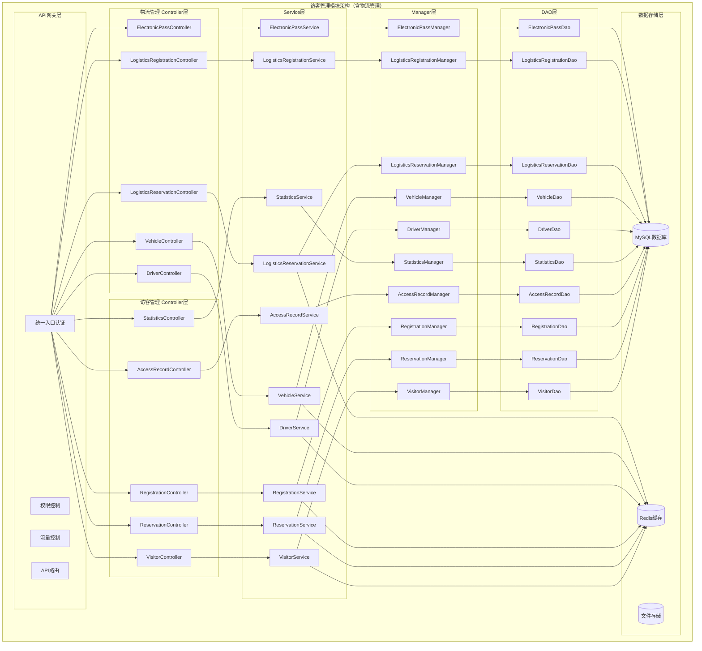
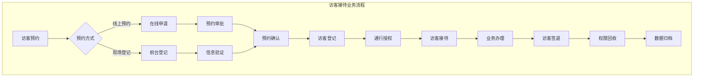
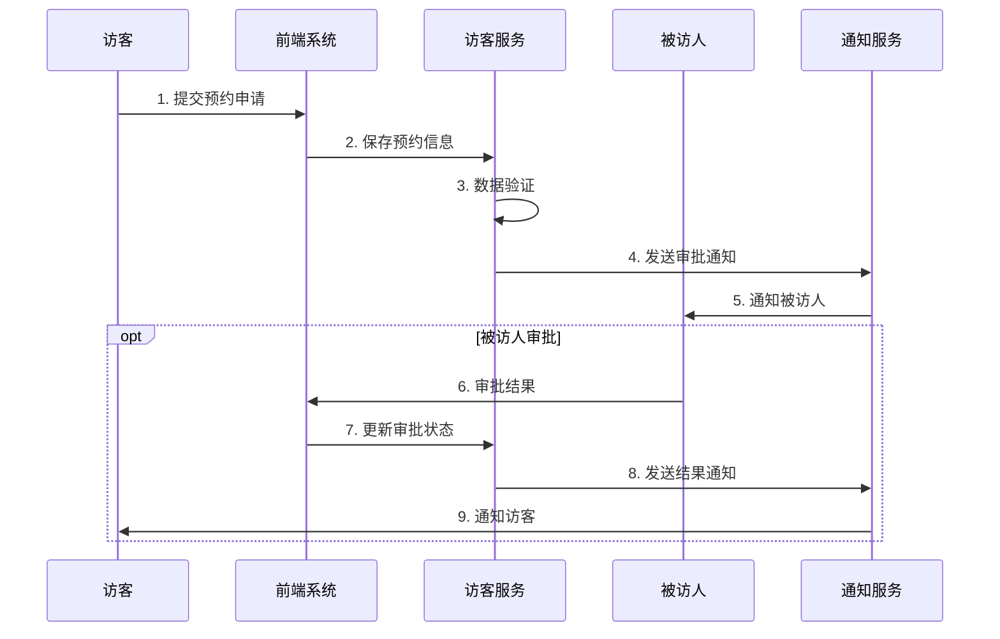
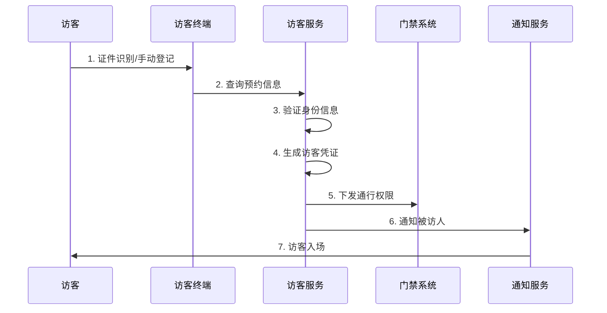
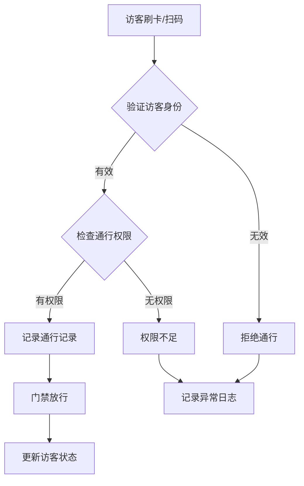
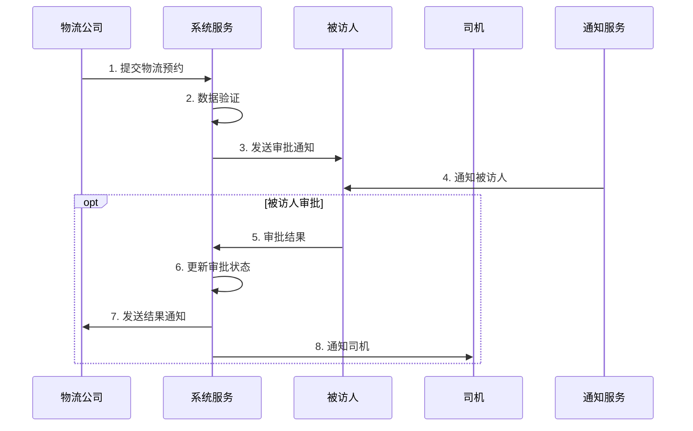
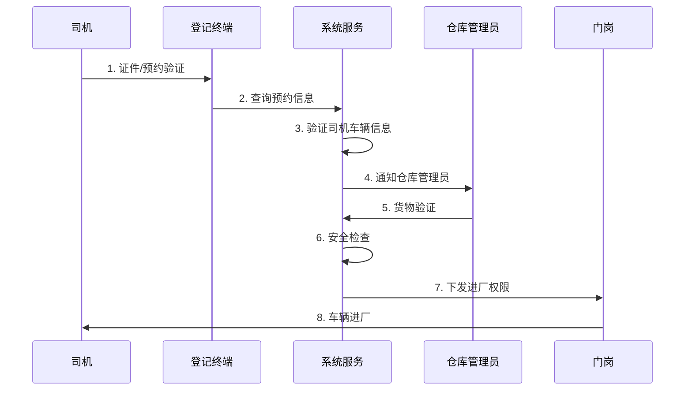
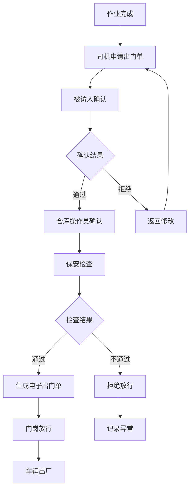
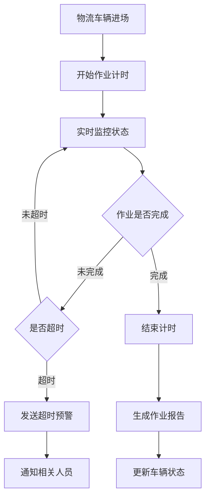

# 访客管理模块（含物流管理）数据架构设计文档

## 📋 文档概述

本文档基于访客管理系统的完整业务需求，结合 SmartAdmin 项目的四层架构设计规范，提供了访客管理模块的完整数据架构设计。模块涵盖访客信息管理、预约管理、登记管理、通行记录、物流管理和统计分析等核心业务功能。 

**设计目标**: 构建标准化、模块化、可扩展的访客管理系统
**架构理念**: 四层架构、领域驱动、数据驱动、安全可控
**商业价值**: 提升访客管理效率、增强安全管理能力、优化用户体验

## 🎯 模块组成

- **访客管理**: 访客信息、预约、登记、通行
- **物流管理**: 物流预约、车辆管理、司机管理、电子出门单

---

## 🏗️ 整体架构设计
## 📋 IOE-DREAM七微服务架构

**核心架构组成**:
- **Gateway Service (8080)**: API网关
- **Common Service (8088)**: 公共模块微服务
- **DeviceComm Service (8087)**: 设备通讯微服务
- **OA Service (8089)**: OA微服务
- **Access Service (8090)**: 门禁服务
- **Attendance Service (8091)**: 考勤服务
- **Video Service (8092)**: 视频服务
- **Consume Service (8094)**: 消费服务
- **Visitor Service (8095)**: 访客服务

**架构特点**:
- 基于Spring Boot 3.5.8 + Java 17
- 严格遵循企业级微服务规范
- 支持高并发、高可用、水平扩展

**技术栈标准**:
- **数据库**: MySQL 8.0 + Druid连接池
- **缓存**: Redis + Caffeine多级缓存
- **注册中心**: Nacos
- **配置中心**: Nacos Config
- **认证授权**: Sa-Token

## 🏗️ 四层架构规范

**标准架构模式**:
```
Controller (接口控制层)
    ↓
Service (核心业务层)
    ↓
Manager (流程管理层)
    ↓
DAO (数据访问层)
```

**层级职责**:
- **Controller层**: HTTP请求处理、参数验证、权限控制
- **Service层**: 核心业务逻辑、事务管理、业务规则验证
- **Manager层**: 复杂流程编排、多数据组装、第三方服务集成
- **DAO层**: 数据库CRUD操作、SQL查询实现、数据访问边界

**严格禁止跨层访问**: Controller不能直接调用Manager/DAO！
### 1. 架构概览
## ⚠️ IOE-DREAM零容忍规则（强制执行）

**必须遵守的架构规则**:
- ✅ **必须使用 @Resource 注入依赖**
- ✅ **必须使用 @Mapper 注解** (禁止@Repository)
- ✅ **必须使用 Dao 后缀** (禁止Repository)
- ✅ **必须使用 @RestController 注解**
- ✅ **必须使用 @Valid 参数校验**
- ✅ **必须返回统一ResponseDTO格式**
- ✅ **必须遵循四层架构边界**

**严格禁止事项**:
- ❌ **禁止使用 @Autowired 注入**
- ❌ **禁止使用 @Repository 注解**
- ❌ **禁止使用 Repository 后缀命名**
- ❌ **禁止跨层访问**
- ❌ **禁止在Controller中包含业务逻辑**
- ❌ **禁止直接访问数据库**

**违规后果**: P0级问题，立即修复，禁止合并！



### 2. 核心业务流程



---

## 💾 数据库设计

### 1. 核心数据表设计

#### 1.1 访客基础信息表 (t_visitor)

```sql
CREATE TABLE `t_visitor` (
  `visitor_id` BIGINT AUTO_INCREMENT PRIMARY KEY COMMENT '访客ID',
  `visitor_code` VARCHAR(50) NOT NULL UNIQUE COMMENT '访客编号',
  `name` VARCHAR(100) NOT NULL COMMENT '姓名',
  `gender` TINYINT DEFAULT 1 COMMENT '性别(1:男 2:女)',
  `id_card` VARCHAR(50) NOT NULL UNIQUE COMMENT '证件号',
  `phone` VARCHAR(20) COMMENT '手机号',
  `email` VARCHAR(100) COMMENT '邮箱',
  `company_name` VARCHAR(200) COMMENT '公司名称',
  `photo_url` VARCHAR(500) COMMENT '照片URL',
  `visitor_level` VARCHAR(20) DEFAULT 'NORMAL' COMMENT '访客等级',
  `blacklisted` TINYINT DEFAULT 0 COMMENT '是否黑名单(0:否 1:是)',
  `blacklist_reason` TEXT COMMENT '黑名单原因',
  `blacklist_time` DATETIME COMMENT '加入黑名单时间',
  `blacklist_operator` VARCHAR(100) COMMENT '操作人',
  `last_visit_time` DATETIME COMMENT '最后访问时间',
  `access_level_id` BIGINT COMMENT '访客权限ID',
  `shelves_flag` TINYINT DEFAULT 1 COMMENT '启用状态',
  `deleted_flag` TINYINT DEFAULT 0 COMMENT '删除状态',
  `remark` TEXT COMMENT '备注',
  `create_time` DATETIME DEFAULT CURRENT_TIMESTAMP COMMENT '创建时间',
  `update_time` DATETIME DEFAULT CURRENT_TIMESTAMP ON UPDATE CURRENT_TIMESTAMP COMMENT '更新时间',
  `create_user` BIGINT COMMENT '创建人',
  `update_user` BIGINT COMMENT '更新人',
  INDEX `idx_visitor_code` (`visitor_code`),
  INDEX `idx_id_card` (`id_card`),
  INDEX `idx_phone` (`phone`),
  INDEX `idx_blacklisted` (`blacklisted`),
  INDEX `idx_create_time` (`create_time`)
) ENGINE=InnoDB DEFAULT CHARSET=utf8mb4 COMMENT='访客信息表';
```

#### 1.2 被访人信息表 (t_interviewee)

```sql
CREATE TABLE `t_interviewee` (
  `interviewee_id` BIGINT AUTO_INCREMENT PRIMARY KEY COMMENT '被访人ID',
  `employee_id` VARCHAR(50) NOT NULL UNIQUE COMMENT '员工ID',
  `name` VARCHAR(100) NOT NULL COMMENT '姓名',
  `department_id` BIGINT COMMENT '部门ID',
  `position` VARCHAR(100) COMMENT '职位',
  `phone` VARCHAR(20) COMMENT '联系电话',
  `email` VARCHAR(100) COMMENT '邮箱',
  `area_id` BIGINT COMMENT '所属区域ID',
  `status` TINYINT DEFAULT 1 COMMENT '状态(0:禁用 1:启用)',
  `shelves_flag` TINYINT DEFAULT 1 COMMENT '启用状态',
  `deleted_flag` TINYINT DEFAULT 0 COMMENT '删除状态',
  `remark` TEXT COMMENT '备注',
  `create_time` DATETIME DEFAULT CURRENT_TIMESTAMP COMMENT '创建时间',
  `update_time` DATETIME DEFAULT CURRENT_TIMESTAMP ON UPDATE CURRENT_TIMESTAMP COMMENT '更新时间',
  `create_user` BIGINT COMMENT '创建人',
  `update_user` BIGINT COMMENT '更新人',
  INDEX `idx_employee_id` (`employee_id`),
  INDEX `idx_department_id` (`department_id`),
  INDEX `idx_area_id` (`area_id`),
  INDEX `idx_status` (`status`)
) ENGINE=InnoDB DEFAULT CHARSET=utf8mb4 COMMENT='被访人信息表';
```

#### 1.3 区域管理表 (t_area)

```sql
CREATE TABLE `t_area` (
  `area_id` BIGINT AUTO_INCREMENT PRIMARY KEY COMMENT '区域ID',
  `area_code` VARCHAR(50) NOT NULL UNIQUE COMMENT '区域编码',
  `area_name` VARCHAR(200) NOT NULL COMMENT '区域名称',
  `parent_area_id` BIGINT COMMENT '父区域ID',
  `area_type` VARCHAR(50) COMMENT '区域类型',
  `building` VARCHAR(100) COMMENT '楼栋',
  `floor` VARCHAR(20) COMMENT '楼层',
  `capacity` INT COMMENT '容纳人数',
  `manager_name` VARCHAR(100) COMMENT '负责人',
  `manager_phone` VARCHAR(20) COMMENT '负责人电话',
  `description` TEXT COMMENT '区域描述',
  `map_file_url` VARCHAR(500) COMMENT '地图文件URL',
  `access_level` VARCHAR(20) DEFAULT 'NORMAL' COMMENT '访问权限级别',
  `status` TINYINT DEFAULT 1 COMMENT '状态(0:禁用 1:启用)',
  `shelves_flag` TINYINT DEFAULT 1 COMMENT '启用状态',
  `deleted_flag` TINYINT DEFAULT 0 COMMENT '删除状态',
  `create_time` DATETIME DEFAULT CURRENT_TIMESTAMP COMMENT '创建时间',
  `update_time` DATETIME DEFAULT CURRENT_TIMESTAMP ON UPDATE CURRENT_TIMESTAMP COMMENT '更新时间',
  `create_user` BIGINT COMMENT '创建人',
  `update_user` BIGINT COMMENT '更新人',
  INDEX `idx_area_code` (`area_code`),
  INDEX `idx_parent_area` (`parent_area_id`),
  INDEX `idx_area_type` (`area_type`),
  INDEX `idx_status` (`status`)
) ENGINE=InnoDB DEFAULT CHARSET=utf8mb4 COMMENT='区域管理表';
```

#### 1.4 访客权限级别表 (t_visitor_access_level)

```sql
CREATE TABLE `t_visitor_access_level` (
  `access_level_id` BIGINT AUTO_INCREMENT PRIMARY KEY COMMENT '权限级别ID',
  `level_code` VARCHAR(50) NOT NULL UNIQUE COMMENT '权限级别编码',
  `level_name` VARCHAR(100) NOT NULL COMMENT '权限级别名称',
  `level_type` VARCHAR(50) COMMENT '权限类型',
  `access_areas` TEXT COMMENT '可访问区域(区域ID列表)',
  `time_limit_start` TIME COMMENT '时间限制开始',
  `time_limit_end` TIME COMMENT '时间限制结束',
  `weekday_access` TINYINT DEFAULT 1 COMMENT '工作日访问权限(0:否 1:是)',
  `weekend_access` TINYINT DEFAULT 0 COMMENT '周末访问权限(0:否 1:是)',
  `holiday_access` TINYINT DEFAULT 0 COMMENT '节假日访问权限(0:否 1:是)',
  `require_escort` TINYINT DEFAULT 1 COMMENT '是否需要陪同(0:否 1:是)',
  `special_permissions` TEXT COMMENT '特殊权限(JSON格式)',
  `description` TEXT COMMENT '权限描述',
  `color_code` VARCHAR(20) COMMENT '显示颜色',
  `icon` VARCHAR(50) COMMENT '图标',
  `status` TINYINT DEFAULT 1 COMMENT '状态(0:禁用 1:启用)',
  `shelves_flag` TINYINT DEFAULT 1 COMMENT '启用状态',
  `deleted_flag` TINYINT DEFAULT 0 COMMENT '删除状态',
  `create_time` DATETIME DEFAULT CURRENT_TIMESTAMP COMMENT '创建时间',
  `update_time` DATETIME DEFAULT CURRENT_TIMESTAMP ON UPDATE CURRENT_TIMESTAMP COMMENT '更新时间',
  `create_user` BIGINT COMMENT '创建人',
  `update_user` BIGINT COMMENT '更新人',
  INDEX `idx_level_code` (`level_code`),
  INDEX `idx_level_type` (`level_type`),
  INDEX `idx_status` (`status`)
) ENGINE=InnoDB DEFAULT CHARSET=utf8mb4 COMMENT='访客权限级别表';
```

#### 1.5 访客预约表 (t_visitor_reservation)

```sql
CREATE TABLE `t_visitor_reservation` (
  `reservation_id` BIGINT AUTO_INCREMENT PRIMARY KEY COMMENT '预约ID',
  `reservation_code` VARCHAR(50) NOT NULL UNIQUE COMMENT '预约编号',
  `visitor_id` BIGINT COMMENT '访客ID',
  `visitor_name` VARCHAR(100) NOT NULL COMMENT '访客姓名',
  `id_card` VARCHAR(50) NOT NULL COMMENT '证件号',
  `phone` VARCHAR(20) COMMENT '手机号',
  `interviewee_id` BIGINT COMMENT '被访人ID',
  `interviewee_name` VARCHAR(50) COMMENT '被访人姓名',
  `visit_purpose` VARCHAR(200) COMMENT '访问目的',
  `purpose_detail` TEXT COMMENT '访问事由详细说明',
  `visit_date` DATE NOT NULL COMMENT '访问日期',
  `start_time` TIME NOT NULL COMMENT '开始时间',
  `end_time` TIME NOT NULL COMMENT '结束时间',
  `visit_area_id` BIGINT COMMENT '访问区域ID',
  `visitor_count` INT DEFAULT 1 COMMENT '访客人数',
  `car_number` VARCHAR(50) COMMENT '车牌号',
  `status` VARCHAR(20) DEFAULT 'PENDING' COMMENT '预约状态(PENDING:待审核 APPROVED:已通过 REJECTED:已拒绝 CANCELLED:已取消 COMPLETED:已完成)',
  `approve_user` VARCHAR(100) COMMENT '审批人',
  `approve_time` DATETIME COMMENT '审批时间',
  `approve_remark` TEXT COMMENT '审批意见',
  `reject_reason` TEXT COMMENT '拒绝原因',
  `reminder_flag` TINYINT DEFAULT 0 COMMENT '是否已提醒(0:否 1:是)',
  `shelves_flag` TINYINT DEFAULT 1 COMMENT '启用状态',
  `deleted_flag` TINYINT DEFAULT 0 COMMENT '删除状态',
  `remark` TEXT COMMENT '备注',
  `create_time` DATETIME DEFAULT CURRENT_TIMESTAMP COMMENT '创建时间',
  `update_time` DATETIME DEFAULT CURRENT_TIMESTAMP ON UPDATE CURRENT_TIMESTAMP COMMENT '更新时间',
  `create_user` BIGINT COMMENT '创建人',
  `update_user` BIGINT COMMENT '更新人',
  INDEX `idx_reservation_code` (`reservation_code`),
  INDEX `idx_visitor_id` (`visitor_id`),
  INDEX `idx_interviewee_id` (`interviewee_id`),
  INDEX `idx_visit_date` (`visit_date`),
  INDEX `idx_status` (`status`),
  INDEX `idx_create_time` (`create_time`)
) ENGINE=InnoDB DEFAULT CHARSET=utf8mb4 COMMENT='访客预约表';
```

#### 1.6 访客登记表 (t_visitor_registration)

```sql
CREATE TABLE `t_visitor_registration` (
  `registration_id` BIGINT AUTO_INCREMENT PRIMARY KEY COMMENT '登记ID',
  `registration_code` VARCHAR(50) NOT NULL UNIQUE COMMENT '登记编号',
  `reservation_id` BIGINT COMMENT '关联预约ID',
  `visitor_id` BIGINT COMMENT '访客ID',
  `visitor_name` VARCHAR(100) NOT NULL COMMENT '访客姓名',
  `id_card` VARCHAR(50) NOT NULL COMMENT '证件号',
  `phone` VARCHAR(20) COMMENT '手机号',
  `interviewee_id` BIGINT COMMENT '被访人ID',
  `interviewee_name` VARCHAR(50) COMMENT '被访人姓名',
  `visitor_card` VARCHAR(50) COMMENT '访客卡号',
  `access_level_id` BIGINT COMMENT '访问权限级别ID',
  `access_areas` TEXT COMMENT '访问区域(区域ID列表)',
  `expected_leave_time` DATETIME COMMENT '预计离开时间',
  `actual_leave_time` DATETIME COMMENT '实际离开时间',
  `registration_device` VARCHAR(100) COMMENT '登记设备',
  `check_in_photo_url` VARCHAR(500) COMMENT '签入照片URL',
  `check_out_photo_url` VARCHAR(500) COMMENT '签出照片URL',
  `status` VARCHAR(20) DEFAULT 'ACTIVE' COMMENT '状态(ACTIVE:在场 COMPLETED:已离开 TIMEOUT:超时 CANCELLED:已取消)',
  `over_time_reason` VARCHAR(200) COMMENT '超时原因',
  `escort_required` TINYINT DEFAULT 0 COMMENT '是否需要陪同(0:否 1:是)',
  `escort_user` VARCHAR(100) COMMENT '陪同人',
  `shelves_flag` TINYINT DEFAULT 1 COMMENT '启用状态',
  `deleted_flag` TINYINT DEFAULT 0 COMMENT '删除状态',
  `remark` TEXT COMMENT '备注',
  `create_time` DATETIME DEFAULT CURRENT_TIMESTAMP COMMENT '登记时间',
  `update_time` DATETIME DEFAULT CURRENT_TIMESTAMP ON UPDATE CURRENT_TIMESTAMP COMMENT '更新时间',
  `create_user` BIGINT COMMENT '登记人',
  `update_user` BIGINT COMMENT '更新人',
  INDEX `idx_registration_code` (`registration_code`),
  INDEX `idx_reservation_id` (`reservation_id`),
  INDEX `idx_visitor_id` (`visitor_id`),
  INDEX `idx_interviewee_id` (`interviewee_id`),
  INDEX `idx_status` (`status`),
  INDEX `idx_registration_time` (`create_time`),
  INDEX `idx_expected_leave_time` (`expected_leave_time`),
  INDEX `idx_visitor_card` (`visitor_card`)
) ENGINE=InnoDB DEFAULT CHARSET=utf8mb4 COMMENT='访客登记记录表';
```

#### 1.7 通行记录表 (t_visitor_access_record)

```sql
CREATE TABLE `t_visitor_access_record` (
  `record_id` BIGINT AUTO_INCREMENT PRIMARY KEY COMMENT '通行记录ID',
  `record_code` VARCHAR(50) NOT NULL UNIQUE COMMENT '记录编码',
  `registration_id` BIGINT COMMENT '登记ID',
  `visitor_id` BIGINT COMMENT '访客ID',
  `device_id` VARCHAR(100) COMMENT '设备ID',
  `device_name` VARCHAR(200) COMMENT '设备名称',
  `access_type` VARCHAR(20) NOT NULL COMMENT '通行类型(ENTRY:进入 EXIT:离开)',
  `access_result` VARCHAR(20) NOT NULL COMMENT '通行结果(SUCCESS:成功 FAILED:失败)',
  `access_location` VARCHAR(200) COMMENT '通行位置',
  `area_id` BIGINT COMMENT '区域ID',
  `card_number` VARCHAR(50) COMMENT '卡号',
  `qr_code` VARCHAR(100) COMMENT '二维码',
  `access_data` TEXT COMMENT '通行数据(JSON格式)',
  `operator` VARCHAR(100) COMMENT '操作人',
  `exception_flag` TINYINT DEFAULT 0 COMMENT '是否异常(0:否 1:是)',
  `exception_type` VARCHAR(50) COMMENT '异常类型',
  `exception_description` TEXT COMMENT '异常描述',
  `create_time` DATETIME DEFAULT CURRENT_TIMESTAMP COMMENT '创建时间',
  INDEX `idx_record_code` (`record_code`),
  INDEX `idx_registration_id` (`registration_id`),
  INDEX `idx_visitor_id` (`visitor_id`),
  INDEX `idx_access_time` (`create_time`),
  INDEX `idx_access_type` (`access_type`),
  INDEX `idx_access_result` (`access_result`),
  INDEX `idx_area_id` (`area_id`),
  INDEX `idx_exception_flag` (`exception_flag`)
) ENGINE=InnoDB DEFAULT CHARSET=utf8mb4 COMMENT='访客通行记录表';
```

#### 1.8 访客统计表 (t_visitor_statistics)

```sql
CREATE TABLE `t_visitor_statistics` (
  `statistics_id` BIGINT AUTO_INCREMENT PRIMARY KEY COMMENT '统计ID',
  `stat_date` DATE NOT NULL COMMENT '统计日期',
  `total_visitors` INT DEFAULT 0 COMMENT '总访客数',
  `new_visitors` INT DEFAULT 0 COMMENT '新访客数',
  `repeat_visitors` INT DEFAULT 0 COMMENT '重复访客数',
  `blacklisted_visitors` INT DEFAULT 0 COMMENT '黑名单访客数',
  `avg_stay_minutes` INT DEFAULT 0 COMMENT '平均停留时长(分钟)',
  `peak_hour_visitors` INT DEFAULT 0 COMMENT '高峰小时访客数',
  `total_companies` INT DEFAULT 0 COMMENT '总公司数',
  `reservation_count` INT DEFAULT 0 COMMENT '预约总数',
  `approved_reservations` INT DEFAULT 0 COMMENT '通过预约数',
  `rejected_reservations` INT DEFAULT 0 COMMENT '拒绝预约数',
  `no_show_reservations` INT DEFAULT 0 COMMENT '未到访预约数',
  `shelves_flag` TINYINT DEFAULT 1 COMMENT '启用状态',
  `create_time` DATETIME DEFAULT CURRENT_TIMESTAMP COMMENT '创建时间',
  `update_time` DATETIME DEFAULT CURRENT_TIMESTAMP ON UPDATE CURRENT_TIMESTAMP COMMENT '更新时间',
  `create_user` BIGINT COMMENT '创建人',
  `update_user` BIGINT COMMENT '更新人',
  UNIQUE KEY `uk_stat_date` (`stat_date`)
) ENGINE=InnoDB DEFAULT CHARSET=utf8mb4 COMMENT='访客统计表';
```

#### 1.9 物流管理相关数据表

##### 1.9.1 司机信息表 (t_logistics_driver)

```sql
CREATE TABLE `t_logistics_driver` (
  `driver_id` BIGINT AUTO_INCREMENT PRIMARY KEY COMMENT '司机ID',
  `driver_code` VARCHAR(50) NOT NULL UNIQUE COMMENT '司机编号',
  `name` VARCHAR(100) NOT NULL COMMENT '姓名',
  `gender` TINYINT DEFAULT 1 COMMENT '性别(1:男 2:女)',
  `id_card` VARCHAR(18) NOT NULL UNIQUE COMMENT '证件号',
  `phone` VARCHAR(20) NOT NULL COMMENT '手机号',
  `driver_license` VARCHAR(50) NOT NULL COMMENT '驾驶证号',
  `license_type` VARCHAR(20) COMMENT '驾照类型',
  `license_expire_date` DATE COMMENT '驾照有效期',
  `transport_company` VARCHAR(200) COMMENT '运输公司',
  `company_address` TEXT COMMENT '公司地址',
  `emergency_contact` VARCHAR(100) COMMENT '紧急联系人',
  `emergency_phone` VARCHAR(20) COMMENT '紧急联系电话',
  `photo_url` VARCHAR(500) COMMENT '照片URL',
  `driver_status` VARCHAR(20) DEFAULT 'ACTIVE' COMMENT '司机状态(ACTIVE:正常 BLACKLISTED:黑名单)',
  `blacklist_reason` TEXT COMMENT '黑名单原因',
  `total_trips` INT DEFAULT 0 COMMENT '总运输次数',
  `last_trip_time` DATETIME COMMENT '最后运输时间',
  `shelves_flag` TINYINT DEFAULT 1 COMMENT '启用状态',
  `deleted_flag` TINYINT DEFAULT 0 COMMENT '删除状态',
  `remark` TEXT COMMENT '备注',
  `create_time` DATETIME DEFAULT CURRENT_TIMESTAMP COMMENT '创建时间',
  `update_time` DATETIME DEFAULT CURRENT_TIMESTAMP ON UPDATE CURRENT_TIMESTAMP COMMENT '更新时间',
  `create_user` BIGINT COMMENT '创建人',
  `update_user` BIGINT COMMENT '更新人',
  INDEX `idx_driver_code` (`driver_code`),
  INDEX `idx_id_card` (`id_card`),
  INDEX `idx_phone` (`phone`),
  INDEX `idx_driver_license` (`driver_license`),
  INDEX `idx_transport_company` (`transport_company`),
  INDEX `idx_driver_status` (`driver_status`)
) ENGINE=InnoDB DEFAULT CHARSET=utf8mb4 COMMENT='司机信息表';
```

##### 1.9.2 车辆信息表 (t_logistics_vehicle)

```sql
CREATE TABLE `t_logistics_vehicle` (
  `vehicle_id` BIGINT AUTO_INCREMENT PRIMARY KEY COMMENT '车辆ID',
  `vehicle_code` VARCHAR(50) NOT NULL UNIQUE COMMENT '车辆编号',
  `plate_number` VARCHAR(20) NOT NULL UNIQUE COMMENT '车牌号',
  `vehicle_type` VARCHAR(50) NOT NULL COMMENT '车辆类型',
  `brand_model` VARCHAR(100) COMMENT '品牌型号',
  `vehicle_color` VARCHAR(20) COMMENT '车辆颜色',
  `load_capacity` DECIMAL(10,2) COMMENT '核载重量(吨)',
  `seat_capacity` INT COMMENT '核载人数',
  `vehicle_length` DECIMAL(8,2) COMMENT '车长(米)',
  `vehicle_width` DECIMAL(8,2) COMMENT '车宽(米)',
  `vehicle_height` DECIMAL(8,2) COMMENT '车高(米)',
  `registration_number` VARCHAR(50) COMMENT '行驶证号',
  `registration_date` DATE COMMENT '注册日期',
  `inspection_expire_date` DATE COMMENT '年检有效期',
  `insurance_expire_date` DATE COMMENT '保险有效期',
  `transport_permit` VARCHAR(50) COMMENT '运输许可证号',
  `permit_expire_date` DATE COMMENT '许可证有效期',
  `vehicle_status` VARCHAR(20) DEFAULT 'ACTIVE' COMMENT '车辆状态(ACTIVE:正常 MAINTENANCE:维修中)',
  `current_driver_id` BIGINT COMMENT '当前司机ID',
  `vehicle_photos` TEXT COMMENT '车辆照片URL(JSON格式)',
  `shelves_flag` TINYINT DEFAULT 1 COMMENT '启用状态',
  `deleted_flag` TINYINT DEFAULT 0 COMMENT '删除状态',
  `remark` TEXT COMMENT '备注',
  `create_time` DATETIME DEFAULT CURRENT_TIMESTAMP COMMENT '创建时间',
  `update_time` DATETIME DEFAULT CURRENT_TIMESTAMP ON UPDATE CURRENT_TIMESTAMP COMMENT '更新时间',
  `create_user` BIGINT COMMENT '创建人',
  `update_user` BIGINT COMMENT '更新人',
  INDEX `idx_vehicle_code` (`vehicle_code`),
  INDEX `idx_plate_number` (`plate_number`),
  INDEX `idx_vehicle_type` (`vehicle_type`),
  INDEX `idx_registration_number` (`registration_number`),
  INDEX `idx_vehicle_status` (`vehicle_status`),
  INDEX `idx_current_driver` (`current_driver_id`)
) ENGINE=InnoDB DEFAULT CHARSET=utf8mb4 COMMENT='车辆信息表';
```

##### 1.9.3 司机车辆绑定关系表 (t_logistics_driver_vehicle)

```sql
CREATE TABLE `t_logistics_driver_vehicle` (
  `bind_id` BIGINT AUTO_INCREMENT PRIMARY KEY COMMENT '绑定关系ID',
  `driver_id` BIGINT NOT NULL COMMENT '司机ID',
  `vehicle_id` BIGINT NOT NULL COMMENT '车辆ID',
  `bind_time` DATETIME DEFAULT CURRENT_TIMESTAMP COMMENT '绑定时间',
  `unbind_time` DATETIME COMMENT '解绑时间',
  `status` VARCHAR(20) DEFAULT 'ACTIVE' COMMENT '状态(ACTIVE:绑定中 INACTIVE:已解绑)',
  `shelves_flag` TINYINT DEFAULT 1 COMMENT '启用状态',
  `deleted_flag` TINYINT DEFAULT 0 COMMENT '删除状态',
  `remark` TEXT COMMENT '备注',
  `create_time` DATETIME DEFAULT CURRENT_TIMESTAMP COMMENT '创建时间',
  `update_time` DATETIME DEFAULT CURRENT_TIMESTAMP ON UPDATE CURRENT_TIMESTAMP COMMENT '更新时间',
  `create_user` BIGINT COMMENT '创建人',
  `update_user` BIGINT COMMENT '更新人',
  INDEX `idx_driver_id` (`driver_id`),
  INDEX `idx_vehicle_id` (`vehicle_id`),
  INDEX `idx_status` (`status`),
  UNIQUE KEY `uk_driver_vehicle_active` (`driver_id`, `vehicle_id`, `status`)
) ENGINE=InnoDB DEFAULT CHARSET=utf8mb4 COMMENT='司机车辆绑定关系表';
```

##### 1.9.4 物流预约表 (t_logistics_reservation)

```sql
CREATE TABLE `t_logistics_reservation` (
  `reservation_id` BIGINT AUTO_INCREMENT PRIMARY KEY COMMENT '预约ID',
  `reservation_code` VARCHAR(50) NOT NULL UNIQUE COMMENT '预约编号',
  `driver_id` BIGINT COMMENT '司机ID',
  `vehicle_id` BIGINT COMMENT '车辆ID',
  `driver_name` VARCHAR(50) NOT NULL COMMENT '司机姓名',
  `id_card` VARCHAR(18) NOT NULL COMMENT '证件号',
  `plate_number` VARCHAR(20) NOT NULL COMMENT '车牌号',
  `transport_company` VARCHAR(200) NOT NULL COMMENT '运输公司名称',
  `contact_person` VARCHAR(100) NOT NULL COMMENT '联系人',
  `contact_phone` VARCHAR(20) NOT NULL COMMENT '联系电话',
  `reservation_type` VARCHAR(50) DEFAULT 'DELIVERY' COMMENT '预约类型(DELIVERY:送货 PICKUP:提货 TRANSFER:转运)',
  `goods_type` VARCHAR(100) NOT NULL COMMENT '货物类型',
  `goods_description` TEXT COMMENT '货物详细描述',
  `goods_weight` DECIMAL(10,2) COMMENT '货物重量(吨)',
  `goods_volume` DECIMAL(10,2) COMMENT '货物体积(立方米)',
  `goods_quantity` INT COMMENT '货物数量',
  `package_count` INT COMMENT '包装数量',
  `special_requirements` TEXT COMMENT '特殊要求(危险品、温控等)',
  `operation_type` VARCHAR(50) DEFAULT 'LOADING' COMMENT '作业类型(LOADING:装载 UNLOADING:卸载 BOTH:装卸)',
  `operation_area_id` BIGINT NOT NULL COMMENT '作业区域ID',
  `warehouse_location` VARCHAR(200) COMMENT '仓库位置',
  `expected_arrive_date` DATE NOT NULL COMMENT '预计到达日期',
  `expected_arrive_time_start` TIME NOT NULL COMMENT '预计到达开始时间',
  `expected_arrive_time_end` TIME NOT NULL COMMENT '预计到达结束时间',
  `estimated_operation_duration` INT COMMENT '预计作业时长(分钟)',
  `interviewee_id` BIGINT NOT NULL COMMENT '被访人/接货人ID',
  `purpose_detail` TEXT COMMENT '访问事由详细说明',
  `status` VARCHAR(20) DEFAULT 'PENDING' COMMENT '预约状态(PENDING:待审核 APPROVED:已通过 REJECTED:已拒绝 CANCELLED:已取消 COMPLETED:已完成)',
  `approve_user` VARCHAR(100) COMMENT '审批人',
  `approve_time` DATETIME COMMENT '审批时间',
  `approve_remark` TEXT COMMENT '审批意见',
  `reject_reason` TEXT COMMENT '拒绝原因',
  `shelves_flag` TINYINT DEFAULT 1 COMMENT '启用状态',
  `deleted_flag` TINYINT DEFAULT 0 COMMENT '删除状态',
  `remark` TEXT COMMENT '备注',
  `create_time` DATETIME DEFAULT CURRENT_TIMESTAMP COMMENT '创建时间',
  `update_time` DATETIME DEFAULT CURRENT_TIMESTAMP ON UPDATE CURRENT_TIMESTAMP COMMENT '更新时间',
  `create_user` BIGINT COMMENT '创建人',
  `update_user` BIGINT COMMENT '更新人',
  INDEX `idx_reservation_code` (`reservation_code`),
  INDEX `idx_driver_id` (`driver_id`),
  INDEX `idx_vehicle_id` (`vehicle_id`),
  INDEX `idx_transport_company` (`transport_company`),
  INDEX `idx_contact_phone` (`contact_phone`),
  INDEX `idx_expected_arrive_date` (`expected_arrive_date`),
  INDEX `idx_status` (`status`),
  INDEX `idx_interviewee_id` (`interviewee_id`)
) ENGINE=InnoDB DEFAULT CHARSET=utf8mb4 COMMENT='物流预约表';
```

##### 1.9.5 物流登记记录表 (t_logistics_registration)

```sql
CREATE TABLE `t_logistics_registration` (
  `registration_id` BIGINT AUTO_INCREMENT PRIMARY KEY COMMENT '登记ID',
  `registration_code` VARCHAR(50) NOT NULL UNIQUE COMMENT '登记编号',
  `reservation_id` BIGINT COMMENT '关联预约ID',
  `driver_id` BIGINT COMMENT '司机ID',
  `vehicle_id` BIGINT COMMENT '车辆ID',
  `driver_name` VARCHAR(50) NOT NULL COMMENT '司机姓名',
  `id_card` VARCHAR(18) NOT NULL COMMENT '证件号',
  `plate_number` VARCHAR(20) NOT NULL COMMENT '车牌号',
  `registration_type` VARCHAR(50) DEFAULT 'NORMAL' COMMENT '登记类型(NORMAL:正常 RETURN:返厂)',
  `operation_area_id` BIGINT COMMENT '实际作业区域ID',
  `warehouse_operator` VARCHAR(100) COMMENT '仓库操作员',
  `goods_verify_status` VARCHAR(20) DEFAULT 'PENDING' COMMENT '货物验证状态(PENDING:待验证 PASSED:通过 FAILED:失败)',
  `actual_goods_info` TEXT COMMENT '实际货物信息(JSON格式)',
  `weight_verify_result` VARCHAR(20) COMMENT '重量验证结果(MATCH:匹配 EXCEED:超重 INSUFFICIENT:不足)',
  `actual_weight` DECIMAL(10,2) COMMENT '实际重量',
  `package_verify_result` VARCHAR(20) COMMENT '包装验证结果(INTACT:完好 DAMAGED:损坏 MISSING:缺失)',
  `actual_package_count` INT COMMENT '实际包装数量',
  `security_check_status` VARCHAR(20) DEFAULT 'PENDING' COMMENT '安全检查状态(PENDING:待检查 PASSED:通过 FAILED:失败)',
  `security_check_items` TEXT COMMENT '安全检查项目(JSON格式)',
  `security_check_user` VARCHAR(100) COMMENT '安全检查人',
  `escort_required` TINYINT DEFAULT 0 COMMENT '是否需要陪同(0:否 1:是)',
  `escort_user` VARCHAR(100) COMMENT '陪同人',
  `registration_device` VARCHAR(100) COMMENT '登记设备',
  `driver_photo_url` VARCHAR(500) COMMENT '司机照片URL',
  `vehicle_photo_urls` TEXT COMMENT '车辆照片URL(JSON格式)',
  `goods_photo_urls` TEXT COMMENT '货物照片URL(JSON格式)',
  `document_photo_urls` TEXT COMMENT '证件照片URL(JSON格式)',
  `actual_arrive_time` DATETIME COMMENT '实际到达时间',
  `actual_depart_time` DATETIME COMMENT '实际离开时间',
  `operation_start_time` DATETIME COMMENT '作业开始时间',
  `operation_end_time` DATETIME COMMENT '作业结束时间',
  `status` VARCHAR(20) DEFAULT 'ACTIVE' COMMENT '状态(ACTIVE:作业中 COMPLETED:已完成 TIMEOUT:超时)',
  `shelves_flag` TINYINT DEFAULT 1 COMMENT '启用状态',
  `deleted_flag` TINYINT DEFAULT 0 COMMENT '删除状态',
  `remark` TEXT COMMENT '备注',
  `create_time` DATETIME DEFAULT CURRENT_TIMESTAMP COMMENT '登记时间',
  `update_time` DATETIME DEFAULT CURRENT_TIMESTAMP ON UPDATE CURRENT_TIMESTAMP COMMENT '更新时间',
  `create_user` BIGINT COMMENT '登记人',
  `update_user` BIGINT COMMENT '更新人',
  INDEX `idx_registration_code` (`registration_code`),
  INDEX `idx_reservation_id` (`reservation_id`),
  INDEX `idx_driver_id` (`driver_id`),
  INDEX `idx_vehicle_id` (`vehicle_id`),
  INDEX `idx_status` (`status`),
  INDEX `idx_registration_time` (`create_time`),
  INDEX `idx_actual_arrive_time` (`actual_arrive_time`),
  INDEX `idx_security_check_status` (`security_check_status`)
) ENGINE=InnoDB DEFAULT CHARSET=utf8mb4 COMMENT='物流登记记录表';
```

##### 1.9.6 电子出门单表 (t_logistics_electronic_exit_pass)

```sql
CREATE TABLE `t_logistics_electronic_exit_pass` (
  `pass_id` BIGINT AUTO_INCREMENT PRIMARY KEY COMMENT '出门单ID',
  `pass_code` VARCHAR(50) NOT NULL UNIQUE COMMENT '出门单编号',
  `registration_id` BIGINT NOT NULL COMMENT '物流登记ID',
  `operation_complete_time` DATETIME COMMENT '作业完成时间',
  `goods_info` TEXT COMMENT '货物信息(JSON格式)',
  `load_status` VARCHAR(20) COMMENT '装载状态(LOADED:已装 UNLOADED:已卸)',
  `weight_info` TEXT COMMENT '重量信息(JSON格式)',
  `warehouse_operator` VARCHAR(100) COMMENT '仓库操作员',
  `operation_photos` TEXT COMMENT '作业照片URL(JSON格式)',
  `interviewee_confirm_user` VARCHAR(100) COMMENT '被访人确认人',
  `interviewee_confirm_time` DATETIME COMMENT '被访人确认时间',
  `interviewee_signature` VARCHAR(500) COMMENT '被访人电子签名',
  `confirm_remarks` TEXT COMMENT '确认备注',
  `guard_check_user` VARCHAR(100) COMMENT '保安检查人',
  `guard_check_time` DATETIME COMMENT '保安检查时间',
  `guard_check_result` VARCHAR(20) COMMENT '保安检查结果(PASSED:通过 FAILED:失败)',
  `guard_photos` TEXT COMMENT '保安检查照片URL(JSON格式)',
  `pass_status` VARCHAR(20) DEFAULT 'PENDING' COMMENT '出门单状态(PENDING:待确认 CONFIRMED:已确认 CHECKED:已检查 RELEASED:已放行)',
  `release_time` DATETIME COMMENT '放行时间',
  `shelves_flag` TINYINT DEFAULT 1 COMMENT '启用状态',
  `deleted_flag` TINYINT DEFAULT 0 COMMENT '删除状态',
  `remark` TEXT COMMENT '备注',
  `create_time` DATETIME DEFAULT CURRENT_TIMESTAMP COMMENT '创建时间',
  `update_time` DATETIME DEFAULT CURRENT_TIMESTAMP ON UPDATE CURRENT_TIMESTAMP COMMENT '更新时间',
  `create_user` BIGINT COMMENT '创建人',
  `update_user` BIGINT COMMENT '更新人',
  INDEX `idx_pass_code` (`pass_code`),
  INDEX `idx_registration_id` (`registration_id`),
  INDEX `idx_pass_status` (`pass_status`),
  INDEX `idx_interviewee_confirm_time` (`interviewee_confirm_time`),
  INDEX `idx_guard_check_time` (`guard_check_time`),
  INDEX `idx_release_time` (`release_time`)
) ENGINE=InnoDB DEFAULT CHARSET=utf8mb4 COMMENT='电子出门单表';
```

##### 1.9.7 进出厂管理表 (t_logistics_entry_exit)

```sql
CREATE TABLE `t_logistics_entry_exit` (
  `entry_exit_id` BIGINT AUTO_INCREMENT PRIMARY KEY COMMENT '进出厂记录ID',
  `record_code` VARCHAR(50) NOT NULL UNIQUE COMMENT '记录编号',
  `registration_id` BIGINT COMMENT '关联登记ID',
  `driver_id` BIGINT COMMENT '司机ID',
  `vehicle_id` BIGINT COMMENT '车辆ID',
  `driver_name` VARCHAR(50) COMMENT '司机姓名',
  `plate_number` VARCHAR(20) COMMENT '车牌号',
  `operation_type` VARCHAR(20) NOT NULL COMMENT '操作类型(ENTRY:进厂 EXIT:出厂)',
  `operation_time` DATETIME NOT NULL COMMENT '操作时间',
  `gate_id` VARCHAR(100) COMMENT '门岗ID',
  `gate_name` VARCHAR(200) COMMENT '门岗名称',
  `operator` VARCHAR(100) COMMENT '操作员',
  `verification_method` VARCHAR(20) COMMENT '验证方式(CARD:刷卡 QR:二维码 MANUAL:手动)',
  `verification_data` TEXT COMMENT '验证数据(JSON格式)',
  `pass_status` VARCHAR(20) DEFAULT 'PENDING' COMMENT '通行状态(PENDING:待检查 PASSED:通过 FAILED:失败)',
  `photo_url` VARCHAR(500) COMMENT '现场照片URL',
  `shelves_flag` TINYINT DEFAULT 1 COMMENT '启用状态',
  `deleted_flag` TINYINT DEFAULT 0 COMMENT '删除状态',
  `remark` TEXT COMMENT '备注',
  `create_time` DATETIME DEFAULT CURRENT_TIMESTAMP COMMENT '创建时间',
  `update_time` DATETIME DEFAULT CURRENT_TIMESTAMP ON UPDATE CURRENT_TIMESTAMP COMMENT '更新时间',
  `create_user` BIGINT COMMENT '创建人',
  `update_user` BIGINT COMMENT '更新人',
  INDEX `idx_record_code` (`record_code`),
  INDEX `idx_registration_id` (`registration_id`),
  INDEX `idx_driver_id` (`driver_id`),
  INDEX `idx_vehicle_id` (`vehicle_id`),
  INDEX `idx_operation_type` (`operation_type`),
  INDEX `idx_operation_time` (`operation_time`)
) ENGINE=InnoDB DEFAULT CHARSET=utf8mb4 COMMENT='进出厂管理表';
```

##### 1.9.8 物流统计表 (t_logistics_statistics)

```sql
CREATE TABLE `t_logistics_statistics` (
  `statistics_id` BIGINT AUTO_INCREMENT PRIMARY KEY COMMENT '统计ID',
  `stat_date` DATE NOT NULL COMMENT '统计日期',
  `total_reservations` INT DEFAULT 0 COMMENT '总物流预约数',
  `approved_reservations` INT DEFAULT 0 COMMENT '通过预约数',
  `completed_reservations` INT DEFAULT 0 COMMENT '完成预约数',
  `delivery_count` INT DEFAULT 0 COMMENT '送货数量',
  `pickup_count` INT DEFAULT 0 COMMENT '提货数量',
  `transfer_count` INT DEFAULT 0 COMMENT '转运数量',
  `total_registrations` INT DEFAULT 0 COMMENT '总登记数',
  `completed_registrations` INT DEFAULT 0 COMMENT '完成登记数',
  `avg_operation_duration` INT DEFAULT 0 COMMENT '平均作业时长(分钟)',
  `total_companies` INT DEFAULT 0 COMMENT '总运输公司数',
  `shelves_flag` TINYINT DEFAULT 1 COMMENT '启用状态',
  `create_time` DATETIME DEFAULT CURRENT_TIMESTAMP COMMENT '创建时间',
  `update_time` DATETIME DEFAULT CURRENT_TIMESTAMP ON UPDATE CURRENT_TIMESTAMP COMMENT '更新时间',
  `create_user` BIGINT COMMENT '创建人',
  `update_user` BIGINT COMMENT '更新人',
  UNIQUE KEY `uk_stat_date` (`stat_date`)
) ENGINE=InnoDB DEFAULT CHARSET=utf8mb4 COMMENT='物流统计表';
```

### 2. 数据表关系图

```mermaid
erDiagram
    t_visitor {
        BIGINT visitor_id PK
        VARCHAR visitor_code UK
        VARCHAR name
        TINYINT gender
        VARCHAR id_card UK
        VARCHAR phone
        VARCHAR email
        VARCHAR company_name
        VARCHAR photo_url
        VARCHAR visitor_level
        TINYINT blacklisted
        TEXT blacklist_reason
        DATETIME blacklist_time
        VARCHAR blacklist_operator
        DATETIME last_visit_time
        BIGINT access_level_id FK
        TINYINT shelves_flag
        TINYINT deleted_flag
        TEXT remark
        DATETIME create_time
        DATETIME update_time
        BIGINT create_user
        BIGINT update_user
    }

    t_interviewee {
        BIGINT interviewee_id PK
        VARCHAR employee_id UK
        VARCHAR name
        BIGINT department_id FK
        VARCHAR position
        VARCHAR phone
        VARCHAR email
        BIGINT area_id FK
        TINYINT status
        TINYINT shelves_flag
        TINYINT deleted_flag
        TEXT remark
        DATETIME create_time
        DATETIME update_time
        BIGINT create_user
        BIGINT update_user
    }

    t_area {
        BIGINT area_id PK
        VARCHAR area_code UK
        VARCHAR area_name
        BIGINT parent_area_id FK
        VARCHAR area_type
        VARCHAR building
        VARCHAR floor
        INT capacity
        VARCHAR manager_name
        VARCHAR manager_phone
        TEXT description
        VARCHAR map_file_url
        VARCHAR access_level
        TINYINT status
        TINYINT shelves_flag
        TINYINT deleted_flag
        DATETIME create_time
        DATETIME update_time
        BIGINT create_user
        BIGINT update_user
    }

    t_visitor_access_level {
        BIGINT access_level_id PK
        VARCHAR level_code UK
        VARCHAR level_name
        VARCHAR level_type
        TEXT access_areas
        TIME time_limit_start
        TIME time_limit_end
        TINYINT weekday_access
        TINYINT weekend_access
        TINYINT holiday_access
        TINYINT require_escort
        TEXT special_permissions
        TEXT description
        VARCHAR color_code
        VARCHAR icon
        TINYINT status
        TINYINT shelves_flag
        TINYINT deleted_flag
        DATETIME create_time
        DATETIME update_time
        BIGINT create_user
        BIGINT update_user
    }

    t_visitor_reservation {
        BIGINT reservation_id PK
        VARCHAR reservation_code UK
        BIGINT visitor_id FK
        VARCHAR visitor_name
        VARCHAR id_card
        VARCHAR phone
        BIGINT interviewee_id FK
        VARCHAR interviewee_name
        VARCHAR visit_purpose
        TEXT purpose_detail
        DATE visit_date
        TIME start_time
        TIME end_time
        BIGINT visit_area_id FK
        INT visitor_count
        VARCHAR car_number
        VARCHAR status
        VARCHAR approve_user
        DATETIME approve_time
        TEXT approve_remark
        TEXT reject_reason
        TINYINT reminder_flag
        TINYINT shelves_flag
        TINYINT deleted_flag
        TEXT remark
        DATETIME create_time
        DATETIME update_time
        BIGINT create_user
        BIGINT update_user
    }

    t_visitor_registration {
        BIGINT registration_id PK
        VARCHAR registration_code UK
        BIGINT reservation_id FK
        BIGINT visitor_id FK
        VARCHAR visitor_name
        VARCHAR id_card
        VARCHAR phone
        BIGINT interviewee_id FK
        VARCHAR interviewee_name
        VARCHAR visitor_card
        BIGINT access_level_id FK
        TEXT access_areas
        DATETIME expected_leave_time
        DATETIME actual_leave_time
        VARCHAR registration_device
        VARCHAR check_in_photo_url
        VARCHAR check_out_photo_url
        VARCHAR status
        VARCHAR over_time_reason
        TINYINT escort_required
        VARCHAR escort_user
        TINYINT shelves_flag
        TINYINT deleted_flag
        TEXT remark
        DATETIME create_time
        DATETIME update_time
        BIGINT create_user
        BIGINT update_user
    }

    t_visitor_access_record {
        BIGINT record_id PK
        VARCHAR record_code UK
        BIGINT registration_id FK
        BIGINT visitor_id FK
        VARCHAR device_id
        VARCHAR device_name
        VARCHAR access_type
        VARCHAR access_result
        VARCHAR access_location
        BIGINT area_id FK
        VARCHAR card_number
        VARCHAR qr_code
        TEXT access_data
        VARCHAR operator
        TINYINT exception_flag
        VARCHAR exception_type
        TEXT exception_description
        DATETIME create_time
    }

    t_visitor_statistics {
        BIGINT statistics_id PK
        DATE stat_date
        INT total_visitors
        INT new_visitors
        INT repeat_visitors
        INT blacklisted_visitors
        INT avg_stay_minutes
        INT peak_hour_visitors
        INT total_companies
        INT reservation_count
        INT approved_reservations
        INT rejected_reservations
        INT no_show_reservations
        TINYINT shelves_flag
        DATETIME create_time
        DATETIME update_time
        BIGINT create_user
        BIGINT update_user
    }

    t_logistics_driver {
        BIGINT driver_id PK
        VARCHAR driver_code UK
        VARCHAR name
        TINYINT gender
        VARCHAR id_card UK
        VARCHAR phone
        VARCHAR driver_license
        VARCHAR license_type
        DATE license_expire_date
        VARCHAR transport_company
        TEXT company_address
        VARCHAR emergency_contact
        VARCHAR emergency_phone
        VARCHAR photo_url
        VARCHAR driver_status
        TEXT blacklist_reason
        INT total_trips
        DATETIME last_trip_time
        TINYINT shelves_flag
        TINYINT deleted_flag
        TEXT remark
        DATETIME create_time
        DATETIME update_time
        BIGINT create_user
        BIGINT update_user
    }

    t_logistics_vehicle {
        BIGINT vehicle_id PK
        VARCHAR vehicle_code UK
        VARCHAR plate_number UK
        VARCHAR vehicle_type
        VARCHAR brand_model
        VARCHAR vehicle_color
        DECIMAL load_capacity
        INT seat_capacity
        DECIMAL vehicle_length
        DECIMAL vehicle_width
        DECIMAL vehicle_height
        VARCHAR registration_number
        DATE registration_date
        DATE inspection_expire_date
        DATE insurance_expire_date
        VARCHAR transport_permit
        DATE permit_expire_date
        VARCHAR vehicle_status
        BIGINT current_driver_id FK
        TEXT vehicle_photos
        TINYINT shelves_flag
        TINYINT deleted_flag
        TEXT remark
        DATETIME create_time
        DATETIME update_time
        BIGINT create_user
        BIGINT update_user
    }

    t_logistics_driver_vehicle {
        BIGINT bind_id PK
        BIGINT driver_id FK
        BIGINT vehicle_id FK
        DATETIME bind_time
        DATETIME unbind_time
        VARCHAR status
        TINYINT shelves_flag
        TINYINT deleted_flag
        TEXT remark
        DATETIME create_time
        DATETIME update_time
        BIGINT create_user
        BIGINT update_user
    }

    t_logistics_reservation {
        BIGINT reservation_id PK
        VARCHAR reservation_code UK
        BIGINT driver_id FK
        BIGINT vehicle_id FK
        VARCHAR driver_name
        VARCHAR id_card
        VARCHAR plate_number
        VARCHAR transport_company
        VARCHAR contact_person
        VARCHAR contact_phone
        VARCHAR reservation_type
        VARCHAR goods_type
        TEXT goods_description
        DECIMAL goods_weight
        DECIMAL goods_volume
        INT goods_quantity
        INT package_count
        TEXT special_requirements
        VARCHAR operation_type
        BIGINT operation_area_id FK
        VARCHAR warehouse_location
        DATE expected_arrive_date
        TIME expected_arrive_time_start
        TIME expected_arrive_time_end
        INT estimated_operation_duration
        BIGINT interviewee_id FK
        TEXT purpose_detail
        VARCHAR status
        VARCHAR approve_user
        DATETIME approve_time
        TEXT approve_remark
        TEXT reject_reason
        TINYINT shelves_flag
        TINYINT deleted_flag
        TEXT remark
        DATETIME create_time
        DATETIME update_time
        BIGINT create_user
        BIGINT update_user
    }

    t_logistics_registration {
        BIGINT registration_id PK
        VARCHAR registration_code UK
        BIGINT reservation_id FK
        BIGINT driver_id FK
        BIGINT vehicle_id FK
        VARCHAR driver_name
        VARCHAR id_card
        VARCHAR plate_number
        VARCHAR registration_type
        BIGINT operation_area_id FK
        VARCHAR warehouse_operator
        VARCHAR goods_verify_status
        TEXT actual_goods_info
        VARCHAR weight_verify_result
        DECIMAL actual_weight
        VARCHAR package_verify_result
        INT actual_package_count
        VARCHAR security_check_status
        TEXT security_check_items
        VARCHAR security_check_user
        TINYINT escort_required
        VARCHAR escort_user
        VARCHAR registration_device
        VARCHAR driver_photo_url
        TEXT vehicle_photo_urls
        TEXT goods_photo_urls
        TEXT document_photo_urls
        DATETIME actual_arrive_time
        DATETIME actual_depart_time
        DATETIME operation_start_time
        DATETIME operation_end_time
        VARCHAR status
        TINYINT shelves_flag
        TINYINT deleted_flag
        TEXT remark
        DATETIME create_time
        DATETIME update_time
        BIGINT create_user
        BIGINT update_user
    }

    t_logistics_electronic_exit_pass {
        BIGINT pass_id PK
        VARCHAR pass_code UK
        BIGINT registration_id FK
        DATETIME operation_complete_time
        TEXT goods_info
        VARCHAR load_status
        TEXT weight_info
        VARCHAR warehouse_operator
        TEXT operation_photos
        VARCHAR interviewee_confirm_user
        DATETIME interviewee_confirm_time
        VARCHAR interviewee_signature
        TEXT confirm_remarks
        VARCHAR guard_check_user
        DATETIME guard_check_time
        VARCHAR guard_check_result
        TEXT guard_photos
        VARCHAR pass_status
        DATETIME release_time
        TINYINT shelves_flag
        TINYINT deleted_flag
        TEXT remark
        DATETIME create_time
        DATETIME update_time
        BIGINT create_user
        BIGINT update_user
    }

    t_logistics_entry_exit {
        BIGINT entry_exit_id PK
        VARCHAR record_code UK
        BIGINT registration_id FK
        BIGINT driver_id FK
        BIGINT vehicle_id FK
        VARCHAR driver_name
        VARCHAR plate_number
        VARCHAR operation_type
        DATETIME operation_time
        VARCHAR gate_id
        VARCHAR gate_name
        VARCHAR operator
        VARCHAR verification_method
        TEXT verification_data
        VARCHAR pass_status
        VARCHAR photo_url
        TINYINT shelves_flag
        TINYINT deleted_flag
        TEXT remark
        DATETIME create_time
        DATETIME update_time
        BIGINT create_user
        BIGINT update_user
    }

    t_logistics_statistics {
        BIGINT statistics_id PK
        DATE stat_date
        INT total_reservations
        INT approved_reservations
        INT completed_reservations
        INT delivery_count
        INT pickup_count
        INT transfer_count
        INT total_registrations
        INT completed_registrations
        INT avg_operation_duration
        INT total_companies
        TINYINT shelves_flag
        DATETIME create_time
        DATETIME update_time
        BIGINT create_user
        BIGINT update_user
    }

    t_visitor ||--o{ t_visitor_reservation : "visitor_id"
    t_visitor ||--o{ t_visitor_registration : "visitor_id"
    t_visitor ||--o{ t_visitor_access_record : "visitor_id"
    t_visitor }o--|| t_visitor_access_level : "access_level_id"

    t_interviewee ||--o{ t_visitor_reservation : "interviewee_id"
    t_interviewee ||--o{ t_visitor_registration : "interviewee_id"
    t_interviewee ||--o{ t_logistics_reservation : "interviewee_id"

    t_area ||--o{ t_interviewee : "area_id"
    t_area ||--o{ t_visitor_reservation : "visit_area_id"
    t_area ||--o{ t_visitor_registration : "access_areas"
    t_area ||--o{ t_visitor_access_record : "area_id"
    t_area ||--o{ t_logistics_reservation : "operation_area_id"
    t_area ||--o{ t_logistics_registration : "operation_area_id"
    t_area ||--o{ t_area : "parent_area_id"

    t_visitor_reservation ||--o| t_visitor_registration : "reservation_id"
    t_visitor_registration ||--o{ t_visitor_access_record : "registration_id"

    t_logistics_driver ||--o{ t_logistics_driver_vehicle : "driver_id"
    t_logistics_driver ||--o{ t_logistics_reservation : "driver_id"
    t_logistics_driver ||--o{ t_logistics_registration : "driver_id"
    t_logistics_driver ||--o{ t_logistics_entry_exit : "driver_id"
    t_logistics_vehicle ||--o{ t_logistics_driver_vehicle : "vehicle_id"
    t_logistics_vehicle ||--o{ t_logistics_reservation : "vehicle_id"
    t_logistics_vehicle ||--o{ t_logistics_registration : "vehicle_id"
    t_logistics_vehicle ||--o{ t_logistics_entry_exit : "vehicle_id"
    t_logistics_vehicle ||--o{ t_logistics_vehicle : "current_driver_id"

    t_logistics_reservation ||--o{ t_logistics_registration : "reservation_id"
    t_logistics_reservation ||--o| t_logistics_electronic_exit_pass : "registration_id"

    t_logistics_registration ||--o{ t_logistics_electronic_exit_pass : "registration_id"
    t_logistics_registration ||--o{ t_logistics_entry_exit : "registration_id"
```



---

## 🏛️ 领域模型设计

### 1. 实体类 (Entity)

#### 1.1 VisitorEntity.java

```java
package net.lab1024.sa.admin.module.business.visitor.domain.entity;

import com.baomidou.mybatisplus.annotation.IdType;
import com.baomidou.mybatisplus.annotation.TableId;
import com.baomidou.mybatisplus.annotation.TableName;
import lombok.Data;

import java.time.LocalDateTime;

/**
 * 访客信息实体
 *
 * @Author 1024创新实验室: 智慧园区研发团队
 * @Date 2024-11-06 10:00:00
 * @Wechat zhuoda1024
 * @Email lab1024@163.com
 */
@Data
@TableName("t_visitor")
public class VisitorEntity {

    @TableId(type = IdType.AUTO)
    private Long visitorId;

    /**
     * 访客编号
     */
    private String visitorCode;

    /**
     * 姓名
     */
    private String name;

    /**
     * 性别(1:男 2:女)
     */
    private Integer gender;

    /**
     * 证件号
     */
    private String idCard;

    /**
     * 手机号
     */
    private String phone;

    /**
     * 邮箱
     */
    private String email;

    /**
     * 公司名称
     */
    private String companyName;

    /**
     * 照片URL
     */
    private String photoUrl;

    /**
     * 访客等级
     */
    private String visitorLevel;

    /**
     * 是否黑名单(0:否 1:是)
     */
    private Integer blacklisted;

    /**
     * 黑名单原因
     */
    private String blacklistReason;

    /**
     * 加入黑名单时间
     */
    private LocalDateTime blacklistTime;

    /**
     * 操作人
     */
    private String blacklistOperator;

    /**
     * 最后访问时间
     */
    private LocalDateTime lastVisitTime;

    /**
     * 访客权限ID
     */
    private Long accessLevelId;

    /**
     * 启用状态
     */
    private Boolean shelvesFlag;

    /**
     * 删除状态
     */
    private Boolean deletedFlag;

    /**
     * 备注
     */
    private String remark;

    private LocalDateTime createTime;
    private LocalDateTime updateTime;
    private Long createUser;
    private Long updateUser;
}
```

#### 1.2 VisitorReservationEntity.java

```java
package net.lab1024.sa.admin.module.business.visitor.domain.entity;

import com.baomidou.mybatisplus.annotation.IdType;
import com.baomidou.mybatisplus.annotation.TableId;
import com.baomidou.mybatisplus.annotation.TableName;
import lombok.Data;

import java.time.LocalDate;
import java.time.LocalDateTime;

/**
 * 访客预约实体
 *
 * @Author 1024创新实验室: 智慧园区研发团队
 * @Date 2024-11-06 10:00:00
 */
@Data
@TableName("t_visitor_reservation")
public class VisitorReservationEntity {

    @TableId(type = IdType.AUTO)
    private Long reservationId;

    /**
     * 预约编号
     */
    private String reservationCode;

    /**
     * 访客ID
     */
    private Long visitorId;

    /**
     * 访客姓名
     */
    private String visitorName;

    /**
     * 证件号
     */
    private String idCard;

    /**
     * 手机号
     */
    private String phone;

    /**
     * 被访人ID
     */
    private Long intervieweeId;

    /**
     * 被访人姓名
     */
    private String intervieweeName;

    /**
     * 访问目的
     */
    private String visitPurpose;

    /**
     * 访问事由详细说明
     */
    private String purposeDetail;

    /**
     * 访问日期
     */
    private LocalDate visitDate;

    /**
     * 开始时间
     */
    private String startTime;

    /**
     * 结束时间
     */
    private String endTime;

    /**
     * 访问区域ID
     */
    private Long visitAreaId;

    /**
     * 访客人数
     */
    private Integer visitorCount;

    /**
     * 车牌号
     */
    private String carNumber;

    /**
     * 预约状态(PENDING:待审核 APPROVED:已通过 REJECTED:已拒绝 CANCELLED:已取消 COMPLETED:已完成)
     */
    private String status;

    /**
     * 审批人
     */
    private String approveUser;

    /**
     * 审批时间
     */
    private LocalDateTime approveTime;

    /**
     * 审批意见
     */
    private String approveRemark;

    /**
     * 拒绝原因
     */
    private String rejectReason;

    /**
     * 是否已提醒(0:否 1:是)
     */
    private Integer reminderFlag;

    /**
     * 启用状态
     */
    private Boolean shelvesFlag;

    /**
     * 删除状态
     */
    private Boolean deletedFlag;

    /**
     * 备注
     */
    private String remark;

    private LocalDateTime createTime;
    private LocalDateTime updateTime;
    private Long createUser;
    private Long updateUser;
}
```

#### 1.3 VisitorRegistrationEntity.java

```java
package net.lab1024.sa.admin.module.business.visitor.domain.entity;

import com.baomidou.mybatisplus.annotation.IdType;
import com.baomidou.mybatisplus.annotation.TableId;
import com.baomidou.mybatisplus.annotation.TableName;
import lombok.Data;

import java.time.LocalDateTime;

/**
 * 访客登记实体
 *
 * @Author 1024创新实验室: 智慧园区研发团队
 * @Date 2024-11-06 10:00:00
 */
@Data
@TableName("t_visitor_registration")
public class VisitorRegistrationEntity {

    @TableId(type = IdType.AUTO)
    private Long registrationId;

    /**
     * 登记编号
     */
    private String registrationCode;

    /**
     * 关联预约ID
     */
    private Long reservationId;

    /**
     * 访客ID
     */
    private Long visitorId;

    /**
     * 访客姓名
     */
    private String visitorName;

    /**
     * 证件号
     */
    private String idCard;

    /**
     * 手机号
     */
    private String phone;

    /**
     * 被访人ID
     */
    private Long intervieweeId;

    /**
     * 被访人姓名
     */
    private String intervieweeName;

    /**
     * 访客卡号
     */
    private String visitorCard;

    /**
     * 访问权限级别ID
     */
    private Long accessLevelId;

    /**
     * 访问区域(区域ID列表)
     */
    private String accessAreas;

    /**
     * 预计离开时间
     */
    private LocalDateTime expectedLeaveTime;

    /**
     * 实际离开时间
     */
    private LocalDateTime actualLeaveTime;

    /**
     * 登记设备
     */
    private String registrationDevice;

    /**
     * 签入照片URL
     */
    private String checkInPhotoUrl;

    /**
     * 签出照片URL
     */
    private String checkOutPhotoUrl;

    /**
     * 状态(ACTIVE:在场 COMPLETED:已离开 TIMEOUT:超时 CANCELLED:已取消)
     */
    private String status;

    /**
     * 超时原因
     */
    private String overTimeReason;

    /**
     * 是否需要陪同(0:否 1:是)
     */
    private Integer escortRequired;

    /**
     * 陪同人
     */
    private String escortUser;

    /**
     * 启用状态
     */
    private Boolean shelvesFlag;

    /**
     * 删除状态
     */
    private Boolean deletedFlag;

    /**
     * 备注
     */
    private String remark;

    private LocalDateTime createTime;
    private LocalDateTime updateTime;
    private Long createUser;
    private Long updateUser;
}
```

#### 1.7 LogisticsDriverEntity.java

```java
package net.lab1024.sa.admin.module.business.visitor.domain.entity;

import com.baomidou.mybatisplus.annotation.IdType;
import com.baomidou.mybatisplus.annotation.TableId;
import com.baomidou.mybatisplus.annotation.TableName;
import lombok.Data;

import java.time.LocalDate;
import java.time.LocalDateTime;

/**
 * 物流司机实体
 *
 * @Author 1024创新实验室: 智慧园区研发团队
 * @Date 2024-11-06 10:00:00
 */
@Data
@TableName("t_logistics_driver")
public class LogisticsDriverEntity {

    @TableId(type = IdType.AUTO)
    private Long driverId;

    /**
     * 司机编号
     */
    private String driverCode;

    /**
     * 姓名
     */
    private String name;

    /**
     * 性别(1:男 2:女)
     */
    private Integer gender;

    /**
     * 证件号
     */
    private String idCard;

    /**
     * 手机号
     */
    private String phone;

    /**
     * 驾驶证号
     */
    private String driverLicense;

    /**
     * 驾照类型
     */
    private String licenseType;

    /**
     * 驾照有效期
     */
    private LocalDate licenseExpireDate;

    /**
     * 运输公司
     */
    private String transportCompany;

    /**
     * 公司地址
     */
    private String companyAddress;

    /**
     * 紧急联系人
     */
    private String emergencyContact;

    /**
     * 紧急联系电话
     */
    private String emergencyPhone;

    /**
     * 照片URL
     */
    private String photoUrl;

    /**
     * 司机状态(ACTIVE:正常 BLACKLISTED:黑名单)
     */
    private String driverStatus;

    /**
     * 黑名单原因
     */
    private String blacklistReason;

    /**
     * 总运输次数
     */
    private Integer totalTrips;

    /**
     * 最后运输时间
     */
    private LocalDateTime lastTripTime;

    /**
     * 启用状态
     */
    private Boolean shelvesFlag;

    /**
     * 删除状态
     */
    private Boolean deletedFlag;

    /**
     * 备注
     */
    private String remark;

    private LocalDateTime createTime;
    private LocalDateTime updateTime;
    private Long createUser;
    private Long updateUser;
}
```

#### 1.8 LogisticsVehicleEntity.java

```java
package net.lab1024.sa.admin.module.business.visitor.domain.entity;

import com.baomidou.mybatisplus.annotation.IdType;
import com.baomidou.mybatisplus.annotation.TableId;
import com.baomidou.mybatisplus.annotation.TableName;
import lombok.Data;

import java.math.BigDecimal;
import java.time.LocalDate;
import java.time.LocalDateTime;

/**
 * 物流车辆实体
 *
 * @Author 1024创新实验室: 智慧园区研发团队
 * @Date 2024-11-06 10:00:00
 */
@Data
@TableName("t_logistics_vehicle")
public class LogisticsVehicleEntity {

    @TableId(type = IdType.AUTO)
    private Long vehicleId;

    /**
     * 车辆编号
     */
    private String vehicleCode;

    /**
     * 车牌号
     */
    private String plateNumber;

    /**
     * 车辆类型
     */
    private String vehicleType;

    /**
     * 品牌型号
     */
    private String brandModel;

    /**
     * 车辆颜色
     */
    private String vehicleColor;

    /**
     * 核载重量(吨)
     */
    private BigDecimal loadCapacity;

    /**
     * 核载人数
     */
    private Integer seatCapacity;

    /**
     * 车长(米)
     */
    private BigDecimal vehicleLength;

    /**
     * 车宽(米)
     */
    private BigDecimal vehicleWidth;

    /**
     * 车高(米)
     */
    private BigDecimal vehicleHeight;

    /**
     * 行驶证号
     */
    private String registrationNumber;

    /**
     * 注册日期
     */
    private LocalDate registrationDate;

    /**
     * 年检有效期
     */
    private LocalDate inspectionExpireDate;

    /**
     * 保险有效期
     */
    private LocalDate insuranceExpireDate;

    /**
     * 运输许可证号
     */
    private String transportPermit;

    /**
     * 许可证有效期
     */
    private LocalDate permitExpireDate;

    /**
     * 车辆状态(ACTIVE:正常 MAINTENANCE:维修中)
     */
    private String vehicleStatus;

    /**
     * 当前司机ID
     */
    private Long currentDriverId;

    /**
     * 车辆照片URL(JSON格式)
     */
    private String vehiclePhotos;

    /**
     * 启用状态
     */
    private Boolean shelvesFlag;

    /**
     * 删除状态
     */
    private Boolean deletedFlag;

    /**
     * 备注
     */
    private String remark;

    private LocalDateTime createTime;
    private LocalDateTime updateTime;
    private Long createUser;
    private Long updateUser;
}
```

#### 1.9 LogisticsReservationEntity.java

```java
package net.lab1024.sa.admin.module.business.visitor.domain.entity;

import com.baomidou.mybatisplus.annotation.IdType;
import com.baomidou.mybatisplus.annotation.TableId;
import com.baomidou.mybatisplus.annotation.TableName;
import lombok.Data;

import java.math.BigDecimal;
import java.time.LocalDate;
import java.time.LocalDateTime;
import java.time.LocalTime;

/**
 * 物流预约实体
 *
 * @Author 1024创新实验室: 智慧园区研发团队
 * @Date 2024-11-06 10:00:00
 */
@Data
@TableName("t_logistics_reservation")
public class LogisticsReservationEntity {

    @TableId(type = IdType.AUTO)
    private Long reservationId;

    /**
     * 预约编号
     */
    private String reservationCode;

    /**
     * 司机ID
     */
    private Long driverId;

    /**
     * 车辆ID
     */
    private Long vehicleId;

    /**
     * 司机姓名
     */
    private String driverName;

    /**
     * 证件号
     */
    private String idCard;

    /**
     * 车牌号
     */
    private String plateNumber;

    /**
     * 运输公司名称
     */
    private String transportCompany;

    /**
     * 联系人
     */
    private String contactPerson;

    /**
     * 联系电话
     */
    private String contactPhone;

    /**
     * 预约类型(DELIVERY:送货 PICKUP:提货 TRANSFER:转运)
     */
    private String reservationType;

    /**
     * 货物类型
     */
    private String goodsType;

    /**
     * 货物详细描述
     */
    private String goodsDescription;

    /**
     * 货物重量(吨)
     */
    private BigDecimal goodsWeight;

    /**
     * 货物体积(立方米)
     */
    private BigDecimal goodsVolume;

    /**
     * 货物数量
     */
    private Integer goodsQuantity;

    /**
     * 包装数量
     */
    private Integer packageCount;

    /**
     * 特殊要求(危险品、温控等)
     */
    private String specialRequirements;

    /**
     * 作业类型(LOADING:装载 UNLOADING:卸载 BOTH:装卸)
     */
    private String operationType;

    /**
     * 作业区域ID
     */
    private Long operationAreaId;

    /**
     * 仓库位置
     */
    private String warehouseLocation;

    /**
     * 预计到达日期
     */
    private LocalDate expectedArriveDate;

    /**
     * 预计到达开始时间
     */
    private LocalTime expectedArriveTimeStart;

    /**
     * 预计到达结束时间
     */
    private LocalTime expectedArriveTimeEnd;

    /**
     * 预计作业时长(分钟)
     */
    private Integer estimatedOperationDuration;

    /**
     * 被访人/接货人ID
     */
    private Long intervieweeId;

    /**
     * 访问事由详细说明
     */
    private String purposeDetail;

    /**
     * 预约状态(PENDING:待审核 APPROVED:已通过 REJECTED:已拒绝 CANCELLED:已取消 COMPLETED:已完成)
     */
    private String status;

    /**
     * 审批人
     */
    private String approveUser;

    /**
     * 审批时间
     */
    private LocalDateTime approveTime;

    /**
     * 审批意见
     */
    private String approveRemark;

    /**
     * 拒绝原因
     */
    private String rejectReason;

    /**
     * 启用状态
     */
    private Boolean shelvesFlag;

    /**
     * 删除状态
     */
    private Boolean deletedFlag;

    /**
     * 备注
     */
    private String remark;

    private LocalDateTime createTime;
    private LocalDateTime updateTime;
    private Long createUser;
    private Long updateUser;
}
```

#### 1.10 LogisticsRegistrationEntity.java

```java
package net.lab1024.sa.admin.module.business.visitor.domain.entity;

import com.baomidou.mybatisplus.annotation.IdType;
import com.baomidou.mybatisplus.annotation.TableId;
import com.baomidou.mybatisplus.annotation.TableName;
import lombok.Data;

import java.math.BigDecimal;
import java.time.LocalDateTime;

/**
 * 物流登记实体
 *
 * @Author 1024创新实验室: 智慧园区研发团队
 * @Date 2024-11-06 10:00:00
 */
@Data
@TableName("t_logistics_registration")
public class LogisticsRegistrationEntity {

    @TableId(type = IdType.AUTO)
    private Long registrationId;

    /**
     * 登记编号
     */
    private String registrationCode;

    /**
     * 关联预约ID
     */
    private Long reservationId;

    /**
     * 司机ID
     */
    private Long driverId;

    /**
     * 车辆ID
     */
    private Long vehicleId;

    /**
     * 司机姓名
     */
    private String driverName;

    /**
     * 证件号
     */
    private String idCard;

    /**
     * 车牌号
     */
    private String plateNumber;

    /**
     * 登记类型(NORMAL:正常 RETURN:返厂)
     */
    private String registrationType;

    /**
     * 实际作业区域ID
     */
    private Long operationAreaId;

    /**
     * 仓库操作员
     */
    private String warehouseOperator;

    /**
     * 货物验证状态(PENDING:待验证 PASSED:通过 FAILED:失败)
     */
    private String goodsVerifyStatus;

    /**
     * 实际货物信息(JSON格式)
     */
    private String actualGoodsInfo;

    /**
     * 重量验证结果(MATCH:匹配 EXCEED:超重 INSUFFICIENT:不足)
     */
    private String weightVerifyResult;

    /**
     * 实际重量
     */
    private BigDecimal actualWeight;

    /**
     * 包装验证结果(INTACT:完好 DAMAGED:损坏 MISSING:缺失)
     */
    private String packageVerifyResult;

    /**
     * 实际包装数量
     */
    private Integer actualPackageCount;

    /**
     * 安全检查状态(PENDING:待检查 PASSED:通过 FAILED:失败)
     */
    private String securityCheckStatus;

    /**
     * 安全检查项目(JSON格式)
     */
    private String securityCheckItems;

    /**
     * 安全检查人
     */
    private String securityCheckUser;

    /**
     * 是否需要陪同(0:否 1:是)
     */
    private Integer escortRequired;

    /**
     * 陪同人
     */
    private String escortUser;

    /**
     * 登记设备
     */
    private String registrationDevice;

    /**
     * 司机照片URL
     */
    private String driverPhotoUrl;

    /**
     * 车辆照片URL(JSON格式)
     */
    private String vehiclePhotoUrls;

    /**
     * 货物照片URL(JSON格式)
     */
    private String goodsPhotoUrls;

    /**
     * 证件照片URL(JSON格式)
     */
    private String documentPhotoUrls;

    /**
     * 实际到达时间
     */
    private LocalDateTime actualArriveTime;

    /**
     * 实际离开时间
     */
    private LocalDateTime actualDepartTime;

    /**
     * 作业开始时间
     */
    private LocalDateTime operationStartTime;

    /**
     * 作业结束时间
     */
    private LocalDateTime operationEndTime;

    /**
     * 状态(ACTIVE:作业中 COMPLETED:已完成 TIMEOUT:超时)
     */
    private String status;

    /**
     * 启用状态
     */
    private Boolean shelvesFlag;

    /**
     * 删除状态
     */
    private Boolean deletedFlag;

    /**
     * 备注
     */
    private String remark;

    private LocalDateTime createTime;
    private LocalDateTime updateTime;
    private Long createUser;
    private Long updateUser;
}
```

### 2. 表单类 (Form)

#### 2.1 VisitorAddForm.java

```java
package net.lab1024.sa.admin.module.business.visitor.domain.form;

import lombok.Data;

import jakarta.validation.constraints.NotBlank;
import jakarta.validation.constraints.Pattern;

/**
 * 访客添加表单
 *
 * @Author 1024创新实验室: 智慧园区研发团队
 * @Date 2024-11-06 10:00:00
 */
@Data
public class VisitorAddForm {

    /**
     * 姓名
     */
    @NotBlank(message = "姓名不能为空")
    private String name;

    /**
     * 性别(1:男 2:女)
     */
    private Integer gender;

    /**
     * 证件号
     */
    @NotBlank(message = "证件号不能为空")
    @Pattern(regexp = "(^\\d{15}$)|(^\\d{18}$)|(^\\d{17}(\\d|X|x)$)", message = "证件号格式不正确")
    private String idCard;

    /**
     * 手机号
     */
    @Pattern(regexp = "^1[3-9]\\d{9}$", message = "手机号格式不正确")
    private String phone;

    /**
     * 邮箱
     */
    @Pattern(regexp = "^[a-zA-Z0-9._%+-]+@[a-zA-Z0-9.-]+\\.[a-zA-Z]{2,}$", message = "邮箱格式不正确")
    private String email;

    /**
     * 公司名称
     */
    private String companyName;

    /**
     * 访客等级
     */
    private String visitorLevel;

    /**
     * 备注
     */
    private String remark;
}
```

#### 2.2 VisitorReservationForm.java

```java
package net.lab1024.sa.admin.module.business.visitor.domain.form;

import lombok.Data;

import jakarta.validation.constraints.Future;
import jakarta.validation.constraints.NotBlank;
import jakarta.validation.constraints.NotNull;

import java.time.LocalDate;
import java.time.LocalTime;

/**
 * 访客预约表单
 *
 * @Author 1024创新实验室: 智慧园区研发团队
 * @Date 2024-11-06 10:00:00
 */
@Data
public class VisitorReservationForm {

    /**
     * 访客ID
     */
    @NotNull(message = "访客ID不能为空")
    private Long visitorId;

    /**
     * 被访人ID
     */
    @NotNull(message = "被访人ID不能为空")
    private Long intervieweeId;

    /**
     * 访问目的
     */
    @NotBlank(message = "访问目的不能为空")
    private String visitPurpose;

    /**
     * 访问事由详细说明
     */
    private String purposeDetail;

    /**
     * 访问日期
     */
    @NotNull(message = "访问日期不能为空")
    @Future(message = "访问日期必须是未来日期")
    private LocalDate visitDate;

    /**
     * 开始时间
     */
    @NotNull(message = "开始时间不能为空")
    private LocalTime startTime;

    /**
     * 结束时间
     */
    @NotNull(message = "结束时间不能为空")
    private LocalTime endTime;

    /**
     * 访问区域ID
     */
    private Long visitAreaId;

    /**
     * 访客人数
     */
    private Integer visitorCount;

    /**
     * 车牌号
     */
    private String carNumber;

    /**
     * 备注
     */
    private String remark;
}
```

### 3. 视图对象 (VO)

#### 3.1 VisitorVO.java

```java
package net.lab1024.sa.admin.module.business.visitor.domain.vo;

import lombok.Data;

import java.time.LocalDateTime;

/**
 * 访客视图对象
 *
 * @Author 1024创新实验室: 智慧园区研发团队
 * @Date 2024-11-06 10:00:00
 */
@Data
public class VisitorVO {

    /**
     * 访客ID
     */
    private Long visitorId;

    /**
     * 访客编号
     */
    private String visitorCode;

    /**
     * 姓名
     */
    private String name;

    /**
     * 性别
     */
    private String genderDesc;

    /**
     * 证件号
     */
    private String idCard;

    /**
     * 手机号
     */
    private String phone;

    /**
     * 邮箱
     */
    private String email;

    /**
     * 公司名称
     */
    private String companyName;

    /**
     * 照片URL
     */
    private String photoUrl;

    /**
     * 访客等级
     */
    private String visitorLevel;

    /**
     * 是否黑名单
     */
    private Integer blacklisted;

    /**
     * 黑名单原因
     */
    private String blacklistReason;

    /**
     * 最后访问时间
     */
    private LocalDateTime lastVisitTime;

    /**
     * 权限级别名称
     */
    private String accessLevelName;

    /**
     * 创建时间
     */
    private LocalDateTime createTime;

    /**
     * 备注
     */
    private String remark;
}
```

#### 3.2 VisitorReservationVO.java

```java
package net.lab1024.sa.admin.module.business.visitor.domain.vo;

import lombok.Data;

import java.time.LocalDate;
import java.time.LocalDateTime;

/**
 * 访客预约视图对象
 *
 * @Author 1024创新实验室: 智慧园区研发团队
 * @Date 2024-11-06 10:00:00
 */
@Data
public class VisitorReservationVO {

    /**
     * 预约ID
     */
    private Long reservationId;

    /**
     * 预约编号
     */
    private String reservationCode;

    /**
     * 访客姓名
     */
    private String visitorName;

    /**
     * 证件号
     */
    private String idCard;

    /**
     * 手机号
     */
    private String phone;

    /**
     * 被访人姓名
     */
    private String intervieweeName;

    /**
     * 访问目的
     */
    private String visitPurpose;

    /**
     * 访问日期
     */
    private LocalDate visitDate;

    /**
     * 开始时间
     */
    private String startTime;

    /**
     * 结束时间
     */
    private String endTime;

    /**
     * 访问区域名称
     */
    private String visitAreaName;

    /**
     * 访客人数
     */
    private Integer visitorCount;

    /**
     * 车牌号
     */
    private String carNumber;

    /**
     * 预约状态
     */
    private String status;

    /**
     * 状态描述
     */
    private String statusDesc;

    /**
     * 审批人
     */
    private String approveUser;

    /**
     * 审批时间
     */
    private LocalDateTime approveTime;

    /**
     * 审批意见
     */
    private String approveRemark;

    /**
     * 创建时间
     */
    private LocalDateTime createTime;

    /**
     * 备注
     */
    private String remark;
}
```

---

## 🎯 API接口设计

### 1. 访客管理接口

#### 1.1 访客信息管理

```java
/**
 * 访客管理控制器
 *
 * @Author 1024创新实验室: 智慧园区研发团队
 */
@RestController
@Tag(name = AdminSwaggerTagConst.Business.VISITOR_MANAGEMENT)
@RequestMapping("/api/v1/visitor")
public class VisitorController {

    @Resource
    private VisitorService visitorService;

    @Operation(summary = "分页查询访客列表")
    @PostMapping("/query")
    @SaCheckPermission("visitor:query")
    public ResponseDTO<PageResult<VisitorVO>> query(@RequestBody @Valid VisitorQueryForm queryForm) {
        return visitorService.query(queryForm);
    }

    @Operation(summary = "添加访客")
    @PostMapping("/add")
    @SaCheckPermission("visitor:add")
    public ResponseDTO<String> add(@RequestBody @Valid VisitorAddForm addForm) {
        return visitorService.add(addForm);
    }

    @Operation(summary = "更新访客")
    @PostMapping("/update")
    @SaCheckPermission("visitor:update")
    public ResponseDTO<String> update(@RequestBody @Valid VisitorUpdateForm updateForm) {
        return visitorService.update(updateForm);
    }

    @Operation(summary = "删除访客")
    @GetMapping("/delete/{visitorId}")
    @SaCheckPermission("visitor:delete")
    public ResponseDTO<String> delete(@PathVariable Long visitorId) {
        return visitorService.delete(visitorId);
    }

    @Operation(summary = "批量删除访客")
    @PostMapping("/batchDelete")
    @SaCheckPermission("visitor:batchDelete")
    public ResponseDTO<String> batchDelete(@RequestBody @Valid ValidateList<Long> idList) {
        return visitorService.batchDelete(idList);
    }

    @Operation(summary = "加入黑名单")
    @PostMapping("/addToBlacklist")
    @SaCheckPermission("visitor:blacklist")
    public ResponseDTO<String> addToBlacklist(@RequestBody @Valid VisitorBlacklistForm blacklistForm) {
        return visitorService.addToBlacklist(blacklistForm);
    }

    @Operation(summary = "取消黑名单")
    @PostMapping("/removeFromBlacklist")
    @SaCheckPermission("visitor:blacklist")
    public ResponseDTO<String> removeFromBlacklist(@RequestBody @Valid ValidateList<Long> visitorIdList) {
        return visitorService.removeFromBlacklist(visitorIdList);
    }
}
```

#### 1.2 访客预约管理

```java
/**
 * 访客预约控制器
 *
 * @Author 1024创新实验室: 智慧园区研发团队
 */
@RestController
@Tag(name = AdminSwaggerTagConst.Business.VISITOR_RESERVATION)
@RequestMapping("/api/v1/visitor/reservation")
public class VisitorReservationController {

    @Resource
    private VisitorReservationService reservationService;

    @Operation(summary = "分页查询预约列表")
    @PostMapping("/query")
    @SaCheckPermission("visitor:reservation:query")
    public ResponseDTO<PageResult<VisitorReservationVO>> query(@RequestBody @Valid VisitorReservationQueryForm queryForm) {
        return reservationService.query(queryForm);
    }

    @Operation(summary = "创建预约")
    @PostMapping("/create")
    @SaCheckPermission("visitor:reservation:add")
    public ResponseDTO<String> create(@RequestBody @Valid VisitorReservationForm reservationForm) {
        return reservationService.create(reservationForm);
    }

    @Operation(summary = "审批预约")
    @PostMapping("/approve")
    @SaCheckPermission("visitor:reservation:approve")
    public ResponseDTO<String> approve(@RequestBody @Valid VisitorReservationApproveForm approveForm) {
        return reservationService.approve(approveForm);
    }

    @Operation(summary = "取消预约")
    @PostMapping("/cancel")
    @SaCheckPermission("visitor:reservation:cancel")
    public ResponseDTO<String> cancel(@RequestBody @Valid VisitorReservationCancelForm cancelForm) {
        return reservationService.cancel(cancelForm);
    }

    @Operation(summary = "获取预约详情")
    @GetMapping("/detail/{reservationId}")
    @SaCheckPermission("visitor:reservation:query")
    public ResponseDTO<VisitorReservationDetailVO> getDetail(@PathVariable Long reservationId) {
        return reservationService.getDetail(reservationId);
    }
}
```

#### 1.3 访客登记管理

```java
/**
 * 访客登记控制器
 *
 * @Author 1024创新实验室: 智慧园区研发团队
 */
@RestController
@Tag(name = AdminSwaggerTagConst.Business.VISITOR_REGISTRATION)
@RequestMapping("/api/v1/visitor/registration")
public class VisitorRegistrationController {

    @Resource
    private VisitorRegistrationService registrationService;

    @Operation(summary = "分页查询登记列表")
    @PostMapping("/query")
    @SaCheckPermission("visitor:registration:query")
    public ResponseDTO<PageResult<VisitorRegistrationVO>> query(@RequestBody @Valid VisitorRegistrationQueryForm queryForm) {
        return registrationService.query(queryForm);
    }

    @Operation(summary = "访客签到")
    @PostMapping("/checkin")
    @SaCheckPermission("visitor:registration:checkin")
    public ResponseDTO<VisitorRegistrationVO> checkin(@RequestBody @Valid VisitorCheckinForm checkinForm) {
        return registrationService.checkin(checkinForm);
    }

    @Operation(summary = "访客签退")
    @PostMapping("/checkout")
    @SaCheckPermission("visitor:registration:checkout")
    public ResponseDTO<String> checkout(@RequestBody @Valid VisitorCheckoutForm checkoutForm) {
        return registrationService.checkout(checkoutForm);
    }

    @Operation(summary = "获取在场访客列表")
    @GetMapping("/current-visitors")
    @SaCheckPermission("visitor:registration:query")
    public ResponseDTO<List<VisitorRegistrationVO>> getCurrentVisitors() {
        return registrationService.getCurrentVisitors();
    }

    @Operation(summary = "获取登记详情")
    @GetMapping("/detail/{registrationId}")
    @SaCheckPermission("visitor:registration:query")
    public ResponseDTO<VisitorRegistrationDetailVO> getDetail(@PathVariable Long registrationId) {
        return registrationService.getDetail(registrationId);
    }
}
```

### 2. 物流管理接口

#### 2.1 物流司机管理

```java
/**
 * 物流司机管理控制器
 *
 * @Author 1024创新实验室: 智慧园区研发团队
 */
@RestController
@Tag(name = AdminSwaggerTagConst.Business.LOGISTICS_DRIVER)
@RequestMapping("/api/v1/logistics/driver")
public class LogisticsDriverController {

    @Resource
    private LogisticsDriverService driverService;

    @Operation(summary = "分页查询司机列表")
    @PostMapping("/query")
    @SaCheckPermission("logistics:driver:query")
    public ResponseDTO<PageResult<LogisticsDriverVO>> query(@RequestBody @Valid LogisticsDriverQueryForm queryForm) {
        return driverService.query(queryForm);
    }

    @Operation(summary = "添加司机")
    @PostMapping("/add")
    @SaCheckPermission("logistics:driver:add")
    public ResponseDTO<String> add(@RequestBody @Valid LogisticsDriverAddForm addForm) {
        return driverService.add(addForm);
    }

    @Operation(summary = "更新司机")
    @PostMapping("/update")
    @SaCheckPermission("logistics:driver:update")
    public ResponseDTO<String> update(@RequestBody @Valid LogisticsDriverUpdateForm updateForm) {
        return driverService.update(updateForm);
    }

    @Operation(summary = "删除司机")
    @GetMapping("/delete/{driverId}")
    @SaCheckPermission("logistics:driver:delete")
    public ResponseDTO<String> delete(@PathVariable Long driverId) {
        return driverService.delete(driverId);
    }

    @Operation(summary = "批量删除司机")
    @PostMapping("/batchDelete")
    @SaCheckPermission("logistics:driver:batchDelete")
    public ResponseDTO<String> batchDelete(@RequestBody @Valid ValidateList<Long> idList) {
        return driverService.batchDelete(idList);
    }

    @Operation(summary = "获取司机详情")
    @GetMapping("/detail/{driverId}")
    @SaCheckPermission("logistics:driver:query")
    public ResponseDTO<LogisticsDriverVO> getDetail(@PathVariable Long driverId) {
        return driverService.getDetail(driverId);
    }
}
```

#### 2.2 物流车辆管理

```java
/**
 * 物流车辆管理控制器
 *
 * @Author 1024创新实验室: 智慧园区研发团队
 */
@RestController
@Tag(name = AdminSwaggerTagConst.Business.LOGISTICS_VEHICLE)
@RequestMapping("/api/v1/logistics/vehicle")
public class LogisticsVehicleController {

    @Resource
    private LogisticsVehicleService vehicleService;

    @Operation(summary = "分页查询车辆列表")
    @PostMapping("/query")
    @SaCheckPermission("logistics:vehicle:query")
    public ResponseDTO<PageResult<LogisticsVehicleVO>> query(@RequestBody @Valid LogisticsVehicleQueryForm queryForm) {
        return vehicleService.query(queryForm);
    }

    @Operation(summary = "添加车辆")
    @PostMapping("/add")
    @SaCheckPermission("logistics:vehicle:add")
    public ResponseDTO<String> add(@RequestBody @Valid LogisticsVehicleAddForm addForm) {
        return vehicleService.add(addForm);
    }

    @Operation(summary = "更新车辆")
    @PostMapping("/update")
    @SaCheckPermission("logistics:vehicle:update")
    public ResponseDTO<String> update(@RequestBody @Valid LogisticsVehicleUpdateForm updateForm) {
        return vehicleService.update(updateForm);
    }

    @Operation(summary = "删除车辆")
    @GetMapping("/delete/{vehicleId}")
    @SaCheckPermission("logistics:vehicle:delete")
    public ResponseDTO<String> delete(@PathVariable Long vehicleId) {
        return vehicleService.delete(vehicleId);
    }

    @Operation(summary = "绑定司机")
    @PostMapping("/bindDriver")
    @SaCheckPermission("logistics:vehicle:bind")
    public ResponseDTO<String> bindDriver(@RequestBody @Valid LogisticsVehicleBindDriverForm bindForm) {
        return vehicleService.bindDriver(bindForm);
    }

    @Operation(summary = "解绑司机")
    @PostMapping("/unbindDriver")
    @SaCheckPermission("logistics:vehicle:bind")
    public ResponseDTO<String> unbindDriver(@RequestBody @Valid LogisticsVehicleBindDriverForm unbindForm) {
        return vehicleService.unbindDriver(unbindForm);
    }
}
```

#### 2.3 物流预约管理

```java
/**
 * 物流预约管理控制器
 *
 * @Author 1024创新实验室: 智慧园区研发团队
 */
@RestController
@Tag(name = AdminSwaggerTagConst.Business.LOGISTICS_RESERVATION)
@RequestMapping("/api/v1/logistics/reservation")
public class LogisticsReservationController {

    @Resource
    private LogisticsReservationService reservationService;

    @Operation(summary = "分页查询物流预约列表")
    @PostMapping("/query")
    @SaCheckPermission("logistics:reservation:query")
    public ResponseDTO<PageResult<LogisticsReservationVO>> query(@RequestBody @Valid LogisticsReservationQueryForm queryForm) {
        return reservationService.query(queryForm);
    }

    @Operation(summary = "创建物流预约")
    @PostMapping("/create")
    @SaCheckPermission("logistics:reservation:add")
    public ResponseDTO<String> create(@RequestBody @Valid LogisticsReservationForm reservationForm) {
        return reservationService.create(reservationForm);
    }

    @Operation(summary = "审批物流预约")
    @PostMapping("/approve")
    @SaCheckPermission("logistics:reservation:approve")
    public ResponseDTO<String> approve(@RequestBody @Valid LogisticsReservationApproveForm approveForm) {
        return reservationService.approve(approveForm);
    }

    @Operation(summary = "取消物流预约")
    @PostMapping("/cancel")
    @SaCheckPermission("logistics:reservation:cancel")
    public ResponseDTO<String> cancel(@RequestBody @Valid LogisticsReservationCancelForm cancelForm) {
        return reservationService.cancel(cancelForm);
    }

    @Operation(summary = "获取物流预约详情")
    @GetMapping("/detail/{reservationId}")
    @SaCheckPermission("logistics:reservation:query")
    public ResponseDTO<LogisticsReservationDetailVO> getDetail(@PathVariable Long reservationId) {
        return reservationService.getDetail(reservationId);
    }
}
```

#### 2.4 物流登记管理

```java
/**
 * 物流登记管理控制器
 *
 * @Author 1024创新实验室: 智慧园区研发团队
 */
@RestController
@Tag(name = AdminSwaggerTagConst.Business.LOGISTICS_REGISTRATION)
@RequestMapping("/api/v1/logistics/registration")
public class LogisticsRegistrationController {

    @Resource
    private LogisticsRegistrationService registrationService;

    @Operation(summary = "分页查询物流登记列表")
    @PostMapping("/query")
    @SaCheckPermission("logistics:registration:query")
    public ResponseDTO<PageResult<LogisticsRegistrationVO>> query(@RequestBody @Valid LogisticsRegistrationQueryForm queryForm) {
        return registrationService.query(queryForm);
    }

    @Operation(summary = "物流车辆签到")
    @PostMapping("/checkin")
    @SaCheckPermission("logistics:registration:checkin")
    public ResponseDTO<LogisticsRegistrationVO> checkin(@RequestBody @Valid LogisticsCheckinForm checkinForm) {
        return registrationService.checkin(checkinForm);
    }

    @Operation(summary = "物流车辆签退")
    @PostMapping("/checkout")
    @SaCheckPermission("logistics:registration:checkout")
    public ResponseDTO<String> checkout(@RequestBody @Valid LogisticsCheckoutForm checkoutForm) {
        return registrationService.checkout(checkoutForm);
    }

    @Operation(summary = "货物验证")
    @PostMapping("/verifyGoods")
    @SaCheckPermission("logistics:registration:verify")
    public ResponseDTO<String> verifyGoods(@RequestBody @Valid LogisticsVerifyGoodsForm verifyForm) {
        return registrationService.verifyGoods(verifyForm);
    }

    @Operation(summary = "安全检查")
    @PostMapping("/securityCheck")
    @SaCheckPermission("logistics:registration:verify")
    public ResponseDTO<String> securityCheck(@RequestBody @Valid LogisticsSecurityCheckForm checkForm) {
        return registrationService.securityCheck(checkForm);
    }

    @Operation(summary = "获取在场物流车辆列表")
    @GetMapping("/current-vehicles")
    @SaCheckPermission("logistics:registration:query")
    public ResponseDTO<List<LogisticsRegistrationVO>> getCurrentVehicles() {
        return registrationService.getCurrentVehicles();
    }
}
```

#### 2.5 电子出门单管理

```java
/**
 * 电子出门单管理控制器
 *
 * @Author 1024创新实验室: 智慧园区研发团队
 */
@RestController
@Tag(name = AdminSwaggerTagConst.Business.LOGISTICS_EXIT_PASS)
@RequestMapping("/api/v1/logistics/exit-pass")
public class LogisticsExitPassController {

    @Resource
    private LogisticsExitPassService exitPassService;

    @Operation(summary = "分页查询电子出门单列表")
    @PostMapping("/query")
    @SaCheckPermission("logistics:exit-pass:query")
    public ResponseDTO<PageResult<LogisticsExitPassVO>> query(@RequestBody @Valid LogisticsExitPassQueryForm queryForm) {
        return exitPassService.query(queryForm);
    }

    @Operation(summary = "生成电子出门单")
    @PostMapping("/generate")
    @SaCheckPermission("logistics:exit-pass:generate")
    public ResponseDTO<String> generate(@RequestBody @Valid LogisticsExitPassGenerateForm generateForm) {
        return exitPassService.generate(generateForm);
    }

    @Operation(summary = "被访人确认")
    @PostMapping("/intervieweeConfirm")
    @SaCheckPermission("logistics:exit-pass:confirm")
    public ResponseDTO<String> intervieweeConfirm(@RequestBody @Valid LogisticsExitPassConfirmForm confirmForm) {
        return exitPassService.intervieweeConfirm(confirmForm);
    }

    @Operation(summary = "保安检查")
    @PostMapping("/guardCheck")
    @SaCheckPermission("logistics:exit-pass:check")
    public ResponseDTO<String> guardCheck(@RequestBody @Valid LogisticsExitPassCheckForm checkForm) {
        return exitPassService.guardCheck(checkForm);
    }

    @Operation(summary = "放行车辆")
    @PostMapping("/release")
    @SaCheckPermission("logistics:exit-pass:release")
    public ResponseDTO<String> release(@RequestBody @Valid LogisticsExitPassReleaseForm releaseForm) {
        return exitPassService.release(releaseForm);
    }

    @Operation(summary = "获取电子出门单详情")
    @GetMapping("/detail/{passId}")
    @SaCheckPermission("logistics:exit-pass:query")
    public ResponseDTO<LogisticsExitPassDetailVO> getDetail(@PathVariable Long passId) {
        return exitPassService.getDetail(passId);
    }
}
```

### 3. 权限控制设计

#### 2.1 权限编码规范

```java
/**
 * 访客管理权限常量
 *
 * @Author 1024创新实验室: 智慧园区研发团队
 */
public class VisitorPermissionCode {

    // 访客信息管理
    public static final String VISITOR_QUERY = "visitor:query";
    public static final String VISITOR_ADD = "visitor:add";
    public static final String VISITOR_UPDATE = "visitor:update";
    public static final String VISITOR_DELETE = "visitor:delete";
    public static final String VISITOR_BATCH_DELETE = "visitor:batchDelete";
    public static final String VISITOR_BLACKLIST = "visitor:blacklist";

    // 预约管理
    public static final String RESERVATION_QUERY = "visitor:reservation:query";
    public static final String RESERVATION_ADD = "visitor:reservation:add";
    public static final String RESERVATION_APPROVE = "visitor:reservation:approve";
    public static final String RESERVATION_CANCEL = "visitor:reservation:cancel";

    // 登记管理
    public static final String REGISTRATION_QUERY = "visitor:registration:query";
    public static final String REGISTRATION_CHECKIN = "visitor:registration:checkin";
    public static final String REGISTRATION_CHECKOUT = "visitor:registration:checkout";

    // 物流管理
    public static final String LOGISTICS_DRIVER_QUERY = "logistics:driver:query";
    public static final String LOGISTICS_DRIVER_ADD = "logistics:driver:add";
    public static final String LOGISTICS_DRIVER_UPDATE = "logistics:driver:update";
    public static final String LOGISTICS_DRIVER_DELETE = "logistics:driver:delete";
    public static final String LOGISTICS_DRIVER_BATCH_DELETE = "logistics:driver:batchDelete";

    public static final String LOGISTICS_VEHICLE_QUERY = "logistics:vehicle:query";
    public static final String LOGISTICS_VEHICLE_ADD = "logistics:vehicle:add";
    public static final String LOGISTICS_VEHICLE_UPDATE = "logistics:vehicle:update";
    public static final String LOGISTICS_VEHICLE_DELETE = "logistics:vehicle:delete";
    public static final String LOGISTICS_VEHICLE_BIND = "logistics:vehicle:bind";

    public static final String LOGISTICS_RESERVATION_QUERY = "logistics:reservation:query";
    public static final String LOGISTICS_RESERVATION_ADD = "logistics:reservation:add";
    public static final String LOGISTICS_RESERVATION_APPROVE = "logistics:reservation:approve";
    public static final String LOGISTICS_RESERVATION_CANCEL = "logistics:reservation:cancel";

    public static final String LOGISTICS_REGISTRATION_QUERY = "logistics:registration:query";
    public static final String LOGISTICS_REGISTRATION_CHECKIN = "logistics:registration:checkin";
    public static final String LOGISTICS_REGISTRATION_CHECKOUT = "logistics:registration:checkout";
    public static final String LOGISTICS_REGISTRATION_VERIFY = "logistics:registration:verify";

    public static final String LOGISTICS_EXIT_PASS_QUERY = "logistics:exit-pass:query";
    public static final String LOGISTICS_EXIT_PASS_GENERATE = "logistics:exit-pass:generate";
    public static final String LOGISTICS_EXIT_PASS_CONFIRM = "logistics:exit-pass:confirm";
    public static final String LOGISTICS_EXIT_PASS_CHECK = "logistics:exit-pass:check";
    public static final String LOGISTICS_EXIT_PASS_RELEASE = "logistics:exit-pass:release";
}
```

---

## 🔄 业务流程设计

### 1. 访客预约流程



### 2. 访客登记流程



### 3. 访客通行流程



### 4. 物流预约流程



### 5. 物流登记流程



### 6. 电子出门单流程



### 7. 物流作业监控流程



---

## 📊 性能与安全设计

### 1. 数据库性能优化

#### 1.1 索引优化策略

```sql
-- 访客表复合索引
CREATE INDEX idx_visitor_search ON t_visitor (name, id_card, phone, deleted_flag);

-- 预约表查询优化
CREATE INDEX idx_reservation_query ON t_visitor_reservation (interviewee_id, visit_date, status, create_time);

-- 登记表在场查询优化
CREATE INDEX idx_registration_active ON t_visitor_registration (status, create_time, expected_leave_time);

-- 通行记录表时间范围查询优化
CREATE INDEX idx_access_time_range ON t_visitor_access_record (create_time, access_type, area_id);
```

#### 1.2 分区策略

```sql
-- 按月分区通行记录表
ALTER TABLE t_visitor_access_record PARTITION BY RANGE (YEAR(create_time)*100 + MONTH(create_time)) (
    PARTITION p202401 VALUES LESS THAN (202402),
    PARTITION p202402 VALUES LESS THAN (202403),
    -- 更多分区...
    PARTITION p203012 VALUES LESS THAN (203101)
);
```

### 2. 缓存设计

#### 2.1 Redis缓存策略

```java
@Service
public class VisitorCacheService {

    private static final String VISITOR_INFO_CACHE = "visitor:info:";
    private static final String AREA_INFO_CACHE = "area:info:";
    private static final String ACCESS_LEVEL_CACHE = "access:level:";

    /**
     * 缓存访客基本信息
     */
    public void cacheVisitorInfo(VisitorEntity visitor) {
        String key = VISITOR_INFO_CACHE + visitor.getVisitorId();
        redisTemplate.opsForValue().set(key, visitor, Duration.ofHours(1));
    }

    /**
     * 获取缓存的访客信息
     */
    public Optional<VisitorEntity> getCachedVisitorInfo(Long visitorId) {
        String key = VISITOR_INFO_CACHE + visitorId;
        VisitorEntity visitor = (VisitorEntity) redisTemplate.opsForValue().get(key);
        return Optional.ofNullable(visitor);
    }
}
```

### 3. 数据安全设计

#### 3.1 敏感数据加密

```java
/**
 * 访客敏感信息加密处理
 *
 * @Author 1024创新实验室: 智慧园区研发团队
 */
@Component
public class VisitorDataEncryptor {

    /**
     * 证件号加密
     */
    public String encryptIdCard(String idCard) {
        if (StringUtils.isEmpty(idCard)) {
            return idCard;
        }
        // 使用AES加密，保留前后4位
        return encryptMiddle(idCard, 4, 4);
    }

    /**
     * 手机号加密
     */
    public String encryptPhone(String phone) {
        if (StringUtils.isEmpty(phone)) {
            return phone;
        }
        // 保留前3位和后4位，中间用*代替
        if (phone.length() >= 7) {
            return phone.substring(0, 3) + "****" + phone.substring(phone.length() - 4);
        }
        return phone;
    }
}
```

#### 3.2 数据脱敏策略

```java
/**
 * 访客数据脱敏工具
 *
 * @Author 1024创新实验室: 智慧园区研发团队
 */
public class VisitorDataMaskUtil {

    /**
     * 证件号脱敏
     */
    public static String maskIdCard(String idCard) {
        if (StringUtils.hasText(idCard) && idCard.length() >= 8) {
            return idCard.substring(0, 4) + "********" + idCard.substring(idCard.length() - 4);
        }
        return idCard;
    }

    /**
     * 手机号脱敏
     */
    public static String maskPhone(String phone) {
        if (StringUtils.hasText(phone) && phone.length() >= 7) {
            return phone.substring(0, 3) + "****" + phone.substring(phone.length() - 4);
        }
        return phone;
    }
}
```

---

## 🔧 实施建议

### 1. 开发阶段规划

#### Phase 1: 基础数据模块 (2周)
- [ ] 创建数据库表结构
- [ ] 开发实体类和DAO层
- [ ] 实现基础CRUD功能
- [ ] 单元测试

#### Phase 2: 核心业务功能 (3周)
- [ ] 访客信息管理
- [ ] 预约管理功能
- [ ] 登记管理功能
- [ ] 权限控制集成

#### Phase 3: 扩展功能 (2周)
- [ ] 通行记录管理
- [ ] 统计分析功能
- [ ] 消息通知集成
- [ ] 性能优化

#### Phase 4: 测试与部署 (1周)
- [ ] 功能测试
- [ ] 性能测试
- [ ] 安全测试
- [ ] 部署上线

### 2. 技术选型建议

#### 2.1 核心技术栈
- **后端框架**: Spring Boot 3.2
- **数据访问**: MyBatis-Plus
- **权限框架**: Sa-Token
- **文档管理**: Swagger 3.0
- **缓存**: Redis 7.0
- **消息队列**: RabbitMQ

#### 2.2 第三方集成
- **证件识别**: 集成OCR识别服务
- **人脸识别**: 集成AI人脸识别服务
- **消息推送**: 钉钉/企微/邮件服务
- **文件存储**: MinIO/OSS对象存储

### 3. 运维监控

#### 3.1 监控指标
```yaml
# 访客模块监控配置
monitoring:
  metrics:
    - name: visitor_registration_total
      description: 访客登记总数
    - name: visitor_reservation_approval_rate
      description: 预约通过率
    - name: visitor_avg_stay_duration
      description: 平均停留时长
    - name: visitor_access_exception_rate
      description: 通行异常率
```

#### 3.2 日志规范
```java
/**
 * 访客业务日志记录
 *
 * @Author 1024创新实验室: 智慧园区研发团队
 */
@Slf4j
public class VisitorBusinessLogger {

    public static void logVisitorCheckin(Long visitorId, Long registrationId, String operator) {
        log.info("[访客签到] visitorId={}, registrationId={}, operator={}", visitorId, registrationId, operator);
    }

    public static void logReservationApprove(Long reservationId, String approveResult, String operator) {
        log.info("[预约审批] reservationId={}, approveResult={}, operator={}", reservationId, approveResult, operator);
    }
}
```

---

## 📝 总结

### 1. 架构优势

1. **标准化设计**: 遵循 SmartAdmin 四层架构规范，与现有系统无缝集成
2. **模块化开发**: 功能模块清晰划分，便于维护和扩展
3. **安全可控**: 完整的权限控制和数据安全保障
4. **性能优化**: 数据库索引优化和缓存策略
5. **可观测性**: 完善的监控和日志体系

### 2. 核心特性

1. **全流程管理**: 覆盖访客预约、登记、通行全业务流程
2. **智能化**: 支持AI识别、智能预警等智能化功能
3. **可视化**: 实时数据展示和统计分析
4. **移动化**: 支持移动端和自助终端
5. **集成化**: 与门禁、监控等系统深度集成

### 3. 商业价值

1. **效率提升**: 自动化流程减少人工操作
2. **安全管理**: 严格的权限控制和安全审计
3. **数据洞察**: 全面的数据统计和分析能力
4. **用户体验**: 便捷的访客服务体验
5. **运营优化**: 智能化的运营管理手段

通过本架构设计，访客管理模块将成为 SmartAdmin 系统中重要的业务模块之一，为企业提供高效、安全、智能的访客管理解决方案。
