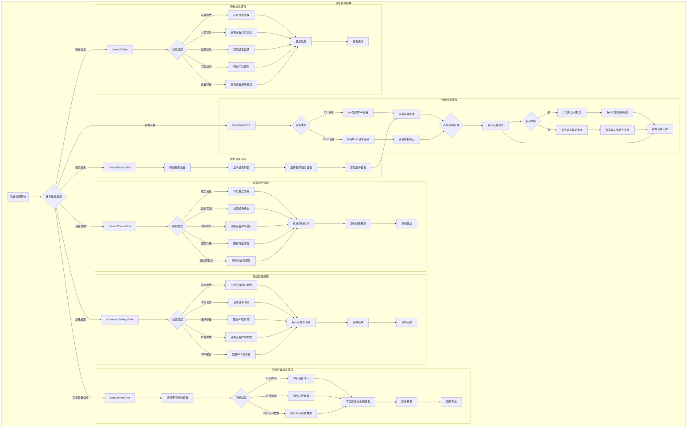
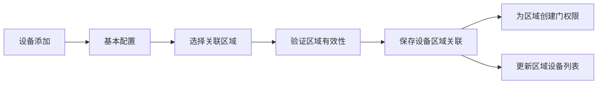

# ZKBioSecurity-ACC门禁系统 - 设备管理模块流程图

## 设备管理页面功能点

基于zkbiosecurity-acc-3.14.x-RELEASE项目的实际设备管理页面分析，主要功能按钮包括：

### 主要操作按钮
1. **刷新** - 重新加载设备列表
2. **新增设备** - 手动添加新设备（支持Pull和Push设备）
3. **删除设备** - 删除选中的设备
4. **导出** - 导出设备列表
5. **搜索设备** - 自动搜索网络内的门禁设备
6. **设备控制**（包含多个子功能）
   - 清除管理员
   - 清除命令缓存
   - 固件升级
   - 重启设备
   - 同步时间
   - 启用/禁用设备
   - 同步数据到设备
7. **高级设置**（包含多个子功能）
   - 下发验证参数
   - 设置时区
   - 设置登记机
   - 修改指纹阈值
   - 设置扩展参数
   - NTP服务器设置
   - 设备替换
   - 上传资源文件
   - 人脸比对服务器设置
8. **查看或获取信息**（包含多个子功能）
   - 获取设备参数
   - 获取人员信息
   - 获取记录
   - 查看门禁规则
   - 查看设备容量
9. **通信设置**（包含多个子功能）
   - 修改IP地址
   - 修改通讯密码
   - 修改网络连接方式

## 设备管理模块流程图



## 重要特性说明
## 📋 IOE-DREAM七微服务架构

**核心架构组成**:
- **Gateway Service (8080)**: API网关
- **Common Service (8088)**: 公共模块微服务
- **DeviceComm Service (8087)**: 设备通讯微服务
- **OA Service (8089)**: OA微服务
- **Access Service (8090)**: 门禁服务
- **Attendance Service (8091)**: 考勤服务
- **Video Service (8092)**: 视频服务
- **Consume Service (8094)**: 消费服务
- **Visitor Service (8095)**: 访客服务

**架构特点**:
- 基于Spring Boot 3.5.8 + Java 17
- 严格遵循企业级微服务规范
- 支持高并发、高可用、水平扩展

**技术栈标准**:
- **数据库**: MySQL 8.0 + Druid连接池
- **缓存**: Redis + Caffeine多级缓存
- **注册中心**: Nacos
- **配置中心**: Nacos Config
- **认证授权**: Sa-Token

## 🏗️ 四层架构规范

**标准架构模式**:
```
Controller (接口控制层)
    ↓
Service (核心业务层)
    ↓
Manager (流程管理层)
    ↓
DAO (数据访问层)
```

**层级职责**:
- **Controller层**: HTTP请求处理、参数验证、权限控制
- **Service层**: 核心业务逻辑、事务管理、业务规则验证
- **Manager层**: 复杂流程编排、多数据组装、第三方服务集成
- **DAO层**: 数据库CRUD操作、SQL查询实现、数据访问边界

**严格禁止跨层访问**: Controller不能直接调用Manager/DAO！
### 设备自动推送机制
## ⚠️ IOE-DREAM零容忍规则（强制执行）

**必须遵守的架构规则**:
- ✅ **必须使用 @Resource 注入依赖**
- ✅ **必须使用 @Mapper 注解** (禁止@Repository)
- ✅ **必须使用 Dao 后缀** (禁止Repository)
- ✅ **必须使用 @RestController 注解**
- ✅ **必须使用 @Valid 参数校验**
- ✅ **必须返回统一ResponseDTO格式**
- ✅ **必须遵循四层架构边界**

**严格禁止事项**:
- ❌ **禁止使用 @Autowired 注入**
- ❌ **禁止使用 @Repository 注解**
- ❌ **禁止使用 Repository 后缀命名**
- ❌ **禁止跨层访问**
- ❌ **禁止在Controller中包含业务逻辑**
- ❌ **禁止直接访问数据库**

**违规后果**: P0级问题，立即修复，禁止合并！
根据代码分析，设备添加后具有以下自动推送特性：

1. **设备自动推送门信息**：
   - 设备连接到系统后，会自动推送其包含的门信息
   - 系统接收门信息并自动保存到数据库
   - 无需手动创建门

2. **设备自动推送读头信息**：
   - 设备会推送门上面的读头信息
   - 系统自动建立读头与门的关联关系
   - 无需手动配置读头

3. **Push设备特性**：
   - 支持跨网段Push设备
   - 设备主动连接到服务器
   - 自动获取设备完整配置信息

### 设备通信类型
- **Pull设备**：系统主动连接设备，获取设备信息
- **Push设备**：设备主动连接系统，推送设备信息

### 设备搜索功能
- 支持自动网络搜索
- 通过MAC地址避免重复添加
- 显示设备IP、MAC地址、设备型号等信息

### 设备区域关联机制
- **设备添加时必须选择区域**：在设备基本配置后选择关联的区域ID
- **区域绑定验证**：验证选择的区域是否有效，设备只能关联一个区域
- **权限传递**：设备关联区域后，该区域的门和人员权限配置才能生效
- **区域变更**：支持修改设备关联的区域，变更时同步更新相关权限

## 设备区域关联流程



## 设备管理核心变更

### 新增设备流程调整
1. **设备基本配置** → **选择关联区域** → **保存设备信息**
2. 设备必须关联到具体区域才能完整使用
3. 区域关联在设备添加时完成，确保数据完整性

### 设备区域管理
1. **区域关联**：设备添加时选择所属区域
2. **区域变更**：支持修改设备的关联区域
3. **权限同步**：区域变更时自动同步门和人员权限
4. **设备列表**：可按区域筛选查看设备