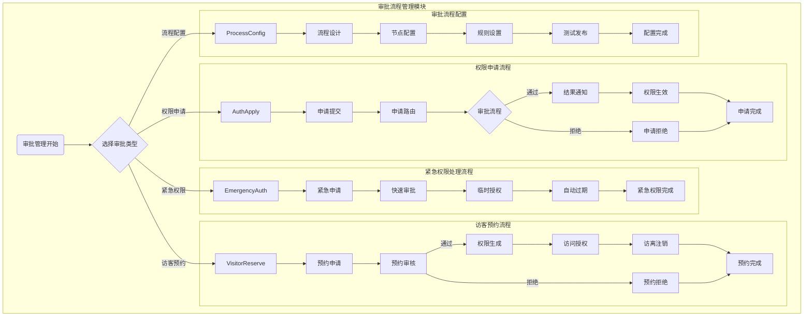

# ZKBioSecurity-ACC门禁系统 - 审批流程管理模块流程图

## 审批流程管理模块流程图



## 流程说明

### 权限申请流程
1. **申请提交**：用户提交权限申请，填写申请理由和所需权限
2. **申请路由**：系统根据申请内容自动路由到相应的审批人
3. **审批流程**：按预设流程进行多级审批
4. **结果通知**：审批完成后通知申请人结果
5. **权限生效**：审批通过后立即生效权限
6. **申请拒绝**：审批拒绝时记录拒绝理由

### 访客预约流程
1. **预约申请**：访客或被访人提交访问预约申请
2. **预约审核**：相关负责人审核访客预约申请
3. **权限生成**：审核通过后生成临时访问权限
4. **访问授权**：在指定时间范围内授权访客访问
5. **访离注销**：访客离开后自动注销访问权限

### 紧急权限处理流程
1. **紧急申请**：紧急情况下提交权限申请
2. **快速审批**：通过简化流程进行快速审批
3. **临时授权**：授予临时访问权限
4. **自动过期**：临时权限在指定时间后自动过期

### 审批流程配置流程
1. **流程设计**：设计新的审批流程
2. **节点配置**：配置审批节点和处理人
3. **规则设置**：设置审批规则和条件
4. **测试发布**：测试流程并正式发布

## 审批流程类型
## 📋 IOE-DREAM七微服务架构

**核心架构组成**:
- **Gateway Service (8080)**: API网关
- **Common Service (8088)**: 公共模块微服务
- **DeviceComm Service (8087)**: 设备通讯微服务
- **OA Service (8089)**: OA微服务
- **Access Service (8090)**: 门禁服务
- **Attendance Service (8091)**: 考勤服务
- **Video Service (8092)**: 视频服务
- **Consume Service (8094)**: 消费服务
- **Visitor Service (8095)**: 访客服务

**架构特点**:
- 基于Spring Boot 3.5.8 + Java 17
- 严格遵循企业级微服务规范
- 支持高并发、高可用、水平扩展

**技术栈标准**:
- **数据库**: MySQL 8.0 + Druid连接池
- **缓存**: Redis + Caffeine多级缓存
- **注册中心**: Nacos
- **配置中心**: Nacos Config
- **认证授权**: Sa-Token
1. **标准审批**：常规权限申请，需多级审批
## 🏗️ 四层架构规范

**标准架构模式**:
```
Controller (接口控制层)
    ↓
Service (核心业务层)
    ↓
Manager (流程管理层)
    ↓
DAO (数据访问层)
```

**层级职责**:
- **Controller层**: HTTP请求处理、参数验证、权限控制
- **Service层**: 核心业务逻辑、事务管理、业务规则验证
- **Manager层**: 复杂流程编排、多数据组装、第三方服务集成
- **DAO层**: 数据库CRUD操作、SQL查询实现、数据访问边界

**严格禁止跨层访问**: Controller不能直接调用Manager/DAO！
2. **快速审批**：简单权限申请，简化审批流程
## ⚠️ IOE-DREAM零容忍规则（强制执行）

**必须遵守的架构规则**:
- ✅ **必须使用 @Resource 注入依赖**
- ✅ **必须使用 @Mapper 注解** (禁止@Repository)
- ✅ **必须使用 Dao 后缀** (禁止Repository)
- ✅ **必须使用 @RestController 注解**
- ✅ **必须使用 @Valid 参数校验**
- ✅ **必须返回统一ResponseDTO格式**
- ✅ **必须遵循四层架构边界**

**严格禁止事项**:
- ❌ **禁止使用 @Autowired 注入**
- ❌ **禁止使用 @Repository 注解**
- ❌ **禁止使用 Repository 后缀命名**
- ❌ **禁止跨层访问**
- ❌ **禁止在Controller中包含业务逻辑**
- ❌ **禁止直接访问数据库**

**违规后果**: P0级问题，立即修复，禁止合并！
3. **紧急审批**：紧急情况下的审批流程
4. **自动审批**：符合条件的申请自动通过

## 审批节点类型
1. **串行审批**：按顺序逐级审批
2. **并行审批**：多个审批人同时审批
3. **会签审批**：所有审批人都需同意
4. **或签审批**：任意一个审批人同意即可

## 审批超时处理
- **提醒机制**：审批超时前提醒审批人
- **自动转交**：超时后自动转交给上级
- **自动通过**：简单申请超时后自动通过
- **升级处理**：重要申请超时后升级处理

## 关键控制点
- 审批流程必须完整记录每个环节
- 审批权限必须与岗位职能匹配
- 紧急审批需要事后补全审批流程
- 审批结果必须及时生效到相关系统
- 审批历史必须完整保存不可篡改

## 性能指标
- 审批提交响应时间：≤ 2秒
- 审批流程处理时间：≤ 24小时
- 紧急审批处理时间：≤ 30分钟
- 权限生效延迟：≤ 1分钟
- 审批通知发送延迟：≤ 30秒

## 注意事项
- 审批流程配置需要充分测试才能正式使用
- 访客权限需要严格控制访问时间和范围
- 紧急权限需要建立完善的事后审计机制
- 审批数据包含敏感信息，需要严格保护
- 审批系统需要支持移动端审批功能