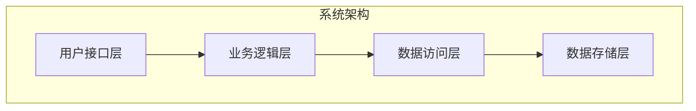
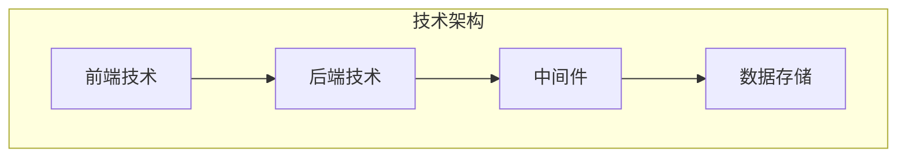
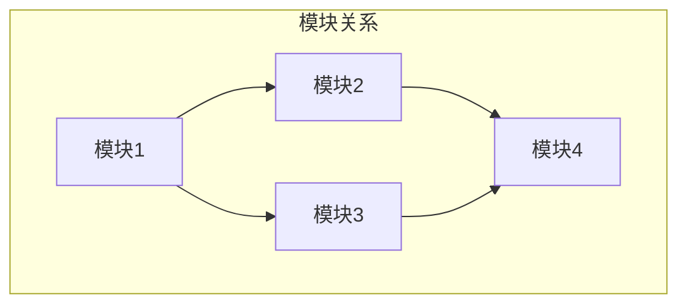
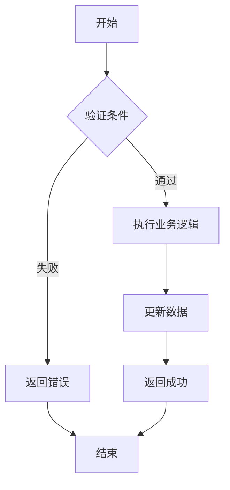

# 设计文档模板

**用途**: 标准的设计文档编写模板
**适用场景**: 系统设计、模块设计、功能设计等技术文档
**版本**: v2.0.0 (基于IOE-DREAM架构规范)

---

## 📋 模板结构

### 基础信息
```markdown
# {文档标题}

**文档类型**: 系统设计文档
**适用范围**: {适用模块或系统}
**文档版本**: v1.0.0
**创建时间**: {创建日期}
**维护团队**: {团队名称}
**审批状态**: {待审批/已审批/已驳回}

---

## 📋 文档概述

### 项目背景
{详细描述项目的背景、来源和目标}

### 设计目标
{明确的设计目标和预期效果}

### 适用范围
{明确文档适用的模块、版本或场景}

---

## 🏗️ 整体设计

### 架构设计
#### 系统架构图


#### 技术架构图


### 功能模块设计
#### 核心功能模块
| 模块名称 | 功能描述 | 优先级 | 状态 |
|---------|---------|--------|------|
| {模块1} | {功能描述1} | {优先级} | {状态} |
| {模块2} | {功能描述2} | {优先级} | {状态} |

#### 模块关系图


### 数据库设计
#### 核心数据表
| 表名 | 说明 | 字段数 | 索引数 | 状态 |
|------|------|--------|--------|------|
| {表1} | {表说明1} | {字段数} | {索引数} | {状态} |
| {表2} | {表说明2} | {字段数} | {索引数} | {状态} |

#### E-R图
```mermaid
erDiagram
    USER ||--o{ {ENTITY} : "拥有"
    USER {
        bigint id PK
        string name
        string email
        datetime create_time
    }
    {ENTITY} {
        bigint id PK
        string name
        int status
        datetime create_time
        bigint user_id FK
    }
```

---

## 🔧 详细设计

### 接口设计
#### RESTful API设计
| 请求方法 | 接口路径 | 说明 | 参数类型 | 返回类型 |
|---------|---------|------|---------|---------|
| GET | /api/v1/{module} | 查询列表 | QueryParam | ResponseDTO |
| GET | /api/v1/{module}/{id} | 查询详情 | PathParam | ResponseDTO |
| POST | /api/v1/{module} | 新增 | RequestBody | ResponseDTO |
| PUT | /api/v1/{module}/{id} | 更新 | RequestBody | ResponseDTO |
| DELETE | /api/v1/{module}/{id} | 删除 | PathParam | ResponseDTO |

#### 接口规范
```json
// 请求参数示例
{
  "name": "示例名称",
  "description": "示例描述",
  "status": 1
}

// 响应结果示例
{
  "code": 200,
  "message": "操作成功",
  "data": {
    "id": 1,
    "name": "示例名称",
    "description": "示例描述",
    "status": 1,
    "createTime": "2025-12-02T10:00:00"
  }
}
```

### 业务流程设计
#### 核心业务流程


### 安全设计
#### 权限控制
- **接口权限**: 使用Sa-Token进行接口级权限控制
- **数据权限**: 基于角色的数据访问权限控制
- **操作日志**: 关键操作记录审计日志

#### 安全措施
- **输入验证**: 所有输入参数进行严格验证
- **SQL注入防护**: 使用参数化查询
- **XSS防护**: 输出内容进行HTML转义
- **数据加密**: 敏感数据使用AES加密存储

---

## 🚀 实施计划

### 开发阶段
| 阶段 | 任务 | 负责人 | 预计工期 | 状态 |
|------|------|--------|----------|------|
| 需求分析 | 需求分析和确认 | {负责人} | {工期} | {状态} |
| 详细设计 | 技术方案设计 | {负责人} | {工期} | {状态} |
| 开发实现 | 代码开发和单元测试 | {负责人} | {工期} | {状态} |
| 集成测试 | 系统集成和测试 | {负责人} | {工期} | {状态} |
| 部署上线 | 生产环境部署 | {负责人} | {工期} | {状态} |

### 里程碑
- **M1**: 完成需求分析和初步设计 ({日期})
- **M2**: 完成详细设计和技术选型 ({日期})
- **M3**: 完成核心功能开发 ({日期})
- **M4**: 完成系统集成和测试 ({日期})
- **M5**: 完成生产环境部署 ({日期})

---

## 📊 测试策略

### 测试类型
#### 单元测试
- **覆盖率**: ≥ 80%
- **框架**: JUnit 5 + Mockito
- **重点**: 核心业务逻辑和数据访问

#### 集成测试
- **接口测试**: RESTful API测试
- **数据库测试**: 数据持久化测试
- **组件测试**: 组件间集成测试

#### 系统测试
- **功能测试**: 业务功能完整性测试
- **性能测试**: 并发和响应时间测试
- **安全测试**: 安全漏洞和权限测试

### 测试环境
| 环境 | 用途 | 配置 | 地址 |
|------|------|------|------|
| 开发环境 | 开发调试 | 2核4G | {地址} |
| 测试环境 | 集成测试 | 4核8G | {地址} |
| 预生产环境 | 上线前验证 | 8核16G | {地址} |
| 生产环境 | 正式运行 | {配置} | {地址} |

---

## 🔍 质量保障

### 代码质量
- **代码规范**: 遵循Java编码规范
- **代码审查**: 强制代码审查流程
- **静态分析**: SonarQube静态代码分析
- **单元测试**: 确保测试覆盖率

### 文档质量
- **完整性**: 文档内容完整准确
- **一致性**: 与实际实现保持一致
- **可读性**: 文档结构清晰易懂
- **及时性**: 及时更新文档内容

### 测试质量
- **用例覆盖**: 测试用例覆盖全面
- **自动化**: 关键测试自动化执行
- **回归测试**: 定期执行回归测试
- **性能测试**: 定期进行性能测试

---

## 📈 性能设计

### 性能指标
| 指标类型 | 目标值 | 测试方法 | 验证标准 |
|---------|--------|----------|----------|
| 响应时间 | ≤ 200ms | 压力测试 | 95%请求达标 |
| 并发能力 | ≥ 1000 TPS | 负载测试 | 系统稳定运行 |
| 可用性 | ≥ 99.9% | 故障测试 | 全年停机时间<8.76小时 |
| 数据一致性 | 100% | 一致性测试 | 无数据不一致问题 |

### 性能优化
- **数据库优化**: 索引优化、查询优化、连接池配置
- **缓存策略**: 多级缓存、缓存预热、缓存失效策略
- **异步处理**: 异步任务、消息队列、事件驱动
- **资源优化**: 连接池管理、内存优化、线程池配置

---

## 🚨 风险评估

### 技术风险
| 风险项 | 风险等级 | 影响 | 应对措施 | 负责人 |
|-------|---------|------|----------|--------|
| 数据库性能 | 中 | 响应时间慢 | 数据库优化 | {负责人} |
| 并发瓶颈 | 高 | 系统崩溃 | 异步处理 | {负责人} |
| 安全漏洞 | 高 | 数据泄露 | 安全加固 | {负责人} |

### 业务风险
| 风险项 | 风险等级 | 影响 | 应对措施 | 负责人 |
|-------|---------|------|----------|--------|
| 需求变更 | 中 | 开发延期 | 需求管理 | {负责人} |
| 集成困难 | 中 | 上线延期 | 提前验证 | {负责人} |
| 用户接受度 | 低 | 使用率低 | 用户培训 | {负责人} |

---

## 🔗 相关文档

### 设计文档
- [{关联文档1}]({关联文档1链接})
- [{关联文档2}]({关联文档2链接})

### 开发文档
- [全局架构规范](../../01-核心规范/架构规范/全局架构规范.md)
- [Java编码规范](../../01-核心规范/开发规范/Java编码规范.md)
- [API设计规范](../../01-核心规范/开发规范/API设计规范.md)

### 部署文档
- [部署指南](../../04-部署运维/部署指南.md)
- [运维手册](../../04-部署运维/运维手册/)

---

## 📞 联系方式

### 项目团队
- **项目负责人**: {姓名} - {邮箱} - {电话}
- **技术负责人**: {姓名} - {邮箱} - {电话}
- **测试负责人**: {姓名} - {邮箱} - {电话}

### 支持渠道
- **技术支持**: {支持渠道}
- **问题反馈**: {反馈渠道}
- **文档更新**: {更新渠道}

---

## 📝 版本历史

| 版本 | 更新日期 | 更新内容 | 更新人 |
|------|---------|----------|--------|
| v1.0.0 | {创建日期} | 初始版本 | {更新人} |

---

## 📋 审批记录

### 设计审批
| 审批环节 | 审批人 | 审批时间 | 审批意见 | 状态 |
|---------|--------|----------|----------|------|
| 技术评审 | {审批人} | {审批时间} | {意见} | {状态} |
| 产品评审 | {审批人} | {审批时间} | {意见} | {状态} |
| 管理审批 | {审批人} | {审批时间} | {意见} | {状态} |

---

**模板版本**: v2.0.0
**最后更新**: 2025-12-02
**维护团队**: IOE-DREAM架构委员会

**🎯 使用此模板可以确保设计文档的完整性和规范性！**
```

---

## 🎯 使用指南

### 1. 模板变量替换

**必需变量**:
- `{文档标题}`: 具体的设计文档标题
- `{适用模块或系统}`: 设计文档适用的范围
- `{创建日期}`: 文档创建日期
- `{团队名称}`: 负责团队名称

**可选变量**:
- `{模块1}`, `{模块2}`: 具体的功能模块
- `{表1}`, `{表2}`: 具体的数据表
- `{负责人}`: 具体的负责人信息
- `{地址}`: 具体的环境地址

### 2. 图表使用指南

**Mermaid图表类型**:
- `graph`: 架构图、关系图
- `flowchart`: 流程图、时序图
- `erDiagram`: 数据库ER图
- `gantt`: 甘特图、项目计划

**图表使用建议**:
- 保持图表简洁明了
- 使用统一的颜色和样式
- 添加必要的说明文字
- 确保图表与文字描述一致

### 3. 文档编写规范

**内容要求**:
- 内容真实准确，避免夸大其词
- 逻辑清晰，层次分明
- 重点突出，详略得当
- 语言简洁，易于理解

**格式要求**:
- 使用标准的Markdown格式
- 标题层级合理，不超过4级
- 代码块使用语言标识
- 表格格式统一规范

---

## 📚 最佳实践

### 1. 设计原则
- **单一职责**: 每个模块职责单一明确
- **开闭原则**: 对扩展开放，对修改关闭
- **依赖倒置**: 高层模块不依赖低层模块
- **接口隔离**: 使用小而专一的接口

### 2. 文档编写
- **面向读者**: 考虑文档的读者群体
- **版本管理**: 及时更新文档版本
- **图表配合**: 图文结合，便于理解
- **实例说明**: 使用具体示例说明

### 3. 质量保证
- **同行评审**: 组织设计文档评审
- **工具检查**: 使用文档检查工具
- **持续改进**: 根据反馈持续改进
- **知识沉淀**: 积累设计经验和最佳实践

---

## ⚠️ 注意事项

### 1. 避免的问题
- 避免过于理论化，缺乏实际可操作性
- 避免信息过时，保持文档时效性
- 避免层次混乱，保持逻辑清晰
- 避免遗漏关键信息，确保内容完整

### 2. 安全考虑
- 避免在文档中泄露敏感信息
- 避免提供过于详细的攻击向量
- 避免未经授权的文档分发
- 避免使用不安全的文档存储方式

---

**模板版本**: v2.0.0
**最后更新**: 2025-12-02
**维护团队**: IOE-DREAM架构委员会

**🎯 使用此模板可以编写出高质量的技术设计文档！**