# IOE-DREAM 开放平台API设计规范

**版本**: v1.0.0
**制定日期**: 2025-12-16
**适用范围**: IOE-DREAM智慧园区一卡通管理平台开放API
**设计原则**: RESTful、开放性、安全性、可扩展性

---

## 📋 API设计概览

### 🎯 设计目标

构建**企业级智慧园区开放平台API**，为第三方开发者、系统集成商、企业用户提供完整的园区管理服务接入能力，推动IOE-DREAM生态的开放和繁荣。

### 🏗️ API架构总览

```mermaid
graph TB
    subgraph "开放平台API层"
        OPEN_API[Open API Gateway]
        AUTH[OAuth2.0/OIDC]
        RATE_LIMIT[Rate Limiting]
        DOC[API Documentation]
    end

    subgraph "核心业务API"
        USER_API[用户与认证API]
        DEVICE_API[设备管理API]
        ACCESS_API[门禁管理API]
        ATTENDANCE_API[考勤管理API]
        CONSUME_API[消费管理API]
        VISITOR_API[访客管理API]
        VIDEO_API[视频监控API]
        WORKFLOW_API[工作流API]
        ANALYTICS_API[数据分析API]
    end

    subgraph "支撑服务API"
        NOTIFICATION[通知服务API]
        FILE_API[文件服务API]
        INTEGRATION[集成服务API]
        WEBHOOK[Webhook API]
    end

    OPEN_API --> AUTH
    OPEN_API --> RATE_LIMIT
    OPEN_API --> USER_API
    OPEN_API --> DEVICE_API
    OPEN_API --> ACCESS_API
    OPEN_API --> ATTENDANCE_API
    OPEN_API --> CONSUME_API
    OPEN_API --> VISITOR_API
    OPEN_API --> VIDEO_API
    OPEN_API --> WORKFLOW_API
    OPEN_API --> ANALYTICS_API
    OPEN_API --> NOTIFICATION
    OPEN_API --> FILE_API
    OPEN_API --> INTEGRATION
    OPEN_API --> WEBHOOK
```



---

## 🔐 API安全架构

### 1. 认证授权体系

#### 1.1 OAuth 2.0 + OpenID Connect
```yaml
# OAuth2配置
spring:
  security:
    oauth2:
      resourceserver:
        jwt:
          issuer-uri: https://api.ioe-dream.com/auth
          jwk-set-uri: https://api.ioe-dream.com/auth/.well-known/jwks.json
      authorizationserver:
        provider:
          oidc:
            issuer-uri: https://api.ioe-dream.com/auth
```

#### 1.2 API密钥管理
```java
// API密钥数据模型
@Data
@TableName("t_api_key")
public class ApiKeyEntity {
    private String apiKeyId;
    private String keyName;
    private String keyPrefix;
    private String keySecret;
    private String developerId;
    private String[] permissions;
    private Integer rateLimitPerMinute;
    private Integer rateLimitPerHour;
    private Integer rateLimitPerDay;
    private LocalDateTime expiresAt;
    private Boolean isActive;
    private String[] allowedIps;
    private String[] allowedDomains;
}

// API密钥生成服务
@Service
public class ApiKeyService {
    public ApiKeyCreationResult createApiKey(ApiKeyCreationRequest request) {
        // 生成安全的API密钥
        String keyPrefix = "IDR" + RandomStringUtils.randomAlphanumeric(4);
        String keySecret = generateSecureSecret();

        // 保存API密钥
        ApiKeyEntity apiKey = new ApiKeyEntity();
        apiKey.setKeyPrefix(keyPrefix);
        apiKey.setKeySecret(keySecret);
        apiKey.setDeveloperId(request.getDeveloperId());
        apiKey.setPermissions(request.getPermissions());
        apiKey.setRateLimitPerMinute(request.getRateLimitPerMinute());

        apiKeyRepository.insert(apiKey);

        return new ApiKeyCreationResult(
            keyPrefix + ":" + keySecret,
            apiKey.getApiKeyId()
        );
    }
}
```

### 2. 安全防护机制

#### 2.1 请求签名验证
```java
// 请求签名验证
@Component
@Slf4j
public class RequestSignatureFilter implements Filter {

    @Resource
    private ApiKeyService apiKeyService;

    @Override
    public void doFilter(ServletRequest request, ServletResponse response, FilterChain chain)
            throws IOException, ServletException {

        HttpServletRequest httpRequest = (HttpServletRequest) request;

        // 获取签名信息
        String apiKey = httpRequest.getHeader("X-API-Key");
        String timestamp = httpRequest.getHeader("X-Timestamp");
        String nonce = httpRequest.getHeader("X-Nonce");
        String signature = httpRequest.getHeader("X-Signature");

        // 验证API密钥
        if (!isValidApiKey(apiKey)) {
            sendErrorResponse(response, 401, "Invalid API Key");
            return;
        }

        // 验证时间戳（防重放攻击）
        if (!isValidTimestamp(timestamp)) {
            sendErrorResponse(response, 401, "Invalid timestamp");
            return;
        }

        // 验证签名
        if (!isValidSignature(httpRequest, signature)) {
            sendErrorResponse(response, 401, "Invalid signature");
            return;
        }

        chain.doFilter(request, response);
    }

    private boolean isValidSignature(HttpServletRequest request, String signature) {
        try {
            String method = request.getMethod();
            String uri = request.getRequestURI();
            String queryString = request.getQueryString();
            String body = getRequestBody(request);

            String stringToSign = method + "\n" + uri + "\n" +
                              (queryString != null ? queryString : "") + "\n" +
                              body;

            String expectedSignature = calculateSignature(stringToSign);

            return MessageDigest.isEqual(signature.getBytes(), expectedSignature.getBytes());
        } catch (Exception e) {
            log.error("Signature validation error", e);
            return false;
        }
    }
}
```

---

## 👤 用户与认证API

### 1. 用户管理API

#### 1.1 用户认证
```http
POST /api/v1/auth/login
Content-Type: application/json
X-API-Key: YOUR_API_KEY
```

**请求体**:
```json
{
  "username": "john.doe",
  "password": "password123",
  "clientType": "mobile",
  "deviceInfo": {
    "deviceId": "unique_device_id",
    "deviceName": "iPhone 14",
    "osVersion": "iOS 16.0"
  }
}
```

**响应体**:
```json
{
  "code": 200,
  "message": "Login successful",
  "data": {
    "accessToken": "eyJhbGciOiJIUzI1NiIsInR5cCI6IkpXVCJ9...",
    "refreshToken": "refresh_token_here",
    "tokenType": "Bearer",
    "expiresIn": 3600,
    "scope": "read write",
    "user": {
      "userId": "user123",
      "username": "john.doe",
      "displayName": "John Doe",
      "email": "john.doe@company.com",
      "phone": "+86-13800138000",
      "avatar": "https://api.ioe-dream.com/files/avatars/user123.jpg",
      "roles": ["EMPLOYEE", "DEVELOPER"],
      "departments": [
        {
          "departmentId": "dept001",
          "departmentName": "技术研发部"
        }
      ],
      "permissions": [
        "access:read",
        "attendance:read",
        "consume:read"
      ]
    }
  }
}
```

#### 1.2 用户信息管理
```http
GET /api/v1/users/profile
Authorization: Bearer ACCESS_TOKEN
X-API-Key: YOUR_API_KEY
```

**响应体**:
```json
{
  "code": 200,
  "message": "Success",
  "data": {
    "userId": "user123",
    "username": "john.doe",
    "displayName": "John Doe",
    "email": "john.doe@company.com",
    "phone": "+86-13800138000",
    "avatar": "https://api.ioe-dream.com/files/avatars/user123.jpg",
    "dateOfBirth": "1990-01-01",
    "joinDate": "2020-01-15",
    "status": "ACTIVE",
    "biometricData": {
      "faceId": "face_123",
      "fingerprintId": "fp_123",
      "palmPrintId": "palm_123"
    },
    "preferences": {
      "language": "zh-CN",
      "timezone": "Asia/Shanghai",
      "notification": {
        "email": true,
        "sms": false,
        "push": true
      }
    }
  }
}
```

#### 1.3 生物识别管理
```http
POST /api/v1/users/biometric/face/register
Authorization: Bearer ACCESS_TOKEN
X-API-Key: YOUR_API_KEY
Content-Type: multipart/form-data
```

**请求体**:
```
faceImage: [人脸图片文件]
faceQuality: 95
livenessCheck: true
```

**响应体**:
```json
{
  "code": 200,
  "message": "Face registration successful",
  "data": {
    "faceId": "face_123",
    "faceTemplate": "base64_face_template_data",
    "confidence": 98.5,
    "livenessScore": 95.0,
    "registrationTime": "2025-12-16T10:30:00Z"
  }
}
```

### 2. 多模态认证API

#### 2.1 组合认证
```http
POST /api/v1/auth/multi-factor
Authorization: Bearer ACCESS_TOKEN
X-API-Key: YOUR_API_KEY
```

**请求体**:
```json
{
  "authFactors": [
    {
      "type": "FACE",
      "data": "base64_face_image"
    },
    {
      "type": "FINGERPRINT",
      "data": "base64_fingerprint_data"
    },
    {
      "type": "PIN",
      "data": "encrypted_pin"
    }
  ],
  "requiredFactors": 2,
  "timeout": 30
}
```

**响应体**:
```json
{
  "code": 200,
  "message": "Multi-factor authentication successful",
  "data": {
    "authResult": "SUCCESS",
    "verifiedFactors": ["FACE", "FINGERPRINT"],
    "confidence": 99.2,
    "authToken": "mfa_auth_token_here",
    "sessionDuration": 7200
  }
}
```

---

## 🔌 设备管理API

### 1. 设备注册与管理

#### 1.1 设备注册
```http
POST /api/v1/devices/register
Authorization: Bearer ACCESS_TOKEN
X-API-Key: YOUR_API_KEY
```

**请求体**:
```json
{
  "deviceName": "主入口门禁控制器",
  "deviceType": "ACCESS_CONTROLLER",
  "deviceSubType": "BIOMETRIC_ACCESS_CONTROLLER",
  "vendor": "海康威视",
  "model": "DS-K2801",
  "serialNumber": "HK-2023-001234",
  "macAddress": "00:1A:2B:3C:4D:5E",
  "ipAddress": "192.168.1.100",
  "port": 80,
  "location": {
    "buildingId": "building001",
    "buildingName": "A栋",
    "floorId": "floor01",
    "floorName": "1楼",
    "areaId": "area001",
    "areaName": "大厅"
  },
  "configuration": {
    "protocol": "HIKVISION_VIDEO_V2_0",
    "username": "admin",
    "password": "encrypted_password",
    "timeout": 5000
  },
  "tags": ["main_entrance", "biometric", "high_security"]
}
```

**响应体**:
```json
{
  "code": 200,
  "message": "Device registered successfully",
  "data": {
    "deviceId": "device_123",
    "deviceStatus": "ONLINE",
    "configurationStatus": "APPLIED",
    "lastHeartbeat": "2025-12-16T10:35:00Z",
    "capabilities": [
      "FACE_RECOGNITION",
      "FINGERPRINT_RECOGNITION",
      "CARD_READING",
      "REMOTE_CONTROL"
    ]
  }
}
```

#### 1.2 设备状态监控
```http
GET /api/v1/devices/{deviceId}/status
Authorization: Bearer ACCESS_TOKEN
X-API-Key: YOUR_API_KEY
```

**响应体**:
```json
{
  "code": 200,
  "message": "Success",
  "data": {
    "deviceId": "device_123",
    "deviceName": "主入口门禁控制器",
    "deviceStatus": "ONLINE",
    "heartbeatInterval": 30,
    "lastHeartbeat": "2025-12-16T10:35:00Z",
    "uptime": 86400000,
    "metrics": {
      "cpuUsage": 15.2,
      "memoryUsage": 68.5,
      "diskUsage": 45.8,
      "temperature": 42.1,
      "networkLatency": 12
    },
    "alerts": [
      {
        "alertType": "HIGH_TEMPERATURE",
        "severity": "WARNING",
        "message": "设备温度过高",
        "timestamp": "2025-12-16T10:30:00Z"
      }
    ]
  }
}
```

### 2. 设备控制API

#### 2.1 远程设备控制
```http
POST /api/v1/devices/{deviceId}/control
Authorization: Bearer ACCESS_TOKEN
X-API-Key: YOUR_API_KEY
```

**请求体**:
```json
{
  "action": "OPEN_DOOR",
  "parameters": {
    "doorId": "door_001",
    "duration": 3000,
    "verifyIdentity": true,
    "recordEvent": true
  },
  "options": {
    "timeout": 10000,
    "retryCount": 3
  }
}
```

**响应体**:
```json
{
  "code": 200,
  "message": "Command executed successfully",
  "data": {
    "commandId": "cmd_456",
    "commandStatus": "EXECUTED",
    "executionTime": 1250,
    "result": {
      "action": "OPEN_DOOR",
      "success": true,
      "doorId": "door_001",
      "doorStatus": "OPENED",
      "openTime": "2025-12-16T10:36:00Z",
      "autoCloseTime": "2025-12-16T10:36:03Z"
    }
  }
}
```

---

## 🚪 门禁管理API

### 1. 门禁控制API

#### 1.1 实时门禁控制
```http
POST /api/v1/access/control
Authorization: Bearer ACCESS_TOKEN
X-API-Key: YOUR_API_KEY
```

**请求体**:
```json
{
  "deviceId": "device_123",
  "accessPointId": "door_001",
  "action": "OPEN",
  "verificationMethod": "MULTI_FACTOR",
  "verificationData": {
    "cardId": "card_456",
    "pin": "encrypted_pin",
    "biometricId": "face_789",
    "biometricType": "FACE"
  },
  "accessRules": {
    "timeRestriction": {
      "allowedFrom": "08:00",
      "allowedTo": "18:00",
      "allowedDays": ["MONDAY", "TUESDAY", "WEDNESDAY", "THURSDAY", "FRIDAY"]
    },
    "antiPassback": true,
    "duressCode": "123456"
  }
}
```

**响应体**:
```json
{
  "code": 200,
  "message": "Access control successful",
  "data": {
    "accessId": "access_123",
    "accessResult": "GRANTED",
    "accessTime": "2025-12-16T10:37:00Z",
    "accessPoint": {
      "deviceId": "device_123",
      "accessPointId": "door_001",
      "accessPointName": "主入口"
    },
    "user": {
      "userId": "user_123",
      "username": "john.doe",
      "displayName": "John Doe"
    },
    "verificationResult": {
      "cardVerified": true,
      "biometricVerified": true,
      "overallConfidence": 99.5
    },
    "accessDuration": 5000,
    "autoLockTime": "2025-12-16T10:37:05Z"
  }
}
```

### 2. 门禁记录API

#### 2.1 通行记录查询
```http
GET /api/v1/access/records
Authorization: Bearer ACCESS_TOKEN
X-API-Key: YOUR_API_KEY
```

**查询参数**:
- `deviceId`: 设备ID
- `userId`: 用户ID
- `startTime`: 开始时间
- `endTime`: 结束时间
- `accessResult`: 通行结果 (GRANTED/DENIED)
- `page`: 页码
- `size`: 每页大小

**响应体**:
```json
{
  "code": 200,
  "message": "Success",
  "data": {
    "records": [
      {
        "accessId": "access_123",
        "deviceId": "device_123",
        "deviceName": "主入口门禁控制器",
        "accessPointId": "door_001",
        "accessPointName": "主入口",
        "userId": "user_123",
        "username": "john.doe",
        "displayName": "John Doe",
        "accessTime": "2025-12-16T09:00:00Z",
        "accessResult": "GRANTED",
        "verificationMethod": "FACE",
        "cardId": "card_456",
        "direction": "IN",
        "location": {
          "buildingName": "A栋",
          "floorName": "1楼",
          "areaName": "大厅"
        },
        "eventData": {
          "confidence": 98.5,
          "livenessScore": 95.0,
          "antiPassback": true
        }
      }
    ],
    "pagination": {
      "page": 1,
      "size": 20,
      "total": 1250,
      "totalPages": 63
    }
  }
}
```

### 3. 高级功能API

#### 3.1 反潜回控制
```http
POST /api/v1/access/anti-passback/configure
Authorization: Bearer ACCESS_TOKEN
X-API-Key: YOUR_API_KEY
```

**请求体**:
```json
{
  "antiPassbackConfig": {
    "enabled": true,
    "mode": "AREA_BASED",
    "timeWindow": 120,
    "maxPasses": 2,
    "exclusions": [
      {
        "userId": "admin_user",
        "exclusionType": "FULL_EXEMPTION"
      }
    ],
    "areas": [
      {
        "areaId": "area_001",
        "areaName": "A栋1楼",
        "maxSimultaneousUsers": 10
      }
    ]
  }
}
```

#### 3.2 胁迫码处理
```http
POST /api/v1/access/duress/handle
Authorization: Bearer ACCESS_TOKEN
X-API-Key: YOUR_API_KEY
```

**请求体**:
```json
{
  "duressCode": "123456",
  "deviceId": "device_123",
  "accessPointId": "door_001",
  "silentAlarm": true,
  "notificationTargets": [
    {
      "type": "SECURITY_OFFICER",
      "contact": "+86-13800138001"
    },
    {
      "type": "MANAGER",
      "contact": "manager@company.com"
    }
  ],
  "actions": [
    "SILENT_ALARM",
    "RECORD_VIDEO",
    "NOTIFY_AUTHORITIES"
  ]
}
```

---

## ⏰ 考勤管理API

### 1. 考勤打卡API

#### 1.1 多模式考勤打卡
```http
POST /api/v1/attendance/clock
Authorization: Bearer ACCESS_TOKEN
X-API-Key: YOUR_API_KEY
```

**请求体**:
```json
{
  "userId": "user_123",
  "clockType": "IN",
  "verificationMethod": "BIOMETRIC",
  "verificationData": {
    "faceImage": "base64_face_image",
    "fingerprintData": "base64_fingerprint_data",
    "locationData": {
      "latitude": 39.9042,
      "longitude": 116.4074,
      "accuracy": 5.0
    }
  },
  "workLocation": {
    "locationId": "location_001",
    "locationName": "公司总部",
    "deviceId": "attendance_device_001",
    "deviceName": "考勤机-1楼"
  },
  "workShiftId": "shift_001",
  "allowLate": true,
  "allowEarlyLeave": false
}
```

**响应体**:
```json
{
  "code": 200,
  "message": "Clock in successful",
  "data": {
    "attendanceId": "attendance_123",
    "userId": "user_123",
    "username": "john.doe",
    "clockType": "IN",
    "clockTime": "2025-12-16T09:00:00Z",
    "workShift": {
      "shiftId": "shift_001",
      "shiftName": "正常班",
      "scheduledStartTime": "09:00",
      "scheduledEndTime": "18:00"
    },
    "attendanceStatus": "NORMAL",
    "lateMinutes": 0,
    "earlyLeaveMinutes": 0,
    "overtimeMinutes": 0,
    "verificationResult": {
      "faceVerified": true,
      "fingerprintVerified": false,
      "locationVerified": true,
      "overallScore": 99.2
    },
    "todayStats": {
      "clockInTime": "2025-12-16T09:00:00Z",
      "totalWorkHours": 0,
      "overtimeHours": 0,
      "attendanceDays": 1
    }
  }
}
```

### 2. 班次管理API

#### 2.1 班次配置
```http
POST /api/v1/attendance/shifts
Authorization: Bearer ACCESS_TOKEN
X-API-Key: YOUR_API_KEY
```

**请求体**:
```json
{
  "shiftName": "弹性工作时间",
  "shiftType": "FLEXIBLE",
  "workDays": ["MONDAY", "TUESDAY", "WEDNESDAY", "THURSDAY", "FRIDAY"],
  "coreWorkHours": {
    "requiredHours": 8,
    "startTime": "10:00",
    "endTime": "16:00"
  },
  "flexibleWorkHours": {
    "earliestStartTime": "08:00",
    "latestEndTime": "20:00",
    "flexibleHours": 2
  },
  "breakTime": {
    "duration": 60,
    "required": false
  },
  "overtimeRules": {
    "workdayOvertime": {
      "enabled": true,
      "startAfter": 8,
      "rate": 1.5
    },
    "weekendOvertime": {
      "enabled": true,
      "rate": 2.0
    },
    "holidayOvertime": {
      "enabled": true,
      "rate": 3.0
    }
  },
  "latePolicy": {
    "gracePeriod": 10,
    "lateThreshold": 30,
    "deductionType": "MINUTES"
  }
}
```

### 3. 请假管理API

#### 3.1 请假申请
```http
POST /api/v1/attendance/leave/apply
Authorization: Bearer ACCESS_TOKEN
X-API-Key: YOUR_API_KEY
```

**请求体**:
```json
{
  "userId": "user_123",
  "leaveType": "ANNUAL",
  "startDate": "2025-12-20",
  "endDate": "2025-12-25",
  "leaveDays": 5,
  "reason": "家庭旅行",
  "attachments": [
    {
      "fileId": "file_123",
      "fileName": "请假申请表.pdf",
      "fileUrl": "https://api.ioe-dream.com/files/file_123"
    }
  ],
  "approverIds": ["manager_001", "hr_001"],
  "workflowConfig": {
    "approvalType": "SEQUENTIAL",
    "autoApprove": false
  }
}
```

**响应体**:
```json
{
  "code": 200,
  "message": "Leave application submitted successfully",
  "data": {
    "leaveId": "leave_123",
    "applicationNumber": "LA-2025-001234",
    "status": "PENDING_APPROVAL",
    "workflow": {
      "currentStep": "MANAGER_APPROVAL",
      "nextStep": "HR_APPROVAL",
      "steps": [
        {
          "stepName": "MANAGER_APPROVAL",
          "approverName": "张经理",
          "status": "PENDING",
          "dueDate": "2025-12-17T18:00:00Z"
        },
        {
          "stepName": "HR_APPROVAL",
          "approverName": "HR部门",
          "status": "WAITING",
          "dueDate": "2025-12-19T18:00:00Z"
        }
      ]
    }
  }
}
```

---

## 💳 消费管理API

### 1. 消费交易API

#### 1.1 多方式支付
```http
POST /api/v1/consume/payment
Authorization: Bearer ACCESS_TOKEN
X-API-Key: YOUR_API_KEY
```

**请求体**:
```json
{
  "userId": "user_123",
  "paymentMethod": "FACE_RECOGNITION",
  "amount": 25.50,
  "currency": "CNY",
  "transactionType": "MEAL",
  "merchantId": "merchant_001",
  "merchantName": "员工餐厅",
  "posId": "pos_001",
  "posName": "1号结算台",
  "items": [
    {
      "itemId": "item_001",
      "itemName": "午餐套餐",
      "quantity": 1,
      "unitPrice": 25.50,
      "subtotal": 25.50
    }
  ],
  "verificationData": {
    "faceImage": "base64_face_image",
    "confidence": 98.5
  },
  "discounts": [
    {
      "type": "EMPLOYEE_SUBSIDY",
      "amount": 5.00,
      "description": "员工餐补"
    }
  ]
}
```

**响应体**:
```json
{
  "code": 200,
  "message": "Payment successful",
  "data": {
    "transactionId": "txn_123",
    "paymentId": "payment_456",
    "amount": 20.50,
    "originalAmount": 25.50,
    "discountAmount": 5.00,
    "paymentMethod": "FACE_RECOGNITION",
    "paymentStatus": "COMPLETED",
    "paymentTime": "2025-12-16T12:30:00Z",
    "account": {
      "userId": "user_123",
      "accountType": "EMPLOYEE_CARD",
      "balance": 875.50,
      "cardId": "card_789"
    },
    "receipt": {
      "receiptId": "receipt_123",
      "receiptUrl": "https://api.ioe-dream.com/receipts/receipt_123.pdf"
    }
  }
}
```

### 2. 账户管理API

#### 2.1 账户余额查询
```http
GET /api/v1/consume/accounts/{userId}/balance
Authorization: Bearer ACCESS_TOKEN
X-API-Key: YOUR_API_KEY
```

**响应体**:
```json
{
  "code": 200,
  "message": "Success",
  "data": {
    "userId": "user_123",
    "accounts": [
      {
        "accountId": "acc_123",
        "accountType": "EMPLOYEE_CARD",
        "accountName": "员工卡",
        "cardNumber": "6225880123456789",
        "balance": 875.50,
        "availableBalance": 850.50,
        "frozenAmount": 25.00,
        "currency": "CNY",
        "status": "ACTIVE",
        "lastTransactionTime": "2025-12-16T12:30:00Z"
      },
      {
        "accountId": "acc_456",
        "accountType": "MOBILE_WALLET",
        "accountName": "移动钱包",
        "balance": 320.00,
        "availableBalance": 320.00,
        "frozenAmount": 0.00,
        "currency": "CNY",
        "status": "ACTIVE",
        "lastTransactionTime": "2025-12-16T11:15:00Z"
      }
    ],
    "totalBalance": 1195.50,
    "availableBalance": 1170.50
  }
}
```

#### 2.2 账户充值
```http
POST /api/v1/consume/accounts/{accountId}/recharge
Authorization: Bearer ACCESS_TOKEN
X-API-Key: YOUR_API_KEY
```

**请求体**:
```json
{
  "rechargeAmount": 500.00,
  "rechargeMethod": "ALIPAY",
  "paymentInfo": {
    "tradeNo": "ALIPAY_" + Date.now(),
    "subject": "账户充值",
    "description": "员工卡充值500元"
  },
  "callbackUrl": "https://partner.app.com/callback/recharge"
}
```

---

## 👥 访客管理API

### 1. 访客预约API

#### 1.1 访客预约
```http
POST /api/v1/visitor/appointment/apply
Authorization: Bearer ACCESS_TOKEN
X-API-Key: YOUR_API_KEY
```

**请求体**:
```json
{
  "visitorInfo": {
    "name": "张三",
    "company": "ABC科技有限公司",
    "position": "技术总监",
    "phone": "+86-13800138000",
    "email": "zhangsan@abc.com",
    "idCard": "110101199001011234",
    "idCardType": "ID_CARD"
  },
  "appointmentInfo": {
    "visitDate": "2025-12-20",
    "visitStartTime": "14:00",
    "visitEndTime": "17:00",
    "visitDuration": 180,
    "purpose": "商务洽谈",
    "hostId": "host_123",
    "hostName": "李经理",
    "hostPhone": "+86-13800138001",
    "hostDepartment": "技术研发部"
  },
  "accessControl": {
    "accessAreas": ["area_001", "area_002"],
    "accessLevels": ["LEVEL_1", "LEVEL_2"],
    "accessPeriod": {
      "startTime": "2025-12-20T13:45:00Z",
      "endTime": "2025-12-20T17:15:00Z"
    }
  },
  "securityCheck": {
    "requireBackgroundCheck": true,
    "blacklistCheck": true,
    "identityVerification": true
  }
}
```

**响应体**:
```json
{
  "code": 200,
  "message": "Appointment submitted successfully",
  "data": {
    "appointmentId": "appointment_123",
    "appointmentNumber": "VA-2025-001234",
    "status": "PENDING_APPROVAL",
    "qrCode": "data:image/png;base64,iVBORw0KGgoAAAANSUhEUgAA...",
    "qrCodeUrl": "https://api.ioe-dream.com/qr-codes/appointment_123.png",
    "estimatedApprovalTime": "2025-12-17T18:00:00Z",
    "workflow": {
      "currentStep": "HOST_APPROVAL",
      "nextStep": "SECURITY_APPROVAL",
      "steps": [
        {
          "stepName": "HOST_APPROVAL",
          "approverName": "李经理",
          "status": "PENDING",
          "dueDate": "2025-12-17T10:00:00Z"
        },
        {
          "stepName": "SECURITY_APPROVAL",
          "approverName": "安保部",
          "status": "WAITING",
          "dueDate": "2025-12-17T15:00:00Z"
        }
      ]
    }
  }
}
```

### 2. 访客登记API

#### 2.1 访客签到
```http
POST /api/v1/visitor/check-in
Authorization: Bearer ACCESS_TOKEN
X-API-Key: YOUR_API_KEY
```

**请求体**:
```json
{
  "appointmentId": "appointment_123",
  "checkInMethod": "QR_CODE",
  "verificationData": {
    "qrCode": "qr_data_here",
    "faceImage": "base64_face_image",
    "idCardImage": "base64_idcard_image"
  },
  "accessPoint": {
    "accessPointId": "entrance_001",
    "accessPointName": "主入口",
    "deviceId": "device_123"
  }
}
```

**响应体**:
```json
{
  "code": 200,
  "message": "Check-in successful",
  "data": {
    "visitId": "visit_123",
    "checkInTime": "2025-12-16T14:05:00Z",
    "checkInMethod": "QR_CODE",
    "accessGranted": true,
    "accessLevel": "TEMPORARY",
    "validUntil": "2025-12-16T17:00:00Z",
    "accessAreas": [
      {
        "areaId": "area_001",
        "areaName": "技术部办公区",
        "accessTime": "2025-12-16T14:05:00Z"
      }
    ],
    "escortRequired": false,
    "temporaryCard": {
      "cardId": "temp_card_123",
      "cardNumber": "TMP20251220001",
      "validUntil": "2025-12-16T17:00:00Z"
    },
    "hostNotification": {
      "sent": true,
      "sentTime": "2025-12-16T14:05:30Z"
    }
  }
}
```

---

## 📹 视频监控API

### 1. 视频流管理API

#### 1.1 实时视频流
```http
GET /api/v1/video/{deviceId}/stream
Authorization: Bearer ACCESS_TOKEN
X-API-Key: YOUR_API_KEY
Accept: video/mp4
```

**请求参数**:
- `streamType`: live, playback, snapshot
- `quality`: high, medium, low
- `channel`: main, sub1, sub2

**响应**:
```http
HTTP/1.1 200 OK
Content-Type: video/mp4
Content-Length: 1234567

[Video stream data...]
```

#### 1.2 视频播放控制
```http
POST /api/v1/video/{deviceId}/playback
Authorization: Bearer ACCESS_TOKEN
X-API-Key: YOUR_API_KEY
```

**请求体**:
```json
{
  "startTime": "2025-12-16T10:00:00Z",
  "endTime": "2025-12-16T10:05:00Z",
  "playbackSpeed": 1.0,
  "quality": "high",
  "audioEnabled": true,
  "downloadEnabled": false
}
```

**响应体**:
```json
{
  "code": 200,
  "message": "Playback started",
  "data": {
    "playbackId": "playback_123",
    "streamUrl": "wss://api.ioe-dream.com/video/stream/playback_123",
    "duration": 300,
    "startTime": "2025-12-16T10:00:00Z",
    "endTime": "2025-12-16T10:05:00Z",
    "fileSize": 52428800,
    "format": "MP4",
    "resolution": "1920x1080",
    "frameRate": 25
  }
}
```

### 2. AI视频分析API

#### 2.1 人脸识别
```http
POST /api/v1/video/ai/face-detect
Authorization: Bearer ACCESS_TOKEN
X-API-Key: YOUR_API_KEY
```

**请求体**:
```json
{
  "deviceId": "camera_001",
  "imageData": "base64_image_data",
  "detectionConfig": {
    "faceCount": 10,
    "confidenceThreshold": 0.85,
    "includeEmotions": true,
    "includeAge": true,
    "includeGender": true
  },
  "timeWindow": {
    "startTime": "2025-12-16T10:00:00Z",
    "endTime": "2025-12-16T10:05:00Z"
  }
}
```

**响应体**:
```json
{
  "code": 200,
  "message": "Face detection completed",
  "data": {
    "detectionId": "detect_123",
    "faces": [
      {
        "faceId": "face_123",
        "confidence": 0.95,
        "boundingBox": {
          "x": 100,
          "y": 100,
          "width": 200,
          "height": 250
        },
        "landmarks": {
          "leftEye": [120, 150],
          "rightEye": [180, 150],
          "nose": [150, 200],
          "mouth": [140, 240]
        },
        "attributes": {
          "age": 32,
          "gender": "MALE",
          "emotion": "NEUTRAL",
          "ethnicity": "ASIAN"
        }
      }
    ],
    "statistics": {
      "totalFaces": 1,
      "averageConfidence": 0.95,
      "detectionTime": 150
    }
  }
}
```

#### 2.2 行为分析
```http
POST /api/v1/video/ai/behavior-analysis
Authorization: Bearer ACCESS_TOKEN
X-API-Key: YOUR_API_KEY
```

**请求体**:
```json
{
  "deviceId": "camera_001",
  "analysisType": "CROWD_DENSITY",
  "timeWindow": {
    "startTime": "2025-12-16T10:00:00Z",
    "endTime": "2025-12-16T10:05:00Z"
  },
  "regions": [
    {
      "regionId": "region_001",
      "regionName": "大厅入口",
      "boundingBox": {
        "x": 100,
        "y": 100,
        "width": 400,
        "height": 300
      }
    }
  ],
  "sensitivityLevel": "MEDIUM",
  "alertThreshold": 10
}
```

---

## 📊 数据分析API

### 1. 统计分析API

#### 1.1 综合统计
```http
GET /api/v1/analytics/dashboard
Authorization: Bearer ACCESS_TOKEN
X-API-Key: YOUR_API_KEY
```

**查询参数**:
- `dateRange`: 日期范围 (TODAY, WEEK, MONTH, QUARTER, YEAR)
- `dataType`: 统计类型 (USERS, DEVICES, TRANSACTIONS, ALARMS)

**响应体**:
```json
{
  "code": 200,
  "message": "Success",
  "data": {
    "userStatistics": {
      "totalUsers": 1250,
      "activeUsers": 980,
      "newUsersToday": 15,
      "newUsersThisWeek": 85,
      "userGrowthRate": 6.8
    },
    "deviceStatistics": {
      "totalDevices": 450,
      "onlineDevices": 425,
      "offlineDevices": 25,
      "deviceUptime": 99.5
    },
    "transactionStatistics": {
      "totalTransactions": 15680,
      "transactionsToday": 1250,
      "averageDailyTransactions": 1250,
      "transactionAmount": {
        "today": 31500.00,
        "thisWeek": 210500.00,
        "thisMonth": 845000.00
      }
    },
    "securityStatistics": {
      "totalAlerts": 125,
      "highSeverityAlerts": 8,
      "resolvedAlerts": 115,
      "averageResponseTime": 180
    }
  }
}
```

### 2. 自定义报表API

#### 2.1 报表生成
```http
POST /api/v1/analytics/reports/generate
Authorization: Bearer ACCESS_TOKEN
X-API-Key: YOUR_API_KEY
```

**请求体**:
```json
{
  "reportName": "月度考勤统计报表",
  "reportType": "ATTENDANCE_MONTHLY",
  "dataSource": ["ATTENDANCE_RECORDS", "USER_PROFILES", "DEPARTMENT_DATA"],
  "filters": {
    "dateRange": {
      "startDate": "2025-12-01",
      "endDate": "2025-12-31"
    },
    "departments": ["dept_001", "dept_002"],
    "userIds": ["user_123", "user_456"]
  },
  "metrics": [
    {
      "name": "averageWorkHours",
      "type": "AVERAGE",
      "field": "workHours"
    },
    {
      "name": "attendanceRate",
      "type": "PERCENTAGE",
      "field": "attendanceDays / workdays"
    },
    {
      "name": "lateCount",
      "type": "COUNT",
      "field": "lateCount"
    }
  ],
  "format": {
    "type": "EXCEL",
    "template": "MONTHLY_ATTENDANCE_TEMPLATE",
    "includeCharts": true,
    "chartTypes": ["BAR", "PIE", "LINE"]
  },
  "delivery": {
    "type": "EMAIL",
    "recipients": ["manager@company.com"],
    "schedule": {
      "type": "MONTHLY",
      "dayOfMonth": 1,
      "time": "09:00"
    }
  }
}
```

---

## 🔄 Webhook API

### 1. Webhook配置

#### 1.1 Webhook注册
```http
POST /api/v1/webhooks/register
Authorization: Bearer ACCESS_TOKEN
X-API-Key: YOUR_API_KEY
```

**请求体**:
```json
{
  "webhookName": "门禁事件通知",
  "webhookUrl": "https://partner.app.com/webhooks/access-events",
  "eventTypes": [
    "ACCESS_GRANTED",
    "ACCESS_DENIED",
    "DEVICE_OFFLINE",
    "ALARM_TRIGGERED"
  ],
  "authentication": {
    "type": "HMAC",
    "secret": "webhook_secret_123",
    "headerName": "X-Signature"
  },
  "retryPolicy": {
    "maxRetries": 3,
    "retryDelay": 1000,
    "backoffMultiplier": 2
  },
  "filters": {
    "deviceIds": ["device_123", "device_456"],
    "userId": "user_123",
    "minSeverity": "MEDIUM"
  }
}
```

### 2. Webhook事件

#### 2.1 事件推送
```http
POST https://partner.app.com/webhooks/access-events
Content-Type: application/json
X-Signature: hmac_signature_here
```

**请求体**:
```json
{
  "eventId": "event_123",
  "eventType": "ACCESS_GRANTED",
  "eventTime": "2025-12-16T10:37:00Z",
  "eventVersion": "1.0",
  "source": "ioe-dream-api",
  "data": {
    "accessId": "access_123",
    "userId": "user_123",
    "deviceId": "device_123",
    "accessPointId": "door_001",
    "accessTime": "2025-12-16T10:37:00Z",
    "verificationMethod": "FACE_RECOGNITION",
    "confidence": 99.2,
    "location": {
      "buildingName": "A栋",
      "floorName": "1楼",
      "areaName": "大厅"
    }
  }
}
```

---

## 📝 API文档与SDK

### 1. 交互式API文档

#### 1.1 OpenAPI规范
```yaml
# openapi.yaml
openapi: 3.0.3
info:
  title: IOE-DREAM Open API
  description: IOE-DREAM智慧园区一卡通管理平台开放API
  version: 1.0.0
  contact:
    name: API Support
    email: api-support@ioe-dream.com
    url: https://ioe-dream.com/support
  license:
    name: MIT License
    url: https://opensource.org/licenses/MIT

servers:
  - url: https://api.ioe-dream.com/v1
    description: Production server
  - url: https://staging-api.ioe-dream.com/v1
    description: Staging server
  - url: https://api.ioe-dream.com/v1
    description: Development server

paths:
  /auth/login:
    post:
      tags:
        - Authentication
      summary: User login
      description: Authenticate user with credentials and return access token
      requestBody:
        required: true
        content:
          application/json:
              schema:
                $ref: '#/components/schemas/LoginRequest'
      responses:
        '200':
          description: Login successful
          content:
            application/json:
                schema:
                  $ref: '#/components/schemas/LoginResponse'
        '401':
          description: Authentication failed
          content:
            application/json:
                schema:
                  $ref: '#/components/schemas/ErrorResponse'
```

### 2. SDK生成

#### 2.1 Java SDK示例
```java
// Java SDK 使用示例
public class IoeDreamClient {
    private String apiKey;
    private String baseUrl;
    private HttpClient httpClient;

    public IoeDreamClient(String apiKey, String baseUrl) {
        this.apiKey = apiKey;
        this.baseUrl = baseUrl;
        this.httpClient = HttpClient.newHttpClient();
    }

    public LoginResponse login(LoginRequest request) {
        try {
            String json = JsonUtils.toJson(request);
            HttpRequest httpRequest = HttpRequest.newBuilder()
                    .uri(URI.create(baseUrl + "/auth/login"))
                    .header("Content-Type", "application/json")
                    .header("X-API-Key", apiKey)
                    .POST(HttpRequest.BodyPublishers.ofString(json))
                    .build();

            HttpResponse<String> response = httpClient.send(httpRequest);

            if (response.statusCode() == 200) {
                return JsonUtils.fromJson(response.body(), LoginResponse.class);
            } else {
                throw new ApiException("Login failed: " + response.statusCode());
            }
        } catch (Exception e) {
            throw new RuntimeException("Login error", e);
        }
    }
}

// 使用示例
IoeDreamClient client = new IoeDreamClient("YOUR_API_KEY", "https://api.ioe-dream.com/v1");

LoginRequest loginRequest = new LoginRequest();
loginRequest.setUsername("john.doe");
loginRequest.setPassword("password123");

LoginResponse response = client.login(loginRequest);
String accessToken = response.getAccessToken();
```

---

## 📊 API性能与监控

### 1. 性能优化

#### 1.1 缓存策略
```java
// API响应缓存配置
@Configuration
public class ApiCacheConfiguration {

    @Bean
    @Cacheable(value = "user-profile", key = "#userId")
    public UserVO getUserProfile(String userId) {
        return userService.getUserProfile(userId);
    }

    @Bean
    public CacheManager cacheManager() {
        return new CaffeineCacheManagerBuilder()
                .maximumSize(10000)
                .expireAfterWrite(Duration.ofMinutes(10))
                .recordStats()
                .build();
    }
}
```

#### 1.2 异步处理
```java
// 异步API处理
@RestController
public class AsyncApiController {

    @Resource
    private AsyncTaskService asyncTaskService;

    @PostMapping("/async/process")
    public CompletableFuture<ResponseDTO<String>> processAsync(@RequestBody ProcessRequest request) {
        return CompletableFuture.supplyAsync(() -> {
            return asyncTaskService.processTask(request);
        }).thenApply(result -> {
            // 记录处理结果
            logger.info("Async task processed successfully: {}", result);
            return result;
        });
    }
}
```

### 2. 监控告警

#### 2.1 API指标监控
```java
// API指标收集
@Component
public class ApiMetricsCollector {

    private final MeterRegistry meterRegistry;
    private final Counter requestCounter;
    private final Timer responseTimer;
    private final Gauge activeConnections;

    public ApiMetricsCollector(MeterRegistry meterRegistry) {
        this.meterRegistry = meterRegistry;

        this.requestCounter = Counter.builder("api.requests.total")
                .description("Total number of API requests")
                .register(meterRegistry);

        this.responseTimer = Timer.builder("api.response.time")
                .description("API response time")
                .register(meterRegistry);

        this.activeConnections = Gauge.builder("api.connections.active")
                .description("Number of active connections")
                .register(meterRegistry, this, ApiMetricsCollector::getActiveConnections);
    }

    @EventListener
    public void handleApiRequest(ApiRequestEvent event) {
        requestCounter.increment(
                Tags.of("endpoint", event.getEndpoint(),
                       "method", event.getMethod(),
                       "status", String.valueOf(event.getStatus()))
        );
    }

    public double getActiveConnections() {
        return connectionManager.getActiveConnections();
    }
}
```

---

## 🎉 总结

IOE-DREAM开放平台API设计规范为第三方开发者提供了完整的智慧园区管理服务接入能力，具有以下特点：

### 🏗️ 架构特点
- **RESTful设计**: 遵循REST原则，使用标准HTTP方法和状态码
- **开放性**: 提供丰富的开放API，支持多种业务场景
- **安全性**: 完善的认证授权、请求签名、限流防护机制
- **可扩展性**: 支持插件化扩展和自定义业务规则

### 📊 核心功能覆盖
- **用户认证**: OAuth2.0 + 多模态生物识别
- **设备管理**: 统一设备接入和控制
- **门禁系统**: 智能门禁控制和记录管理
- **考勤管理**: 多模式考勤和班次管理
- **消费管理**: 多方式支付和账户管理
- **访客管理**: 预约、登记、全程追踪
- **视频监控**: 实时流媒体和AI分析
- **数据分析**: 统计报表和自定义分析
- **工作流**: 审批流程和协同办公

### 🔧 开发者友好
- **完整文档**: 交互式API文档和示例代码
- **多语言SDK**: Java、Python、JavaScript等多种语言支持
- **测试环境**: 提供沙箱环境供开发者测试
- **社区支持**: 开发者社区和技术支持体系

通过这套完整的开放API体系，IOE-DREAM将成为智慧园区领域的首选开放平台，推动整个行业的数字化和智能化转型。

---

**文档版本**: v1.0.0
**制定团队**: IOE-DREAM API设计团队
**最后更新**: 2025-12-16
**下次评审**: 2026-01-16