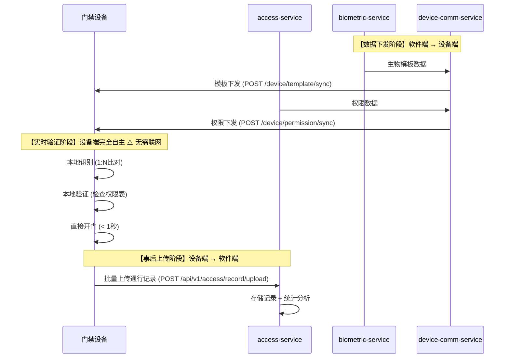
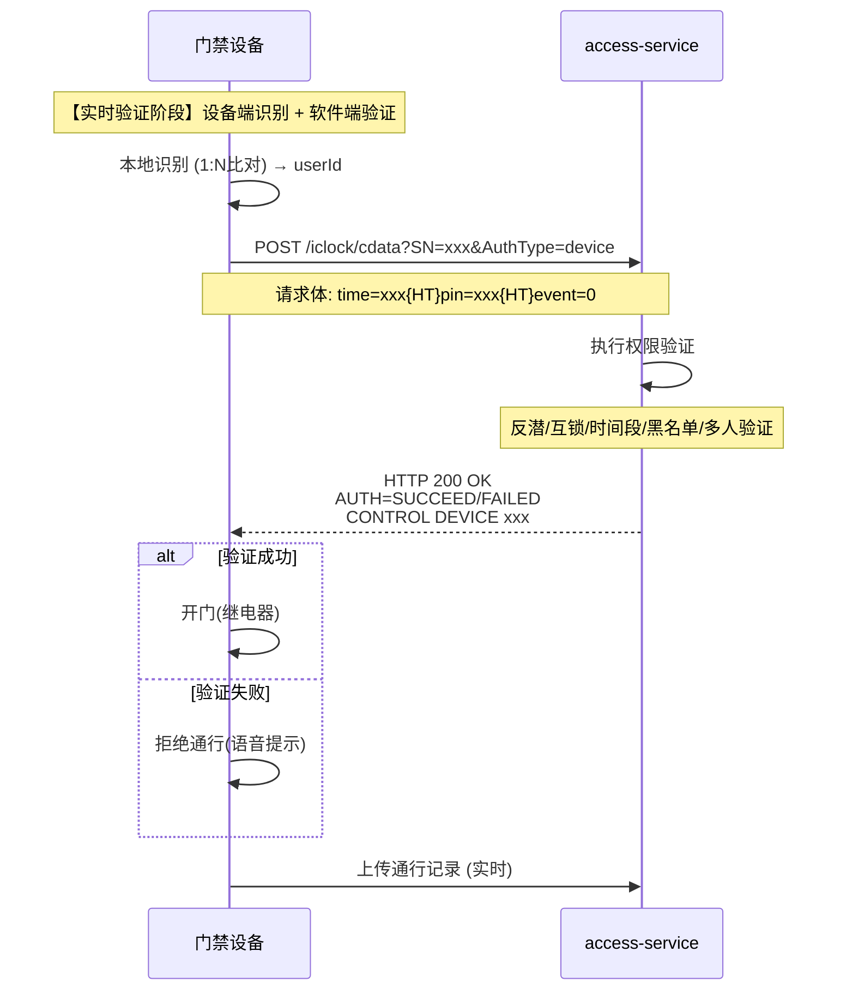

# 门禁模块API接口契约文档

**生成时间**: 2025-01-30  
**文档版本**: v2.0.0 - 双模式验证架构  
**模块**: 门禁管理模块 (ioedream-access-service)  
**设备交互模式**: 双模式验证（设备端验证edge + 后台验证backend）  
**核心理念**: ⭐ **根据区域配置自动选择验证模式** - 支持设备端验证和后台验证两种模式  
**状态**: ✅ **已完成**

---

## 📋 文档说明

本文档定义了门禁模块的所有API接口契约，基于**边缘自主验证模式**设计，包括：
- 移动端API接口
- PC端API接口（待补充）
- 权限申请API接口
- 紧急权限API接口

**API基础路径**: `/api/v1/access` 或 `/api/v1/mobile/access`

---

## ⭐ 设备交互模式说明

### 核心设计原则

门禁系统支持**双模式验证架构**，根据区域配置(`t_access_area_ext.verification_mode`)自动选择验证模式：
- **设备端验证模式(edge)**: 设备端完全自主完成身份识别和权限验证，支持离线运行
- **后台验证模式(backend)**: 设备端识别，软件端验证权限逻辑（反潜/互锁/多人验证），必须在线

### 模式1: 设备端验证模式 (Edge Verification)



### 模式2: 后台验证模式 (Backend Verification)



### 关键接口说明

❗ **重要**: 以下接口反映了真实的数据流向

| 接口类型 | API路径 | 调用方 | 职责 | 数据流向 | 验证模式 |
|---------|---------|---------|------|----------|---------|
| **模板下发** | `/device/template/sync` | device-comm-service | 将生物模板下发到设备 | 软件 → 设备 | edge/backend |
| **权限下发** | `/device/permission/sync` | device-comm-service | 将权限数据下发到设备 | 软件 → 设备 | edge |
| **后台验证** | `/iclock/cdata?SN=xxx&AuthType=device` | 设备端 | 设备后台验证请求 | 设备 → 软件 | backend |
| **记录上传** | `/api/v1/access/record/upload` | 设备端 | 设备批量上传通行记录 | 设备 → 软件 | edge |
| **记录查询** | `/api/v1/access/records` | Web/Mobile | 查询已存储的通行记录 | 软件内部 | - |

---

## 🔐 设备端API接口（后台验证）

### 后台验证接口

**接口**: `POST /iclock/cdata?SN={SerialNumber}&AuthType=device`

**功能**: 门禁设备后台验证接口（符合安防PUSH协议V4.8）

**协议规范**: 安防PUSH通讯协议 V4.8 - 13. 后台验证

**请求参数**:
- `SN`: 设备序列号（必填）
- `AuthType`: 验证类型，固定值`device`（可选，默认device）
- 请求体（form-data格式）:
  - `time`: 验证时间 (YYYY-MM-DD HH:MM:SS)
  - `pin`: 工号（设备已识别）
  - `cardno`: 卡号
  - `event`: 事件类型 (0=正常刷卡开门, 14=正常按指纹开门)
  - `verifytype`: 验证方式 (0=密码, 1=指纹, 2=卡, 11=面部)
  - `inoutstatus`: 进出状态 (1=进, 2=出)

**响应格式**:
```
AUTH=SUCCEED{CR}{LF}
time=xxx{HT}pin=xxx{HT}...{CR}{LF}
CONTROL DEVICE 0101000300{CR}{LF}
TIPS=验证通过,欢迎进入
```

**响应字段**:
- `AUTH`: 验证结果 (SUCCEED/FAILED/TIMEOUT)
- 第二行: 原始事件记录（回显）
- 第三行: 控制指令（验证成功时）
- `TIPS`: 提示信息（UTF-8编码）

**Controller**: `AccessBackendAuthController.backendVerification()`

**验证流程**:
1. 设备端识别用户身份（1:N比对）
2. 设备发送验证请求到软件端
3. 软件端执行权限验证（反潜/互锁/时间段/黑名单/多人验证）
4. 软件端返回验证结果和控制指令
5. 设备根据结果开门或拒绝

---

## 📱 一、移动端API接口

### 1.1 门禁检查接口

**基础路径**: `/api/v1/mobile/access`

#### 1.1.1 移动端门禁检查

**接口**: `POST /api/v1/mobile/access/check`

**功能**: 移动端门禁权限检查

**请求参数**:
```typescript
interface MobileAccessCheckRequest {
  userId: number;              // 用户ID
  deviceId: number;            // 设备ID
  areaId: string;              // 区域ID
  verificationType: string;    // 验证类型（CARD/FACE/FINGERPRINT/QR_CODE）
}
```

**响应数据**:
```typescript
interface AccessCheckResult {
  allowed: boolean;            // 是否允许通行
  reason?: string;            // 拒绝原因
  accessLevel?: number;       // 访问级别
  validUntil?: string;        // 有效期至
}
```

**Controller**: `AccessMobileController.mobileAccessCheck()`

---

#### 1.1.2 二维码验证

**接口**: `POST /api/v1/mobile/access/qr/verify`

**功能**: 移动端二维码门禁验证

**请求参数**:
```typescript
interface QRCodeVerifyRequest {
  qrCode: string;             // 二维码内容
  deviceId: number;           // 设备ID
}
```

**响应数据**: 同门禁检查

**Controller**: `AccessMobileController.verifyQRCode()`

---

### 1.2 门禁记录查询接口

**基础路径**: `/api/v1/mobile/access`

#### 1.2.1 查询门禁记录

**接口**: `GET /api/v1/mobile/access/records`

**功能**: 查询用户门禁记录

**请求参数**:
- `userId`: number - 用户ID
- `startDate`: string - 开始日期（yyyy-MM-dd，可选）
- `endDate`: string - 结束日期（yyyy-MM-dd，可选）
- `deviceId`: number - 设备ID（可选）
- `pageNum`: number - 页码（默认1）
- `pageSize`: number - 每页大小（默认20）

**响应数据**:
```typescript
interface PageResult<AccessRecordVO> {
  list: AccessRecordVO[];
  total: number;
  pageNum: number;
  pageSize: number;
  pages: number;
}

interface AccessRecordVO {
  recordId: number;           // 记录ID
  userId: number;            // 用户ID
  userName: string;          // 用户名称
  deviceId: number;          // 设备ID
  deviceName: string;        // 设备名称
  areaId: string;           // 区域ID
  areaName: string;         // 区域名称
  accessTime: string;        // 通行时间
  accessType: string;        // 通行类型（IN/OUT）
  accessResult: string;      // 通行结果（SUCCESS/FAILED）
  verificationType: string;  // 验证类型
  reason?: string;          // 失败原因
}
```

**Controller**: `AccessMobileController.queryAccessRecords()`

---

### 1.3 设备管理接口

**基础路径**: `/api/v1/mobile/access/device`

#### 1.3.1 获取设备列表

**接口**: `GET /api/v1/mobile/access/device/list`

**功能**: 获取用户可访问的设备列表

**请求参数**:
- `areaId`: string - 区域ID（可选）

**响应数据**:
```typescript
interface AccessDeviceVO {
  deviceId: number;          // 设备ID
  deviceName: string;        // 设备名称
  deviceType: string;        // 设备类型
  areaId: string;           // 区域ID
  areaName: string;         // 区域名称
  status: number;           // 设备状态（1-在线 2-离线 3-故障）
  accessLevel: number;       // 访问级别
  supportedVerificationTypes: string[]; // 支持的验证类型
}
```

**Controller**: `AccessMobileController.getDeviceList()`

---

## 💻 二、PC端API接口（待补充）

### 2.1 门禁管理接口

**基础路径**: `/api/v1/access`

> ⚠️ **注意**: PC端Controller待创建，以下接口为规划接口

#### 2.1.1 门禁记录查询

**接口**: `POST /api/v1/access/record/query`

**功能**: 分页查询门禁记录

**请求参数**:
```typescript
interface AccessRecordQueryForm {
  userId?: number;           // 用户ID（可选）
  deviceId?: number;         // 设备ID（可选）
  areaId?: string;          // 区域ID（可选）
  startDate?: string;        // 开始日期（yyyy-MM-dd）
  endDate?: string;         // 结束日期（yyyy-MM-dd）
  accessResult?: string;     // 通行结果（可选）
  pageNum: number;          // 页码
  pageSize: number;         // 每页大小
}
```

**响应数据**: `PageResult<AccessRecordVO>`

---

#### 2.1.2 设备管理接口

**基础路径**: `/api/v1/access/device`

**接口列表**:
- `POST /api/v1/access/device/query` - 分页查询设备
- `GET /api/v1/access/device/{id}` - 查询设备详情
- `POST /api/v1/access/device/add` - 添加设备
- `PUT /api/v1/access/device/update` - 更新设备
- `DELETE /api/v1/access/device/{id}` - 删除设备
- `POST /api/v1/access/device/status/update` - 更新设备状态

> ⚠️ **注意**: 这些接口需要创建PC端Controller实现

---

#### 2.1.3 权限管理接口

**基础路径**: `/api/v1/access/permission`

**接口列表**:
- `POST /api/v1/access/permission/query` - 分页查询权限
- `POST /api/v1/access/permission/grant` - 授予权限
- `POST /api/v1/access/permission/revoke` - 撤销权限
- `POST /api/v1/access/permission/batch/grant` - 批量授予权限
- `POST /api/v1/access/permission/batch/revoke` - 批量撤销权限

> ⚠️ **注意**: 这些接口需要创建PC端Controller实现

---

## 📝 三、权限申请API接口

### 3.1 权限申请接口

**基础路径**: `/api/v1/access/permission/apply`

#### 3.1.1 提交权限申请

**接口**: `POST /api/v1/access/permission/apply/submit`

**功能**: 提交门禁权限申请并启动审批流程

**请求参数**:
```typescript
interface AccessPermissionApplyForm {
  userId: number;              // 用户ID
  deviceIds: number[];         // 设备ID列表
  areaIds: string[];          // 区域ID列表
  accessLevel: number;         // 访问级别
  startTime: string;          // 开始时间（ISO格式）
  endTime: string;           // 结束时间（ISO格式）
  reason: string;            // 申请原因
  attachments?: string[];     // 附件URL列表（可选）
}
```

**响应数据**:
```typescript
interface AccessPermissionApplyEntity {
  applyNo: string;            // 申请编号
  userId: number;              // 用户ID
  deviceIds: number[];         // 设备ID列表
  areaIds: string[];          // 区域ID列表
  accessLevel: number;         // 访问级别
  status: string;             // 申请状态（PENDING/APPROVED/REJECTED）
  submitTime: string;         // 提交时间
  approvalTime?: string;      // 审批时间
  approvalComment?: string;  // 审批意见
}
```

**Controller**: `AccessPermissionApplyController.submitPermissionApply()`

---

#### 3.1.2 查询权限申请

**接口**: `POST /api/v1/access/permission/apply/query`

**功能**: 分页查询权限申请记录

**请求参数**:
```typescript
interface AccessPermissionApplyQueryForm {
  userId?: number;           // 用户ID（可选）
  status?: string;           // 申请状态（可选）
  startDate?: string;        // 开始日期（yyyy-MM-dd）
  endDate?: string;         // 结束日期（yyyy-MM-dd）
  pageNum: number;          // 页码
  pageSize: number;         // 每页大小
}
```

**响应数据**: `PageResult<AccessPermissionApplyEntity>`

**Controller**: `AccessPermissionApplyController.queryPermissionApply()`

---

## 🚨 四、紧急权限API接口

### 4.1 紧急权限接口

**基础路径**: `/api/v1/access/emergency`

#### 4.1.1 申请紧急权限

**接口**: `POST /api/v1/access/emergency/apply`

**功能**: 申请紧急门禁权限（无需审批，立即生效）

**请求参数**:
```typescript
interface EmergencyPermissionApplyForm {
  userId: number;              // 用户ID
  deviceIds: number[];         // 设备ID列表
  areaIds: string[];          // 区域ID列表
  reason: string;            // 紧急原因
  duration: number;           // 有效期（分钟）
  approverId: number;         // 审批人ID（需要管理员权限）
}
```

**响应数据**:
```typescript
interface EmergencyPermissionResult {
  success: boolean;           // 是否成功
  permissionId: string;      // 权限ID
  validUntil: string;        // 有效期至（ISO格式）
  message?: string;          // 提示信息
}
```

**Controller**: `AccessEmergencyPermissionController.applyEmergencyPermission()`

---

#### 4.1.2 撤销紧急权限

**接口**: `POST /api/v1/access/emergency/revoke`

**功能**: 撤销紧急门禁权限

**请求参数**:
```typescript
interface EmergencyPermissionRevokeForm {
  permissionId: string;       // 权限ID
  reason: string;            // 撤销原因
}
```

**响应数据**: `ResponseDTO<Void>`

**Controller**: `AccessEmergencyPermissionController.revokeEmergencyPermission()`

---

## 📋 五、API接口规范

### 5.1 统一响应格式

所有API接口统一使用`ResponseDTO<T>`格式：

```typescript
interface ResponseDTO<T> {
  code: number;        // 业务状态码（200表示成功）
  message: string;     // 提示信息
  data: T;            // 响应数据
  timestamp: number;   // 时间戳
}
```

### 5.2 错误码规范

| 错误码范围 | 类型 | 说明 |
|-----------|------|------|
| 200 | 成功 | 操作成功 |
| 400-499 | 客户端错误 | 参数错误、未授权、禁止访问 |
| 500-599 | 服务端错误 | 服务器内部错误 |
| 5000-5999 | 门禁模块错误 | 门禁相关业务错误 |

### 5.3 认证授权

- **移动端接口**: 使用`@SaCheckLogin`注解，需要登录认证
- **PC端接口**: 使用`@PreAuthorize`注解，需要角色权限验证

### 5.4 参数验证

- 所有POST/PUT请求使用`@Valid`注解进行参数验证
- 使用Jakarta Validation注解（`@NotNull`, `@NotBlank`, `@Size`等）

---

## 📋 六、前端API接口文件

### 6.1 移动端API文件

**文件路径**: `smart-app/src/api/business/access/access-api.js`

**待实现接口**:
- ⚠️ 门禁检查接口
- ⚠️ 门禁记录查询接口
- ⚠️ 设备管理接口

### 6.2 PC端API文件

**文件路径**: `smart-admin-web-javascript/src/api/business/access/access-api.js`

**当前状态**: ⚠️ 仅包含全局联动相关接口，需要完善

**待补充接口**:
- ⚠️ 门禁记录查询接口
- ⚠️ 设备管理接口
- ⚠️ 权限管理接口
- ⚠️ 权限申请接口
- ⚠️ 紧急权限接口

---

## 🎯 七、下一步行动

### 7.1 立即执行

1. 📋 创建PC端门禁管理Controller
2. 📋 完善PC端API接口文件
3. 📋 完善移动端API接口文件

### 7.2 本周完成

1. 📋 梳理其他业务模块API接口契约
2. 📋 创建完整的API接口契约文档
3. 📋 检查前端和移动端API接口文件完整性
4. 📋 补充缺失的API接口实现

---

**文档生成**: IOE-DREAM 架构委员会  
**审核状态**: 待审核  
**下一步行动**: 继续梳理其他业务模块API接口契约

