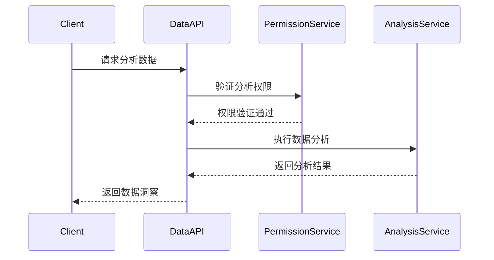

# 数据分析API合约文档

**文档版本**: v1.0.0
**更新日期**: 2025-12-16
**服务名称**: ioedream-common-service
**API版本**: v1
**基础路径**: `/api/v1/data-analysis`

---

## 📋 API概述

### 服务描述
数据分析API提供智慧园区运营数据的深度分析和智能洞察功能，支持多维度数据统计、趋势分析、预测模型和可视化报表生成。

### 技术特性
- ✅ **实时分析**: 支持实时数据流处理和分析
- ✅ **多维度统计**: 支持按时间、区域、用户等多维度统计
- ✅ **智能预测**: 基于机器学习的趋势预测和异常检测
- ✅ **可视化支持**: 返回图表数据和配置信息
- ✅ **大数据处理**: 支持海量数据的高效处理

### 数据分析范围
- **用户行为分析**: 登录、访问、操作行为统计
- **门禁通行分析**: 通行记录、区域热力图、时间分布
- **考勤分析**: 出勤率、迟到早退、工作时长统计
- **消费分析**: 消费习惯、金额分布、趋势预测
- **设备状态分析**: 设备健康度、使用率、故障统计
- **系统性能分析**: 响应时间、错误率、资源使用

---

## 🔐 认证机制

### 权限要求
数据分析API需要**数据分析员**或**管理员**权限才能访问。

### JWT Token认证
```http
Authorization: Bearer {jwt_token}
```

### 权限验证流程


---

## 📊 API接口清单

### 1. 运营概览分析

#### 1.1 获取运营概览
```http
GET /api/v1/data-analysis/overview
Authorization: Bearer {jwt_token}
```

**查询参数**:
- `timeRange` (string): 时间范围（TODAY/WEEK/MONTH/QUARTER/YEAR）
- `areaIds` (string): 区域ID列表，逗号分隔
- `dataType` (string): 数据类型（ALL/ACCESS/ATTENDANCE/CONSUME/DEVICE）

**响应结果**:
```json
{
  "code": 200,
  "message": "获取成功",
  "data": {
    "timeRange": "2025-12-16",
    "totalUsers": 1250,
    "activeUsers": 980,
    "newUsers": 25,
    "accessCount": 12500,
    "attendanceRate": 95.5,
    "consumptionAmount": 156800.50,
    "onlineDevices": 856,
    "alertCount": 12,
    "systemHealth": 98.2,
    "trends": {
      "userGrowth": {
        "current": 1250,
        "previous": 1220,
        "growthRate": 2.46
      },
      "accessTrend": {
        "daily": [1250, 1320, 1180, 1450, 1380, 1550],
        "weekly": [8600, 9200, 8800, 9500]
      },
      "consumptionTrend": {
        "monthly": [125000, 135000, 142000, 156800]
      }
    },
    "topAreas": [
      {
        "areaId": 101,
        "areaName": "A栋",
        "accessCount": 3200,
        "consumptionAmount": 45600.80
      }
    ]
  },
  "timestamp": 1703001234567
}
```

#### 1.2 获取实时指标
```http
GET /api/v1/data-analysis/realtime-metrics
Authorization: Bearer {jwt_token}
```

**响应结果**:
```json
{
  "code": 200,
  "message": "获取成功",
  "data": {
    "timestamp": "2025-12-16 14:30:00",
    "onlineUsers": 485,
    "activeDevices": 856,
    "currentQPS": 125,
    "averageResponseTime": 150,
    "errorRate": 0.2,
    "cpuUsage": 45.6,
    "memoryUsage": 62.3,
    "diskUsage": 35.8,
    "networkTraffic": {
      "inbound": 1024000,
      "outbound": 856000
    }
  }
}
```

### 2. 用户行为分析

#### 2.1 获取用户行为统计
```http
GET /api/v1/data-analysis/user-behavior
Authorization: Bearer {jwt_token}
```

**查询参数**:
- `timeRange` (string): 时间范围
- `userType` (string): 用户类型筛选
- `departmentId` (integer): 部门ID筛选
- `behaviorType` (string): 行为类型（LOGIN/ACCESS/OPERATION）

**响应结果**:
```json
{
  "code": 200,
  "message": "获取成功",
  "data": {
    "timeRange": "2025-12-16",
    "totalUsers": 1250,
    "activeUsers": 980,
    "behaviorStats": [
      {
        "behaviorType": "LOGIN",
        "count": 3450,
        "uniqueUsers": 856,
        "avgCountPerUser": 4.03,
        "peakHour": "09:00",
        "trendData": [
          {"hour": "08:00", "count": 156},
          {"hour": "09:00", "count": 245},
          {"hour": "10:00", "count": 189}
        ]
      },
      {
        "behaviorType": "ACCESS",
        "count": 12500,
        "uniqueUsers": 920,
        "avgCountPerUser": 13.59,
        "peakHour": "12:00"
      }
    ],
    "userSegmentation": {
      "highActive": {
        "count": 156,
        "percentage": 12.48
      },
      "mediumActive": {
        "count": 485,
        "percentage": 38.80
      },
      "lowActive": {
        "count": 609,
        "percentage": 48.72
      }
    }
  }
}
```

#### 2.2 获取用户路径分析
```http
GET /api/v1/data-analysis/user-path
Authorization: Bearer {jwt_token}
```

**查询参数**:
- `userId` (integer): 特定用户ID（可选）
- `pathType` (string): 路径类型（DAILY/WEEKLY/MONTHLY）
- `startDate` (string): 开始日期
- `endDate` (string): 结束日期

### 3. 门禁通行分析

#### 3.1 获取通行统计分析
```http
GET /api/v1/data-analysis/access-statistics
Authorization: Bearer {jwt_token}
```

**查询参数**:
- `timeRange` (string): 时间范围
- `areaIds` (string): 区域ID列表
- `deviceIds` (string): 设备ID列表
- `groupBy` (string): 分组方式（HOUR/DAY/WEEK/MONTH/AREA/DEVICE）

**响应结果**:
```json
{
  "code": 200,
  "message": "获取成功",
  "data": {
    "timeRange": "2025-12-16",
    "totalAccess": 12500,
    "uniqueUsers": 920,
    "successRate": 98.5,
    "deniedRate": 1.5,
    "statistics": [
      {
        "timeKey": "08:00",
        "accessCount": 1200,
        "successCount": 1180,
        "deniedCount": 20,
        "uniqueUsers": 156
      },
      {
        "timeKey": "09:00",
        "accessCount": 1650,
        "successCount": 1630,
        "deniedCount": 20,
        "uniqueUsers": 198
      }
    ],
    "areaHeatmap": [
      {
        "areaId": 101,
        "areaName": "A栋大厅",
        "accessCount": 3200,
        "heatLevel": "HIGH",
        "coordinates": {
          "x": 120.5,
          "y": 85.3
        }
      }
    ]
  }
}
```

#### 3.2 获取通行热力图数据
```http
GET /api/v1/data-analysis/access-heatmap
Authorization: Bearer {jwt_token}
```

### 4. 考勤分析

#### 4.1 获取考勤统计
```http
GET /api/v1/data-analysis/attendance-statistics
Authorization: Bearer {jwt_token}
```

**查询参数**:
- `timeRange` (string): 时间范围
- `departmentId` (integer): 部门ID筛选
- `statType` (string): 统计类型（RATE/HOURS/LATE/EARLY）

**响应结果**:
```json
{
  "code": 200,
  "message": "获取成功",
  "data": {
    "timeRange": "2025-12-16",
    "totalEmployees": 856,
    "attendanceRate": 95.5,
    "averageWorkHours": 8.2,
    "overtimeHours": 156.5,
    "lateCount": 23,
    "earlyCount": 15,
    "absentCount": 8,
    "departmentStats": [
      {
        "departmentId": 101,
        "departmentName": "技术部",
        "employeeCount": 120,
        "attendanceRate": 96.7,
        "averageHours": 8.5,
        "lateCount": 3
      }
    ],
    "trendData": {
      "dailyRate": [95.2, 96.1, 94.8, 95.5, 97.2],
      "dailyHours": [8.1, 8.3, 7.9, 8.2, 8.4]
    }
  }
}
```

#### 4.2 获取考勤异常分析
```http
GET /api/v1/data-analysis/attendance-anomaly
Authorization: Bearer {jwt_token}
```

### 5. 消费分析

#### 5.1 获取消费统计
```http
GET /api/v1/data-analysis/consumption-statistics
Authorization: Bearer {jwt_token}
```

**查询参数**:
- `timeRange` (string): 时间范围
- `areaIds` (string): 区域ID列表
- `consumeType` (string): 消费类型（MEAL/SNACKS/SHOPPING）
- `groupBy` (string): 分组方式

**响应结果**:
```json
{
  "code": 200,
  "message": "获取成功",
  "data": {
    "timeRange": "2025-12-16",
    "totalAmount": 156800.50,
    "transactionCount": 3450,
    "averageAmount": 45.44,
    "topCategories": [
      {
        "category": "MEAL",
        "amount": 89500.20,
        "count": 2100,
        "percentage": 57.1
      },
      {
        "category": "SNACKS",
        "amount": 35600.15,
        "count": 980,
        "percentage": 22.7
      }
    ],
    "userConsumption": {
      "highConsumers": [
        {
          "userId": 1001,
          "username": "zhangsan",
          "totalAmount": 1250.80,
          "transactionCount": 45,
          "avgAmount": 27.80
        }
      ],
      "consumptionPatterns": {
        "peakHours": ["12:00", "18:00"],
        "peakDays": ["MONDAY", "FRIDAY"]
      }
    }
  }
}
```

#### 5.2 获取消费趋势预测
```http
GET /api/v1/data-analysis/consumption-trend
Authorization: Bearer {jwt_token}
```

### 6. 设备状态分析

#### 6.1 获取设备健康统计
```http
GET /api/v1/data-analysis/device-health
Authorization: Bearer {jwt_token}
```

**响应结果**:
```json
{
  "code": 200,
  "message": "获取成功",
  "data": {
    "totalDevices": 1250,
    "onlineDevices": 1185,
    "offlineDevices": 45,
    "faultyDevices": 20,
    "healthScore": 96.8,
    "deviceTypes": [
      {
        "deviceType": "ACCESS",
        "totalCount": 450,
        "onlineCount": 435,
        "offlineCount": 10,
        "faultyCount": 5,
        "healthScore": 97.8
      },
      {
        "deviceType": "CAMERA",
        "totalCount": 300,
        "onlineCount": 280,
        "offlineCount": 15,
        "faultyCount": 5,
        "healthScore": 93.3
      }
    ],
    "alertEvents": [
      {
        "deviceId": "DEV001",
        "alertType": "OFFLINE",
        "severity": "HIGH",
        "occurrenceTime": "2025-12-16 14:30:00",
        "description": "设备离线超过30分钟"
      }
    ]
  }
}
```

#### 6.2 获取设备使用率分析
```http
GET /api/v1/data-analysis/device-usage
Authorization: Bearer {jwt_token}
```

### 7. 智能预测分析

#### 7.1 获取趋势预测
```http
GET /api/v1/data-analysis/trend-prediction
Authorization: Bearer {jwt_token}
```

**查询参数**:
- `metric` (string): 预测指标（USER_COUNT/ACCESS_COUNT/CONSUMPTION_AMOUNT）
- `timeRange` (string): 预测时间范围（WEEK/MONTH/QUARTER）
- `algorithm` (string): 算法类型（LINEAR/ARIMA/LSTM）

**响应结果**:
```json
{
  "code": 200,
  "message": "预测成功",
  "data": {
    "metric": "ACCESS_COUNT",
    "algorithm": "LSTM",
    "predictionPeriod": "2025-12-23 to 2025-12-30",
    "predictions": [
      {
        "date": "2025-12-23",
        "predictedValue": 13200,
        "confidenceInterval": {
          "lower": 12800,
          "upper": 13600
        }
      }
    ],
    "accuracy": {
      "mape": 5.2,
      "rmse": 280,
      "r2Score": 0.92
    }
  }
}
```

#### 7.2 获取异常检测
```http
GET /api/v1/data-analysis/anomaly-detection
Authorization: Bearer {jwt_token}
```

### 8. 可视化报表

#### 8.1 生成图表数据
```http
POST /api/v1/data-analysis/chart-data
Authorization: Bearer {jwt_token}
Content-Type: application/json
```

**请求参数**:
```json
{
  "chartType": "LINE|BAR|PIE|HEATMAP|SCATTER",
  "dataSource": "USER_BEHAVIOR|ACCESS_STATISTICS|CONSUMPTION_TRENDS",
  "timeRange": "WEEK",
  "filters": {
    "areaIds": [101, 102],
    "userType": "EMPLOYEE"
  },
  "groupBy": "DAY",
  "metrics": ["COUNT", "SUM", "AVERAGE"]
}
```

**响应结果**:
```json
{
  "code": 200,
  "message": "生成成功",
  "data": {
    "chartType": "LINE",
    "title": "用户行为趋势图",
    "xAxis": {
      "type": "CATEGORY",
      "data": ["2025-12-16", "2025-12-17", "2025-12-18"]
    },
    "yAxis": {
      "type": "VALUE",
      "label": "访问次数",
      "min": 0
    },
    "series": [
      {
        "name": "登录次数",
        "data": [1200, 1350, 1180],
        "color": "#1890ff"
      },
      {
        "name": "访问次数",
        "data": [8900, 9200, 8750],
        "color": "#52c41a"
      }
    ]
  }
}
```

#### 8.2 生成报表文件
```http
POST /api/v1/data-analysis/report/generate
Authorization: Bearer {jwt_token}
Content-Type: application/json
```

**请求参数**:
```json
{
  "reportType": "EXCEL|PDF|WORD",
  "template": "MONTHLY_REPORT|QUARTERLY_ANALYSIS",
  "timeRange": "MONTH",
  "includeCharts": true,
  "filters": {
    "departmentId": 101
  },
  "format": "TABLE|CHART"
}
```

---

## 📊 数据模型

### AnalysisRequestEntity
```json
{
  "requestId": "Long",         // 请求ID（主键）
  "userId": "Long",           // 请求用户ID
  "analysisType": "String",     // 分析类型
  "timeRange": "String",        // 时间范围
  "filters": "String",         // 筛选条件JSON
  "parameters": "String",      // 分析参数JSON
  "status": "String",          // 状态（PENDING/RUNNING/COMPLETED/FAILED）
  "result": "String",          // 分析结果JSON
  "createdTime": "Date",       // 创建时间
  "completedTime": "Date",     // 完成时间
  "errorMessage": "String"      // 错误信息
}
```

### AnalysisResultEntity
```json
{
  "resultId": "Long",          // 结果ID（主键）
  "requestId": "Long",         // 关联请求ID
  "resultType": "String",     // 结果类型
  "chartData": "String",      // 图表数据JSON
  "tableData": "String",      // 表格数据JSON
  "insights": "String",       // 数据洞察JSON
  "confidence": "Double",     // 置信度
  "metadata": "String",       // 元数据JSON
  "createdTime": "Date"
}
```

---

## 🔒 安全机制

### 1. 权限控制
- **角色权限**: 数据分析员、管理员角色才能访问
- **数据脱敏**: 敏感数据自动脱敏处理
- **IP白名单**: 管理员操作IP限制
- **操作审计**: 所有分析操作记录审计日志

### 2. 数据安全
- **传输加密**: HTTPS强制传输加密
- **数据隔离**: 按部门和权限隔离数据
- **缓存安全**: 敏感数据缓存加密
- **备份保护**: 分析数据定期备份

### 3. 接口安全
- **请求限流**: 分析接口频率限制
- **资源限制**: 防止资源耗尽攻击
- **输入验证**: 严格的参数验证
- **SQL注入防护**: 参数化查询防护

---

## ⚡ 性能优化

### 1. 数据库优化
- **分区表**: 按时间分区存储分析结果
- **索引策略**: 时间、类型、用户ID复合索引
- **查询优化**: 使用物化视图和汇总表

### 2. 缓存策略
- **查询结果缓存**: 常用分析结果缓存（30分钟）
- **图表数据缓存**: 图表配置缓存（1小时）
- **用户偏好缓存**: 用户分析偏好缓存（24小时）

### 3. 异步处理
- **后台任务**: 复杂分析任务异步执行
- **队列管理**: 使用消息队列管理任务
- **进度跟踪**: 实时返回任务进度

---

## 📊 监控指标

### 1. 业务指标
- **分析成功率**: 成功完成的分析次数/总分析次数
- **分析耗时**: P50/P95/P99分析耗时
- **数据准确性**: 预测准确率和置信度评估
- **用户活跃度**: 数据分析功能使用频次

### 2. 技术指标
- **接口响应时间**: 分析API平均响应时间
- **系统资源使用**: CPU、内存、磁盘使用率
- **数据吞吐量**: 数据处理速度和量级
- **错误率**: 4xx/5xx错误占比

---

## 🔧 错误码说明

| 错误码 | 错误信息 | 说明 |
|--------|----------|------|
| 200 | 分析成功 | 请求处理成功 |
| 400 | 参数错误 | 请求参数格式或内容错误 |
| 401 | 未授权 | 无效的认证Token |
| 403 | 权限不足 | 无数据分析权限 |
| 404 | 数据不存在 | 指定的数据不存在 |
| 409 | 分析冲突 | 分析任务冲突 |
| 422 | 验证失败 | 业务规则验证失败 |
| 429 | 请求过于频繁 | 分析请求频率超限 |
| 500 | 系统错误 | 数据分析服务异常 |
| 503 | 服务不可用 | 数据分析服务维护 |

---

## 📚 相关文档

- [用户管理API合约](../user/user-api-contract.md)
- [门禁管理API合约](../access/access-api-contract.md)
- [考勤管理API合约](../attendance/attendance-api-contract.md)
- [消费管理API合约](../consume/consume-api-contract.md)
- [访客管理API合约](../visitor/visitor-api-contract.md)
- [视频监控API合约](../video/video-api-contract.md)

---

**文档维护**: IOE-DREAM数据团队
**更新频率**: 每次功能变更后更新
**最后更新**: 2025-12-16