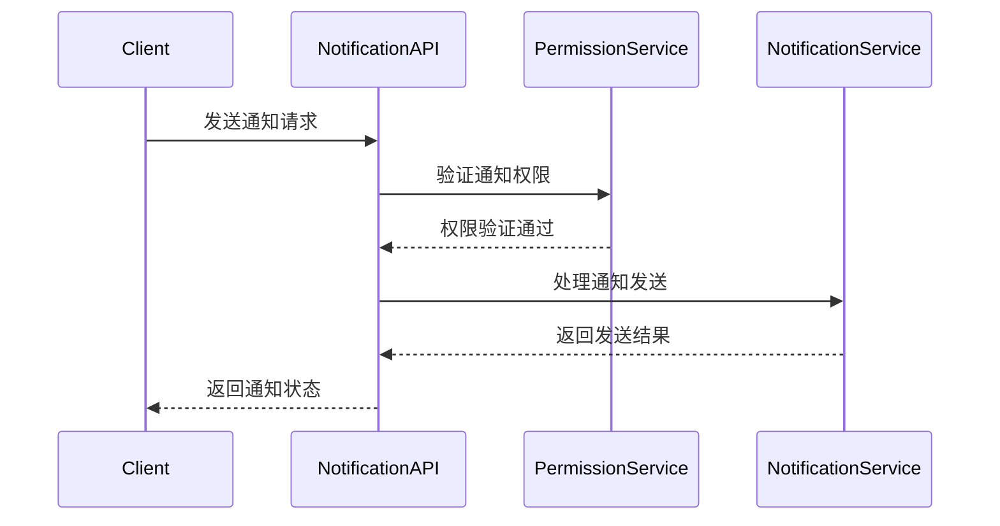

# 通知系统API合约文档

**文档版本**: v1.0.0
**更新日期**: 2025-12-16
**服务名称**: ioedream-common-service
**API版本**: v1
**基础路径**: `/api/v1/notification`

---

## 📋 API概述

### 服务描述
通知系统API提供统一的消息推送和通知管理功能，支持多渠道消息发送、通知模板管理、消息状态跟踪、推送策略配置等核心功能。

### 技术特性
- ✅ **多渠道支持**: 邮件、短信、微信、钉钉、App推送
- ✅ **模板管理**: 丰富的通知模板和变量替换
- ✅ **实时推送**: WebSocket实时消息推送
- ✅ **消息追踪**: 完整的发送状态和读取状态跟踪
- ✅ **智能路由**: 根据用户偏好智能选择推送渠道

### 通知渠道
- **邮件通知**: 支持HTML和文本格式邮件
- **短信通知**: 支持阿里云短信、腾讯云短信
- **即时通讯**: 微信企业号、钉钉机器人
- **App推送**: 移动端推送通知
- **系统消息**: 站内消息通知

---

## 🔐 认证机制

### 权限要求
通知系统API需要**系统管理员**或**通知管理员**权限才能访问管理功能，普通用户可以访问个人通知相关接口。

### JWT Token认证
```http
Authorization: Bearer {jwt_token}
```

### 权限验证流程


---

## 📊 API接口清单

### 1. 通知发送接口

#### 1.1 发送通知
```http
POST /api/v1/notification/send
Authorization: Bearer {jwt_token}
Content-Type: application/json
```

**请求参数**:
```json
{
  "notificationType": "SYSTEM|BUSINESS|SECURITY|REMINDER",
  "receiverType": "USER|ROLE|DEPARTMENT|ALL",
  "receiverIds": [1001, 1002, 1003],
  "title": "系统维护通知",
  "content": "系统将于今晚22:00-23:00进行维护，请提前保存工作",
  "templateCode": "SYSTEM_MAINTENANCE",
  "templateData": {
    "maintenanceTime": "22:00-23:00",
    "systemName": "IOE-DREAM智慧园区系统"
  },
  "channels": ["EMAIL", "SMS", "WECHAT", "APP"],
  "priority": "HIGH|MEDIUM|LOW",
  "scheduleTime": "2025-12-16 21:00:00",
  "expireTime": "2025-12-17 09:00:00",
  "attachments": [
    {
      "fileName": "maintenance_notice.pdf",
      "fileUrl": "https://example.com/files/maintenance_notice.pdf",
      "fileSize": 1024000
    }
  ],
  "buttons": [
    {
      "text": "查看详情",
      "action": "VIEW_DETAILS",
      "url": "https://example.com/details"
    }
  ]
}
```

**响应结果**:
```json
{
  "code": 200,
  "message": "通知发送成功",
  "data": {
    "notificationId": "NOTIF_20251216_001",
    "sendStatus": "SUCCESS",
    "receiverCount": 3,
    "channels": [
      {
        "channel": "EMAIL",
        "status": "SENT",
        "sentTime": "2025-12-16 14:30:00",
        "messageId": "MSG_20251216_EMAIL_001"
      },
      {
        "channel": "SMS",
        "status": "SENT",
        "sentTime": "2025-12-16 14:30:05",
        "messageId": "MSG_20251216_SMS_001"
      }
    ],
    "createdTime": "2025-12-16 14:30:00"
  }
}
```

#### 1.2 批量发送通知
```http
POST /api/v1/notification/batch
Authorization: Bearer {jwt_token}
Content-Type: application/json
```

**请求参数**:
```json
{
  "notifications": [
    {
      "receiverType": "USER",
      "receiverIds": [1001],
      "title": "个人通知1",
      "content": "这是个人通知1的内容"
    },
    {
      "receiverType": "ROLE",
      "receiverIds": [1, 2],
      "title": "角色通知",
      "content": "这是发送给角色的通知"
    }
  ],
  "batchId": "BATCH_20251216_001"
}
```

#### 1.3 取消未读通知
```http
DELETE /api/v1/notification/{notificationId}
Authorization: Bearer {jwt_token}
```

### 2. 通知模板管理

#### 2.1 创建通知模板
```http
POST /api/v1/notification/template
Authorization: Bearer {admin_token}
Content-Type: application/json
```

**请求参数**:
```json
{
  "templateCode": "BIRTHDAY_REMINDER",
  "templateName": "生日提醒模板",
  "templateType": "EMAIL|SMS|WECHAT",
  "category": "REMINDER",
  "subject": "生日祝福通知",
  "content": "亲爱的{realName}，今天是您的生日，祝您生日快乐！身体健康，工作顺利！",
  "variables": [
    {
      "variableName": "realName",
      "variableType": "STRING",
      "description": "用户姓名",
      "required": true,
      "defaultValue": ""
    },
    {
      "variableName": "companyName",
      "variableType": "STRING",
      "description": "公司名称",
      "required": false,
      "defaultValue": "IOE-DREAM"
    }
  ],
  "attachmentEnabled": true,
  "buttonEnabled": true,
  "status": "ACTIVE",
  "description": "用户生日提醒通知模板"
}
```

#### 2.2 查询通知模板
```http
GET /api/v1/notification/template/list
Authorization: Bearer {admin_token}
```

**查询参数**:
- `templateType` (string): 模板类型筛选
- `category` (string): 分类筛选
- `status` (string): 状态筛选
- `pageNum` (integer): 页码
- `pageSize` (integer): 每页大小

**响应结果**:
```json
{
  "code": 200,
  "message": "查询成功",
  "data": {
    "list": [
      {
        "templateId": 1,
        "templateCode": "SYSTEM_MAINTENANCE",
        "templateName": "系统维护通知",
        "templateType": "EMAIL|SMS",
        "category": "SYSTEM",
        "subject": "系统维护通知",
        "status": "ACTIVE",
        "createdTime": "2025-12-01 09:00:00",
        "updatedTime": "2025-12-16 10:00:00"
      }
    ],
    "total": 25,
    "pageNum": 1,
    "pageSize": 20,
    "pages": 2
  }
}
```

#### 2.3 获取模板详情
```http
GET /api/v1/notification/template/{templateId}
Authorization: Bearer {admin_token}
```

#### 2.4 更新通知模板
```http
PUT /api/v1/notification/template/{templateId}
Authorization: Bearer {admin_token}
Content-Type: application/json
```

#### 2.5 删除通知模板
```http
DELETE /api/v1/notification/template/{templateId}
Authorization: Bearer {admin_token}
```

### 3. 用户通知管理

#### 3.1 获取用户通知列表
```http
GET /api/v1/notification/user/list
Authorization: Bearer {jwt_token}
```

**查询参数**:
- `userId` (integer): 用户ID（可选，默认当前用户）
- `notificationType` (string): 通知类型筛选
- `readStatus` (string): 阅读状态（READ/UNREAD/ALL）
- `priority` (string): 优先级筛选
- `startTime` (string): 开始时间
- `endTime` (string): 结束时间
- `pageNum` (integer): 页码
- `pageSize` (integer): 每页大小

**响应结果**:
```json
{
  "code": 200,
  "message": "获取成功",
  "data": {
    "list": [
      {
        "notificationId": "NOTIF_20251216_001",
        "userId": 1001,
        "title": "系统维护通知",
        "content": "系统将于今晚22:00-23:00进行维护",
        "notificationType": "SYSTEM",
        "priority": "HIGH",
        "readStatus": "UNREAD",
        "readTime": null,
        "createdTime": "2025-12-16 14:30:00",
        "expireTime": "2025-12-17 09:00:00",
        "sender": "system",
        "attachments": [
          {
            "fileName": "maintenance_notice.pdf",
            "fileUrl": "https://example.com/files/maintenance_notice.pdf"
          }
        ]
      }
    ],
    "unreadCount": 5,
    "total": 45,
    "pageNum": 1,
    "pageSize": 20,
    "pages": 3
  }
}
```

#### 3.2 标记通知为已读
```http
PUT /api/v1/notification/{notificationId}/read
Authorization: Bearer {jwt_token}
```

**请求参数**:
```json
{
  "readTime": "2025-12-16 14:45:00",
  "readType": "MANUAL|AUTO"
}
```

#### 3.3 批量标记已读
```http
PUT /api/v1/notification/batch/read
Authorization: Bearer {jwt_token}
Content-Type: application/json
```

**请求参数**:
```json
{
  "notificationIds": [
    "NOTIF_20251216_001",
    "NOTIF_20251216_002",
    "NOTIF_20251216_003"
  ],
  "readTime": "2025-12-16 14:45:00",
  "readType": "BATCH"
}
```

#### 3.4 删除通知
```http
DELETE /api/v1/notification/{notificationId}
Authorization: Bearer {jwt_token}
```

### 4. 通知统计接口

#### 4.1 获取通知统计
```http
GET /api/v1/notification/statistics
Authorization: Bearer {jwt_token}
```

**查询参数**:
- `timeRange` (string): 时间范围
- `notificationType` (string): 通知类型筛选
- `channel` (string): 推送渠道筛选
- `groupBy` (string): 分组方式（TYPE/CHANNEL/USER/TIME）

**响应结果**:
```json
{
  "code": 200,
  "message": "获取成功",
  "data": {
    "timeRange": "2025-12-16",
    "totalNotifications": 1250,
    "sentNotifications": 1180,
    "deliveredNotifications": 1150,
    "readNotifications": 980,
    "unreadNotifications": 270,
    "statistics": [
      {
        "type": "SYSTEM",
        "count": 450,
        "deliveredCount": 435,
        "readCount": 380,
        "deliveryRate": 96.7
      },
      {
        "type": "BUSINESS",
        "count": 680,
        "deliveredCount": 665,
        "readCount": 545,
        "deliveryRate": 97.8
      }
    ],
    "channelStats": [
      {
        "channel": "EMAIL",
        "sentCount": 850,
        "deliveredCount": 825,
        "deliveryRate": 97.1
      },
      {
        "channel": "SMS",
        "sentCount": 280,
        "deliveredCount": 265,
        "deliveryRate": 94.6
      }
    ]
  }
}
```

#### 4.2 获取用户通知偏好
```http
GET /api/v1/notification/user/preferences
Authorization: Bearer {jwt_token}
```

**响应结果**:
```json
{
  "code": 200,
  "message": "获取成功",
  "data": {
    "userId": 1001,
    "emailEnabled": true,
    "smsEnabled": true,
    "wechatEnabled": true,
    "appPushEnabled": true,
    "quietHoursEnabled": false,
    "quietHours": {
      "startTime": "22:00",
      "endTime": "08:00"
    },
    "notificationTypes": [
      {
        "type": "SYSTEM",
        "enabled": true,
        "channels": ["EMAIL", "WECHAT"]
      },
      {
        "type": "BUSINESS",
        "enabled": true,
        "channels": ["EMAIL", "APP"]
      }
    ]
  }
}
```

#### 4.3 更新用户通知偏好
```http
PUT /api/v1/notification/user/preferences
Authorization: Bearer {jwt_token}
Content-Type: application/json
```

**请求参数**:
```json
{
  "emailEnabled": false,
  "smsEnabled": true,
  "wechatEnabled": true,
  "appPushEnabled": true,
  "quietHoursEnabled": true,
  "quietHours": {
    "startTime": "22:00",
    "endTime": "08:00"
  },
  "notificationTypes": [
    {
      "type": "SYSTEM",
      "enabled": true,
      "channels": ["SMS", "WECHAT"]
    }
  ]
}
```

### 5. 实时通知接口

#### 5.1 WebSocket连接
```javascript
const ws = new WebSocket('wss://api.example.com/ws/notification');
ws.onmessage = function(event) {
    const notification = JSON.parse(event.data);
    console.log('收到实时通知:', notification);
};
```

#### 5.2 获取实时通知
```http
GET /api/v1/notification/realtime
Authorization: Bearer {jwt_token}
```

#### 5.3 标记实时通知已读
```http
PUT /api/v1/notification/realtime/{notificationId}/read
Authorization: Bearer {jwt_token}
```

### 6. 通知配置管理

#### 6.1 获取通知配置
```http
GET /api/v1/notification/config
Authorization: Bearer {admin_token}
```

**响应结果**:
```json
{
  "code": 200,
  "message": "获取成功",
  "data": {
    "emailConfig": {
      "smtpHost": "smtp.example.com",
      "smtpPort": 587,
      "username": "noreply@ioedream.com",
      "password": "encrypted_password",
      "fromEmail": "noreply@ioedream.com",
      "fromName": "IOE-DREAM系统",
      "useSSL": true
    },
    "smsConfig": {
      "provider": "ALIYUN",
      "accessKey": "encrypted_key",
      "accessSecret": "encrypted_secret",
      "signName": "IOE-DREAM",
      "templateCode": "SMS_123456"
    },
    "wechatConfig": {
      "corpId": "wx123456",
      "corpSecret": "encrypted_secret",
      "agentId": "1000001",
      "token": "encrypted_token"
    },
    "pushConfig": {
      "provider": "JIGUANG",
      "appKey": "encrypted_app_key",
      "masterSecret": "encrypted_master_secret",
      "apnsProduction": false
    }
  }
}
```

#### 6.2 更新通知配置
```http
PUT /api/v1/notification/config
Authorization: Bearer {admin_token}
Content-Type: application/json
```

---

## 📊 数据模型

### NotificationEntity
```json
{
  "notificationId": "String",     // 通知ID（主键）
  "senderId": "Long",           // 发送者ID
  "receiverType": "String",     // 接收者类型
  "receiverIds": "String",       // 接收者ID列表
  "notificationType": "String",  // 通知类型
  "title": "String",           // 通知标题
  "content": "String",          // 通知内容
  "templateCode": "String",      // 模板编码
  "templateData": "String",      // 模板数据
  "channels": "String",         // 推送渠道
  "priority": "String",         // 优先级
  "status": "String",           // 状态
  "readStatus": "String",        // 阅读状态
  "sendStatus": "String",        // 发送状态
  "scheduleTime": "Date",        // 计划发送时间
  "expireTime": "Date",         // 过期时间
  "attachments": "String",       // 附件信息JSON
  "buttons": "String",          // 按钮信息JSON
  "createdTime": "Date",        // 创建时间
  "sentTime": "Date",           // 发送时间
  "readTime": "Date",           // 阅读时间
  "updatedTime": "Date",        // 更新时间
}
```

### NotificationTemplateEntity
```json
{
  "templateId": "Long",           // 模板ID（主键）
  "templateCode": "String",        // 模板编码
  "templateName": "String",       // 模板名称
  "templateType": "String",      // 模板类型
  "category": "String",          // 分类
  "subject": "String",           // 主题
  "content": "String",           // 内容
  "variables": "String",         // 变量定义JSON
  "attachmentEnabled": "Boolean", // 是否支持附件
  "buttonEnabled": "Boolean",     // 是否支持按钮
  "status": "String",            // 状态
  "description": "String",       // 描述
  "createdTime": "Date",         // 创建时间
  "updatedTime": "Date",        // 更新时间
}
```

---

## 🔒 安全机制

### 1. 权限控制
- **发送权限**: 只有管理员和特定角色才能发送通知
- **查看权限**: 用户只能查看自己的通知
- **模板权限**: 模板管理需要管理员权限
- **配置权限**: 系统配置需要超级管理员权限

### 2. 数据安全
- **内容过滤**: 恶意内容自动过滤
- **敏感信息**: 敏感信息自动脱敏
- **审计日志**: 所有通知操作记录审计日志
- **数据加密**: 配置信息加密存储

### 3. 渠道安全
- **频率限制**: 短信、邮件渠道发送频率限制
- **内容审核**: 通知内容审核机制
- **黑名单管理": 防骚扰黑名单管理
- **IP白名单**: 管理员操作IP白名单

---

## ⚡ 性能优化

### 1. 发送优化
- **批量发送**: 支持批量通知发送减少请求次数
- **异步处理**: 通知发送异步处理不阻塞主流程
- **队列管理**: 使用消息队列管理发送任务
- **重试机制**: 发送失败自动重试机制

### 2. 缓存策略
- **模板缓存**: 通知模板内容缓存（1小时）
- **用户偏好缓存**: 用户通知偏好缓存（30分钟）
- **配置缓存**: 系统配置信息缓存（24小时）

### 3. 数据库优化
- **索引优化**: 时间、状态、用户ID复合索引
- **分区存储**: 按时间分区存储历史通知
- **定期清理**: 自动清理过期通知数据

---

## 📊 监控指标

### 1. 业务指标
- **发送成功率**: 成功发送的通知数量/总发送数量
- **投递成功率**: 成功投递的通知数量/已发送数量
- **读取率**: 用户读取通知的比例
- **响应时间**: 通知发送的平均响应时间

### 2. 渠道指标
- **邮件发送成功率**: 邮件渠道成功率
- **短信发送成功率**: 短信渠道成功率
- **推送打开率**: App推送打开率
- **点击率**: 通知内链接点击率

### 3. 系统指标
- **接口响应时间**: 通知API平均响应时间
- **并发处理能力**: 同时处理的通知请求数量
- **队列积压情况**: 消息队列积压数量
- **错误率**: 4xx/5xx错误占比

---

## 🔧 错误码说明

| 错误码 | 错误信息 | 说明 |
|--------|----------|------|
| 200 | 操作成功 | 请求处理成功 |
| 400 | 参数错误 | 请求参数格式或内容错误 |
| 401 | 未授权 | 无效的认证Token |
| 403 | 权限不足 | 无通知管理权限 |
| 404 | 通知不存在 | 指定的通知不存在 |
| 409 | 通知冲突 | 通知已存在或冲突 |
| 422 | 验证失败 | 通知规则验证失败 |
| 429 | 请求过于频繁 | 发送频率超限 |
| 500 | 系统错误 | 通知系统异常 |
| 502 | 渠道错误 | 推送渠道服务异常 |
| 503 | 服务不可用 | 通知服务维护 |

---

## 📚 相关文档

- [用户管理API合约](../user/user-api-contract.md)
- [门禁管理API合约](../access/access-api-contract.md)
- [考勤管理API合约](../attendance/attendance-api-contract.md)
- [消费管理API合约](../consume/consume-api-contract.md)
- [访客管理API合约](../visitor/visitor-api-contract.md)
- [视频监控API合约](../video/video-api-contract.md)

---

**文档维护**: IOE-DREAM通知团队
**更新频率**: 每次功能变更后更新
**最后更新**: 2025-12-16