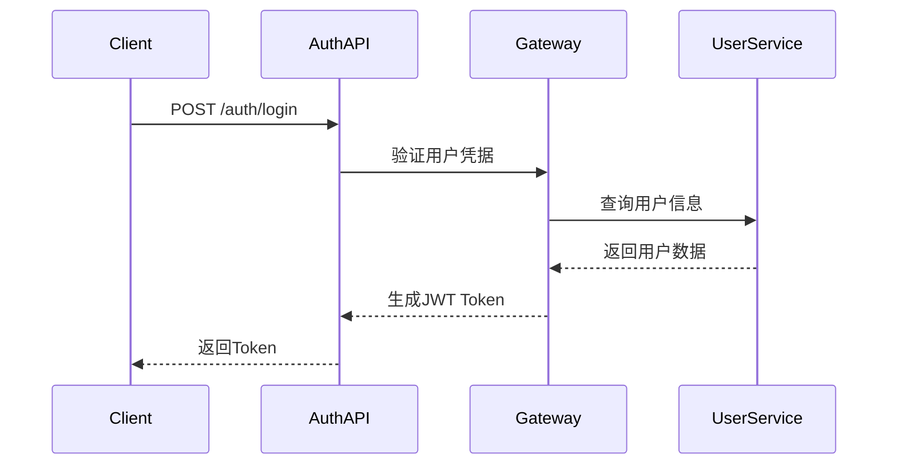

# 用户管理API合约文档

**文档版本**: v1.0.0
**更新日期**: 2025-12-16
**服务名称**: ioedream-common-service
**API版本**: v1
**基础路径**: `/api/v1/user`

---

## 📋 API概述

### 服务描述
用户管理API提供完整的用户生命周期管理功能，包括用户认证、信息管理、权限控制、组织架构关联等核心功能。

### 技术特性
- ✅ **JWT认证**: 基于Sa-Token的无状态认证
- ✅ **权限控制**: 基于RBAC的细粒度权限管理
- ✅ **数据加密**: 敏感信息AES加密存储
- ✅ **接口安全**: 防SQL注入、XSS攻击防护
- ✅ **性能优化**: 多级缓存支持

### 支持的HTTP方法
- `GET` - 查询资源
- `POST` - 创建资源
- `PUT` - 更新资源
- `DELETE` - 删除资源

---

## 🔐 认证机制

### JWT Token认证
```http
Authorization: Bearer {jwt_token}
```

### Token获取流程


---

## 📊 API接口清单

### 1. 用户认证接口

#### 1.1 用户登录
```http
POST /api/v1/user/auth/login
Content-Type: application/json
Authorization: Bearer {token}
```

**请求参数**:
```json
{
  "username": "string",      // 用户名（必填，3-50字符）
  "password": "string",      // 密码（必填，6-20字符）
  "captcha": "string",       // 验证码（必填）
  "captchaKey": "string",     // 验证码Key（必填）
  "loginType": "PASSWORD",   // 登录类型：PASSWORD/CARD/BIOMETRIC
  "deviceInfo": {            // 设备信息
    "deviceId": "string",
    "deviceType": "WEB/MOBILE",
    "userAgent": "string",
    "clientIp": "string"
  }
}
```

**响应结果**:
```json
{
  "code": 200,
  "message": "登录成功",
  "data": {
    "userId": 1001,
    "username": "zhangsan",
    "realName": "张三",
    "email": "zhangsan@example.com",
    "phone": "13800138000",
    "avatar": "https://example.com/avatar.jpg",
    "token": "eyJhbGciOiJIUzI1NiIsInR5cCI6IkpXVCJ9...",
    "refreshToken": "refresh_token_string",
    "expiresIn": 7200,
    "permissions": [
      "user:view",
      "user:edit",
      "system:admin"
    ],
    "roles": [
      {
        "roleId": 1,
        "roleName": "管理员",
        "roleCode": "ADMIN"
      }
    ],
    "department": {
      "departmentId": 101,
      "departmentName": "技术部",
      "parentId": 100
    }
  },
  "timestamp": 1703001234567
}
```

#### 1.2 刷新Token
```http
POST /api/v1/user/auth/refresh
Content-Type: application/json
```

**请求参数**:
```json
{
  "refreshToken": "refresh_token_string"
}
```

#### 1.3 用户登出
```http
POST /api/v1/user/auth/logout
Authorization: Bearer {jwt_token}
```

### 2. 用户信息管理接口

#### 2.1 获取用户信息
```http
GET /api/v1/user/info
Authorization: Bearer {jwt_token}
```

**查询参数**:
- `includePermissions` (boolean): 是否包含权限信息
- `includeRoles` (boolean): 是否包含角色信息
- `includeDepartment` (boolean): 是否包含部门信息

**响应结果**:
```json
{
  "code": 200,
  "message": "获取成功",
  "data": {
    "userId": 1001,
    "username": "zhangsan",
    "realName": "张三",
    "nickname": "小张",
    "email": "zhangsan@example.com",
    "phone": "13800138000",
    "gender": 1,              // 1-男 2-女 0-未知
    "birthday": "1990-01-01",
    "avatar": "https://example.com/avatar.jpg",
    "status": 1,              // 1-正常 0-禁用
    "userType": "EMPLOYEE",    // EMPLOYEE/CONTRACTOR/VISITOR
    "employeeId": "EMP001",
    "joinDate": "2020-01-01",
    "lastLoginTime": "2025-12-16 10:30:00",
    "lastLoginIp": "192.168.1.100",
    "createdTime": "2020-01-01 09:00:00",
    "updatedTime": "2025-12-16 10:00:00"
  }
}
```

#### 2.2 更新用户信息
```http
PUT /api/v1/user/info
Authorization: Bearer {jwt_token}
Content-Type: application/json
```

**请求参数**:
```json
{
  "realName": "张三",
  "nickname": "小张",
  "email": "zhangsan@example.com",
  "phone": "13800138000",
  "gender": 1,
  "birthday": "1990-01-01",
  "avatar": "https://example.com/avatar.jpg"
}
```

#### 2.3 修改密码
```http
PUT /api/v1/user/password
Authorization: Bearer {jwt_token}
Content-Type: application/json
```

**请求参数**:
```json
{
  "oldPassword": "old_password123",
  "newPassword": "new_password456",
  "confirmPassword": "new_password456"
}
```

### 3. 用户管理接口（管理员）

#### 3.1 创建用户
```http
POST /api/v1/user
Authorization: Bearer {admin_token}
Content-Type: application/json
```

**请求参数**:
```json
{
  "username": "newuser",
  "password": "password123",
  "realName": "新用户",
  "email": "newuser@example.com",
  "phone": "13900139000",
  "gender": 1,
  "birthday": "1992-05-15",
  "userType": "EMPLOYEE",
  "employeeId": "EMP002",
  "departmentId": 101,
  "position": "软件工程师",
  "roles": [1, 2],
  "status": 1
}
```

#### 3.2 查询用户列表
```http
GET /api/v1/user/list
Authorization: Bearer {admin_token}
```

**查询参数**:
- `pageNum` (integer, 默认1): 页码
- `pageSize` (integer, 默认20): 每页大小
- `keyword` (string): 关键词搜索（用户名、姓名、邮箱、手机）
- `departmentId` (integer): 部门ID
- `status` (integer): 状态筛选
- `userType` (string): 用户类型筛选
- `startTime` (string): 创建开始时间
- `endTime` (string): 创建结束时间

**响应结果**:
```json
{
  "code": 200,
  "message": "查询成功",
  "data": {
    "list": [
      {
        "userId": 1001,
        "username": "zhangsan",
        "realName": "张三",
        "email": "zhangsan@example.com",
        "phone": "13800138000",
        "departmentName": "技术部",
        "position": "高级工程师",
        "status": 1,
        "userType": "EMPLOYEE",
        "createdTime": "2020-01-01 09:00:00"
      }
    ],
    "total": 150,
    "pageNum": 1,
    "pageSize": 20,
    "pages": 8
  }
}
```

#### 3.3 获取用户详情
```http
GET /api/v1/user/{userId}
Authorization: Bearer {admin_token}
```

#### 3.4 更新用户
```http
PUT /api/v1/user/{userId}
Authorization: Bearer {admin_token}
Content-Type: application/json
```

#### 3.5 删除用户
```http
DELETE /api/v1/user/{userId}
Authorization: Bearer {admin_token}
```

#### 3.6 批量操作用户
```http
POST /api/v1/user/batch
Authorization: Bearer {admin_token}
Content-Type: application/json
```

**请求参数**:
```json
{
  "action": "ENABLE|DISABLE|DELETE|ASSIGN_ROLE",
  "userIds": [1001, 1002, 1003],
  "roleIds": [1, 2]  // 仅ASSIGN_ROLE时需要
}
```

### 4. 用户权限接口

#### 4.1 获取用户权限
```http
GET /api/v1/user/permissions
Authorization: Bearer {jwt_token}
```

**响应结果**:
```json
{
  "code": 200,
  "message": "获取成功",
  "data": {
    "userId": 1001,
    "permissions": [
      {
        "permissionId": 1,
        "permissionCode": "user:view",
        "permissionName": "查看用户",
        "permissionType": "MENU",
        "resourcePath": "/user/list",
        "method": "GET"
      }
    ],
    "roles": [
      {
        "roleId": 1,
        "roleName": "管理员",
        "roleCode": "ADMIN"
      }
    ]
  }
}
```

#### 4.2 检查用户权限
```http
POST /api/v1/user/permission/check
Authorization: Bearer {jwt_token}
Content-Type: application/json
```

**请求参数**:
```json
{
  "permissionCode": "user:edit",
  "resourcePath": "/user/1001"
}
```

### 5. 组织架构接口

#### 5.1 获取用户部门信息
```http
GET /api/v1/user/department
Authorization: Bearer {jwt_token}
```

#### 5.2 获取部门用户列表
```http
GET /api/v1/user/department/{departmentId}/users
Authorization: Bearer {admin_token}
```

### 6. 用户活动记录

#### 6.1 获取用户登录记录
```http
GET /api/v1/user/login-history
Authorization: Bearer {jwt_token}
```

**查询参数**:
- `pageNum` (integer, 默认1): 页码
- `pageSize` (integer, 默认20): 每页大小
- `startTime` (string): 开始时间
- `endTime` (string): 结束时间
- `loginType` (string): 登录类型

#### 6.2 获取用户操作记录
```http
GET /api/v1/user/operation-logs
Authorization: Bearer {jwt_token}
```

---

## 📝 数据模型

### UserEntity
```json
{
  "userId": "Long",           // 用户ID（主键）
  "username": "String",       // 用户名（唯一）
  "password": "String",       // 密码（加密存储）
  "realName": "String",       // 真实姓名
  "nickname": "String",       // 昵称
  "email": "String",          // 邮箱（唯一）
  "phone": "String",          // 手机号（唯一）
  "gender": "Integer",        // 性别（1-男 2-女 0-未知）
  "birthday": "Date",         // 生日
  "avatar": "String",         // 头像URL
  "status": "Integer",        // 状态（1-正常 0-禁用）
  "userType": "String",       // 用户类型
  "employeeId": "String",     // 员工编号
  "departmentId": "Long",     // 部门ID
  "position": "String",       // 职位
  "joinDate": "Date",          // 入职日期
  "lastLoginTime": "Date",    // 最后登录时间
  "lastLoginIp": "String",    // 最后登录IP
  "createdTime": "Date",      // 创建时间
  "updatedTime": "Date",      // 更新时间
  "deletedFlag": "Boolean"     // 删除标记
}
```

### UserLoginLogEntity
```json
{
  "logId": "Long",             // 日志ID（主键）
  "userId": "Long",            // 用户ID
  "username": "String",        // 用户名
  "loginType": "String",       // 登录类型
  "loginIp": "String",         // 登录IP
  "userAgent": "String",       // 用户代理
  "loginResult": "Integer",    // 登录结果（1-成功 0-失败）
  "failureReason": "String",   // 失败原因
  "loginTime": "Date",         // 登录时间
  "sessionId": "String"        // 会话ID
}
```

---

## 🔒 安全机制

### 1. 认证安全
- **JWT Token**: 使用RS256算法签名
- **Token过期**: 默认2小时，支持刷新
- **防暴力破解**: 登录失败次数限制
- **设备指纹**: 支持设备绑定验证

### 2. 数据安全
- **密码加密**: BCrypt哈希加密
- **敏感数据**: AES256加密存储
- **SQL注入防护**: 参数化查询
- **XSS防护**: 输出编码处理

### 3. 接口安全
- **HTTPS强制**: 生产环境强制使用
- **CORS配置**: 跨域请求控制
- **请求限流**: 接口调用频率限制
- **IP白名单**: 管理员操作IP限制

---

## ⚡ 性能优化

### 1. 缓存策略
- **用户信息缓存**: Redis缓存用户基本信息（5分钟）
- **权限信息缓存**: 用户权限信息缓存（10分钟）
- **JWT验证缓存**: Token验证结果缓存（1分钟）

### 2. 数据库优化
- **用户表索引**: username、email、phone、status组合索引
- **日志表索引**: userId、loginTime复合索引
- **分页查询**: 使用游标分页优化

### 3. 接口优化
- **批量操作**: 支持批量用户操作
- **懒加载**: 按需加载关联数据
- **压缩传输**: Gzip压缩响应数据

---

## 📊 监控指标

### 1. 业务指标
- **登录成功率**: 成功登录次数/总登录次数
- **用户活跃度**: 日活跃用户数(DAU)、月活跃用户数(MAU)
- **权限验证耗时**: 权限检查接口平均响应时间

### 2. 技术指标
- **接口响应时间**: P50/P95/P99响应时间
- **错误率**: 4xx/5xx错误占比
- **并发量**: 接口QPS峰值

### 3. 安全指标
- **登录失败率**: 登录失败次数占比
- **异常登录**: 异常IP/异常设备登录次数
- **权限违规**: 无权限访问请求次数

---

## 🔧 错误码说明

| 错误码 | 错误信息 | 说明 |
|--------|----------|------|
| 200 | 操作成功 | 请求处理成功 |
| 400 | 参数错误 | 请求参数格式或内容错误 |
| 401 | 未授权 | Token无效或过期 |
| 403 | 权限不足 | 无权限访问资源 |
| 404 | 用户不存在 | 指定的用户不存在 |
| 409 | 用户已存在 | 用户名或邮箱已存在 |
| 422 | 业务验证失败 | 业务规则验证失败 |
| 429 | 请求过于频繁 | 请求频率超限 |
| 500 | 系统错误 | 服务器内部错误 |

---

## 📚 相关文档

- [门禁管理API合约](../access/access-api-contract.md)
- [考勤管理API合约](../attendance/attendance-api-contract.md)
- [消费管理API合约](../consume/consume-api-contract.md)
- [访客管理API合约](../visitor/visitor-api-contract.md)
- [视频监控API合约](../video/video-api-contract.md)
- [数据分析API合约](../data-analysis/data-analysis-api-contract.md)

---

**文档维护**: IOE-DREAM技术团队
**更新频率**: 每次API变更后更新
**最后更新**: 2025-12-16