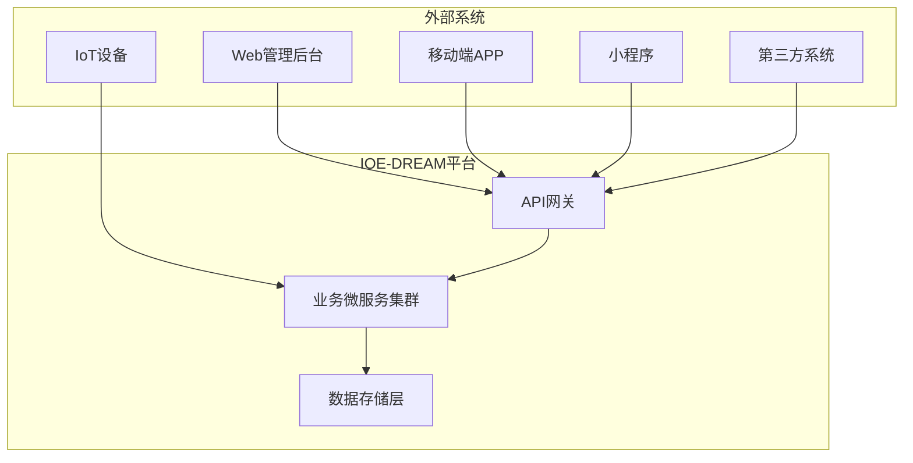
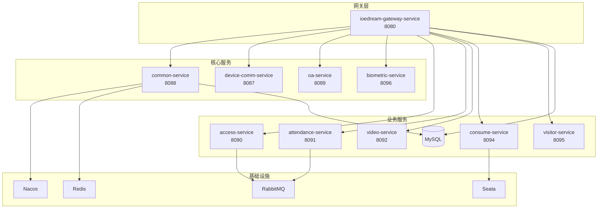
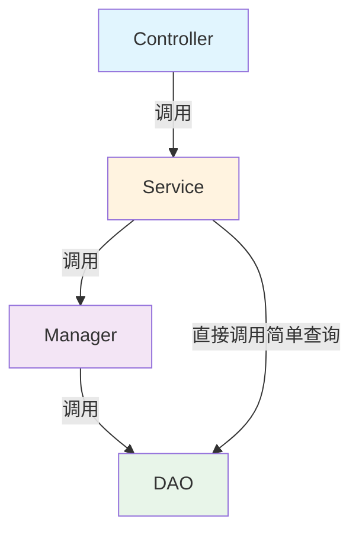
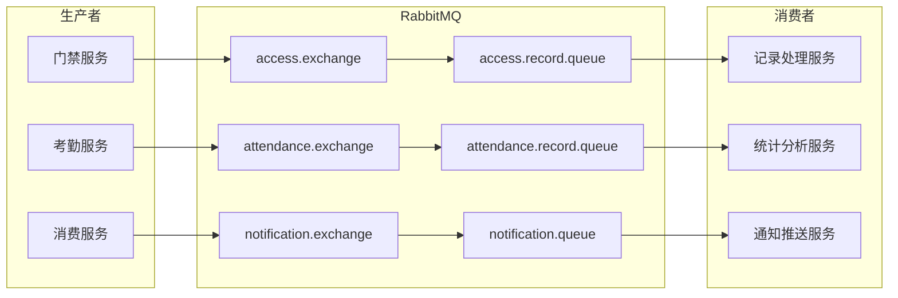
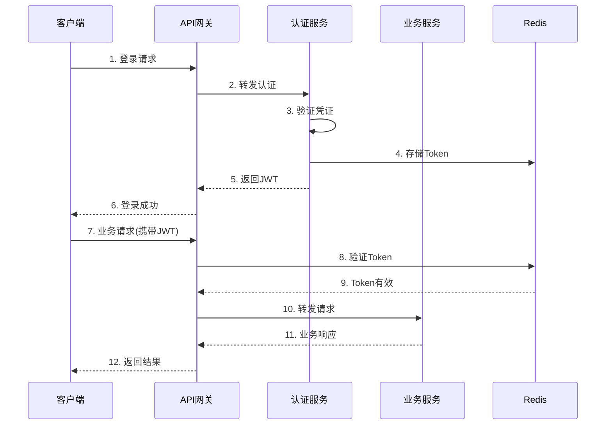

# IOE-DREAM 系统架构设计文档

> **版本**: v4.0.0-ACTUAL-STATE
> **更新日期**: 2025-12-22
> **文档类型**: 系统架构设计说明书（反映实际项目状态）
> **适用范围**: IOE-DREAM智慧园区一卡通管理平台全系统（需要架构修复）
> **🚨 状态**: 存在严重架构违规和编译错误，需要立即修复

---

## 1. 文档概述

### 1.1 编写目的

本文档详细描述IOE-DREAM智慧园区一卡通管理平台的系统架构设计，包括整体架构、技术选型、分层设计、部署架构等，为研发人员提供架构设计指导和开发规范参考。

### 1.2 适用对象

| 角色 | 用途 |
|------|------|
| 架构师 | 架构决策、技术选型参考 |
| 后端开发 | 微服务开发、接口实现 |
| 前端开发 | 接口对接、状态管理 |
| 运维工程师 | 部署配置、监控运维 |
| 测试工程师 | 测试策略、性能测试 |

---

## 2. 系统概述

### 2.1 系统定位

**IOE-DREAM**（Intelligent Operations & Enterprise - Digital Resource & Enterprise Application Management）是新一代**智慧园区一卡通管理平台**，集成多模态生物识别、智能门禁、无感消费、自动考勤、智能访客、视频监控等核心功能。

### 2.2 核心价值

```
┌─────────────────────────────────────────────────────────────┐
│                    IOE-DREAM 核心价值                        │
├─────────────────────────────────────────────────────────────┤
│  🔐 身份统一管理    一张脸/一张卡通行全园区                    │
│  ⚡ 无感通行体验    秒级识别，无需等待                        │
│  🛡️ 智能安全保障    AI分析+多系统联动                        │
│  📊 数据驱动决策    基于大数据的运营分析                      │
│  🚀 运营效率提升    自动化处理，降低人工成本                  │
└─────────────────────────────────────────────────────────────┘
```

### 2.3 系统边界



---

## 3. 整体架构设计

### 3.1 架构全景图

```
┌──────────────────────────────────────────────────────────────────────────────┐
│                              【接入层 - Access Layer】                        │
│  ┌─────────┐  ┌─────────┐  ┌─────────┐  ┌─────────┐  ┌─────────────────────┐ │
│  │Web管理台│  │移动端APP│  │微信小程序│  │第三方系统│  │ IoT设备(门禁/考勤) │ │
│  └────┬────┘  └────┬────┘  └────┬────┘  └────┬────┘  └──────────┬──────────┘ │
└───────┼────────────┼────────────┼────────────┼───────────────────┼───────────┘
        │            │            │            │                   │
        ▼            ▼            ▼            ▼                   ▼
┌──────────────────────────────────────────────────────────────────────────────┐
│                              【网关层 - Gateway Layer】                       │
│  ┌────────────────────────────────────────────────────────────────────────┐  │
│  │                    ioedream-gateway-service (8080)                     │  │
│  │  ┌─────────┐  ┌─────────┐  ┌─────────┐  ┌─────────┐  ┌─────────┐       │  │
│  │  │路由转发 │  │负载均衡 │  │限流熔断 │  │身份认证 │  │日志追踪 │       │  │
│  │  └─────────┘  └─────────┘  └─────────┘  └─────────┘  └─────────┘       │  │
│  └────────────────────────────────────────────────────────────────────────┘  │
└──────────────────────────────────────────────────────────────────────────────┘
                                      │
                                      ▼
┌──────────────────────────────────────────────────────────────────────────────┐
│                           【业务服务层 - Service Layer】                      │
│                                                                              │
│  ┌────────────────────────────────────────────────────────────────────────┐  │
│  │                         核心业务微服务集群                              │  │
│  │                                                                        │  │
│  │  ┌──────────────────┐  ┌──────────────────┐  ┌──────────────────┐     │  │
│  │  │ common-service   │  │ device-comm      │  │ oa-service       │     │  │
│  │  │ (8088)           │  │ (8087)           │  │ (8089)           │     │  │
│  │  │ 公共业务服务     │  │ 设备通讯服务     │  │ OA办公服务       │     │  │
│  │  └──────────────────┘  └──────────────────┘  └──────────────────┘     │  │
│  │                                                                        │  │
│  │  ┌──────────────────┐  ┌──────────────────┐  ┌──────────────────┐     │  │
│  │  │ access-service   │  │ attendance-svc   │  │ video-service    │     │  │
│  │  │ (8090)           │  │ (8091)           │  │ (8092)           │     │  │
│  │  │ 门禁管理服务     │  │ 考勤管理服务     │  │ 视频监控服务     │     │  │
│  │  └──────────────────┘  └──────────────────┘  └──────────────────┘     │  │
│  │                                                                        │  │
│  │  ┌──────────────────┐  ┌──────────────────┐                           │  │
│  │  │ consume-service  │  │ visitor-service  │                           │  │
│  │  │ (8094)           │  │ (8095)           │                           │  │
│  │  │ 消费管理服务     │  │ 访客管理服务     │                           │  │
│  │  └──────────────────┘  └──────────────────┘                           │  │
│  │                                                                        │  │
│  └────────────────────────────────────────────────────────────────────────┘  │
└──────────────────────────────────────────────────────────────────────────────┘
                                      │
                                      ▼
┌──────────────────────────────────────────────────────────────────────────────┐
│                         【基础设施层 - Infrastructure Layer】                 │
│                                                                              │
│  ┌─────────────┐  ┌─────────────┐  ┌─────────────┐  ┌─────────────┐         │
│  │   Nacos     │  │   Redis     │  │  RabbitMQ   │  │   Seata     │         │
│  │ 配置/注册   │  │ 缓存/会话   │  │  消息队列   │  │ 分布式事务  │         │
│  └─────────────┘  └─────────────┘  └─────────────┘  └─────────────┘         │
│                                                                              │
│  ┌─────────────┐  ┌─────────────┐  ┌─────────────┐  ┌─────────────┐         │
│  │   MySQL     │  │  Zipkin     │  │ Prometheus  │  │  Grafana    │         │
│  │  数据存储   │  │ 链路追踪   │  │  指标采集   │  │  可视化     │         │
│  └─────────────┘  └─────────────┘  └─────────────┘  └─────────────┘         │
└──────────────────────────────────────────────────────────────────────────────┘
```

### 3.2 微服务架构图



### 3.3 服务职责划分

| 服务名称 | 端口 | 职责范围 | 核心功能 | 备注 |
|---------|------|---------|---------|------|
| **gateway-service** | 8080 | API网关 | 路由、限流、认证、日志 | |
| **common-service** | 8088 | 公共业务 | 用户、组织、权限、字典、通知 | |
| **device-comm-service** | 8087 | 设备通讯 | 协议适配、模板下发、指令下发 ⚠️ 不做识别 | |
| **oa-service** | 8089 | OA办公 | 工作流、审批、表单、通知 | |
| **access-service** | 8090 | 门禁管理 | 通行记录、权限控制、防反潜 ⚠️ 接收设备上传记录 | |
| **attendance-service** | 8091 | 考勤管理 | 打卡记录、排班管理、统计报表、工时计算 | |
| **video-service** | 8092 | 视频监控 | 实时监控、录像回放、AI分析、联动录像 | |
| **database-service** | 8093 | 数据库管理 | 备份恢复、性能监控、数据迁移 | 🆕 |
| **consume-service** | 8094 | 消费管理 | 账户管理、消费记录、离线同步、对账补贴 | |
| **visitor-service** | 8095 | 访客管理 | 访客预约、登记审批、签到签出、轨迹追踪 | |
| **biometric-service** | 8096 | **生物模板管理** ⭐ | **模板存储、特征提取、设备下发、权限联动** ⚠️ 仅管理数据，不做识别 | 🆕 |

---

## 3.4 设备交互模式架构 ⭐ 核心设计理念

基于**真实设备交互场景**的5种设备交互模式,确保架构设计符合实际业务需求:

### 3.4.1 模式1: 门禁系统双模式验证架构

**适用场景**: 门禁设备、闸机、电子锁

**核心设计**: 支持两种验证模式，根据区域配置自动切换

#### 模式1A: 设备端验证模式 (Edge Verification)

**适用场景**: 中小企业(<1000人)、网络不稳定、简单权限

```
【数据下发】软件端 → 设备端
  ├─ 人员基础信息(姓名、工号、部门)
  ├─ 生物模板数据(人脸/指纹特征向量)
  ├─ 权限数据(时间段、区域、有效期)
  └─ 黑名单数据

【实时验证】设备端完全自主 ⭐ 核心特性
  ├─ 本地识别: 设备内嵌算法进行1:N比对
  ├─ 本地验证: 检查本地权限表
  ├─ 本地控制: 直接开门,无需等待服务器
  └─ 离线可用: 网络中断时仍可正常工作

【事后上传】设备端 → 软件端
  └─ 批量上传通行记录(每分钟或累计100条)

【技术优势】
  ✅ 响应速度快: 识别+验证+开门 < 1秒
  ✅ 离线可用: 网络故障不影响通行
  ✅ 降低服务器压力: 1000次通行只需处理记录存储
  ✅ 数据安全: 生物特征在设备端加密存储

【技术限制】
  ⚠️ 权限同步: 变更需实时推送到所有设备
  ⚠️ 设备存储: 大型园区10000+人员,设备容量有限
  ⚠️ 数据一致性: 设备端与软件端数据同步延迟
  ⚠️ 复杂逻辑: 反潜、互锁等逻辑难以在设备端实现
```

#### 模式1B: 后台验证模式 (Backend Verification)

**适用场景**: 大型企业(>1000人)、网络稳定、复杂权限(反潜/互锁/多人验证)

```
【数据下发】软件端 → 设备端
  └─ 人员生物模板数据(仅用于识别)

【实时验证】设备端识别 + 软件端验证 ⭐ 核心架构
  步骤1: 设备采集生物特征 → 本地识别匹配userId
  步骤2: 设备发送验证请求到软件端
         POST /iclock/cdata?SN=xxx&AuthType=device
  步骤3: 软件端执行权限验证 ⭐ 核心逻辑
         ├─ 反潜验证 (同一用户不能连续进入)
         ├─ 互锁验证 (A门开时B门不能开)
         ├─ 时间段验证
         ├─ 黑名单验证
         └─ 多人验证 (需N人同时验证)
  步骤4: 软件端返回结果
         HTTP 200 OK
         AUTH=SUCCEED/FAILED
         CONTROL DEVICE AABBCCDDEE
  步骤5: 设备根据结果 → 开门/拒绝
  步骤6: 设备上传通行记录 (实时)

【技术优势】
  ✅ 复杂权限支持: 反潜、互锁、多人验证
  ✅ 权限实时生效: 权限变更立即生效,无需同步
  ✅ 集中管理: 权限逻辑统一管理,便于审计
  ✅ 设备存储小: 只需存储人员模板,不存权限
  ✅ 灵活扩展: 新增权限规则无需升级设备

【技术限制】
  ⚠️ 网络依赖: 必须在线才能验证 (断网无法通行)
  ⚠️ 响应时间: 依赖网络延迟 (1-3秒)
  ⚠️ 服务器压力: 每次通行都需要验证
```

**模式切换**: 通过`t_access_area_ext.verification_mode`字段配置（edge/backend/hybrid）

### 3.4.2 模式2: 中心实时验证模式 (消费系统)

**适用场景**: 食堂消费、超市购物、自动售货机

```
【数据下发】软件端 → 设备端
  ├─ 人员基础信息
  ├─ 生物模板数据(仅用于识别,不含余额)
  └─ ⚠️ 不下发账户余额(防止设备篡改)

【实时消费】设备端识别 + 软件端验证 ⭐ 核心流程
  步骤1: 设备采集生物特征 → 本地识别匹配userId
  步骤2: 设备发送消费请求到软件端 → {userId, amount, deviceId}
  步骤3: 软件端查询账户余额 → 验证是否足够
  步骤4: 软件端扣款 → 返回成功/失败
  步骤5: 设备根据结果 → 出货/提示余额不足

【数据安全】
  ✅ 余额在软件端: 设备无法篡改
  ✅ 实时验证: 每笔消费都经过服务器验证
  ✅ 事务保证: Seata分布式事务确保一致性

【技术要求】
  ⚠️ 网络要求高: 必须在线才能消费
  ⚠️ 并发能力: 午高峰500人同时消费
  ⚠️ 响应时间: P99 < 300ms
```

### 3.4.3 模式3: 边缘识别+中心计算+排班联动 (考勤系统)

**适用场景**: 考勤打卡机、移动端打卡

```
【数据下发】软件端 → 设备端
  ├─ 人员基础信息
  ├─ 生物模板数据
  └─ ⚠️ 不下发排班计划和考勤规则

【实时打卡】设备端轻量识别
  ├─ 采集生物特征
  ├─ 本地识别匹配userId
  ├─ 生成打卡记录: userId + 时间 + 设备ID
  └─ 立即上传到软件端

【事后计算】软件端综合计算 ⭐ 核心逻辑
  每日凌晨2点执行考勤计算:
  
  步骤1: 查询排班计划
    → 班次类型、开始时间、结束时间、休息时段
  
  步骤2: 查询打卡记录
    → 上班打卡时间、下班打卡时间
  
  步骤3: 查询考勤规则
    → 迟到宽限、早退宽限、加班起算时长
  
  步骤4: 三要素结合计算 ⭐
    打卡记录 + 排班计划 + 考勤规则 = 考勤结果
    
    a) 计算实际工时:
       (下班时间 - 上班时间) - 休息时长
    
    b) 判断迟到:
       上班打卡时间 > (排班开始时间 + 宽限)
    
    c) 判断早退:
       下班打卡时间 < (排班结束时间 - 宽限)
    
    d) 判断加班:
       (下班打卡 - 排班结束) > 加班起算时长

【技术优势】
  ✅ 设备轻量: 只负责识别,不存储复杂规则
  ✅ 规则灵活: 考勤规则变更无需更新设备
  ✅ 支持多种工时制: 标准/弹性/轮班/外勤
  ✅ 事后可审计: 可重新计算历史数据
```

### 3.4.4 模式4: 混合验证模式 (访客系统)

**适用场景**: 访客通行、临时权限

```
【访客预约】软件端处理
  ├─ 访客信息登记
  ├─ 审批流程(OA工作流)
  ├─ 生成访客二维码/临时卡
  └─ 下发访客权限到指定门禁设备

【访客通行】设备端+软件端混合验证
  模式A: 二维码验证(在线)
    设备扫码 → 上传软件端验证 → 返回结果 → 开门
  
  模式B: 临时卡验证(离线)
    设备读卡 → 本地验证 → 直接开门

【访客离场】
  ├─ 记录签出时间
  ├─ 自动失效访客权限
  └─ 从设备端删除临时权限
```

### 3.4.5 模式5: 边缘AI计算模式 (视频监控)

**适用场景**: 视频监控、AI识别、行为分析

```
【视频采集】设备端边缘AI处理
  ├─ 实时视频流采集
  ├─ 边缘AI芯片进行本地识别
  │   ├─ 人脸检测与识别
  │   ├─ 行为分析(徘徊、奔跑、跌倒)
  │   └─ 异常检测(人群聚集、闯入)
  └─ 只上传识别结果和关键帧,不上传完整视频

【联动录像】事件驱动
  ├─ 门禁通行事件 → 触发视频录像5分钟
  ├─ 异常行为事件 → 触发告警+录像
  └─ 视频存储在本地NVR,按需回放

【技术优势】
  ✅ 降低带宽: 只传结果不传视频流
  ✅ 实时响应: 边缘AI毫秒级识别
  ✅ 隐私保护: 敏感视频不上云
```

### 3.4.6 设备交互模式选择决策表

| 业务场景 | 交互模式 | 设备职责 | 软件职责 | 网络要求 |
|---------|---------|---------|---------|----------|
| **门禁通行** | 双模式验证(edge/backend) | 识别+验证+控制(edge) 或 识别(backend) | 数据下发+记录存储(edge) 或 实时验证(backend) | edge可离线,backend需在线 |
| **食堂消费** | 中心实时验证 | 识别 | 验证+扣款 | 必须在线 |
| **考勤打卡** | 边缘识别+中心计算 | 识别 | 排班+规则+计算 | 可离线 |
| **访客通行** | 混合验证 | 识别+验证 | 审批+权限下发 | 在线为主 |
| **视频监控** | 边缘AI计算 | AI识别+录像 | 事件处理+联动 | 低带宽 |

---

## 4. 技术选型

### 4.1 技术栈总览

```
┌─────────────────────────────────────────────────────────────────────┐
│                        IOE-DREAM 技术栈矩阵                         │
├─────────────┬───────────────────────────────────────────────────────┤
│   层次      │                      技术选型                         │
├─────────────┼───────────────────────────────────────────────────────┤
│   前端      │ Vue 3.4 + Vite 5 + Ant Design Vue 4 + Pinia          │
│   移动端    │ uni-app 3.0 + Vue 3 + uni-ui                         │
├─────────────┼───────────────────────────────────────────────────────┤
│   网关      │ Spring Cloud Gateway 4.1                              │
│   微服务    │ Spring Boot 3.5.8 + Spring Cloud 2025.0.0            │
│   注册配置  │ Nacos 2.x (Spring Cloud Alibaba 2025.0.0.0)          │
├─────────────┼───────────────────────────────────────────────────────┤
│   持久层    │ MyBatis-Plus 3.5.15 + Druid 1.2.25                   │
│   数据库    │ MySQL 8.0.35                                          │
│   缓存      │ Redis 7.x + Caffeine 3.1.8                            │
│   消息队列  │ RabbitMQ 3.x                                          │
├─────────────┼───────────────────────────────────────────────────────┤
│   分布式事务│ Seata 2.0.0                                           │
│   容错      │ Resilience4j 2.1.0                                    │
│   链路追踪  │ Micrometer Tracing + Zipkin                           │
├─────────────┼───────────────────────────────────────────────────────┤
│   安全认证  │ Sa-Token + JWT (JJWT 0.12.6)                          │
│   API文档   │ Springdoc OpenAPI 2.6.0                               │
├─────────────┼───────────────────────────────────────────────────────┤
│   监控      │ Prometheus + Grafana + Micrometer                     │
│   日志      │ Logback + ELK                                         │
│   容器化    │ Docker + Kubernetes                                   │
└─────────────┴───────────────────────────────────────────────────────┘
```

### 4.2 核心框架版本

| 组件 | 版本 | 说明 |
|------|------|------|
| **Java** | 17 LTS | 长期支持版本 |
| **Spring Boot** | 3.5.8 | 最新稳定版 |
| **Spring Cloud** | 2025.0.0 | 最新发布版 |
| **Spring Cloud Alibaba** | 2025.0.0.0 | 完全兼容 |
| **MyBatis-Plus** | 3.5.15 | ORM框架 |
| **MySQL** | 8.0.35 | 关系数据库 |
| **Redis** | 7.x | 缓存数据库 |

### 4.3 技术选型决策

#### 4.3.1 为什么选择Spring Cloud 2025.0.0

| 特性 | 优势 |
|------|------|
| **完全兼容Spring Boot 3.5.x** | 享受最新特性，虚拟线程支持 |
| **Native Image支持** | GraalVM原生镜像，启动时间ms级 |
| **可观测性增强** | Micrometer Tracing内置支持 |
| **声明式HTTP客户端** | 简化服务间调用 |

#### 4.3.2 为什么选择MyBatis-Plus + Druid

| 特性 | 优势 |
|------|------|
| **MyBatis-Plus** | Lambda查询、自动填充、逻辑删除 |
| **Druid** | SQL监控、防注入、性能分析 |
| **统一规范** | 项目全局统一，禁止HikariCP |

#### 4.3.3 为什么选择Seata分布式事务

| 特性 | 优势 |
|------|------|
| **AT模式** | 无侵入，自动补偿 |
| **可视化控制台** | 事务状态监控 |
| **阿里背书** | 大规模生产验证 |

---

## 5. 分层架构设计

### 5.1 四层架构规范

```
┌─────────────────────────────────────────────────────────────────┐
│                    Controller 层 - 接口控制层                    │
│  职责：接收HTTP请求、参数验证、调用Service、封装响应             │
│  注解：@RestController、@RequestMapping、@Valid                  │
│  规范：禁止包含业务逻辑，禁止直接调用DAO                         │
└─────────────────────────────────────────────────────────────────┘
                              │
                              ▼
┌─────────────────────────────────────────────────────────────────┐
│                    Service 层 - 核心业务层                       │
│  职责：核心业务逻辑、事务管理、调用Manager                       │
│  注解：@Service、@Transactional                                  │
│  规范：业务逻辑入口，管理事务边界                                │
└─────────────────────────────────────────────────────────────────┘
                              │
                              ▼
┌─────────────────────────────────────────────────────────────────┐
│                    Manager 层 - 业务编排层                       │
│  职责：复杂流程编排、多DAO数据组装、缓存管理、第三方集成         │
│  规范：纯Java类（common中）或@Component（微服务中）              │
│  特点：可被多个Service复用                                       │
└─────────────────────────────────────────────────────────────────┘
                              │
                              ▼
┌─────────────────────────────────────────────────────────────────┐
│                    DAO 层 - 数据访问层                           │
│  职责：数据库CRUD、复杂SQL查询                                   │
│  注解：@Mapper (禁止@Repository)                                 │
│  规范：继承BaseMapper<Entity>，使用LambdaQueryWrapper            │
└─────────────────────────────────────────────────────────────────┘
```

### 5.2 层间调用规范



### 5.3 代码模板示例

#### Controller层

```java
@RestController
@RequestMapping("/api/v1/users")
@Tag(name = "用户管理")
public class UserController {

    @Resource
    private UserService userService;

    @GetMapping("/{id}")
    @Operation(summary = "获取用户详情")
    public ResponseDTO<UserVO> getById(@PathVariable Long id) {
        return ResponseDTO.ok(userService.getById(id));
    }

    @PostMapping
    @Operation(summary = "创建用户")
    public ResponseDTO<Long> add(@Valid @RequestBody UserAddForm form) {
        return ResponseDTO.ok(userService.add(form));
    }
}
```

#### Service层

```java
@Service
@Transactional(rollbackFor = Exception.class)
public class UserServiceImpl implements UserService {

    @Resource
    private UserDao userDao;
    
    @Resource
    private UserManager userManager;

    @Override
    public UserVO getById(Long id) {
        UserEntity entity = userDao.selectById(id);
        if (entity == null) {
            throw new BusinessException("USER_NOT_FOUND", "用户不存在");
        }
        return userManager.convertToVO(entity);
    }
}
```

#### Manager层

```java
// microservices-common中的Manager（纯Java类）
public class UserManager {
    
    private final UserDao userDao;
    private final DepartmentDao departmentDao;
    
    public UserManager(UserDao userDao, DepartmentDao departmentDao) {
        this.userDao = userDao;
        this.departmentDao = departmentDao;
    }
    
    public UserVO convertToVO(UserEntity entity) {
        UserVO vo = new UserVO();
        BeanUtils.copyProperties(entity, vo);
        // 组装部门信息
        if (entity.getDepartmentId() != null) {
            DepartmentEntity dept = departmentDao.selectById(entity.getDepartmentId());
            vo.setDepartmentName(dept != null ? dept.getName() : null);
        }
        return vo;
    }
}
```

#### DAO层

```java
@Mapper
public interface UserDao extends BaseMapper<UserEntity> {

    @Transactional(readOnly = true)
    default List<UserEntity> selectByDepartmentId(Long departmentId) {
        return selectList(new LambdaQueryWrapper<UserEntity>()
                .eq(UserEntity::getDepartmentId, departmentId)
                .eq(UserEntity::getDeletedFlag, 0)
                .orderByDesc(UserEntity::getCreateTime));
    }
}
```

---

### 5.4 Entity统一管理规范 ⭐ v4.0.0更新

**更新日期**: 2025-12-26
**重大变更**: Entity统一管理与细粒度模块架构

#### 5.4.1 Entity统一管理原则

**核心理念**:

```
所有Entity类统一管理在microservices-common-entity模块
业务服务不再重复定义Entity，避免代码冗余和不一致
```

**架构优势**:

- ✅ **消除重复**: 避免业务服务间Entity重复定义
- ✅ **保证一致性**: 所有服务使用相同的Entity定义
- ✅ **简化维护**: Entity字段变更只需修改一处
- ✅ **类型安全**: 统一的Entity类型定义

#### 5.4.2 Entity模块架构

```
microservices-common-entity/
└── src/main/java/net/lab1024/sa/common/entity/
    ├── auth/                              # 认证授权Entity
    ├── consume/                           # 消费管理Entity ⭐ v4.0.0统一
    │   ├── ConsumeAccountEntity.java         # 消费账户
    │   ├── ConsumeAccountKindEntity.java     # 账户类别 ⭐ 新增
    │   ├── ConsumeSubsidyTypeEntity.java     # 补贴类型 ⭐ 新增
    │   ├── ConsumeSubsidyAccountEntity.java # 补贴账户 ⭐ 新增
    │   ├── ConsumeTransactionEntity.java     # 消费交易
    │   └── ConsumeDeviceEntity.java          # 消费设备
    ├── access/                            # 门禁管理Entity
    ├── attendance/                        # 考勤管理Entity
    ├── video/                             # 视频监控Entity
    ├── visitor/                           # 访客管理Entity
    └── organization/                      # 组织架构Entity
        ├── UserEntity.java
        ├── DepartmentEntity.java
        ├── AreaEntity.java
        └── DeviceEntity.java
```

**Entity设计规范**:

| 设计原则 | 说明 | 示例 |
|---------|------|------|
| **单一职责** | 一个Entity对应一个核心业务概念 | ConsumeAccountEntity只包含账户字段 |
| **统一命名** | 所有Entity以Entity结尾 | ConsumeAccountEntity |
| **继承BaseEntity** | 统一审计字段 | createTime, updateTime, deletedFlag |
| **Lombok注解** | 简化代码 | @Data, @Builder, @NoArgsConstructor |
| **字段映射** | 统一使用驼峰命名 | userId, accountId |

#### 5.4.3 业务服务依赖模式

**细粒度模块依赖**:

```xml
<!-- 业务服务只依赖需要的Entity -->
<dependency>
    <groupId>net.lab1024.sa</groupId>
    <artifactId>microservices-common-entity</artifactId>
</dependency>
```

**禁止事项**:

- ❌ 业务服务内部重复定义Entity
- ❌ 直接复制Entity到服务内部
- ❌ 修改统一Entity的字段类型

**正确示例**:

```java
// ✅ 正确：直接使用统一Entity
import net.lab1024.sa.common.entity.consume.ConsumeAccountEntity;

@Service
public class ConsumeAccountServiceImpl implements ConsumeAccountService {
    @Resource
    private ConsumeAccountDao consumeAccountDao;

    public ConsumeAccountEntity getById(Long accountId) {
        return consumeAccountDao.selectById(accountId);
    }
}

// ❌ 错误：在服务内部重复定义Entity
package net.lab1024.sa.consume.entity;
@Data
@TableName("t_consume_account")
public class ConsumeAccountEntity { ... }  // 禁止！
```

#### 5.4.4 字段命名标准化

**v4.0.0重大变更**: 统一字段命名规范

| Entity类 | 主键字段 | 说明 |
|----------|---------|------|
| ConsumeAccountEntity | `accountId` | 账户ID |
| ConsumeAccountKindEntity | `kindId` | 账户类别ID ⭐ 新命名 |
| ConsumeSubsidyTypeEntity | `subsidyTypeId` | 补贴类型ID ⭐ 新命名 |
| ConsumeSubsidyAccountEntity | `subsidyAccountId` | 补贴账户ID ⭐ 新命名 |
| ConsumeTransactionEntity | `transactionId` | 交易ID ⭐ 新命名 |

**字段命名规范**:

```java
// ✅ 正确的命名模式
@TableId(type = IdType.ASSIGN_ID)
private Long accountId;           // 表名_主键

// ❌ 错误的命名模式
private Long id;                   // 不明确
private Long consumeAccountId;    // 冗余前缀
```

#### 5.4.5 DAO模块对应关系

**DAO在各业务服务中实现**:

```
ioedream-consume-service/
└── src/main/java/net/lab1024/sa/consume/dao/
    ├── ConsumeAccountDao.java              # 对应ConsumeAccountEntity
    ├── ConsumeAccountKindDao.java          # 对应ConsumeAccountKindEntity ⭐ 新增
    ├── ConsumeSubsidyTypeDao.java          # 对应ConsumeSubsidyTypeEntity ⭐ 新增
    ├── ConsumeSubsidyAccountDao.java       # 对应ConsumeSubsidyAccountEntity ⭐ 新增
    ├── ConsumeTransactionDao.java          # 对应ConsumeTransactionEntity
    └── ConsumeDeviceDao.java               # 对应ConsumeDeviceEntity
```

**DAO命名规范**:

```java
// ✅ 正确的DAO定义
@Mapper
public interface ConsumeAccountDao extends BaseMapper<ConsumeAccountEntity> {
    // MyBatis-Plus自动生成CRUD方法
    // 自定义查询方法使用LambdaQueryWrapper
}

// ❌ 错误：使用@Repository注解
@Repository  // 禁止！使用@Mapper
public interface ConsumeAccountDao { ... }
```

#### 5.4.6 版本历史与迁移

**重大版本**:

| 版本 | 日期 | 变更内容 | 迁移脚本 |
|------|------|---------|---------|
| v3.0.0 | 2025-12-26 | Entity统一管理 | `V3.0.0__MIGATE_FROM_POSID.sql` |
| v2.0.0 | 2025-12-17 | 业务模块完善 | - |
| v1.0.0 | 2025-12-01 | 初始版本 | - |

**v3.0.0变更内容**:

1. ✅ 所有Entity移至`microservices-common-entity`模块
2. ✅ 表名标准化：POSID_* → t_consume_*
3. ✅ 字段命名统一：id → 具体主键名
4. ✅ 新增3个Entity：ConsumeAccountKind, ConsumeSubsidyType, ConsumeSubsidyAccount
5. ✅ 多补贴账户模型支持

---

## 6. 数据架构设计

### 6.1 数据库架构

```
┌─────────────────────────────────────────────────────────────────┐
│                      MySQL 数据库架构                            │
├─────────────────────────────────────────────────────────────────┤
│                                                                 │
│  ┌─────────────────┐  ┌─────────────────┐  ┌─────────────────┐ │
│  │  ioedream_common │  │ ioedream_access │  │ioedream_attend │ │
│  │  ───────────────│  │  ───────────────│  │ ───────────────│ │
│  │  t_common_user  │  │  t_access_record│  │t_attend_record │ │
│  │  t_common_dept  │  │  t_access_device│  │t_attend_shift  │ │
│  │  t_common_area  │  │  t_access_perm  │  │t_attend_rule   │ │
│  │  t_common_device│  │                 │  │                │ │
│  └─────────────────┘  └─────────────────┘  └─────────────────┘ │
│                                                                 │
│  ┌─────────────────┐  ┌─────────────────┐  ┌─────────────────┐ │
│  │ioedream_consume │  │ioedream_visitor │  │ ioedream_video │ │
│  │  ───────────────│  │  ───────────────│  │ ───────────────│ │
│  │  t_consume_acct │  │  t_visitor_info │  │ t_video_device │ │
│  │  t_consume_rec  │  │  t_visitor_appt │  │ t_video_record │ │
│  │  t_consume_pay  │  │  t_visitor_reg  │  │ t_video_alarm  │ │
│  └─────────────────┘  └─────────────────┘  └─────────────────┘ │
│                                                                 │
└─────────────────────────────────────────────────────────────────┘
```

### 6.2 缓存架构

```
┌─────────────────────────────────────────────────────────────────┐
│                      多级缓存架构                                │
├─────────────────────────────────────────────────────────────────┤
│                                                                 │
│    ┌─────────────┐                                              │
│    │   L1 缓存   │  Caffeine 本地缓存                           │
│    │  (毫秒级)   │  TTL: 5分钟，容量: 10000                     │
│    └──────┬──────┘                                              │
│           │ 未命中                                              │
│           ▼                                                     │
│    ┌─────────────┐                                              │
│    │   L2 缓存   │  Redis 分布式缓存                            │
│    │  (毫秒级)   │  TTL: 30分钟，集群模式                       │
│    └──────┬──────┘                                              │
│           │ 未命中                                              │
│           ▼                                                     │
│    ┌─────────────┐                                              │
│    │   数据库    │  MySQL 8.0                                   │
│    │            │  主从复制，读写分离                            │
│    └─────────────┘                                              │
│                                                                 │
└─────────────────────────────────────────────────────────────────┘
```

### 6.3 消息队列架构



---

## 7. 部署架构设计

### 7.1 Kubernetes部署架构

```
┌─────────────────────────────────────────────────────────────────────┐
│                     Kubernetes 集群部署架构                          │
├─────────────────────────────────────────────────────────────────────┤
│                                                                     │
│  ┌─────────────────────────────────────────────────────────────┐   │
│  │                        Ingress Controller                     │   │
│  │                     (Nginx Ingress / Traefik)                │   │
│  └─────────────────────────────────────────────────────────────┘   │
│                              │                                      │
│                              ▼                                      │
│  ┌─────────────────────────────────────────────────────────────┐   │
│  │                      Service (ClusterIP)                      │   │
│  └─────────────────────────────────────────────────────────────┘   │
│                              │                                      │
│    ┌─────────────────────────┼─────────────────────────┐           │
│    │                         │                         │           │
│    ▼                         ▼                         ▼           │
│  ┌───────────────┐  ┌───────────────┐  ┌───────────────┐          │
│  │   Namespace   │  │   Namespace   │  │   Namespace   │          │
│  │   ioedream    │  │   middleware  │  │   monitoring  │          │
│  │               │  │               │  │               │          │
│  │ ┌───────────┐│  │ ┌───────────┐│  │ ┌───────────┐│          │
│  │ │Deployment ││  │ │StatefulSet││  │ │Deployment ││          │
│  │ │ gateway   ││  │ │  mysql    ││  │ │prometheus ││          │
│  │ │ common    ││  │ │  redis    ││  │ │ grafana   ││          │
│  │ │ access    ││  │ │  rabbitmq ││  │ │  zipkin   ││          │
│  │ │ ...       ││  │ │  nacos    ││  │ │           ││          │
│  │ └───────────┘│  │ └───────────┘│  │ └───────────┘│          │
│  └───────────────┘  └───────────────┘  └───────────────┘          │
│                                                                     │
│  ┌─────────────────────────────────────────────────────────────┐   │
│  │                    PersistentVolume (NFS/Ceph)               │   │
│  └─────────────────────────────────────────────────────────────┘   │
│                                                                     │
└─────────────────────────────────────────────────────────────────────┘
```

### 7.2 服务副本配置

| 服务 | 最小副本 | 最大副本 | CPU请求 | 内存请求 |
|------|---------|---------|---------|---------|
| gateway-service | 2 | 10 | 500m | 512Mi |
| common-service | 2 | 8 | 500m | 1Gi |
| access-service | 2 | 8 | 500m | 1Gi |
| attendance-service | 2 | 6 | 500m | 1Gi |
| consume-service | 2 | 8 | 500m | 1Gi |
| visitor-service | 2 | 4 | 500m | 512Mi |
| video-service | 2 | 6 | 1000m | 2Gi |

### 7.3 高可用设计

```
┌─────────────────────────────────────────────────────────────────┐
│                       高可用架构设计                             │
├─────────────────────────────────────────────────────────────────┤
│                                                                 │
│  【负载均衡】                                                    │
│    • 入口层: Nginx/SLB 多可用区部署                             │
│    • 服务层: Spring Cloud LoadBalancer                          │
│    • 数据层: MySQL主从 + Redis Cluster                          │
│                                                                 │
│  【容错机制】                                                    │
│    • 熔断: Resilience4j CircuitBreaker                          │
│    • 限流: Gateway RateLimiter                                  │
│    • 降级: 服务降级 + 兜底数据                                  │
│    • 重试: 智能重试 + 指数退避                                  │
│                                                                 │
│  【数据一致性】                                                  │
│    • 分布式事务: Seata AT模式                                   │
│    • 消息最终一致: RabbitMQ + 补偿机制                          │
│    • 缓存一致性: 延迟双删 + 消息通知                            │
│                                                                 │
│  【监控告警】                                                    │
│    • 指标采集: Prometheus + Micrometer                          │
│    • 链路追踪: Zipkin + Brave                                   │
│    • 日志聚合: ELK Stack                                        │
│    • 告警通知: AlertManager                                     │
│                                                                 │
└─────────────────────────────────────────────────────────────────┘
```

---

## 8. 安全架构设计

### 8.1 安全防护体系

```
┌─────────────────────────────────────────────────────────────────┐
│                      安全防护体系架构                            │
├─────────────────────────────────────────────────────────────────┤
│                                                                 │
│  ┌─────────────────────────────────────────────────────────┐   │
│  │                    网络安全层                             │   │
│  │  • WAF防护  • DDoS防护  • SSL/TLS加密  • VPC隔离        │   │
│  └─────────────────────────────────────────────────────────┘   │
│                              │                                  │
│                              ▼                                  │
│  ┌─────────────────────────────────────────────────────────┐   │
│  │                    接入安全层                             │   │
│  │  • API限流  • 身份认证  • 权限校验  • 日志审计          │   │
│  └─────────────────────────────────────────────────────────┘   │
│                              │                                  │
│                              ▼                                  │
│  ┌─────────────────────────────────────────────────────────┐   │
│  │                    应用安全层                             │   │
│  │  • 参数校验  • SQL防注入  • XSS防护  • CSRF防护         │   │
│  └─────────────────────────────────────────────────────────┘   │
│                              │                                  │
│                              ▼                                  │
│  ┌─────────────────────────────────────────────────────────┐   │
│  │                    数据安全层                             │   │
│  │  • 数据加密  • 字段脱敏  • 访问控制  • 备份恢复         │   │
│  └─────────────────────────────────────────────────────────┘   │
│                                                                 │
└─────────────────────────────────────────────────────────────────┘
```

### 8.2 认证授权流程



---

## 9. 性能设计

### 9.1 性能指标要求

| 指标类型 | 指标项 | 目标值 |
|---------|--------|--------|
| **响应时间** | API平均响应 | < 200ms |
| | API P99响应 | < 500ms |
| | 打卡响应 | < 300ms |
| **吞吐量** | 网关TPS | > 5000 |
| | 打卡TPS | > 1000 |
| | 消费TPS | > 500 |
| **可用性** | 系统可用性 | ≥ 99.9% |
| | 数据一致性 | 强一致 |

### 9.2 性能优化策略

| 层次 | 优化策略 |
|------|---------|
| **接口层** | 异步处理、批量接口、响应压缩 |
| **服务层** | 并行调用、缓存预热、懒加载 |
| **数据层** | 索引优化、SQL优化、分库分表 |
| **缓存层** | 多级缓存、热点数据预加载 |
| **网络层** | 连接池复用、长连接、CDN加速 |

---

## 10. 资源优化架构设计

### 10.1 统一线程池架构

**设计原则**: 将分散的7+个线程池整合为3个统一线程池，降低资源消耗

```
┌─────────────────────────────────────────────────────────────────┐
│                    统一线程池架构设计                            │
├─────────────────────────────────────────────────────────────────┤
│                                                                 │
│  ┌─────────────────────────────────────────────────────────┐   │
│  │                    coreExecutor (核心业务池)             │   │
│  │  ├── 核心线程: CPU + 1                                  │   │
│  │  ├── 最大线程: CPU × 2                                  │   │
│  │  ├── 队列容量: 500                                      │   │
│  │  ├── 适用场景: API请求、业务计算、数据处理              │   │
│  │  └── 拒绝策略: CallerRunsPolicy                         │   │
│  └─────────────────────────────────────────────────────────┘   │
│                                                                 │
│  ┌─────────────────────────────────────────────────────────┐   │
│  │                    ioExecutor (IO密集型池)               │   │
│  │  ├── 核心线程: CPU × 2                                  │   │
│  │  ├── 最大线程: CPU × 4                                  │   │
│  │  ├── 队列容量: 1000                                     │   │
│  │  ├── 适用场景: 数据库查询、外部API、文件IO、文件上传下载  │   │
│  │  └── 拒绝策略: CallerRunsPolicy                         │   │
│  └─────────────────────────────────────────────────────────┘   │
│                                                                 │
│  ┌─────────────────────────────────────────────────────────┐   │
│  │                    scheduledExecutor (定时任务池)        │   │
│  │  ├── 核心线程: 5                                        │   │
│  │  ├── 最大线程: 20                                       │   │
│  │  ├── 队列容量: 100                                      │   │
│  │  ├── 适用场景: 定时任务、调度任务                       │   │
│  │  └── 拒绝策略: CallerRunsPolicy                         │   │
│  └─────────────────────────────────────────────────────────┘   │
│                                                                 │
│  预期效果: 线程数从~300减少到~80，内存节省200-500MB           │
│                                                                 │
└─────────────────────────────────────────────────────────────────┘
```

### 10.2 多级缓存优化架构

```
┌─────────────────────────────────────────────────────────────────┐
│                    优化后的多级缓存架构                          │
├─────────────────────────────────────────────────────────────────┤
│                                                                 │
│    ┌─────────────────────────────────────────────────────┐     │
│    │                   L1 本地缓存 (Caffeine)             │     │
│    │  ├── 最大容量: 5000 (从10000优化)                   │     │
│    │  ├── 写入过期: 5分钟                                │     │
│    │  ├── 访问续期: 3分钟                                │     │
│    │  └── 内存占用: ~400MB (从~800MB优化)                │     │
│    └────────────────────┬────────────────────────────────┘     │
│                         │ 未命中                                │
│                         ▼                                       │
│    ┌─────────────────────────────────────────────────────┐     │
│    │                   L2 分布式缓存 (Redis)             │     │
│    │  ├── 默认TTL: 30分钟                                │     │
│    │  ├── Key前缀: ioedream:{service}:{domain}          │     │
│    │  └── 内存占用: ~1.2GB (从~2GB优化)                  │     │
│    └────────────────────┬────────────────────────────────┘     │
│                         │ 未命中                                │
│                         ▼                                       │
│    ┌─────────────────────────────────────────────────────┐     │
│    │                   MySQL 数据库                       │     │
│    │  └── 连接池: Druid (按服务分级配置)                 │     │
│    └─────────────────────────────────────────────────────┘     │
│                                                                 │
│  缓存域配置:                                                    │
│  ├── user: L1=1000, L2-TTL=1h                                  │
│  ├── permission: L1=2000, L2-TTL=30m                           │
│  ├── device: L1=500, L2-TTL=10m                                │
│  └── config: L1=500, L2-TTL=24h                                │
│                                                                 │
└─────────────────────────────────────────────────────────────────┘
```

### 10.3 JVM配置规范

| 服务级别 | 服务列表 | Xms | Xmx | Metaspace | GC策略 |
|---------|---------|-----|-----|-----------|--------|
| 基础服务 | gateway, device-comm, visitor | 256m | 512m | 128m | G1 |
| 核心服务 | common, access, attendance, consume | 512m | 1g | 192m | G1 |
| 重型服务 | video, oa | 1g | 2g | 256m | G1 |

**统一JVM参数模板**:

```bash
# 基础服务配置
-Xms256m -Xmx512m -XX:MaxMetaspaceSize=128m
-XX:+UseG1GC -XX:MaxGCPauseMillis=150
-XX:+UseStringDeduplication -XX:+HeapDumpOnOutOfMemoryError

# 核心服务配置
-Xms512m -Xmx1g -XX:MaxMetaspaceSize=192m
-XX:+UseG1GC -XX:MaxGCPauseMillis=200 -XX:G1HeapRegionSize=8m
-XX:+UseStringDeduplication -XX:+HeapDumpOnOutOfMemoryError

# 重型服务配置
-Xms1g -Xmx2g -XX:MaxMetaspaceSize=256m
-XX:+UseG1GC -XX:MaxGCPauseMillis=200 -XX:G1HeapRegionSize=16m
-XX:InitiatingHeapOccupancyPercent=45
-XX:+UseStringDeduplication -XX:+HeapDumpOnOutOfMemoryError
```

### 10.4 数据库连接池优化配置

| 服务 | max-active | min-idle | 说明 |
|------|-----------|----------|------|
| gateway | 10 | 3 | 无直接DB访问 |
| common | 30 | 10 | 核心数据服务 |
| access | 25 | 8 | 高频写入 |
| attendance | 25 | 8 | 批量查询 |
| consume | 30 | 10 | 事务密集 |
| visitor | 15 | 5 | 中等负载 |
| video | 15 | 5 | 主要读取 |
| oa | 20 | 5 | 工作流事务 |

### 10.5 资源优化预期效果

| 指标 | 优化前 | 优化后 | 降幅 |
|------|--------|--------|------|
| 总内存占用 | 12-16GB | 6-9GB | 40-50% |
| 线程总数 | ~300 | ~80 | 73% |
| 数据库连接 | ~200 | ~120 | 40% |
| GC暂停时间 | 200-500ms | 100-200ms | 50% |
| Redis内存 | ~2GB | ~1.2GB | 40% |

---

## 11. 统一文件存储架构设计

### 11.1 项目定位与目标

**项目定位**: 中小企业智慧园区 (5000-10000人)  
**核心目标**: 低内存占用 + 高可扩展性 + 企业级高质量

> **详细文档**: [统一文件存储架构](./FILE_STORAGE_ARCHITECTURE.md)

### 11.2 存储架构对比

```
┌─────────────────────────────────────────────────────────────────┐
│                    存储策略对比                                      │
├─────────────────────────────────────────────────────────────────┤
│  方案         内存占用  成本  扩展性  适用场景             状态      │
│  -------------------------------------------------------------- │
│  本地文件系统  6.35GB   最低   单机   中小企业<10000人  ✅ 默认   │
│  MinIO对象存储  15.35GB  中等  分布式  大型企业>20000人  ✅ 可选   │
└─────────────────────────────────────────────────────────────────┘
```

### 11.3 业务场景存储需求

| 业务模块 | 日增量 | 保留期 | 总存储 | API端点 | 状态 |
|---------|--------|--------|--------|---------|-----|
| 门禁通行 | 22.7GB | 30天 | 693GB | /access/file/* | ✅ |
| 考勤打卡 | 12GB | 180天 | 2.16TB | /attendance/file/* | ✅ |
| 视频监控 | 19.6GB | 30-90天 | 678GB | /video/file/* | ⏳ |
| OA审批 | 1GB | 5年 | 1.83TB | /oa/file/* | ✅ |
| 人员管理 | 5MB | 永久 | 25GB | /user/file/* | ✅ |
| 消费支付 | 1.5GB | 30天 | 45GB | /consume/file/* | ⏳ |
| 访客登记 | 75MB | 365天 | 27GB | /visitor/file/* | ⏳ |
| **总计** | **~60GB/天** | - | **~5.5TB** | - | - |

### 11.4 核心特性

#### 11.4.1 智能自动清理 (企业级创新)

```java
@Scheduled(cron = "${file.storage.local.cleanup.schedule:0 3 * * *}")
public void cleanupExpiredFiles() {
    // 定时任务: 每天凌晨3点执行
    // 多规则配置: 门禁30天,考勤180天,OA 5年
    // 自动节省存储空间
}
```

**配置示例**:
```yaml
file:
  storage:
    local:
      cleanup:
        enabled: true
        schedule: "0 3 * * *"
        rules:
          - path: "access/snapshots"
            retention-days: 30
          - path: "attendance/photos"
            retention-days: 180
          - path: "oa/attachments"
            retention-days: 1825  # 5年
```

#### 11.4.2 设备直传支持 (减轻服务器压力)

```java
/**
 * 获取预签名上传URL (设备直传)
 */
@GetMapping("/presigned-url")
public ResponseDTO<Map<String, String>> getPresignedUrl(
        @RequestParam("fileName") String fileName,
        @RequestParam(value = "type", defaultValue = "snapshot") String type) {
    String folder = "snapshot".equals(type) ? "access/snapshots" : "access/alerts";
    Map<String, String> result = fileStorageStrategy.getPresignedUploadUrl(
        folder, fileName, 3600); // 1小时有效期
    return ResponseDTO.ok(result);
}
```

**技术优势**:
- ✅ 节省带宽: 50%+
- ✅ 支持并发: 10000+设备
- ✅ 减轻服务器负载

#### 11.4.3 策略模式 (零代码切换)

```java
@ConditionalOnProperty(prefix = "file.storage", name = "type", 
                       havingValue = "local", matchIfMissing = true)
public class LocalFileStorageImpl implements FileStorageStrategy {
    // 默认实现
}

@ConditionalOnProperty(prefix = "file.storage", name = "type", 
                       havingValue = "minio")
public class MinIOStorageImpl implements FileStorageStrategy {
    // MinIO实现
}
```

**切换方式**:
```yaml
# 中小企业默认配置 (6.35GB内存)
file:
  storage:
    type: local  # 默认本地存储

# 大型企业升级配置 (15.35GB内存)
file:
  storage:
    type: minio  # 一行配置切换
    minio:
      endpoint: http://minio-cluster:9000
      bucket-name: ioedream-prod
```

### 11.5 代码实现位置

| 组件 | 路径 | 说明 |
|------|------|------|
| **核心组件** | `microservices-common-storage/` | 统一文件存储组件 |
| LocalFileStorageImpl | `impl/LocalFileStorageImpl.java` | 本地存储实现 (228行) |
| MinIOStorageImpl | `impl/MinIOStorageImpl.java` | MinIO存储实现 (253行) |
| FileCleanupProperties | `config/FileCleanupProperties.java` | 自动清理配置 (50行) |
| **业务集成** | 各服务`controller/` | 文件上传API |
| AccessFileController | `ioedream-access-service` | 门禁文件管理 (107行) |
| AttendanceFileController | `ioedream-attendance-service` | 考勤文件管理 (71行) |
| OAFileController | `ioedream-oa-service` | OA文件管理 (91行) |
| UserFileController | `ioedream-common-service` | 人员文件管理 (91行) |

---

## 12. 架构优化建议

### 12.1 基于最佳实践的优化建议

| 优化项 | 当前状态 | 建议改进 | 优先级 |
|--------|---------|---------|--------|
| **服务发现** | Nacos | 维持现状，已是最佳选择 | - |
| **配置管理** | Nacos | 增加配置加密存储 | P1 |
| **API网关** | Spring Cloud Gateway | 增加响应缓存 | P2 |
| **熔断限流** | Resilience4j | 完善降级策略 | P1 |
| **分布式追踪** | Zipkin | 考虑SkyWalking（更强APM能力） | P2 |
| **日志聚合** | Logback | 增加ELK集成 | P1 |

### 12.2 架构演进路线

```
Phase 1 (当前)          Phase 2 (3个月)         Phase 3 (6个月)
─────────────────       ─────────────────       ─────────────────
✓ 微服务基础架构        □ 服务网格(Istio)       □ Serverless组件
✓ 四层架构规范          □ 完善可观测性          □ 多租户架构
✓ Nacos注册配置         □ 混沌工程实践          □ 边缘计算支持
✓ 分布式事务            □ 自动化运维            □ AI智能调度
✓ 资源优化架构          □ 虚拟线程支持          □ 原生镜像
```

---

## 13. 附录

### 13.1 相关文档

| 文档名称 | 路径 | 说明 |
|---------|------|------|
| 详细设计文档 | `documentation/architecture/02-详细设计文档.md` | 模块设计、类图、时序图 |
| API接口文档 | `documentation/api/` | 接口规范定义 |
| 数据库设计 | `documentation/database/` | 表结构设计 |
| 部署手册 | `documentation/deployment/` | 部署配置指南 |

### 13.2 版本历史

| 版本 | 日期 | 修改内容 | 修改人 |
|------|------|---------|--------|
| v1.0.0 | 2025-12-01 | 初始版本 | 架构组 |
| v2.0.0 | 2025-12-17 | 全面完善，增加最佳实践 | 架构组 |
| v3.0.0 | 2025-12-18 | 增加统一文件存储架构 | 架构组 |
| **v4.0.0** | **2025-12-26** | **Entity统一管理与多补贴账户架构** | **架构组** |

**v4.0.0更新说明**:
- ✅ 新增5.4节：Entity统一管理规范
- ✅ 记录Entity模块架构与设计规范
- ✅ 文档化字段命名标准化变更
- ✅ 记录DAO模块对应关系
- ✅ 版本历史与迁移指南

---

**文档维护**: IOE-DREAM 架构委员会
**最后更新**: 2025-12-26
