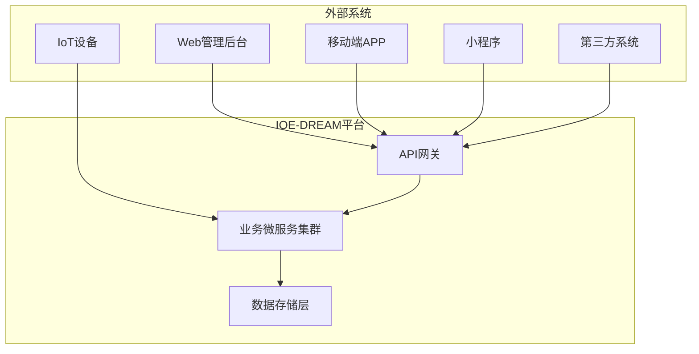
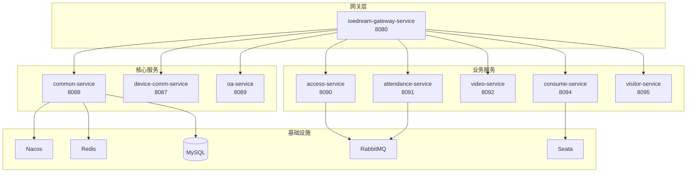
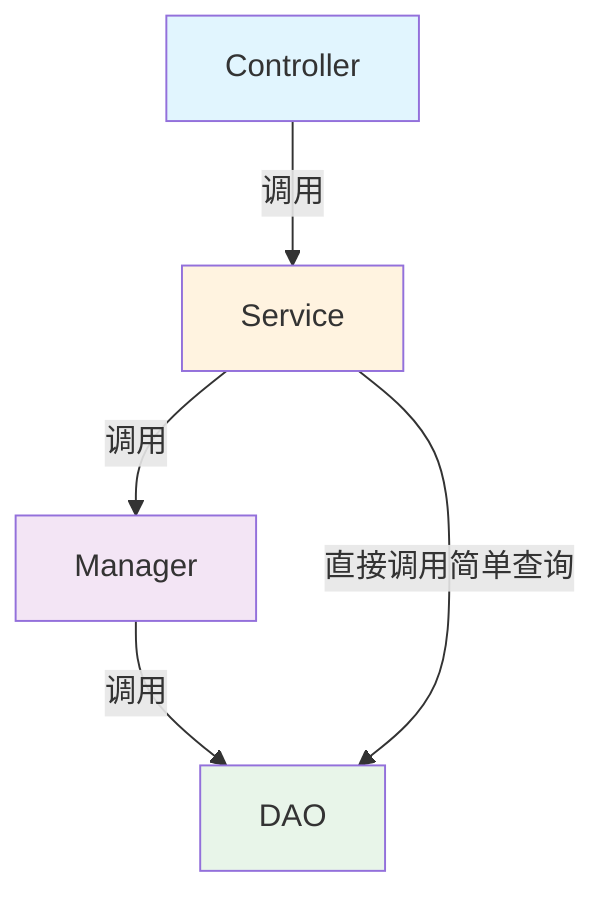
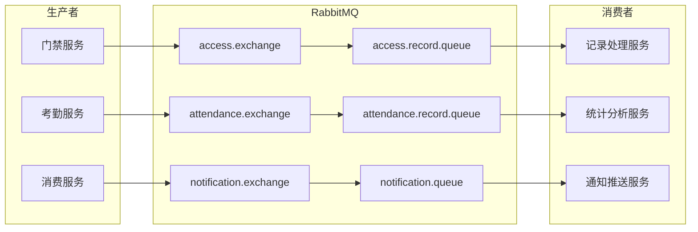
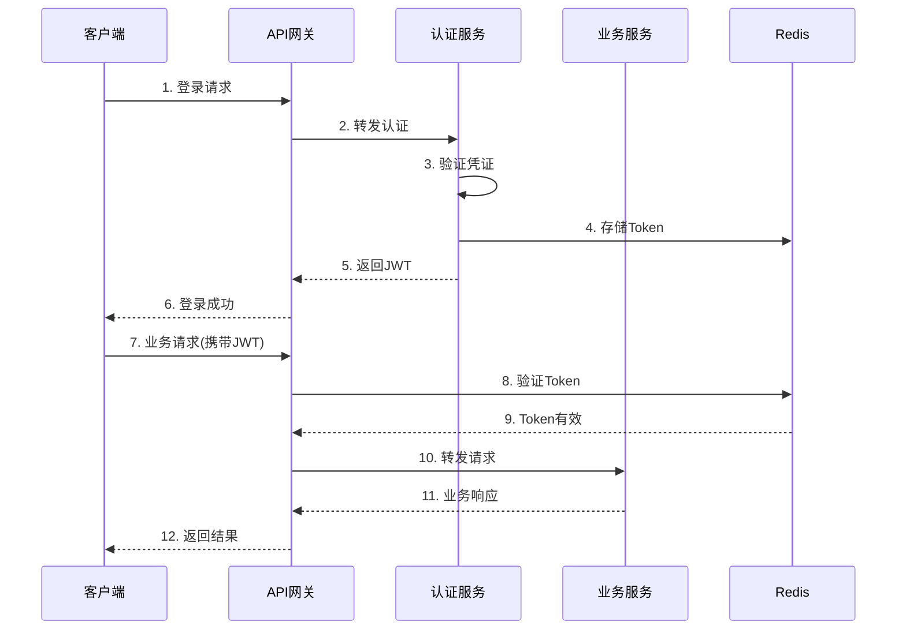

# IOE-DREAM 系统架构设计文档

> **版本**: v2.0.0  
> **更新日期**: 2025-12-17  
> **文档类型**: 系统架构设计说明书  
> **适用范围**: IOE-DREAM智慧园区一卡通管理平台全系统

---

## 1. 文档概述

### 1.1 编写目的

本文档详细描述IOE-DREAM智慧园区一卡通管理平台的系统架构设计，包括整体架构、技术选型、分层设计、部署架构等，为研发人员提供架构设计指导和开发规范参考。

### 1.2 适用对象

| 角色 | 用途 |
|------|------|
| 架构师 | 架构决策、技术选型参考 |
| 后端开发 | 微服务开发、接口实现 |
| 前端开发 | 接口对接、状态管理 |
| 运维工程师 | 部署配置、监控运维 |
| 测试工程师 | 测试策略、性能测试 |

---

## 2. 系统概述

### 2.1 系统定位

**IOE-DREAM**（Intelligent Operations & Enterprise - Digital Resource & Enterprise Application Management）是新一代**智慧园区一卡通管理平台**，集成多模态生物识别、智能门禁、无感消费、自动考勤、智能访客、视频监控等核心功能。

### 2.2 核心价值

```
┌─────────────────────────────────────────────────────────────┐
│                    IOE-DREAM 核心价值                        │
├─────────────────────────────────────────────────────────────┤
│  🔐 身份统一管理    一张脸/一张卡通行全园区                    │
│  ⚡ 无感通行体验    秒级识别，无需等待                        │
│  🛡️ 智能安全保障    AI分析+多系统联动                        │
│  📊 数据驱动决策    基于大数据的运营分析                      │
│  🚀 运营效率提升    自动化处理，降低人工成本                  │
└─────────────────────────────────────────────────────────────┘
```

### 2.3 系统边界



---

## 3. 整体架构设计

### 3.1 架构全景图

```
┌──────────────────────────────────────────────────────────────────────────────┐
│                              【接入层 - Access Layer】                        │
│  ┌─────────┐  ┌─────────┐  ┌─────────┐  ┌─────────┐  ┌─────────────────────┐ │
│  │Web管理台│  │移动端APP│  │微信小程序│  │第三方系统│  │ IoT设备(门禁/考勤) │ │
│  └────┬────┘  └────┬────┘  └────┬────┘  └────┬────┘  └──────────┬──────────┘ │
└───────┼────────────┼────────────┼────────────┼───────────────────┼───────────┘
        │            │            │            │                   │
        ▼            ▼            ▼            ▼                   ▼
┌──────────────────────────────────────────────────────────────────────────────┐
│                              【网关层 - Gateway Layer】                       │
│  ┌────────────────────────────────────────────────────────────────────────┐  │
│  │                    ioedream-gateway-service (8080)                     │  │
│  │  ┌─────────┐  ┌─────────┐  ┌─────────┐  ┌─────────┐  ┌─────────┐       │  │
│  │  │路由转发 │  │负载均衡 │  │限流熔断 │  │身份认证 │  │日志追踪 │       │  │
│  │  └─────────┘  └─────────┘  └─────────┘  └─────────┘  └─────────┘       │  │
│  └────────────────────────────────────────────────────────────────────────┘  │
└──────────────────────────────────────────────────────────────────────────────┘
                                      │
                                      ▼
┌──────────────────────────────────────────────────────────────────────────────┐
│                           【业务服务层 - Service Layer】                      │
│                                                                              │
│  ┌────────────────────────────────────────────────────────────────────────┐  │
│  │                         核心业务微服务集群                              │  │
│  │                                                                        │  │
│  │  ┌──────────────────┐  ┌──────────────────┐  ┌──────────────────┐     │  │
│  │  │ common-service   │  │ device-comm      │  │ oa-service       │     │  │
│  │  │ (8088)           │  │ (8087)           │  │ (8089)           │     │  │
│  │  │ 公共业务服务     │  │ 设备通讯服务     │  │ OA办公服务       │     │  │
│  │  └──────────────────┘  └──────────────────┘  └──────────────────┘     │  │
│  │                                                                        │  │
│  │  ┌──────────────────┐  ┌──────────────────┐  ┌──────────────────┐     │  │
│  │  │ access-service   │  │ attendance-svc   │  │ video-service    │     │  │
│  │  │ (8090)           │  │ (8091)           │  │ (8092)           │     │  │
│  │  │ 门禁管理服务     │  │ 考勤管理服务     │  │ 视频监控服务     │     │  │
│  │  └──────────────────┘  └──────────────────┘  └──────────────────┘     │  │
│  │                                                                        │  │
│  │  ┌──────────────────┐  ┌──────────────────┐                           │  │
│  │  │ consume-service  │  │ visitor-service  │                           │  │
│  │  │ (8094)           │  │ (8095)           │                           │  │
│  │  │ 消费管理服务     │  │ 访客管理服务     │                           │  │
│  │  └──────────────────┘  └──────────────────┘                           │  │
│  │                                                                        │  │
│  └────────────────────────────────────────────────────────────────────────┘  │
└──────────────────────────────────────────────────────────────────────────────┘
                                      │
                                      ▼
┌──────────────────────────────────────────────────────────────────────────────┐
│                         【基础设施层 - Infrastructure Layer】                 │
│                                                                              │
│  ┌─────────────┐  ┌─────────────┐  ┌─────────────┐  ┌─────────────┐         │
│  │   Nacos     │  │   Redis     │  │  RabbitMQ   │  │   Seata     │         │
│  │ 配置/注册   │  │ 缓存/会话   │  │  消息队列   │  │ 分布式事务  │         │
│  └─────────────┘  └─────────────┘  └─────────────┘  └─────────────┘         │
│                                                                              │
│  ┌─────────────┐  ┌─────────────┐  ┌─────────────┐  ┌─────────────┐         │
│  │   MySQL     │  │  Zipkin     │  │ Prometheus  │  │  Grafana    │         │
│  │  数据存储   │  │ 链路追踪   │  │  指标采集   │  │  可视化     │         │
│  └─────────────┘  └─────────────┘  └─────────────┘  └─────────────┘         │
└──────────────────────────────────────────────────────────────────────────────┘
```

### 3.2 微服务架构图



### 3.3 服务职责划分

| 服务名称 | 端口 | 职责范围 | 核心功能 |
|---------|------|---------|---------|
| **gateway-service** | 8080 | API网关 | 路由、限流、认证、日志 |
| **common-service** | 8088 | 公共业务 | 用户、组织、权限、字典、通知 |
| **device-comm-service** | 8087 | 设备通讯 | 协议适配、数据采集、指令下发 |
| **oa-service** | 8089 | OA办公 | 工作流、审批、表单 |
| **access-service** | 8090 | 门禁管理 | 通行记录、权限控制、防反潜 |
| **attendance-service** | 8091 | 考勤管理 | 打卡、排班、统计、异常处理 |
| **video-service** | 8092 | 视频监控 | 实时监控、录像回放、AI分析 |
| **consume-service** | 8094 | 消费管理 | 账户、支付、对账、补贴 |
| **visitor-service** | 8095 | 访客管理 | 预约、登记、审批、通行 |

---

## 4. 技术选型

### 4.1 技术栈总览

```
┌─────────────────────────────────────────────────────────────────────┐
│                        IOE-DREAM 技术栈矩阵                         │
├─────────────┬───────────────────────────────────────────────────────┤
│   层次      │                      技术选型                         │
├─────────────┼───────────────────────────────────────────────────────┤
│   前端      │ Vue 3.4 + Vite 5 + Ant Design Vue 4 + Pinia          │
│   移动端    │ uni-app 3.0 + Vue 3 + uni-ui                         │
├─────────────┼───────────────────────────────────────────────────────┤
│   网关      │ Spring Cloud Gateway 4.1                              │
│   微服务    │ Spring Boot 3.5.8 + Spring Cloud 2025.0.0            │
│   注册配置  │ Nacos 2.x (Spring Cloud Alibaba 2025.0.0.0)          │
├─────────────┼───────────────────────────────────────────────────────┤
│   持久层    │ MyBatis-Plus 3.5.15 + Druid 1.2.25                   │
│   数据库    │ MySQL 8.0.35                                          │
│   缓存      │ Redis 7.x + Caffeine 3.1.8                            │
│   消息队列  │ RabbitMQ 3.x                                          │
├─────────────┼───────────────────────────────────────────────────────┤
│   分布式事务│ Seata 2.0.0                                           │
│   容错      │ Resilience4j 2.1.0                                    │
│   链路追踪  │ Micrometer Tracing + Zipkin                           │
├─────────────┼───────────────────────────────────────────────────────┤
│   安全认证  │ Sa-Token + JWT (JJWT 0.12.6)                          │
│   API文档   │ Springdoc OpenAPI 2.6.0                               │
├─────────────┼───────────────────────────────────────────────────────┤
│   监控      │ Prometheus + Grafana + Micrometer                     │
│   日志      │ Logback + ELK                                         │
│   容器化    │ Docker + Kubernetes                                   │
└─────────────┴───────────────────────────────────────────────────────┘
```

### 4.2 核心框架版本

| 组件 | 版本 | 说明 |
|------|------|------|
| **Java** | 17 LTS | 长期支持版本 |
| **Spring Boot** | 3.5.8 | 最新稳定版 |
| **Spring Cloud** | 2025.0.0 | 最新发布版 |
| **Spring Cloud Alibaba** | 2025.0.0.0 | 完全兼容 |
| **MyBatis-Plus** | 3.5.15 | ORM框架 |
| **MySQL** | 8.0.35 | 关系数据库 |
| **Redis** | 7.x | 缓存数据库 |

### 4.3 技术选型决策

#### 4.3.1 为什么选择Spring Cloud 2025.0.0

| 特性 | 优势 |
|------|------|
| **完全兼容Spring Boot 3.5.x** | 享受最新特性，虚拟线程支持 |
| **Native Image支持** | GraalVM原生镜像，启动时间ms级 |
| **可观测性增强** | Micrometer Tracing内置支持 |
| **声明式HTTP客户端** | 简化服务间调用 |

#### 4.3.2 为什么选择MyBatis-Plus + Druid

| 特性 | 优势 |
|------|------|
| **MyBatis-Plus** | Lambda查询、自动填充、逻辑删除 |
| **Druid** | SQL监控、防注入、性能分析 |
| **统一规范** | 项目全局统一，禁止HikariCP |

#### 4.3.3 为什么选择Seata分布式事务

| 特性 | 优势 |
|------|------|
| **AT模式** | 无侵入，自动补偿 |
| **可视化控制台** | 事务状态监控 |
| **阿里背书** | 大规模生产验证 |

---

## 5. 分层架构设计

### 5.1 四层架构规范

```
┌─────────────────────────────────────────────────────────────────┐
│                    Controller 层 - 接口控制层                    │
│  职责：接收HTTP请求、参数验证、调用Service、封装响应             │
│  注解：@RestController、@RequestMapping、@Valid                  │
│  规范：禁止包含业务逻辑，禁止直接调用DAO                         │
└─────────────────────────────────────────────────────────────────┘
                              │
                              ▼
┌─────────────────────────────────────────────────────────────────┐
│                    Service 层 - 核心业务层                       │
│  职责：核心业务逻辑、事务管理、调用Manager                       │
│  注解：@Service、@Transactional                                  │
│  规范：业务逻辑入口，管理事务边界                                │
└─────────────────────────────────────────────────────────────────┘
                              │
                              ▼
┌─────────────────────────────────────────────────────────────────┐
│                    Manager 层 - 业务编排层                       │
│  职责：复杂流程编排、多DAO数据组装、缓存管理、第三方集成         │
│  规范：纯Java类（common中）或@Component（微服务中）              │
│  特点：可被多个Service复用                                       │
└─────────────────────────────────────────────────────────────────┘
                              │
                              ▼
┌─────────────────────────────────────────────────────────────────┐
│                    DAO 层 - 数据访问层                           │
│  职责：数据库CRUD、复杂SQL查询                                   │
│  注解：@Mapper (禁止@Repository)                                 │
│  规范：继承BaseMapper<Entity>，使用LambdaQueryWrapper            │
└─────────────────────────────────────────────────────────────────┘
```

### 5.2 层间调用规范



### 5.3 代码模板示例

#### Controller层

```java
@RestController
@RequestMapping("/api/v1/users")
@Tag(name = "用户管理")
public class UserController {

    @Resource
    private UserService userService;

    @GetMapping("/{id}")
    @Operation(summary = "获取用户详情")
    public ResponseDTO<UserVO> getById(@PathVariable Long id) {
        return ResponseDTO.ok(userService.getById(id));
    }

    @PostMapping
    @Operation(summary = "创建用户")
    public ResponseDTO<Long> add(@Valid @RequestBody UserAddForm form) {
        return ResponseDTO.ok(userService.add(form));
    }
}
```

#### Service层

```java
@Service
@Transactional(rollbackFor = Exception.class)
public class UserServiceImpl implements UserService {

    @Resource
    private UserDao userDao;
    
    @Resource
    private UserManager userManager;

    @Override
    public UserVO getById(Long id) {
        UserEntity entity = userDao.selectById(id);
        if (entity == null) {
            throw new BusinessException("USER_NOT_FOUND", "用户不存在");
        }
        return userManager.convertToVO(entity);
    }
}
```

#### Manager层

```java
// microservices-common中的Manager（纯Java类）
public class UserManager {
    
    private final UserDao userDao;
    private final DepartmentDao departmentDao;
    
    public UserManager(UserDao userDao, DepartmentDao departmentDao) {
        this.userDao = userDao;
        this.departmentDao = departmentDao;
    }
    
    public UserVO convertToVO(UserEntity entity) {
        UserVO vo = new UserVO();
        BeanUtils.copyProperties(entity, vo);
        // 组装部门信息
        if (entity.getDepartmentId() != null) {
            DepartmentEntity dept = departmentDao.selectById(entity.getDepartmentId());
            vo.setDepartmentName(dept != null ? dept.getName() : null);
        }
        return vo;
    }
}
```

#### DAO层

```java
@Mapper
public interface UserDao extends BaseMapper<UserEntity> {

    @Transactional(readOnly = true)
    default List<UserEntity> selectByDepartmentId(Long departmentId) {
        return selectList(new LambdaQueryWrapper<UserEntity>()
                .eq(UserEntity::getDepartmentId, departmentId)
                .eq(UserEntity::getDeletedFlag, 0)
                .orderByDesc(UserEntity::getCreateTime));
    }
}
```

---

## 6. 数据架构设计

### 6.1 数据库架构

```
┌─────────────────────────────────────────────────────────────────┐
│                      MySQL 数据库架构                            │
├─────────────────────────────────────────────────────────────────┤
│                                                                 │
│  ┌─────────────────┐  ┌─────────────────┐  ┌─────────────────┐ │
│  │  ioedream_common │  │ ioedream_access │  │ioedream_attend │ │
│  │  ───────────────│  │  ───────────────│  │ ───────────────│ │
│  │  t_common_user  │  │  t_access_record│  │t_attend_record │ │
│  │  t_common_dept  │  │  t_access_device│  │t_attend_shift  │ │
│  │  t_common_area  │  │  t_access_perm  │  │t_attend_rule   │ │
│  │  t_common_device│  │                 │  │                │ │
│  └─────────────────┘  └─────────────────┘  └─────────────────┘ │
│                                                                 │
│  ┌─────────────────┐  ┌─────────────────┐  ┌─────────────────┐ │
│  │ioedream_consume │  │ioedream_visitor │  │ ioedream_video │ │
│  │  ───────────────│  │  ───────────────│  │ ───────────────│ │
│  │  t_consume_acct │  │  t_visitor_info │  │ t_video_device │ │
│  │  t_consume_rec  │  │  t_visitor_appt │  │ t_video_record │ │
│  │  t_consume_pay  │  │  t_visitor_reg  │  │ t_video_alarm  │ │
│  └─────────────────┘  └─────────────────┘  └─────────────────┘ │
│                                                                 │
└─────────────────────────────────────────────────────────────────┘
```

### 6.2 缓存架构

```
┌─────────────────────────────────────────────────────────────────┐
│                      多级缓存架构                                │
├─────────────────────────────────────────────────────────────────┤
│                                                                 │
│    ┌─────────────┐                                              │
│    │   L1 缓存   │  Caffeine 本地缓存                           │
│    │  (毫秒级)   │  TTL: 5分钟，容量: 10000                     │
│    └──────┬──────┘                                              │
│           │ 未命中                                              │
│           ▼                                                     │
│    ┌─────────────┐                                              │
│    │   L2 缓存   │  Redis 分布式缓存                            │
│    │  (毫秒级)   │  TTL: 30分钟，集群模式                       │
│    └──────┬──────┘                                              │
│           │ 未命中                                              │
│           ▼                                                     │
│    ┌─────────────┐                                              │
│    │   数据库    │  MySQL 8.0                                   │
│    │            │  主从复制，读写分离                            │
│    └─────────────┘                                              │
│                                                                 │
└─────────────────────────────────────────────────────────────────┘
```

### 6.3 消息队列架构



---

## 7. 部署架构设计

### 7.1 Kubernetes部署架构

```
┌─────────────────────────────────────────────────────────────────────┐
│                     Kubernetes 集群部署架构                          │
├─────────────────────────────────────────────────────────────────────┤
│                                                                     │
│  ┌─────────────────────────────────────────────────────────────┐   │
│  │                        Ingress Controller                     │   │
│  │                     (Nginx Ingress / Traefik)                │   │
│  └─────────────────────────────────────────────────────────────┘   │
│                              │                                      │
│                              ▼                                      │
│  ┌─────────────────────────────────────────────────────────────┐   │
│  │                      Service (ClusterIP)                      │   │
│  └─────────────────────────────────────────────────────────────┘   │
│                              │                                      │
│    ┌─────────────────────────┼─────────────────────────┐           │
│    │                         │                         │           │
│    ▼                         ▼                         ▼           │
│  ┌───────────────┐  ┌───────────────┐  ┌───────────────┐          │
│  │   Namespace   │  │   Namespace   │  │   Namespace   │          │
│  │   ioedream    │  │   middleware  │  │   monitoring  │          │
│  │               │  │               │  │               │          │
│  │ ┌───────────┐│  │ ┌───────────┐│  │ ┌───────────┐│          │
│  │ │Deployment ││  │ │StatefulSet││  │ │Deployment ││          │
│  │ │ gateway   ││  │ │  mysql    ││  │ │prometheus ││          │
│  │ │ common    ││  │ │  redis    ││  │ │ grafana   ││          │
│  │ │ access    ││  │ │  rabbitmq ││  │ │  zipkin   ││          │
│  │ │ ...       ││  │ │  nacos    ││  │ │           ││          │
│  │ └───────────┘│  │ └───────────┘│  │ └───────────┘│          │
│  └───────────────┘  └───────────────┘  └───────────────┘          │
│                                                                     │
│  ┌─────────────────────────────────────────────────────────────┐   │
│  │                    PersistentVolume (NFS/Ceph)               │   │
│  └─────────────────────────────────────────────────────────────┘   │
│                                                                     │
└─────────────────────────────────────────────────────────────────────┘
```

### 7.2 服务副本配置

| 服务 | 最小副本 | 最大副本 | CPU请求 | 内存请求 |
|------|---------|---------|---------|---------|
| gateway-service | 2 | 10 | 500m | 512Mi |
| common-service | 2 | 8 | 500m | 1Gi |
| access-service | 2 | 8 | 500m | 1Gi |
| attendance-service | 2 | 6 | 500m | 1Gi |
| consume-service | 2 | 8 | 500m | 1Gi |
| visitor-service | 2 | 4 | 500m | 512Mi |
| video-service | 2 | 6 | 1000m | 2Gi |

### 7.3 高可用设计

```
┌─────────────────────────────────────────────────────────────────┐
│                       高可用架构设计                             │
├─────────────────────────────────────────────────────────────────┤
│                                                                 │
│  【负载均衡】                                                    │
│    • 入口层: Nginx/SLB 多可用区部署                             │
│    • 服务层: Spring Cloud LoadBalancer                          │
│    • 数据层: MySQL主从 + Redis Cluster                          │
│                                                                 │
│  【容错机制】                                                    │
│    • 熔断: Resilience4j CircuitBreaker                          │
│    • 限流: Gateway RateLimiter                                  │
│    • 降级: 服务降级 + 兜底数据                                  │
│    • 重试: 智能重试 + 指数退避                                  │
│                                                                 │
│  【数据一致性】                                                  │
│    • 分布式事务: Seata AT模式                                   │
│    • 消息最终一致: RabbitMQ + 补偿机制                          │
│    • 缓存一致性: 延迟双删 + 消息通知                            │
│                                                                 │
│  【监控告警】                                                    │
│    • 指标采集: Prometheus + Micrometer                          │
│    • 链路追踪: Zipkin + Brave                                   │
│    • 日志聚合: ELK Stack                                        │
│    • 告警通知: AlertManager                                     │
│                                                                 │
└─────────────────────────────────────────────────────────────────┘
```

---

## 8. 安全架构设计

### 8.1 安全防护体系

```
┌─────────────────────────────────────────────────────────────────┐
│                      安全防护体系架构                            │
├─────────────────────────────────────────────────────────────────┤
│                                                                 │
│  ┌─────────────────────────────────────────────────────────┐   │
│  │                    网络安全层                             │   │
│  │  • WAF防护  • DDoS防护  • SSL/TLS加密  • VPC隔离        │   │
│  └─────────────────────────────────────────────────────────┘   │
│                              │                                  │
│                              ▼                                  │
│  ┌─────────────────────────────────────────────────────────┐   │
│  │                    接入安全层                             │   │
│  │  • API限流  • 身份认证  • 权限校验  • 日志审计          │   │
│  └─────────────────────────────────────────────────────────┘   │
│                              │                                  │
│                              ▼                                  │
│  ┌─────────────────────────────────────────────────────────┐   │
│  │                    应用安全层                             │   │
│  │  • 参数校验  • SQL防注入  • XSS防护  • CSRF防护         │   │
│  └─────────────────────────────────────────────────────────┘   │
│                              │                                  │
│                              ▼                                  │
│  ┌─────────────────────────────────────────────────────────┐   │
│  │                    数据安全层                             │   │
│  │  • 数据加密  • 字段脱敏  • 访问控制  • 备份恢复         │   │
│  └─────────────────────────────────────────────────────────┘   │
│                                                                 │
└─────────────────────────────────────────────────────────────────┘
```

### 8.2 认证授权流程



---

## 9. 性能设计

### 9.1 性能指标要求

| 指标类型 | 指标项 | 目标值 |
|---------|--------|--------|
| **响应时间** | API平均响应 | < 200ms |
| | API P99响应 | < 500ms |
| | 打卡响应 | < 300ms |
| **吞吐量** | 网关TPS | > 5000 |
| | 打卡TPS | > 1000 |
| | 消费TPS | > 500 |
| **可用性** | 系统可用性 | ≥ 99.9% |
| | 数据一致性 | 强一致 |

### 9.2 性能优化策略

| 层次 | 优化策略 |
|------|---------|
| **接口层** | 异步处理、批量接口、响应压缩 |
| **服务层** | 并行调用、缓存预热、懒加载 |
| **数据层** | 索引优化、SQL优化、分库分表 |
| **缓存层** | 多级缓存、热点数据预加载 |
| **网络层** | 连接池复用、长连接、CDN加速 |

---

## 10. 资源优化架构设计

### 10.1 统一线程池架构

**设计原则**: 将分散的7+个线程池整合为3个统一线程池，降低资源消耗

```
┌─────────────────────────────────────────────────────────────────┐
│                    统一线程池架构设计                            │
├─────────────────────────────────────────────────────────────────┤
│                                                                 │
│  ┌─────────────────────────────────────────────────────────┐   │
│  │                    coreExecutor (核心业务池)             │   │
│  │  ├── 核心线程: CPU + 1                                  │   │
│  │  ├── 最大线程: CPU × 2                                  │   │
│  │  ├── 队列容量: 500                                      │   │
│  │  ├── 适用场景: API请求、业务计算、数据处理              │   │
│  │  └── 拒绝策略: CallerRunsPolicy                         │   │
│  └─────────────────────────────────────────────────────────┘   │
│                                                                 │
│  ┌─────────────────────────────────────────────────────────┐   │
│  │                    ioExecutor (IO密集型池)               │   │
│  │  ├── 核心线程: CPU × 2                                  │   │
│  │  ├── 最大线程: CPU × 4                                  │   │
│  │  ├── 队列容量: 1000                                     │   │
│  │  ├── 适用场景: 数据库查询、外部API、文件IO              │   │
│  │  └── 拒绝策略: CallerRunsPolicy                         │   │
│  └─────────────────────────────────────────────────────────┘   │
│                                                                 │
│  ┌─────────────────────────────────────────────────────────┐   │
│  │                    scheduledExecutor (定时任务池)        │   │
│  │  ├── 核心线程: 5                                        │   │
│  │  ├── 最大线程: 20                                       │   │
│  │  ├── 队列容量: 100                                      │   │
│  │  ├── 适用场景: 定时任务、调度任务                       │   │
│  │  └── 拒绝策略: CallerRunsPolicy                         │   │
│  └─────────────────────────────────────────────────────────┘   │
│                                                                 │
│  预期效果: 线程数从~300减少到~80，内存节省200-500MB           │
│                                                                 │
└─────────────────────────────────────────────────────────────────┘
```

### 10.2 多级缓存优化架构

```
┌─────────────────────────────────────────────────────────────────┐
│                    优化后的多级缓存架构                          │
├─────────────────────────────────────────────────────────────────┤
│                                                                 │
│    ┌─────────────────────────────────────────────────────┐     │
│    │                   L1 本地缓存 (Caffeine)             │     │
│    │  ├── 最大容量: 5000 (从10000优化)                   │     │
│    │  ├── 写入过期: 5分钟                                │     │
│    │  ├── 访问续期: 3分钟                                │     │
│    │  └── 内存占用: ~400MB (从~800MB优化)                │     │
│    └────────────────────┬────────────────────────────────┘     │
│                         │ 未命中                                │
│                         ▼                                       │
│    ┌─────────────────────────────────────────────────────┐     │
│    │                   L2 分布式缓存 (Redis)             │     │
│    │  ├── 默认TTL: 30分钟                                │     │
│    │  ├── Key前缀: ioedream:{service}:{domain}          │     │
│    │  └── 内存占用: ~1.2GB (从~2GB优化)                  │     │
│    └────────────────────┬────────────────────────────────┘     │
│                         │ 未命中                                │
│                         ▼                                       │
│    ┌─────────────────────────────────────────────────────┐     │
│    │                   MySQL 数据库                       │     │
│    │  └── 连接池: Druid (按服务分级配置)                 │     │
│    └─────────────────────────────────────────────────────┘     │
│                                                                 │
│  缓存域配置:                                                    │
│  ├── user: L1=1000, L2-TTL=1h                                  │
│  ├── permission: L1=2000, L2-TTL=30m                           │
│  ├── device: L1=500, L2-TTL=10m                                │
│  └── config: L1=500, L2-TTL=24h                                │
│                                                                 │
└─────────────────────────────────────────────────────────────────┘
```

### 10.3 JVM配置规范

| 服务级别 | 服务列表 | Xms | Xmx | Metaspace | GC策略 |
|---------|---------|-----|-----|-----------|--------|
| 基础服务 | gateway, device-comm, visitor | 256m | 512m | 128m | G1 |
| 核心服务 | common, access, attendance, consume | 512m | 1g | 192m | G1 |
| 重型服务 | video, oa | 1g | 2g | 256m | G1 |

**统一JVM参数模板**:

```bash
# 基础服务配置
-Xms256m -Xmx512m -XX:MaxMetaspaceSize=128m
-XX:+UseG1GC -XX:MaxGCPauseMillis=150
-XX:+UseStringDeduplication -XX:+HeapDumpOnOutOfMemoryError

# 核心服务配置
-Xms512m -Xmx1g -XX:MaxMetaspaceSize=192m
-XX:+UseG1GC -XX:MaxGCPauseMillis=200 -XX:G1HeapRegionSize=8m
-XX:+UseStringDeduplication -XX:+HeapDumpOnOutOfMemoryError

# 重型服务配置
-Xms1g -Xmx2g -XX:MaxMetaspaceSize=256m
-XX:+UseG1GC -XX:MaxGCPauseMillis=200 -XX:G1HeapRegionSize=16m
-XX:InitiatingHeapOccupancyPercent=45
-XX:+UseStringDeduplication -XX:+HeapDumpOnOutOfMemoryError
```

### 10.4 数据库连接池优化配置

| 服务 | max-active | min-idle | 说明 |
|------|-----------|----------|------|
| gateway | 10 | 3 | 无直接DB访问 |
| common | 30 | 10 | 核心数据服务 |
| access | 25 | 8 | 高频写入 |
| attendance | 25 | 8 | 批量查询 |
| consume | 30 | 10 | 事务密集 |
| visitor | 15 | 5 | 中等负载 |
| video | 15 | 5 | 主要读取 |
| oa | 20 | 5 | 工作流事务 |

### 10.5 资源优化预期效果

| 指标 | 优化前 | 优化后 | 降幅 |
|------|--------|--------|------|
| 总内存占用 | 12-16GB | 6-9GB | 40-50% |
| 线程总数 | ~300 | ~80 | 73% |
| 数据库连接 | ~200 | ~120 | 40% |
| GC暂停时间 | 200-500ms | 100-200ms | 50% |
| Redis内存 | ~2GB | ~1.2GB | 40% |

---

## 11. 架构优化建议

### 11.1 基于最佳实践的优化建议

| 优化项 | 当前状态 | 建议改进 | 优先级 |
|--------|---------|---------|--------|
| **服务发现** | Nacos | 维持现状，已是最佳选择 | - |
| **配置管理** | Nacos | 增加配置加密存储 | P1 |
| **API网关** | Spring Cloud Gateway | 增加响应缓存 | P2 |
| **熔断限流** | Resilience4j | 完善降级策略 | P1 |
| **分布式追踪** | Zipkin | 考虑SkyWalking（更强APM能力） | P2 |
| **日志聚合** | Logback | 增加ELK集成 | P1 |

### 11.2 架构演进路线

```
Phase 1 (当前)          Phase 2 (3个月)         Phase 3 (6个月)
─────────────────       ─────────────────       ─────────────────
✓ 微服务基础架构        □ 服务网格(Istio)       □ Serverless组件
✓ 四层架构规范          □ 完善可观测性          □ 多租户架构
✓ Nacos注册配置         □ 混沌工程实践          □ 边缘计算支持
✓ 分布式事务            □ 自动化运维            □ AI智能调度
✓ 资源优化架构          □ 虚拟线程支持          □ 原生镜像
```

---

## 12. 附录

### 12.1 相关文档

| 文档名称 | 路径 | 说明 |
|---------|------|------|
| 详细设计文档 | `documentation/architecture/02-详细设计文档.md` | 模块设计、类图、时序图 |
| API接口文档 | `documentation/api/` | 接口规范定义 |
| 数据库设计 | `documentation/database/` | 表结构设计 |
| 部署手册 | `documentation/deployment/` | 部署配置指南 |

### 11.2 版本历史

| 版本 | 日期 | 修改内容 | 修改人 |
|------|------|---------|--------|
| v1.0.0 | 2025-12-01 | 初始版本 | 架构组 |
| v2.0.0 | 2025-12-17 | 全面完善，增加最佳实践 | 架构组 |

---

**文档维护**: IOE-DREAM 架构委员会  
**最后更新**: 2025-12-17
