# IOE-DREAM 详细设计文档

> **版本**: v2.0.0  
> **更新日期**: 2025-12-17  
> **文档类型**: 详细设计说明书  
> **适用范围**: IOE-DREAM智慧园区一卡通管理平台

---

## 1. 文档概述

### 1.1 编写目的

本文档详细描述IOE-DREAM系统各核心模块的详细设计，包括类图、时序图、状态图、数据流图等，为研发人员提供具体实现指导。

### 1.2 文档范围

| 模块 | 设计内容 |
|------|---------|
| 公共模块 | 用户、组织、权限、认证 |
| 门禁模块 | 通行控制、权限管理、防反潜 |
| 考勤模块 | 打卡、排班、异常处理 |
| 消费模块 | 账户、支付、对账 |
| 访客模块 | 预约、登记、审批 |
| 视频模块 | 监控、AI分析、告警 |

---

## 2. 公共模块设计

### 2.1 用户管理类图

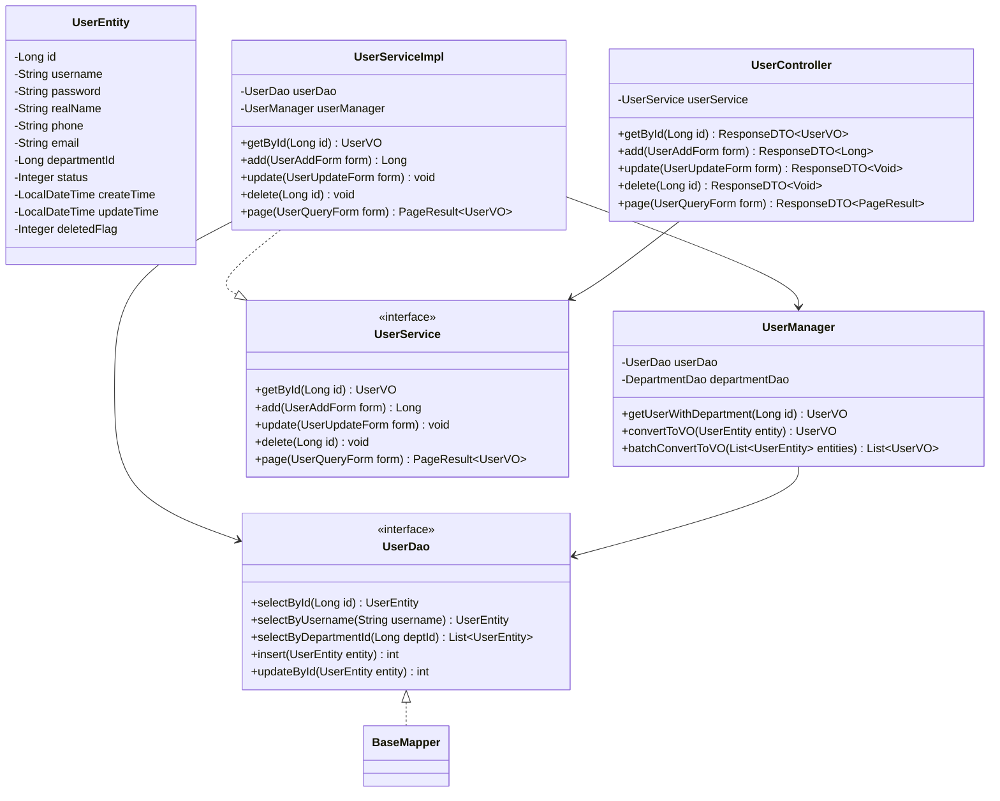
```mermaid
classDiagram
    class UserEntity {
        -Long id
        -String username
        -String password
        -String realName
        -String phone
        -String email
        -Long departmentId
        -Integer status
        -LocalDateTime createTime
        -LocalDateTime updateTime
        -Integer deletedFlag
    }
    
    class UserDao {
        <<interface>>
        +selectById(Long id) UserEntity
        +selectByUsername(String username) UserEntity
        +selectByDepartmentId(Long deptId) List~UserEntity~
        +insert(UserEntity entity) int
        +updateById(UserEntity entity) int
    }
    
    class UserManager {
        -UserDao userDao
        -DepartmentDao departmentDao
        +getUserWithDepartment(Long id) UserVO
        +convertToVO(UserEntity entity) UserVO
        +batchConvertToVO(List~UserEntity~ entities) List~UserVO~
    }
    
    class UserService {
        <<interface>>
        +getById(Long id) UserVO
        +add(UserAddForm form) Long
        +update(UserUpdateForm form) void
        +delete(Long id) void
        +page(UserQueryForm form) PageResult~UserVO~
    }
    
    class UserServiceImpl {
        -UserDao userDao
        -UserManager userManager
        +getById(Long id) UserVO
        +add(UserAddForm form) Long
        +update(UserUpdateForm form) void
        +delete(Long id) void
        +page(UserQueryForm form) PageResult~UserVO~
    }
    
    class UserController {
        -UserService userService
        +getById(Long id) ResponseDTO~UserVO~
        +add(UserAddForm form) ResponseDTO~Long~
        +update(UserUpdateForm form) ResponseDTO~Void~
        +delete(Long id) ResponseDTO~Void~
        +page(UserQueryForm form) ResponseDTO~PageResult~
    }
    
    UserDao <|.. BaseMapper
    UserServiceImpl ..|> UserService
    UserServiceImpl --> UserDao
    UserServiceImpl --> UserManager
    UserManager --> UserDao
    UserController --> UserService
```

### 2.2 认证授权时序图

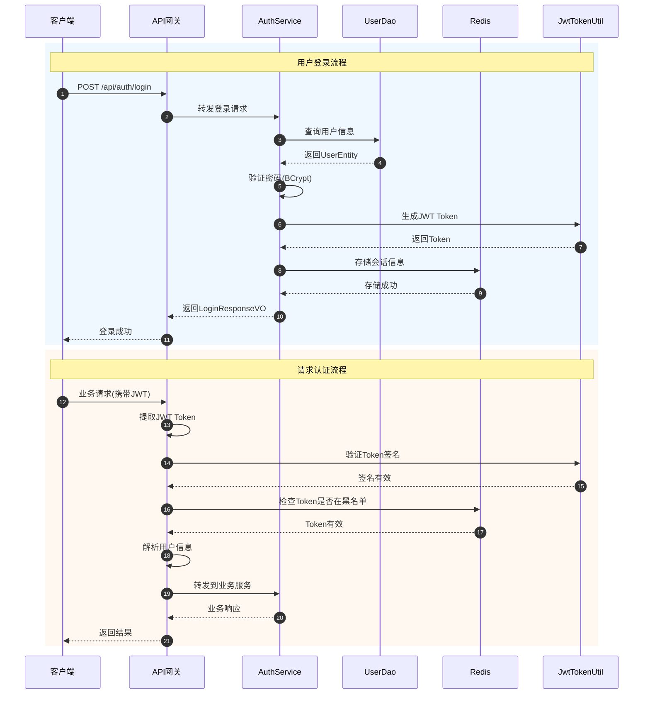
```mermaid
sequenceDiagram
    autonumber
    participant C as 客户端
    participant G as API网关
    participant A as AuthService
    participant U as UserDao
    participant R as Redis
    participant J as JwtTokenUtil
    
    rect rgb(240, 248, 255)
        Note over C,J: 用户登录流程
        C->>G: POST /api/auth/login
        G->>A: 转发登录请求
        A->>U: 查询用户信息
        U-->>A: 返回UserEntity
        A->>A: 验证密码(BCrypt)
        A->>J: 生成JWT Token
        J-->>A: 返回Token
        A->>R: 存储会话信息
        R-->>A: 存储成功
        A-->>G: 返回LoginResponseVO
        G-->>C: 登录成功
    end
    
    rect rgb(255, 248, 240)
        Note over C,J: 请求认证流程
        C->>G: 业务请求(携带JWT)
        G->>G: 提取JWT Token
        G->>J: 验证Token签名
        J-->>G: 签名有效
        G->>R: 检查Token是否在黑名单
        R-->>G: Token有效
        G->>G: 解析用户信息
        G->>A: 转发到业务服务
        A-->>G: 业务响应
        G-->>C: 返回结果
    end
```

### 2.3 权限校验流程

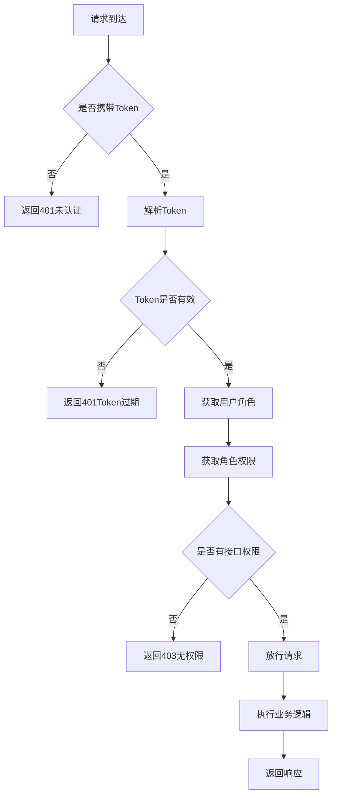
```mermaid
flowchart TD
    A[请求到达] --> B{是否携带Token}
    B -->|否| C[返回401未认证]
    B -->|是| D[解析Token]
    D --> E{Token是否有效}
    E -->|否| F[返回401Token过期]
    E -->|是| G[获取用户角色]
    G --> H[获取角色权限]
    H --> I{是否有接口权限}
    I -->|否| J[返回403无权限]
    I -->|是| K[放行请求]
    K --> L[执行业务逻辑]
    L --> M[返回响应]
```

---

## 3. 门禁模块设计

### 3.1 门禁核心类图

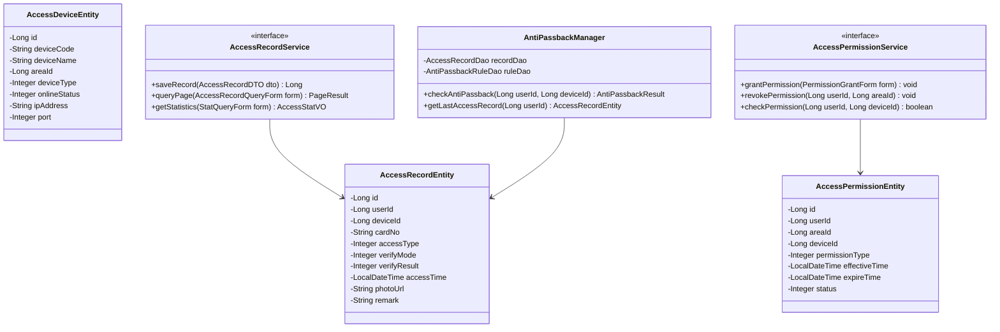
```mermaid
classDiagram
    class AccessRecordEntity {
        -Long id
        -Long userId
        -Long deviceId
        -String cardNo
        -Integer accessType
        -Integer verifyMode
        -Integer verifyResult
        -LocalDateTime accessTime
        -String photoUrl
        -String remark
    }
    
    class AccessPermissionEntity {
        -Long id
        -Long userId
        -Long areaId
        -Long deviceId
        -Integer permissionType
        -LocalDateTime effectiveTime
        -LocalDateTime expireTime
        -Integer status
    }
    
    class AccessDeviceEntity {
        -Long id
        -String deviceCode
        -String deviceName
        -Long areaId
        -Integer deviceType
        -Integer onlineStatus
        -String ipAddress
        -Integer port
    }
    
    class AccessRecordService {
        <<interface>>
        +saveRecord(AccessRecordDTO dto) Long
        +queryPage(AccessRecordQueryForm form) PageResult
        +getStatistics(StatQueryForm form) AccessStatVO
    }
    
    class AccessPermissionService {
        <<interface>>
        +grantPermission(PermissionGrantForm form) void
        +revokePermission(Long userId, Long areaId) void
        +checkPermission(Long userId, Long deviceId) boolean
    }
    
    class AntiPassbackManager {
        -AccessRecordDao recordDao
        -AntiPassbackRuleDao ruleDao
        +checkAntiPassback(Long userId, Long deviceId) AntiPassbackResult
        +getLastAccessRecord(Long userId) AccessRecordEntity
    }
    
    AccessRecordService --> AccessRecordEntity
    AccessPermissionService --> AccessPermissionEntity
    AntiPassbackManager --> AccessRecordEntity
```

### 3.2 门禁通行时序图

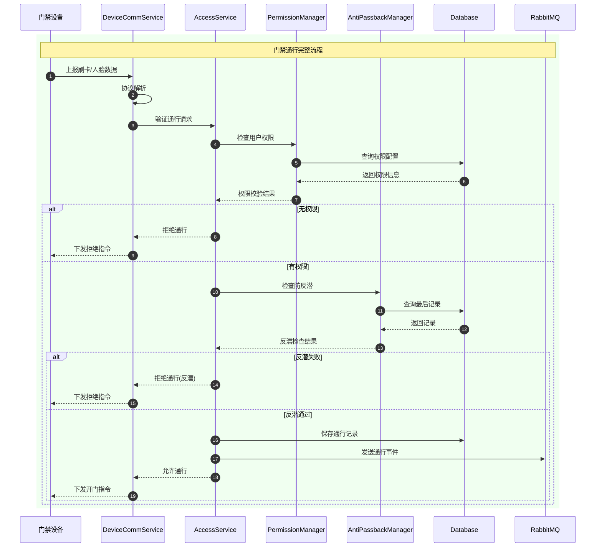
```mermaid
sequenceDiagram
    autonumber
    participant D as 门禁设备
    participant DC as DeviceCommService
    participant AS as AccessService
    participant PM as PermissionManager
    participant AP as AntiPassbackManager
    participant DB as Database
    participant MQ as RabbitMQ
    
    rect rgb(240, 255, 240)
        Note over D,MQ: 门禁通行完整流程
        D->>DC: 上报刷卡/人脸数据
        DC->>DC: 协议解析
        DC->>AS: 验证通行请求
        
        AS->>PM: 检查用户权限
        PM->>DB: 查询权限配置
        DB-->>PM: 返回权限信息
        PM-->>AS: 权限校验结果
        
        alt 无权限
            AS-->>DC: 拒绝通行
            DC-->>D: 下发拒绝指令
        else 有权限
            AS->>AP: 检查防反潜
            AP->>DB: 查询最后记录
            DB-->>AP: 返回记录
            AP-->>AS: 反潜检查结果
            
            alt 反潜失败
                AS-->>DC: 拒绝通行(反潜)
                DC-->>D: 下发拒绝指令
            else 反潜通过
                AS->>DB: 保存通行记录
                AS->>MQ: 发送通行事件
                AS-->>DC: 允许通行
                DC-->>D: 下发开门指令
            end
        end
    end
```

### 3.3 门禁状态机

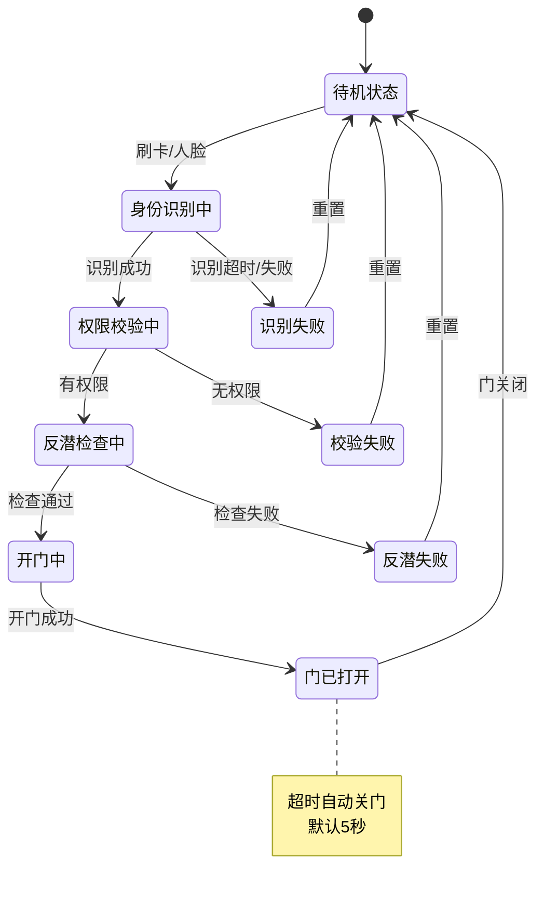
```mermaid
stateDiagram-v2
    [*] --> 待机状态
    
    待机状态 --> 身份识别中: 刷卡/人脸
    身份识别中 --> 权限校验中: 识别成功
    身份识别中 --> 识别失败: 识别超时/失败
    
    权限校验中 --> 反潜检查中: 有权限
    权限校验中 --> 校验失败: 无权限
    
    反潜检查中 --> 开门中: 检查通过
    反潜检查中 --> 反潜失败: 检查失败
    
    开门中 --> 门已打开: 开门成功
    门已打开 --> 待机状态: 门关闭
    
    识别失败 --> 待机状态: 重置
    校验失败 --> 待机状态: 重置
    反潜失败 --> 待机状态: 重置
    
    note right of 门已打开
        超时自动关门
        默认5秒
    end note
```

---

## 4. 考勤模块设计

### 4.1 考勤核心类图

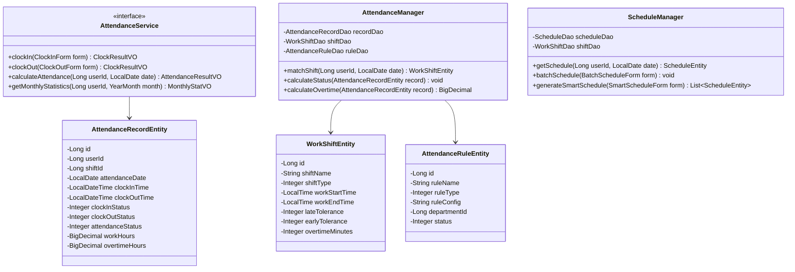
```mermaid
classDiagram
    class AttendanceRecordEntity {
        -Long id
        -Long userId
        -Long shiftId
        -LocalDate attendanceDate
        -LocalDateTime clockInTime
        -LocalDateTime clockOutTime
        -Integer clockInStatus
        -Integer clockOutStatus
        -Integer attendanceStatus
        -BigDecimal workHours
        -BigDecimal overtimeHours
    }
    
    class WorkShiftEntity {
        -Long id
        -String shiftName
        -Integer shiftType
        -LocalTime workStartTime
        -LocalTime workEndTime
        -Integer lateTolerance
        -Integer earlyTolerance
        -Integer overtimeMinutes
    }
    
    class AttendanceRuleEntity {
        -Long id
        -String ruleName
        -Integer ruleType
        -String ruleConfig
        -Long departmentId
        -Integer status
    }
    
    class AttendanceService {
        <<interface>>
        +clockIn(ClockInForm form) ClockResultVO
        +clockOut(ClockOutForm form) ClockResultVO
        +calculateAttendance(Long userId, LocalDate date) AttendanceResultVO
        +getMonthlyStatistics(Long userId, YearMonth month) MonthlyStatVO
    }
    
    class AttendanceManager {
        -AttendanceRecordDao recordDao
        -WorkShiftDao shiftDao
        -AttendanceRuleDao ruleDao
        +matchShift(Long userId, LocalDate date) WorkShiftEntity
        +calculateStatus(AttendanceRecordEntity record) void
        +calculateOvertime(AttendanceRecordEntity record) BigDecimal
    }
    
    class ScheduleManager {
        -ScheduleDao scheduleDao
        -WorkShiftDao shiftDao
        +getSchedule(Long userId, LocalDate date) ScheduleEntity
        +batchSchedule(BatchScheduleForm form) void
        +generateSmartSchedule(SmartScheduleForm form) List~ScheduleEntity~
    }
    
    AttendanceService --> AttendanceRecordEntity
    AttendanceManager --> WorkShiftEntity
    AttendanceManager --> AttendanceRuleEntity
```

### 4.2 打卡流程时序图

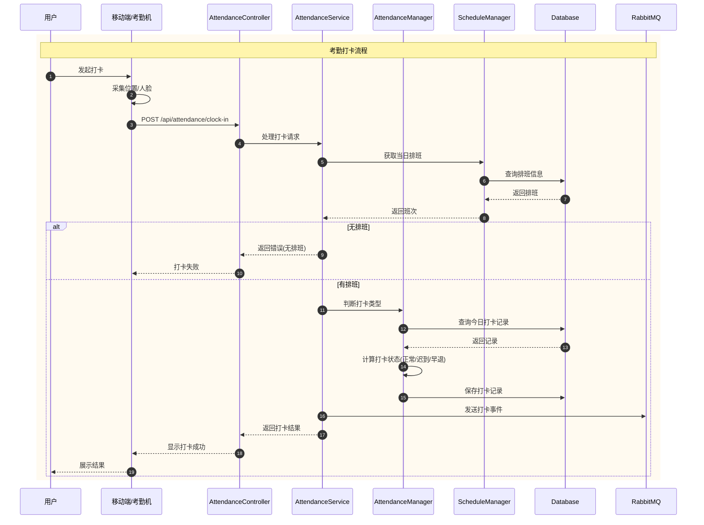
```mermaid
sequenceDiagram
    autonumber
    participant U as 用户
    participant M as 移动端/考勤机
    participant C as AttendanceController
    participant S as AttendanceService
    participant AM as AttendanceManager
    participant SM as ScheduleManager
    participant DB as Database
    participant MQ as RabbitMQ
    
    rect rgb(255, 250, 240)
        Note over U,MQ: 考勤打卡流程
        U->>M: 发起打卡
        M->>M: 采集位置/人脸
        M->>C: POST /api/attendance/clock-in
        
        C->>S: 处理打卡请求
        S->>SM: 获取当日排班
        SM->>DB: 查询排班信息
        DB-->>SM: 返回排班
        SM-->>S: 返回班次
        
        alt 无排班
            S-->>C: 返回错误(无排班)
            C-->>M: 打卡失败
        else 有排班
            S->>AM: 判断打卡类型
            AM->>DB: 查询今日打卡记录
            DB-->>AM: 返回记录
            
            AM->>AM: 计算打卡状态(正常/迟到/早退)
            AM->>DB: 保存打卡记录
            
            S->>MQ: 发送打卡事件
            S-->>C: 返回打卡结果
            C-->>M: 显示打卡成功
            M-->>U: 展示结果
        end
    end
```

### 4.3 考勤计算状态机

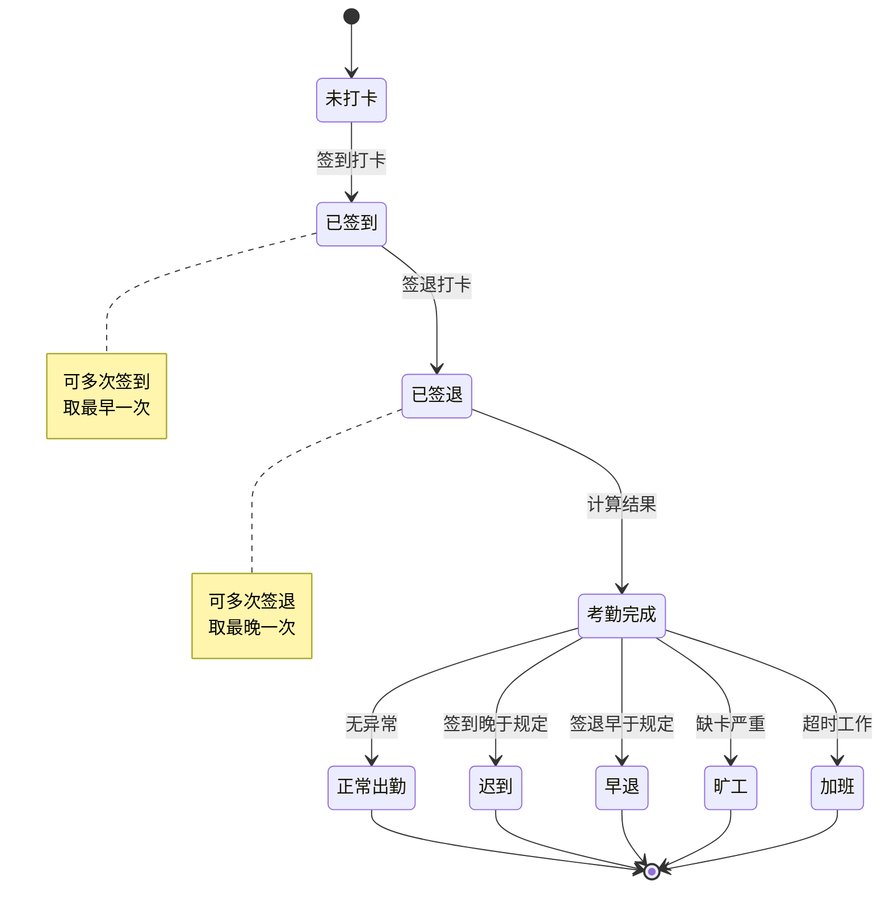
```mermaid
stateDiagram-v2
    [*] --> 未打卡
    
    未打卡 --> 已签到: 签到打卡
    已签到 --> 已签退: 签退打卡
    已签退 --> 考勤完成: 计算结果
    
    考勤完成 --> 正常出勤: 无异常
    考勤完成 --> 迟到: 签到晚于规定
    考勤完成 --> 早退: 签退早于规定
    考勤完成 --> 旷工: 缺卡严重
    考勤完成 --> 加班: 超时工作
    
    正常出勤 --> [*]
    迟到 --> [*]
    早退 --> [*]
    旷工 --> [*]
    加班 --> [*]
    
    note right of 已签到
        可多次签到
        取最早一次
    end note
    
    note right of 已签退
        可多次签退
        取最晚一次
    end note
```

---

## 5. 消费模块设计

### 5.1 消费核心类图

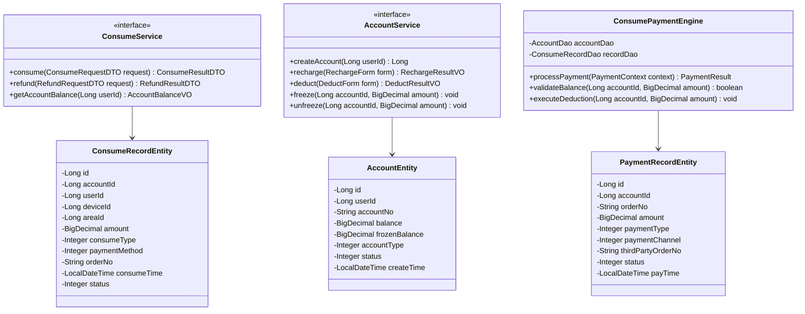
```mermaid
classDiagram
    class AccountEntity {
        -Long id
        -Long userId
        -String accountNo
        -BigDecimal balance
        -BigDecimal frozenBalance
        -Integer accountType
        -Integer status
        -LocalDateTime createTime
    }
    
    class ConsumeRecordEntity {
        -Long id
        -Long accountId
        -Long userId
        -Long deviceId
        -Long areaId
        -BigDecimal amount
        -Integer consumeType
        -Integer paymentMethod
        -String orderNo
        -LocalDateTime consumeTime
        -Integer status
    }
    
    class PaymentRecordEntity {
        -Long id
        -Long accountId
        -String orderNo
        -BigDecimal amount
        -Integer paymentType
        -Integer paymentChannel
        -String thirdPartyOrderNo
        -Integer status
        -LocalDateTime payTime
    }
    
    class ConsumeService {
        <<interface>>
        +consume(ConsumeRequestDTO request) ConsumeResultDTO
        +refund(RefundRequestDTO request) RefundResultDTO
        +getAccountBalance(Long userId) AccountBalanceVO
    }
    
    class AccountService {
        <<interface>>
        +createAccount(Long userId) Long
        +recharge(RechargeForm form) RechargeResultVO
        +deduct(DeductForm form) DeductResultVO
        +freeze(Long accountId, BigDecimal amount) void
        +unfreeze(Long accountId, BigDecimal amount) void
    }
    
    class ConsumePaymentEngine {
        -AccountDao accountDao
        -ConsumeRecordDao recordDao
        +processPayment(PaymentContext context) PaymentResult
        +validateBalance(Long accountId, BigDecimal amount) boolean
        +executeDeduction(Long accountId, BigDecimal amount) void
    }
    
    ConsumeService --> ConsumeRecordEntity
    AccountService --> AccountEntity
    ConsumePaymentEngine --> PaymentRecordEntity
```

### 5.2 消费支付时序图

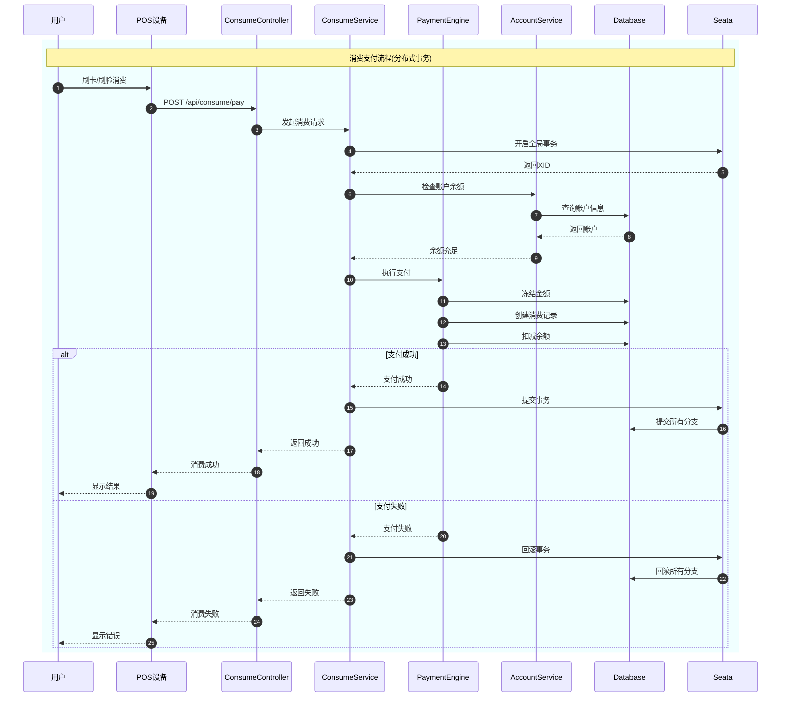
```mermaid
sequenceDiagram
    autonumber
    participant U as 用户
    participant D as POS设备
    participant C as ConsumeController
    participant S as ConsumeService
    participant PE as PaymentEngine
    participant AS as AccountService
    participant DB as Database
    participant SE as Seata
    
    rect rgb(240, 255, 255)
        Note over U,SE: 消费支付流程(分布式事务)
        U->>D: 刷卡/刷脸消费
        D->>C: POST /api/consume/pay
        
        C->>S: 发起消费请求
        S->>SE: 开启全局事务
        SE-->>S: 返回XID
        
        S->>AS: 检查账户余额
        AS->>DB: 查询账户信息
        DB-->>AS: 返回账户
        AS-->>S: 余额充足
        
        S->>PE: 执行支付
        PE->>DB: 冻结金额
        PE->>DB: 创建消费记录
        PE->>DB: 扣减余额
        
        alt 支付成功
            PE-->>S: 支付成功
            S->>SE: 提交事务
            SE->>DB: 提交所有分支
            S-->>C: 返回成功
            C-->>D: 消费成功
            D-->>U: 显示结果
        else 支付失败
            PE-->>S: 支付失败
            S->>SE: 回滚事务
            SE->>DB: 回滚所有分支
            S-->>C: 返回失败
            C-->>D: 消费失败
            D-->>U: 显示错误
        end
    end
```

### 5.3 账户状态机

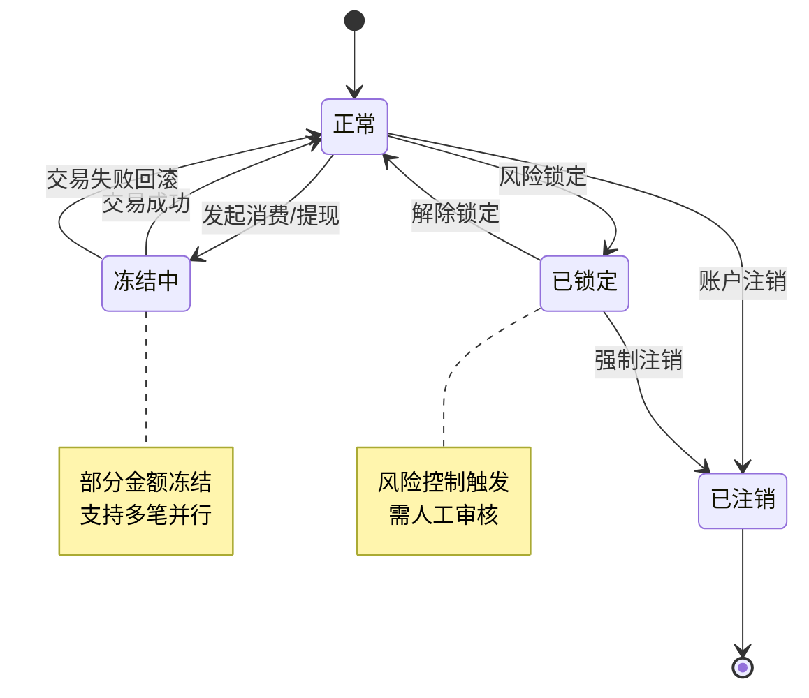
```mermaid
stateDiagram-v2
    [*] --> 正常
    
    正常 --> 冻结中: 发起消费/提现
    冻结中 --> 正常: 交易成功
    冻结中 --> 正常: 交易失败回滚
    
    正常 --> 已注销: 账户注销
    正常 --> 已锁定: 风险锁定
    
    已锁定 --> 正常: 解除锁定
    已锁定 --> 已注销: 强制注销
    
    已注销 --> [*]
    
    note right of 冻结中
        部分金额冻结
        支持多笔并行
    end note
    
    note right of 已锁定
        风险控制触发
        需人工审核
    end note
```

---

## 6. 访客模块设计

### 6.1 访客核心类图

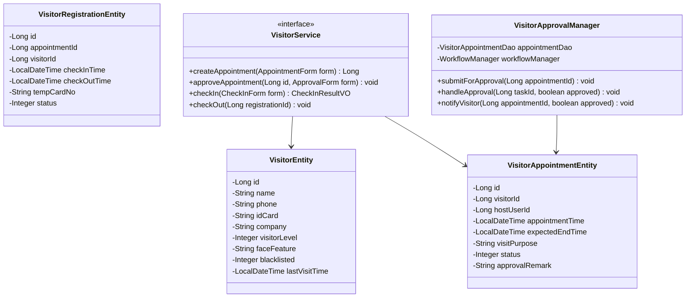
```mermaid
classDiagram
    class VisitorEntity {
        -Long id
        -String name
        -String phone
        -String idCard
        -String company
        -Integer visitorLevel
        -String faceFeature
        -Integer blacklisted
        -LocalDateTime lastVisitTime
    }
    
    class VisitorAppointmentEntity {
        -Long id
        -Long visitorId
        -Long hostUserId
        -LocalDateTime appointmentTime
        -LocalDateTime expectedEndTime
        -String visitPurpose
        -Integer status
        -String approvalRemark
    }
    
    class VisitorRegistrationEntity {
        -Long id
        -Long appointmentId
        -Long visitorId
        -LocalDateTime checkInTime
        -LocalDateTime checkOutTime
        -String tempCardNo
        -Integer status
    }
    
    class VisitorService {
        <<interface>>
        +createAppointment(AppointmentForm form) Long
        +approveAppointment(Long id, ApprovalForm form) void
        +checkIn(CheckInForm form) CheckInResultVO
        +checkOut(Long registrationId) void
    }
    
    class VisitorApprovalManager {
        -VisitorAppointmentDao appointmentDao
        -WorkflowManager workflowManager
        +submitForApproval(Long appointmentId) void
        +handleApproval(Long taskId, boolean approved) void
        +notifyVisitor(Long appointmentId, boolean approved) void
    }
    
    VisitorService --> VisitorEntity
    VisitorService --> VisitorAppointmentEntity
    VisitorApprovalManager --> VisitorAppointmentEntity
```

### 6.2 访客预约审批时序图

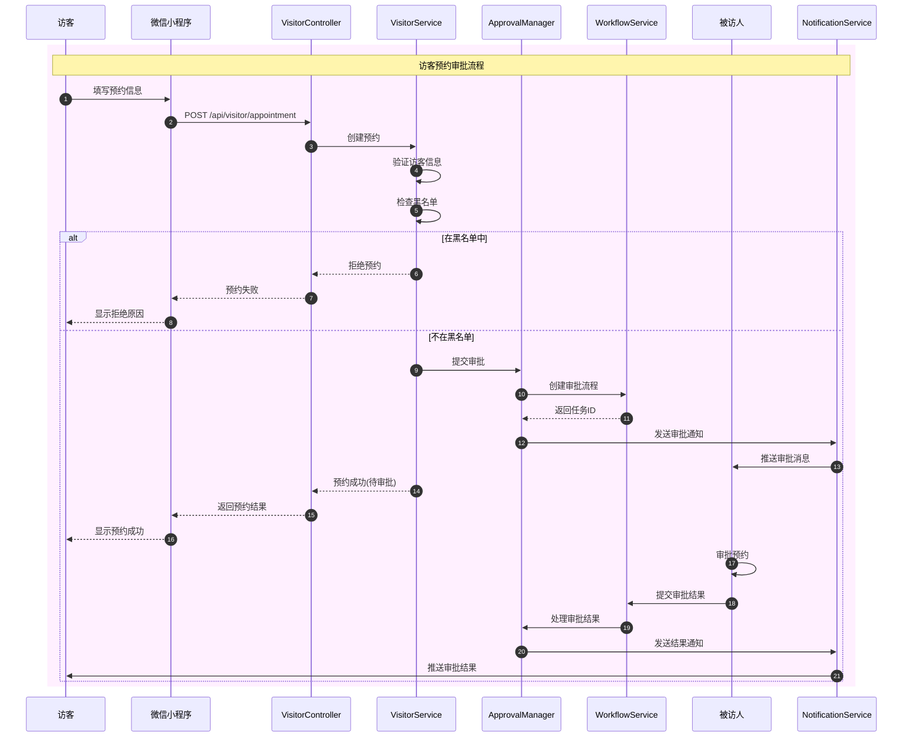
```mermaid
sequenceDiagram
    autonumber
    participant V as 访客
    participant W as 微信小程序
    participant C as VisitorController
    participant S as VisitorService
    participant AM as ApprovalManager
    participant WF as WorkflowService
    participant H as 被访人
    participant NS as NotificationService
    
    rect rgb(255, 240, 255)
        Note over V,NS: 访客预约审批流程
        V->>W: 填写预约信息
        W->>C: POST /api/visitor/appointment
        C->>S: 创建预约
        
        S->>S: 验证访客信息
        S->>S: 检查黑名单
        
        alt 在黑名单中
            S-->>C: 拒绝预约
            C-->>W: 预约失败
            W-->>V: 显示拒绝原因
        else 不在黑名单
            S->>AM: 提交审批
            AM->>WF: 创建审批流程
            WF-->>AM: 返回任务ID
            
            AM->>NS: 发送审批通知
            NS->>H: 推送审批消息
            
            S-->>C: 预约成功(待审批)
            C-->>W: 返回预约结果
            W-->>V: 显示预约成功
            
            H->>H: 审批预约
            H->>WF: 提交审批结果
            WF->>AM: 处理审批结果
            
            AM->>NS: 发送结果通知
            NS->>V: 推送审批结果
        end
    end
```

### 6.3 访客状态流转

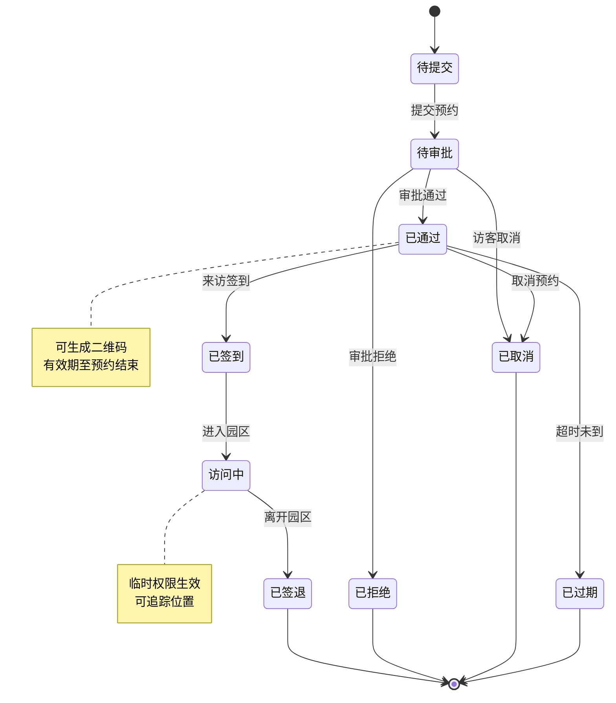
```mermaid
stateDiagram-v2
    [*] --> 待提交
    
    待提交 --> 待审批: 提交预约
    待审批 --> 已通过: 审批通过
    待审批 --> 已拒绝: 审批拒绝
    待审批 --> 已取消: 访客取消
    
    已通过 --> 已签到: 来访签到
    已通过 --> 已过期: 超时未到
    已通过 --> 已取消: 取消预约
    
    已签到 --> 访问中: 进入园区
    访问中 --> 已签退: 离开园区
    
    已签退 --> [*]
    已拒绝 --> [*]
    已取消 --> [*]
    已过期 --> [*]
    
    note right of 已通过
        可生成二维码
        有效期至预约结束
    end note
    
    note right of 访问中
        临时权限生效
        可追踪位置
    end note
```

---

## 7. 视频模块设计

### 7.1 视频核心类图

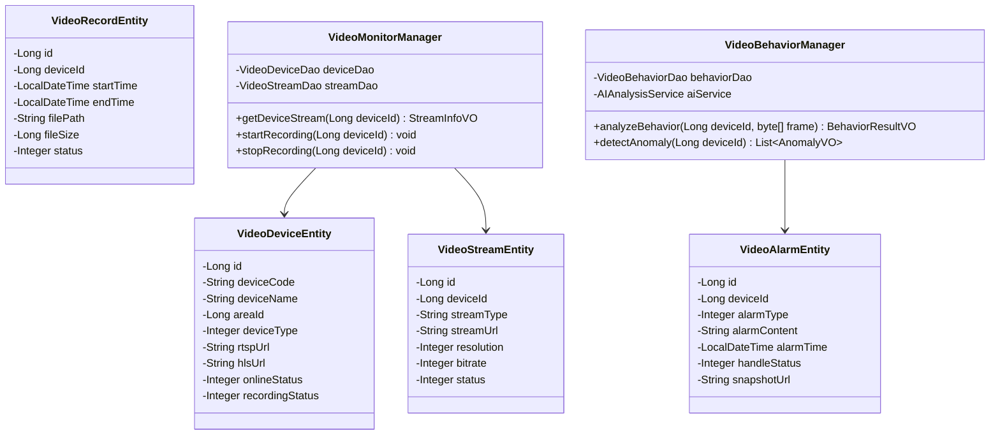
```mermaid
classDiagram
    class VideoDeviceEntity {
        -Long id
        -String deviceCode
        -String deviceName
        -Long areaId
        -Integer deviceType
        -String rtspUrl
        -String hlsUrl
        -Integer onlineStatus
        -Integer recordingStatus
    }
    
    class VideoStreamEntity {
        -Long id
        -Long deviceId
        -String streamType
        -String streamUrl
        -Integer resolution
        -Integer bitrate
        -Integer status
    }
    
    class VideoRecordEntity {
        -Long id
        -Long deviceId
        -LocalDateTime startTime
        -LocalDateTime endTime
        -String filePath
        -Long fileSize
        -Integer status
    }
    
    class VideoAlarmEntity {
        -Long id
        -Long deviceId
        -Integer alarmType
        -String alarmContent
        -LocalDateTime alarmTime
        -Integer handleStatus
        -String snapshotUrl
    }
    
    class VideoMonitorManager {
        -VideoDeviceDao deviceDao
        -VideoStreamDao streamDao
        +getDeviceStream(Long deviceId) StreamInfoVO
        +startRecording(Long deviceId) void
        +stopRecording(Long deviceId) void
    }
    
    class VideoBehaviorManager {
        -VideoBehaviorDao behaviorDao
        -AIAnalysisService aiService
        +analyzeBehavior(Long deviceId, byte[] frame) BehaviorResultVO
        +detectAnomaly(Long deviceId) List~AnomalyVO~
    }
    
    VideoMonitorManager --> VideoDeviceEntity
    VideoMonitorManager --> VideoStreamEntity
    VideoBehaviorManager --> VideoAlarmEntity
```

### 7.2 视频监控时序图

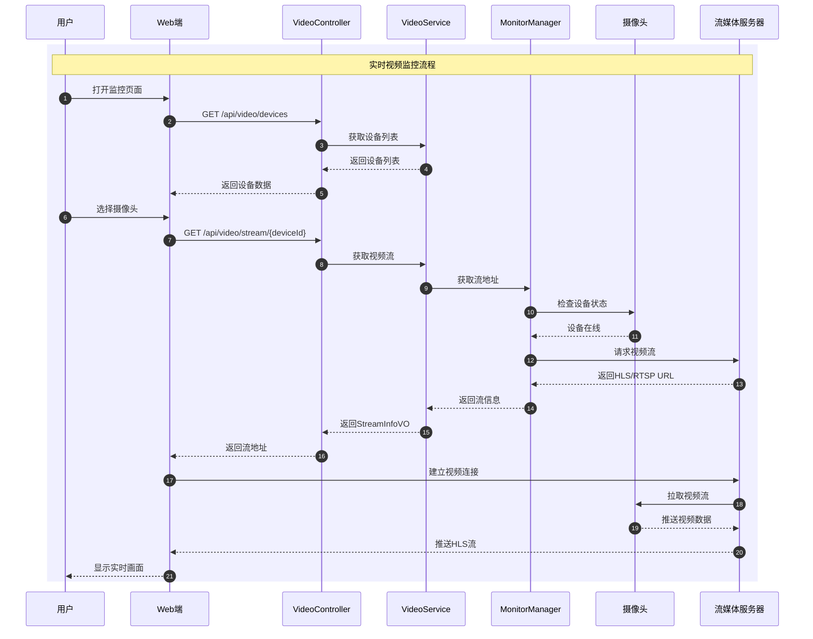
```mermaid
sequenceDiagram
    autonumber
    participant U as 用户
    participant W as Web端
    participant C as VideoController
    participant S as VideoService
    participant MM as MonitorManager
    participant D as 摄像头
    participant MS as 流媒体服务器
    
    rect rgb(240, 240, 255)
        Note over U,MS: 实时视频监控流程
        U->>W: 打开监控页面
        W->>C: GET /api/video/devices
        C->>S: 获取设备列表
        S-->>C: 返回设备列表
        C-->>W: 返回设备数据
        
        U->>W: 选择摄像头
        W->>C: GET /api/video/stream/{deviceId}
        C->>S: 获取视频流
        S->>MM: 获取流地址
        MM->>D: 检查设备状态
        D-->>MM: 设备在线
        MM->>MS: 请求视频流
        MS-->>MM: 返回HLS/RTSP URL
        MM-->>S: 返回流信息
        S-->>C: 返回StreamInfoVO
        C-->>W: 返回流地址
        
        W->>MS: 建立视频连接
        MS->>D: 拉取视频流
        D-->>MS: 推送视频数据
        MS-->>W: 推送HLS流
        W-->>U: 显示实时画面
    end
```

### 7.3 AI告警处理流程

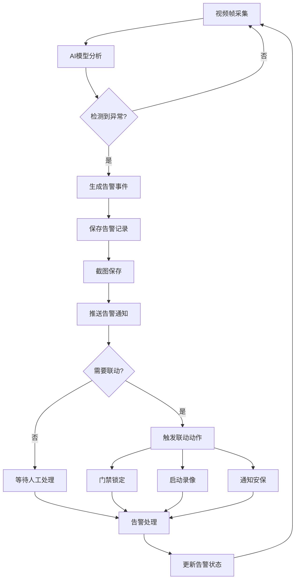
```mermaid
flowchart TD
    A[视频帧采集] --> B[AI模型分析]
    B --> C{检测到异常?}
    C -->|否| A
    C -->|是| D[生成告警事件]
    D --> E[保存告警记录]
    E --> F[截图保存]
    F --> G[推送告警通知]
    G --> H{需要联动?}
    H -->|否| I[等待人工处理]
    H -->|是| J[触发联动动作]
    J --> K[门禁锁定]
    J --> L[启动录像]
    J --> M[通知安保]
    I --> N[告警处理]
    K --> N
    L --> N
    M --> N
    N --> O[更新告警状态]
    O --> A
```

---

## 8. 设备通讯模块设计

### 8.1 设备通讯类图

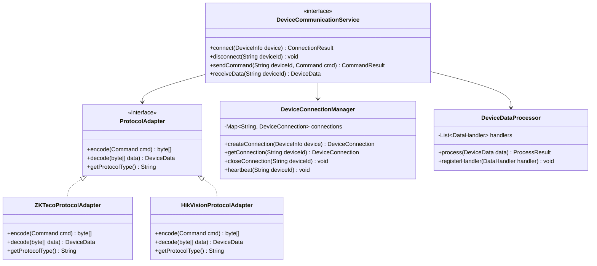
```mermaid
classDiagram
    class DeviceCommunicationService {
        <<interface>>
        +connect(DeviceInfo device) ConnectionResult
        +disconnect(String deviceId) void
        +sendCommand(String deviceId, Command cmd) CommandResult
        +receiveData(String deviceId) DeviceData
    }
    
    class ProtocolAdapter {
        <<interface>>
        +encode(Command cmd) byte[]
        +decode(byte[] data) DeviceData
        +getProtocolType() String
    }
    
    class ZKTecoProtocolAdapter {
        +encode(Command cmd) byte[]
        +decode(byte[] data) DeviceData
        +getProtocolType() String
    }
    
    class HikVisionProtocolAdapter {
        +encode(Command cmd) byte[]
        +decode(byte[] data) DeviceData
        +getProtocolType() String
    }
    
    class DeviceConnectionManager {
        -Map~String, DeviceConnection~ connections
        +createConnection(DeviceInfo device) DeviceConnection
        +getConnection(String deviceId) DeviceConnection
        +closeConnection(String deviceId) void
        +heartbeat(String deviceId) void
    }
    
    class DeviceDataProcessor {
        -List~DataHandler~ handlers
        +process(DeviceData data) ProcessResult
        +registerHandler(DataHandler handler) void
    }
    
    ProtocolAdapter <|.. ZKTecoProtocolAdapter
    ProtocolAdapter <|.. HikVisionProtocolAdapter
    DeviceCommunicationService --> ProtocolAdapter
    DeviceCommunicationService --> DeviceConnectionManager
    DeviceCommunicationService --> DeviceDataProcessor
```

### 8.2 设备数据上报时序图

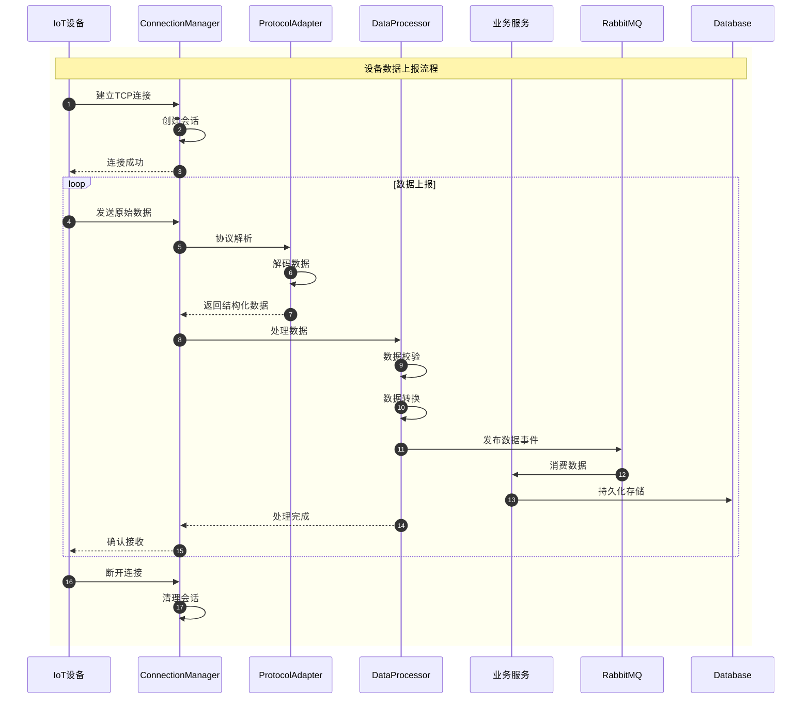
```mermaid
sequenceDiagram
    autonumber
    participant D as IoT设备
    participant C as ConnectionManager
    participant P as ProtocolAdapter
    participant DP as DataProcessor
    participant S as 业务服务
    participant MQ as RabbitMQ
    participant DB as Database
    
    rect rgb(255, 255, 240)
        Note over D,DB: 设备数据上报流程
        D->>C: 建立TCP连接
        C->>C: 创建会话
        C-->>D: 连接成功
        
        loop 数据上报
            D->>C: 发送原始数据
            C->>P: 协议解析
            P->>P: 解码数据
            P-->>C: 返回结构化数据
            
            C->>DP: 处理数据
            DP->>DP: 数据校验
            DP->>DP: 数据转换
            
            DP->>MQ: 发布数据事件
            MQ->>S: 消费数据
            S->>DB: 持久化存储
            
            DP-->>C: 处理完成
            C-->>D: 确认接收
        end
        
        D->>C: 断开连接
        C->>C: 清理会话
    end
```

---

## 9. 数据流图

### 9.1 系统整体数据流

```mermaid
flowchart LR
    subgraph 数据采集层
        A1[门禁设备]
        A2[考勤设备]
        A3[消费设备]
        A4[摄像头]
    end
    
    subgraph 数据处理层
        B1[设备通讯服务]
        B2[协议适配器]
        B3[数据校验器]
    end
    
    subgraph 业务处理层
        C1[门禁服务]
        C2[考勤服务]
        C3[消费服务]
        C4[视频服务]
    end
    
    subgraph 数据存储层
        D1[(MySQL)]
        D2[(Redis)]
        D3[文件存储]
    end
    
    subgraph 数据消费层
        E1[Web管理台]
        E2[移动端APP]
        E3[报表系统]
        E4[大屏展示]
    end
    
    A1 --> B1
    A2 --> B1
    A3 --> B1
    A4 --> B1
    
    B1 --> B2
    B2 --> B3
    
    B3 --> C1
    B3 --> C2
    B3 --> C3
    B3 --> C4
    
    C1 --> D1
    C2 --> D1
    C3 --> D1
    C4 --> D1
    C4 --> D3
    
    C1 --> D2
    C2 --> D2
    C3 --> D2
    
    D1 --> E1
    D1 --> E2
    D1 --> E3
    D2 --> E4
```

---

## 10. 接口设计规范

### 10.1 RESTful API规范

| 操作 | HTTP方法 | URL模式 | 示例 |
|------|---------|---------|------|
| 查询列表 | GET | /api/v1/{resource} | GET /api/v1/users |
| 查询详情 | GET | /api/v1/{resource}/{id} | GET /api/v1/users/1 |
| 创建 | POST | /api/v1/{resource} | POST /api/v1/users |
| 全量更新 | PUT | /api/v1/{resource}/{id} | PUT /api/v1/users/1 |
| 部分更新 | PATCH | /api/v1/{resource}/{id} | PATCH /api/v1/users/1 |
| 删除 | DELETE | /api/v1/{resource}/{id} | DELETE /api/v1/users/1 |

### 10.2 统一响应格式

```json
{
    "code": 200,
    "message": "success",
    "data": {
        "id": 1,
        "name": "张三"
    },
    "timestamp": 1702800000000
}
```

### 10.3 分页响应格式

```json
{
    "code": 200,
    "message": "success",
    "data": {
        "list": [...],
        "total": 100,
        "pageNum": 1,
        "pageSize": 20,
        "pages": 5
    },
    "timestamp": 1702800000000
}
```

---

## 11. 错误码设计

### 11.1 错误码分类

| 范围 | 类别 | 说明 |
|------|------|------|
| 200 | 成功 | 操作成功 |
| 400-499 | 客户端错误 | 参数错误、认证失败 |
| 500-599 | 服务端错误 | 系统异常 |
| 1000-1999 | 通用业务错误 | 数据不存在等 |
| 2000-2999 | 用户模块 | 用户相关错误 |
| 3000-3999 | 权限模块 | 权限相关错误 |
| 4000-4999 | 门禁模块 | 门禁相关错误 |
| 5000-5999 | 考勤模块 | 考勤相关错误 |
| 6000-6999 | 消费模块 | 消费相关错误 |
| 7000-7999 | 访客模块 | 访客相关错误 |
| 8000-8999 | 视频模块 | 视频相关错误 |

### 11.2 常见错误码

| 错误码 | 错误信息 | 说明 |
|--------|---------|------|
| 1001 | DATA_NOT_FOUND | 数据不存在 |
| 1002 | DATA_ALREADY_EXISTS | 数据已存在 |
| 1003 | OPERATION_NOT_ALLOWED | 操作不允许 |
| 2001 | USER_NOT_FOUND | 用户不存在 |
| 2002 | PASSWORD_ERROR | 密码错误 |
| 2003 | USER_DISABLED | 用户已禁用 |
| 3001 | NO_PERMISSION | 无权限 |
| 3002 | TOKEN_EXPIRED | Token过期 |
| 4001 | ACCESS_DENIED | 通行拒绝 |
| 4002 | ANTI_PASSBACK_FAILED | 反潜检查失败 |
| 5001 | NO_SCHEDULE | 无排班信息 |
| 5002 | ALREADY_CLOCKED | 已打卡 |
| 6001 | INSUFFICIENT_BALANCE | 余额不足 |
| 6002 | ACCOUNT_FROZEN | 账户已冻结 |
| 7001 | VISITOR_BLACKLISTED | 访客在黑名单 |
| 7002 | APPOINTMENT_EXPIRED | 预约已过期 |

---

## 12. 附录

### 12.1 相关文档

| 文档 | 路径 | 说明 |
|------|------|------|
| 系统架构设计 | `documentation/architecture/01-系统架构设计文档.md` | 整体架构 |
| API接口文档 | `documentation/api/` | 详细接口定义 |
| 数据库设计 | `documentation/database/` | 表结构设计 |

### 12.2 设计原则参考

- **SOLID原则**: 单一职责、开闭原则、里氏替换、接口隔离、依赖倒置
- **DRY原则**: 不要重复自己
- **KISS原则**: 保持简单
- **YAGNI原则**: 不要过度设计

### 12.3 版本历史

| 版本 | 日期 | 修改内容 | 修改人 |
|------|------|---------|--------|
| v1.0.0 | 2025-12-01 | 初始版本 | 架构组 |
| v2.0.0 | 2025-12-17 | 全面完善类图时序图 | 架构组 |

---

**文档维护**: IOE-DREAM 架构委员会  
**最后更新**: 2025-12-17
