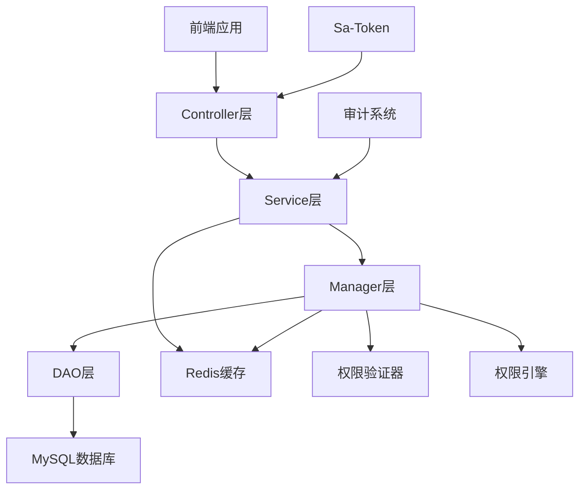

# 权限管理公共模块实现提案

> **📋 提案类型**: 公共模块实现
> **📋 模块名称**: smart-permission (权限管理模块)
> **📋 创建时间**: 2025-01-13
> **📋 提案版本**: v1.0
> **📋 优先级**: 🔴 高优先级

---

## 📖 提案概述

### 项目背景
SmartAdmin v3 项目已成功实现了 `smart-device` 设备管理模块，但作为所有业务模块基础依赖的权限管理模块 `smart-permission` 尚未实现。权限管理是系统安全的核心，影响所有后续模块的开发和部署。

### 项目目标
实现 SmartAdmin v3 的5级安全级别权限管理公共模块，为其他业务模块提供统一的权限验证、数据隔离、临时权限管理和权限审计功能。

### 核心特性
- **5级安全级别**: 绝密级、机密级、秘密级、内部级、公开级
- **数据权限隔离**: 基于区域、设备、用户的数据权限控制
- **临时权限管理**: 支持短期访问权限的申请和审批
- **权限审计日志**: 完整的权限变更和访问记录
- **多级缓存策略**: 高性能的权限验证机制
- **前端权限指令**: Vue 3 权限指令和组件

---

## 🎯 实施范围

### 后端实现
1. **数据库设计**
   - 安全级别表 (t_security_level)
   - 数据权限表 (t_data_permission)
   - 临时权限表 (t_temporary_permission)
   - 权限审计表 (t_permission_audit)

2. **核心架构**
   - Controller层：权限管理API接口
   - Service层：业务逻辑和事务管理
   - Manager层：权限缓存、验证器、权限引擎
   - DAO层：数据访问和查询优化

3. **核心功能**
   - 安全级别管理
   - 数据权限验证
   - 临时权限申请和审批
   - 权限审计日志记录
   - 多级缓存优化

### 前端实现
1. **Web端 (Vue 3)**
   - 权限状态管理 (Pinia)
   - 权限指令 (v-permission)
   - 安全级别选择器组件
   - 权限申请和审批界面
   - 权限审计查询页面

2. **移动端 (uni-app)**
   - 权限查询功能
   - 临时权限申请
   - 权限状态展示

### 集成要求
- 与现有 `smart-device` 模块集成
- Sa-Token 认证框架集成
- Redis 缓存集成
- 审计日志系统集成

---

## 🏗️ 技术架构

### 系统架构图



### 核心设计模式

#### 权限验证器模式
```java
@Component
public class PermissionValidator {
    public PermissionResult validate(Long userId, String permissionCode, DataScope dataScope) {
        // 1. 从缓存获取权限信息
        // 2. 验证安全级别
        // 3. 验证数据权限
        // 4. 返回验证结果
    }
}
```

#### 多级缓存策略
```java
@Configuration
@EnableCaching
public class PermissionCacheConfig {
    // 一级缓存：Caffeine本地缓存
    // 二级缓存：Redis分布式缓存
    // 缓存失效策略
}
```

---

## 📅 实施计划

### 第一阶段：后端核心功能 (2周)

#### Week 1: 基础架构
- [ ] 创建项目结构和包结构
- [ ] 设计和创建数据库表
- [ ] 实现实体类和基础DTO
- [ ] 配置 MyBatis-Plus 映射

#### Week 2: 核心服务
- [ ] 实现 DAO 层数据访问
- [ ] 实现 Manager 层业务逻辑
- [ ] 实现 Service 层服务接口
- [ ] 实现 Controller 层API接口

### 第二阶段：高级功能 (1.5周)

#### Week 3: 高级特性
- [ ] 实现多级缓存策略
- [ ] 实现权限验证器
- [ ] 实现权限引擎
- [ ] 实现审计日志功能

### 第三阶段：前端实现 (2周)

#### Week 4: Web前端
- [ ] 创建权限管理页面
- [ ] 实现权限状态管理
- [ ] 实现权限指令组件
- [ ] 实现安全级别选择器

#### Week 5: 移动端和集成
- [ ] 创建移动端权限页面
- [ ] 与 smart-device 模块集成
- [ ] 权限指令应用测试
- [ ] 跨模块权限验证测试

### 第四阶段：测试和优化 (1.5周)

#### Week 6: 测试和优化
- [ ] 单元测试编写
- [ ] 集成测试
- [ ] 性能测试和优化
- [ ] 安全测试
- [ ] 文档编写

---

## 📋 验收标准

### 功能验收
- [ ] 支持5级安全级别管理
- [ ] 支持数据权限隔离验证
- [ ] 支持临时权限申请和审批
- [ ] 完整的权限审计日志
- [ ] 前端权限指令正常工作
- [ ] 与现有模块无缝集成

### 性能验收
- [ ] 权限验证响应时间 < 50ms
- [ ] 支持1000+并发用户权限验证
- [ ] 缓存命中率 > 90%
- [ ] 系统可用性 > 99.9%

### 安全验收
- [ ] 权限验证无绕过漏洞
- [ ] 敏感权限数据加密存储
- [ ] 审计日志完整可追溯
- [ ] 通过安全渗透测试

### 代码质量
- [ ] 代码覆盖率达到80%以上
- [ ] 遵循SmartAdmin开发规范
- [ ] 通过代码审查
- [ ] 完整的技术文档

---

## 🛠️ 技术规范

### 编码规范
- 严格遵循SmartAdmin开发规范文档
- 使用统一的命名约定
- 完整的代码注释和文档
- 异常处理机制完善

### 安全规范
- 所有API接口必须进行权限验证
- 敏感数据必须加密存储
- 完整的操作日志记录
- SQL注入防护

### 性能规范
- 合理使用缓存策略
- 数据库查询优化
- 避免N+1查询问题
- 异步处理耗时操作

---

## 📊 资源需求

### 人力资源
- **后端开发工程师**: 1人 (全职)
- **前端开发工程师**: 1人 (全职)
- **测试工程师**: 0.5人 (兼职)
- **项目管理**: 0.5人 (兼职)

### 时间资源
- **总开发周期**: 6周
- **并行开发**: 前后端可并行开发2周
- **测试时间**: 1.5周
- **文档和优化**: 0.5周

### 技术资源
- 开发环境：已具备
- 测试环境：已具备
- 数据库：使用现有MySQL和Redis
- 第三方依赖：Spring Boot、MyBatis-Plus、Redis、Vue 3

---

## 🎯 预期成果

### 直接成果
1. **完整的权限管理公共模块**
2. **5级安全级别权限控制体系**
3. **高性能权限验证机制**
4. **完整的权限审计功能**
5. **前端权限指令和组件**

### 间接成果
1. **为其他模块提供权限基础**
2. **提升系统整体安全性**
3. **建立统一的权限管理标准**
4. **完善SmartAdmin生态体系**

### 技术文档
1. **API接口文档**
2. **数据库设计文档**
3. **使用指南和最佳实践**
4. **运维和部署文档**

---

## 🚀 风险控制

### 技术风险
- **风险**: 与现有系统集成困难
- **控制**: 充分的集成测试，预留接口适配时间

### 进度风险
- **风险**: 开发周期超出预期
- **控制**: 采用敏捷开发，分阶段交付

### 质量风险
- **风险**: 权限验证存在安全漏洞
- **控制**: 严格的安全测试和代码审查

---

## 📞 项目联系信息

**项目负责人**: SmartAdmin开发团队
**技术支持**: 架构师团队
**文档维护**: 技术写作团队

---

*本提案经审核后实施，实施过程中如有变更需及时更新提案内容。*

**提案创建时间**: 2025-01-13
**最后更新时间**: 2025-01-13