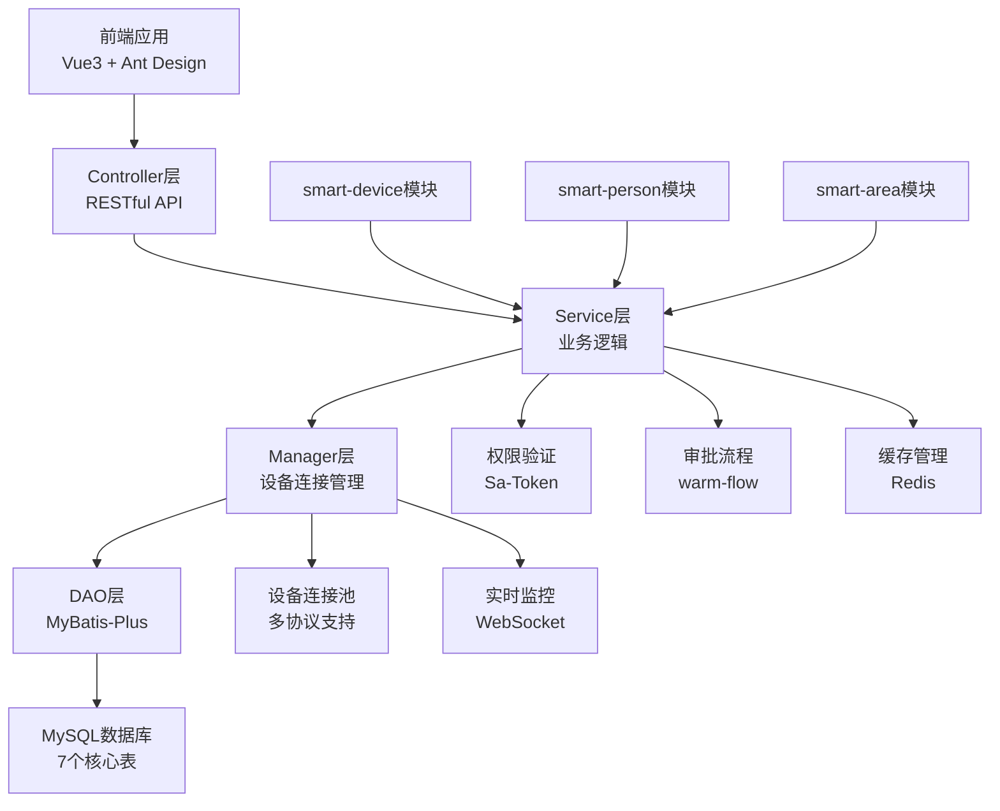

# 门禁系统公共模块完整实现提案

> **📋 提案类型**: 公共模块完整实现
> **📋 模块名称**: smart-access (门禁系统模块)
> **📋 创建时间**: 2025-01-13
> **📋 提案版本**: v1.0
> **📋 优先级**: 🔴 高优先级
> **📋 复杂度**: ⭐⭐⭐⭐⭐ (最高)

---

## 📖 提案概述

### 项目背景
SmartAdmin v3 项目已成功实现了 `smart-device` 设备管理模块，为门禁系统提供了设备管理基础。门禁系统作为智慧园区的核心安全模块，需要实现统一的门禁设备管理、精细化权限控制、实时监控和远程控制等功能。

### 项目目标
基于现有的 `smart-device` 模块和完整的权限体系，实现 SmartAdmin v3 的门禁系统公共模块，提供完整的门禁管理解决方案，包括设备管理、权限授权、实时监控、远程控制和数据分析等核心功能。

### 核心特性
- **多设备类型支持**: 门禁、闸机、道闸、转闸统一管理
- **多协议接入**: TCP、UDP、HTTP、WebSocket协议支持
- **精细化权限控制**: 基于人员、设备、时间、区域的多维度权限管理
- **实时监控**: 设备状态实时监控和异常告警
- **远程控制**: 开门、关门、重启、时间同步等远程操作
- **审批流程集成**: 与warm-flow审批引擎深度集成
- **完整数据分析**: 通行统计、设备分析、异常分析

---

## 🎯 实施范围

### 1. 数据库设计实现

#### 1.1 核心业务表
- **smart_access_device** - 门禁设备表
- **smart_access_permission** - 门禁权限表
- **smart_access_record** - 通行记录表
- **smart_access_command** - 设备指令表
- **smart_access_device_status** - 设备状态表

#### 1.2 扩展功能表
- **smart_access_area_group** - 区域权限组表
- **smart_access_alarm** - 设备告警表

### 2. 后端完整实现

#### 2.1 四层架构实现
- **Controller层**: RESTful API接口，权限验证
- **Service层**: 业务逻辑处理，事务管理
- **Manager层**: 复杂业务逻辑，设备连接管理
- **DAO层**: 数据访问，MyBatis-Plus映射

#### 2.2 核心功能模块
- **设备管理模块**: 设备CRUD、状态监控、连接管理
- **权限管理模块**: 权限申请、审批、验证、撤销
- **通行记录模块**: 通行数据处理、查询、统计
- **设备控制模块**: 远程控制、指令管理、协议支持
- **实时监控模块**: 状态监控、告警处理、事件监听
- **数据分析模块**: 统计分析、报表生成、数据导出

#### 2.3 设备协议实现
- **协议抽象层**: DeviceConnection接口设计
- **TCP协议实现**: TcpDeviceConnection类
- **UDP协议实现**: UdpDeviceConnection类
- **HTTP协议实现**: HttpDeviceConnection类
- **WebSocket协议实现**: WebSocketDeviceConnection类
- **协议工厂**: DeviceProtocolFactory统一管理

### 3. 前端完整实现

#### 3.1 Web端 (Vue 3)
- **设备管理页面**: 设备列表、详情、编辑、控制
- **权限管理页面**: 权限申请、审批、查看、撤销
- **通行记录页面**: 记录查询、统计、导出
- **实时监控页面**: 设备状态、告警信息、实时数据
- **数据分析页面**: 统计图表、报表展示
- **系统配置页面**: 权限组配置、系统参数设置

#### 3.2 移动端 (uni-app)
- **设备控制**: 远程开门、设备状态查看
- **通行记录**: 个人通行记录查询
- **权限申请**: 临时权限申请和状态查看
- **告警提醒**: 实时告警消息推送

### 4. 集成要求

#### 4.1 模块集成
- **smart-device模块**: 继承设备管理基础功能
- **现有权限体系**: 使用Sa-Token权限框架
- **工作流引擎**: 集成warm-flow审批流程
- **实时通信**: WebSocket实时数据推送

#### 4.2 系统集成
- **区域管理**: 与smart-area模块集成
- **人员管理**: 与smart-person模块集成
- **数据字典**: 使用系统数据字典
- **文件服务**: 使用系统文件上传功能

---

## 🏗️ 技术架构设计

### 系统架构图



### 核心设计模式

#### 设备连接管理器模式
```java
@Component
public class DeviceConnectionManager {
    private final Map<Long, DeviceConnection> connections = new ConcurrentHashMap<>();

    public boolean connectDevice(Long deviceId) {
        // 1. 获取设备信息
        // 2. 根据协议类型创建连接
        // 3. 建立连接并加入连接池
        // 4. 启动心跳监听
    }

    public void sendCommand(Long deviceId, String command) {
        // 1. 获取设备连接
        // 2. 发送指令
        // 3. 记录指令状态
        // 4. 处理异常重试
    }
}
```

#### 权限验证器模式
```java
@Component
public class AccessPermissionValidator {
    public boolean validateAccess(Long personId, Long deviceId, LocalDateTime accessTime) {
        // 1. 查询有效权限记录
        // 2. 验证时间权限
        // 3. 验证星期权限
        // 4. 验证时间段权限
        // 5. 返回验证结果
    }
}
```

#### 事件监听器模式
```java
@Component
public class AccessEventListener {
    public void onAccessEvent(Long deviceId, Long personId, Integer result) {
        // 1. 记录通行数据
        // 2. 更新设备状态
        // 3. 检查异常情况
        // 4. 发送实时通知
    }

    public void onAlarmEvent(Long deviceId, String alarmType, String message) {
        // 1. 记录告警信息
        // 2. 发送告警通知
        // 3. 更新设备状态
    }
}
```

---

## 📅 详细实施计划

### 第一阶段：基础架构搭建 (2周)

#### Week 1: 数据库设计与基础架构
**时间**: 2025年1月第3周 - 2025年1月第4周

**后端任务**:
- [ ] 创建数据库表结构 (7个核心表)
- [ ] 实现实体类和基础DTO
- [ ] 配置MyBatis-Plus映射
- [ ] 创建四层架构基础包结构
- [ ] 配置Spring Boot和依赖注入

**前端任务**:
- [ ] 创建前端路由和页面结构
- [ ] 配置API接口封装
- [ ] 设计页面布局和组件结构
- [ ] 配置权限控制

#### Week 2: 核心功能实现
**时间**: 2025年1月第4周 - 2025年2月第1周

**后端任务**:
- [ ] 实现设备管理Service和DAO
- [ ] 实现权限管理Service和DAO
- [ ] 实现设备连接管理基础功能
- [ ] 实现Controller层API接口
- [ ] 编写单元测试

**前端任务**:
- [ ] 实现设备管理页面
- [ ] 实现权限管理页面基础功能
- [ ] 实现API接口调用
- [ ] 实现表单验证和数据绑定

### 第二阶段：设备协议与连接 (2周)

#### Week 3: 设备协议实现
**时间**: 2025年2月第1周 - 2025年2月第2周

**后端任务**:
- [ ] 实现DeviceConnection接口设计
- [ ] 实现TCP协议连接类
- [ ] 实现UDP协议连接类
- [ ] 实现HTTP协议连接类
- [ ] 实现WebSocket协议连接类
- [ ] 实现协议工厂和连接池管理

**前端任务**:
- [ ] 实现设备控制界面
- [ ] 实现设备状态监控界面
- [ ] 实现实时数据展示
- [ ] 实现远程控制功能

#### Week 4: 设备控制与监控
**时间**: 2025年2月第2周 - 2025年2月第3周

**后端任务**:
- [ ] 实现设备远程控制功能
- [ ] 实现设备指令管理
- [ ] 实现设备状态监控
- [ ] 实现告警处理机制
- [ ] 实现WebSocket实时推送

**前端任务**:
- [ ] 完善设备控制功能
- [ ] 实现实时监控页面
- [ ] 实现告警信息展示
- [ ] 实现WebSocket连接和数据接收

### 第三阶段：权限管理与审批 (1.5周)

#### Week 5: 权限系统完整实现
**时间**: 2025年2月第3周 - 2025年2月第4周

**后端任务**:
- [ ] 实现权限申请和审批流程
- [ ] 集成warm-flow审批引擎
- [ ] 实现权限验证算法
- [ ] 实现权限生命周期管理
- [ ] 实现权限数据同步

**前端任务**:
- [ ] 实现权限申请页面
- [ ] 实现权限审批页面
- [ ] 实现权限管理页面
- [ ] 实现权限统计功能

### 第四阶段：数据处理与分析 (1.5周)

#### Week 6: 数据分析与报表
**时间**: 2025年2月第4周 - 2025年3月第1周

**后端任务**:
- [ ] 实现通行记录数据处理
- [ ] 实现统计分析功能
- [ ] 实现数据导出功能
- [ ] 实现性能优化
- [ ] 完善异常处理

**前端任务**:
- [ ] 实现通行记录查询页面
- [ ] 实现数据统计分析页面
- [ ] 实现报表展示功能
- [ ] 实现数据导出功能

### 第五阶段：移动端与测试 (1周)

#### Week 7: 移动端实现与系统测试
**时间**: 2025年3月第1周 - 2025年3月第2周

**移动端任务**:
- [ ] 创建移动端页面结构
- [ ] 实现设备控制功能
- [ ] 实现通行记录查询
- [ ] 实现权限申请功能
- [ ] 实现实时消息推送

**测试任务**:
- [ ] 单元测试完善
- [ ] 集成测试
- [ ] 性能测试
- [ ] 安全测试
- [ ] 用户体验测试

---

## 📋 详细功能清单

### 1. 门禁设备管理功能

#### 1.1 设备基础管理
- [ ] **设备新增**: 支持表单录入和批量导入
- [ ] **设备编辑**: 设备信息修改和配置更新
- [ ] **设备删除**: 软删除和关联数据清理
- [ ] **设备查询**: 多条件搜索和分页查询
- [ ] **设备详情**: 完整设备信息展示

#### 1.2 设备类型支持
- [ ] **门禁设备**: 标准门禁控制器
- [ ] **闸机设备**: 通道闸机控制
- [ ] **道闸设备**: 车辆道闸控制
- [ ] **转闸设备**: 三辊闸控制

#### 1.3 设备状态管理
- [ ] **在线状态**: 实时连接状态监控
- [ ] **设备状态**: 正常、故障、维护状态
- [ ] **门状态**: 开门、关门、未知状态
- [ ] **锁状态**: 锁定、解锁状态

#### 1.4 设备配置管理
- [ ] **网络配置**: IP地址、端口、MAC地址
- [ ] **协议配置**: 通信协议和参数设置
- [ ] **区域配置**: 设备归属区域设置
- [ ] **功能配置**: 设备功能参数配置

### 2. 权限管理功能

#### 2.1 权限申请
- [ ] **权限申请表单**: 人员和设备选择
- [ ] **时间权限设置**: 生效时间和失效时间
- [ ] **重复权限检查**: 避免权限重叠
- [ ] **申请流程**: 审批流程启动

#### 2.2 权限审批
- [ ] **审批列表**: 待审批权限查看
- [ ] **审批操作**: 通过、拒绝、退回
- [ ] **审批意见**: 审批备注和说明
- [ ] **审批通知**: 审批结果通知

#### 2.3 权限验证
- [ ] **实时验证**: 通行时权限检查
- [ ] **多维度验证**: 人员、设备、时间、区域
- [ ] **权限缓存**: 高性能权限验证
- [ ] **权限日志**: 验证结果记录

#### 2.4 权限生命周期
- [ ] **权限激活**: 审批通过后权限生效
- [ ] **权限撤销**: 手动撤销和自动过期
- [ ] **权限续期**: 权限有效期延长
- [ ] **权限统计**: 权限数据统计分析

### 3. 远程控制功能

#### 3.1 设备控制
- [ ] **远程开门**: 开门指令发送
- [ ] **远程关门**: 关门指令发送
- [ ] **设备重启**: 重启指令发送
- [ ] **时间同步**: 设备时间校准

#### 3.2 指令管理
- [ ] **指令发送**: 指令队列管理
- [ ] **指令状态**: 发送、执行、成功、失败
- [ ] **指令重试**: 失败指令重试机制
- [ ] **指令日志**: 指令操作记录

#### 3.3 控制权限
- [ ] **操作权限**: 控制权限验证
- [ ] **操作记录**: 控制操作日志
- [ ] **安全控制**: 操作安全验证
- [ ] **权限审计**: 控制权限审计

### 4. 实时监控功能

#### 4.1 设备监控
- [ ] **状态监控**: 设备状态实时监控
- [ ] **连接监控**: 连接状态监控
- [ ] **性能监控**: CPU、内存、存储监控
- [ ] **环境监控**: 温度、湿度监控

#### 4.2 通行监控
- [ ] **实时通行**: 通行事件实时监控
- [ ] **异常监控**: 异常通行事件监控
- [ ] **告警监控**: 设备告警监控
- [ ] **数据统计**: 实时数据统计

#### 4.3 告警管理
- [ ] **告警规则**: 告警规则配置
- [ ] **告警级别**: 低、中、高、严重级别
- [ ] **告警通知**: 告警消息推送
- [ ] **告警处理**: 告警处理流程

### 5. 数据分析功能

#### 5.1 通行分析
- [ ] **通行统计**: 按时间、人员、设备统计
- [ ] **流量分析**: 通行流量分析
- [ ] **异常分析**: 异常通行分析
- [ ] **趋势分析**: 通行趋势分析

#### 5.2 设备分析
- [ ] **设备使用率**: 设备使用频率分析
- [ ] **设备故障率**: 设备故障统计
- [ ] **设备在线率**: 设备在线时长分析
- [ ] **设备性能**: 设备性能指标分析

#### 5.3 报表功能
- [ ] **日报表**: 每日通行统计报表
- [ ] **周报表**: 每周数据分析报表
- [ ] **月报表**: 每月趋势分析报表
- [ ] **自定义报表**: 灵活报表配置

### 6. 系统配置功能

#### 6.1 权限组配置
- [ ] **权限组管理**: 权限组增删改查
- [ ] **权限组配置**: 权限组参数设置
- [ ] **默认权限**: 默认权限配置
- [ ] **权限模板**: 权限模板管理

#### 6.2 系统参数
- [ ] **系统配置**: 系统参数配置
- [ ] **告警配置**: 告警参数配置
- [ ] **性能配置**: 性能参数配置
- [ ] **安全配置**: 安全参数配置

---

## 🛠️ 技术实现规范

### 1. 开发规范

#### 1.1 后端开发规范
- **架构规范**: 严格遵循Controller → Service → Manager → DAO四层架构
- **依赖注入**: 使用@Resource注解，禁止@Autowired
- **事务管理**: 事务边界在Service层，使用@Transactional注解
- **异常处理**: 使用SmartException及其子类
- **权限控制**: 所有API接口使用@SaCheckPermission注解
- **参数验证**: 使用@Valid进行参数校验
- **返回格式**: 使用ResponseDTO统一返回格式

#### 1.2 前端开发规范
- **技术栈**: Vue 3 + Composition API + Ant Design Vue 4.x
- **组件开发**: 遵循单一职责原则，可复用组件设计
- **API封装**: 统一在/api/目录下封装API接口
- **状态管理**: 使用Pinia进行状态管理
- **权限控制**: 使用v-permission指令控制页面元素
- **样式规范**: 使用Less预处理器，遵循主题变量规范

#### 1.3 数据库设计规范
- **表命名**: smart_access_{entity} 格式
- **字段命名**: 下划线分隔，语义明确
- **主键设计**: {table}_id格式，BIGINT AUTO_INCREMENT
- **审计字段**: 必须包含create_time, update_time, create_by, update_by
- **软删除**: 使用deleted_flag字段，禁止物理删除
- **索引优化**: 合理创建索引，避免过多索引影响性能

### 2. 安全规范

#### 2.1 接口安全
- **权限验证**: 所有API接口必须进行权限验证
- **参数校验**: 严格的参数验证和数据过滤
- **SQL注入**: 使用MyBatis-Plus安全查询，避免SQL注入
- **XSS防护**: 前端输入过滤，后端输出转义
- **接口加密**: 敏感数据接口加密传输

#### 2.2 数据安全
- **敏感数据**: 密码、密钥等敏感数据加密存储
- **数据脱敏**: 查询时敏感信息自动脱敏
- **操作日志**: 完整的操作日志记录
- **数据备份**: 重要数据定期备份

#### 2.3 设备安全
- **连接验证**: 设备连接身份验证
- **指令加密**: 设备控制指令加密传输
- **访问控制**: 设备访问IP白名单控制
- **异常监控**: 设备异常行为监控

### 3. 性能规范

#### 3.1 响应时间要求
- **API响应时间**: ≤ 200ms (95%请求)
- **设备控制响应**: ≤ 1s
- **实时数据推送**: ≤ 100ms延迟
- **大数据查询**: ≤ 5s

#### 3.2 并发处理
- **并发用户数**: ≥ 1000
- **设备连接数**: ≥ 10000
- **消息吞吐量**: ≥ 10000条/秒
- **数据库连接池**: 合理配置连接池大小

#### 3.3 缓存策略
- **权限缓存**: 使用Redis缓存权限数据
- **设备状态缓存**: 设备状态信息缓存
- **查询缓存**: 复杂查询结果缓存
- **缓存失效**: 合理的缓存失效策略

---

## 📊 资源需求评估

### 1. 人力资源需求

#### 1.1 开发团队配置
- **后端开发工程师**: 2人 (全职)
  - 负责四层架构实现、设备协议开发、业务逻辑实现
- **前端开发工程师**: 1人 (全职)
  - 负责Vue3页面开发、组件设计、API集成
- **移动端开发工程师**: 1人 (兼职)
  - 负责uni-app移动端开发
- **测试工程师**: 1人 (兼职)
  - 负责测试用例编写、自动化测试、质量保证

#### 1.2 支持团队配置
- **架构师**: 1人 (兼职)
  - 负责技术架构设计、关键技术决策
- **产品经理**: 1人 (兼职)
  - 负责需求管理、进度跟踪
- **UI/UX设计师**: 1人 (兼职)
  - 负责界面设计、交互设计

### 2. 时间资源需求

#### 2.1 开发周期
- **总开发周期**: 7周
- **并行开发**: 前后端可并行开发4周
- **测试时间**: 1周
- **部署优化**: 0.5周

#### 2.2 关键里程碑
- **Week 1**: 基础架构搭建完成
- **Week 3**: 设备协议实现完成
- **Week 5**: 权限系统实现完成
- **Week 6**: 数据分析功能完成
- **Week 7**: 移动端和测试完成

### 3. 技术资源需求

#### 3.1 开发环境
- **开发工具**: IntelliJ IDEA、VS Code、HBuilderX
- **版本控制**: Git + GitLab/GitHub
- **项目管理**: Maven/Gradle、npm/yarn
- **接口测试**: Postman、Swagger

#### 3.2 测试环境
- **测试服务器**: Linux服务器，8核16G内存
- **数据库**: MySQL 8.0、Redis 6.0
- **模拟设备**: 门禁设备模拟器
- **压力测试**: JMeter压测工具

#### 3.3 第三方依赖
- **后端依赖**: Spring Boot、MyBatis-Plus、Sa-Token、warm-flow
- **前端依赖**: Vue 3、Ant Design Vue、Axios、ECharts
- **移动端依赖**: uni-app、uView UI
- **工具库**: Hutool、FastJSON、Lombok

---

## 📋 验收标准

### 1. 功能验收标准

#### 1.1 设备管理功能
- [ ] 支持4种设备类型的管理 (门禁、闸机、道闸、转闸)
- [ ] 设备CRUD操作正常，数据一致性保证
- [ ] 设备状态实时监控准确率 ≥ 99%
- [ ] 设备连接稳定性，断线重连成功率 ≥ 95%
- [ ] 设备远程控制响应时间 ≤ 1s

#### 1.2 权限管理功能
- [ ] 支持多维度权限验证 (人员、设备、时间、区域)
- [ ] 权限验证响应时间 ≤ 50ms
- [ ] 权限申请审批流程完整集成
- [ ] 权限数据同步准确率 100%
- [ ] 权限生命周期管理完整

#### 1.3 通行记录功能
- [ ] 通行记录实时记录，数据完整性 100%
- [ ] 通行记录查询响应时间 ≤ 200ms
- [ ] 支持多条件查询和数据导出
- [ ] 异常通行检测准确率 ≥ 99%
- [ ] 通行数据统计分析准确

#### 1.4 实时监控功能
- [ ] 设备状态实时更新延迟 ≤ 1s
- [ ] 告警信息推送及时性 ≤ 5s
- [ ] WebSocket连接稳定性 ≥ 99.9%
- [ ] 实时数据展示准确性 100%
- [ ] 支持1000+并发监控用户

### 2. 性能验收标准

#### 2.1 响应时间指标
- **API响应时间**: ≤ 200ms (95%请求)
- **设备控制响应**: ≤ 1s
- **权限验证时间**: ≤ 50ms
- **实时数据推送**: ≤ 100ms
- **大数据查询**: ≤ 5s

#### 2.2 并发处理能力
- **并发用户数**: ≥ 1000
- **设备连接数**: ≥ 10000
- **消息吞吐量**: ≥ 10000条/秒
- **数据库连接**: 支持500+并发连接

#### 2.3 系统稳定性
- **系统可用性**: ≥ 99.9%
- **设备连接稳定性**: ≥ 99.5%
- **数据准确性**: 100%
- **错误恢复时间**: ≤ 30s

### 3. 安全验收标准

#### 3.1 权限安全
- [ ] 所有API接口权限验证覆盖率 100%
- [ ] 权限绕过测试通过率 100%
- [ ] 敏感操作审计日志完整
- [ ] 权限数据加密存储
- [ ] 权限缓存安全性验证通过

#### 3.2 数据安全
- [ ] SQL注入防护测试通过
- [ ] XSS防护测试通过
- [ ] 敏感数据脱敏处理正确
- [ ] 数据传输加密验证通过
- [ ] 数据备份恢复测试通过

#### 3.3 设备安全
- [ ] 设备连接身份验证通过
- [ ] 设备控制指令加密验证
- [ ] 异常访问行为监控有效
- [ ] 设备通信安全验证通过

### 4. 代码质量标准

#### 4.1 代码规范
- [ ] 代码遵循SmartAdmin开发规范
- [ ] 代码注释覆盖率 ≥ 80%
- [ ] 代码复杂度控制合理
- [ ] 代码审查通过率 100%
- [ ] 编码规范检查通过

#### 4.2 测试覆盖
- [ ] 单元测试覆盖率 ≥ 80%
- [ ] 集成测试覆盖率 ≥ 70%
- [ ] 关键业务流程测试覆盖率 100%
- [ ] 自动化测试用例通过率 100%
- [ ] 手工测试用例执行完整

#### 4.3 文档完整性
- [ ] API接口文档完整准确
- [ ] 数据库设计文档完整
- [ ] 系统部署文档完整
- [ ] 用户操作手册完整
- [ ] 运维维护手册完整

---

## 🚀 风险控制措施

### 1. 技术风险控制

#### 1.1 设备协议适配风险
**风险描述**: 不同厂商设备协议差异大，适配工作复杂
**控制措施**:
- 设计统一的设备连接接口，屏蔽协议差异
- 优先实现主流协议，其他协议逐步扩展
- 建立设备模拟器，降低开发调试难度
- 与设备厂商建立技术支持渠道

#### 1.2 实时性能风险
**风险描述**: 大量设备连接和实时数据处理可能影响系统性能
**控制措施**:
- 使用连接池管理设备连接，控制连接数量
- 实现分片处理，分散系统负载
- 使用Redis缓存热点数据，减少数据库压力
- 实现异步处理机制，提高系统吞吐量

#### 1.3 数据一致性风险
**风险描述**: 设备状态、权限数据等可能出现不一致
**控制措施**:
- 使用分布式锁保证关键操作的原子性
- 实现数据校验机制，及时发现数据不一致
- 建立数据同步机制，保证多端数据一致
- 实现事务管理，保证业务操作的数据一致性

### 2. 进度风险控制

#### 2.1 开发进度延期风险
**风险描述**: 功能复杂度高，可能出现开发进度延期
**控制措施**:
- 采用敏捷开发方法，分阶段交付
- 预留20%的缓冲时间应对突发情况
- 建立每日站会制度，及时发现和解决问题
- 准备备选方案，降低关键路径风险

#### 2.2 人员配置风险
**风险描述**: 技术人员不足或技能不匹配
**控制措施**:
- 提前进行技术培训，提升团队技能水平
- 建立技术分享机制，促进知识传递
- 准备外部技术支援，应对关键技术问题
- 合理分配工作，发挥团队成员优势

#### 2.3 需求变更风险
**风险描述**: 需求变更频繁，影响开发进度
**控制措施**:
- 建立需求变更控制流程
- 评估需求变更的影响，合理安排优先级
- 采用原型设计，早期确认需求细节
- 保持与业务方的密切沟通，减少理解偏差

### 3. 质量风险控制

#### 3.1 功能缺陷风险
**风险描述**: 功能实现不完整或存在缺陷
**控制措施**:
- 建立完整的测试体系，覆盖功能、性能、安全
- 实施代码审查制度，提高代码质量
- 建立自动化测试，提高测试效率
- 进行多轮测试验证，确保功能完整性

#### 3.2 性能风险
**风险描述**: 系统性能不达标，影响用户体验
**控制措施**:
- 早期进行性能测试，及时发现性能瓶颈
- 实施性能优化，包括数据库、缓存、算法等
- 建立性能监控体系，持续优化系统性能
- 准备性能优化方案，应对性能问题

#### 3.3 安全风险
**风险描述**: 存在安全漏洞，可能造成数据泄露
**控制措施**:
- 进行安全评估，识别潜在安全风险
- 实施安全编码规范，提高代码安全性
- 进行安全测试，包括渗透测试、漏洞扫描
- 建立安全监控体系，及时发现安全问题

---

## 💰 成本效益分析

### 1. 开发成本估算

#### 1.1 人力成本
- **后端开发**: 2人 × 7周 × 人均周薪 = 总成本
- **前端开发**: 1人 × 7周 × 人均周薪 = 总成本
- **移动端开发**: 0.5人 × 7周 × 人均周薪 = 总成本
- **测试工作**: 0.5人 × 7周 × 人均周薪 = 总成本
- **项目管理**: 0.5人 × 7周 × 人均周薪 = 总成本

#### 1.2 基础设施成本
- **开发环境**: 云服务器、数据库等
- **测试环境**: 测试服务器、测试设备等
- **第三方服务**: 可能需要的第三方API服务

#### 1.3 其他成本
- **培训成本**: 技术培训、知识传递等
- **工具成本**: 开发工具、测试工具等
- **沟通成本**: 会议、协调等

### 2. 预期收益分析

#### 2.1 直接收益
- **提高安全性**: 统一门禁管理，提升园区安全水平
- **降低管理成本**: 自动化管理，减少人工成本
- **提高效率**: 远程控制，提高管理效率
- **数据价值**: 通行数据分析，提供决策支持

#### 2.2 间接收益
- **提升用户体验**: 便捷的门禁服务
- **增强合规性**: 完整的权限管理和审计
- **支持扩展**: 为其他业务模块提供基础支持
- **技术积累**: 提升团队技术能力

### 3. 投资回报率

#### 3.1 短期回报 (6个月内)
- 实现门禁系统自动化管理
- 提升园区安全管理水平
- 减少人工管理成本

#### 3.2 中期回报 (1年内)
- 完整的门禁数据分析体系
- 支持业务决策和优化
- 技术架构可复用于其他项目

#### 3.3 长期回报 (2年以上)
- 完善的智慧园区管理平台
- 支持多园区复制和扩展
- 技术品牌价值提升

---

## 📞 项目管理机制

### 1. 团队协作机制

#### 1.1 角色分工
- **项目负责人**: 整体项目协调和进度管理
- **技术负责人**: 技术架构设计和技术决策
- **后端负责人**: 后端开发团队管理和技术实现
- **前端负责人**: 前端开发团队管理和用户体验
- **测试负责人**: 测试计划制定和质量保证

#### 1.2 沟通机制
- **日常站会**: 每日15分钟进度同步
- **周例会**: 每周1小时进度回顾和计划
- **里程碑评审**: 每个阶段结束后的正式评审
- **技术分享**: 每周技术问题和经验分享

#### 1.3 协作工具
- **项目管理**: 使用Jira/Trello进行任务管理
- **代码管理**: 使用Git进行版本控制
- **文档协作**: 使用Confluence进行文档管理
- **即时沟通**: 使用企业微信/钉钉进行日常沟通

### 2. 质量保证机制

#### 2.1 代码质量
- **代码审查**: 所有代码必须经过同行审查
- **自动化测试**: 建立完整的自动化测试体系
- **静态分析**: 使用SonarQube进行代码质量分析
- **持续集成**: 建立CI/CD流水线

#### 2.2 测试管理
- **测试计划**: 制定详细的测试计划和用例
- **测试环境**: 建立独立的测试环境
- **缺陷管理**: 建立缺陷跟踪和处理流程
- **测试报告**: 定期生成测试报告和质量报告

#### 2.3 文档管理
- **需求文档**: 保持需求文档的及时更新
- **设计文档**: 完整的技术设计文档
- **API文档**: 详细的API接口文档
- **用户手册**: 完善的用户操作手册

### 3. 风险管理机制

#### 3.1 风险识别
- **定期风险评估**: 每周进行风险评估
- **风险记录**: 建立风险登记册
- **风险监控**: 持续监控风险状态
- **预警机制**: 建立风险预警机制

#### 3.2 风险应对
- **风险预案**: 针对关键风险制定应对预案
- **应急响应**: 建立应急响应机制
- **资源调配**: 根据风险情况灵活调配资源
- **决策机制**: 建立快速决策机制

---

## 🎯 成功标准定义

### 1. 项目成功标准

#### 1.1 功能完整性
- [ ] 所有核心功能按需求实现
- [ ] 功能测试通过率 100%
- [ ] 用户验收通过率 ≥ 95%
- [ ] 业务流程完整可用

#### 1.2 技术指标
- [ ] 系统性能达到设计要求
- [ ] 安全测试全部通过
- [ ] 代码质量达到团队标准
- [ ] 系统稳定性达到要求

#### 1.3 交付质量
- [ ] 按时交付，延期不超过1周
- [ ] 预算控制在计划范围内
- [ ] 文档完整准确
- [ ] 培训和知识传递完成

### 2. 技术成功标准

#### 2.1 架构设计
- [ ] 架构设计合理且可扩展
- [ ] 模块间耦合度低，内聚度高
- [ ] 接口设计清晰，文档完整
- [ ] 技术选型合理，满足业务需求

#### 2.2 代码质量
- [ ] 代码遵循团队规范
- [ ] 单元测试覆盖率达标
- [ ] 代码审查通过
- [ ] 性能优化到位

#### 2.3 系统安全
- [ ] 通过安全测试
- [ ] 无高危安全漏洞
- [ ] 权限控制完善
- [ ] 数据保护到位

### 3. 业务成功标准

#### 3.1 用户体验
- [ ] 界面友好，操作便捷
- [ ] 响应速度快，用户体验良好
- [ ] 功能实用，满足业务需求
- [ ] 系统稳定可靠

#### 3.2 业务价值
- [ ] 提升管理效率
- [ ] 降低运营成本
- [ ] 增强安全保障
- [ ] 支持业务发展

#### 3.3 可维护性
- [ ] 系统易于维护和升级
- [ ] 问题定位和修复快速
- [ ] 功能扩展方便
- [ ] 技术文档完整

---

## 📋 结论与建议

### 1. 项目可行性结论

基于详细的技术分析和需求评估，SmartAdmin v3门禁系统公共模块项目具备以下优势：

#### 1.1 技术可行性
- ✅ **现有基础扎实**: smart-device模块已实现，权限体系完善
- ✅ **技术栈成熟**: Spring Boot + Vue3技术栈成熟稳定
- ✅ **架构设计清晰**: 四层架构设计合理，易于扩展
- ✅ **开发规范完整**: SmartAdmin开发规范体系完善

#### 1.2 业务可行性
- ✅ **需求明确**: 门禁系统是智慧园区核心需求
- ✅ **价值显著**: 提升安全性和管理效率
- ✅ **扩展性强**: 支持多种设备类型和协议
- ✅ **集成度高**: 与现有模块深度集成

#### 1.3 资源可行性
- ✅ **团队配置合理**: 4人开发团队配置合适
- ✅ **时间周期可控**: 7周开发周期合理
- ✅ **技术风险可控**: 主要技术风险有应对措施
- ✅ **成本效益良好**: 投入产出比合理

### 2. 实施建议

#### 2.1 优先实施策略
1. **立即启动**: 基础架构搭建和数据库设计
2. **并行开发**: 前后端并行开发，提高效率
3. **分阶段交付**: 核心功能优先，逐步完善
4. **持续测试**: 开发过程中持续测试验证

#### 2.2 关键成功因素
1. **团队协作**: 加强前后端协作，及时沟通
2. **质量控制**: 严格执行代码审查和测试
3. **进度管理**: 每周进度跟踪，及时调整
4. **风险管理**: 提前识别风险，制定应对措施

#### 2.3 技术建议
1. **协议抽象**: 重点设计好设备连接抽象层
2. **性能优化**: 早期关注性能，避免后期重构
3. **安全设计**: 从设计阶段就考虑安全性
4. **扩展性**: 预留扩展接口，支持未来需求

### 3. 预期成果

通过本项目的实施，预期将获得以下成果：

#### 3.1 技术成果
- 完整的门禁系统公共模块
- 可复用的设备协议抽象层
- 高性能的实时监控系统
- 完善的权限管理机制

#### 3.2 业务成果
- 统一的门禁管理平台
- 提升的园区安全水平
- 优化的管理流程
- 完整的数据分析体系

#### 3.3 团队成果
- 提升的技术能力
- 完善的开发规范
- 宝贵的项目经验
- 良好的团队协作

---

**提案创建时间**: 2025-01-13
**提案版本**: v1.0
**预计开始时间**: 2025年1月第3周
**预计完成时间**: 2025年3月第2周
**维护团队**: SmartAdmin开发团队

*本提案将根据实际执行情况和反馈意见进行动态调整，确保项目成功交付。*