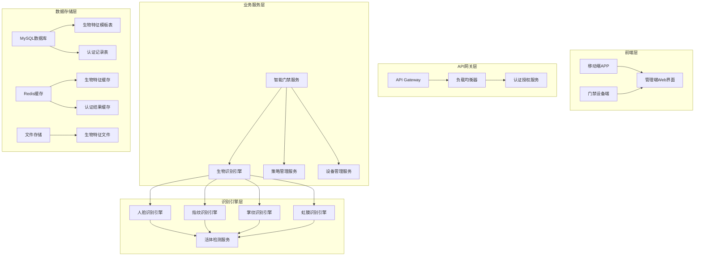

# 智能门禁多模态生物识别系统设计文档

## 📋 概述

本文档详细描述智能门禁多模态生物识别系统的技术设计和架构实现，基于IOE-DREAM智慧园区现有smart模块基础，扩展多模态生物识别能力，提供差异化安全级别的认证解决方案。

## 🏗️ 技术架构设计

### 整体架构图


### 核心设计原则

#### 1. 单一职责原则
- **BiometricRecognitionEngine**: 专门负责生物识别算法执行
- **AuthenticationStrategyManager**: 专门负责认证策略管理
- **BiometricDataEncryptionService**: 专门负责数据加密和安全
- **MultiModalFusionEngine**: 专门负责多模态结果融合

#### 2. 模块化设计
- 每种生物识别方式独立模块，支持插件化扩展
- 算法供应商可插拔，支持多种AI服务提供商
- 缓存模块、加密模块、日志模块完全解耦

#### 3. 接口隔离
- 定义统一的生物识别接口规范
- 外部设备通过标准化接口接入
- 前后端通过RESTful API进行通信

## 🔧 代码复用分析

### 现有组件利用

#### SmartDeviceEntity 扩展
```java
// 在现有SmartDeviceEntity基础上扩展
@Entity
@Table(name = "t_smart_device")
public class SmartDeviceEntity {
    // 现有字段...

    // 新增多模态生物识别配置
    @Column(name = "biometric_config")
    private String biometricConfig;

    @Column(name = "supported_biometric_types")
    private String supportedBiometricTypes;

    @Column(name = "biometric_status")
    private Integer biometricStatus;
}
```

#### SmartAccessControlController 增强
```java
@RestController
@RequestMapping("/api/smart/access")
public class SmartAccessControlController {

    private final SmartAccessControlService accessControlService;
    private final BiometricRecognitionService biometricService;

    // 新增多模态认证接口
    @PostMapping("/biometric/verify")
    public ResponseDTO<BiometricVerificationResult> verifyBiometricAccess(
            @RequestBody @Valid BiometricVerificationRequest request) {
        return biometricService.verifyBiometricIdentity(request);
    }

    @PostMapping("/multimodal/verify")
    public ResponseDTO<MultimodalVerificationResult> verifyMultimodalAccess(
            @RequestBody @Valid MultimodalVerificationRequest request) {
        return biometricService.performMultimodalVerification(request);
    }
}
```

#### SmartAccessPermissionEntity 集成
```java
// 增强权限实体支持生物识别关联
@Entity
@Table(name = "t_smart_access_permission")
public class SmartAccessPermissionEntity {
    // 现有字段...

    // 新增生物识别权限配置
    @Column(name = "required_biometric_types")
    private String requiredBiometricTypes;

    @Column(name = "biometric_confidence_threshold")
    private BigDecimal biometricConfidenceThreshold;

    @Column(name = "liveness_detection_required")
    private Boolean livenessDetectionRequired;
}
```

### 新增核心组件

#### BiometricRecognitionEngine
```java
@Service
@Component
public class BiometricRecognitionEngine {

    @Resource
    private Map<String, BiometricAlgorithm> biometricAlgorithms;

    @Resource
    private LivenessDetectionService livenessDetectionService;

    @Resource
    private BiometricDataEncryptionService encryptionService;

    /**
     * 执行单一生物识别
     */
    public BiometricResult performRecognition(
            BiometricType type,
            BiometricData data,
            Map<String, Object> parameters) {

        BiometricAlgorithm algorithm = biometricAlgorithms.get(type.name());
        if (algorithm == null) {
            throw new UnsupportedBiometricTypeException("不支持的生物识别类型: " + type);
        }

        // 1. 活体检测
        if (isLivenessDetectionRequired(parameters)) {
            LivenessResult livenessResult = livenessDetectionService.detectLiveness(
                data.getBiometricData(), type);
            if (!livenessResult.isLive()) {
                return BiometricResult.failure("活体检测失败: " + livenessResult.getReason());
            }
        }

        // 2. 生物识别
        return algorithm.recognize(data);
    }

    /**
     * 执行多模态融合识别
     */
    public MultimodalResult performMultimodalFusion(
            Map<BiometricType, BiometricResult> results,
            FusionStrategy strategy) {

        return multimodalFusionEngine.fuseResults(results, strategy);
    }
}
```

#### AuthenticationStrategyManager
```java
@Service
@Component
public class AuthenticationStrategyManager {

    @Resource
    private BiometricRecognitionEngine recognitionEngine;

    @Resource
    private AuthenticationStrategyRepository strategyRepository;

    /**
     * 根据区域安全级别执行认证策略
     */
    public AuthenticationResult executeAuthenticationStrategy(
            Long deviceId,
            BiometricRequest request) {

        // 1. 获取区域安全级别
        AuthenticationStrategy strategy = getDeviceStrategy(deviceId);

        // 2. 根据策略确定必需的生物识别方式
        List<BiometricType> requiredTypes = strategy.getRequiredBiometricTypes();

        // 3. 执行多模态认证
        Map<BiometricType, BiometricResult> results = new HashMap<>();
        for (BiometricType type : requiredTypes) {
            BiometricData data = request.getBiometricData(type);
            BiometricResult result = recognitionEngine.performRecognition(type, data,
                strategy.getParameters(type));
            results.put(type, result);

            // 4. 如果必需方式失败，检查是否有备用方式
            if (!result.isSuccess() && strategy.hasFallbackType(type)) {
                BiometricType fallbackType = strategy.getFallbackType(type);
                BiometricData fallbackData = request.getBiometricData(fallbackType);
                result = recognitionEngine.performRecognition(fallbackType, fallbackData,
                    strategy.getParameters(fallbackType));
                results.put(fallbackType, result);
            }
        }

        // 5. 结果融合决策
        return evaluateResults(results, strategy);
    }
}
```

## 📊 数据模型设计

### 核心数据表

#### 生物特征模板表 (t_biometric_templates)
```sql
CREATE TABLE t_biometric_templates (
    template_id BIGINT PRIMARY KEY AUTO_INCREMENT COMMENT '主键ID',
    employee_id BIGINT NOT NULL COMMENT '员工ID',
    biometric_type VARCHAR(50) NOT NULL COMMENT '生物识别类型',
    template_version VARCHAR(20) DEFAULT '1.0' COMMENT '模板版本号',
    template_data LONGTEXT NOT NULL COMMENT '模板数据（加密存储）',
    quality_metrics JSON COMMENT '质量指标',
    enroll_date DATE NOT NULL COMMENT '注册日期',
    last_update_date TIMESTAMP DEFAULT CURRENT_TIMESTAMP ON UPDATE CURRENT_TIMESTAMP COMMENT '最后更新日期',
    template_status TINYINT DEFAULT 1 COMMENT '状态：0-禁用，1-启用，2-过期',
    security_metadata JSON COMMENT '安全元数据',
    create_user_id BIGINT COMMENT '创建人ID',
    create_time DATETIME DEFAULT CURRENT_TIMESTAMP COMMENT '创建时间',
    update_time DATETIME DEFAULT CURRENT_TIMESTAMP ON UPDATE CURRENT_TIMESTAMP COMMENT '更新时间',
    deleted_flag TINYINT DEFAULT 0 COMMENT '删除标记：0-正常，1-删除',

    INDEX idx_employee_type (employee_id, biometric_type),
    INDEX idx_status_update (template_status, last_update_time),
    INDEX idx_deleted_flag (deleted_flag)
) COMMENT='生物特征模板表';
```

#### 生物识别记录表 (t_biometric_records)
```sql
CREATE TABLE t_biometric_records (
    record_id BIGINT PRIMARY KEY AUTO_INCREMENT COMMENT '主键ID',
    employee_id BIGINT NOT NULL COMMENT '员工ID',
    device_id BIGINT NOT NULL COMMENT '设备ID',
    biometric_type VARCHAR(50) NOT NULL COMMENT '生物识别类型',
    verification_result VARCHAR(50) NOT NULL COMMENT '验证结果：success/failure/timeout',
    confidence_score DECIMAL(5,4) COMMENT '置信度分数',
    processing_time INT COMMENT '处理时间(毫秒)',
    feature_vectors JSON COMMENT '特征向量',
    verification_metadata JSON COMMENT '验证元数据',
    failure_reason VARCHAR(500) COMMENT '失败原因',
    record_time DATETIME NOT NULL COMMENT '记录时间',

    INDEX idx_employee_device (employee_id, device_id),
    INDEX idx_type_time (biometric_type, record_time),
    INDEX idx_result (verification_result)
) COMMENT='生物识别记录表';
```

#### 认证策略配置表 (t_authentication_strategies)
```sql
CREATE TABLE t_authentication_strategies (
    strategy_id BIGINT PRIMARY KEY AUTO_INCREMENT COMMENT '主键ID',
    strategy_name VARCHAR(100) NOT NULL COMMENT '策略名称',
    security_level VARCHAR(50) NOT NULL COMMENT '安全级别：LOW/MEDIUM/HIGH/CRITICAL',
    strategy_config JSON NOT NULL COMMENT '策略配置JSON',
    device_types VARCHAR(200) COMMENT '适用设备类型',
    effective_start_time TIME COMMENT '生效开始时间',
    effective_end_time TIME COMMENT '生效结束时间',
    is_enabled TINYINT DEFAULT 1 COMMENT '是否启用：0-禁用，1-启用',
    create_user_id BIGINT COMMENT '创建人ID',
    create_time DATETIME DEFAULT CURRENT_TIMESTAMP COMMENT '创建时间',
    update_time DATETIME DEFAULT CURRENT_TIMESTAMP ON UPDATE CURRENT_TIMESTAMP COMMENT '更新时间',
    deleted_flag TINYINT DEFAULT 0 COMMENT '删除标记：0-正常，1-删除',

    UNIQUE KEY uk_strategy_name (strategy_name),
    INDEX idx_security_level (security_level),
    INDEX idx_enabled_time (is_enabled, create_time)
) COMMENT='认证策略配置表';
```

## 🚨 错误处理机制

### 异常场景处理

#### 1. 生物识别设备故障
```java
@Service
@Component
public class BiometricDeviceFailureHandler {

    @EventListener
    @Async
    public void handleDeviceFailure(BiometricDeviceFailureEvent event) {
        // 1. 标记设备离线状态
        deviceService.markDeviceOffline(event.getDeviceId());

        // 2. 切换到备用认证方式
        if (event.hasAlternativeMethod()) {
            authenticationService.enableFallbackMode(event.getDeviceId());
        }

        // 3. 通知维护人员
        notificationService.sendMaintenanceAlert(event);

        // 4. 记录故障日志
        auditService.logDeviceFailure(event);
    }
}
```

#### 2. 生物识别准确率异常
```java
@Service
@Component
public class BiometricAccuracyMonitor {

    @Scheduled(fixedRate = 300000) // 每5分钟执行一次
    public void monitorBiometricAccuracy() {
        Map<BiometricType, Double> currentAccuracy = calculateCurrentAccuracy();

        for (Map.Entry<BiometricType, Double> entry : currentAccuracy.entrySet()) {
            BiometricType type = entry.getKey();
            Double accuracy = entry.getValue();

            Double threshold = getAccuracyThreshold(type);
            if (accuracy < threshold) {
                // 准确率低于阈值，触发告警
                alertService.sendLowAccuracyAlert(type, accuracy, threshold);

                // 自动重新校准算法
                calibrationService.scheduleRecalibration(type);
            }
        }
    }
}
```

#### 3. 用户权限异常
```java
@Service
@Component
public class UserPermissionExceptionHandler {

    public AuthenticationResult handlePermissionException(
            BiometricRequest request,
            PermissionException exception) {

        switch (exception.getType()) {
            case INSUFFICIENT_PERMISSION:
                return AuthenticationResult.failure("权限不足");

            case EXPIRED_PERMISSION:
                return AuthenticationResult.failure("权限已过期");

            case SUSPICIOUS_ACTIVITY:
                // 记录可疑活动
                securityService.logSuspiciousActivity(request, exception);
                return AuthenticationResult.failure("安全风险，请联系管理员");

            default:
                return AuthenticationResult.failure("权限验证异常");
        }
    }
}
```

## 🧪 测试策略

### 单元测试

#### 核心组件测试
```java
@ExtendWith(MockitoExtension.class)
class BiometricRecognitionEngineTest {

    @Mock
    private FaceRecognitionEngine faceEngine;

    @Mock
    private LivenessDetectionService livenessService;

    @Inject
    private BiometricRecognitionEngine recognitionEngine;

    @Test
    void testFaceRecognitionSuccess() {
        // Given
        BiometricData faceData = createMockFaceData();
        when(faceEngine.recognize(any())).thenReturn(
            BiometricResult.success(0.95, "face_template_001"));

        // When
        BiometricResult result = recognitionEngine.performRecognition(
            BiometricType.FACE, faceData, new HashMap<>());

        // Then
        assertTrue(result.isSuccess());
        assertEquals(0.95, result.getConfidence());
        verify(livenessService).detectLiveness(any(), eq(BiometricType.FACE));
    }

    @Test
    void testLivenessDetectionFailure() {
        // Given
        BiometricData faceData = createMockFaceData();
        when(faceEngine.recognize(any())).thenReturn(
            BiometricResult.success(0.85, "face_template_001"));
        when(livenessService.detectLiveness(any(), eq(BiometricType.FACE)))
            .thenReturn(LivenessResult.failure("未检测到眨眼动作"));

        // When
        BiometricResult result = recognitionEngine.performRecognition(
            BiometricType.FACE, faceData, new HashMap<>());

        // Then
        assertFalse(result.isSuccess());
        assertTrue(result.getErrorMessage().contains("活体检测失败"));
    }
}
```

### 集成测试

#### 端到端认证流程测试
```java
@SpringBootTest
@AutoConfigureTestDatabase
@Transactional
class MultimodalAuthenticationIntegrationTest {

    @Autowired
    private SmartAccessControlService accessControlService;

    @Autowired
    private BiometricService biometricService;

    @Test
    void testHighSecurityLevelAuthentication() {
        // Given
        Long deviceId = 1001L; // HIGH安全级别设备
        MultimodalVerificationRequest request = createHighSecurityRequest();

        // When
        ResponseDTO<MultimodalVerificationResult> response =
            biometricService.performMultimodalVerification(request);

        // Then
        assertTrue(ResponseDTO.isSuccess());
        assertNotNull(response.getData());
        assertEquals("AUTHENTICATED", response.getData().getStatus());
        assertTrue(response.getData().getConfidence() >= 0.95);
    }

    @Test
    void testLowSecurityLevelFallback() {
        // Given
        Long deviceId = 1002L; // LOW安全级别设备
        BiometricVerificationRequest request = createLowSecurityRequest();

        // When
        ResponseDTO<BiometricVerificationResult> response =
            biometricService.verifyBiometricIdentity(request);

        // Then
        assertTrue(ResponseDTO.isSuccess());
        // LOW级别应该接受单因子认证
        assertNotNull(response.getData());
    }
}
```

### 性能测试

#### 并发认证压力测试
```java
@SpringBootTest
class ConcurrentAuthenticationLoadTest {

    private static final int CONCURRENT_USERS = 1000;
    private static final int REQUESTS_PER_USER = 10;

    @Test
    void testConcurrentAuthenticationLoad() throws Exception {
        ExecutorService executor = Executors.newFixedThreadPool(CONCURRENT_USERS);

        CountDownLatch latch = new CountDownLatch(CONCURRENT_USERS);
        AtomicInteger successCount = new AtomicInteger(0);
        AtomicInteger failureCount = new AtomicInteger(0);

        // When
        for (int i = 0; i < CONCURRENT_USERS; i++) {
            final int userId = i;
            executor.submit(() -> {
                try {
                    for (int j = 0; j < REQUESTS_PER_USER; j++) {
                        MultimodalVerificationRequest request =
                            createMockRequest(userId, j);

                        ResponseDTO<MultimodalVerificationResult> response =
                            biometricService.performMultimodalVerification(request);

                        if (response.isSuccess()) {
                            successCount.incrementAndGet();
                        } else {
                            failureCount.incrementAndGet();
                        }
                    }
                } finally {
                    latch.countDown();
                }
            });
        }

        latch.await(60, TimeUnit.SECONDS);

        // Then
        int totalRequests = CONCURRENT_USERS * REQUESTS_PER_USER;
        double successRate = (double) successCount.get() / totalRequests;

        assertTrue("成功率应该≥99%", successRate >= 0.99);
        assertTrue("平均响应时间应该≤2秒",
                   getAverageResponseTime() <= 2000);
    }
}
```

## 🔒 安全设计

### 数据加密
```java
@Service
@Component
public class BiometricDataEncryptionService {

    private final SM4Cipher sm4Cipher;
    private final SM3Digest sm3Digest;

    /**
     * 加密生物特征数据
     */
    public String encryptBiometricData(byte[] rawData) {
        try {
            // 生成随机密钥
            byte[] key = generateSecureKey();

            // SM4加密
            byte[] encryptedData = sm4Cipher.encrypt(rawData, key);

            // SM3完整性校验
            byte[] hash = sm3Digest.digest(rawData);

            // 组合密钥、加密数据和哈希
            return Base64.getEncoder().encodeToString(
                combineKeyDataHash(key, encryptedData, hash));
        } catch (Exception e) {
            throw new BiometricEncryptionException("生物特征数据加密失败", e);
        }
    }

    /**
     * 解密生物特征数据
     */
    public byte[] decryptBiometricData(String encryptedData) {
        try {
            byte[] combined = Base64.getDecoder().decode(encryptedData);

            // 分离密钥、加密数据和哈希
            byte[] key = extractKey(combined);
            byte[] data = extractData(combined);
            byte[] originalHash = extractHash(combined);

            // SM4解密
            byte[] decryptedData = sm4Cipher.decrypt(data, key);

            // 验证完整性
            byte[] currentHash = sm3Digest.digest(decryptedData);

            if (!Arrays.equals(originalHash, currentHash)) {
                throw new BiometricEncryptionException("数据完整性验证失败");
            }

            return decryptedData;
        } catch (Exception e) {
            throw new BiometricEncryptionException("生物特征数据解密失败", e);
        }
    }
}
```

### 访问控制
```java
@Service
@Component
public class BiometricAccessControlService {

    @Resource
    private EmployeeRepository employeeRepository;

    /**
     * 检查用户是否有生物识别权限
     */
    public boolean hasBiometricPermission(Long employeeId, BiometricType type) {
        EmployeeEntity employee = employeeRepository.findById(employeeId);
        if (employee == null) {
            return false;
        }

        return employee.getBiometricPermissions().contains(type);
    }

    /**
     * 检查设备是否支持指定生物识别类型
     */
    public boolean isDeviceSupportedBiometricType(Long deviceId, BiometricType type) {
        DeviceEntity device = deviceRepository.findById(deviceId);
        if (device == null) {
            return false;
        }

        return device.getSupportedBiometricTypes().contains(type);
    }
}
```

通过以上设计，智能门禁多模态生物识别系统将提供高安全性、高性能、高可扩展性的生物识别解决方案，满足IOE-DREAM智慧园区的安全需求。