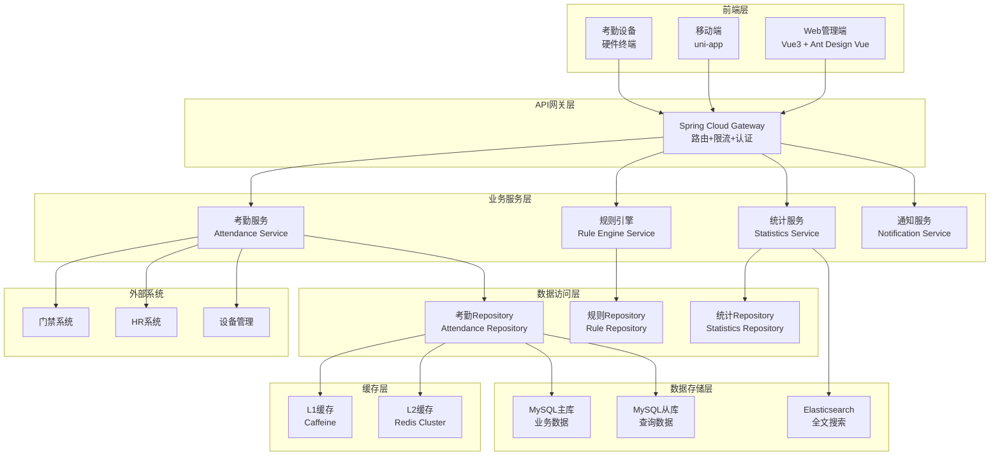

# 考勤模块技术设计方案

> **变更ID**: enhance-attendance-module
> **设计时间**: 2025-11-16
> **架构师**: SmartAdmin规范治理委员会
> **版本**: v1.0

## 🏗️ 架构设计

### 整体架构图



### 四层架构详细设计

#### Controller层 (接口控制层)
```java
@RestController
@RequestMapping("/api/attendance")
@Tag(name = "考勤管理", description = "考勤打卡、规则管理、统计报表API")
@SaCheckLogin
public class AttendanceController {

    @Resource
    private AttendanceService attendanceService;

    // 员工打卡相关接口
    @PostMapping("/punch")
    @SaCheckPermission("attendance:punch")
    public ResponseDTO<String> punch(@Valid @RequestBody AttendancePunchForm punchForm);

    // 考勤记录查询
    @PostMapping("/records/page")
    @SaCheckPermission("attendance:record:query")
    public ResponseDTO<PageResult<AttendanceRecordVO>> pageRecords(@Valid @RequestBody AttendanceRecordQueryForm queryForm);

    // 异常处理
    @PostMapping("/exception/handle")
    @SaCheckPermission("attendance:exception:handle")
    public ResponseDTO<String> handleException(@Valid @RequestBody AttendanceExceptionHandleForm handleForm);

    // 统计报表
    @PostMapping("/statistics/monthly")
    @SaCheckPermission("attendance:statistics:view")
    public ResponseDTO<AttendanceStatisticsVO> getMonthlyStatistics(@Valid @RequestBody AttendanceStatisticsForm statisticsForm);
}
```

#### Service层 (业务逻辑层)
```java
@Service
@Transactional(rollbackFor = Exception.class)
@Slf4j
public class AttendanceServiceImpl implements AttendanceService {

    @Resource
    private AttendanceRepository attendanceRepository;

    @Resource
    private AttendanceManager attendanceManager;

    @Resource
    private AttendanceRuleEngine ruleEngine;

    @Override
    public String punch(AttendancePunchForm punchForm) {
        // 1. 参数验证
        this.validatePunchForm(punchForm);

        // 2. 业务规则验证
        AttendanceRule rule = ruleEngine.getApplicableRule(punchForm.getEmployeeId());
        this.validatePunchTime(punchForm, rule);

        // 3. 构建考勤记录
        AttendanceRecordEntity record = this.buildAttendanceRecord(punchForm, rule);

        // 4. 保存数据
        attendanceRepository.insert(record);

        // 5. 异常检测和处理
        this.detectAndHandleException(record, rule);

        // 6. 清除缓存
        attendanceManager.clearEmployeeCache(punchForm.getEmployeeId());

        // 7. 发送通知
        this.sendPunchNotification(record);

        return ResponseStringConst.SUCCESS;
    }
}
```

#### Manager层 (复杂业务层)
```java
@Component
@Slf4j
public class AttendanceManager {

    @Resource
    private RedisTemplate<String, Object> redisTemplate;

    @Resource
    private AttendanceRepository attendanceRepository;

    // L1本地缓存
    private final Cache<String, Object> localCache = Caffeine.newBuilder()
        .maximumSize(10_000)
        .expireAfterWrite(5, TimeUnit.MINUTES)
        .recordStats()
        .build();

    /**
     * 获取员工考勤状态（多级缓存）
     */
    public AttendanceStatusVO getEmployeeStatus(Long employeeId, String date) {
        String cacheKey = buildCacheKey(employeeId, ":status:" + date);

        // 1. L1缓存查询
        AttendanceStatusVO status = (AttendanceStatusVO) localCache.getIfPresent(cacheKey);
        if (status != null) {
            log.debug("L1缓存命中, employeeId: {}, date: {}", employeeId, date);
            return status;
        }

        // 2. L2缓存查询
        try {
            status = (AttendanceStatusVO) redisTemplate.opsForValue().get(cacheKey);
            if (status != null) {
                localCache.put(cacheKey, status);
                log.debug("L2缓存命中, employeeId: {}, date: {}", employeeId, date);
                return status;
            }
        } catch (Exception e) {
            log.warn("Redis访问异常, employeeId: {}, date: {}", employeeId, date, e);
        }

        // 3. 数据库查询
        status = this.calculateEmployeeStatus(employeeId, date);

        // 4. 异步写入缓存
        this.setCacheAsync(cacheKey, status);

        return status;
    }

    /**
     * 考勤规则引擎处理
     */
    public AttendanceProcessResult processWithRules(AttendanceRecordEntity record, AttendanceRule rule) {
        // 规则匹配和处理逻辑
        return AttendanceRuleProcessor.process(record, rule);
    }
}
```

#### Repository层 (数据访问层)
```java
@Mapper
@Repository
public interface AttendanceRepository extends BaseMapper<AttendanceRecordEntity> {

    /**
     * 分页查询考勤记录
     */
    Page<AttendanceRecordEntity> selectRecordPage(@Param("query") AttendanceRecordQueryForm query);

    /**
     * 查询员工当日考勤记录
     */
    AttendanceRecordEntity selectTodayRecord(@Param("employeeId") Long employeeId, @Param("date") String date);

    /**
     * 统计员工月度考勤数据
     */
    List<AttendanceStatisticsEntity> selectMonthlyStatistics(@Param("employeeId") Long employeeId, @Param("yearMonth") String yearMonth);

    /**
     * 批量插入考勤记录
     */
    int insertBatch(@Param("records") List<AttendanceRecordEntity> records);
}
```

## 🗄️ 数据模型设计

### 核心业务表

#### 考勤记录表 (t_attendance_record)
```sql
CREATE TABLE `t_attendance_record` (
  `record_id` bigint(20) NOT NULL AUTO_INCREMENT COMMENT '记录ID',
  `employee_id` bigint(20) NOT NULL COMMENT '员工ID',
  `attendance_date` date NOT NULL COMMENT '考勤日期',
  `punch_in_time` time DEFAULT NULL COMMENT '上班打卡时间',
  `punch_out_time` time DEFAULT NULL COMMENT '下班打卡时间',
  `punch_in_location` varchar(500) DEFAULT NULL COMMENT '上班打卡位置',
  `punch_out_location` varchar(500) DEFAULT NULL COMMENT '下班打卡位置',
  `punch_in_device_id` bigint(20) DEFAULT NULL COMMENT '上班打卡设备ID',
  `punch_out_device_id` bigint(20) DEFAULT NULL COMMENT '下班打卡设备ID',
  `work_hours` decimal(4,2) DEFAULT NULL COMMENT '工作时长(小时)',
  `overtime_hours` decimal(4,2) DEFAULT NULL COMMENT '加班时长(小时)',
  `attendance_status` varchar(20) DEFAULT 'NORMAL' COMMENT '考勤状态',
  `exception_type` varchar(50) DEFAULT NULL COMMENT '异常类型',
  `exception_reason` varchar(500) DEFAULT NULL COMMENT '异常原因',
  `is_processed` tinyint(1) DEFAULT '0' COMMENT '是否已处理异常',
  `processed_by` bigint(20) DEFAULT NULL COMMENT '异常处理人',
  `processed_time` datetime DEFAULT NULL COMMENT '异常处理时间',
  `create_time` datetime NOT NULL DEFAULT CURRENT_TIMESTAMP COMMENT '创建时间',
  `update_time` datetime NOT NULL DEFAULT CURRENT_TIMESTAMP ON UPDATE CURRENT_TIMESTAMP COMMENT '更新时间',
  `deleted_flag` tinyint(1) NOT NULL DEFAULT '0' COMMENT '删除标记 0-正常 1-删除',
  `create_user_id` bigint(20) DEFAULT NULL COMMENT '创建人ID',
  `update_user_id` bigint(20) DEFAULT NULL COMMENT '更新人ID',
  `version` int(11) NOT NULL DEFAULT '0' COMMENT '版本号（乐观锁）',
  PRIMARY KEY (`record_id`),
  KEY `idx_employee_date` (`employee_id`, `attendance_date`),
  KEY `idx_attendance_date` (`attendance_date`),
  KEY `idx_status` (`attendance_status`),
  KEY `idx_create_time` (`create_time`)
) ENGINE=InnoDB DEFAULT CHARSET=utf8mb4 COLLATE=utf8mb4_unicode_ci COMMENT='考勤记录表';
```

#### 考勤规则表 (t_attendance_rule)
```sql
CREATE TABLE `t_attendance_rule` (
  `rule_id` bigint(20) NOT NULL AUTO_INCREMENT COMMENT '规则ID',
  `rule_name` varchar(100) NOT NULL COMMENT '规则名称',
  `rule_code` varchar(50) NOT NULL COMMENT '规则编码',
  `company_id` bigint(20) NOT NULL COMMENT '公司ID',
  `department_id` bigint(20) DEFAULT NULL COMMENT '部门ID',
  `employee_type` varchar(50) DEFAULT NULL COMMENT '适用员工类型',
  `work_schedule` json NOT NULL COMMENT '工作排班配置',
  `late_tolerance` int(11) DEFAULT '0' COMMENT '迟到容忍分钟数',
  `early_tolerance` int(11) DEFAULT '0' COMMENT '早退容忍分钟数',
  `overtime_rules` json DEFAULT NULL COMMENT '加班规则配置',
  `holiday_rules` json DEFAULT NULL COMMENT '节假日规则配置',
  `gps_validation` tinyint(1) DEFAULT '0' COMMENT '是否启用GPS验证',
  `gps_range` int(11) DEFAULT '100' COMMENT 'GPS验证范围(米)',
  `photo_required` tinyint(1) DEFAULT '0' COMMENT '是否需要拍照打卡',
  `status` varchar(20) DEFAULT 'ACTIVE' COMMENT '规则状态',
  `effective_date` date NOT NULL COMMENT '生效日期',
  `expiry_date` date DEFAULT NULL COMMENT '失效日期',
  `create_time` datetime NOT NULL DEFAULT CURRENT_TIMESTAMP COMMENT '创建时间',
  `update_time` datetime NOT NULL DEFAULT CURRENT_TIMESTAMP ON UPDATE CURRENT_TIMESTAMP COMMENT '更新时间',
  `deleted_flag` tinyint(1) NOT NULL DEFAULT '0' COMMENT '删除标记 0-正常 1-删除',
  `create_user_id` bigint(20) DEFAULT NULL COMMENT '创建人ID',
  `update_user_id` bigint(20) DEFAULT NULL COMMENT '更新人ID',
  `version` int(11) NOT NULL DEFAULT '0' COMMENT '版本号（乐观锁）',
  PRIMARY KEY (`rule_id`),
  UNIQUE KEY `uk_rule_code` (`rule_code`),
  KEY `idx_company_id` (`company_id`),
  KEY `idx_department_id` (`department_id`),
  KEY `idx_status` (`status`),
  KEY `idx_effective_date` (`effective_date`)
) ENGINE=InnoDB DEFAULT CHARSET=utf8mb4 COLLATE=utf8mb4_unicode_ci COMMENT='考勤规则表';
```

#### 排班管理表 (t_attendance_schedule)
```sql
CREATE TABLE `t_attendance_schedule` (
  `schedule_id` bigint(20) NOT NULL AUTO_INCREMENT COMMENT '排班ID',
  `employee_id` bigint(20) NOT NULL COMMENT '员工ID',
  `schedule_date` date NOT NULL COMMENT '排班日期',
  `shift_id` bigint(20) NOT NULL COMMENT '班次ID',
  `work_start_time` time NOT NULL COMMENT '工作开始时间',
  `work_end_time` time NOT NULL COMMENT '工作结束时间',
  `break_start_time` time DEFAULT NULL COMMENT '休息开始时间',
  `break_end_time` time DEFAULT NULL COMMENT '休息结束时间',
  `work_hours` decimal(4,2) NOT NULL COMMENT '工作时长(小时)',
  `is_holiday` tinyint(1) DEFAULT '0' COMMENT '是否节假日',
  `is_overtime_day` tinyint(1) DEFAULT '0' COMMENT '是否加班日',
  `schedule_type` varchar(20) DEFAULT 'NORMAL' COMMENT '排班类型',
  `remarks` varchar(500) DEFAULT NULL COMMENT '备注',
  `create_time` datetime NOT NULL DEFAULT CURRENT_TIMESTAMP COMMENT '创建时间',
  `update_time` datetime NOT NULL DEFAULT CURRENT_TIMESTAMP ON UPDATE CURRENT_TIMESTAMP COMMENT '更新时间',
  `deleted_flag` tinyint(1) NOT NULL DEFAULT '0' COMMENT '删除标记 0-正常 1-删除',
  `create_user_id` bigint(20) DEFAULT NULL COMMENT '创建人ID',
  `update_user_id` bigint(20) DEFAULT NULL COMMENT '更新人ID',
  `version` int(11) NOT NULL DEFAULT '0' COMMENT '版本号（乐观锁）',
  PRIMARY KEY (`schedule_id`),
  UNIQUE KEY `uk_employee_date` (`employee_id`, `schedule_date`),
  KEY `idx_schedule_date` (`schedule_date`),
  KEY `idx_shift_id` (`shift_id`),
  KEY `idx_create_time` (`create_time`)
) ENGINE=InnoDB DEFAULT CHARSET=utf8mb4 COLLATE=utf8mb4_unicode_ci COMMENT='排班管理表';
```

## 🔄 缓存架构设计

### 多级缓存策略
```java
@Component
@Slf4j
public class AttendanceCacheManager extends BaseCacheManager {

    // 缓存键常量
    private static final String ATTENDANCE_PREFIX = "attendance:";
    private static final String RECORD_SUFFIX = ":record:";
    private static final String RULE_SUFFIX = ":rule:";
    private static final String STATISTICS_SUFFIX = ":statistics:";
    private static final String STATUS_SUFFIX = ":status:";

    /**
     * 缓存键命名规范
     * attendance:record:{employeeId}:{date} - 员工考勤记录
     * attendance:rule:{employeeId}:{date} - 适用考勤规则
     * attendance:statistics:{employeeId}:{yearMonth} - 月度统计数据
     * attendance:status:{employeeId}:{date} - 考勤状态
     */

    @Override
    protected String getCachePrefix() {
        return ATTENDANCE_PREFIX;
    }

    /**
     * Cache-Aside模式缓存操作
     */
    public <T> T getCacheWithFallback(String cacheKey, Supplier<T> dataLoader, Class<T> clazz) {
        // 1. 查询L1缓存
        T data = (T) localCache.getIfPresent(cacheKey);
        if (data != null) {
            log.debug("L1缓存命中, cacheKey: {}", cacheKey);
            return data;
        }

        // 2. 查询L2缓存
        try {
            data = redisTemplate.opsForValue().get(cacheKey);
            if (data != null) {
                localCache.put(cacheKey, data);
                log.debug("L2缓存命中, cacheKey: {}", cacheKey);
                return data;
            }
        } catch (Exception e) {
            log.warn("Redis访问异常, cacheKey: {}", cacheKey, e);
        }

        // 3. 查询数据库
        data = dataLoader.get();
        if (data != null) {
            // 4. 异步写入缓存
            this.setCacheAsync(cacheKey, data);
        }

        return data;
    }

    /**
     * 双删策略清除缓存
     */
    @Async("cacheExecutor")
    public void removeCacheWithDoubleDelete(String cacheKey) {
        try {
            // 第一次删除
            localCache.invalidate(cacheKey);
            redisTemplate.delete(cacheKey);

            // 延迟500ms后再次删除
            Thread.sleep(500);
            localCache.invalidate(cacheKey);
            redisTemplate.delete(cacheKey);

            log.info("缓存双删完成, cacheKey: {}", cacheKey);
        } catch (Exception e) {
            log.error("缓存清除失败, cacheKey: {}", cacheKey, e);
        }
    }
}
```

## 📱 移动端架构设计

### 移动端功能模块
```javascript
// 考勤移动端API封装
export const attendanceAPI = {
  // 打卡接口
  punch: (data) => {
    return request({
      url: '/api/attendance/mobile/punch',
      method: 'post',
      data: {
        ...data,
        location: getCurrentLocation(), // GPS定位
        deviceInfo: getDeviceInfo(),   // 设备信息
        timestamp: Date.now()
      }
    })
  },

  // 获取考勤状态
  getTodayStatus: () => {
    return request({
      url: '/api/attendance/mobile/status',
      method: 'get'
    })
  },

  // 离线打卡数据同步
  syncOfflineData: (offlineRecords) => {
    return request({
      url: '/api/attendance/mobile/sync',
      method: 'post',
      data: { offlineRecords }
    })
  }
}
```

### GPS定位验证
```java
@Service
@Slf4j
public class AttendanceLocationValidator {

    /**
     * GPS定位验证
     */
    public ValidationResult validateLocation(Long employeeId, LocationDTO location) {
        // 1. 获取员工允许的打卡位置
        List<LocationPoint> allowedLocations = getEmployeeAllowedLocations(employeeId);

        // 2. 计算距离
        for (LocationPoint allowedLocation : allowedLocations) {
            double distance = calculateDistance(location, allowedLocation);
            if (distance <= allowedLocation.getRadius()) {
                return ValidationResult.success();
            }
        }

        return ValidationResult.fail("不在允许的打卡范围内");
    }

    /**
     * 计算两点间距离（米）
     */
    private double calculateDistance(LocationDTO current, LocationPoint target) {
        // 使用Haversine公式计算地球表面两点间距离
        double lat1 = Math.toRadians(current.getLatitude());
        double lon1 = Math.toRadians(current.getLongitude());
        double lat2 = Math.toRadians(target.getLatitude());
        double lon2 = Math.toRadians(target.getLongitude());

        double dLat = lat2 - lat1;
        double dLon = lon2 - lon1;

        double a = Math.sin(dLat/2) * Math.sin(dLat/2) +
                   Math.cos(lat1) * Math.cos(lat2) *
                   Math.sin(dLon/2) * Math.sin(dLon/2);
        double c = 2 * Math.atan2(Math.sqrt(a), Math.sqrt(1-a));

        return 6371000 * c; // 地球半径6371km
    }
}
```

## 📊 统计报表设计

### 统计数据计算引擎
```java
@Component
@Slf4j
public class AttendanceStatisticsEngine {

    /**
     * 计算员工月度考勤统计
     */
    public AttendanceMonthlyStatistics calculateMonthlyStatistics(Long employeeId, String yearMonth) {
        AttendanceMonthlyStatistics statistics = new AttendanceMonthlyStatistics();

        // 1. 获取月度考勤记录
        List<AttendanceRecordEntity> records = attendanceRepository.selectMonthlyRecords(employeeId, yearMonth);

        // 2. 计算基础统计数据
        statistics.setTotalDays(records.size());
        statistics.setPresentDays((int) records.stream().filter(r -> "PRESENT".equals(r.getAttendanceStatus())).count());
        statistics.setAbsentDays((int) records.stream().filter(r -> "ABSENT".equals(r.getAttendanceStatus())).count());

        // 3. 计算迟到早退统计
        statistics.setLateDays((int) records.stream().filter(r -> "LATE".equals(r.getExceptionType())).count());
        statistics.setEarlyLeaveDays((int) records.stream().filter(r -> "EARLY_LEAVE".equals(r.getExceptionType())).count());

        // 4. 计算工作时长
        double totalWorkHours = records.stream()
            .filter(r -> r.getWorkHours() != null)
            .mapToDouble(AttendanceRecordEntity::getWorkHours)
            .sum();
        statistics.setTotalWorkHours(totalWorkHours);

        // 5. 计算加班时长
        double totalOvertimeHours = records.stream()
            .filter(r -> r.getOvertimeHours() != null)
            .mapToDouble(AttendanceRecordEntity::getOvertimeHours)
            .sum();
        statistics.setTotalOvertimeHours(totalOvertimeHours);

        // 6. 计算出勤率
        statistics.setAttendanceRate(calculateAttendanceRate(statistics));

        return statistics;
    }
}
```

## 🔒 安全设计

### 数据安全
1. **位置信息加密**: GPS坐标使用AES加密存储
2. **照片安全**: 打卡照片存储在OSS，访问权限控制
3. **数据脱敏**: 敏感信息脱敏显示
4. **访问控制**: 基于角色的细粒度权限控制

### 防作弊机制
1. **GPS验证**: 限制打卡范围，防止代打卡
2. **设备绑定**: 限制打卡设备，防止异常设备
3. **时间验证**: 防止异常时间打卡
4. **行为分析**: AI分析异常打卡行为

## 🚀 性能优化

### 数据库优化
1. **索引优化**: 建立合适的复合索引
2. **分区表**: 按月份分区存储历史数据
3. **读写分离**: 查询操作使用从库
4. **连接池优化**: Druid连接池参数调优

### 应用层优化
1. **多级缓存**: L1+L2缓存策略
2. **异步处理**: 异步处理耗时操作
3. **批量操作**: 批量插入和更新
4. **分页查询**: 避免大量数据传输

---

**📋 本设计严格遵循repowiki架构规范，确保系统的高性能、高可用和可扩展性**