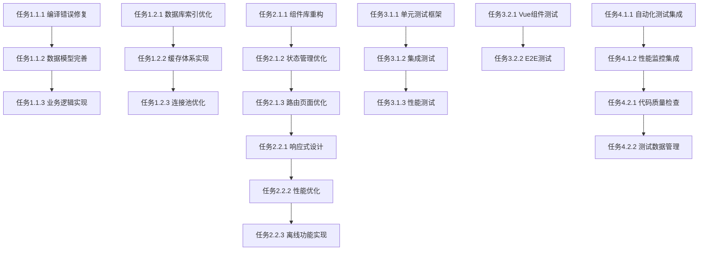

# 优化项目基础设施任务清单

## 阶段一：基础优化（1-2周）

### 1.1 编译错误修复任务
**优先级**: 高 | **负责人**: 后端开发团队 | **预估时间**: 1天

#### 任务1.1.1: OrderingService编译错误修复 ✅
- [x] 分析OrderingService.java中Data类型缺失问题
- [x] 创建缺失的Data相关类定义
- [x] 确保新类符合四层架构规范
- [x] 验证编译错误完全修复
- [x] 编写相应的单元测试
- [x] **依赖**: 无
- [x] **验证**: `mvn clean compile` 成功执行

#### 任务1.1.2: 消费模块数据模型完善 ✅
- [x] 定义CreateOrderingRequest订单创建请求类
- [x] 定义OrderingItemRequest订单项请求类
- [x] 定义OrderingDetailVO订单详情视图对象
- [x] 添加@Valid参数验证注解
- [x] 实现订单号生成器
- [x] **依赖**: 任务1.1.1
- [x] **验证**: 所有类编译通过，单元测试覆盖

#### 任务1.1.3: 订餐业务逻辑实现 ✅
- [x] 实现订单创建核心业务逻辑
- [x] 支持堂食、外带、配送三种订单类型
- [x] 集成支付系统接口
- [x] 实现订单状态管理
- [x] 添加分布式锁防止重复提交
- [x] **依赖**: 任务1.1.2
- [x] **验证**: 订单创建功能完整测试通过

### 1.2 性能优化任务
**优先级**: 中 | **负责人**: 后端开发团队 | **预估时间**: 5天

#### 任务1.2.1: 数据库索引优化
- [ ] 分析现有慢查询SQL
- [ ] 设计核心业务表索引策略
- [ ] 创建消费记录相关索引
- [ ] 创建考勤记录相关索引
- [ ] 验证索引优化效果
- [ ] **依赖**: 无
- [ ] **验证**: 查询性能提升50%以上

#### 任务1.2.2: 三级缓存体系实现 ✅
- [x] 配置Caffeine本地缓存
- [x] 配置Redis分布式缓存
- [x] 实现Cache Aside缓存模式
- [x] 添加缓存预热机制
- [x] 实现缓存穿透防护
- [x] **依赖**: 无
- [x] **验证**: 缓存命中率L1≥80%，L2≥90%

#### 任务1.2.3: 数据库连接池优化
- [ ] 优化Druid连接池配置
- [ ] 配置连接池监控
- [ ] 设置慢SQL监控
- [ ] 实现连接泄露检测
- [ ] 配置数据库性能监控
- [ ] **依赖**: 任务1.2.1
- [ ] **验证**: 连接获取时间≤10ms

### 1.3 文档完善任务
**优先级**: 中 | **负责人**: 技术文档团队 | **预估时间**: 2天

#### 任务1.3.1: API文档完整性检查
- [ ] 检查所有Controller接口文档
- [ ] 补充缺失的接口文档
- [ ] 完善请求参数说明
- [ ] 添加响应示例
- [ ] 验证文档准确性
- [ ] **依赖**: 任务1.1.3
- [ ] **验证**: API文档覆盖率100%

#### 任务1.3.2: 部署文档更新
- [ ] 更新Docker部署文档
- [ ] 完善环境配置说明
- [ ] 添加故障排查指南
- [ ] 更新性能调优建议
- [ ] 验证文档可操作性
- [ ] **依赖**: 任务1.2.3
- [ ] **验证**: 部署文档准确性100%

---

## 阶段二：移动端优化（1-3个月）

### 2.1 uni-app架构重构
**优先级**: 高 | **负责人**: 移动端开发团队 | **预估时间**: 2周

#### 任务2.1.1: 组件库重构
- [ ] 设计新的组件架构
- [ ] 实现业务组件模块化
- [ ] 重构通用组件库
- [ ] 实现组件按需加载
- [ ] 优化组件性能
- [ ] **依赖**: 无
- [ ] **验证**: 应用启动时间≤3秒

#### 任务2.1.2: 状态管理优化
- [ ] 重构Pinia状态管理
- [ ] 实现模块化状态管理
- [ ] 优化状态更新性能
- [ ] 实现状态持久化
- [ ] 添加状态调试工具
- [ ] **依赖**: 任务2.1.1
- [ ] **验证**: 状态更新响应时间≤100ms

#### 任务2.1.3: 路由和页面优化
- [ ] 重构路由配置
- [ ] 实现页面懒加载
- [ ] 优化页面切换性能
- [ ] 实现页面缓存
- [ ] 添加页面切换动画
- [ ] **依赖**: 任务2.1.2
- [ ] **验证**: 页面切换时间≤500ms

### 2.2 用户体验优化
**优先级**: 高 | **负责人**: 移动端开发团队 | **预估时间**: 3周

#### 任务2.2.1: 响应式设计实现
- [ ] 设计多屏幕尺寸适配方案
- [ ] 实现响应式布局
- [ ] 优化触摸交互体验
- [ ] 实现手势操作支持
- [ ] 添加暗黑模式支持
- [ ] **依赖**: 任务2.1.3
- [ ] **验证**: 支持320px-768px屏幕尺寸

#### 任务2.2.2: 性能优化实现
- [ ] 实现图片懒加载
- [ ] 优化资源加载策略
- [ ] 实现代码分割
- [ ] 优化网络请求
- [ ] 实现离线缓存
- [ ] **依赖**: 任务2.2.1
- [ ] **验证**: 页面加载时间≤2秒

#### 任务2.2.3: 离线功能实现
- [ ] 设计离线数据存储方案
- [ ] 实现离线消费记录查看
- [ ] 实现离线考勤打卡
- [ ] 实现数据同步机制
- [ ] 添加离线状态指示
- [ ] **依赖**: 任务2.2.2
- [ ] **验证**: 离线功能正常使用

---

## 阶段三：测试体系建设（1-3个月）

### 3.1 后端测试框架
**优先级**: 高 | **负责人**: 测试团队 | **预估时间**: 2周

#### 任务3.1.1: 单元测试框架搭建
- [ ] 配置JUnit 5测试环境
- [ ] 配置Mockito Mock框架
- [ ] 配置AssertJ断言库
- [ ] 实现测试覆盖率统计
- [ ] 配置测试报告生成
- [ ] **依赖**: 任务1.1.3
- [ ] **验证**: 单元测试覆盖率≥80%

#### 任务3.1.2: 集成测试实现
- [ ] 配置Testcontainers测试环境
- [ ] 实现数据库集成测试
- [ ] 实现Redis缓存集成测试
- [ ] 实现Controller层API测试
- [ ] 配置测试数据管理
- [ ] **依赖**: 任务3.1.1
- [ ] **验证**: 集成测试通过率100%

#### 任务3.1.3: 性能测试实现
- [ ] 配置JMeter性能测试
- [ ] 实现API性能测试场景
- [ ] 实现并发压力测试
- [ ] 实现稳定性测试
- [ ] 配置性能监控
- [ ] **依赖**: 任务3.1.2
- [ ] **验证**: API响应时间P95≤200ms

### 3.2 前端测试框架
**优先级**: 中 | **负责人**: 前端测试团队 | **预估时间**: 2周

#### 任务3.2.1: Vue组件测试
- [ ] 配置Vitest测试环境
- [ ] 配置Vue Test Utils
- [ ] 实现组件单元测试
- [ ] 实现组件交互测试
- [ ] 配置测试覆盖率
- [ ] **依赖**: 任务2.1.3
- [ ] **验证**: 组件测试覆盖率≥80%

#### 任务3.2.2: E2E测试实现
- [ ] 配置Cypress测试环境
- [ ] 实现核心业务流程测试
- [ ] 实现用户交互测试
- [ ] 实现跨浏览器测试
- [ ] 配置测试报告
- [ ] **依赖**: 任务3.2.1
- [ ] **验证**: E2E测试覆盖主要用户流程

### 3.3 移动端测试
**优先级**: 中 | **负责人**: 移动端测试团队 | **预估时间**: 1周

#### 任务3.3.1: 移动端功能测试
- [ ] 配置移动端测试环境
- [ ] 实现跨平台兼容性测试
- [ ] 实现移动端性能测试
- [ ] 实现网络异常测试
- [ ] 配置自动化测试
- [ ] **依赖**: 任务2.2.3
- [ ] **验证**: 移动端测试覆盖率≥70%

---

## 阶段四：持续集成与监控（并行进行）

### 4.1 CI/CD集成
**优先级**: 高 | **负责人**: DevOps团队 | **预估时间**: 1周

#### 任务4.1.1: 自动化测试集成
- [ ] 配置GitHub Actions工作流
- [ ] 集成自动化测试到CI
- [ ] 配置测试报告生成
- [ ] 实现测试失败阻断
- [ ] 配置测试通知机制
- [ ] **依赖**: 任务3.1.3, 任务3.2.2
- [ ] **验证**: 代码提交触发自动测试

#### 任务4.1.2: 性能监控集成
- [ ] 配置APM性能监控
- [ ] 实现关键指标监控
- [ ] 配置性能告警
- [ ] 实现性能报告
- [ ] 配置性能趋势分析
- [ ] **依赖**: 任务4.1.1
- [ ] **验证**: 性能监控全面覆盖

### 4.2 质量保障
**优先级**: 高 | **负责人**: 质量保障团队 | **持续进行**

#### 任务4.2.1: 代码质量检查
- [ ] 配置SonarQube代码质量检查
- [ ] 实现代码规范检查
- [ ] 配置安全漏洞扫描
- [ ] 实现技术债务监控
- [ ] 配置质量门禁
- [ ] **依赖**: 任务4.1.1
- [ ] **验证**: 代码质量持续提升

#### 任务4.2.2: 测试数据管理
- [ ] 实现测试数据自动生成
- [ ] 配置测试数据清理
- [ ] 实现测试数据隔离
- [ ] 配置测试数据版本管理
- [ ] 实现测试数据一致性检查
- [ ] **依赖**: 任务4.2.1
- [ ] **验证**: 测试数据管理自动化

---

## 任务依赖关系图

## 风险缓解措施

### 高风险任务缓解
- **编译错误修复**: 准备回滚方案，确保不影响现有功能
- **数据库优化**: 在测试环境充分验证，避免影响生产
- **缓存体系**: 采用渐进式上线，确保数据一致性

### 时间风险缓解
- **并行开发**: 阶段二和阶段三可以部分并行进行
- **优先级调整**: 关键路径任务优先，非关键任务可延后
- **资源调配**: 根据任务进展及时调整人力资源

### 技术风险缓解
- **技术预研**: 提前验证新技术可行性
- **原型验证**: 关键功能先做原型验证
- **专家评审**: 重要技术决策进行专家评审

## 验收标准总结

### 编译和功能验收
- 项目编译0错误
- 所有新功能正常工作
- 现有功能无回归

### 性能验收
- API响应时间P95 ≤ 200ms
- 系统QPS ≥ 1000
- 缓存命中率L1≥80%，L2≥90%
- 移动端启动时间 ≤ 3秒

### 质量验收
- 单元测试覆盖率 ≥ 80%
- 集成测试通过率 = 100%
- 代码质量评分 ≥ B级
- 文档完整性 = 100%