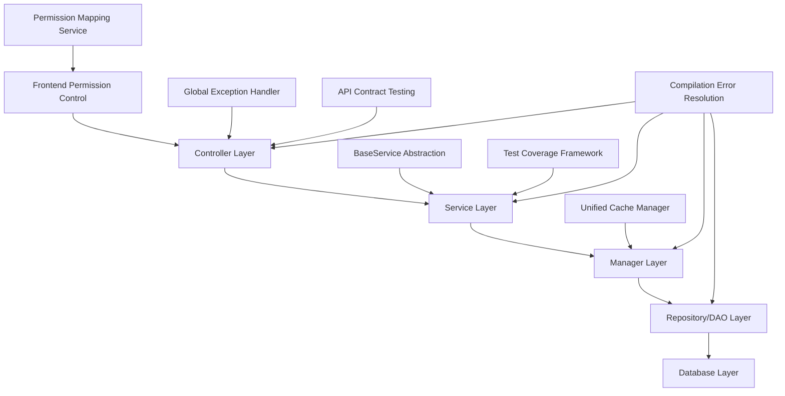

# Design Document

## Overview

This design document outlines the technical approach for completing the architecture optimization of the IOE-DREAM Smart Campus All-in-One Card Management Platform. The design focuses on achieving 100% enterprise-grade compliance through systematic improvements in code quality, architectural patterns, and operational excellence.

The solution leverages existing SmartAdmin v3 architectural patterns while introducing modern enterprise development practices including unified service abstractions, comprehensive error handling, and enhanced security controls.

## Steering Document Alignment

### Technical Standards (tech.md)
The design strictly follows documented technical patterns:
- **Four-Layer Architecture**: Controller→Service→Manager→DAO with strict separation of concerns
- **Dependency Injection**: Mandatory @Resource usage, prohibition of @Autowired
- **Jakarta EE 9+**: Complete migration from javax packages with systematic validation
- **UTF-8 Encoding**: Zero tolerance for encoding issues across all files
- **Sa-Token Security**: Comprehensive authentication and authorization implementation
- **MyBatis Plus**: Consistent ORM patterns with optimized query handling

### Project Structure (structure.md)
Implementation follows established project organization:
- **Module Structure**: Maintains sa-base/sa-admin separation with clear module boundaries
- **Package Organization**: net.lab1024.sa.{module}.{layer} naming convention
- **File Placement**: Consistent placement of entities, VOs, DTOs, and configuration files
- **Resource Management**: Proper resource organization for static files, templates, and configurations

## Code Reuse Analysis

### Existing Components to Leverage
- **BaseCacheManager**: Multi-level caching system (Caffeine L1 + Redis L2) for performance optimization
- **SmartException Framework**: Existing exception hierarchy for standardized error handling
- **ResponseDTO**: Unified response format wrapper for consistent API responses
- **Security Framework**: Sa-Token integration for authentication and authorization
- **Validation Framework**: @Valid annotation support with comprehensive validation rules
- **Audit Framework**: BaseEntity with automatic audit field management

### Integration Points
- **Database Schema**: Leverages existing t_* table structure with utf8mb4 encoding
- **API Gateway**: Integrates with existing security filters and middleware
- **File Storage**: Utilizes existing upload directory structure and file management
- **Cache Layer**: Integrates with existing Redis configuration and connection management
- **Logging System**: Leverages existing SLF4J configuration and log formatting

## Architecture

The architecture optimization implements a comprehensive enterprise-grade solution with multiple interconnected layers:



### Modular Design Principles
- **Single File Responsibility**: Each class handles one specific business concern or domain
- **Component Isolation**: Create focused, reusable components rather than large monolithic files
- **Service Layer Separation**: Clear separation between data access, business logic, and presentation layers
- **Utility Modularity**: Break utilities into focused, single-purpose modules with proper dependency management
- **DRY Principle**: Eliminate code duplication through BaseService abstraction and shared utilities

## Components and Interfaces

### Component 1: BaseService Abstraction Layer
- **Purpose**: Provide unified CRUD operations and consistent service patterns across all modules
- **Interfaces**: Generic CRUD methods, validation, caching, and audit support
- **Dependencies**: BaseDao, BaseEntity, SmartException, Validation Framework
- **Reuses**: Existing BaseEntity inheritance, ResponseDTO wrapping, @Transactional management

```java
public abstract class BaseService<T extends BaseEntity, ID> {
    protected abstract BaseDao<T, ID> getDao();

    public ResponseDTO<T> getById(ID id) {
        // Unified implementation with caching and validation
    }

    public ResponseDTO<PageResult<T>> getPage(PageParam pageParam) {
        // Unified pagination implementation
    }

    public ResponseDTO<Boolean> delete(ID id) {
        // Unified soft delete implementation
    }
}
```

### Component 2: Global Exception Handler
- **Purpose**: Centralize exception processing and provide consistent error responses
- **Interfaces**: Exception handling methods for different exception types
- **Dependencies**: SmartException hierarchy, ResponseDTO, Logging framework
- **Reuses**: Existing SmartException classes, ResponseDTO format, SLF4J logging

```java
@RestControllerAdvice
@Slf4j
public class GlobalExceptionHandler {
    @ExceptionHandler(BusinessException.class)
    public ResponseDTO<Void> handleBusinessException(BusinessException e) {
        // Consistent business exception handling
    }

    @ExceptionHandler(Exception.class)
    public ResponseDTO<Void> handleSystemException(Exception e) {
        // System-wide exception handling
    }
}
```

### Component 3: Compilation Error Resolution Framework
- **Purpose**: Systematic identification and resolution of compilation issues
- **Interfaces**: Error detection, classification, and automated fixing capabilities
- **Dependencies**: Maven compilation, file system operations, regex processing
- **Reuses**: Existing project structure, Maven configuration, build tools

### Component 4: Frontend Permission Control System
- **Purpose**: Implement comprehensive v-permission directive system
- **Interfaces**: Permission validation, UI element control, role-based access
- **Dependencies**: Vue.js components, Pinia store management, API integration
- **Reuses**: Existing frontend architecture, API patterns, authentication system

### Component 5: Repository Standardization Layer
- **Purpose**: Provide consistent data access patterns and complex query capabilities
- **Interfaces**: Generic CRUD, complex queries, pagination, caching integration
- **Dependencies**: MyBatis Plus, Redis cache, database connections
- **Reuses**: Existing DAO patterns, cache configuration, database schema

## Data Models

### BaseService Generic Model
```java
public abstract class BaseService<T extends BaseEntity, ID> {
    @Resource
    protected BaseCacheManager cacheManager;

    protected abstract BaseDao<T, ID> getDao();

    protected abstract T convertToVO(T entity);
    protected abstract T convertToEntity(T vo);

    // Generic CRUD operations with caching and validation
}
```

### Permission Control Model
```javascript
// Frontend permission mapping
const PERMISSION_MAP = {
  consume: {
    record: ['query', 'detail', 'export', 'cancel'],
    account: ['create', 'update', 'delete', 'recharge', 'freeze']
  },
  access: {
    device: ['add', 'update', 'delete', 'query', 'control']
  }
}
```

### Error Handling Model
```java
public class ErrorResponse {
    private String code;
    private String message;
    private String details;
    private Long timestamp;
    private String requestId;
}
```

## Error Handling

### Error Scenarios
1. **Compilation Errors**:
   - **Handling**: Automated detection through Maven compilation analysis
   - **User Impact**: Development velocity improvement with immediate feedback

2. **Permission Violations**:
   - **Handling**: Frontend v-permission directives with backend validation
   - **User Impact**: Secure UI access control with clear permission feedback

3. **Service Exceptions**:
   - **Handling**: GlobalExceptionHandler with user-friendly messages
   - **User Impact**: Clear error communication without technical jargon

4. **Data Access Errors**:
   - **Handling**: Graceful degradation with retry mechanisms
   - **User Impact**: Continuous service availability during temporary issues

## Testing Strategy

### Unit Testing
- **Approach**: JUnit 5 with Mockito for comprehensive service layer testing
- **Key Components**: BaseService implementations, Manager classes, utility functions
- **Coverage Target**: ≥80% for business logic, 100% for critical business rules

### Integration Testing
- **Approach**: Spring Boot Test with Testcontainers for database integration
- **Key Flows**: Service layer integration, repository patterns, cache interactions
- **Validation**: API contract compliance, transaction management, security controls

### End-to-End Testing
- **Approach**: Cypress or Playwright for full user journey testing
- **User Scenarios**: Complete business workflows, permission controls, error scenarios
- **Environment**: Automated testing across development, staging, and production environments

### Performance Testing
- **Approach**: JMeter or Gatling for load testing and performance validation
- **Metrics**: API response times, throughput, resource utilization
- **Benchmarks**: P95 ≤ 200ms, P99 ≤ 500ms, support for 1000+ concurrent users

### Security Testing
- **Approach**: OWASP ZAP for security scanning and penetration testing
- **Focus Areas**: Authentication bypass, authorization flaws, input validation
- **Compliance**: Jakarta EE security standards, organizational security policies

## Implementation Considerations

### File Protection Mechanisms
- **P0 Files**: Critical documentation (AGENTS.md, CLAUDE.md, technical specifications)
- **P1 Files**: Source code and configuration files requiring validation
- **P2 Files**: Temporary files and cache data safe for deletion
- **Process**: Dual verification workflow with automated scanning and manual confirmation

### Development Workflow Integration
- **Pre-commit Hooks**: Automated code quality and compilation checks
- **CI/CD Pipeline**: Automated testing, security scanning, and deployment
- **Quality Gates**: Strict adherence to quality standards before deployment
- **Monitoring**: Real-time system health and performance monitoring

### Migration Strategy
- **Phased Approach**: Gradual implementation to minimize disruption
- **Backward Compatibility**: Maintain API compatibility during transition periods
- **Rollback Procedures**: Comprehensive rollback plans for each optimization phase
- **Documentation**: Updated development standards and best practices for team adoption