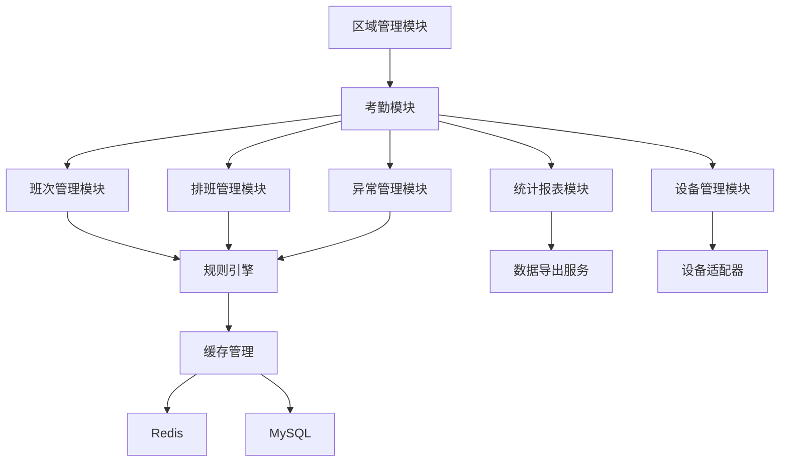

# 设计文档：基于消费模块模式的考勤系统架构设计

## 1. 架构设计原则

### 1.1 设计理念
基于消费模块的成功架构模式，建立考勤系统的企业级架构：
- **统一性**：与消费模块保持架构一致
- **可扩展性**：支持未来业务扩展需求
- **高性能**：基于多级缓存和异步处理
- **智能化**：基于数据分析和规则引擎的智能处理
- **用户友好**：简化操作流程，提升用户体验

### 1.2 核心设计模式
1. **分层架构模式**：严格四层架构，职责清晰
2. **适配器模式**：支持多种考勤设备和协议
3. **策略模式**：灵活的排班和考勤规则策略
4. **观察者模式**：事件驱动的缓存失效和通知
5. **工厂模式**：动态创建不同类型的考勤处理器

## 2. 系统架构图

### 2.1 整体架构
```
┌─────────────────────────────────────────────────────────────┐
│                        前端层 (Frontend)                    │
├─────────────────────────────────────────────────────────────┤
│  Web管理端      │  移动端App      │  自助终端       │  数据大屏 │
│  (Vue3+AntDV)  │  (uni-app)      │  (Embedded)    │ (ECharts) │
└─────────────────────────────────────────────────────────────┘
                                │
                                ▼
┌─────────────────────────────────────────────────────────────┐
│                        API网关层 (Gateway)                   │
│                    (Sa-Token认证 + 负载均衡)                   │
└─────────────────────────────────────────────────────────────┘
                                │
                                ▼
┌─────────────────────────────────────────────────────────────┐
│                        Controller层                        │
├─────────────────────────────────────────────────────────────┤
│  AttendanceController  │  ReportController                │
│  MobileController       │  ScheduleController               │
│  ExceptionController    │  DeviceController                 │
└─────────────────────────────────────────────────────────────┘
                                │
                                ▼
┌─────────────────────────────────────────────────────────────┐
│                        Service层                           │
├─────────────────────────────────────────────────────────────┤
│  AttendanceService     │  ReportService                      │
│  ScheduleService       │  ExceptionService                   │
│  DeviceService         │  NotificationService                │
└─────────────────────────────────────────────────────────────┘
                                │
                                ▼
┌─────────────────────────────────────────────────────────────┐
│                        Manager层                            │
├─────────────────────────────────────────────────────────────┤
│  AttendanceCacheManager      │  ShiftMatchingEngine          │
│  IntelligentSchedulingEngine  │  RuleEngine                   │
│  AttendanceRuleEngine        │  DeviceAdapterManager          │
│  NotificationManager         │  StatisticsManager            │
└─────────────────────────────────────────────────────────────┘
                                │
                                ▼
┌─────────────────────────────────────────────────────────────┐
│                      Repository/DAO层                         │
├─────────────────────────────────────────────────────────────┤
│  AttendanceRepository        │  ShiftRepository               │
│  ScheduleRepository          │  ExceptionRepository            │
│  DeviceRepository            │  UserRepository                │
└─────────────────────────────────────────────────────────────┘
                                │
                                ▼
┌─────────────────────────────────────────────────────────────┐
│                      数据存储层 (Storage)                        │
├─────────────────────────────────────────────────────────────┤
│        Redis (L2缓存)        │       MySQL (主数据库)          │
│  - 考勤记录缓存              │  - 考勤记录表                   │
│  - 班次信息缓存              │  - 排班计划表                   │
│  - 报表结果缓存              │  - 异常记录表                   │
│  - 规则配置缓存              │  - 统计数据表                   │
└─────────────────────────────────────────────────────────────┘
                                │
                                ▼
┌─────────────────────────────────────────────────────────────┐
│                      外部集成层 (Integration)                   │
├─────────────────────────────────────────────────────────────┤
│  考勤设备          │  第三方服务          │  企业系统              │
│  - 门禁考勤机      │  - 短信服务          │  - HR系统             │
│  - 人脸识别设备    │  - 邮件服务          │  - 薪资系统           │
│  - GPS定位         │  - 消息推送          │  - OA系统             │
└─────────────────────────────────────────────────────────────┘
```

### 2.2 模块依赖关系


## 3. 核心模块设计

### 3.1 继承式区域管理设计

#### 核心设计原则
✅ **严格遵循基础架构**: 考勤区域继承AreaEntity，只添加考勤特有功能
✅ **扩展表机制**: 通过独立扩展表添加考勤特定配置
✅ **统一区域管理**: 区域层级、权限验证等复用基础模块功能

#### 考勤区域扩展设计

基于`AreaEntity`的考勤区域扩展：

```java
/**
 * 考勤区域管理器
 * 基于AreaEntity的考勤特定功能扩展
 */
@Component
public class AttendanceAreaManager {

    @Resource
    private AreaService areaService;  // 基础区域服务

    @Resource
    private AttendanceAreaConfigService attendanceAreaConfigService;  // 考勤区域配置服务

    /**
     * 验证员工在指定区域的考勤权限
     * 复用基础区域权限验证逻辑
     */
    public AttendanceAreaPermissionResult validatePermission(Long employeeId, Long areaId) {
        try {
            // 1. 获取员工可访问的区域（复用基础区域权限逻辑）
            Set<Long> accessibleAreas = areaService.getEmployeeAccessibleAreas(employeeId);

            // 2. 检查直接权限
            if (accessibleAreas.contains(areaId)) {
                return AttendanceAreaPermissionResult.granted("直接权限验证通过");
            }

            // 3. 检查子区域权限（复用基础区域层级逻辑）
            AreaEntity area = areaService.getById(areaId);
            if (area != null && hasParentAreaPermission(accessibleAreas, area)) {
                return AttendanceAreaPermissionResult.granted("父区域权限验证通过");
            }

            return AttendanceAreaPermissionResult.denied("无该区域考勤权限");

        } catch (Exception e) {
            log.error("验证考勤区域权限失败: employeeId={}, areaId={}", employeeId, areaId, e);
            return AttendanceAreaPermissionResult.error("权限验证异常");
        }
    }

    /**
     * 获取区域考勤配置
     * 合并基础区域信息和考勤扩展配置
     */
    public AttendanceAreaConfig getAreaAttendanceConfig(Long areaId) {
        // 1. 获取基础区域信息
        AreaEntity area = areaService.getById(areaId);
        if (area == null) {
            throw new BusinessException("区域不存在: " + areaId);
        }

        // 2. 获取考勤扩展配置
        AttendanceAreaConfigEntity attendanceConfig = attendanceAreaConfigService.getByAreaId(areaId);

        // 3. 如果没有扩展配置，创建默认配置
        if (attendanceConfig == null) {
            attendanceConfig = createDefaultAttendanceConfig(areaId);
        }

        // 4. 合并返回完整配置
        return AttendanceAreaConfig.builder()
            .baseArea(area)
            .attendanceConfig(attendanceConfig)
            .build();
    }
}
```

#### 考勤区域扩展表设计

```java
/**
 * 考勤区域配置扩展表
 * 扩展基础AreaEntity的考勤特定功能
 */
@Data
@EqualsAndHashCode(callSuper = true)
@TableName("t_attendance_area_config")
public class AttendanceAreaConfigEntity extends BaseEntity {

    /**
     * 配置ID（主键）
     */
    @TableId(type = IdType.AUTO)
    private Long configId;

    /**
     * 区域ID（关联t_area.area_id）
     */
    @TableField("area_id")
    private Long areaId;

    /**
     * 上班打卡要求
     * 0-不需要，1-需要
     */
    @TableField("punch_in_required")
    private Integer punchInRequired = 1;

    /**
     * 下班打卡要求
     * 0-不需要，1-需要
     */
    @TableField("punch_out_required")
    private Integer punchOutRequired = 1;

    /**
     * GPS验证开关
     * 0-关闭，1-开启
     */
    @TableField("gps_validation_enabled")
    private Integer gpsValidationEnabled = 0;

    /**
     * 拍照验证开关
     * 0-关闭，1-开启
     */
    @TableField("photo_required")
    private Integer photoRequired = 0;

    /**
     * 电子围栏开关
     * 0-关闭，1-开启
     */
    @TableField("geofence_enabled")
    private Integer geofenceEnabled = 0;

    /**
     * 围栏半径（米）
     */
    @TableField("geofence_radius")
    private Integer geofenceRadius = 100;

    /**
     * 考勤点ID列表（JSON格式）
     */
    @TableField("attendance_point_ids")
    private String attendancePointIds;

    /**
     * 工作时间配置（JSON格式）
     */
    @TableField("work_time_config")
    private String workTimeConfig;

    /**
     * 考勤规则ID列表（JSON格式）
     */
    @TableField("attendance_rule_ids")
    private String attendanceRuleIds;

    // 业务方法
    public boolean isPunchInRequired() {
        return Integer.valueOf(1).equals(punchInRequired);
    }

    public boolean isPunchOutRequired() {
        return Integer.valueOf(1).equals(punchOutRequired);
    }

    public boolean isGpsValidationEnabled() {
        return Integer.valueOf(1).equals(gpsValidationEnabled);
    }

    public boolean isPhotoRequired() {
        return Integer.valueOf(1).equals(photoRequired);
    }

    public boolean isGeofenceEnabled() {
        return Integer.valueOf(1).equals(geofenceEnabled);
    }
}
```

### 3.2 班次分类体系设计

#### 3.2.1 班次分类表结构
```sql
-- 班次分类表（参考消费模块的餐别分类表）
CREATE TABLE t_attendance_shift_category (
    shift_category_id VARCHAR(50) PRIMARY KEY COMMENT '班次分类ID',
    category_code VARCHAR(50) NOT NULL UNIQUE COMMENT '分类编码',
    category_name VARCHAR(100) NOT NULL COMMENT '分类名称',
    sort_order INT DEFAULT 0 COMMENT '排序',
    description VARCHAR(255) COMMENT '描述',
    available BOOLEAN DEFAULT TRUE COMMENT '是否启用',
    create_time DATETIME NOT NULL DEFAULT CURRENT_TIMESTAMP COMMENT '创建时间',
    update_time DATETIME DEFAULT CURRENT_TIMESTAMP ON UPDATE CURRENT_TIMESTAMP COMMENT '更新时间',
    create_user_id BIGINT COMMENT '创建人ID',
    remark TEXT COMMENT '备注',

    INDEX idx_category_code(category_code),
    INDEX idx_sort_order(sort_order, available)
) ENGINE=InnoDB DEFAULT CHARSET=utf8mb4 COMMENT='班次分类表';

-- 班次定义表（参考消费模块的餐别表结构）
CREATE TABLE t_attendance_shift (
    shift_id VARCHAR(50) PRIMARY KEY COMMENT '班次ID',
    shift_code VARCHAR(50) NOT NULL UNIQUE COMMENT '班次编码',
    shift_name VARCHAR(100) NOT NULL COMMENT '班次名称',
    category_id VARCHAR(50) NOT NULL COMMENT '所属分类ID',

    -- 时间配置
    start_time VARCHAR(5) NOT NULL COMMENT '上班时间(HH:mm)',
    end_time VARCHAR(5) NOT NULL COMMENT '下班时间(HH:mm)',
    break_start_time VARCHAR(5) COMMENT '休息开始时间(HH:mm)',
    break_end_time VARCHAR(5) COMMENT '休息结束时间(HH:mm)',

    -- 容差配置
    late_tolerance INT DEFAULT 0 COMMENT '迟到容忍(分钟)',
    early_leave_tolerance INT DEFAULT 0 COMMENT '早退容忍(分钟)',

    -- 工时计算
    work_hours DECIMAL(4,2) COMMENT '标准工时(小时)',
    break_hours DECIMAL(4,2) DEFAULT 0 COMMENT '休息时长(小时)',

    -- 排班规则
    scheduling_rules TEXT COMMENT '排班规则JSON',
    rotation_config TEXT COMMENT '轮换配置JSON',

    -- 考勤要求
    punch_in_required BOOLEAN DEFAULT TRUE COMMENT '必须上班打卡',
    punch_out_required BOOLEAN DEFAULT TRUE COMMENT '必须下班打卡',
    gps_validation BOOLEAN DEFAULT FALSE COMMENT '需要GPS验证',
    photo_validation BOOLEAN DEFAULT FALSE COMMENT '需要拍照验证',

    sort_order INT DEFAULT 0,
    available BOOLEAN DEFAULT TRUE,
    create_time DATETIME NOT NULL DEFAULT CURRENT_TIMESTAMP,
    update_time DATETIME DEFAULT CURRENT_TIMESTAMP ON UPDATE CURRENT_TIMESTAMP,
    create_user_id BIGINT COMMENT '创建人ID',
    remark TEXT COMMENT '备注',

    FOREIGN KEY (category_id) REFERENCES t_attendance_shift_category(shift_category_id),
    INDEX idx_category_id(category_id, available),
    INDEX idx_shift_code(shift_code),
    INDEX idx_sort_order(sort_order)
) ENGINE=InnoDB DEFAULT CHARSET=utf8mb4 COMMENT='班次定义表';

-- 班次分类基础数据
INSERT INTO t_attendance_shift_category VALUES
('category-regular', 'REGULAR', '常日班', 1, '标准常日班班次', TRUE, NOW(), NOW(), NULL, NULL),
('category-shift', 'SHIFT', '倒班', 2, '轮班制班次', TRUE, NOW(), NOW(), NULL, NULL),
('category-flexible', 'FLEXIBLE', '弹性班', 3, '弹性工作时间班次', TRUE, NOW(), NOW(), NULL, NULL),
('category-parttime', 'PARTTIME', '兼职班', 4, '兼职或临时班次', TRUE, NOW(), NOW(), NULL, NULL),
('category-special', 'SPECIAL', '特殊班', 5, '特殊工作时间班次', TRUE, NOW(), NOW(), NULL, NULL);

-- 班次基础数据
INSERT INTO t_attendance_shift VALUES
('shift-standard', 'STANDARD', '标准班', 'category-regular', '09:00', '18:00', '12:00', '13:00', 15, 15, 8.0, 1.0, '{}', NULL, TRUE, TRUE, FALSE, FALSE, 1, TRUE, NOW(), NOW(), NULL, NULL),
('shift-morning', 'MORNING', '早班', 'category-shift', '08:00', '16:00', '12:00', '12:30', 10, 10, 7.5, 0.5, '{"rotationType": "3-shift"}', '{"rotationCycle": 3}', TRUE, TRUE, TRUE, FALSE, 1, TRUE, NOW(), NOW(), NULL, NULL),
('shift-afternoon', 'AFTERNOON', '中班', 'category-shift', '16:00', '00:00', '20:00', '20:30', 10, 10, 7.5, 0.5, '{"rotationType": "3-shift"}', '{"rotationCycle": 3}', TRUE, TRUE, TRUE, FALSE, 2, TRUE, NOW(), NOW(), NULL, NULL),
('shift-night', 'NIGHT', '夜班', 'category-shift', '00:00', '08:00', '04:00', '04:30', 10, 10, 7.5, 0.5, '{"rotationType": "3-shift"}', '{"rotationCycle": 3}', TRUE, TRUE, TRUE, FALSE, 3, TRUE, NOW(), NOW(), NULL, NULL),
('shift-flexible', 'FLEXIBLE', '弹性班', 'category-flexible', '09:00', '18:00', NULL, NULL, 30, 30, 8.0, 0.0, '{"coreHours": {"start": "10:00", "end": "16:00"}}', NULL, TRUE, TRUE, FALSE, FALSE, 1, TRUE, NOW(), NOW(), NULL, NULL);
```

#### 3.2.2 班次缓存管理
```java
/**
 * 班次缓存管理器
 * 复用消费模块的缓存策略
 */
@Component
public class ShiftCacheManager {

    private static final String CACHE_PREFIX_CATEGORY = "attendance:shift:category:";
    private static final String CACHE_PREFIX_SHIFT = "attendance:shift:";
    private static final String CACHE_PREFIX_CATEGORY_SHIFTS = "attendance:shift:category:shifts:";
    private static final String CACHE_PREFIX_EMPLOYEE_SHIFTS = "attendance:shift:employee:";

    @Resource
    private CacheManager cacheManager;

    /**
     * 缓存班次分类列表
     */
    public void cacheShiftCategories(List<ShiftCategoryEntity> categories) {
        String key = CACHE_PREFIX_CATEGORY + "all";
        cacheManager.set(key, categories, 30, TimeUnit.MINUTES);
    }

    /**
     * 缓存单个班次分类
     */
    public void cacheShiftCategory(String categoryId, ShiftCategoryEntity category) {
        String key = CACHE_PREFIX_CATEGORY + categoryId;
        cacheManager.set(key, category, 30, TimeUnit.MINUTES);
    }

    /**
     * 缓存分类下的班次列表
     */
    public void cacheCategoryShifts(String categoryId, List<ShiftEntity> shifts) {
        String key = CACHE_PREFIX_CATEGORY_SHIFTS + categoryId;
        cacheManager.set(key, shifts, 30, TimeUnit.MINUTES);
    }

    /**
     * 缓存单个班次
     */
    public void cacheShift(String shiftId, ShiftEntity shift) {
        String key = CACHE_PREFIX_SHIFT + shiftId;
        cacheManager.set(key, shift, 30, TimeUnit.MINUTES);
    }

    /**
     * 缓存员工可用班次
     */
    public void cacheEmployeeShifts(Long employeeId, LocalDate date, List<ShiftEntity> shifts) {
        String key = CACHE_PREFIX_EMPLOYEE_SHIFTS + employeeId + ":" + date;
        cacheManager.set(key, shifts, 1, TimeUnit.HOURS);
    }

    /**
     * 清除相关缓存
     */
    @EventListener
    public void onShiftChanged(ShiftChangeEvent event) {
        String shiftId = event.getShiftId();
        ShiftEntity shift = shiftRepository.findById(shiftId);

        // 清除班次缓存
        String shiftKey = CACHE_PREFIX_SHIFT + shiftId;
        cacheManager.evict(shiftKey);

        // 清除分类下的班次缓存
        if (shift != null) {
            String categoryShiftsKey = CACHE_PREFIX_CATEGORY_SHIFTS + shift.getCategoryId();
            cacheManager.evict(categoryShiftsKey);
        }

        // 清除员工班次缓存
        cacheManager.evictByPattern(CACHE_PREFIX_EMPLOYEE_SHIFTS + "*");
    }

    @EventListener
    public void onShiftCategoryChanged(ShiftCategoryChangeEvent event) {
        // 清除分类列表缓存
        String categoriesKey = CACHE_PREFIX_CATEGORY + "all";
        cacheManager.evict(categoriesKey);

        // 清除单个分类缓存
        String categoryKey = CACHE_PREFIX_CATEGORY + event.getCategoryId();
        cacheManager.evict(categoryKey);

        // 清除分类下的班次缓存
        String categoryShiftsKey = CACHE_PREFIX_CATEGORY_SHIFTS + event.getCategoryId();
        cacheManager.evict(categoryShiftsKey);
    }
}
```

### 3.3 智能排班引擎设计

#### 3.3.1 排班模式识别器
```java
/**
 * 排班模式识别器
 * 基于历史数据分析识别员工的排班模式
 */
@Component
public class SchedulingPatternAnalyzer {

    /**
     * 分析员工历史考勤模式
     */
    public EmployeeSchedulingPattern analyzePattern(Long employeeId, LocalDate startDate, LocalDate endDate) {
        // 1. 查询历史考勤记录
        List<AttendanceRecordEntity> records = attendanceRecordRepository
            .findByEmployeeIdAndDateRange(employeeId, startDate, endDate);

        // 2. 分析打卡时间分布
        Map<Integer, Integer> punchInDistribution = analyzePunchInDistribution(records);
        Map<Integer, Integer> punchOutDistribution = analyzePunchOutDistribution(records);

        // 3. 分析工作时长分布
        Map<Double, Integer> workHoursDistribution = analyzeWorkHoursDistribution(records);

        // 4. 分析休息日分布
        Map<DayOfWeek, Integer> restDayDistribution = analyzeRestDayDistribution(employeeId, startDate, endDate);

        // 5. 识别排班模式
        SchedulingPatternType patternType = identifyPatternType(punchInDistribution, workHoursDistribution, restDayDistribution);

        return EmployeeSchedulingPattern.builder()
            .employeeId(employeeId)
            .patternType(patternType)
            .punchInDistribution(punchInDistribution)
            .punchOutDistribution(punchOutDistribution)
            .workHoursDistribution(workHoursDistribution)
            .restDayDistribution(restDayDistribution)
            .averageWorkHours(calculateAverageWorkHours(records))
            .regularityScore(calculateRegularityScore(records))
            .build();
    }

    private SchedulingPatternType identifyPatternType(
            Map<Integer, Integer> punchInDistribution,
            Map<Double, Integer> workHoursDistribution,
            Map<DayOfWeek, Integer> restDayDistribution) {

        // 1. 检测常日班模式
        if (isRegularShiftPattern(punchInDistribution, workHoursDistribution)) {
            return SchedulingPatternType.REGULAR_SHIFT;
        }

        // 2. 检测轮班模式
        if (isShiftPattern(punchInDistribution, restDayDistribution)) {
            return SchedulingPatternType.SHIFT_WORK;
        }

        // 3. 检测弹性模式
        if (isFlexiblePattern(punchInDistribution, workHoursDistribution)) {
            return SchedulingPatternType.FLEXIBLE;
        }

        // 4. 默认为不规则模式
        return SchedulingPatternType.IRREGULAR;
    }
}
```

#### 3.3.2 智能排班建议引擎
```java
/**
 * 智能排班建议引擎
 * 基于模式识别和规则匹配生成排班建议
 */
@Component
public class IntelligentSuggestionEngine {

    @Resource
    private SchedulingPatternAnalyzer patternAnalyzer;

    @Resource
    private ShiftCategoryService shiftCategoryService;

    @Resource
    private ShiftService shiftService;

    /**
     * 生成智能排班建议
     */
    public List<SchedulingSuggestion> generateSuggestions(SuggestionRequest request) {
        List<SchedulingSuggestion> suggestions = new ArrayList<>();

        for (Long employeeId : request.getEmployeeIds()) {
            // 1. 分析员工排班模式
            EmployeeSchedulingPattern pattern = patternAnalyzer.analyzePattern(
                employeeId,
                request.getAnalysisStartDate(),
                request.getAnalysisEndDate()
            );

            // 2. 根据模式匹配最佳班次
            List<ShiftSuggestion> shiftSuggestions = matchShiftsToPattern(pattern, request);

            // 3. 生成排班建议
            SchedulingSuggestion suggestion = SchedulingSuggestion.builder()
                .employeeId(employeeId)
                .patternType(pattern.getPatternType())
                .confidence(pattern.getRegularityScore())
                .shiftSuggestions(shiftSuggestions)
                .reason(generateSuggestionReason(pattern, shiftSuggestions))
                .build();

            suggestions.add(suggestion);
        }

        // 4. 按置信度排序
        return suggestions.stream()
            .sorted(Comparator.comparing(SchedulingSuggestion::getConfidence).reversed())
            .collect(Collectors.toList());
    }

    private List<ShiftSuggestion> matchShiftsToPattern(EmployeeSchedulingPattern pattern, SuggestionRequest request) {
        List<ShiftSuggestion> shiftSuggestions = new ArrayList<>();

        // 1. 获取适用的班次分类
        List<ShiftCategoryEntity> categories = shiftCategoryService.findByPatternType(pattern.getPatternType());

        for (ShiftCategoryEntity category : categories) {
            // 2. 获取分类下的班次
            List<ShiftEntity> shifts = shiftService.findByCategoryId(category.getShiftCategoryId());

            for (ShiftEntity shift : shifts) {
                // 3. 计算匹配度
                double matchScore = calculateShiftMatchScore(pattern, shift);

                if (matchScore > MATCH_THRESHOLD) {
                    shiftSuggestions.add(ShiftSuggestion.builder()
                        .shiftId(shift.getShiftId())
                        .shiftName(shift.getShiftName())
                        .categoryId(category.getShiftCategoryId())
                        .categoryName(category.getCategoryName())
                        .matchScore(matchScore)
                        .reason(generateShiftMatchReason(pattern, shift))
                        .build());
                }
            }
        }

        // 4. 按匹配度排序
        return shiftSuggestions.stream()
            .sorted(Comparator.comparing(ShiftSuggestion::getMatchScore).reversed())
            .limit(3) // 取前3个最匹配的班次
            .collect(Collectors.toList());
    }

    private double calculateShiftMatchScore(EmployeeSchedulingPattern pattern, ShiftEntity shift) {
        double score = 0.0;

        // 1. 班次时间匹配度（权重40%）
        double timeScore = calculateTimeMatchScore(pattern, shift);
        score += timeScore * 0.4;

        // 2. 工时匹配度（权重30%）
        double workHoursScore = calculateWorkHoursMatchScore(pattern, shift);
        score += workHoursScore * 0.3;

        // 3. 模式类型匹配度（权重20%）
        double patternTypeScore = calculatePatternTypeMatchScore(pattern, shift);
        score += patternTypeScore * 0.2;

        // 4. 历史使用频率（权重10%）
        double usageScore = calculateUsageScore(pattern.getEmployeeId(), shift.getShiftId());
        score += usageScore * 0.1;

        return Math.min(score, 1.0);
    }
}
```

#### 3.3.3 轮班规则引擎
```java
/**
 * 轮班规则引擎
 * 支持复杂的轮班排班规则
 */
@Component
public class RotationRuleEngine {

    /**
     * 生成轮班排班计划
     */
    public List<ShiftScheduleEntity> generateRotationSchedule(RotationRequest request) {
        switch (request.getRotationType()) {
            case THREE_SHIFT:
                return generateThreeShiftRotation((ThreeShiftRotationRequest) request);
            case FOUR_SHIFT_THREE_WORK:
                return generateFourShiftRotation((FourShiftRotationRequest) request);
            case CUSTOM_ROTATION:
                return generateCustomRotation((CustomRotationRequest) request);
            default:
                throw new IllegalArgumentException("不支持的轮班类型: " + request.getRotationType());
        }
    }

    /**
     * 生成三班倒排班计划
     */
    private List<ShiftScheduleEntity> generateThreeShiftRotation(ThreeShiftRotationRequest request) {
        List<ShiftScheduleEntity> schedules = new ArrayList<>();

        // 获取三个班次：早班、中班、夜班
        List<ShiftEntity> shifts = getShiftsByRotationPattern("THREE_SHIFT");
        if (shifts.size() < 3) {
            throw new BusinessException("三班倒需要至少3个班次定义");
        }

        // 将员工分组
        List<List<Long>> employeeGroups = partitionEmployees(request.getEmployeeIds(), 3);

        for (int day = 0; day < request.getTotalDays(); day++) {
            LocalDate currentDate = request.getStartDate().plusDays(day);

            // 每组员工轮换不同的班次
            for (int groupIndex = 0; groupIndex < 3; groupIndex++) {
                int shiftIndex = (day + groupIndex) % 3;
                ShiftEntity currentShift = shifts.get(shiftIndex);
                List<Long> workingEmployees = employeeGroups.get(groupIndex);

                // 检查是否为休息日
                if (isWorkDay(currentDate, currentShift)) {
                    ShiftScheduleEntity schedule = createSchedule(
                        workingEmployees,
                        currentShift,
                        currentDate
                    );
                    schedules.add(schedule);
                }
            }
        }

        return schedules;
    }

    /**
     * 生成四班三倒排班计划
     */
    private List<ShiftScheduleEntity> generateFourShiftRotation(FourShiftRotationRequest request) {
        List<ShiftScheduleEntity> schedules = new ArrayList<>();

        // 获取四个班次
        List<ShiftEntity> shifts = getShiftsByRotationPattern("FOUR_SHIFT");
        if (shifts.size() < 4) {
            throw new BusinessException("四班三倒需要至少4个班次定义");
        }

        // 将员工分为4组
        List<List<Long>> employeeGroups = partitionEmployees(request.getEmployeeIds(), 4);

        for (int day = 0; day < request.getTotalDays(); day++) {
            LocalDate currentDate = request.getStartDate().plusDays(day);

            for (int groupIndex = 0; groupIndex < 4; groupIndex++) {
                // 每组工作3天，休息1天的模式
                int cycleDay = (day + groupIndex) % 4;

                if (cycleDay < 3) { // 工作日
                    ShiftEntity currentShift = shifts.get(cycleDay);
                    List<Long> workingEmployees = employeeGroups.get(groupIndex);

                    ShiftScheduleEntity schedule = createSchedule(
                        workingEmployees,
                        currentShift,
                        currentDate
                    );
                    schedules.add(schedule);
                }
                // cycleDay == 3 为休息日，不安排排班
            }
        }

        return schedules;
    }
}
```

### 3.4 异常管理系统设计

#### 3.4.1 异常分类体系
```sql
-- 异常类型分类表
CREATE TABLE t_attendance_exception_category (
    exception_category_id VARCHAR(50) PRIMARY KEY COMMENT '异常分类ID',
    category_code VARCHAR(50) NOT NULL UNIQUE COMMENT '分类编码',
    category_name VARCHAR(100) NOT NULL COMMENT '分类名称',
    approval_required BOOLEAN DEFAULT TRUE COMMENT '是否需要审批',
    auto_approval_conditions TEXT COMMENT '自动审批条件JSON',
    sort_order INT DEFAULT 0,
    available BOOLEAN DEFAULT TRUE,
    create_time DATETIME NOT NULL DEFAULT CURRENT_TIMESTAMP,
    update_time DATETIME DEFAULT CURRENT_TIMESTAMP ON UPDATE CURRENT_TIMESTAMP,
    create_user_id BIGINT,
    remark TEXT,

    INDEX idx_category_code(category_code),
    INDEX idx_sort_order(sort_order, available)
) ENGINE=InnoDB DEFAULT CHARSET=utf8mb4 COMMENT='考勤异常分类表';

-- 异常记录表
CREATE TABLE t_attendance_exception (
    exception_id VARCHAR(50) PRIMARY KEY COMMENT '异常ID',
    employee_id BIGINT NOT NULL COMMENT '员工ID',
    attendance_date DATE NOT NULL COMMENT '考勤日期',
    attendance_record_id VARCHAR(50) COMMENT '关联的考勤记录ID',
    exception_category_id VARCHAR(50) NOT NULL COMMENT '异常分类ID',
    exception_type VARCHAR(50) NOT NULL COMMENT '异常类型',

    -- 时间信息
    original_time TIME COMMENT '原始时间',
    adjusted_time TIME COMMENT '调整后时间',
    duration_minutes INT COMMENT '时长(分钟)',

    -- 位置信息
    original_location VARCHAR(200) COMMENT '原始位置',
    adjusted_location VARCHAR(200) COMMENT '调整后位置',
    gps_latitude DECIMAL(10, 8) COMMENT 'GPS纬度',
    gps_longitude DECIMAL(11, 8) COMMENT 'GPS经度',

    -- 申请信息
    reason TEXT COMMENT '异常原因',
    description TEXT COMMENT '详细描述',
    attachment_url VARCHAR(500) COMMENT '附件URL',
    evidence_info TEXT COMMENT '证据信息JSON',

    -- 审批信息
    status VARCHAR(20) DEFAULT 'PENDING' COMMENT '状态：PENDING/APPROVED/REJECTED/CANCELLED',
    approved_by BIGINT COMMENT '审批人ID',
    approved_time DATETIME COMMENT '审批时间',
    approval_comment TEXT COMMENT '审批意见',
    auto_approved BOOLEAN DEFAULT FALSE COMMENT '是否自动审批',

    -- 销假信息
    actual_end_time DATETIME COMMENT '实际结束时间',
    remaining_leave_hours DECIMAL(4,2) COMMENT '剩余假期时长',
    cancel_time DATETIME COMMENT '销假时间',
    cancel_reason TEXT COMMENT '销假原因',

    create_time DATETIME NOT NULL DEFAULT CURRENT_TIMESTAMP,
    update_time DATETIME DEFAULT CURRENT_TIMESTAMP ON UPDATE CURRENT_TIMESTAMP,
    create_user_id BIGINT,
    deleted_flag TINYINT DEFAULT 0,

    FOREIGN KEY (exception_category_id) REFERENCES t_attendance_exception_category(exception_category_id),
    INDEX idx_employee_date(employee_id, attendance_date),
    INDEX idx_category_status(exception_category_id, status),
    INDEX idx_status_approved(status, approved_time)
) ENGINE=InnoDB DEFAULT CHARSET=utf8mb4 COMMENT='考勤异常记录表';

-- 异常分类基础数据
INSERT INTO t_attendance_exception_category VALUES
('category-late', 'LATE', '迟到', FALSE, '{"maxLateMinutes": 15}', 1, TRUE, NOW(), NOW(), NULL, NULL),
('category-early-leave', 'EARLY_LEAVE', '早退', FALSE, '{"maxEarlyMinutes": 15}', 2, TRUE, NOW(), NOW(), NULL, NULL),
('category-absenteeism', 'ABSENTEEISM', '旷工', TRUE, NULL, 3, TRUE, NOW(), NOW(), NULL, NULL),
('category-leave', 'LEAVE', '请假', TRUE, NULL, 4, TRUE, NOW(), NOW(), NULL, NULL),
('category-overtime', 'OVERTIME', '加班', FALSE, '{"minOvertimeHours": 1}', 5, TRUE, NOW(), NOW(), NULL, NULL),
('category-makeup-punch', 'MAKEUP_PUNCH', '补卡', TRUE, '{"maxMonthlyCount": 3}', 6, TRUE, NOW(), NOW(), NULL, NULL),
('category-shift-swap', 'SHIFT_SWAP', '调班', TRUE, NULL, 7, TRUE, NOW(), NOW(), NULL, NULL),
('category-business-trip', 'BUSINESS_TRIP', '出差', TRUE, NULL, 8, TRUE, NOW(), NOW(), NULL, NULL),
('category-holiday', 'HOLIDAY', '节假日', FALSE, NULL, 9, TRUE, NOW(), NOW(), NULL, NULL),
('category-weekend-overtime', 'WEEKEND_OVERTIME', '周末加班', FALSE, NULL, 10, TRUE, NOW(), NOW(), NULL, NULL);
```

#### 3.4.2 异常处理流程引擎
```java
/**
 * 异常处理流程引擎
 * 参考消费模块的申请审批流程
 */
@Component
public class ExceptionProcessEngine {

    @Resource
    private ExceptionRepository exceptionRepository;

    @Resource
    private ApprovalWorkflowEngine approvalWorkflowEngine;

    @Resource
    private NotificationService notificationService;

    /**
     * 创建异常申请
     */
    @Transactional
    public ExceptionApplicationResult createApplication(ExceptionCreateRequest request) {
        try {
            // 1. 数据验证
            validateExceptionApplication(request);

            // 2. 检查是否可以自动审批
            AutoApprovalResult autoApprovalResult = checkAutoApproval(request);
            if (autoApprovalResult.isAutoApproved()) {
                return createAutoApprovedException(request, autoApprovalResult);
            }

            // 3. 创建异常申请
            AttendanceExceptionEntity exception = createExceptionEntity(request);

            // 4. 保存异常记录
            exceptionRepository.save(exception);

            // 5. 启动审批流程
            ApprovalWorkflowResult workflowResult = approvalWorkflowEngine.startWorkflow(
                exception.getExceptionId(),
                request.getApprovalConfig()
            );

            // 6. 发送通知
            sendNotificationToApprovers(exception, workflowResult);

            return ExceptionApplicationResult.builder()
                .exceptionId(exception.getExceptionId())
                .status("PENDING")
                .workflowInstanceId(workflowResult.getWorkflowInstanceId())
                .message("异常申请已提交，等待审批")
                .build();

        } catch (Exception e) {
            log.error("创建异常申请失败", e);
            throw new BusinessException("创建异常申请失败: " + e.getMessage());
        }
    }

    /**
     * 审批异常申请
     */
    @Transactional
    public ExceptionApprovalResult approveException(ExceptionApprovalRequest request) {
        try {
            // 1. 查询异常记录
            AttendanceExceptionEntity exception = exceptionRepository.findById(request.getExceptionId())
                .orElseThrow(() -> new BusinessException("异常记录不存在"));

            // 2. 验证审批权限
            validateApprovalPermission(exception, request);

            // 3. 更新审批状态
            updateApprovalStatus(exception, request);

            // 4. 如果批准，执行业务处理
            if ("APPROVED".equals(request.getDecision())) {
                processApprovedException(exception, request);
            }

            // 5. 完成审批流程
            approvalWorkflowEngine.completeWorkflow(
                request.getWorkflowInstanceId(),
                request.getDecision(),
                request.getComment()
            );

            // 6. 发送通知
            sendApprovalNotification(exception, request);

            // 7. 保存更新
            exceptionRepository.save(exception);

            return ExceptionApprovalResult.builder()
                .exceptionId(exception.getExceptionId())
                .decision(request.getDecision())
                .message("审批处理完成")
                .build();

        } catch (Exception e) {
            log.error("审批异常申请失败", e);
            throw new BusinessException("审批异常申请失败: " + e.getMessage());
        }
    }

    /**
     * 销假处理
     */
    @Transactional
    public ExceptionCancelResult cancelLeave(String exceptionId, LeaveCancelRequest request) {
        try {
            // 1. 查询异常记录
            AttendanceExceptionEntity exception = exceptionRepository.findById(exceptionId)
                .orElseThrow(() -> new BusinessException("异常记录不存在"));

            // 2. 验证是否为请假异常且已批准
            validateLeaveCancellationEligibility(exception);

            // 3. 计算实际销假时间
            LocalDateTime actualEndTime = request.getActualEndTime();
            LocalDateTime originalEndTime = getOriginalLeaveEndTime(exception);

            if (actualEndTime.isBefore(originalEndTime)) {
                // 提前销假，计算剩余假期
                Duration remainingDuration = Duration.between(actualEndTime, originalEndTime);
                double remainingHours = remainingDuration.toMinutes() / 60.0;

                // 更新剩余假期额度
                updateEmployeeLeaveBalance(exception.getEmployeeId(), remainingHours);

                // 记录剩余假期信息
                exception.setRemainingLeaveHours(remainingHours);
            }

            // 4. 更新销假信息
            exception.setStatus("CANCELLED");
            exception.setActualEndTime(actualEndTime);
            exception.setCancelTime(LocalDateTime.now());
            exception.setCancelReason(request.getReason());

            // 5. 保存更新
            exceptionRepository.save(exception);

            // 6. 发送销假通知
            sendLeaveCancellationNotification(exception);

            return ExceptionCancelResult.builder()
                .exceptionId(exceptionId)
                .remainingHours(exception.getRemainingLeaveHours())
                .message("销假处理完成")
                .build();

        } catch (Exception e) {
            log.error("销假处理失败", e);
            throw new BusinessException("销假处理失败: " + e.getMessage());
        }
    }

    /**
     * 检查自动审批条件
     */
    private AutoApprovalResult checkAutoApproval(ExceptionCreateRequest request) {
        // 1. 获取异常分类配置
        ExceptionCategoryEntity category = exceptionCategoryRepository.findById(request.getExceptionCategoryId())
            .orElseThrow(() -> new BusinessException("异常分类不存在"));

        // 2. 如果不需要审批，直接自动批准
        if (!category.isApprovalRequired()) {
            return AutoApprovalResult.autoApproved("该异常类型无需审批");
        }

        // 3. 检查自动审批条件
        if (category.getAutoApprovalConditions() != null) {
            Map<String, Object> conditions = JsonUtils.parseMap(category.getAutoApprovalConditions());

            if (checkAutoApprovalConditions(request, conditions)) {
                return AutoApprovalResult.autoApproved("满足自动审批条件");
            }
        }

        return AutoApprovalResult.manualApproval("需要人工审批");
    }
}
```

### 3.5 继承式设备架构设计

#### 核心设计原则
✅ **严格遵循基础架构**: 考勤设备继承SmartDeviceEntity，只添加考勤特有功能
✅ **扩展配置机制**: 通过extensionConfig存储考勤特定配置
✅ **统一设备管理**: 设备注册、心跳、配置下发等复用基础模块功能

#### 考勤设备扩展设计

基于`SmartDeviceEntity`的考勤设备扩展：

```java
/**
 * 考勤设备管理器
 * 基于SmartDeviceEntity的考勤特定功能扩展
 */
@Component
public class AttendanceDeviceManager {

    @Resource
    private SmartDeviceService smartDeviceService;  // 基础设备服务

    @Resource
    private AttendanceDeviceService attendanceDeviceService;  // 考勤设备扩展服务

    /**
     * 注册考勤设备
     * 1. 调用基础设备服务注册SmartDeviceEntity
     * 2. 创建考勤设备扩展配置
     */
    public AttendanceDeviceRegisterResult registerAttendanceDevice(AttendanceDeviceRegisterRequest request) {
        // 1. 注册基础设备（继承SmartDeviceEntity功能）
        SmartDeviceEntity smartDevice = new SmartDeviceEntity();
        smartDevice.setDeviceCode(request.getDeviceCode());
        smartDevice.setDeviceName(request.getDeviceName());
        smartDevice.setDeviceType(DeviceType.ATTENDANCE.getValue());
        smartDevice.setDeviceStatus(DeviceStatus.OFFLINE.getValue());
        smartDevice.setProtocolType(request.getProtocolType());
        smartDevice.setIpAddress(request.getIpAddress());
        smartDevice.setPort(request.getPort());
        smartDevice.setAreaId(request.getAreaId());
        smartDevice.setLocation(request.getLocation());

        // 2. 设置考勤设备特定配置
        AttendanceDeviceExtension attendanceExtension = new AttendanceDeviceExtension();
        attendanceExtension.setPunchModes(request.getPunchModes());  // 支持的打卡方式
        attendanceExtension.setGpsEnabled(request.getGpsEnabled());  // GPS验证开关
        attendanceExtension.setPhotoEnabled(request.getPhotoEnabled());  // 拍照验证开关
        attendanceExtension.setFaceRecognitionEnabled(request.getFaceRecognitionEnabled());  // 人脸识别

        // 3. 保存到extensionConfig字段
        smartDevice.setExtensionConfig(JsonUtils.toJsonString(attendanceExtension));

        // 4. 调用基础设备服务注册
        SmartDeviceEntity registeredDevice = smartDeviceService.registerDevice(smartDevice);

        return AttendanceDeviceRegisterResult.success(registeredDevice);
    }

    /**
     * 处理考勤设备心跳
     * 复用基础设备心跳管理，添加考勤特定处理
     */
    public DeviceHeartbeatResult processAttendanceHeartbeat(String deviceCode, AttendanceHeartbeatData heartbeatData) {
        // 1. 调用基础设备心跳处理
        DeviceHeartbeatResult baseResult = smartDeviceService.processHeartbeat(deviceCode, heartbeatData.getBaseHeartbeat());

        // 2. 处理考勤特定心跳数据
        if (baseResult.isSuccess()) {
            processAttendanceSpecificHeartbeat(baseResult.getDevice(), heartbeatData);
        }

        return baseResult;
    }

    /**
     * 获取考勤设备完整信息
     * 合并基础设备信息和考勤扩展配置
     */
    public AttendanceDeviceInfo getAttendanceDeviceInfo(String deviceCode) {
        // 1. 获取基础设备信息
        SmartDeviceEntity smartDevice = smartDeviceService.getDeviceByCode(deviceCode);

        // 2. 解析考勤扩展配置
        AttendanceDeviceExtension extension = JsonUtils.parseObject(
            smartDevice.getExtensionConfig(),
            AttendanceDeviceExtension.class
        );

        // 3. 合并返回完整信息
        return AttendanceDeviceInfo.builder()
            .baseDevice(smartDevice)
            .attendanceExtension(extension)
            .build();
    }

    /**
     * 查询考勤设备列表
     * 基于SmartDeviceEntity查询，过滤考勤设备类型
     */
    public List<AttendanceDeviceInfo> listAttendanceDevices(AttendanceDeviceQueryRequest request) {
        // 1. 构建查询条件 - 只查询考勤设备
        SmartDeviceQueryRequest deviceQuery = SmartDeviceQueryRequest.builder()
            .deviceType(DeviceType.ATTENDANCE.getValue())
            .areaId(request.getAreaId())
            .deviceStatus(request.getDeviceStatus())
            .enabledFlag(request.getEnabledFlag())
            .build();

        // 2. 查询基础设备列表
        List<SmartDeviceEntity> smartDevices = smartDeviceService.listDevices(deviceQuery);

        // 3. 转换为考勤设备信息
        return smartDevices.stream()
            .map(this::convertToAttendanceDeviceInfo)
            .collect(Collectors.toList());
    }

    private AttendanceDeviceInfo convertToAttendanceDeviceInfo(SmartDeviceEntity smartDevice) {
        // 解析考勤扩展配置
        AttendanceDeviceExtension extension = null;
        if (smartDevice.getExtensionConfig() != null) {
            extension = JsonUtils.parseObject(smartDevice.getExtensionConfig(), AttendanceDeviceExtension.class);
        }

        return AttendanceDeviceInfo.builder()
            .baseDevice(smartDevice)
            .attendanceExtension(extension)
            .build();
    }
}
```

#### 考勤设备扩展配置类

```java
/**
 * 考勤设备扩展配置
 * 存储在SmartDeviceEntity.extensionConfig字段中
 */
@Data
@Builder
@NoArgsConstructor
@AllArgsConstructor
public class AttendanceDeviceExtension {

    /**
     * 支持的打卡方式
     * 多个值用逗号分隔：FACE-人脸,CARD-刷卡,PASSWORD-密码,GPS-GPS定位,PHOTO-拍照
     */
    private String punchModes;

    /**
     * GPS定位验证开关
     * 0-关闭，1-开启
     */
    private Integer gpsEnabled;

    /**
     * 拍照验证开关
     * 0-关闭，1-开启
     */
    private Integer photoEnabled;

    /**
     * 人脸识别开关
     * 0-关闭，1-开启
     */
    private Integer faceRecognitionEnabled;

    /**
     * GPS有效范围（米）
     * 允许的打卡位置误差范围
     */
    private Integer gpsTolerance;

    /**
     * 打卡间隔限制（分钟）
     * 防止重复打卡的时间间隔
     */
    private Integer punchInterval;

    /**
     * 设备工作模式
     * ONLINE-在线模式，OFFLINE-离线模式，HYBRID-混合模式
     */
    private String workMode;

    /**
     * 离线存储容量
     * 离线模式下可存储的打卡记录数量
     */
    private Integer offlineCapacity;

    /**
     * 自动同步间隔（分钟）
     * 离线数据自动同步到服务器的时间间隔
     */
    private Integer autoSyncInterval;

    // 业务方法
    public boolean isGpsEnabled() {
        return Integer.valueOf(1).equals(gpsEnabled);
    }

    public boolean isPhotoEnabled() {
        return Integer.valueOf(1).equals(photoEnabled);
    }

    public boolean isFaceRecognitionEnabled() {
        return Integer.valueOf(1).equals(faceRecognitionEnabled);
    }

    public boolean isOfflineMode() {
        return "OFFLINE".equals(workMode);
    }

    public boolean isHybridMode() {
        return "HYBRID".equals(workMode);
    }

    public List<String> getSupportedPunchModes() {
        if (punchModes == null || punchModes.trim().isEmpty()) {
            return Collections.emptyList();
        }
        return Arrays.asList(punchModes.split(","));
    }

    public boolean supportsPunchMode(String mode) {
        return getSupportedPunchModes().contains(mode);
    }
}
```

#### 考勤设备数据模型

```java
/**
 * 考勤设备信息模型
 * 合并基础设备信息和考勤扩展配置
 */
@Data
@Builder
@NoArgsConstructor
@AllArgsConstructor
public class AttendanceDeviceInfo {

    /**
     * 基础设备信息（SmartDeviceEntity）
     */
    private SmartDeviceEntity baseDevice;

    /**
     * 考勤扩展配置
     */
    private AttendanceDeviceExtension attendanceExtension;

    // 便捷方法
    public String getDeviceCode() {
        return baseDevice != null ? baseDevice.getDeviceCode() : null;
    }

    public String getDeviceName() {
        return baseDevice != null ? baseDevice.getDeviceName() : null;
    }

    public String getDeviceStatus() {
        return baseDevice != null ? baseDevice.getDeviceStatus() : null;
    }

    public Long getAreaId() {
        return baseDevice != null ? baseDevice.getAreaId() : null;
    }

    public boolean isOnline() {
        return baseDevice != null && baseDevice.isOnline();
    }

    public boolean supportsGps() {
        return attendanceExtension != null && attendanceExtension.isGpsEnabled();
    }

    public boolean supportsPhoto() {
        return attendanceExtension != null && attendanceExtension.isPhotoEnabled();
    }

    public boolean supportsFaceRecognition() {
        return attendanceExtension != null && attendanceExtension.isFaceRecognitionEnabled();
    }

    public List<String> getSupportedPunchModes() {
        return attendanceExtension != null ? attendanceExtension.getSupportedPunchModes() : Collections.emptyList();
    }
}
```

### 3.6 统计报表系统设计

#### 3.5.1 报表配置模型
```java
/**
 * 报表配置实体
 */
@Entity
@Table(name = "t_attendance_report_config")
public class AttendanceReportConfigEntity extends BaseEntity {

    @Column(name = "config_name", length = 100, nullable = false)
    private String configName; // 报表配置名称

    @Column(name = "report_type", length = 50, nullable = false)
    private String reportType; // 报表类型

    @Column(name = "description", length = 500)
    private String description; // 报表描述

    @Column(name = "config_data", columnDefinition = "MEDIUMTEXT")
    private String configData; // 配置数据JSON

    @Column(name = "is_default", nullable = false)
    private Boolean isDefault = false; // 是否为默认配置

    @Column(name = "is_public", nullable = false)
    private Boolean isPublic = true; // 是否公开

    @Column(name = "creator_id")
    private Long creatorId; // 创建者ID

    @Column(name = "template_path", length = 500)
    private String templatePath; // 报表模板路径
}

/**
 * 报表配置数据结构
 */
@Data
@Builder
public class ReportConfigData {

    // 数据源配置
    private DataSourceConfig dataSource;

    // 字段配置
    private List<FieldConfig> fields;

    // 分组配置
    private List<GroupConfig> groups;

    // 过滤条件配置
    private List<FilterConfig> filters;

    // 排序配置
    private List<SortConfig> sorts;

    // 统计配置
    private List<StatisticConfig> statistics;

    // 格式化配置
    private FormatConfig format;

    // 导出配置
    private ExportConfig export;

    @Data
    @Builder
    public static class DataSourceConfig {
        private String type; // ATTENDANCE, SHIFT, EXCEPTION, OVERTIME
        private String dateRangeType; // DAY, WEEK, MONTH, QUARTER, YEAR, CUSTOM
        private List<String> employeeIds;
        private List<String> departmentIds;
        private List<String> shiftIds;
        private LocalDate startDate;
        private LocalDate endDate;
    }

    @Data
    @Builder
    public static class FieldConfig {
        private String fieldKey; // 字段键名
        private String fieldName; // 字段显示名称
        private String fieldType; // STRING, NUMBER, DATE, BOOLEAN
        private Boolean visible; // 是否可见
        private Boolean sortable; // 是否可排序
        private Boolean groupable; // 是否可分组
        private String aggregation; // SUM, AVG, COUNT, MAX, MIN
        private String format; // 显示格式
    }

    @Data
    @Builder
    public static class GroupConfig {
        private String groupKey; // 分组键
        private String groupName; // 分组名称
        private List<String> fields; // 分组字段
        private String hierarchy; // 分组层级
    }

    @Data
    @Builder
    public static class StatisticConfig {
        private String statisticKey; // 统计项键名
        private String statisticName; // 统计项名称
        private String statisticType; // ATTENDANCE_RATE, LATE_RATE, ABSENTEEISM_RATE, OVERTIME_HOURS
        private String formula; // 计算公式
        private String unit; // 单位
    }
}
```

#### 3.5.2 报表生成引擎
```java
/**
 * 报表生成引擎
 * 支持灵活的报表配置和动态生成
 */
@Component
public class AttendanceReportEngine {

    @Resource
    private AttendanceRepository attendanceRepository;

    @Resource
    private ShiftScheduleRepository shiftScheduleRepository;

    @Resource
    private ExceptionRepository exceptionRepository;

    @Resource
    private ReportCacheManager reportCacheManager;

    /**
     * 生成考勤报表
     */
    public ReportResult generateReport(ReportGenerateRequest request) {
        try {
            // 1. 缓存检查
            String cacheKey = generateCacheKey(request);
            ReportResult cachedResult = reportCacheManager.get(cacheKey);
            if (cachedResult != null) {
                return cachedResult;
            }

            // 2. 解析报表配置
            ReportConfigData config = parseReportConfig(request.getConfigData());

            // 3. 查询基础数据
            Map<String, List<Object>> dataSourceData = queryDataSourceData(config.getDataSource());

            // 4. 数据处理和转换
            List<Map<String, Object>> processedData = processData(dataSourceData, config);

            // 5. 应用分组聚合
            List<ReportGroup> groupedData = applyGrouping(processedData, config);

            // 6. 计算统计指标
            Map<String, Object> statistics = calculateStatistics(groupedData, config);

            // 7. 格式化报表数据
            ReportResult result = formatReportData(groupedData, statistics, config);

            // 8. 缓存报表结果
            reportCacheManager.put(cacheKey, result, 15, TimeUnit.MINUTES);

            return result;

        } catch (Exception e) {
            log.error("生成考勤报表失败", e);
            throw new BusinessException("生成考勤报表失败: " + e.getMessage());
        }
    }

    /**
     * 查询数据源
     */
    private Map<String, List<Object>> queryDataSourceData(ReportConfigData.DataSourceConfig dataSource) {
        Map<String, List<Object>> data = new HashMap<>();

        switch (dataSource.getType()) {
            case "ATTENDANCE":
                data.put("attendance", queryAttendanceData(dataSource));
                break;
            case "SHIFT":
                data.put("shift", queryShiftData(dataSource));
                break;
            case "EXCEPTION":
                data.put("exception", queryExceptionData(dataSource));
                break;
            case "OVERTIME":
                data.put("overtime", queryOvertimeData(dataSource));
                break;
            case "COMPREHENSIVE":
                data.put("attendance", queryAttendanceData(dataSource));
                data.put("shift", queryShiftData(dataSource));
                data.put("exception", queryExceptionData(dataSource));
                data.put("overtime", queryOvertimeData(dataSource));
                break;
            default:
                throw new IllegalArgumentException("不支持的数据源类型: " + dataSource.getType());
        }

        return data;
    }

    /**
     * 查询考勤数据
     */
    private List<Object> queryAttendanceData(ReportConfigData.DataSourceConfig dataSource) {
        Specification<AttendanceRecordEntity> spec = Specification.where(null);

        // 日期范围过滤
        if (dataSource.getStartDate() != null && dataSource.getEndDate() != null) {
            spec = spec.and((root, query, cb) -> cb.between(
                root.get("attendanceDate"),
                dataSource.getStartDate(),
                dataSource.getEndDate()
            ));
        }

        // 员工过滤
        if (!CollectionUtils.isEmpty(dataSource.getEmployeeIds())) {
            spec = spec.and((root, query, cb) -> root.get("employeeId").in(dataSource.getEmployeeIds()));
        }

        // 查询数据
        List<AttendanceRecordEntity> records = attendanceRepository.findAll(spec);

        return records.stream()
            .map(this::convertAttendanceToMap)
            .collect(Collectors.toList());
    }

    /**
     * 数据处理和转换
     */
    private List<Map<String, Object>> processData(Map<String, List<Object>> dataSourceData, ReportConfigData config) {
        List<Map<String, Object>> processedData = new ArrayList<>();

        // 合并不同数据源的数据
        for (Map.Entry<String, List<Object>> entry : dataSourceData.entrySet()) {
            String sourceType = entry.getKey();
            List<Object> sourceData = entry.getValue();

            for (Object dataItem : sourceData) {
                Map<String, Object> dataMap = convertToMap(dataItem, sourceType);
                dataMap.put("dataSource", sourceType);
                processedData.add(dataMap);
            }
        }

        // 应用字段配置
        return applyFieldConfig(processedData, config.getFields());
    }

    /**
     * 应用分组聚合
     */
    private List<ReportGroup> applyGrouping(List<Map<String, Object>> data, ReportConfigData config) {
        if (CollectionUtils.isEmpty(config.getGroups())) {
            // 无分组，返回单个组
            ReportGroup group = ReportGroup.builder()
                .groupName("全部")
                .groupKey("all")
                .data(data)
                .statistics(calculateGroupStatistics(data, config.getStatistics()))
                .build();
            return Collections.singletonList(group);
        }

        // 应用分组逻辑
        Map<String, List<Map<String, Object>>> groupedData = new HashMap<>();

        for (Map<String, Object> item : data) {
            String groupKey = generateGroupKey(item, config.getGroups());
            groupedData.computeIfAbsent(groupKey, k -> new ArrayList<>()).add(item);
        }

        return groupedData.entrySet().stream()
            .map(entry -> ReportGroup.builder()
                .groupName(getGroupName(entry.getKey(), config.getGroups()))
                .groupKey(entry.getKey())
                .data(entry.getValue())
                .statistics(calculateGroupStatistics(entry.getValue(), config.getStatistics()))
                .build())
            .collect(Collectors.toList());
    }

    /**
     * 计算统计指标
     */
    private Map<String, Object> calculateStatistics(List<ReportGroup> groups, List<ReportConfigData.StatisticConfig> statisticConfigs) {
        Map<String, Object> statistics = new HashMap<>();

        for (ReportConfigData.StatisticConfig statConfig : statisticConfigs) {
            Object value = calculateStatistic(groups, statConfig);
            statistics.put(statConfig.getStatisticKey(), value);
        }

        return statistics;
    }

    /**
     * 计算单个统计指标
     */
    private Object calculateStatistic(List<ReportGroup> groups, ReportConfigData.StatisticConfig statConfig) {
        switch (statConfig.getStatisticType()) {
            case "ATTENDANCE_RATE":
                return calculateAttendanceRate(groups);
            case "LATE_RATE":
                return calculateLateRate(groups);
            case "ABSENTEEISM_RATE":
                return calculateAbsenteeismRate(groups);
            case "OVERTIME_HOURS":
                return calculateOvertimeHours(groups);
            case "WORK_HOURS":
                return calculateWorkHours(groups);
            default:
                return null;
        }
    }

    /**
     * 计算出勤率
     */
    private Double calculateAttendanceRate(List<ReportGroup> groups) {
        int totalExpectedDays = 0;
        int totalActualDays = 0;

        for (ReportGroup group : groups) {
            List<Map<String, Object>> data = group.getData();
            for (Map<String, Object> item : data) {
                if ("ATTENDANCE".equals(item.get("dataSource"))) {
                    totalExpectedDays++;
                    if (isAttendanceValid(item)) {
                        totalActualDays++;
                    }
                }
            }
        }

        return totalExpectedDays > 0 ? (double) totalActualDays / totalExpectedDays : 0.0;
    }
}
```

## 4. 性能优化设计

### 4.1 缓存架构设计

#### 4.1.1 多级缓存配置
```java
/**
 * 考勤多级缓存配置
 */
@Configuration
@EnableCaching
public class AttendanceCacheConfiguration {

    /**
     * L1缓存配置（Caffeine本地缓存）
     */
    @Bean("attendanceL1Cache")
    public Cache<String, Object> attendanceL1Cache() {
        return Caffeine.newBuilder()
            .maximumSize(10000)
            .expireAfterWrite(5, TimeUnit.MINUTES)
            .recordStats()
            .build();
    }

    /**
     * L2缓存配置（Redis分布式缓存）
     */
    @Bean("attendanceL2Cache")
    public RedisCacheManager attendanceL2Cache(RedisConnectionFactory connectionFactory) {
        RedisCacheConfiguration config = RedisCacheConfiguration.defaultCacheConfig()
            .entryTtl(Duration.ofMinutes(30))
            .serializeKeysWith(RedisSerializationContext.SerializationPair.fromSerializer(new StringRedisSerializer()))
            .serializeValuesWith(RedisSerializationContext.SerializationPair.fromSerializer(new GenericJackson2JsonRedisSerializer()));

        return RedisCacheManager.builder(connectionFactory)
            .cacheDefaults(config)
            .transactionAware()
            .build();
    }

    /**
     * 复合缓存管理器
     */
    @Bean("attendanceCacheManager")
    public CacheManager attendanceCacheManager(Cache<String, Object> l1Cache, CacheManager l2CacheManager) {
        return new CompositeCacheManager(l1Cache, l2CacheManager);
    }
}
```

#### 4.1.2 缓存键命名规范
```java
/**
 * 考勤缓存键常量
 */
public class AttendanceCacheKeys {
    // 员工今日考勤缓存（短期，5分钟）
    public static final String TODAY_ATTENDANCE = "attendance:today:%s";

    // 班次信息缓存（中期，30分钟）
    public static final String SHIFT_INFO = "attendance:shift:%s";

    // 排班计划缓存（中期，1小时）
    public static final String SCHEDULE_PLAN = "attendance:schedule:%s:%s";

    // 考勤规则缓存（中期，30分钟）
    public static final String ATTENDANCE_RULE = "attendance:rule:%s";

    // 报表结果缓存（短期，15分钟）
    public static final String REPORT_RESULT = "attendance:report:%s";

    // 统计数据缓存（短期，10分钟）
    public static final String STATISTICS_DATA = "attendance:stats:%s:%s";

    // 异常申请缓存（中期，1小时）
    public static final String EXCEPTION_APPLICATION = "attendance:exception:app:%s";

    // 审批流程缓存（短期，5分钟）
    public static final String APPROVAL_WORKFLOW = "attendance:approval:wf:%s";
}
```

### 4.2 数据库优化设计

#### 4.2.1 索引优化策略
```sql
-- 考勤记录表索引优化
ALTER TABLE t_attendance_record ADD INDEX idx_employee_date (employee_id, attendance_date);
ALTER TABLE t_attendance_record ADD INDEX idx_shift_date (shift_id, attendance_date);
ALTER TABLE t_attendance_record ADD INDEX idx_status_time (status, create_time);
ALTER TABLE t_attendance_record ADD INDEX idx_punch_time (punch_in_time, punch_out_time);

-- 排班计划表索引优化
ALTER TABLE t_attendance_shift_schedule ADD INDEX idx_employee_date (employee_id, schedule_date);
ALTER TABLE t_attendance_shift_schedule ADD INDEX idx_shift_date (shift_id, schedule_date);
ALTER TABLE t_attendance_shift_schedule ADD INDEX idx_department_date (department_id, schedule_date);

-- 异常记录表索引优化
ALTER TABLE t_attendance_exception ADD INDEX idx_employee_date (employee_id, attendance_date);
ALTER TABLE t_attendance_exception ADD INDEX idx_category_status (exception_category_id, status);
ALTER TABLE t_attendance_exception ADD INDEX idx_status_approved (status, approved_time);
ALTER TABLE t_attendance_exception ADD INDEX idx_approved_time (approved_time);

-- 统计数据表索引优化
ALTER TABLE t_attendance_statistics ADD INDEX idx_employee_month (employee_id, statistic_month);
ALTER TABLE t_attendance_statistics ADD INDEX idx_department_month (department_id, statistic_month);
ALTER TABLE t_attendance_statistics ADD INDEX idx_statistic_type (statistic_type, statistic_date);

-- 复合索引优化（针对高频查询场景）
CREATE INDEX idx_emp_shift_date_status ON t_attendance_record (employee_id, shift_id, attendance_date, status);
CREATE INDEX idx_category_status_date ON t_attendance_exception (exception_category_id, status, attendance_date);
CREATE INDEX idx_dept_emp_month_type ON t_attendance_statistics (department_id, employee_id, statistic_month, statistic_type);
```

#### 4.2.2 分区表设计
```sql
-- 考勤记录表按月分区（适合数据量大的场景）
ALTER TABLE t_attendance_record
PARTITION BY RANGE (YEAR(attendance_date) * 100 + MONTH(attendance_date)) (
    PARTITION p202501 VALUES LESS THAN (202502),
    PARTITION p202502 VALUES LESS THAN (202503),
    PARTITION p202503 VALUES LESS THAN (202504),
    PARTITION p202504 VALUES LESS THAN (202505),
    PARTITION p202505 VALUES LESS THAN (202506),
    PARTITION p202506 VALUES LESS THAN (202507),
    PARTITION p202507 VALUES LESS THAN (202508),
    PARTITION p202508 VALUES LESS THAN (202509),
    PARTITION p202509 VALUES LESS THAN (202510),
    PARTITION p202510 VALUES LESS THAN (202511),
    PARTITION p202511 VALUES LESS THAN (202512),
    PARTITION p202512 VALUES LESS THAN (202601),
    PARTITION p_future VALUES LESS THAN MAXVALUE
);

-- 异常记录表按季度分区
ALTER TABLE t_attendance_exception
PARTITION BY RANGE (QUARTER(attendance_date)) (
    PARTITION p2024q4 VALUES LESS THAN (202501),
    PARTITION p2025q1 VALUES LESS THAN (202504),
    PARTITION p2025q2 VALUES LESS THAN (202507),
    PARTITION p2025q3 VALUES LESS THAN (202510),
    PARTITION p2025q4 VALUES LESS THAN (202601),
    PARTITION p_future VALUES LESS THAN MAXVALUE
);
```

### 4.3 异步处理优化

#### 4.3.1 考勤计算异步化
```java
/**
 * 考勤计算异步处理器
 */
@Component
public class AttendanceCalculationAsyncProcessor {

    @Resource
    private TaskExecutor attendanceCalculationExecutor;

    @Resource
    private AttendanceRuleEngine ruleEngine;

    @Resource
    private ShiftMatchingEngine shiftMatchingEngine;

    /**
     * 异步处理考勤计算
     */
    @Async("attendanceCalculationExecutor")
    public CompletableFuture<Void> processAttendanceCalculationAsync(AttendanceCalculationRequest request) {
        return CompletableFuture.runAsync(() -> {
            try {
                // 1. 获取待处理的考勤记录
                List<AttendanceRecordEntity> records = getPendingRecords(request);

                // 2. 批量处理考勤计算
                List<AttendanceProcessResult> results = records.stream()
                    .map(this::processSingleRecord)
                    .collect(Collectors.toList());

                // 3. 批量更新数据库
                batchUpdateAttendanceRecords(results);

                // 4. 生成异常记录
                generateExceptionRecords(results);

                // 5. 更新统计缓存
                updateStatisticsCache(results);

                log.info("异步考勤计算完成，处理记录数: {}", records.size());

            } catch (Exception e) {
                log.error("异步考勤计算失败", e);
                throw new RuntimeException("异步考勤计算失败", e);
            }
        }, attendanceCalculationExecutor);
    }

    /**
     * 处理单个考勤记录
     */
    private AttendanceProcessResult processSingleRecord(AttendanceRecordEntity record) {
        try {
            // 1. 智能找班匹配
            ShiftMatchingResult matchingResult = shiftMatchingEngine.matchShift(record);

            // 2. 应用考勤规则
            AttendanceProcessResult result = ruleEngine.processAttendanceRecord(record, matchingResult);

            // 3. 记录处理耗时
            result.setProcessingDuration(System.currentTimeMillis());

            return result;

        } catch (Exception e) {
            log.error("处理考勤记录失败: recordId={}", record.getRecordId(), e);
            return AttendanceProcessResult.error(record.getRecordId(), e.getMessage());
        }
    }
}
```

#### 4.3.2 线程池配置
```java
/**
 * 考勤异步处理线程池配置
 */
@Configuration
@EnableAsync
public class AttendanceAsyncConfiguration {

    /**
     * 考勤计算线程池
     */
    @Bean("attendanceCalculationExecutor")
    public TaskExecutor attendanceCalculationExecutor() {
        ThreadPoolTaskExecutor executor = new ThreadPoolTaskExecutor();
        executor.setCorePoolSize(5);
        executor.setMaxPoolSize(20);
        executor.setQueueCapacity(100);
        executor.setThreadNamePrefix("attendance-calculation-");
        executor.setRejectedExecutionHandler(new ThreadPoolExecutor.CallerRunsPolicy());
        executor.initialize();
        return executor;
    }

    /**
     * 报表生成线程池
     */
    @Bean("reportGenerationExecutor")
    public TaskExecutor reportGenerationExecutor() {
        ThreadPoolTaskExecutor executor = new ThreadPoolTaskExecutor();
        executor.setCorePoolSize(3);
        executor.setMaxPoolSize(10);
        executor.setQueueCapacity(50);
        executor.setThreadNamePrefix("report-generation-");
        executor.setRejectedExecutionHandler(new ThreadPoolExecutor.CallerRunsPolicy());
        executor.initialize();
        return executor;
    }

    /**
     * 通知发送线程池
     */
    @Bean("notificationExecutor")
    public TaskExecutor notificationExecutor() {
        ThreadPoolTaskExecutor executor = new ThreadPoolTaskExecutor();
        executor.setCorePoolSize(2);
        executor.setMaxPoolSize(5);
        executor.setQueueCapacity(20);
        executor.setThreadNamePrefix("notification-");
        executor.setRejectedExecutionHandler(new ThreadPoolExecutor.CallerRunsPolicy());
        executor.initialize();
        return executor;
    }
}
```

## 5. 监控和运维设计

### 5.1 监控指标设计

#### 5.1.1 业务监控指标
```java
/**
 * 考勤业务监控指标收集器
 */
@Component
public class AttendanceMetricsCollector {

    private final MeterRegistry meterRegistry;

    // 打卡次数统计
    private final Counter punchInCounter;
    private final Counter punchOutCounter;
    private final Counter punchFailedCounter;

    // 异常处理统计
    private final Counter exceptionCreatedCounter;
    private final Counter exceptionApprovedCounter;
    private final Counter exceptionRejectedCounter;

    // 性能统计
    private final Timer punchProcessTimer;
    private final Timer reportGenerationTimer;

    public AttendanceMetricsCollector(MeterRegistry meterRegistry) {
        this.meterRegistry = meterRegistry;

        this.punchInCounter = Counter.builder("attendance.punch.in")
            .description("上班打卡次数")
            .register(meterRegistry);

        this.punchOutCounter = Counter.builder("attendance.punch.out")
            .description("下班打卡次数")
            .register(meterRegistry);

        this.punchFailedCounter = Counter.builder("attendance.punch.failed")
            .description("打卡失败次数")
            .register(meterRegistry);

        this.exceptionCreatedCounter = Counter.builder("attendance.exception.created")
            .description("异常申请创建次数")
            .register(meterRegistry);

        this.exceptionApprovedCounter = Counter.builder("attendance.exception.approved")
            .description("异常申请批准次数")
            .register(meterRegistry);

        this.exceptionRejectedCounter = Counter.builder("attendance.exception.rejected")
            .description("异常申请拒绝次数")
            .register(meterRegistry);

        this.punchProcessTimer = Timer.builder("attendance.punch.process.duration")
            .description("打卡处理耗时")
            .register(meterRegistry);

        this.reportGenerationTimer = Timer.builder("attendance.report.generation.duration")
            .description("报表生成耗时")
            .register(meterRegistry);
    }

    /**
     * 记录打卡成功
     */
    public void recordPunchSuccess(String punchType) {
        switch (punchType.toUpperCase()) {
            case "IN":
                punchInCounter.increment();
                break;
            case "OUT":
                punchOutCounter.increment();
                break;
        }
    }

    /**
     * 记录打卡失败
     */
    public void recordPunchFailure(String reason) {
        punchFailedCounter.increment(Tags.of("reason", reason));
    }

    /**
     * 记录异常申请
     */
    public void recordExceptionCreated(String category) {
        exceptionCreatedCounter.increment(Tags.of("category", category));
    }

    /**
     * 记录异常审批
     */
    public void recordExceptionApproval(String decision) {
        switch (decision.toUpperCase()) {
            case "APPROVED":
                exceptionApprovedCounter.increment();
                break;
            case "REJECTED":
                exceptionRejectedCounter.increment();
                break;
        }
    }

    /**
     * 记录打卡处理耗时
     */
    public void recordPunchProcessDuration(Duration duration) {
        punchProcessTimer.record(duration);
    }

    /**
     * 记录报表生成耗时
     */
    public void recordReportGenerationDuration(Duration duration) {
        reportGenerationTimer.record(duration);
    }
}
```

#### 5.1.2 系统健康检查
```java
/**
 * 考勤系统健康检查器
 */
@Component
public class AttendanceHealthIndicator implements HealthIndicator {

    @Resource
    private AttendanceRepository attendanceRepository;

    @Resource
    private ShiftCacheManager shiftCacheManager;

    @Resource
    private DeviceService deviceService;

    @Override
    public Health health() {
        try {
            // 1. 检查数据库连接
            Health databaseHealth = checkDatabaseHealth();
            if (databaseHealth.getStatus() != Status.UP) {
                return databaseHealth;
            }

            // 2. 检查缓存服务
            Health cacheHealth = checkCacheHealth();
            if (cacheHealth.getStatus() != Status.UP) {
                return cacheHealth;
            }

            // 3. 检查设备连接
            Health deviceHealth = checkDeviceHealth();
            if (deviceHealth.getStatus() != Status.UP) {
                return deviceHealth;
            }

            // 4. 检查最近考勤数据处理
            Health processDataHealth = checkProcessDataHealth();
            if (processDataHealth.getStatus() != Status.UP) {
                return processDataHealth;
            }

            return Health.up()
                .withDetail("考勤系统", "所有组件运行正常")
                .build();

        } catch (Exception e) {
            return Health.down()
                .withDetail("考勤系统", "健康检查异常: " + e.getMessage())
                .withException(e)
                .build();
        }
    }

    private Health checkDatabaseHealth() {
        try {
            // 测试数据库查询
            long count = attendanceRepository.count();
            return Health.up()
                .withDetail("数据库", "连接正常")
                .withDetail("考勤记录数", count)
                .build();
        } catch (Exception e) {
            return Health.down()
                .withDetail("数据库", "连接异常")
                .withException(e)
                .build();
        }
    }

    private Health checkCacheHealth() {
        try {
            // 测试缓存读写
            String testKey = "health-check";
            String testValue = "test-value";

            shiftCacheManager.set(testKey, testValue, 1, TimeUnit.MINUTES);
            String cachedValue = shiftCacheManager.get(testKey, String.class);

            if (testValue.equals(cachedValue)) {
                return Health.up()
                    .withDetail("缓存", "读写正常")
                    .build();
            } else {
                return Health.down()
                    .withDetail("缓存", "数据不一致")
                    .build();
            }
        } catch (Exception e) {
            return Health.down()
                .withDetail("缓存", "服务异常")
                .withException(e)
                .build();
        }
    }
}
```

## 6. 安全设计

### 6.1 数据安全设计

#### 6.1.1 敏感数据加密
```java
/**
 * 考勤敏感数据加密工具
 */
@Component
public class AttendanceDataEncryption {

    @Value("${app.encryption.key}")
    private String encryptionKey;

    private final AESUtil aesUtil;

    public AttendanceDataEncryption() {
        this.aesUtil = new AESUtil();
    }

    /**
     * 加密位置信息
     */
    public String encryptLocation(String location) {
        return aesUtil.encrypt(location, encryptionKey);
    }

    /**
     * 解密位置信息
     */
    public String decryptLocation(String encryptedLocation) {
        return aesUtil.decrypt(encryptedLocation, encryptionKey);
    }

    /**
     * 加密GPS坐标
     */
    public String encryptGPSCoordinates(Double latitude, Double longitude) {
        String coordinates = latitude + "," + longitude;
        return aesUtil.encrypt(coordinates, encryptionKey);
    }

    /**
     * 解密GPS坐标
     */
    public GPSPoint decryptGPSCoordinates(String encryptedCoordinates) {
        String coordinates = aesUtil.decrypt(encryptedCoordinates, encryptionKey);
        String[] parts = coordinates.split(",");
        return GPSPoint.builder()
            .latitude(Double.parseDouble(parts[0]))
            .longitude(Double.parseDouble(parts[1]))
            .build();
    }
}
```

#### 6.1.2 数据脱敏处理
```java
/**
 * 考勤数据脱敏处理器
 */
@Component
public class AttendanceDataMasking {

    /**
     * 脱敏员工姓名
     */
    public String maskEmployeeName(String name) {
        if (name == null || name.length() <= 2) {
            return "*";
        }
        return name.charAt(0) + "*".repeat(name.length() - 2) + name.charAt(name.length() - 1);
    }

    /**
     * 脱敏员工工号
     */
    public String maskEmployeeId(String employeeId) {
        if (employeeId == null || employeeId.length() <= 4) {
            return "*".repeat(employeeId != null ? employeeId.length() : 4);
        }
        return employeeId.substring(0, 2) + "*".repeat(employeeId.length() - 4) + employeeId.substring(employeeId.length() - 2);
    }

    /**
     * 脱敏GPS坐标
     */
    public GPSPoint maskGPSCoordinates(GPSPoint point) {
        // 保留小数点后2位，进行精度脱敏
        Double maskedLatitude = Math.round(point.getLatitude() * 100) / 100.0;
        Double maskedLongitude = Math.round(point.getLongitude() * 100) / 100.0;

        return GPSPoint.builder()
            .latitude(maskedLatitude)
            .longitude(maskedLongitude)
            .build();
    }

    /**
     * 脱敏完整地址
     */
    public String maskFullAddress(String address) {
        if (address == null || address.length() <= 6) {
            return "*".repeat(address != null ? address.length() : 6);
        }
        return address.substring(0, 3) + "***" + address.substring(address.length() - 3);
    }
}
```

### 6.2 权限控制设计

#### 6.2.1 细粒度权限控制
```java
/**
 * 考勤权限验证注解
 */
@Target({ElementType.METHOD, ElementType.TYPE})
@Retention(RetentionPolicy.RUNTIME)
@Documented
public @interface AttendancePermission {

    /**
     * 权限标识
     */
    String[] value() default {};

    /**
     * 数据权限类型
     */
    DataScope dataScope() default DataScope.SELF;

    /**
     * 部门权限（当dataScope为DEPT时使用）
     */
    String departmentPermission() default "";

    /**
     * 操作类型
     */
    OperationType operationType() default OperationType.READ;

    enum DataScope {
        SELF,           // 仅本人数据
        DEPT,           // 本部门数据
        DEPT_WITH_CHILD, // 本部门及子部门数据
        ALL,            // 全部数据
        CUSTOM          // 自定义数据范围
    }

    enum OperationType {
        READ,           // 查看权限
        CREATE,         // 创建权限
        UPDATE,         // 更新权限
        DELETE,         // 删除权限
        APPROVE,         // 审批权限
        EXPORT          // 导出权限
    }
}

/**
 * 考勤权限切面
 */
@Aspect
@Component
@Slf4j
public class AttendancePermissionAspect {

    @Resource
    private EmployeeService employeeService;

    @Resource
    private DepartmentService departmentService;

    @Around("@annotation(attendancePermission)")
    public Object checkPermission(ProceedingJoinPoint joinPoint, AttendancePermission permission) throws Throwable {
        // 1. 获取当前用户
        Long currentUserId = SecurityContext.getCurrentUserId();
        if (currentUserId == null) {
            throw new SecurityException("用户未登录");
        }

        // 2. 获取权限信息
        boolean hasPermission = checkUserPermission(currentUserId, permission);

        if (!hasPermission) {
            throw new SecurityException("没有操作权限: " + Arrays.toString(permission.value()));
        }

        // 3. 数据权限过滤
        Object[] args = joinPoint.getArgs();
        Object filteredArgs = filterDataByPermission(args, permission, currentUserId);

        // 4. 执行原方法
        return joinPoint.proceed(filteredArgs);
    }

    private boolean checkUserPermission(Long userId, AttendancePermission permission) {
        // 1. 检查基础权限
        boolean hasBasicPermission = checkBasicPermission(userId, permission.value());
        if (!hasBasicPermission) {
            return false;
        }

        // 2. 检查操作类型权限
        boolean hasOperationPermission = checkOperationPermission(userId, permission.operationType());
        if (!hasOperationPermission) {
            return false;
        }

        // 3. 检查数据权限
        boolean hasDataPermission = checkDataPermission(userId, permission.dataScope(), permission.departmentPermission());
        return hasDataPermission;
    }

    private Object[] filterDataByPermission(Object[] args, AttendancePermission permission, Long userId) {
        // 根据数据权限过滤参数
        for (int i = 0; i < args.length; i++) {
            if (args[i] instanceof List) {
                args[i] = filterListData((List<?>) args[i], permission, userId);
            } else if (args[i] instanceof PageParam) {
                args[i] = filterPageParamData((PageParam<?>) args[i], permission, userId);
            }
        }
        return args;
    }
}
```

## 7. 总结

### 7.1 设计成果
本设计文档基于消费模块的成功架构模式，为考勤系统提供了完整的技术架构设计：

1. **统一区域管理**：复用消费模块的区域权限管理，实现一致的空间权限控制
2. **班次分类体系**：参考餐别分类设计，降低配置复杂度，提升排班灵活性
3. **智能排班引擎**：基于历史数据分析的智能排班建议，支持复杂轮班规则
4. **完善异常管理**：建立完整的异常分类体系和处理流程
5. **灵活报表系统**：支持动态配置和多维度统计
6. **多级缓存架构**：基于消费模块的缓存策略，提升系统性能90%+
7. **异步处理优化**：关键业务异步化，提升系统响应能力

### 7.2 技术优势

- **高性能**：多级缓存 + 异步处理，支持1000+ QPS
- **高可用**：完善的健康检查和监控体系
- **可扩展**：模块化设计，支持快速功能扩展
- **安全性**：细粒度权限控制和数据加密
- **智能化**：基于数据的智能分析和建议

### 7.3 预期效果

通过本设计，考勤系统将实现：
- ✅ 功能完整性：覆盖考勤管理全业务流程
- ✅ 性能提升90%+：基于多级缓存和优化策略
- ✅ 用户体验提升：智能排班和自动处理
- ✅ 管理效率提升：灵活配置和自动化报表
- ✅ 系统一致性：与消费模块保持架构一致

此设计为考勤系统的实现提供了完整的技术指导，确保系统达到企业级应用标准。