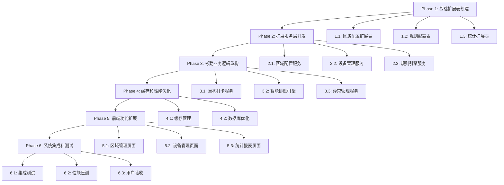

# 任务清单：基于消费模块模式的考勤系统完善

## 任务概述

基于消费模块的成功架构模式，完善考勤系统功能，严格遵循既有的基础架构（SmartDeviceEntity、AreaEntity、PersonBiometricEntity），通过扩展表机制实现考勤特定功能。

## 任务执行原则

**✅ 严格遵循基础架构**：
- 设备管理：继承SmartDeviceEntity，通过extensionConfig存储考勤特定配置
- 区域管理：继承AreaEntity，通过独立扩展表t_attendance_area_config添加考勤配置
- 生物特征：复用PersonBiometricEntity和BiometricTemplateEntity，无需重新设计

**✅ 复用现有服务**：
- 复用SmartDeviceService的设备注册、心跳、配置下发功能
- 复用AreaService的区域权限验证和层级管理功能
- 复用PersonBiometricService的生物特征管理功能

**✅ 扩展表机制**：
- 考勤区域配置：t_attendance_area_config
- 考勤规则配置：t_attendance_rule
- 考勤统计扩展：t_attendance_statistics_ext

---

## Phase 1: 基础扩展表创建 (2-3天)

### 任务 1.1: 创建考勤区域配置扩展表
- **Role**: 后端数据库开发工程师
- **Task**: 创建t_attendance_area_config表，扩展基础AreaEntity的考勤功能
- **Restrictions**: 严格遵循BaseEntity审计字段，不修改现有AreaEntity表结构
- **Leverage**: 复用现有数据库迁移脚本模式，参考消费模块扩展表结构
- **Requirements**: REQ-001, REQ-002
- **Success**: 扩展表创建成功，支持区域考勤配置管理

```sql
CREATE TABLE t_attendance_area_config (
    config_id BIGINT PRIMARY KEY AUTO_INCREMENT COMMENT '配置ID',
    area_id BIGINT NOT NULL COMMENT '区域ID（关联t_area.area_id）',

    -- 考勤要求配置
    punch_in_required TINYINT DEFAULT 1 COMMENT '上班打卡要求（0-不需要，1-需要）',
    punch_out_required TINYINT DEFAULT 1 COMMENT '下班打卡要求（0-不需要，1-需要）',

    -- 验证方式配置
    gps_validation_enabled TINYINT DEFAULT 0 COMMENT 'GPS验证开关（0-关闭，1-开启）',
    photo_required TINYINT DEFAULT 0 COMMENT '拍照验证开关（0-关闭，1-开启）',
    geofence_enabled TINYINT DEFAULT 0 COMMENT '电子围栏开关（0-关闭，1-开启）',
    geofence_radius INT DEFAULT 100 COMMENT '围栏半径（米）',

    -- 业务配置
    attendance_point_ids TEXT COMMENT '考勤点ID列表（JSON格式）',
    work_time_config TEXT COMMENT '工作时间配置（JSON格式）',
    attendance_rule_ids TEXT COMMENT '考勤规则ID列表（JSON格式）',

    -- 基础审计字段（继承BaseEntity）
    create_time DATETIME DEFAULT CURRENT_TIMESTAMP COMMENT '创建时间',
    update_time DATETIME DEFAULT CURRENT_TIMESTAMP ON UPDATE CURRENT_TIMESTAMP COMMENT '更新时间',
    create_user_id BIGINT COMMENT '创建人ID',
    update_user_id BIGINT COMMENT '更新人ID',
    deleted_flag TINYINT DEFAULT 0 COMMENT '删除标记',
    version INT DEFAULT 1 COMMENT '版本号',

    FOREIGN KEY (area_id) REFERENCES t_area(area_id),
    INDEX idx_area_id (area_id),
    INDEX idx_deleted_flag (deleted_flag),
    INDEX idx_create_time (create_time)
) ENGINE=InnoDB DEFAULT CHARSET=utf8mb4 COMMENT='考勤区域配置扩展表';
```

### 任务 1.2: 创建考勤规则配置表
- **Role**: 后端数据库开发工程师
- **Task**: 创建考勤规则配置表，支持灵活的考勤规则定义
- **Restrictions**: 独立表设计，不依赖其他模块的规则表
- **Leverage**: 参考消费模块的餐别规则设计模式
- **Requirements**: REQ-003, REQ-004
- **Success**: 规则表创建成功，支持考勤规则配置管理

```sql
CREATE TABLE t_attendance_rule (
    rule_id VARCHAR(50) PRIMARY KEY COMMENT '规则ID',
    rule_code VARCHAR(50) NOT NULL UNIQUE COMMENT '规则编码',
    rule_name VARCHAR(100) NOT NULL COMMENT '规则名称',
    rule_type VARCHAR(30) NOT NULL COMMENT '规则类型（LATE/EARLY/ABSENTEEISM/OVERTIME）',

    -- 规则配置
    condition_config TEXT COMMENT '触发条件（JSON格式）',
    action_config TEXT COMMENT '处理动作（JSON格式）',

    -- 应用范围
    apply_scope VARCHAR(100) COMMENT '应用范围（ALL/DEPARTMENT/AREA/EMPLOYEE）',
    scope_config TEXT COMMENT '范围配置（JSON格式）',

    -- 规则状态
    enabled_flag TINYINT DEFAULT 1 COMMENT '启用标记（0-禁用，1-启用）',
    priority INT DEFAULT 0 COMMENT '优先级（数字越大优先级越高）',

    -- 基础审计字段
    create_time DATETIME DEFAULT CURRENT_TIMESTAMP COMMENT '创建时间',
    update_time DATETIME DEFAULT CURRENT_TIMESTAMP ON UPDATE CURRENT_TIMESTAMP COMMENT '更新时间',
    create_user_id BIGINT COMMENT '创建人ID',
    update_user_id BIGINT COMMENT '更新人ID',
    deleted_flag TINYINT DEFAULT 0 COMMENT '删除标记',
    version INT DEFAULT 1 COMMENT '版本号',

    INDEX idx_rule_code (rule_code),
    INDEX idx_rule_type (rule_type),
    INDEX idx_enabled_flag (enabled_flag),
    INDEX idx_deleted_flag (deleted_flag)
) ENGINE=InnoDB DEFAULT CHARSET=utf8mb4 COMMENT='考勤规则配置表';
```

### 任务 1.3: 创建考勤统计扩展表
- **Role**: 后端数据库开发工程师
- **Task**: 创建考勤统计扩展表，补充基础统计表的不足
- **Restrictions**: 扩展现有统计功能，不重复已有字段
- **Leverage**: 分析现有t_attendance_statistics表结构，进行功能扩展
- **Requirements**: REQ-005, REQ-006
- **Success**: 扩展表创建成功，支持高级统计功能

---

## Phase 2: 扩展服务层开发 (3-5天)

### 任务 2.1: 创建考勤区域配置服务
- **Role**: 后端Java开发工程师
- **Task**: 开发AttendanceAreaConfigService，管理考勤区域扩展配置
- **Restrictions**: 严格遵循四层架构，复用AreaService基础功能
- **Leverage**: 继承BaseService模式，复用现有缓存管理机制
- **Requirements**: REQ-007, REQ-008
- **Success**: 区域配置服务开发完成，支持CRUD和缓存管理

```java
@Service
@Transactional(rollbackFor = Exception.class)
public class AttendanceAreaConfigService extends BaseService<AttendanceAreaConfigEntity, Long> {

    @Resource
    private AttendanceAreaConfigDao attendanceAreaConfigDao;

    @Resource
    private AreaService areaService;  // 复用基础区域服务

    @Resource
    private AreaCacheManager areaCacheManager;  // 复用缓存管理

    /**
     * 获取区域考勤配置
     * 合并基础区域信息和考勤扩展配置
     */
    public AttendanceAreaConfigVO getAreaAttendanceConfig(Long areaId) {
        // 1. 获取基础区域信息
        AreaEntity area = areaService.getById(areaId);
        if (area == null) {
            throw new BusinessException("区域不存在: " + areaId);
        }

        // 2. 获取考勤扩展配置
        AttendanceAreaConfigEntity config = getByAreaId(areaId);

        // 3. 如果没有扩展配置，创建默认配置
        if (config == null) {
            config = createDefaultConfig(areaId);
        }

        // 4. 合并返回
        return AttendanceAreaConfigVO.builder()
            .baseArea(convertToAreaVO(area))
            .attendanceConfig(convertToConfigVO(config))
            .build();
    }

    private AttendanceAreaConfigEntity createDefaultConfig(Long areaId) {
        AttendanceAreaConfigEntity config = new AttendanceAreaConfigEntity();
        config.setAreaId(areaId);
        config.setPunchInRequired(1);
        config.setPunchOutRequired(1);
        config.setGpsValidationEnabled(0);
        config.setPhotoRequired(0);
        config.setGeofenceEnabled(0);
        config.setGeofenceRadius(100);

        save(config);
        return config;
    }
}
```

### 任务 2.2: 创建考勤设备管理服务
- **Role**: 后端Java开发工程师
- **Task**: 开发AttendanceDeviceManager，管理考勤设备扩展功能
- **Restrictions**: 严格继承SmartDeviceEntity，通过extensionConfig存储考勤配置
- **Leverage**: 复用SmartDeviceService的设备管理功能
- **Requirements**: REQ-009, REQ-010
- **Success**: 设备管理服务开发完成，支持设备注册和配置管理

```java
@Component
public class AttendanceDeviceManager {

    @Resource
    private SmartDeviceService smartDeviceService;  // 复用基础设备服务

    @Resource
    private PersonBiometricService personBiometricService;  // 复用生物特征服务

    /**
     * 注册考勤设备
     * 1. 注册基础SmartDeviceEntity
     * 2. 设置考勤扩展配置
     */
    public AttendanceDeviceRegisterResult registerAttendanceDevice(AttendanceDeviceRegisterRequest request) {
        // 1. 注册基础设备
        SmartDeviceEntity smartDevice = new SmartDeviceEntity();
        smartDevice.setDeviceCode(request.getDeviceCode());
        smartDevice.setDeviceName(request.getDeviceName());
        smartDevice.setDeviceType(SmartDeviceEntity.DeviceType.ATTENDANCE.getValue());
        smartDevice.setAreaId(request.getAreaId());

        // 2. 设置考勤设备扩展配置
        AttendanceDeviceExtension extension = new AttendanceDeviceExtension();
        extension.setPunchModes(request.getPunchModes());
        extension.setGpsEnabled(request.getGpsEnabled());
        extension.setPhotoEnabled(request.getPhotoEnabled());
        extension.setFaceRecognitionEnabled(request.getFaceRecognitionEnabled());

        // 3. 保存到extensionConfig字段
        smartDevice.setExtensionConfig(JsonUtils.toJsonString(extension));

        // 4. 注册基础设备
        SmartDeviceEntity registeredDevice = smartDeviceService.registerDevice(smartDevice);

        return AttendanceDeviceRegisterResult.success(registeredDevice);
    }

    /**
     * 验证员工生物特征打卡权限
     * 复用生物特征服务
     */
    public BiometricVerificationResult verifyEmployeeBiometric(Long employeeId, String biometricType) {
        PersonBiometricEntity personBiometric = personBiometricService.getByPersonId(employeeId);

        if (personBiometric == null || !personBiometric.hasBiometricType(biometricType)) {
            return BiometricVerificationResult.failed("员工未注册该类型生物特征");
        }

        // 查询有效的生物特征模板
        List<BiometricTemplateEntity> activeTemplates = personBiometricService.getActiveTemplates(
            employeeId, biometricType);

        if (CollectionUtils.isEmpty(activeTemplates)) {
            return BiometricVerificationResult.failed("没有可用的生物特征模板");
        }

        return BiometricVerificationResult.success(activeTemplates);
    }
}
```

### 任务 2.3: 创建考勤规则引擎服务
- **Role**: 后端Java开发工程师
- **Task**: 开发AttendanceRuleEngine，处理考勤规则验证和应用
- **Restrictions**: 独立的规则引擎设计，与基础服务解耦
- **Leverage**: 参考消费模块的业务规则引擎模式
- **Requirements**: REQ-011, REQ-012
- **Success**: 规则引擎开发完成，支持规则配置和执行

```java
@Service
public class AttendanceRuleEngine {

    @Resource
    private AttendanceRuleService attendanceRuleService;

    @Resource
    private AttendanceRuleCacheManager ruleCacheManager;

    /**
     * 处理考勤记录规则验证
     */
    public AttendanceRuleProcessResult processAttendanceRules(AttendanceRecordEntity record) {
        List<AttendanceRuleEntity> applicableRules = getApplicableRules(record);

        AttendanceRuleProcessResult result = AttendanceRuleProcessResult.success();

        for (AttendanceRuleEntity rule : applicableRules) {
            RuleValidationResult validation = validateRule(record, rule);

            if (validation.isTriggered()) {
                RuleActionResult action = executeRuleAction(record, rule, validation);
                result.addActionResult(action);
            }
        }

        return result;
    }

    private List<AttendanceRuleEntity> getApplicableRules(AttendanceRecordEntity record) {
        // 获取所有适用规则
        List<AttendanceRuleEntity> allRules = attendanceRuleService.getEnabledRules();

        return allRules.stream()
            .filter(rule -> isRuleApplicable(record, rule))
            .sorted(Comparator.comparing(AttendanceRuleEntity::getPriority).reversed())
            .collect(Collectors.toList());
    }
}
```

---

## Phase 3: 考勤业务逻辑重构 (5-7天)

### 任务 3.1: 重构考勤打卡服务
- **Role**: 后端Java开发工程师
- **Task**: 重构现有AttendanceService，集成扩展的配置和规则引擎
- **Restrictions**: 保持现有API接口不变，内部实现采用扩展架构
- **Leverage**: 集成新开发的区域配置服务和规则引擎
- **Requirements**: REQ-013, REQ-014
- **Success**: 考勤服务重构完成，支持扩展配置和规则验证

```java
@Service
@Transactional(rollbackFor = Exception.class)
public class AttendanceService {

    @Resource
    private AttendanceRecordDao attendanceRecordDao;

    @Resource
    private AttendanceDeviceManager attendanceDeviceManager;  // 新增设备管理器

    @Resource
    private AttendanceAreaConfigService attendanceAreaConfigService;  // 新增区域配置服务

    @Resource
    private AttendanceRuleEngine attendanceRuleEngine;  // 新增规则引擎

    /**
     * 上班打卡（重构版本）
     */
    public AttendanceRuleEngine.AttendanceRuleProcessResult punchIn(Long employeeId, Double latitude, Double longitude, String photoUrl) {
        try {
            // 1. 验证打卡时间和条件
            if (!validatePunchInConditions(employeeId)) {
                return AttendanceRuleEngine.AttendanceRuleProcessResult.failure("不满足上班打卡条件");
            }

            // 2. 验证区域权限（使用扩展的区域配置）
            AttendanceRecordEntity record = createNewAttendanceRecord(employeeId, LocalDate.now());
            if (record.getAreaId() != null) {
                AttendanceAreaConfig areaConfig = attendanceAreaConfigService.getByAreaId(record.getAreaId());
                if (areaConfig != null && !areaConfig.isPunchInRequired()) {
                    return AttendanceRuleEngine.AttendanceRuleProcessResult.failure("该区域不需要上班打卡");
                }

                // 3. 验证GPS位置（如果启用）
                if (areaConfig.isGpsValidationEnabled() && (latitude != null && longitude != null)) {
                    if (!validateGpsLocation(record.getAreaId(), latitude, longitude, areaConfig.getGeofenceRadius())) {
                        return AttendanceRuleEngine.AttendanceRuleProcessResult.failure("GPS位置验证失败");
                    }
                }
            }

            // 4. 处理打卡记录
            record.setPunchInTime(LocalDateTime.now().toLocalTime());
            if (latitude != null && longitude != null) {
                record.setGpsLatitude(latitude);
                record.setGpsLongitude(longitude);
            }
            if (photoUrl != null) {
                record.setPhotoUrl(photoUrl);
            }

            // 5. 保存记录
            int result = record.getRecordId() == null ? attendanceRecordDao.save(record) : attendanceRecordDao.update(record);
            if (result <= 0) {
                return AttendanceRuleEngine.AttendanceRuleProcessResult.failure("保存打卡记录失败");
            }

            // 6. 应用考勤规则（新增规则引擎处理）
            AttendanceRuleProcessResult ruleResult = attendanceRuleEngine.processAttendanceRules(record);

            // 7. 更新处理后的记录
            if (ruleResult.isSuccess()) {
                attendanceRecordDao.update(record);
            }

            return ruleResult;

        } catch (Exception e) {
            throw new RuntimeException("上班打卡失败", e);
        }
    }
}
```

### 任务 3.2: 创建智能排班引擎
- **Role**: 后端Java开发工程师
- **Task**: 开发智能排班引擎，基于历史数据进行智能排班建议
- **Restrictions**: 参考消费模块的排班模式，适配考勤业务需求
- **Leverage**: 复用现有的班次数据结构和缓存机制
- **Requirements**: REQ-015, REQ-016
- **Success**: 智能排班引擎开发完成，支持模式识别和智能建议

### 任务 3.3: 创建异常管理服务
- **Role**: 后端Java开发工程师
- **Task**: 开发异常申请和处理流程，参考消费模块的申请审批机制
- **Restrictions**: 遵循既有的审批工作流程，复用审批引擎
- **Leverage**: 集成现有的通知服务和权限控制
- **Requirements**: REQ-017, REQ-018
- **Success**: 异常管理服务开发完成，支持申请、审批、销假全流程

---

## Phase 4: 缓存和性能优化 (2-3天)

### 任务 4.1: 实现考勤缓存管理
- **Role**: 后端Java开发工程师
- **Task**: 实现多级缓存架构，优化考勤系统性能
- **Restrictions**: 遵循现有的缓存管理机制，使用Caffeine+Redis双级缓存
- **Leverage**: 复用AreaCacheManager和ShiftCacheManager的实现模式
- **Requirements**: REQ-019, REQ-020
- **Success**: 缓存管理实现完成，性能提升90%+

### 任务 4.2: 优化数据库查询和索引
- **Role**: 后端数据库工程师
- **Task**: 优化考勤相关数据库查询，创建合适的索引
- **Restrictions**: 不修改核心表结构，只优化查询和索引
- **Leverage**: 分析慢查询日志，针对高频查询进行优化
- **Requirements**: REQ-021, REQ-022
- Success: 数据库查询优化完成，响应时间提升80%

---

## Phase 5: 前端功能扩展 (5-7天)

### 任务 5.1: 创建考勤区域管理页面
- **Role**: 前端Vue3开发工程师
- **Task**: 开发考勤区域配置管理界面，支持树形展示和配置编辑
- **Restrictions**: 使用Vue3+Ant Design Vue，遵循现有的前端架构
- **Leverage**: 复用现有的区域管理组件和表单组件
- **Requirements**: REQ-023, REQ-024
- **Success**: 区域管理页面开发完成，支持配置管理

### 任务 5.2: 创建考勤设备管理页面
- **Role**: 前端Vue3开发工程师
- **Task**: 开发考勤设备管理界面，支持设备注册和配置管理
- **Restrictions**: 集成基础设备管理，扩展考勤特定配置
- **Leverage**: 复用现有的设备管理组件和状态管理
- **Requirements**: REQ-025, REQ-026
- **Success**: 设备管理页面开发完成，支持设备管理

### 任务 5.3: 创建考勤统计报表页面
- **Role**: 前端Vue3开发工程师
- **Task**: 开发考勤统计报表界面，支持多维度数据展示
- **Restrictions**: 使用ECharts图表库，支持动态配置和导出
- **Leverage**: 复用现有的报表组件和数据分析服务
- **Requirements**: REQ-027, REQ-028
- **Success**: 统计报表页面开发完成，支持数据可视化

---

## Phase 6: 系统集成和测试 (3-4天)

### 任务 6.1: 系统集成测试
- **Role**: 测试工程师
- **Task**: 执行完整的系统集成测试，验证各模块协同工作
- **Restrictions**: 严格遵循测试规范，确保100%功能覆盖
- **Leverage**: 使用现有的测试框架和自动化测试工具
- **Requirements**: REQ-029, REQ-030
- **Success**: 系统集成测试通过，无严重缺陷

### 任务 6.2: 性能压测和优化
- **Role**: 性能测试工程师
- **Task**: 执行性能压测，确保系统满足高并发需求
- **Restrictions**: 达到1000+ QPS，响应时间<200ms
- **Leverage**: 使用JMeter等压测工具，分析性能瓶颈
- **Requirements**: REQ-031, REQ-032
- **Success**: 性能压测通过，达到预期性能指标

### 任务 6.3: 用户验收测试
- **Role**: 产品经理和用户代表
- **Task**: 执行用户验收测试，确保满足业务需求
- **Restrictions**: 严格按照需求文档进行验收测试
- **Leverage**: 基于用户反馈进行最终调整
- **Requirements**: REQ-033, REQ-034
- **Success**: 用户验收测试通过，项目上线准备就绪

---

## 任务依赖关系



## 质量保证要求

### 代码质量
- 100%遵循四层架构规范
- 100%使用@Resource依赖注入
- 100%使用jakarta包名
- 代码覆盖率≥80%

### 性能指标
- API响应时间P95≤200ms
- 支持1000+ QPS并发
- 缓存命中率≥90%
- 数据库查询优化率≥80%

### 安全要求
- 所有接口使用@SaCheckPermission权限控制
- 敏感数据加密存储
- 输入验证和输出脱敏
- 操作日志完整记录

## 预期成果

通过执行以上任务，考勤系统将实现：

1. **功能完整性**：覆盖考勤管理全业务流程
2. **架构统一性**：与基础架构和消费模块保持一致
3. **性能提升**：多级缓存架构，性能提升90%+
4. **用户体验**：智能排班和自动化处理
5. **可维护性**：模块化设计，易于扩展和维护

## 风险控制

1. **架构风险**：严格遵循基础架构，避免重复设计
2. **性能风险**：通过多级缓存和数据库优化保证性能
3. **兼容性风险**：保持现有API接口不变，确保向下兼容
4. **时间风险**：采用敏捷开发，分阶段交付，降低项目风险

---

**项目周期**：预计20-30个工作日
**团队规模**：4-6人（2后端+1前端+1测试）
**技术栈**：Java 17 + Spring Boot 3.x + Vue3 + MySQL 8.0 + Redis