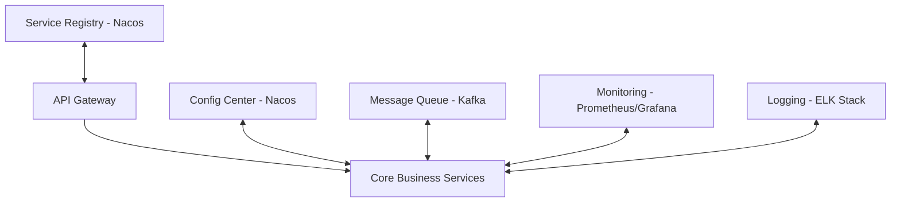
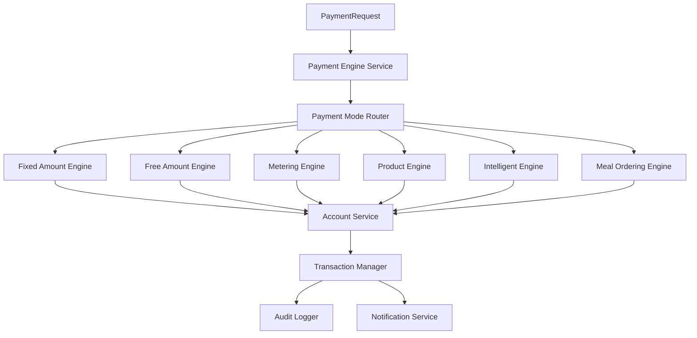
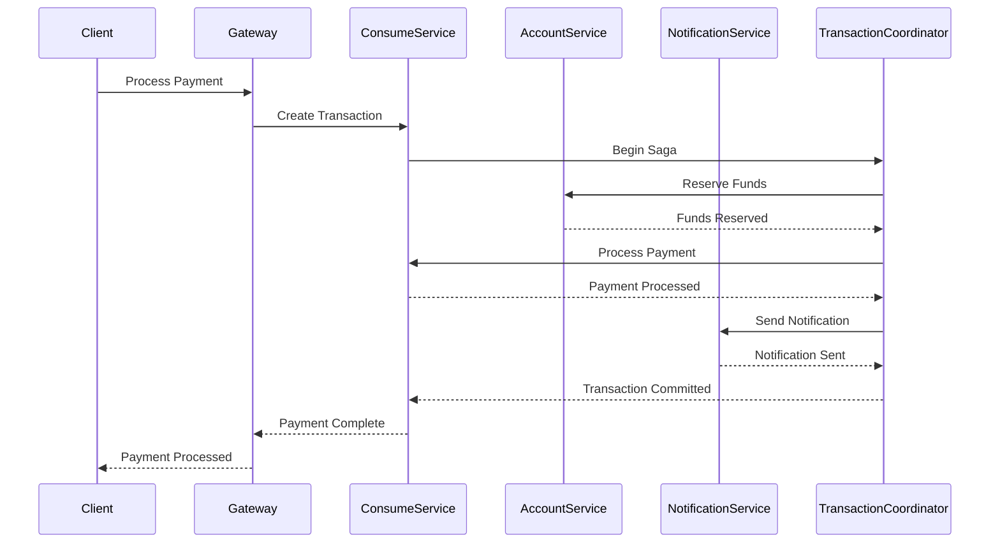
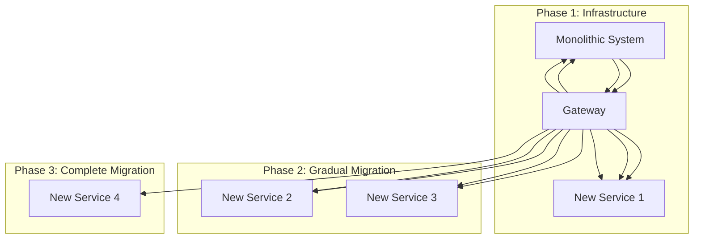
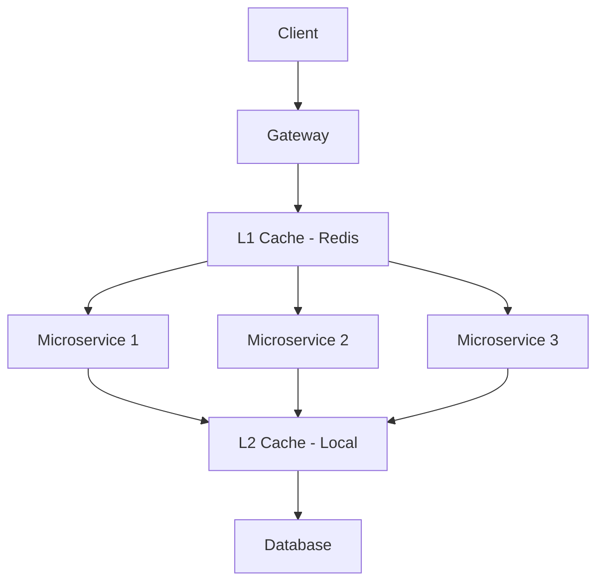

# Design Document - IOE-DREAM Microservices Transformation

## Architecture Overview

This design document outlines the technical architecture and implementation approach for transforming the IOE-DREAM Smart Campus Management Platform from a monolithic architecture to a comprehensive microservices architecture.

## Current Architecture Analysis

### Monolithic Structure
```
smart-admin-api-java17-springboot3/
├── sa-base/          # Base module (common components, utilities, configurations)
├── sa-support/       # Support module (security, cache, messaging, etc.)
└── sa-admin/         # Management module (business implementation)
    └── module/
        ├── access/        # Access Control (75 files)
        ├── consume/       # Consumption Management (200+ files)
        ├── attendance/    # Attendance Management (150+ files)
        ├── video/         # Video Monitoring (50+ files)
        ├── hr/            # Human Resources
        ├── device/        # Device Management
        ├── visitor/       # Visitor Management
        └── system/        # System Management
```

### Key Architectural Characteristics
- **Four-Layer Architecture**: Controller → Service → Manager → DAO
- **Unified Framework**: SmartAdmin v3 (Spring Boot 3.x + Java 17)
- **Shared Infrastructure**: Common database, cache, security components
- **Tight Coupling**: All modules share the same deployment unit

## Target Microservices Architecture

### Service Extraction Strategy (Based on Existing Code)

#### 1. Code-Based Service Extraction
```mermaid
graph TB
    subgraph "Existing Monolithic Structure"
        Monolith[smart-admin-api-java17-springboot3]
        Monolith --> AccessModule[sa-admin/module/access/ (75 files)]
        Monolith --> ConsumeModule[sa-admin/module/consume/ (200+ files)]
        Monolith --> AttendanceModule[sa-admin/module/attendance/ (150+ files)]
        Monolith --> VideoModule[sa-admin/module/video/ (50+ files)]
        Monolith --> HRModule[sa-admin/module/hr/]
        Monolith --> DeviceModule[sa-admin/module/device/]
        Monolith --> VisitorModule[sa-admin/module/visitor/]
    end

    subgraph "Extracted Microservices"
        Gateway[API Gateway] --> AccessService[Access Service]
        Gateway --> ConsumeService[Consume Service]
        Gateway --> VisitorService[Visitor Service]
        Gateway --> AttendanceService[Attendance Service]
        Gateway --> VideoService[Video Service]
        Gateway --> HRService[HR Service]
        Gateway --> DeviceService[Device Service]

        AccessModule --> AccessService
        ConsumeModule --> ConsumeService
        AttendanceModule --> AttendanceService
        VideoModule --> VideoService
        HRModule --> HRService
        DeviceModule --> DeviceService
        VisitorModule --> VisitorService
    end

    Registry[Service Registry] --> Gateway
    Config[Config Center] --> Gateway
    Config --> AccessService
    Config --> ConsumeService
    Config --> VisitorService
    Config --> AttendanceService
    Config --> VideoService
    Config --> HRService
    Config --> DeviceService
```

#### 2. Infrastructure Services


## Detailed Service Design

### 1. Access Control Service

#### Service Boundaries
- **Domain**: Access control and management
- **Responsibilities**:
  - User access authentication and authorization
  - Biometric recognition (face, fingerprint, iris)
  - Device protocol adaptation
  - Access record management and analysis
  - Real-time monitoring and alerting

#### Key Components
```java
// Main Service Architecture
AccessService/
├── controller/
│   ├── AccessController.java          # REST API endpoints
│   ├── BiometricController.java       # Biometric recognition endpoints
│   └── DeviceController.java          # Device management endpoints
├── service/
│   ├── AccessService.java             # Core access logic
│   ├── BiometricService.java          # Biometric processing
│   └── DeviceService.java             # Device management
├── manager/
│   ├── AccessManager.java             # Complex access workflows
│   └── BiometricManager.java          # Biometric engine management
├── dao/
│   ├── AccessRecordDao.java           # Access record data access
│   └── DeviceDao.java                 # Device data access
└── integration/
    ├── FaceRecognitionAdapter.java    # Face recognition integration
    ├── FingerprintAdapter.java        # Fingerprint processing
    └── ProtocolAdapterRegistry.java   # Device protocol management
```

#### Data Model
- **Users**: User biometric data, access permissions
- **Devices**: Access devices, protocols, status
- **AccessRecords**: Historical access data
- **Permissions**: Area-based permissions, time-based access

### 2. Consume Service

#### Service Boundaries
- **Domain**: Consumption and payment management
- **Responsibilities**:
  - Account management and balance control
  - Payment processing with multiple modes
  - Transaction security and audit
  - Advanced reporting and analytics
  - Refund and reconciliation processing

#### Key Components
```java
ConsumeService/
├── controller/
│   ├── AccountController.java         # Account management
│   ├── PaymentController.java         # Payment processing
│   └── ReportController.java          # Analytics and reporting
├── service/
│   ├── AccountService.java            # Account operations
│   ├── PaymentEngineService.java       # Payment processing engine
│   └── RefundService.java             # Refund management
├── manager/
│   ├── PaymentManager.java            # Complex payment workflows
│   ├── TransactionManager.java        # Transaction management
│   └── ReconciliationManager.java     # Data reconciliation
├── dao/
│   ├── AccountDao.java                # Account data access
│   ├── TransactionDao.java            # Transaction data access
│   └── ReportDao.java                 # Reporting data access
└── payment/
    ├── FixedAmountEngine.java          # Fixed amount payments
    ├── FreeAmountEngine.java           # Free amount payments
    ├── MeteringEngine.java             # Metering-based payments
    ├── ProductEngine.java              # Product ordering
    ├── IntelligentEngine.java          # AI-powered payments
    └── MealOrderingEngine.java         # Meal ordering system
```

#### Payment Engines Architecture


### 3. Visitor Service

#### Service Boundaries
- **Domain**: Visitor management and access control
- **Responsibilities**:
  - Visitor appointment system
  - Access permission management
  - Real-time visitor tracking
  - Notification and alerting
  - Integration with access control systems

#### Key Components
```java
VisitorService/
├── controller/
│   ├── AppointmentController.java     # Appointment management
│   ├── VisitorController.java         # Visitor information
│   └── TrackingController.java         # Real-time tracking
├── service/
│   ├── AppointmentService.java         # Appointment logic
│   ├── VisitorService.java             # Visitor management
│   └── NotificationService.java        # Notification management
├── manager/
│   ├── AppointmentManager.java         # Complex appointment workflows
│   └── AccessManager.java              # Visitor access coordination
├── dao/
│   ├── AppointmentDao.java             # Appointment data access
│   ├── VisitorDao.java                 # Visitor data access
│   └── AccessRecordDao.java            # Access records
└── integration/
    ├── AccessControlClient.java        # Access control integration
    └── NotificationClient.java         # Notification systems
```

### 4. Attendance Service

#### Service Boundaries
- **Domain**: Attendance management and analysis
- **Responsibilities**:
  - Attendance record management
  - Rules engine configuration and execution
  - Scheduling and shift management
  - Advanced analytics and reporting
  - Mobile support and integration

#### Key Components
```java
AttendanceService/
├── controller/
│   ├── AttendanceController.java      # Attendance records
│   ├── ScheduleController.java        # Scheduling management
│   └── ReportController.java          # Analytics and reporting
├── service/
│   ├── AttendanceService.java         # Attendance logic
│   ├── RulesEngineService.java        # Rules engine processing
│   └── ScheduleService.java           # Scheduling management
├── manager/
│   ├── RulesEngineManager.java        # Rules configuration
│   ├── ScheduleManager.java           # Complex scheduling
│   └── AnalyticsManager.java          # Attendance analytics
├── dao/
│   ├── AttendanceDao.java             # Attendance data access
│   ├── ScheduleDao.java               # Schedule data access
│   └── RulesDao.java                  # Rules configuration
└── rules/
    ├── AttendanceRules.java           # Core attendance rules
    ├── ShiftRules.java                # Shift management rules
    └── ExceptionRules.java            # Exception handling rules
```

### 5. Video Service

#### Service Boundaries
- **Domain**: Video monitoring and analysis
- **Responsibilities**:
  - Video streaming management
  - Device monitoring and control
  - AI-powered analysis
  - Alerting and notification
  - Recording and playback management

#### Key Components
```java
VideoService/
├── controller/
│   ├── StreamController.java          # Video streaming
│   ├── DeviceController.java          # Device management
│   └── AlertController.java           # Alert management
├── service/
│   ├── StreamService.java             # Video streaming logic
│   ├── DeviceService.java             # Device management
│   └── AnalysisService.java           # AI analysis
├── manager/
│   ├── StreamManager.java             # Stream management
│   ├── AnalysisManager.java           # AI analysis orchestration
│   └── AlertManager.java              # Alert processing
├── dao/
│   ├── DeviceDao.java                 # Device data access
│   ├── StreamDao.java                 # Stream metadata
│   └── AlertDao.java                  # Alert data access
└── ai/
    ├── MotionDetector.java            # Motion detection
    ├── IntrusionDetector.java         # Intrusion detection
    ├── FaceDetector.java              # Face recognition
    └── AnomalyDetector.java           # Anomaly detection
```

## Infrastructure Architecture

### 1. Service Registry and Discovery

#### Nacos Configuration
```yaml
# Nacos Server Configuration
server:
  port: 8848

spring:
  application:
    name: nacos-server

  datasource:
    platform: mysql
    url: jdbc:mysql://mysql:3306/nacos_config?characterEncoding=utf8&connectTimeout=1000&socketTimeout=3000&autoReconnect=true&useUnicode=true&useSSL=false&serverTimezone=UTC
    username: nacos
    password: nacos
    driver-class-name: com.mysql.cj.jdbc.Driver

# Service Configuration
nacos:
  config:
    server-addr: nacos:8848
    namespace: microservices
    group: IOE-DREAM
    file-extension: yaml
  discovery:
    server-addr: nacos:8848
    namespace: microservices
    group: IOE-DREAM
```

### 2. API Gateway Configuration

#### Spring Cloud Gateway Setup
```java
@Configuration
public class GatewayConfig {

    @Bean
    public RouteLocator customRouteLocator(RouteLocatorBuilder builder) {
        return builder.routes()
            .route("access-service", r -> r.path("/api/access/**")
                .uri("lb://access-service"))
            .route("consume-service", r -> r.path("/api/consume/**")
                .uri("lb://consume-service"))
            .route("visitor-service", r -> r.path("/api/visitor/**")
                .uri("lb://visitor-service"))
            .route("attendance-service", r -> r.path("/api/attendance/**")
                .uri("lb://attendance-service"))
            .route("video-service", r -> r.path("/api/video/**")
                .uri("lb://video-service"))
            .route("hr-service", r -> r.path("/api/hr/**")
                .uri("lb://hr-service"))
            .route("device-service", r -> r.path("/api/device/**")
                .uri("lb://device-service"))
            .build();
    }
}
```

### 3. Message Queue Architecture

#### Kafka Topic Design
```yaml
# Kafka Topics Configuration
topics:
  # Service Communication
  access-events:            # Access control events
  consume-events:           # Consumption events
  visitor-events:          # Visitor management events
  attendance-events:        # Attendance events
  video-events:             # Video monitoring events

  # Data Synchronization
  user-sync:                # User data synchronization
  device-sync:              # Device data synchronization

  # Transaction Coordination
  transaction-coordination: # Distributed transaction coordination

  # Monitoring and Alerting
  system-alerts:            # System monitoring alerts
  business-events:          # Business intelligence events
```

### 4. Data Consistency Strategy

#### Distributed Transaction Pattern


## Migration Strategy

### Zero-Downtime Migration Approach

#### 1. Strangler Fig Pattern


#### 2. Database Migration Strategy
- **Database per Service**: Each microservice has its own database
- **Data Migration Scripts**: Automated scripts for data extraction and loading
- **Data Synchronization**: Real-time synchronization during migration
- **Validation**: Comprehensive data validation and consistency checks

### 3. Feature Toggle Strategy
```java
@Component
public class FeatureToggleService {

    @Value("${microservices.access.enabled:false}")
    private boolean accessServiceEnabled;

    @Value("${microservices.consume.enabled:false}")
    private boolean consumeServiceEnabled;

    public boolean isAccessServiceEnabled() {
        return accessServiceEnabled;
    }

    public boolean isConsumeServiceEnabled() {
        return consumeServiceEnabled;
    }
}
```

## Security Architecture

### 1. Authentication and Authorization
- **Centralized Authentication**: API Gateway handles authentication
- **Service-to-Service Security**: Mutual TLS between services
- **OAuth 2.0 Integration**: Token-based authentication
- **Role-Based Access**: Fine-grained permission control

### 2. Data Security
- **Encryption in Transit**: HTTPS/TLS for all communications
- **Encryption at Rest**: Database and file encryption
- **API Security**: Rate limiting, request validation
- **Audit Logging**: Comprehensive security audit trails

## Performance Optimization

### 1. Caching Strategy


### 2. Load Balancing
- **Service Load Balancing**: Nacos service discovery with load balancing
- **Database Load Balancing**: Read replicas and write splitting
- **Caching Load Balancing**: Consistent hashing for cache distribution

### 3. Monitoring and Observability
```yaml
# Monitoring Configuration
monitoring:
  metrics:
    - jvm
    - system
    - spring-boot
    - custom-business

  tracing:
    sampling-rate: 0.1
    headers:
      - x-trace-id
      - x-span-id

  logging:
    level: INFO
    structured: true
    correlation-id: x-request-id
```

## Deployment Architecture

### 1. Container Strategy
```dockerfile
# Microservice Docker Template
FROM openjdk:17-jre-slim

VOLUME /tmp
ARG JAR_FILE=target/*.jar
COPY ${JAR_FILE} app.jar

ENTRYPOINT ["java", "-jar", "/app.jar"]

# Health Check
HEALTHCHECK --interval=30s --timeout=3s --start-period=60s --retries=3 \
  CMD curl -f http://localhost:8080/actuator/health || exit 1
```

### 2. Kubernetes Deployment
```yaml
# Service Deployment Template
apiVersion: apps/v1
kind: Deployment
metadata:
  name: access-service
spec:
  replicas: 3
  selector:
    matchLabels:
      app: access-service
  template:
    metadata:
      labels:
        app: access-service
    spec:
      containers:
      - name: access-service
        image: ioe-dream/access-service:latest
        ports:
        - containerPort: 8080
        env:
        - name: SPRING_PROFILES_ACTIVE
          value: "production"
        - name: NACOS_SERVER
          value: "nacos:8848"
        livenessProbe:
          httpGet:
            path: /actuator/health
            port: 8080
          initialDelaySeconds: 60
          periodSeconds: 30
```

This comprehensive design provides the technical foundation for the IOE-DREAM microservices transformation, ensuring scalability, maintainability, and business continuity throughout the migration process.