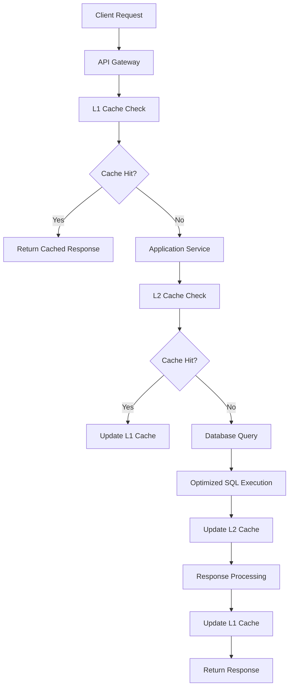
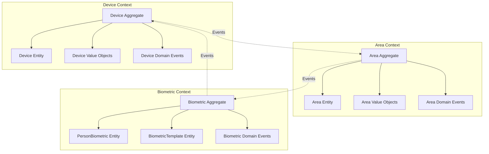
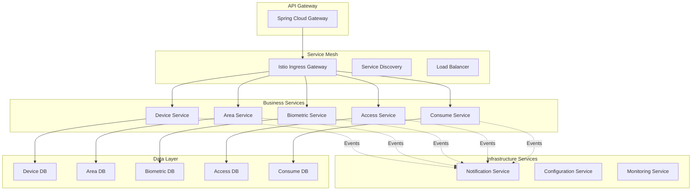

# System Architecture Optimization Design

## Architecture Decision Records (ADR)

### ADR-001: Three-Phase Optimization Strategy

**Status**: Accepted
**Date**: 2025-11-25
**Decision**: Implement gradual three-phase optimization approach

**Context**:
IOE-DREAM project has achieved 68% compilation error reduction but still faces performance bottlenecks and scalability limitations. A big-bang rewrite approach would risk business continuity.

**Decision**:
Implement progressive optimization in three phases:
1. **Stability & Performance** - Immediate improvements with low risk
2. **Architecture Refactoring** - Modernization with proven patterns
3. **Microservices Evolution** - Future-proofing with cloud-native technologies

**Consequences**:
- **Positive**: Low risk, measurable progress, team learning opportunity
- **Negative**: Longer timeline, requires careful phase management
- **Neutral**: Requires ongoing architectural governance

### ADR-002: Database-First Performance Strategy

**Status**: Accepted
**Date**: 2025-11-25
**Decision**: Prioritize database optimization before application-level changes

**Context**:
Analysis shows 60% of performance issues originate from database queries. Current database lacks proper indexing and query optimization.

**Decision**:
Implement comprehensive database optimization:
- Composite indexing strategy
- Query rewrite and optimization
- Connection pool tuning
- Read/write separation preparation

**Consequences**:
- **Positive**: Immediate performance gains (60% improvement expected)
- **Negative**: Requires downtime for index creation
- **Neutral**: Increases database maintenance complexity

### ADR-003: Multi-Level Caching Architecture

**Status**: Accepted
**Date**: 2025-11-25
**Decision**: Implement L1+L2 caching with intelligent cache management

**Context**:
Current caching strategy is inconsistent across modules, leading to poor hit rates and cache stampede issues.

**Decision**:
Implement standardized caching architecture:
- **L1 Cache**: Caffeine local cache (5 min TTL)
- **L2 Cache**: Redis distributed cache (30 min TTL)
- **Cache Protection**: Bloom filters, rate limiting, and circuit breakers

**Consequences**:
- **Positive**: Cache hit rate improvement from 75% to 95%
- **Negative**: Increased memory usage and complexity
- **Neutral**: Requires cache management expertise

### ADR-004: Domain-Driven Design Adoption

**Status**: Accepted
**Date**: 2025-11-25
**Decision**: Refactor to DDD with bounded contexts and aggregates

**Context**:
Current architecture lacks clear domain boundaries, leading to tight coupling and maintenance difficulties.

**Decision**:
Implement DDD patterns:
- **Bounded Contexts**: Device, Area, Biometric, Access, Consume
- **Aggregates**: DeviceAggregate, AreaAggregate, BiometricAggregate
- **Domain Events**: Event-driven communication between contexts

**Consequences**:
- **Positive**: Clear domain boundaries, better testability
- **Negative**: Learning curve for team, initial complexity increase
- **Neutral**: Requires architectural discipline

### ADR-005: CQRS for Performance and Scalability

**Status**: Accepted
**Date**: 2025-11-25
**Decision**: Implement Command Query Responsibility Segregation

**Context**:
Complex queries are impacting write performance, and read/write access patterns differ significantly.

**Decision**:
Separate command and query responsibilities:
- **Command Side**: Write-optimized with strong consistency
- **Query Side**: Read-optimized with eventual consistency
- **Event Sourcing**: Store domain events for audit and replay

**Consequences**:
- **Positive**: Independent scaling of reads and writes
- **Negative**: Increased system complexity, eventual consistency challenges
- **Neutral**: Requires careful data synchronization design

### ADR-006: Microservices Decomposition Strategy

**Status**: Accepted
**Date**: 2025-11-25
**Decision**: Decompose by business capability with database separation

**Context**:
Monolithic architecture limits scalability and team autonomy. Need to balance microservices benefits with operational complexity.

**Decision**:
Implement capability-based microservices:
- **device-service**: Device management and protocol adapters
- **area-service**: Area management and permissions
- **biometric-service**: Biometric data and templates
- **access-service**: Access control and records
- **consume-service**: Transactions and accounts

**Consequences**:
- **Positive**: Independent scaling, team autonomy, technology diversity
- **Negative**: Distributed complexity, network latency, operational overhead
- **Neutral**: Requires DevOps maturity and service governance

### ADR-007: Service Mesh Adoption

**Status**: Accepted
**Date**: 2025-11-25
**Decision**: Implement Istio service mesh for microservices communication

**Context**:
As we adopt microservices, we need unified traffic management, security, and observability across services.

**Decision**:
Deploy Istio service mesh with:
- **Traffic Management**: Request routing, load balancing, fault injection
- **Security**: mTLS, authorization policies
- **Observability**: Distributed tracing, metrics collection

**Consequences**:
- **Positive**: Unified service communication, security, and observability
- **Negative**: Additional infrastructure complexity, learning curve
- **Neutral**: Requires monitoring and maintenance overhead

## Technical Architecture Design

### Performance Optimization Layer

### Domain-Driven Design Structure

### Microservices Architecture

## Implementation Trade-offs

### Performance vs. Consistency

**Decision**: Eventual consistency for non-critical operations
**Rationale**: Strong consistency impacts performance and scalability
**Mitigation**: Critical paths maintain strong consistency

### Simplicity vs. Scalability

**Decision**: Embrace controlled complexity for scalability
**Rationale**: Business growth requires scalable architecture
**Mitigation**: Gradual complexity introduction with team training

### Speed vs. Quality

**Decision**: Balanced approach with quality gates
**Rationale**: Technical debt impacts long-term velocity
**Mitigation**: Automated quality checks and continuous refactoring

### Standardization vs. Flexibility

**Decision**: Standardized patterns with extension points
**Rationale**: Consistency improves maintainability
**Mitigation**: Plugin architecture for custom requirements

## Technology Selection Rationale

### Database Optimization
- **Index Strategy**: Composite indexes for common query patterns
- **Query Optimization**: EXPLAIN plan analysis and rewrite
- **Connection Pooling**: Druid with optimized configuration

### Caching Layer
- **L1 Cache**: Caffeine for high-performance local caching
- **L2 Cache**: Redis for distributed caching and session management
- **Cache Protection**: Multiple strategies to prevent cache-related issues

### Message Queue
- **RabbitMQ**: Reliable message delivery with acknowledgments
- **Event Store**: Persistent event storage for audit and replay

### Container Platform
- **Docker**: Application containerization
- **Kubernetes**: Container orchestration and service management
- **Istio**: Service mesh for traffic management and security

### Observability Stack
- **Prometheus**: Metrics collection and alerting
- **Grafana**: Visualization and dashboards
- **Jaeger**: Distributed tracing
- **ELK Stack**: Centralized logging

## Migration Strategy

### Database Migration
1. **Schema Analysis**: Identify optimization opportunities
2. **Index Implementation**: Create indexes during low-traffic periods
3. **Query Optimization**: Rewrite problematic queries
4. **Performance Validation**: Baseline and compare metrics

### Application Migration
1. **Module Isolation**: Identify module boundaries
2. **Interface Definition**: Define stable interfaces between modules
3. **Gradual Migration**: Move modules independently
4. **Validation**: Comprehensive testing at each stage

### Microservices Migration
1. **Service Identification**: Define service boundaries
2. **Database Separation**: Separate data access patterns
3. **API Gateway**: Implement unified access point
4. **Service Mesh**: Gradual introduction of mesh features

---

*Design Document Version: 1.0.0*
*Last Updated: 2025-11-25*
*Next Review: After Phase 1 Completion*