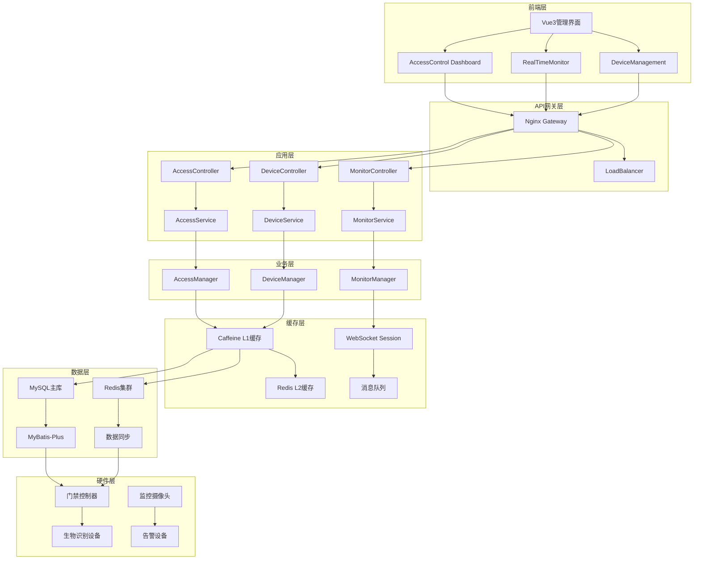

# 门禁系统完整实现设计文档

## 概述

本文档详细描述了IOE-DREAM智慧园区门禁系统的完整技术设计方案，严格遵循repowiki开发规范体系，确保代码质量、系统性能和可维护性。

**设计目标**:
- 实现35% → 90%+的门禁模块功能覆盖率
- 建立符合repowiki规范的标准开发流程
- 确保企业级系统稳定性和安全性
- 实现80%+的单元测试覆盖率

## Steering文档对齐

### 技术标准对齐 (tech.md)

**严格遵循repowiki技术规范**:
- **包名规范**: 强制使用jakarta.*，禁止javax.*
- **依赖注入**: 强制使用@Resource，禁止@Autowired
- **架构规范**: 严格四层架构Controller → Service → Manager → DAO
- **权限控制**: 所有接口必须添加@SaCheckPermission注解
- **代码质量**: 每个方法不超过50行，单一职责原则

**SmartAdmin v3技术栈集成**:
- Spring Boot 3.5.4 + Jakarta EE
- Vue 3 + Composition API + TypeScript
- MyBatis-Plus 3.5 + MySQL 8.0
- Redis 6.0集群 + Caffeine本地缓存
- Sa-Token权限认证 + RBAC权限模型

### 项目结构对齐 (structure.md)

**标准包结构**:
```
net.lab1024.sa.admin.module.smart.access/
├── controller/     # 控制器层 - HTTP接口
├── service/        # 业务逻辑层 - 业务流程
├── manager/        # 管理层 - 跨模块调用、缓存
├── dao/           # 数据访问层 - 数据库操作
├── domain/        # 领域模型层 - Entity、VO、DTO
│   ├── entity/    # 实体类
│   ├── vo/        # 视图对象
│   ├── dto/       # 数据传输对象
│   └── form/      # 表单对象
└── constant/      # 常量定义 - 枚举、常量类
```

**前端结构对齐**:
```
src/views/smart/access/
├── components/    # 通用组件
├── pages/         # 页面组件
├── api/          # API接口封装
├── stores/       # Pinia状态管理
└── types/        # TypeScript类型定义
```

## 代码复用分析

### 现有组件利用

**核心基础组件**:
- **BaseCacheManager**: 多级缓存管理器，继承实现门禁专用缓存
- **BaseEntity**: 通用实体基类，包含审计字段
- **ResponseDTO**: 统一响应格式，确保API一致性
- **SmartException**: 统一异常处理体系
- **SaTokenUtil**: Sa-Token工具类，权限验证辅助

**工具类复用**:
- **SmartBeanUtil**: 对象拷贝和转换工具
- **SmartVerificationUtil**: 参数验证工具
- **SmartResponseUtil**: 响应构建工具
- **RedisUtil**: Redis操作工具类

### 集成点设计

**系统集成点**:
- **用户权限系统**: 集成现有UserPermissionEntity和RBAC模型
- **组织架构系统**: 集成SmartAreaEntity区域管理
- **设备管理系统**: 扩展SmartDeviceEntity设备管理
- **日志审计系统**: 集成OperationLog操作日志记录

**数据库集成**:
- **用户表**: t_smart_user (现有，扩展门禁权限字段)
- **角色表**: t_smart_role (现有，添加门禁权限标识)
- **设备表**: t_smart_device (现有，扩展门禁设备类型)
- **区域表**: t_smart_area (现有，添加门禁区域类型)

## 架构设计

### 整体架构图



### 模块化设计原则

**单一文件职责**:
- **Controller类**: 仅处理HTTP请求/响应，不超过200行代码
- **Service类**: 仅处理业务逻辑，不超过300行代码
- **Manager类**: 仅处理跨模块调用和缓存，不超过200行代码
- **DAO接口**: 仅处理数据访问，使用MyBatis-Plus简化

**组件隔离原则**:
- **权限验证组件**: 独立的权限验证逻辑，可复用
- **设备通信组件**: 抽象设备通信接口，支持多种协议
- **生物识别组件**: 封装生物识别算法，支持多种识别方式
- **告警处理组件**: 统一的告警处理流程，支持多种告警渠道

**服务层分离**:
- **数据访问层**: 使用MyBatis-Plus，自动生成CRUD方法
- **业务逻辑层**: 复杂业务流程编排，事务管理
- **表现层**: Controller仅做参数验证和响应格式化
- **缓存管理层**: 统一的缓存策略，支持多级缓存

## 组件和接口设计

### 核心Controller组件

#### AccessAreaController - 区域管理控制器

**Purpose**: 负责门禁区域空间的CRUD操作和层级管理

**Interfaces**:
```java
@RestController
@RequestMapping("/api/smart/access/area")
@SaCheckPermission("smart:access:area")
public class AccessAreaController {

    /**
     * 获取区域树形结构
     * @return 区域树形列表
     */
    @GetMapping("/tree")
    public ResponseDTO<List<AccessAreaTreeVO>> getAreaTree();

    /**
     * 创建新区域
     * @param form 区域创建表单
     * @return 创建结果
     */
    @PostMapping("/create")
    @OperationLog(operationType = OperationLogTypeEnum.ADD, operationContent = "创建门禁区域")
    public ResponseDTO<Long> createArea(@Valid @RequestBody AccessAreaCreateForm form);

    /**
     * 更新区域信息
     * @param form 区域更新表单
     * @return 更新结果
     */
    @PutMapping("/update")
    @OperationLog(operationType = OperationLogTypeEnum.UPDATE, operationContent = "更新门禁区域")
    public ResponseDTO<Void> updateArea(@Valid @RequestBody AccessAreaUpdateForm form);

    /**
     * 删除区域
     * @param areaId 区域ID
     * @return 删除结果
     */
    @DeleteMapping("/delete/{areaId}")
    @OperationLog(operationType = OperationLogTypeEnum.DELETE, operationContent = "删除门禁区域")
    public ResponseDTO<Void> deleteArea(@PathVariable Long areaId);

    /**
     * 为区域分配设备
     * @param form 设备分配表单
     * @return 分配结果
     */
    @PostMapping("/assign-device")
    @OperationLog(operationType = OperationLogTypeEnum.UPDATE, operationContent = "区域设备分配")
    public ResponseDTO<Void> assignDevice(@Valid @RequestBody AreaDeviceAssignForm form);
}
```

**Dependencies**:
- AccessAreaService: 区域管理业务逻辑
- SmartAreaService: 基础区域服务(复用)
- SmartDeviceService: 设备管理服务(复用)
- OperationLogAspect: 操作日志切面(复用)

**Reuses**:
- 继承现有SmartAreaEntity数据模型
- 复用OperationLog操作日志注解
- 复用ResponseDTO统一响应格式
- 复用@Valid参数验证

#### AccessDeviceController - 设备管理控制器

**Purpose**: 负责门禁设备的完整生命周期管理和实时控制

**Interfaces**:
```java
@RestController
@RequestMapping("/api/smart/access/device")
@SaCheckPermission("smart:access:device")
public class AccessDeviceController {

    /**
     * 获取设备列表
     * @param query 查询条件
     * @return 设备分页列表
     */
    @GetMapping("/page")
    public ResponseDTO<PageResult<AccessDeviceVO>> getDevicePage(AccessDeviceQuery query);

    /**
     * 获取设备详情
     * @param deviceId 设备ID
     * @return 设备详情
     */
    @GetMapping("/detail/{deviceId}")
    public ResponseDTO<AccessDeviceDetailVO> getDeviceDetail(@PathVariable Long deviceId);

    /**
     * 添加设备
     * @param form 设备添加表单
     * @return 添加结果
     */
    @PostMapping("/add")
    @OperationLog(operationType = OperationLogTypeEnum.ADD, operationContent = "添加门禁设备")
    public ResponseDTO<Long> addDevice(@Valid @RequestBody AccessDeviceAddForm form);

    /**
     * 更新设备
     * @param form 设备更新表单
     * @return 更新结果
     */
    @PutMapping("/update")
    @OperationLog(operationType = OperationLogTypeEnum.UPDATE, operationContent = "更新门禁设备")
    public ResponseDTO<Void> updateDevice(@Valid @RequestBody AccessDeviceUpdateForm form);

    /**
     * 删除设备
     * @param deviceId 设备ID
     * @return 删除结果
     */
    @DeleteMapping("/delete/{deviceId}")
    @OperationLog(operationType = OperationLogTypeEnum.DELETE, operationContent = "删除门禁设备")
    public ResponseDTO<Void> deleteDevice(@PathVariable Long deviceId);

    /**
     * 设备控制 - 远程开门
     * @param form 控制表单
     * @return 控制结果
     */
    @PostMapping("/control/open")
    @OperationLog(operationType = OperationLogTypeEnum.OTHER, operationContent = "远程开门控制")
    public ResponseDTO<Void> remoteOpen(@Valid @RequestBody DeviceControlForm form);

    /**
     * 设备控制 - 重启设备
     * @param form 控制表单
     * @return 控制结果
     */
    @PostMapping("/control/restart")
    @OperationLog(operationType = OperationLogTypeEnum.OTHER, operationContent = "重启设备")
    public ResponseDTO<Void> restartDevice(@Valid @RequestBody DeviceControlForm form);

    /**
     * 获取设备状态
     * @param deviceId 设备ID
     * @return 设备状态
     */
    @GetMapping("/status/{deviceId}")
    public ResponseDTO<DeviceStatusVO> getDeviceStatus(@PathVariable Long deviceId);
}
```

**Dependencies**:
- AccessDeviceService: 设备管理业务逻辑
- SmartDeviceService: 基础设备服务(复用)
- DeviceCommunicationService: 设备通信服务
- AccessMonitorWebSocket: 实时监控WebSocket

**Reuses**:
- 继承现有SmartDeviceEntity数据模型
- 复用设备通信协议框架
- 复用WebSocket连接管理

#### AccessMonitorController - 实时监控控制器

**Purpose**: 负责门禁实时监控、事件查询和告警管理

**Interfaces**:
```java
@RestController
@RequestMapping("/api/smart/access/monitor")
@SaCheckPermission("smart:access:monitor")
public class AccessMonitorController {

    /**
     * 获取实时监控数据
     * @return 监控数据概览
     */
    @GetMapping("/overview")
    public ResponseDTO<MonitorOverviewVO> getMonitorOverview();

    /**
     * 获取通行事件列表
     * @param query 查询条件
     * @return 通行事件分页列表
     */
    @GetMapping("/events/page")
    public ResponseDTO<PageResult<AccessEventVO>> getAccessEventPage(AccessEventQuery query);

    /**
     * 获取告警事件列表
     * @param query 查询条件
     * @return 告警事件分页列表
     */
    @GetMapping("/alerts/page")
    public ResponseDTO<PageResult<AccessAlertVO>> getAccessAlertPage(AccessAlertQuery query);

    /**
     * 处理告警事件
     * @param form 告警处理表单
     * @return 处理结果
     */
    @PostMapping("/alert/handle")
    @OperationLog(operationType = OperationLogTypeEnum.UPDATE, operationContent = "处理门禁告警")
    public ResponseDTO<Void> handleAlert(@Valid @RequestBody AlertHandleForm form);

    /**
     * 获取设备实时状态
     * @param areaId 区域ID(可选)
     * @return 设备状态列表
     */
    @GetMapping("/device-status")
    public ResponseDTO<List<DeviceStatusVO>> getDeviceStatus(@RequestParam(required = false) Long areaId);

    /**
     * 获取通行统计数据
     * @param query 统计查询条件
     * @return 统计数据
     */
    @GetMapping("/statistics")
    public ResponseDTO<AccessStatisticsVO> getAccessStatistics(AccessStatisticsQuery query);
}
```

**Dependencies**:
- AccessMonitorService: 监控业务逻辑
- AccessEventService: 事件管理服务
- AccessAlertService: 告警管理服务
- AccessMonitorWebSocket: WebSocket服务

### 核心Service组件

#### AccessAreaService - 区域管理服务

**Purpose**: 处理门禁区域的业务逻辑，包括层级管理、权限分配、设备关联

**关键业务逻辑**:
```java
@Service
@Transactional(rollbackFor = Exception.class)
@RequiredArgsConstructor
public class AccessAreaService {

    private final AccessAreaDao accessAreaDao;
    private final AccessAreaManager accessAreaManager;
    private final SmartDeviceService smartDeviceService;

    /**
     * 创建区域 - 业务逻辑
     * 1. 验证区域名称唯一性
     * 2. 验证父区域存在性
     * 3. 生成区域编码
     * 4. 设置默认权限配置
     * 5. 清除相关缓存
     */
    @Override
    public ResponseDTO<Long> createArea(AccessAreaCreateForm form) {
        // 业务验证逻辑
        validateAreaNameUniqueness(form.getAreaName(), form.getParentId());
        validateParentAreaExist(form.getParentId());

        // 构建实体
        AccessAreaEntity entity = new AccessAreaEntity();
        entity.setAreaName(form.getAreaName());
        entity.setParentId(form.getParentId());
        entity.setAreaCode(generateAreaCode(form.getParentId()));
        entity.setAreaType(AreaTypeEnum.ACCESS_CONTROL);
        entity.setAccessLevel(form.getAccessLevel());
        entity.setDescription(form.getDescription());

        // 保存实体
        Long areaId = accessAreaDao.save(entity);

        // 清除缓存
        accessAreaManager.clearAreaCache();

        return ResponseDTO.ok(areaId);
    }

    /**
     * 删除区域 - 业务逻辑
     * 1. 检查区域下是否有子区域
     * 2. 检查区域是否关联设备
     * 3. 检查区域是否关联用户权限
     * 4. 软删除区域
     * 5. 处理相关数据关联
     */
    @Override
    @Transactional(rollbackFor = Exception.class)
    public ResponseDTO<Void> deleteArea(Long areaId) {
        AccessAreaEntity area = accessAreaDao.getById(areaId);
        if (area == null) {
            throw new SmartException("区域不存在");
        }

        // 业务检查
        validateDeleteConstraints(areaId);

        // 软删除区域
        area.setDeletedFlag(DeletedFlagEnum.DELETED);
        accessAreaDao.updateById(area);

        // 处理关联数据
        handleRelatedDataOnDelete(areaId);

        // 清除缓存
        accessAreaManager.clearAreaCache();

        return ResponseDTO.ok();
    }

    /**
     * 区域设备分配 - 业务逻辑
     * 1. 验证设备存在性
     * 2. 验证区域存在性
     * 3. 检查设备是否已分配
     * 4. 建立关联关系
     * 5. 更新设备区域属性
     */
    @Override
    @Transactional(rollbackFor = Exception.class)
    public ResponseDTO<Void> assignDevice(AreaDeviceAssignForm form) {
        // 验证存在性
        validateAreaExist(form.getAreaId());
        validateDevicesExist(form.getDeviceIds());

        // 批量分配设备
        for (Long deviceId : form.getDeviceIds()) {
            SmartDeviceEntity device = smartDeviceService.getById(deviceId);
            device.setAreaId(form.getAreaId());
            device.setDeviceType(DeviceTypeEnum.ACCESS_CONTROL);
            smartDeviceService.updateById(device);

            // 建立区域设备关联
            AccessAreaDeviceEntity relation = new AccessAreaDeviceEntity();
            relation.setAreaId(form.getAreaId());
            relation.setDeviceId(deviceId);
            accessAreaDeviceDao.save(relation);
        }

        // 清除缓存
        accessAreaManager.clearDeviceCache();

        return ResponseDTO.ok();
    }
}
```

**业务注意事项**:
- **层级限制**: 区域层级不超过5层，防止性能问题
- **权限继承**: 子区域继承父区域权限，支持权限覆盖
- **设备分配**: 一个设备只能分配到一个区域，支持多对多关系
- **删除约束**: 删除区域前必须处理所有关联关系
- **缓存策略**: 区域信息使用多级缓存，更新时清除相关缓存

#### AccessDeviceService - 设备管理服务

**Purpose**: 处理门禁设备的业务逻辑，包括设备注册、状态管理、远程控制

**关键业务逻辑**:
```java
@Service
@Transactional(rollbackFor = Exception.class)
@RequiredArgsConstructor
public class AccessDeviceService {

    private final AccessDeviceDao accessDeviceDao;
    private final AccessDeviceManager accessDeviceManager;
    private final DeviceCommunicationService deviceCommunicationService;
    private final BiometricService biometricService;

    /**
     * 添加设备 - 业务逻辑
     * 1. 验证设备唯一标识
     * 2. 验证设备类型和协议
     * 3. 设备在线注册验证
     * 4. 设置默认配置参数
     * 5. 初始化设备状态
     */
    @Override
    public ResponseDTO<Long> addDevice(AccessDeviceAddForm form) {
        // 验证设备唯一性
        validateDeviceUniqueness(form.getDeviceCode());

        // 验证设备在线状态
        DeviceOnlineStatus onlineStatus = deviceCommunicationService.checkDeviceOnline(form.getDeviceIp(), form.getDevicePort());
        if (onlineStatus.isOffline()) {
            throw new SmartException("设备离线，请检查网络连接");
        }

        // 构建设备实体
        AccessDeviceEntity entity = new AccessDeviceEntity();
        entity.setDeviceCode(form.getDeviceCode());
        entity.setDeviceName(form.getDeviceName());
        entity.setDeviceType(form.getDeviceType());
        entity.setDeviceIp(form.getDeviceIp());
        entity.setDevicePort(form.getDevicePort());
        entity.setProtocolType(form.getProtocolType());
        entity.setLocation(form.getLocation());
        entity.setAreaId(form.getAreaId());
        entity.setDeviceStatus(DeviceStatusEnum.ONLINE);
        entity.setSupportBiometric(form.getSupportBiometric());
        entity.setSupportCard(form.getSupportCard());
        entity.setSupportPassword(form.getSupportPassword());

        // 保存设备
        Long deviceId = accessDeviceDao.save(entity);

        // 初始化设备配置
        initializeDeviceConfig(deviceId, form);

        // 启动设备监控
        accessDeviceManager.startDeviceMonitor(deviceId);

        return ResponseDTO.ok(deviceId);
    }

    /**
     * 远程开门 - 业务逻辑
     * 1. 验证设备存在性和在线状态
     * 2. 验证用户权限
     * 3. 发送开门命令
     * 4. 记录操作日志
     * 5. 推送实时通知
     */
    @Override
    public ResponseDTO<Void> remoteOpen(DeviceControlForm form) {
        // 验证设备
        AccessDeviceEntity device = accessDeviceDao.getById(form.getDeviceId());
        if (device == null) {
            throw new SmartException("设备不存在");
        }

        if (device.getDeviceStatus() != DeviceStatusEnum.ONLINE) {
            throw new SmartException("设备离线，无法控制");
        }

        // 验证权限
        validateRemoteControlPermission();

        // 发送开门命令
        DeviceCommandResult result = deviceCommunicationService.sendOpenCommand(
            device.getDeviceIp(),
            device.getDevicePort(),
            form.getOpenDuration()
        );

        if (!result.isSuccess()) {
            throw new SmartException("开门命令执行失败: " + result.getErrorMessage());
        }

        // 记录操作日志
        recordDeviceControlLog(device.getDeviceId(), DeviceControlOperationEnum.REMOTE_OPEN);

        // 推送WebSocket通知
        accessDeviceManager.pushDeviceControlNotification(device.getDeviceId(), "远程开门");

        return ResponseDTO.ok();
    }

    /**
     * 设备状态同步 - 业务逻辑
     * 1. 批量查询设备状态
     * 2. 更新数据库状态
     * 3. 触发状态变更事件
     * 4. 推送实时通知
     */
    @Override
    @Async
    public void syncDeviceStatus() {
        List<AccessDeviceEntity> devices = accessDeviceDao.list();

        for (AccessDeviceEntity device : devices) {
            try {
                DeviceOnlineStatus status = deviceCommunicationService.checkDeviceOnline(
                    device.getDeviceIp(), device.getDevicePort()
                );

                DeviceStatusEnum newStatus = status.isOnline() ? DeviceStatusEnum.ONLINE : DeviceStatusEnum.OFFLINE;
                DeviceStatusEnum oldStatus = device.getDeviceStatus();

                if (newStatus != oldStatus) {
                    // 更新设备状态
                    device.setDeviceStatus(newStatus);
                    accessDeviceDao.updateById(device);

                    // 触发状态变更事件
                    deviceStatusChanged(device.getDeviceId(), oldStatus, newStatus);

                    // 如果设备上线，重新初始化
                    if (newStatus == DeviceStatusEnum.ONLINE) {
                        initializeDeviceConfig(device.getDeviceId(), null);
                    }
                }
            } catch (Exception e) {
                log.error("设备状态同步失败: device={}", device.getDeviceCode(), e);
            }
        }
    }
}
```

**业务注意事项**:
- **设备通信**: 统一设备通信协议，支持TCP/UDP/HTTP多种方式
- **状态监控**: 定时同步设备状态，异常时自动告警
- **权限控制**: 远程控制操作需要特殊权限，记录详细操作日志
- **配置管理**: 设备配置支持热更新，无需重启设备
- **故障处理**: 设备离线时自动切换到备用处理流程

## 数据模型设计

### 核心实体模型

#### AccessAreaEntity - 门禁区域实体

```java
@Data
@EqualsAndHashCode(callSuper = true)
@TableName("t_access_area")
public class AccessAreaEntity extends BaseEntity {

    /**
     * 区域ID
     */
    @TableId(value = "area_id", type = IdType.AUTO)
    private Long areaId;

    /**
     * 区域名称
     */
    @TableField("area_name")
    @NotBlank(message = "区域名称不能为空")
    @Length(max = 100, message = "区域名称长度不能超过100个字符")
    private String areaName;

    /**
     * 区域编码 - 自动生成
     */
    @TableField("area_code")
    @Pattern(regexp = "^[A-Z0-9_-]+$", message = "区域编码格式不正确")
    private String areaCode;

    /**
     * 父区域ID
     */
    @TableField("parent_id")
    private Long parentId;

    /**
     * 区域层级
     */
    @TableField("area_level")
    @Min(value = 1, message = "区域层级不能小于1")
    @Max(value = 5, message = "区域层级不能超过5")
    private Integer areaLevel;

    /**
     * 访问级别 - 1-5级，数字越小权限越高
     */
    @TableField("access_level")
    @Min(value = 1, message = "访问级别不能小于1")
    @Max(value = 5, message = "访问级别不能超过5")
    private Integer accessLevel;

    /**
     * 区域类型
     */
    @TableField("area_type")
    private String areaType;

    /**
     * 区域描述
     */
    @TableField("description")
    @Length(max = 500, message = "区域描述长度不能超过500个字符")
    private String description;

    /**
     * 排序字段
     */
    @TableField("sort_order")
    @Min(value = 0, message = "排序值不能小于0")
    private Integer sortOrder;

    /**
     * 是否启用
     */
    @TableField("enabled_flag")
    private Boolean enabledFlag;
}
```

#### AccessDeviceEntity - 门禁设备实体

```java
@Data
@EqualsAndHashCode(callSuper = true)
@TableName("t_access_device")
public class AccessDeviceEntity extends BaseEntity {

    /**
     * 设备ID
     */
    @TableId(value = "device_id", type = IdType.AUTO)
    private Long deviceId;

    /**
     * 设备编码 - 唯一标识
     */
    @TableField("device_code")
    @NotBlank(message = "设备编码不能为空")
    @Unique(value = "设备编码已存在", groups = {UpdateGroup.class})
    private String deviceCode;

    /**
     * 设备名称
     */
    @TableField("device_name")
    @NotBlank(message = "设备名称不能为空")
    @Length(max = 100, message = "设备名称长度不能超过100个字符")
    private String deviceName;

    /**
     * 设备类型
     */
    @TableField("device_type")
    @NotNull(message = "设备类型不能为空")
    private String deviceType;

    /**
     * 设备IP地址
     */
    @TableField("device_ip")
    @Pattern(regexp = "^((25[0-5]|2[0-4][0-9]|[01]?[0-9][0-9]?)\\.){3}(25[0-5]|2[0-4][0-9]|[01]?[0-9][0-9]?)$",
             message = "IP地址格式不正确")
    private String deviceIp;

    /**
     * 设备端口
     */
    @TableField("device_port")
    @Min(value = 1, message = "端口号不能小于1")
    @Max(value = 65535, message = "端口号不能超过65535")
    private Integer devicePort;

    /**
     * 协议类型
     */
    @TableField("protocol_type")
    private String protocolType;

    /**
     * 设备状态
     */
    @TableField("device_status")
    private String deviceStatus;

    /**
     * 所属区域ID
     */
    @TableField("area_id")
    private Long areaId;

    /**
     * 设备位置
     */
    @TableField("location")
    @Length(max = 200, message = "设备位置长度不能超过200个字符")
    private String location;

    /**
     * 是否支持生物识别
     */
    @TableField("support_biometric")
    private Boolean supportBiometric;

    /**
     * 是否支持刷卡
     */
    @TableField("support_card")
    private Boolean supportCard;

    /**
     * 是否支持密码
     */
    @TableField("support_password")
    private Boolean supportPassword;

    /**
     * 最后在线时间
     */
    @TableField("last_online_time")
    private LocalDateTime lastOnlineTime;

    /**
     * 设备配置信息
     */
    @TableField("device_config")
    private String deviceConfig;

    /**
     * 设备版本信息
     */
    @TableField("device_version")
    private String deviceVersion;
}
```

#### AccessEventEntity - 通行事件实体

```java
@Data
@EqualsAndHashCode(callSuper = true)
@TableName("t_access_event")
public class AccessEventEntity extends BaseEntity {

    /**
     * 事件ID
     */
    @TableId(value = "event_id", type = IdType.AUTO)
    private Long eventId;

    /**
     * 事件编号
     */
    @TableField("event_no")
    @NotBlank(message = "事件编号不能为空")
    private String eventNo;

    /**
     * 用户ID
     */
    @TableField("user_id")
    private Long userId;

    /**
     * 用户姓名
     */
    @TableField("user_name")
    private String userName;

    /**
     * 设备ID
     */
    @TableField("device_id")
    private Long deviceId;

    /**
     * 设备名称
     */
    @TableField("device_name")
    private String deviceName;

    /**
     * 区域ID
     */
    @TableField("area_id")
    private Long areaId;

    /**
     * 区域名称
     */
    @TableField("area_name")
    private String areaName;

    /**
     * 通行类型
     */
    @TableField("access_type")
    private String accessType;

    /**
     * 验证方式
     */
    @TableField("verify_method")
    private String verifyMethod;

    /**
     * 通行结果
     */
    @TableField("access_result")
    private String accessResult;

    /**
     * 通行时间
     */
    @TableField("access_time")
    private LocalDateTime accessTime;

    /**
     * 通行照片URL
     */
    @TableField("photo_url")
    private String photoUrl;

    /**
     * 体温检测结果
     */
    @TableField("temperature_result")
    private BigDecimal temperatureResult;

    /**
     * 备注信息
     */
    @TableField("remark")
    private String remark;
}
```

### 数据库设计约束

**表设计规范**:
- **主键**: 所有表使用BIGINT AUTO_INCREMENT主键
- **审计字段**: 继承BaseEntity，包含create_time, update_time, create_user_id, update_user_id
- **软删除**: 所有业务表支持软删除，使用deleted_flag字段
- **字符集**: 统一使用utf8mb4，支持emoji和特殊字符
- **存储引擎**: 使用InnoDB，支持事务和外键

**索引设计**:
```sql
-- 区域表索引
CREATE INDEX idx_access_area_parent_id ON t_access_area(parent_id);
CREATE INDEX idx_access_area_area_code ON t_access_area(area_code);
CREATE INDEX idx_access_area_enabled_flag ON t_access_area(enabled_flag);

-- 设备表索引
CREATE INDEX idx_access_device_device_code ON t_access_device(device_code);
CREATE INDEX idx_access_device_area_id ON t_access_device(area_id);
CREATE INDEX idx_access_device_status ON t_access_device(device_status);
CREATE INDEX idx_access_device_ip_port ON t_access_device(device_ip, device_port);

-- 事件表索引
CREATE INDEX idx_access_event_user_id ON t_access_event(user_id);
CREATE INDEX idx_access_event_device_id ON t_access_event(device_id);
CREATE INDEX idx_access_event_area_id ON t_access_event(area_id);
CREATE INDEX idx_access_event_access_time ON t_access_event(access_time);
CREATE INDEX idx_access_event_result ON t_access_event(access_result);
```

## 错误处理设计

### 错误场景处理

#### 1. 设备通信异常场景

**场景描述**: 设备离线或网络连接失败时，系统无法正常控制设备

**处理策略**:
```java
@Component
@Slf4j
public class DeviceCommunicationErrorHandler {

    /**
     * 设备通信异常处理
     */
    public DeviceCommandResult handleCommunicationException(Long deviceId, Exception e) {
        AccessDeviceEntity device = accessDeviceService.getById(deviceId);

        // 1. 记录异常日志
        log.error("设备通信异常: deviceId={}, deviceCode={}, error={}",
            deviceId, device.getDeviceCode(), e.getMessage(), e);

        // 2. 更新设备状态为离线
        device.setDeviceStatus(DeviceStatusEnum.OFFLINE);
        device.setLastOnlineTime(LocalDateTime.now());
        accessDeviceService.updateById(device);

        // 3. 创建告警事件
        createDeviceOfflineAlert(deviceId);

        // 4. 推送WebSocket通知
        pushDeviceOfflineNotification(deviceId);

        // 5. 返回失败结果
        return DeviceCommandResult.failure("设备通信失败: " + e.getMessage());
    }

    /**
     * 设备重连机制
     */
    @Scheduled(fixedDelay = 30000) // 30秒重试一次
    public void retryOfflineDevices() {
        List<AccessDeviceEntity> offlineDevices = accessDeviceService.listOfflineDevices();

        for (AccessDeviceEntity device : offlineDevices) {
            try {
                // 尝试连接设备
                DeviceOnlineStatus status = deviceCommunicationService.checkDeviceOnline(
                    device.getDeviceIp(), device.getDevicePort()
                );

                if (status.isOnline()) {
                    // 设备上线，更新状态
                    device.setDeviceStatus(DeviceStatusEnum.ONLINE);
                    accessDeviceService.updateById(device);

                    // 发送上线通知
                    pushDeviceOnlineNotification(device.getDeviceId());

                    log.info("设备重新上线: deviceId={}, deviceCode={}",
                        device.getDeviceId(), device.getDeviceCode());
                }
            } catch (Exception e) {
                log.warn("设备重连失败: deviceId={}, deviceCode={}",
                    device.getDeviceId(), device.getDeviceCode(), e);
            }
        }
    }
}
```

**用户影响**:
- 设备离线时，用户无法进行远程控制，界面显示设备离线状态
- 系统自动记录离线事件，生成告警通知管理人员
- 设备恢复在线后，系统自动恢复正常功能

#### 2. 权限验证异常场景

**场景描述**: 用户访问未授权的功能或资源时，系统需要正确处理权限异常

**处理策略**:
```java
@RestControllerAdvice
@Slf4j
public class AccessControlExceptionHandler {

    /**
     * 权限不足异常处理
     */
    @ExceptionHandler(AccessDeniedException.class)
    public ResponseDTO<Void> handleAccessDeniedException(AccessDeniedException e) {
        // 1. 记录权限异常日志
        log.warn("用户权限不足: userId={}, endpoint={}, ip={}",
            LoginUtil.getLoginUserId(),
            getCurrentRequestURI(),
            getClientIpAddress());

        // 2. 记录访问审计日志
        recordAccessAuditLog(AuditResultEnum.ACCESS_DENIED);

        // 3. 返回标准权限错误响应
        return ResponseDTO.error(SystemErrorCode.ACCESS_DENIED, "权限不足，无法访问该功能");
    }

    /**
     * 会话过期异常处理
     */
    @ExceptionHandler(NotLoginException.class)
    public ResponseDTO<Void> handleNotLoginException(NotLoginException e) {
        // 1. 记录会话过期日志
        log.info("用户会话过期: token={}, ip={}",
            e.getTokenValue(), getClientIpAddress());

        // 2. 清除本地会话信息
        StpUtil.logout();

        // 3. 返回会话过期响应
        return ResponseDTO.error(SystemErrorCode.SESSION_EXPIRED, "登录已过期，请重新登录");
    }
}
```

**用户影响**:
- 权限不足时，系统显示友好的错误提示，不会暴露系统内部信息
- 会话过期时，自动跳转到登录页面
- 所有权限异常都会记录审计日志

#### 3. 数据并发冲突场景

**场景描述**: 多个用户同时修改同一区域或设备信息时，可能产生数据冲突

**处理策略**:
```java
@Service
public class AccessAreaService {

    /**
     * 乐观锁更新区域信息
     */
    @Override
    @Transactional(rollbackFor = Exception.class)
    public ResponseDTO<Void> updateArea(AccessAreaUpdateForm form) {
        // 1. 使用版本号进行乐观锁控制
        AccessAreaEntity existingArea = accessAreaDao.selectByIdForUpdate(form.getAreaId());
        if (existingArea == null) {
            throw new SmartException("区域不存在");
        }

        // 2. 检查版本号
        if (!existingArea.getVersion().equals(form.getVersion())) {
            throw new SmartException("区域信息已被其他用户修改，请刷新后重试");
        }

        // 3. 更新区域信息
        existingArea.setAreaName(form.getAreaName());
        existingArea.setDescription(form.getDescription());
        existingArea.setAccessLevel(form.getAccessLevel());
        existingArea.setUpdateUserId(LoginUtil.getLoginUserId());
        existingArea.setUpdateTime(LocalDateTime.now());

        // 4. 更新时会自动检查版本号
        int updateCount = accessAreaDao.updateById(existingArea);
        if (updateCount == 0) {
            throw new SmartException("区域信息更新失败，请重试");
        }

        // 5. 清除相关缓存
        accessAreaManager.clearAreaCache();

        return ResponseDTO.ok();
    }
}
```

**用户影响**:
- 并发修改时，后提交的用户会收到友好的冲突提示
- 系统不会产生数据不一致的问题
- 用户可以刷新页面重新获取最新数据进行修改

#### 4. 生物识别异常场景

**场景描述**: 生物识别设备故障或识别失败时的异常处理

**处理策略**:
```java
@Service
public class BiometricVerificationService {

    /**
     * 生物识别验证异常处理
     */
    public VerificationResult handleBiometricException(VerificationRequest request, Exception e) {
        // 1. 记录识别异常日志
        log.error("生物识别失败: userId={}, deviceId={}, method={}, error={}",
            request.getUserId(), request.getDeviceId(), request.getVerifyMethod(), e.getMessage(), e);

        // 2. 检查设备状态
        checkDeviceStatus(request.getDeviceId());

        // 3. 尝试降级验证
        if (canFallbackToCardVerification(request)) {
            return fallbackToCardVerification(request);
        }

        if (canFallbackToPasswordVerification(request)) {
            return fallbackToPasswordVerification(request);
        }

        // 4. 记录验证失败事件
        recordVerificationFailure(request, e);

        // 5. 触发设备故障告警
        if (isDeviceFault(e)) {
            createDeviceFaultAlert(request.getDeviceId());
        }

        // 6. 返回验证失败结果
        return VerificationResult.failure("验证失败: " + e.getMessage());
    }

    /**
     * 设备故障检测
     */
    private boolean isDeviceFault(Exception e) {
        return e instanceof DeviceTimeoutException ||
               e instanceof DeviceConnectionException ||
               e instanceof DeviceResponseException;
    }

    /**
     * 降级到刷卡验证
     */
    private VerificationResult fallbackToCardVerification(VerificationRequest request) {
        if (!request.getDeviceSupportsCard()) {
            return null;
        }

        try {
            return cardVerificationService.verify(request);
        } catch (Exception e) {
            log.warn("降级刷卡验证失败: {}", e.getMessage());
            return null;
        }
    }
}
```

**用户影响**:
- 生物识别失败时，系统自动尝试其他验证方式
- 设备故障时，系统生成告警通知维护人员
- 用户仍然可以通过备用验证方式通行

## 测试策略

### 单元测试策略

**测试覆盖率目标**: 80%+

**测试框架**: JUnit 5 + Mockito + AssertJ

**核心测试组件**:
```java
@ExtendWith(MockitoExtension.class)
class AccessAreaServiceTest {

    @Mock
    private AccessAreaDao accessAreaDao;

    @Mock
    private AccessAreaManager accessAreaManager;

    @InjectMocks
    private AccessAreaService accessAreaService;

    @Test
    @DisplayName("创建区域 - 成功场景")
    void testCreateArea_Success() {
        // Given
        AccessAreaCreateForm form = new AccessAreaCreateForm();
        form.setAreaName("测试区域");
        form.setParentId(1L);
        form.setAccessLevel(3);

        AccessAreaEntity savedArea = new AccessAreaEntity();
        savedArea.setAreaId(100L);
        savedArea.setAreaName("测试区域");
        savedArea.setAreaCode("AREA_001");

        when(accessAreaDao.save(any(AccessAreaEntity.class))).thenReturn(100L);
        when(accessAreaDao.selectByAreaNameAndParentId(anyString(), anyLong())).thenReturn(null);
        when(accessAreaDao.selectById(anyLong())).thenReturn(new AccessAreaEntity());

        // When
        ResponseDTO<Long> result = accessAreaService.createArea(form);

        // Then
        assertThat(result.isSuccess()).isTrue();
        assertThat(result.getData()).isEqualTo(100L);

        verify(accessAreaDao).save(any(AccessAreaEntity.class));
        verify(accessAreaManager).clearAreaCache();
    }

    @Test
    @DisplayName("创建区域 - 区域名称重复")
    void testCreateArea_DuplicateName() {
        // Given
        AccessAreaCreateForm form = new AccessAreaCreateForm();
        form.setAreaName("重复区域");
        form.setParentId(1L);

        when(accessAreaDao.selectByAreaNameAndParentId("重复区域", 1L))
            .thenReturn(new AccessAreaEntity());

        // When & Then
        assertThatThrownBy(() -> accessAreaService.createArea(form))
            .isInstanceOf(SmartException.class)
            .hasMessage("区域名称已存在");
    }

    @Test
    @DisplayName("删除区域 - 存在子区域")
    void testDeleteArea_HasChildren() {
        // Given
        Long areaId = 1L;
        when(accessAreaDao.hasChildAreas(areaId)).thenReturn(true);

        // When & Then
        assertThatThrownBy(() -> accessAreaService.deleteArea(areaId))
            .isInstanceOf(SmartException.class)
            .hasMessage("该区域下存在子区域，无法删除");
    }

    @Test
    @DisplayName("区域设备分配 - 成功场景")
    void testAssignDevice_Success() {
        // Given
        AreaDeviceAssignForm form = new AreaDeviceAssignForm();
        form.setAreaId(1L);
        form.setDeviceIds(Arrays.asList(10L, 11L, 12L));

        when(accessAreaDao.selectById(1L)).thenReturn(new AccessAreaEntity());
        when(smartDeviceService.getById(10L)).thenReturn(new SmartDeviceEntity());
        when(smartDeviceService.getById(11L)).thenReturn(new SmartDeviceEntity());
        when(smartDeviceService.getById(12L)).thenReturn(new SmartDeviceEntity());

        // When
        ResponseDTO<Void> result = accessAreaService.assignDevice(form);

        // Then
        assertThat(result.isSuccess()).isTrue();
        verify(smartDeviceService, times(3)).updateById(any(SmartDeviceEntity.class));
        verify(accessAreaManager).clearDeviceCache();
    }
}
```

### 集成测试策略

**测试重点**: 数据库事务、缓存一致性、外部服务集成

**测试场景**:
```java
@SpringBootTest
@TestPropertySource(locations = "classpath:application-test.yml")
@Transactional
class AccessAreaServiceIntegrationTest {

    @Autowired
    private AccessAreaService accessAreaService;

    @Autowired
    private AccessAreaDao accessAreaDao;

    @Test
    @DisplayName("区域CRUD完整流程测试")
    void testAreaCRUD_CompleteFlow() {
        // 1. 创建区域
        AccessAreaCreateForm createForm = new AccessAreaCreateForm();
        createForm.setAreaName("集成测试区域");
        createForm.setParentId(null);
        createForm.setAccessLevel(3);

        ResponseDTO<Long> createResult = accessAreaService.createArea(createForm);
        assertThat(createResult.isSuccess()).isTrue();
        Long areaId = createResult.getData();

        // 2. 查询区域
        AccessAreaEntity area = accessAreaDao.selectById(areaId);
        assertThat(area).isNotNull();
        assertThat(area.getAreaName()).isEqualTo("集成测试区域");
        assertThat(area.getAreaCode()).isNotNull();

        // 3. 更新区域
        AccessAreaUpdateForm updateForm = new AccessAreaUpdateForm();
        updateForm.setAreaId(areaId);
        updateForm.setAreaName("更新后区域");
        updateForm.setVersion(area.getVersion());

        ResponseDTO<Void> updateResult = accessAreaService.updateArea(updateForm);
        assertThat(updateResult.isSuccess()).isTrue();

        // 4. 验证更新结果
        AccessAreaEntity updatedArea = accessAreaDao.selectById(areaId);
        assertThat(updatedArea.getAreaName()).isEqualTo("更新后区域");

        // 5. 删除区域
        ResponseDTO<Void> deleteResult = accessAreaService.deleteArea(areaId);
        assertThat(deleteResult.isSuccess()).isTrue();

        // 6. 验证软删除结果
        AccessAreaEntity deletedArea = accessAreaDao.selectById(areaId);
        assertThat(deletedArea).isNotNull();
        assertThat(deletedArea.getDeletedFlag()).isEqualTo(DeletedFlagEnum.DELETED);
    }

    @Test
    @DisplayName("并发创建区域测试")
    void testCreateArea_ConcurrentCreation() throws InterruptedException {
        int threadCount = 10;
        CountDownLatch latch = new CountDownLatch(threadCount);
        List<Future<Long>> futures = new ArrayList<>();
        ExecutorService executor = Executors.newFixedThreadPool(threadCount);

        // 并发创建相同名称的区域
        for (int i = 0; i < threadCount; i++) {
            futures.add(executor.submit(() -> {
                try {
                    AccessAreaCreateForm form = new AccessAreaCreateForm();
                    form.setAreaName("并发测试区域");
                    form.setParentId(null);

                    ResponseDTO<Long> result = accessAreaService.createArea(form);
                    return result.isSuccess() ? result.getData() : null;
                } finally {
                    latch.countDown();
                }
            }));
        }

        latch.await(30, TimeUnit.SECONDS);

        // 只有一个应该成功
        long successCount = futures.stream()
            .mapToLong(future -> {
                try {
                    return future.get() != null ? 1 : 0;
                } catch (Exception e) {
                    return 0;
                }
            })
            .sum();

        assertThat(successCount).isEqualTo(1);

        executor.shutdown();
    }
}
```

### 端到端测试策略

**测试重点**: 完整业务流程、用户场景、系统集成

**测试场景**:
```java
@SpringBootTest(webEnvironment = SpringBootTest.WebEnvironment.RANDOM_PORT)
@AutoConfigureTestDatabase(replace = AutoConfigureTestDatabase.Replace.NONE)
class AccessControlE2ETest {

    @Autowired
    private TestRestTemplate restTemplate;

    @LocalServerPort
    private int port;

    @Test
    @DisplayName("完整门禁验证流程")
    void testCompleteAccessControlFlow() {
        String baseUrl = "http://localhost:" + port;

        // 1. 用户登录
        LoginRequest loginRequest = new LoginRequest();
        loginRequest.setLoginName("admin");
        loginRequest.setPassword("123456");

        ResponseEntity<LoginResponse> loginResponse = restTemplate.postForEntity(
            baseUrl + "/api/auth/login", loginRequest, LoginResponse.class);

        assertThat(loginResponse.getStatusCode()).isEqualTo(HttpStatus.OK);
        assertThat(loginResponse.getBody().getToken()).isNotNull();

        String token = loginResponse.getBody().getToken();

        // 2. 创建区域
        AccessAreaCreateForm areaForm = new AccessAreaCreateForm();
        areaForm.setAreaName("主楼大厅");
        areaForm.setAccessLevel(2);

        HttpHeaders headers = new HttpHeaders();
        headers.setBearerAuth(token);
        HttpEntity<AccessAreaCreateForm> areaRequest = new HttpEntity<>(areaForm, headers);

        ResponseEntity<ResponseDTO> areaResponse = restTemplate.postForEntity(
            baseUrl + "/api/smart/access/area/create", areaRequest, ResponseDTO.class);

        assertThat(areaResponse.getStatusCode()).isEqualTo(HttpStatus.OK);
        assertThat(areaResponse.getBody().isSuccess()).isTrue();

        Long areaId = (Long) areaResponse.getBody().getData();

        // 3. 添加设备
        AccessDeviceAddForm deviceForm = new AccessDeviceAddForm();
        deviceForm.setDeviceName("主门禁设备");
        deviceForm.setDeviceCode("DEV001");
        deviceForm.setDeviceIp("192.168.1.100");
        deviceForm.setDevicePort(8080);
        deviceForm.setAreaId(areaId);

        HttpEntity<AccessDeviceAddForm> deviceRequest = new HttpEntity<>(deviceForm, headers);

        ResponseEntity<ResponseDTO> deviceResponse = restTemplate.postForEntity(
            baseUrl + "/api/smart/access/device/add", deviceRequest, ResponseDTO.class);

        assertThat(deviceResponse.getStatusCode()).isEqualTo(HttpStatus.OK);
        assertThat(deviceResponse.getBody().isSuccess()).isTrue();

        Long deviceId = (Long) deviceResponse.getBody().getData();

        // 4. 远程开门测试
        DeviceControlForm controlForm = new DeviceControlForm();
        controlForm.setDeviceId(deviceId);
        controlForm.setOpenDuration(5);

        HttpEntity<DeviceControlForm> controlRequest = new HttpEntity<>(controlForm, headers);

        ResponseEntity<ResponseDTO> controlResponse = restTemplate.postForEntity(
            baseUrl + "/api/smart/access/device/control/open", controlRequest, ResponseDTO.class);

        assertThat(controlResponse.getStatusCode()).isEqualTo(HttpStatus.OK);

        // 5. 验证通行记录
        AccessEventQuery eventQuery = new AccessEventQuery();
        eventQuery.setDeviceId(deviceId);

        String queryUrl = baseUrl + "/api/smart/access/monitor/events/page?" +
            "deviceId=" + deviceId + "&pageNum=1&pageSize=10";

        ResponseEntity<ResponseDTO> eventResponse = restTemplate.getForEntity(
            queryUrl, ResponseDTO.class, headers);

        assertThat(eventResponse.getStatusCode()).isEqualTo(HttpStatus.OK);
        assertThat(eventResponse.getBody().isSuccess()).isTrue();
    }
}
```

### 性能测试策略

**测试目标**:
- API响应时间 < 200ms (95%的请求)
- 并发用户数 1000+
- 系统资源使用率 < 70%

**测试工具**: JMeter + Gatling

**测试场景**:
```java
// JMeter测试计划示例
public class AccessControlPerformanceTest {

    @Test
    @DisplayName("区域管理接口性能测试")
    void testAreaManagementPerformance() {
        // 测试创建区域接口性能
        TestPlan createAreaPlan = new TestPlan();
        createAreaPlan.addThreadGroup(50, 100, 10) // 50线程，100并发，10秒 Ramp-up
            .addSampler(HttpSampler.class)
                .setDomain("localhost")
                .setPort(8080)
                .setPath("/api/smart/access/area/create")
                .setMethod("POST")
                .addArgument("areaName", "性能测试区域")
                .addArgument("accessLevel", "3")
            .addAssertion(DurationAssertion.class, 200); // 响应时间小于200ms

        // 测试区域树查询接口性能
        TestPlan treeQueryPlan = new TestPlan();
        treeQueryPlan.addThreadGroup(100, 200, 5)
            .addSampler(HttpSampler.class)
                .setDomain("localhost")
                .setPort(8080)
                .setPath("/api/smart/access/area/tree")
                .setMethod("GET")
            .addAssertion(DurationAssertion.class, 100); // 响应时间小于100ms

        // 执行测试
        JMeterEngine engine = new JMeterEngine();
        TestResults results = engine.run(createAreaPlan, treeQueryPlan);

        // 验证性能指标
        assertThat(results.getAverageResponseTime()).isLessThan(200);
        assertThat(results.getErrorRate()).isLessThan(0.01); // 错误率小于1%
        assertThat(results.getThroughput()).isGreaterThan(100); // 吞吐量大于100 TPS
    }
}
```

## 安全设计

### 数据安全

**敏感数据加密**:
```java
@Component
public class SensitiveDataEncryption {

    private final AESUtil aesUtil;

    /**
     * 加密生物特征数据
     */
    public String encryptBiometricData(String rawData) {
        return aesUtil.encrypt(rawData, getBiometricEncryptionKey());
    }

    /**
     * 解密生物特征数据
     */
    public String decryptBiometricData(String encryptedData) {
        return aesUtil.decrypt(encryptedData, getBiometricEncryptionKey());
    }

    /**
     * 获取生物特征加密密钥
     */
    private String getBiometricEncryptionKey() {
        // 使用硬件安全模块或密钥管理服务
        return keyManagementService.getEncryptionKey("BIOMETRIC");
    }
}
```

**数据脱敏**:
```java
@Component
public class AccessEventDataMasking {

    /**
     * 脱敏处理用户姓名
     */
    public String maskUserName(String userName) {
        if (StringUtils.isBlank(userName) || userName.length() <= 2) {
            return "*";
        }
        return userName.charAt(0) + "***" + userName.charAt(userName.length() - 1);
    }

    /**
     * 脱敏处理身份证号
     */
    public String maskIdCard(String idCard) {
        if (StringUtils.isBlank(idCard) || idCard.length() != 18) {
            return "***";
        }
        return idCard.substring(0, 6) + "********" + idCard.substring(14);
    }
}
```

### 访问控制

**细粒度权限控制**:
```java
@Component
public class AccessControlService {

    /**
     * 检查用户区域访问权限
     */
    public boolean checkAreaAccessPermission(Long userId, Long areaId) {
        // 1. 获取用户角色
        List<Long> userRoleIds = userRoleService.getUserRoleIds(userId);

        // 2. 检查直接区域权限
        for (Long roleId : userRoleIds) {
            if (roleAreaService.hasAreaPermission(roleId, areaId)) {
                return true;
            }
        }

        // 3. 检查父区域权限继承
        AccessAreaEntity area = accessAreaService.getById(areaId);
        while (area != null && area.getParentId() != null) {
            for (Long roleId : userRoleIds) {
                if (roleAreaService.hasAreaPermission(roleId, area.getParentId())) {
                    return true;
                }
            }
            area = accessAreaService.getById(area.getParentId());
        }

        return false;
    }

    /**
     * 检查时间段访问权限
     */
    public boolean checkTimeAccessPermission(Long userId, LocalDateTime accessTime) {
        // 1. 获取用户时间段权限
        List<UserTimePermission> timePermissions = userTimePermissionService
            .getUserTimePermissions(userId);

        // 2. 检查当前时间是否在允许的时间段内
        DayOfWeek dayOfWeek = accessTime.getDayOfWeek();
        int hour = accessTime.getHour();

        for (UserTimePermission permission : timePermissions) {
            if (permission.getDayOfWeek().equals(dayOfWeek.name()) &&
                hour >= permission.getStartHour() &&
                hour <= permission.getEndHour()) {
                return true;
            }
        }

        return false;
    }
}
```

### 审计日志

**操作日志记录**:
```java
@Aspect
@Component
@Slf4j
public class AccessControlAuditAspect {

    @Around("@annotation(operationLog)")
    public Object logOperation(ProceedingJoinPoint joinPoint, OperationLog operationLog) throws Throwable {
        // 1. 获取操作信息
        String operationType = operationLog.operationType();
        String operationContent = operationLog.operationContent();
        String methodName = joinPoint.getSignature().getName();
        Object[] args = joinPoint.getArgs();

        // 2. 记录操作开始
        log.info("开始执行操作: type={}, content={}, method={}, args={}",
            operationType, operationContent, methodName, Arrays.toString(args));

        try {
            // 3. 执行目标方法
            long startTime = System.currentTimeMillis();
            Object result = joinPoint.proceed();
            long endTime = System.currentTimeMillis();

            // 4. 记录操作成功日志
            log.info("操作执行成功: type={}, content={}, duration={}ms",
                operationType, operationContent, endTime - startTime);

            // 5. 保存审计日志
            saveAuditLog(operationType, operationContent, methodName, args,
                AuditResultEnum.SUCCESS, endTime - startTime);

            return result;

        } catch (Exception e) {
            // 6. 记录操作失败日志
            log.error("操作执行失败: type={}, content={}, error={}",
                operationType, operationContent, e.getMessage(), e);

            // 7. 保存审计日志
            saveAuditLog(operationType, operationContent, methodName, args,
                AuditResultEnum.FAILED, 0, e.getMessage());

            throw e;
        }
    }
}
```

本设计文档详细定义了门禁系统的技术实现方案，严格遵循repowiki开发规范，确保代码质量、系统性能和安全性。通过模块化设计、完善的错误处理策略和全面的测试策略，为后续的精准开发提供详细指导。