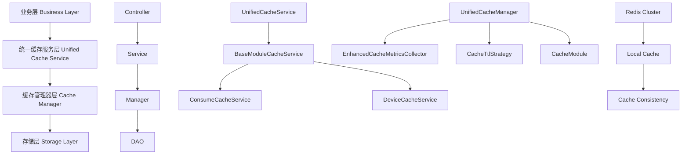

# Design Document

## Overview

本设计文档详细描述了IOE-DREAM项目缓存架构统一化的技术实现方案。基于repowiki缓存架构规范，我们将重构当前混乱的缓存实现，建立标准化的三层缓存架构，解决392个编译错误，实现企业级缓存治理体系。

该设计将重点关注编译错误修复、组件完整性实现、和架构规范化三个方面，确保项目能够正常构建并支持未来的扩展需求。

## Steering Document Alignment

### Technical Standards (tech.md)
本设计严格遵循repowiki开发规范体系中的技术标准：
- **缓存架构规范**: 完全遵循三层缓存架构设计模式
- **Java编码规范**: 使用现代Java 17+特性，遵循Spring Boot 3.x最佳实践
- **系统安全规范**: 实现缓存安全防护，包括权限控制和数据加密
- **代码质量标准**: 确保代码的可维护性和扩展性

### Project Structure (structure.md)
实现将遵循IOE-DREAM项目的模块化组织结构：
- **sa-base模块**: 核心缓存基础设施（UnifiedCacheManager、BusinessDataType等）
- **sa-admin模块**: 业务层缓存服务（基于BaseModuleCacheService）
- **sa-support模块**: 缓存监控和指标收集组件

## Code Reuse Analysis

### Existing Components to Leverage
- **UnifiedCacheService**: 已存在的统一缓存服务，需要重构和完善接口实现
- **EnhancedCacheMetricsCollector**: 已存在的增强版指标收集器，需要修复方法签名问题
- **BaseModuleCacheService**: 已存在的模块缓存服务模板，需要完善功能实现
- **CacheMetricsCollector**: 已存在的缓存指标收集器，需要修复访问权限问题

### Integration Points
- **Spring Boot 3.x框架**: 集成Spring Boot的依赖注入和配置管理
- **Redis缓存**: 底层存储层，支持集群和本地缓存
- **MyBatis-Plus**: 数据访问层，提供数据库操作支持
- **Sa-Token**: 安全框架，集成缓存权限控制

## Architecture

### 三层缓存架构设计



### Modular Design Principles
- **Single File Responsibility**: 每个缓存组件负责明确的单一职责
- **Component Isolation**: 创建小型、专注的缓存组件，避免大型单体文件
- **Service Layer Separation**: 分离缓存抽象层、业务逻辑层和监控层
- **Utility Modularity**: 将缓存工具分解为专注的单一目的模块

## Components and Interfaces

### Component 1: UnifiedCacheManager（核心缓存管理器）
- **Purpose:** 提供统一的底层缓存操作接口，管理Redis和本地缓存
- **Interfaces:**
  ```java
  CacheResult<T> get(CacheNamespace namespace, String key, Class<T> clazz)
  CacheResult<T> put(CacheNamespace namespace, String key, T value, BusinessDataType dataType)
  boolean evict(CacheNamespace namespace, String key)
  ```
- **Dependencies:** Redis连接池、序列化工具、缓存配置
- **Reuses:** 现有的Redis配置和连接管理

### Component 2: UnifiedCacheService（统一缓存服务）
- **Purpose:** 业务层统一缓存抽象，提供高级缓存操作
- **Interfaces:**
  ```java
  <T> T getOrSet(CacheModule module, String namespace, String key, Supplier<T> loader, Class<T> clazz, BusinessDataType dataType)
  <T> CompletableFuture<T> getOrSetAsync(CacheModule module, String namespace, String key, Supplier<T> loader, Class<T> clazz, BusinessDataType dataType)
  void mSet(CacheModule module, String namespace, Map<String, T> keyValues, BusinessDataType dataType)
  ```
- **Dependencies:** UnifiedCacheManager、异常处理、监控指标
- **Reuses:** 统一的缓存键命名规范和TTL策略

### Component 3: EnhancedCacheMetricsCollector（增强指标收集器）
- **Purpose:** 三维缓存监控体系，提供实时监控和告警
- **Interfaces:**
  ```java
  Map<String, Object> getModuleStatistics(CacheModule module)
  Map<String, Object> getDataTypeStatistics()
  Map<String, Object> getHealthAssessment()
  ```
- **Dependencies:** CacheMetricsCollector、监控告警、性能分析
- **Reuses:** 现有的指标收集基础设施

### Component 4: BusinessDataType（业务数据类型）
- **Purpose:** 基于业务特性驱动TTL策略的数据类型枚举
- **Implementation:**
  ```java
  public enum BusinessDataType {
      REALTIME(CacheTtlStrategy.REALTIME, "实时数据", UpdateFrequency.HIGH, BusinessCriticality.HIGH, ConsistencyRequirement.STRICT),
      NORMAL(CacheTtlStrategy.NORMAL, "普通数据", UpdateFrequency.MEDIUM, BusinessCriticality.MEDIUM, ConsistencyRequirement.NORMAL),
      STABLE(CacheTtlStrategy.STABLE, "稳定数据", UpdateFrequency.LOW, BusinessCriticality.LOW, ConsistencyRequirement.LOOSE)
  }
  ```
- **Dependencies:** CacheTtlStrategy、业务特性评估
- **Reuses:** 现有的TTL策略配置

## Data Models

### Model 1: CacheResult（缓存结果）
```java
public class CacheResult<T> {
    private final boolean success;
    private final T data;
    private final String errorMessage;
    private final CacheMetadata metadata;

    // 构造函数和getter方法
}
```

### Model 2: CacheNamespace（缓存命名空间）
```java
public enum CacheNamespace {
    USER("user"),
    DEVICE("device"),
    SYSTEM("system"),
    BUSINESS("business"),
    TEMP("temp")

    private final String prefix;
}
```

### Model 3: CacheModule（缓存模块）
```java
public enum CacheModule {
    CONSUME("consume", 1),
    ACCESS("access", 1),
    DEVICE("device", 1),
    SYSTEM("system", 2),
    VIDEO("video", 3),
    TEMP("temp", 4)

    private final String name;
    private final int priority;
}
```

## Error Handling

### Error Scenarios
1. **编译错误（void无法转换为boolean）**:
   - **Handling:** 重构UnifiedCacheManager方法签名，返回boolean/int类型
   - **User Impact:** 开发者获得正确的返回值类型，避免编译错误

2. **缺失类定义（UserErrorCode等）**:
   - **Handling:** 创建完整的错误码类定义体系
   - **User Impact:** 系统提供完整的错误处理和用户友好的错误信息

3. **Entity定义不完整（缺失getter/setter）**:
   - **Handling:** 修复Lombok注解问题，补全Entity字段定义
   - **User Impact:** 数据对象功能完整，支持完整的CRUD操作

4. **重复定义冲突**:
   - **Handling:** 清理sa-admin和sa-base模块间的重复定义
   - **User Impact:** 项目结构清晰，避免构建冲突

## Testing Strategy

### Unit Testing
- **组件级测试**: 对每个缓存组件进行单元测试，覆盖率≥90%
- **接口契约测试**: 验证缓存接口的契约行为
- **边界条件测试**: 测试缓存操作的边界条件
- **性能基准测试**: 验证缓存操作的性能指标

### Integration Testing
- **跨模块集成**: 测试缓存模块间的集成效果
- **数据库集成**: 测试缓存与数据库的一致性
- **Redis集成**: 测试与Redis集群的集成稳定性
- **Spring Boot集成**: 测试与Spring Boot框架的完整集成

### End-to-End Testing
- **业务场景测试**: 模拟真实业务场景的缓存使用
- **并发压力测试**: 验证高并发场景下的缓存表现
- **故障恢复测试**: 测试缓存故障时的系统降级能力
- **监控告警测试**: 验证监控告警系统的准确性和及时性