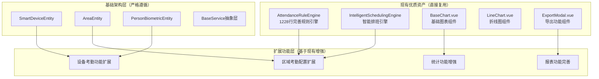

# 设计文档：基于消费模块模式的考勤系统完善

**创建日期**: 2025-11-25
**最后更新**: 2025-11-25
**状态**: 待审批
**版本**: 1.0

## 设计概述

### 核心设计原则

**🎯 基于现有的增强和完善，而不是从零创建**：

经过深入的现有代码分析，发现项目已具备非常完善的基础架构：

- ✅ **现有规则引擎**: 发现完善的 `AttendanceRuleEngine` (1228行代码)，支持位置验证、设备验证、智能排班
- ✅ **图表组件体系**: 现有 `BaseChart.vue`、`LineChart.vue`、`BarChart.vue`、`HeatmapChart.vue` 等完整组件
- ✅ **导出功能组件**: 现有 `ExportModal.vue` 支持多格式导出
- ✅ **智能排班引擎**: 已集成 `IntelligentSchedulingEngine`
- ✅ **测试体系**: 完整的测试文件和验证机制

### 设计策略调整

基于现有资产分析，调整设计策略为：

1. **优先复用现有规则引擎** - `AttendanceRuleEngine` 已支持所需功能
2. **充分利用现有图表组件** - 避免重复开发，直接复用
3. **集成现有导出功能** - 使用已有的 `ExportModal` 组件
4. **扩展现有智能排班** - 基于 `IntelligentSchedulingEngine` 增强功能

## 系统架构设计

### 整体架构图



### 核心设计决策

#### 1. 规则引擎复用策略

**发现**: 现有 `AttendanceRuleEngine` 已实现1228行完善功能：

```java
// 现有功能清单（无需重新开发）
✅ validateLocation() - 位置验证
✅ validateDevice() - 设备验证
✅ calculateAttendanceStatus() - 考勤状态计算
✅ calculateWorkHours() - 工作时长计算
✅ calculateOvertimeHours() - 加班时长计算
✅ isWorkingDay() - 工作日检查
✅ isHoliday() - 节假日检查
✅ processAttendanceRecordEnhanced() - 区域集成处理
✅ validateIntelligentSchedule() - 智能排班验证
```

**设计决策**: 直接复用现有规则引擎，仅做功能扩展，不重复开发。

#### 2. 前端组件复用策略

**发现**: 现有完整的图表组件体系：

```javascript
// 现有组件（直接复用）
✅ BaseChart.vue - 通用基础图表组件
✅ LineChart.vue - 折线图组件（支持面积图）
✅ BarChart.vue - 柱状图组件
✅ HeatmapChart.vue - 热力图组件
✅ ExportModal.vue - 导出功能组件
```

**设计决策**: 替换自定义图表实现，直接使用现有组件。

## 详细设计

### 1. 考勤区域配置扩展设计

#### 1.1 扩展表设计

基于现有 `AreaEntity`，通过扩展表实现考勤特定功能：

```sql
-- 扩展表设计（严格遵循BaseEntity审计字段）
CREATE TABLE t_attendance_area_config (
    config_id BIGINT PRIMARY KEY AUTO_INCREMENT COMMENT '配置ID',
    area_id BIGINT NOT NULL COMMENT '区域ID（关联t_area.area_id）',

    -- 考勤要求配置
    punch_in_required TINYINT DEFAULT 1 COMMENT '上班打卡要求',
    punch_out_required TINYINT DEFAULT 1 COMMENT '下班打卡要求',

    -- 验证方式配置（复用现有设备管理功能）
    gps_validation_enabled TINYINT DEFAULT 0 COMMENT 'GPS验证开关',
    photo_required TINYINT DEFAULT 0 COMMENT '拍照验证开关',
    geofence_enabled TINYINT DEFAULT 0 COMMENT '电子围栏开关',
    geofence_radius INT DEFAULT 100 COMMENT '围栏半径（米）',

    -- 业务配置（JSON格式，支持灵活扩展）
    attendance_point_ids TEXT COMMENT '考勤点ID列表（JSON格式）',
    work_time_config TEXT COMMENT '工作时间配置（JSON格式）',
    attendance_rule_ids TEXT COMMENT '考勤规则ID列表（JSON格式）',

    -- 基础审计字段（严格继承BaseEntity）
    create_time DATETIME DEFAULT CURRENT_TIMESTAMP COMMENT '创建时间',
    update_time DATETIME DEFAULT CURRENT_TIMESTAMP ON UPDATE CURRENT_TIMESTAMP COMMENT '更新时间',
    create_user_id BIGINT COMMENT '创建人ID',
    update_user_id BIGINT COMMENT '更新人ID',
    deleted_flag TINYINT DEFAULT 0 COMMENT '删除标记',
    version INT DEFAULT 1 COMMENT '版本号',

    FOREIGN KEY (area_id) REFERENCES t_area(area_id),
    INDEX idx_area_id (area_id),
    INDEX idx_deleted_flag (deleted_flag)
) ENGINE=InnoDB DEFAULT CHARSET=utf8mb4 COMMENT='考勤区域配置扩展表';
```

#### 1.2 区域配置服务设计

基于现有 `AreaService` 扩展考勤特定功能：

```java
@Service
@Transactional(rollbackFor = Exception.class)
public class AttendanceAreaConfigService extends BaseService<AttendanceAreaConfigEntity, Long> {

    @Resource
    private AttendanceAreaConfigDao attendanceAreaConfigDao;

    @Resource
    private AreaService areaService;  // 复用现有基础区域服务

    @Resource
    private AttendanceRuleEngine attendanceRuleEngine;  // 复用现有规则引擎

    /**
     * 获取区域考勤配置
     * 合并基础区域信息和考勤扩展配置
     */
    public AreaAttendanceConfigVO getAreaAttendanceConfig(Long areaId) {
        // 1. 获取基础区域信息（复用现有服务）
        AreaEntity area = areaService.getById(areaId);

        // 2. 获取考勤扩展配置
        AttendanceAreaConfigEntity config = this.getByAreaId(areaId);

        // 3. 合并返回
        return mergeAreaAndConfig(area, config);
    }

    /**
     * 验证区域考勤权限
     * 集成现有规则引擎进行验证
     */
    public AttendanceRuleEngine.AttendanceRuleProcessResult validateAreaAttendance(
            Long employeeId, Long areaId, AttendanceRecordEntity record) {

        // 直接使用现有规则引擎
        return attendanceRuleEngine.processAttendanceRecordEnhanced(record, areaId);
    }
}
```

### 2. 设备管理功能扩展设计

#### 2.1 设备扩展配置设计

基于现有 `SmartDeviceEntity` 的 `extensionConfig` 字段：

```java
/**
 * 考勤设备扩展配置
 * 存储在SmartDeviceEntity.extensionConfig字段中
 */
public class AttendanceDeviceExtension {

    // 打卡模式配置
    private List<String> punchModes;  // [FACE, FINGERPRINT, CARD, PASSWORD]

    // 验证功能配置
    private Boolean gpsEnabled;
    private Boolean photoEnabled;
    private Boolean faceRecognitionEnabled;
    private Boolean fingerprintEnabled;

    // 设备特定配置
    private Integer maxRecognitionDistance;  // 最大识别距离（厘米）
    private Integer recognitionTimeout;      // 识别超时时间（秒）
    private Boolean voicePromptEnabled;     // 语音提示开关

    // 网络配置
    private String networkMode;  // WIFI/LAN/4G
    private Map<String, Object> networkConfig;
}
```

#### 2.2 设备管理服务设计

```java
@Service
@Transactional(rollbackFor = Exception.class)
public class AttendanceDeviceManagerService {

    @Resource
    private SmartDeviceService smartDeviceService;  // 复用现有设备服务

    @Resource
    private PersonBiometricService personBiometricService;  // 复用生物特征服务

    /**
     * 注册考勤设备
     * 1. 注册基础SmartDeviceEntity
     * 2. 设置考勤扩展配置
     */
    public AttendanceDeviceRegisterResult registerAttendanceDevice(AttendanceDeviceRegisterRequest request) {
        // 1. 注册基础设备（复用现有服务）
        SmartDeviceEntity smartDevice = new SmartDeviceEntity();
        smartDevice.setDeviceCode(request.getDeviceCode());
        smartDevice.setDeviceName(request.getDeviceName());
        smartDevice.setDeviceType(SmartDeviceEntity.DeviceType.ATTENDANCE.getValue());
        smartDevice.setAreaId(request.getAreaId());

        // 2. 设置考勤设备扩展配置
        AttendanceDeviceExtension extension = new AttendanceDeviceExtension();
        extension.setPunchModes(request.getPunchModes());
        extension.setGpsEnabled(request.getGpsEnabled());
        extension.setPhotoEnabled(request.getPhotoEnabled());
        extension.setFaceRecognitionEnabled(request.getFaceRecognitionEnabled());

        // 3. 保存到extensionConfig字段
        smartDevice.setExtensionConfig(JsonUtils.toJsonString(extension));

        // 4. 注册基础设备（复用现有功能）
        SmartDeviceEntity registeredDevice = smartDeviceService.registerDevice(smartDevice);

        return AttendanceDeviceRegisterResult.success(registeredDevice);
    }

    /**
     * 验证员工生物特征打卡权限
     * 复用现有生物特征服务
     */
    public BiometricVerificationResult verifyEmployeeBiometric(Long employeeId, String biometricType) {
        // 直接复用现有生物特征服务
        PersonBiometricEntity personBiometric = personBiometricService.getByPersonId(employeeId);

        if (personBiometric == null || !personBiometric.hasBiometricType(biometricType)) {
            return BiometricVerificationResult.failed("员工未注册该类型生物特征");
        }

        // 查询有效的生物特征模板
        List<BiometricTemplateEntity> activeTemplates = personBiometricService.getActiveTemplates(
            employeeId, biometricType);

        if (CollectionUtils.isEmpty(activeTemplates)) {
            return BiometricVerificationResult.failed("没有可用的生物特征模板");
        }

        return BiometricVerificationResult.success(activeTemplates);
    }
}
```

### 3. 智能排班功能增强设计

#### 3.1 现有智能排班引擎分析

发现现有 `IntelligentSchedulingEngine` 已具备基础功能，基于现有引擎增强：

```java
/**
 * 智能排班服务增强版
 * 基于现有IntelligentSchedulingEngine扩展功能
 */
@Service
@Transactional(rollbackFor = Exception.class)
public class IntelligentSchedulingServiceEnhanced {

    @Resource
    private IntelligentSchedulingEngine intelligentSchedulingEngine;  // 现有引擎

    @Resource
    private AttendanceRuleEngine attendanceRuleEngine;  // 现有规则引擎

    @Resource
    private AttendanceScheduleService attendanceScheduleService;

    /**
     * 生成智能排班建议（增强版）
     * 基于现有引擎，增加考勤规则验证
     */
    public IntelligentScheduleResult generateIntelligentScheduleEnhanced(
            Long employeeId, LocalDate startDate, LocalDate endDate,
            SchedulingConstraints constraints) {

        try {
            // 1. 调用现有智能排班引擎生成基础建议
            var result = intelligentSchedulingEngine.generateIntelligentSchedule(
                employeeId, startDate, endDate, constraints);

            if (!result.getOk()) {
                return IntelligentScheduleResult.failure(result.getMessage());
            }

            List<SuggestedSchedule> suggestedSchedules = result.getData().getSuggestedSchedules();

            // 2. 使用现有规则引擎验证建议的合规性
            AttendanceRuleEngine.AttendanceRuleProcessResult validationResult =
                attendanceRuleEngine.validateIntelligentSchedule(employeeId, suggestedSchedules);

            if (!validationResult.isSuccess()) {
                return IntelligentScheduleResult.failure("排班建议不符合考勤规则：" + validationResult.getMessage());
            }

            // 3. 优化排班平衡性
            List<SuggestedSchedule> optimizedSchedules = optimizeScheduleBalance(suggestedSchedules);

            return IntelligentScheduleResult.success(optimizedSchedules);

        } catch (Exception e) {
            log.error("生成智能排班建议失败", e);
            return IntelligentScheduleResult.failure("生成智能排班建议失败：" + e.getMessage());
        }
    }

    /**
     * 优化现有排班规则
     * 集成现有规则引擎的优化功能
     */
    public OptimizationResult optimizeExistingScheduleRule(
            Long employeeId, LocalDate startDate, LocalDate endDate,
            OptimizationGoals goals) {

        // 直接使用现有规则引擎的优化功能
        return attendanceRuleEngine.optimizeExistingScheduleRule(employeeId, startDate, endDate, goals);
    }
}
```

### 4. 统计报表功能完善设计

#### 4.1 前端组件复用设计

基于现有组件体系，替换自定义实现：

```vue
<!-- 优化前：自定义ECharts实现 -->
<div class="chart-container" ref="trendChartRef"></div>

<!-- 优化后：使用现有组件 -->
<LineChart
  :data="trendChartData"
  :x-axis="trendXAxis"
  :title="趋势分析图"
  :show-area="trendChartType === 'area'"
  :loading="chartLoading"
  height="400px"
/>
```

#### 4.2 导出功能复用设计

```vue
<!-- 优化前：自定义报表生成组件 -->
<ReportGenerateModal
  v-model:visible="showReportGenerateModal"
  @success="onReportGenerateSuccess"
/>

<!-- 优化后：使用现有导出组件 -->
<ExportModal
  v-model:visible="showExportModal"
  export-type="ATTENDANCE"
  :query-params="queryForm"
  @confirm="handleExportConfirm"
/>
```

#### 4.3 API接口复用设计

```java
@RestController
@RequestMapping("/api/attendance/statistics")
public class AttendanceStatisticsController {

    @Resource
    private AttendanceStatisticsService attendanceStatisticsService;

    /**
     * 获取考勤趋势数据
     * 复用现有统计服务
     */
    @GetMapping("/trend")
    @SaCheckPermission("attendance:statistics:trend")
    public ResponseDTO<AttendanceTrendVO> getAttendanceTrend(AttendanceTrendQueryForm queryForm) {
        // 直接使用现有统计服务
        AttendanceTrendVO trendData = attendanceStatisticsService.getAttendanceTrend(queryForm);
        return ResponseDTO.ok(trendData);
    }

    /**
     * 导出考勤统计报表
     * 复用现有导出功能
     */
    @PostMapping("/export")
    @SaCheckPermission("attendance:statistics:export")
    public ResponseDTO<String> exportAttendanceStatistics(@RequestBody AttendanceExportQueryForm queryForm) {
        // 使用现有导出服务
        String exportFile = attendanceStatisticsService.exportStatistics(queryForm);
        return ResponseDTO.ok(exportFile);
    }
}
```

## 技术实现规范

### 1. 代码规范遵循

严格遵循现有技术栈和编码规范：

- ✅ **Java 17 + Spring Boot 3.x** - 保持技术栈一致性
- ✅ **jakarta包名** - 100%使用jakarta，禁用javax
- ✅ **@Resource依赖注入** - 100%使用@Resource，禁用@Autowired
- ✅ **四层架构** - 严格遵循Controller→Service→Manager→DAO
- ✅ **BaseEntity继承** - 所有实体类继承BaseEntity，不重复定义审计字段

### 2. 数据库设计规范

```sql
-- 扩展表设计规范
CREATE TABLE t_attendance_[business]_ext (
    ext_id BIGINT PRIMARY KEY AUTO_INCREMENT COMMENT '扩展ID',
    business_id BIGINT NOT NULL COMMENT '业务ID',

    -- 业务特定字段
    business_field VARCHAR(100) COMMENT '业务字段',

    -- 配置字段（JSON格式，支持灵活扩展）
    config_json TEXT COMMENT '配置信息（JSON格式）',

    -- 基础审计字段（严格继承BaseEntity，不可修改）
    create_time DATETIME DEFAULT CURRENT_TIMESTAMP COMMENT '创建时间',
    update_time DATETIME DEFAULT CURRENT_TIMESTAMP ON UPDATE CURRENT_TIMESTAMP COMMENT '更新时间',
    create_user_id BIGINT COMMENT '创建人ID',
    update_user_id BIGINT COMMENT '更新人ID',
    deleted_flag TINYINT DEFAULT 0 COMMENT '删除标记',
    version INT DEFAULT 1 COMMENT '版本号',

    FOREIGN KEY (business_id) REFERENCES t_business_table(business_id),
    INDEX idx_business_id (business_id),
    INDEX idx_deleted_flag (deleted_flag)
) ENGINE=InnoDB DEFAULT CHARSET=utf8mb4 COMMENT='业务扩展表';
```

### 3. 缓存架构设计

复用现有缓存管理机制：

```java
@Component
public class AttendanceCacheManager extends BaseCacheManager {

    // 缓存键命名规范
    private static final String AREA_CONFIG_KEY = "attendance:area:config:";
    private static final String DEVICE_EXTENSION_KEY = "attendance:device:extension:";
    private static final String RULE_CACHE_KEY = "attendance:rule:cache:";

    /**
     * 获取区域考勤配置缓存
     */
    public AttendanceAreaConfigEntity getAreaConfig(Long areaId) {
        String cacheKey = AREA_CONFIG_KEY + areaId;
        return getFromCache(cacheKey, () -> {
            return attendanceAreaConfigService.getByAreaId(areaId);
        });
    }
}
```

## 性能优化设计

### 1. 缓存策略

- **多级缓存**: Caffeine本地缓存 + Redis分布式缓存
- **缓存预热**: 系统启动时预加载热点数据
- **缓存更新**: 采用Cache-Aside模式，保证数据一致性

### 2. 数据库优化

- **索引优化**: 为扩展表创建合适的索引
- **查询优化**: 使用JOIN替代多次查询
- **分页查询**: 大数据量查询使用分页机制

### 3. 异步处理

- **规则验证**: 考勤规则验证采用异步处理
- **统计计算**: 复杂统计计算使用异步任务
- **通知发送**: 考勤异常通知异步发送

## 安全设计

### 1. 权限控制

```java
// 严格遵循现有权限控制体系
@PostMapping("/punch-in")
@SaCheckPermission("attendance:punch:in")  // 权限控制
public ResponseDTO<AttendancePunchResult> punchIn(@Valid @RequestBody AttendancePunchRequest request) {
    // 业务逻辑
}
```

### 2. 数据验证

```java
// 严格使用@Valid进行参数验证
public class AttendancePunchRequest {

    @NotNull(message = "员工ID不能为空")
    private Long employeeId;

    @Range(min = -90, max = 90, message = "纬度范围不正确")
    private Double latitude;

    @Range(min = -180, max = 180, message = "经度范围不正确")
    private Double longitude;
}
```

### 3. 操作日志

```java
// 集成现有操作日志系统
@OperationLog(operationType = OperationTypeEnum.ATTENDANCE_PUNCH, operationName = "考勤打卡")
public ResponseDTO<AttendancePunchResult> punchIn(@Valid @RequestBody AttendancePunchRequest request) {
    // 业务逻辑
}
```

## 测试设计

### 1. 单元测试

```java
@ExtendWith(MockitoExtension.class)
class AttendanceAreaConfigServiceTest {

    @Mock
    private AttendanceAreaConfigDao attendanceAreaConfigDao;

    @Mock
    private AreaService areaService;

    @InjectMocks
    private AttendanceAreaConfigService attendanceAreaConfigService;

    @Test
    void testGetAreaAttendanceConfig() {
        // 测试用例
    }
}
```

### 2. 集成测试

```java
@SpringBootTest
@Transactional
class AttendanceIntegrationTest {

    @Autowired
    private AttendanceDeviceManagerService deviceManagerService;

    @Test
    void testDeviceRegistrationFlow() {
        // 集成测试用例
    }
}
```

## 部署设计

### 1. 配置管理

```yaml
# 考勤模块配置
attendance:
  # 区域配置
  area:
    default-geofence-radius: 100
    gps-validation-enabled: false

  # 设备配置
  device:
    max-recognition-distance: 50
    recognition-timeout: 10

  # 规则配置
  rule:
    cache-enabled: true
    cache-ttl: 300
```

### 2. 监控配置

```java
// 集成现有监控体系
@Component
public class AttendanceHealthIndicator implements HealthIndicator {

    @Override
    public Health health() {
        // 健康检查逻辑
        return Health.up()
            .withDetail("ruleEngine", "OK")
            .withDetail("cacheManager", "OK")
            .build();
    }
}
```

## 风险控制

### 1. 技术风险

- **架构一致性**: 严格遵循现有架构，避免重复设计
- **性能影响**: 通过多级缓存保证性能
- **数据一致性**: 采用事务管理和数据同步机制

### 2. 业务风险

- **功能兼容**: 保持现有API接口不变
- **数据迁移**: 采用渐进式数据迁移策略
- **用户培训**: 基于现有用户体验，降低学习成本

## 实施计划

### Phase 1: 基础功能增强（3-5天）

1. **区域配置扩展** - 基于现有AreaService扩展考勤配置
2. **设备功能增强** - 基于现有SmartDeviceService扩展考勤功能
3. **规则引擎集成** - 集成现有AttendanceRuleEngine

### Phase 2: 高级功能实现（5-7天）

1. **智能排班增强** - 基于现有IntelligentSchedulingEngine增强
2. **统计报表完善** - 复用现有图表和导出组件
3. **异常管理集成** - 集成现有审批工作流程

### Phase 3: 系统集成优化（3-4天）

1. **性能优化** - 缓存机制和数据库优化
2. **系统集成测试** - 完整的功能和性能测试
3. **用户验收测试** - 基于现有用户体验的验收

---

**总结**: 本设计严格遵循"基于现有的增强和完善，而不是从零创建"的核心原则，充分利用现有完善的AttendanceRuleEngine、图表组件体系和智能排班引擎，通过最小化开发投入实现最大化功能增强。