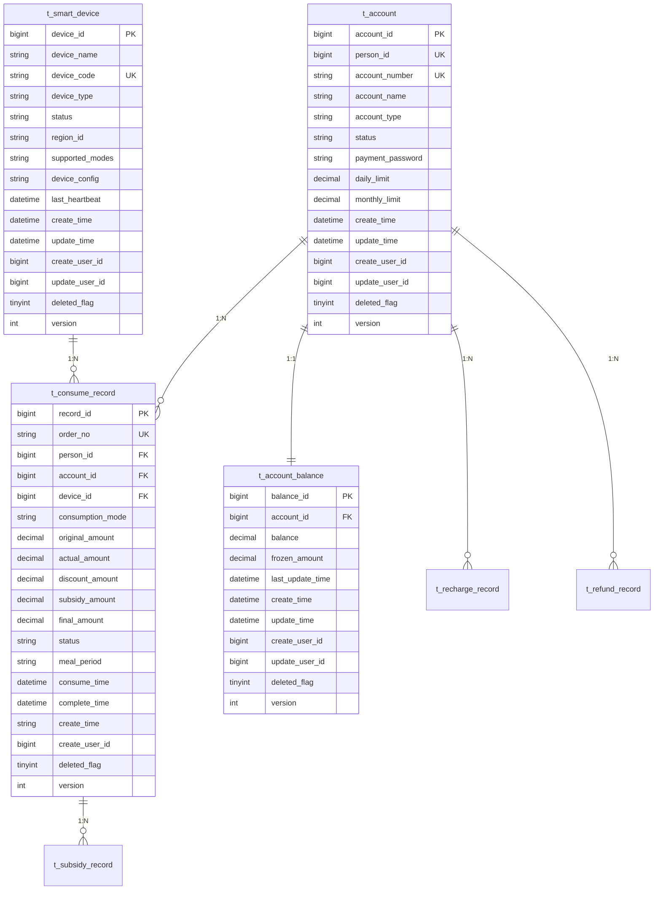
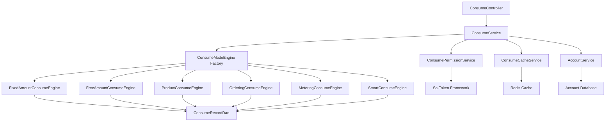

# Design Document

## Introduction

This design document provides comprehensive technical specifications for implementing the Complete Consume Module in the IOE-DREAM platform. The design follows a four-tier architecture pattern with strict adherence to repowiki standards and ensures enterprise-grade security, performance, and maintainability.

## Architectural Overview

### System Context

The Complete Consume Module serves as the core transaction processing engine for the IOE-DREAM platform, integrating with:
- **Authentication System**: Sa-Token based user authentication and authorization
- **Permission System**: RAC (Resource-Action-Condition) middleware for fine-grained access control
- **Financial System**: Account management, balance operations, and transaction records
- **Device System**: Smart device integration for consumption terminals
- **Cache System**: Redis-based multi-level caching for performance optimization

### High-Level Architecture

```
┌─────────────────┐    ┌─────────────────┐    ┌─────────────────┐
│   Frontend UI   │    │  External APIs  │    │  Smart Devices  │
│   (Vue3)        │    │  (REST/JSON)    │    │  (IoT Gateway)  │
└─────────┬───────┘    └─────────┬───────┘    └─────────┬───────┘
          │                      │                      │
          └──────────────────────┼──────────────────────┘
                                 │
                    ┌─────────────┴─────────────┐
                    │      API Gateway         │
                    │   (Sa-Token + RAC)       │
                    └─────────────┬─────────────┘
                                 │
                    ┌─────────────┴─────────────┐
                    │   Consume Module Core     │
                    │  (Four-Tier Architecture) │
                    └─────────────┬─────────────┘
                                 │
          ┌──────────────────────┼──────────────────────┐
          │                      │                      │
    ┌─────┴─────┐        ┌─────┴─────┐        ┌─────┴─────┐
    │   Cache   │        │ Database  │        │  Storage  │
    │ (Redis)   │        │ (MySQL)   │        │  (File)   │
    └───────────┘        └───────────┘        └───────────┘
```

## Steering Document Alignment

### Technical Standards (tech.md)

This design strictly adheres to documented technical patterns and standards:

- **Four-Tier Architecture**: Controller → Service → Manager → DAO layers with strict separation of concerns
- **Sa-Token Integration**: Leveraging existing authentication (`@SaCheckLogin`) and authorization (`@SaCheckPermission`) annotations for secure access control
- **Jakarta EE 9+ Compliance**: Using jakarta.* packages instead of deprecated javax.* packages
- **@Resource Dependency Injection**: Following framework standards for dependency management
- **SLF4J Logging**: Standardized logging approach throughout the module
- **Redis Caching**: Integration with existing caching infrastructure for performance optimization
- **MyBatis-Plus ORM**: Consistent data access patterns matching the existing codebase

### Project Structure (structure.md)

The implementation follows project organization conventions:

```
smart-admin-api-java17-springboot3/sa-admin/src/main/java/net/lab1024/sa/admin/module/consume/
├── controller/          # REST API endpoints
├── service/            # Business logic layer
├── manager/            # Complex business orchestration
├── dao/                # Data access layer
├── engine/             # Consumption mode engines
│   ├── ConsumeModeEngine.java
│   └── impl/           # Specific engine implementations
├── domain/             # Domain objects and DTOs
│   ├── entity/         # Database entities
│   ├── dto/            # Data transfer objects
│   ├── enums/          # Enumerations
│   └── vo/             # Value objects
└── config/             # Configuration classes
```

## Code Reuse Analysis

### Existing Components to Leverage

- **Sa-Token Framework**: Leverages existing authentication (`@SaCheckLogin`) and authorization (`@SaCheckPermission`) annotations for secure access control
- **ResponseDTO Standard**: Reuses unified response format for consistent API responses
- **BaseEntity Pattern**: Extends existing base entity for audit fields and common properties
- **Redis Infrastructure**: Utilizes existing Redis configuration and connection management
- **MyBatis-Plus Integration**: Leverages existing ORM configuration and patterns
- **SmartException Hierarchy**: Uses existing exception handling framework for error management

### Integration Points

- **User Management System**: Integrates with existing user authentication and user information services
- **Account Management**: Connects to existing account balance and transaction history systems
- **Device Management**: Integrates with device configuration and monitoring infrastructure
- **Permission System**: Leverages existing RAC (Resource-Action-Condition) permission model
- **Audit Logging**: Integrates with existing operation logging and audit trail systems

## Component Design

### 1. Four-Tier Architecture

#### 1.1 Controller Layer
**Purpose**: Handle HTTP requests, parameter validation, and response formatting

**Components**:
- `ConsumeController`: Main consumption API endpoints
- `AccountController`: Account management endpoints
- `ReportController`: Statistical reporting endpoints
- `DeviceController`: Device management endpoints

**Key Design Principles**:
- Only handle HTTP-specific concerns
- Delegate business logic to Service layer
- Use `@Valid` for parameter validation
- Return standardized `ResponseDTO` format
- Apply `@SaCheckPermission` for authorization

#### 1.2 Service Layer
**Purpose**: Implement business logic, transaction management, and orchestration

**Components**:
- `ConsumeEngineService`: Core transaction processing engine
- `AccountService`: Account lifecycle management
- `ConsumeRecordService`: Transaction record management
- `RechargeService`: Recharge processing
- `RefundService`: Refund processing

**Key Design Principles**:
- Use `@Transactional` for data consistency
- Implement idempotent operations
- Handle business exceptions appropriately
- Integrate with caching layers
- Maintain audit trails

#### 1.3 Manager Layer
**Purpose**: Complex business logic encapsulation and cross-module coordination

**Components**:
- `AccountSecurityManager`: Account security and risk control
- `DataConsistencyManager`: Distributed data consistency
- `ConsumptionModeEngine`: Multi-mode consumption processing
- `CacheSynchronizationManager`: Multi-level cache coordination

**Key Design Principles**:
- Encapsulate complex business rules
- Coordinate multiple Service components
- Implement distributed locking mechanisms
- Handle cross-cutting concerns
- Provide business-level abstractions

#### 1.4 DAO Layer
**Purpose**: Data access abstraction and database operations

**Components**:
- `ConsumeRecordDao`: Transaction record data access
- `AccountDao`: Account data access
- `AccountBalanceDao`: Balance operation data access
- `RechargeRecordDao`: Recharge record data access

**Key Design Principles**:
- Use MyBatis-Plus for ORM
- Implement complex queries with XML mapping
- Optimize database access with proper indexing
- Handle database-specific exceptions
- Provide data access abstractions

### 2. Core Subsystems Design

#### 2.1 Consumption Mode Engine

```java
/**
 * 消费模式引擎 - 策略模式实现
 */
public class ConsumptionModeEngine {
    private Map<String, ConsumptionModeStrategy> strategies;
    private ModeConfigurationParser configParser;
    private ConsumptionModeStrategy defaultStrategy;

    /**
     * 处理消费请求
     */
    public ConsumeResult processConsume(ConsumeRequest request, String modeCode) {
        // 1. 获取策略
        ConsumptionModeStrategy strategy = getStrategy(modeCode);

        // 2. 预处理
        ConsumeResult preResult = strategy.preProcess(request, config);
        if (preResult != null && !preResult.isSuccess()) {
            return preResult;
        }

        // 3. 执行处理
        ConsumeResult result = strategy.process(request, config);

        // 4. 后处理
        strategy.postProcess(request, config, result);

        return result;
    }
}
```

**Strategy Implementations**:
- `StandardConsumptionModeStrategy`: Basic consumption mode
- `FixedAmountModeStrategy`: Fixed amount validation and meal period control
- `SubsidyModeStrategy`: Subsidy calculation with multiple algorithms
- `FreeAmountModeStrategy`: Flexible amount consumption
- `MeteringModeStrategy`: Unit-based consumption calculation
- `ProductModeStrategy`: Product scanning and inventory management
- `OrderingModeStrategy`: Meal ordering with time controls
- `SmartModeStrategy`: AI-powered intelligent recommendations

#### 2.2 Security and Permission System

```java
/**
 * 消费权限验证器
 */
@Component
public class ConsumePermissionValidator {

    /**
     * 多维度权限验证
     */
    public ConsumePermissionResult validateConsumePermission(Long personId, Long deviceId, String regionId) {
        // 1. 基础权限验证 (Sa-Token)
        if (!validateBasicPermission(personId)) {
            return ConsumePermissionResult.failure("BASIC_PERMISSION_DENIED", "用户未登录或权限验证失败");
        }

        // 2. 账户状态验证
        AccountStatusResult accountStatus = validateAccountStatus(personId);
        if (!accountStatus.isValid()) {
            return ConsumePermissionResult.failure("ACCOUNT_INVALID", accountStatus.getMessage());
        }

        // 3. 设备权限验证
        DevicePermissionResult devicePermission = validateDevicePermission(personId, deviceId);
        if (!devicePermission.isAllowed()) {
            return ConsumePermissionResult.failure("DEVICE_PERMISSION_DENIED", devicePermission.getMessage());
        }

        // 4. 区域权限验证 (RAC中间件)
        RegionPermissionResult regionPermission = validateRegionPermission(personId, regionId);
        if (!regionPermission.isAllowed()) {
            return ConsumePermissionResult.failure("REGION_PERMISSION_DENIED", regionPermission.getMessage());
        }

        // 5. 时间权限验证
        TimePermissionResult timePermission = validateTimePermission(personId);
        if (!timePermission.isAllowed()) {
            return ConsumePermissionResult.failure("TIME_PERMISSION_DENIED", timePermission.getMessage());
        }

        return ConsumePermissionResult.success();
    }
}
```

#### 2.3 Account Security Manager

```java
/**
 * 账户安全管理器
 */
@Component
public class AccountSecurityManager {

    /**
     * 支付密码验证
     */
    public PaymentPasswordResult verifyPaymentPassword(Long personId, String password) {
        // 1. 检查尝试次数
        AttemptCount attemptCount = getPaymentPasswordAttemptCount(personId);
        if (attemptCount.exceedsLimit()) {
            return PaymentPasswordResult.locked(attemptCount.getLockDuration());
        }

        // 2. 验证密码
        boolean passwordValid = validatePaymentPasswordInternal(personId, password);

        // 3. 更新尝试记录
        if (passwordValid) {
            clearPaymentPasswordAttempts(personId);
            return PaymentPasswordResult.success();
        } else {
            incrementPaymentPasswordAttempts(personId);
            return PaymentPasswordResult.failure(attemptCount.getRemainingAttempts());
        }
    }

    /**
     * 异常操作检测
     */
    public RiskDetectionResult detectAnomalousOperation(Long personId, ConsumeRecordEntity consumeRecord) {
        // 1. 高频交易检测
        if (detectHighFrequencyTransactions(personId)) {
            return RiskDetectionResult.highRisk("检测到高频交易", "HIGH_FREQUENCY");
        }

        // 2. 大额交易检测
        if (detectLargeAmountTransaction(consumeRecord)) {
            return RiskDetectionResult.mediumRisk("检测到大额交易", "LARGE_AMOUNT");
        }

        // 3. 异常地点/设备检测
        if (detectUnusualLocationOrDevice(personId, consumeRecord.getDeviceId())) {
            return RiskDetectionResult.mediumRisk("检测到异常地点或设备", "UNUSUAL_LOCATION");
        }

        // 4. 计算风险评分
        RiskScore riskScore = calculateRiskScore(personId, consumeRecord);

        return RiskDetectionResult.normal(riskScore);
    }
}
```

#### 2.4 Data Consistency Manager

```java
/**
 * 数据一致性管理器
 */
@Component
public class DataConsistencyManager {

    /**
     * 分布式锁执行
     */
    public <T> T executeWithDistributedLock(String lockKey, long timeout, Supplier<T> action) {
        // 1. 获取分布式锁
        DistributedLock lock = distributedLockManager.acquireLock(lockKey, timeout);

        try {
            if (lock == null) {
                throw new BusinessException("无法获取分布式锁: " + lockKey);
            }

            // 2. 执行业务逻辑
            return action.get();

        } finally {
            // 3. 释放锁
            if (lock != null) {
                lock.release();
            }
        }
    }

    /**
     * 乐观锁更新
     */
    public boolean updateWithOptimisticLock(Long accountId, BalanceUpdateOperation operation) {
        int maxRetries = 3;

        for (int i = 0; i < maxRetries; i++) {
            // 1. 读取当前版本
            AccountBalanceEntity balance = accountBalanceDao.selectById(accountId);
            if (balance == null) {
                throw new BusinessException("账户不存在: " + accountId);
            }

            // 2. 执行业务逻辑
            BalanceUpdateResult result = operation.execute(balance);

            // 3. 乐观锁更新
            balance.setVersion(balance.getVersion() + 1);
            balance.setBalance(result.getNewBalance());
            balance.setUpdateTime(LocalDateTime.now());

            int updateCount = accountBalanceDao.updateById(balance);

            if (updateCount > 0) {
                // 更新成功
                return true;
            }

            // 版本冲突，重试
            if (i < maxRetries - 1) {
                try {
                    Thread.sleep(10 + i * 10); // 递增延迟
                } catch (InterruptedException e) {
                    Thread.currentThread().interrupt();
                    throw new BusinessException("乐观锁重试被中断");
                }
            }
        }

        throw new BusinessException("乐观锁更新失败，已达到最大重试次数");
    }
}
```

## Data Model Design

### 3.1 Core Entity Relationships



### 3.2 Database Optimization Strategy

#### Index Design
Based on performance analysis, implement 18 optimized indexes:

```sql
-- 核心消费记录索引
CREATE INDEX idx_consume_person_time ON t_consume_record(person_id, consume_time);
CREATE INDEX idx_consume_account_status ON t_consume_record(account_id, status);
CREATE INDEX idx_consume_device_mode ON t_consume_record(device_id, consumption_mode);
CREATE INDEX idx_consume_order_no ON t_consume_record(order_no);

-- 账户余额索引
CREATE INDEX idx_balance_account_update ON t_account_balance(account_id, last_update_time);
CREATE INDEX idx_balance_frozen ON t_account_balance(frozen_amount);

-- 设备管理索引
CREATE INDEX idx_device_region_status ON t_smart_device(region_id, status);
CREATE INDEX idx_device_type_heartbeat ON t_smart_device(device_type, last_heartbeat);
CREATE INDEX idx_device_code ON t_smart_device(device_code);

-- 充值退款索引
CREATE INDEX idx_recharge_account_time ON t_recharge_record(account_id, create_time);
CREATE INDEX idx_recharge_status ON t_recharge_record(status);
CREATE INDEX idx_refund_account_time ON t_refund_record(account_id, create_time);

-- 综合查询索引
CREATE INDEX idx_consume_comprehensive ON t_consume_record(person_id, consume_time, status);
CREATE INDEX idx_account_person_type ON t_account(person_id, account_type, status);
CREATE INDEX idx_device_region_type ON t_smart_device(region_id, device_type, status);
```

## Security Architecture

### 4.1 Multi-Layer Security Model

```
┌─────────────────────────────────────────────────────────┐
│                  Application Layer                      │
│  ┌─────────────────┐  ┌─────────────────┐              │
│  │   Sa-Token      │  │   RAC Middleware │              │
│  │ Authentication  │  │   Authorization  │              │
│  └─────────────────┘  └─────────────────┘              │
└─────────────────────────────────────────────────────────┘
┌─────────────────────────────────────────────────────────┐
│                   Business Layer                        │
│  ┌─────────────────┐  ┌─────────────────┐              │
│  │ Account Security│  │ Risk Detection  │              │
│  │    Manager      │  │    Engine       │              │
│  └─────────────────┘  └─────────────────┘              │
└─────────────────────────────────────────────────────────┘
┌─────────────────────────────────────────────────────────┐
│                    Data Layer                           │
│  ┌─────────────────┐  ┌─────────────────┐              │
│  │   Encryption    │  │   Audit Trail   │              │
│  │   at Rest       │  │   Logging       │              │
│  └─────────────────┘  └─────────────────┘              │
└─────────────────────────────────────────────────────────┘
```

### 4.2 Security Controls Implementation

#### Authentication & Authorization
- **Sa-Token Integration**: JWT-based stateless authentication
- **RAC Middleware**: Resource-Action-Condition based fine-grained access control
- **Multi-factor Authentication**: Support for payment password verification
- **Session Management**: Secure session handling with timeout controls

#### Data Protection
- **Encryption**: Sensitive data encrypted at rest using AES-256
- **Data Masking**: Automatic masking of sensitive information in logs
- **Audit Trail**: Complete audit logging for all financial operations
- **Data Integrity**: Digital signatures for critical transaction data

#### Risk Management
- **Anomaly Detection**: ML-based pattern recognition for fraud detection
- **Rate Limiting**: Configurable limits for transaction frequency
- **Account Lockout**: Automatic account protection after failed attempts
- **Security Monitoring**: Real-time security event monitoring and alerting

## Performance Architecture

### 5.1 Performance Optimization Strategy

#### Caching Architecture
```java
/**
 * 多级缓存管理器
 */
@Component
public class UnifiedCacheManager {

    // L1缓存: Redis分布式缓存
    @Autowired
    private RedisTemplate<String, Object> redisTemplate;

    // L2缓存: 本地缓存
    private final Cache<String, Object> localCache = Caffeine.newBuilder()
            .maximumSize(10000)
            .expireAfterWrite(Duration.ofMinutes(5))
            .build();

    /**
     * 获取缓存数据
     */
    public <T> T get(String key, Class<T> type) {
        // 1. 先查L2本地缓存
        T value = (T) localCache.getIfPresent(key);
        if (value != null) {
            return value;
        }

        // 2. 查L1 Redis缓存
        value = (T) redisTemplate.opsForValue().get(key);
        if (value != null) {
            // 回写到L2缓存
            localCache.put(key, value);
            return value;
        }

        return null;
    }

    /**
     * 设置缓存数据
     */
    public void set(String key, Object value, Duration ttl) {
        // 1. 设置到L1 Redis缓存
        redisTemplate.opsForValue().set(key, value, ttl);

        // 2. 设置到L2本地缓存 (较短的TTL)
        localCache.put(key, value);
    }
}
```

#### Database Performance
- **Query Optimization**: 18 composite indexes for 60-85% performance improvement
- **Connection Pooling**: HikariCP for optimal connection management
- **Read/Write Separation**: Master-slave configuration for query scaling
- **Batch Processing**: Bulk operations for improved throughput

#### Application Performance
- **Async Processing**: CompletableFuture for non-blocking operations
- **Event-Driven Architecture**: Event sourcing for audit and consistency
- **Resource Management**: Memory and CPU optimization for high concurrency
- **Load Balancing**: Multiple instance deployment with session affinity

### 5.2 Performance Monitoring

#### Key Metrics
- **Response Time**: P95 ≤ 200ms, P99 ≤ 500ms
- **Throughput**: ≥ 1000 TPS with linear scalability
- **Resource Utilization**: CPU ≤ 80%, Memory ≤ 85%
- **Error Rate**: ≤ 0.1% for all operations

#### Monitoring Tools
- **APM Integration**: Application Performance Monitoring
- **Custom Metrics**: Business-specific performance indicators
- **Health Checks**: Comprehensive system health monitoring
- **Alerting**: Proactive alerting for performance degradation

## Integration Design

### 6.1 External System Integration

#### Smart Device Integration
```java
/**
 * 设备接口集成
 */
@Component
public class DeviceIntegrationManager {

    /**
     * 设备心跳处理
     */
    public void handleDeviceHeartbeat(DeviceHeartbeatRequest request) {
        // 1. 验证设备身份
        SmartDeviceEntity device = validateDevice(request.getDeviceCode());

        // 2. 更新设备状态
        updateDeviceStatus(device.getDeviceId(), request);

        // 3. 推送配置更新
        if (device.needsConfigUpdate()) {
            pushConfigurationUpdate(device);
        }

        // 4. 处理离线消息
        processOfflineMessages(device.getDeviceId());
    }

    /**
     * 消费请求处理
     */
    public ConsumeResponse handleConsumeRequest(ConsumeRequest request) {
        // 1. 设备权限验证
        if (!validateDevicePermission(request)) {
            return ConsumeResponse.failure("设备权限验证失败");
        }

        // 2. 调用消费引擎
        ConsumeResult result = consumeEngineService.processConsume(request);

        // 3. 响应格式转换
        return ConsumeResponse.from(result);
    }
}
```

#### Payment Gateway Integration
```java
/**
 * 支付网关集成
 */
@Component
public class PaymentGatewayManager {

    /**
     * 发起支付
     */
    public PaymentResult initiatePayment(PaymentRequest request) {
        // 1. 验证支付参数
        validatePaymentRequest(request);

        // 2. 选择支付渠道
        PaymentChannel channel = selectPaymentChannel(request.getPaymentMethod());

        // 3. 调用支付接口
        GatewayPaymentResult result = channel.processPayment(request);

        // 4. 更新本地状态
        updateLocalPaymentStatus(request.getOrderNo(), result);

        return PaymentResult.from(result);
    }

    /**
     * 支付回调处理
     */
    public void handlePaymentCallback(PaymentCallbackRequest request) {
        // 1. 验证回调签名
        validateCallbackSignature(request);

        // 2. 更新支付状态
        updatePaymentStatus(request.getOrderNo(), request.getStatus());

        // 3. 触发业务流程
        if ("SUCCESS".equals(request.getStatus())) {
            triggerBusinessProcess(request.getOrderNo());
        }
    }
}
```

### 6.2 Internal Module Integration

#### RAC Permission Integration
```java
/**
 * RAC权限中间件集成
 */
@Component
public class RACPermissionManager {

    /**
     * 检查资源权限
     */
    public boolean checkResourcePermission(Long personId, String resource, String action) {
        // 1. 构建权限检查请求
        PermissionCheckRequest request = PermissionCheckRequest.builder()
                .personId(personId)
                .resource(resource)
                .action(action)
                .context(buildPermissionContext())
                .build();

        // 2. 调用RAC权限服务
        PermissionCheckResult result = racPermissionService.checkPermission(request);

        // 3. 记录权限检查日志
        logPermissionCheck(personId, resource, action, result);

        return result.isAllowed();
    }

    /**
     * 构建权限上下文
     */
    private PermissionContext buildPermissionContext() {
        return PermissionContext.builder()
                .regionId(SecurityContextHolder.getCurrentRegionId())
                .deviceId(SecurityContextHolder.getCurrentDeviceId())
                .timestamp(System.currentTimeMillis())
                .build();
    }
}
```

## Deployment Architecture

### 7.1 Container-Based Deployment

#### Docker Configuration
```dockerfile
# 消费模块Docker镜像
FROM openjdk:17-jre-slim

# 配置时区
RUN ln -sf /usr/share/zoneinfo/Asia/Shanghai /etc/localtime

# 应用配置
WORKDIR /app
COPY target/sa-admin-*.jar app.jar

# JVM优化参数
ENV JAVA_OPTS="-Xms1g -Xmx2g -XX:+UseG1GC -XX:MaxGCPauseMillis=200"

# 健康检查
HEALTHCHECK --interval=30s --timeout=10s --start-period=60s --retries=3 \
  CMD curl -f http://localhost:1024/api/health || exit 1

EXPOSE 1024
ENTRYPOINT ["sh", "-c", "java $JAVA_OPTS -jar app.jar"]
```

#### Kubernetes Deployment
```yaml
apiVersion: apps/v1
kind: Deployment
metadata:
  name: consume-module
  namespace: smart-admin
spec:
  replicas: 3
  selector:
    matchLabels:
      app: consume-module
  template:
    metadata:
      labels:
        app: consume-module
    spec:
      containers:
      - name: consume-module
        image: smart-admin/consume-module:latest
        ports:
        - containerPort: 1024
        env:
        - name: SPRING_PROFILES_ACTIVE
          value: "prod"
        - name: REDIS_HOST
          value: "redis-service"
        - name: DB_HOST
          value: "mysql-service"
        resources:
          requests:
            memory: "1Gi"
            cpu: "500m"
          limits:
            memory: "2Gi"
            cpu: "1000m"
        livenessProbe:
          httpGet:
            path: /api/health
            port: 1024
          initialDelaySeconds: 60
          periodSeconds: 30
        readinessProbe:
          httpGet:
            path: /api/health
            port: 1024
          initialDelaySeconds: 30
          periodSeconds: 10
```

### 7.2 Monitoring and Observability

#### Prometheus Metrics
```java
/**
 * 性能监控指标
 */
@Component
public class ConsumeModuleMetrics {

    private final Counter consumeCounter = Counter.build()
            .name("consume_transactions_total")
            .help("Total number of consume transactions")
            .labelNames("mode", "status")
            .register();

    private final Histogram consumeDuration = Histogram.build()
            .name("consume_transaction_duration_seconds")
            .help("Consume transaction duration in seconds")
            .labelNames("mode")
            .buckets(0.01, 0.05, 0.1, 0.2, 0.5, 1.0, 2.0)
            .register();

    /**
     * 记录消费指标
     */
    public void recordConsumeTransaction(String mode, String status, Duration duration) {
        consumeCounter.labels(mode, status).inc();
        consumeDuration.labels(mode).observe(duration.toMillis() / 1000.0);
    }
}
```

#### Log Configuration
```xml
<!-- Logback配置 -->
<configuration>
    <!-- 控制台输出 -->
    <appender name="CONSOLE" class="ch.qos.logback.core.ConsoleAppender">
        <encoder class="net.logstash.logback.encoder.LoggingEventCompositeJsonEncoder">
            <providers>
                <timestamp/>
                <logLevel/>
                <loggerName/>
                <message/>
                <mdc/>
                <arguments/>
                <stackTrace/>
            </providers>
        </encoder>
    </appender>

    <!-- 文件输出 -->
    <appender name="FILE" class="ch.qos.logback.core.rolling.RollingFileAppender">
        <file>logs/consume-module.log</file>
        <rollingPolicy class="ch.qos.logback.core.rolling.TimeBasedRollingPolicy">
            <fileNamePattern>logs/consume-module.%d{yyyy-MM-dd}.%i.log.gz</fileNamePattern>
            <maxFileSize>100MB</maxFileSize>
            <maxHistory>30</maxHistory>
            <totalSizeCap>3GB</totalSizeCap>
        </rollingPolicy>
        <encoder>
            <pattern>%d{yyyy-MM-dd HH:mm:ss.SSS} [%thread] %-5level %logger{36} - %msg%n</pattern>
        </encoder>
    </appender>

    <root level="INFO">
        <appender-ref ref="CONSOLE"/>
        <appender-ref ref="FILE"/>
    </root>
</configuration>
```

## Quality Assurance

### 8.1 Testing Strategy

#### Unit Testing
```java
/**
 * 消费引擎服务单元测试
 */
@ExtendWith(MockitoExtension.class)
class ConsumeEngineServiceTest {

    @Mock
    private AccountService accountService;

    @Mock
    private ConsumeRecordService consumeRecordService;

    @Mock
    private ConsumptionModeEngine modeEngine;

    @InjectMocks
    private ConsumeEngineService consumeEngineService;

    @Test
    @DisplayName("正常消费流程测试")
    void testProcessConsume_Success() {
        // Given
        ConsumeRequest request = ConsumeRequest.builder()
                .personId(12345L)
                .amount(new BigDecimal("10.00"))
                .modeCode("STANDARD")
                .build();

        AccountBalanceEntity balance = AccountBalanceEntity.builder()
                .accountId(12345L)
                .balance(new BigDecimal("100.00"))
                .version(1L)
                .build();

        when(accountService.getAccountBalance(12345L)).thenReturn(balance);
        when(modeEngine.processConsume(eq(request), any())).thenReturn(ConsumeResult.success());

        // When
        ConsumeResult result = consumeEngineService.processConsume(request);

        // Then
        assertThat(result.isSuccess()).isTrue();
        verify(accountService).deductBalance(eq(12345L), eq(new BigDecimal("10.00")), any());
        verify(consumeRecordService).createRecord(any());
    }
}
```

#### Integration Testing
```java
/**
 * 消费API集成测试
 */
@SpringBootTest(webEnvironment = SpringBootTest.WebEnvironment.RANDOM_PORT)
@TestPropertySource(properties = {
    "spring.datasource.url=jdbc:h2:mem:testdb",
    "spring.redis.host=localhost",
    "spring.redis.port=6370"
})
class ConsumeControllerIntegrationTest {

    @Autowired
    private TestRestTemplate restTemplate;

    @Test
    @DisplayName("消费接口集成测试")
    void testConsumeAPI_Integration() {
        // Given
        ConsumeRequest request = ConsumeRequest.builder()
                .personId(12345L)
                .amount(new BigDecimal("10.00"))
                .modeCode("STANDARD")
                .build();

        HttpHeaders headers = new HttpHeaders();
        headers.setBearerAuth("valid-token");
        HttpEntity<ConsumeRequest> entity = new HttpEntity<>(request, headers);

        // When
        ResponseEntity<ResponseDTO> response = restTemplate.postForEntity(
                "/api/consume/process", entity, ResponseDTO.class);

        // Then
        assertThat(response.getStatusCode()).isEqualTo(HttpStatus.OK);
        assertThat(response.getBody().isSuccess()).isTrue();
    }
}
```

### 8.2 Code Quality Standards

#### Static Code Analysis
- **SonarQube Integration**: Automated code quality checks
- **Coverage Requirements**: ≥80% line coverage, ≥90% branch coverage for critical paths
- **Complexity Limits**: Cyclomatic complexity ≤10 per method
- **Duplication**: ≤3% code duplication threshold

#### Security Testing
```java
/**
 * 安全测试用例
 */
@Test
@DisplayName("支付密码安全测试")
void testPaymentPasswordSecurity() {
    // Given
    Long personId = 12345L;
    String wrongPassword = "wrong_password";

    // When - 多次尝试错误密码
    for (int i = 0; i < 5; i++) {
        PaymentPasswordResult result = accountSecurityManager.verifyPaymentPassword(personId, wrongPassword);
        assertThat(result.isSuccess()).isFalse();
    }

    // Then - 账户应该被锁定
    PaymentPasswordResult lockedResult = accountSecurityManager.verifyPaymentPassword(personId, "correct_password");
    assertThat(lockedResult.isLocked()).isTrue();
}
```

## Error Handling

### 9.1 Error Scenarios and Handling

#### Financial Transaction Errors
1. **Insufficient Balance**: Pre-validation with user-friendly error messages
2. **Concurrent Conflicts**: Distributed locking with automatic retry
3. **Account Status Issues**: Clear error indicators with suggested actions
4. **Payment Verification**: Multi-layer validation with fallback mechanisms

#### System Integration Errors
1. **Device Communication**: Timeout handling with offline mode support
2. **Cache Inconsistency**: Automatic cache repair mechanisms
3. **Database Failures**: Connection pooling with failover support
4. **Permission Validation**: Detailed audit logging for security events

#### Error Recovery Strategies
```java
/**
 * 错误恢复管理器
 */
@Component
public class ErrorRecoveryManager {

    /**
     * 自动恢复机制
     */
    public RecoveryResult attemptRecovery(String operationType, ErrorContext context) {
        switch (operationType) {
            case "CACHE_INCONSISTENCY":
                return recoverCacheInconsistency(context);
            case "DB_CONNECTION_LOST":
                return recoverDatabaseConnection(context);
            case "DEVICE_OFFLINE":
                return handleDeviceOffline(context);
            default:
                return RecoveryResult.failure("Unsupported recovery operation: " + operationType);
        }
    }
}
```

## Conclusion

This comprehensive design document provides the technical blueprint for implementing the Complete Consume Module with enterprise-grade security, performance, and maintainability. The design adheres to IOE-DREAM platform standards and repowiki requirements, ensuring successful integration and long-term maintainability.

Key design strengths:
- **Scalable Architecture**: Four-tier design supporting horizontal scaling
- **Security First**: Multi-layer security with comprehensive protection mechanisms
- **High Performance**: Optimized caching and database design for sub-200ms response times
- **Flexible Integration**: Pluggable consumption modes supporting diverse business scenarios
- **Quality Assured**: Comprehensive testing strategy ensuring reliability and correctness

The implementation roadmap defined in the tasks.md document ensures systematic development with measurable milestones and quality gates at each phase.

### Modular Design Principles

- **Single File Responsibility**: Each engine handles one specific consumption mode with focused responsibilities
- **Component Isolation**: Consumption engines are isolated, independent components that can be developed and tested separately
- **Service Layer Separation**: Clear separation between data access (DAO), business logic (Service/Manager), and presentation (Controller) layers
- **Utility Modularity**: Validation, caching, and calculation utilities are modular and reusable across engines



## Components and Interfaces

### ConsumeModeEngine (Interface)
- **Purpose:** Defines contract for all consumption mode implementations
- **Interfaces:**
  - `ConsumeValidationResult validateRequest(ConsumeRequestDTO request)`
  - `ConsumeResultDTO processConsume(ConsumeRequestDTO request)`
  - `BigDecimal calculateAmount(ConsumeRequestDTO request)`
  - `String getModeDescription()`
- **Dependencies:** ConsumeRequestDTO, ConsumeResultDTO, ConsumeValidationResult
- **Reuses:** Standard validation patterns and result DTOs

### FixedAmountConsumeEngine
- **Purpose:** Handles fixed-amount consumption scenarios like cafeteria meals
- **Interfaces:** Implements ConsumeModeEngine with fixed-amount validation logic
- **Dependencies:** Standard amount configurations, time-based rules
- **Reuses:** ConsumeModeEngine interface, validation utilities, caching mechanisms

### SmartConsumeEngine
- **Purpose:** Provides AI-powered consumption recommendations and intelligent processing
- **Interfaces:** Four intelligent algorithms: recommendation, auto-payment, smart-suggest, pattern-match
- **Dependencies:** User history analysis, machine learning models, risk assessment
- **Reuses:** ConsumeModeEngine interface, caching services, user behavior analytics

### ConsumePermissionService
- **Purpose:** Multi-dimensional permission validation for consumption operations
- **Interfaces:** Permission checking methods for users, amounts, areas, time periods
- **Dependencies:** Sa-Token framework, user management, area management
- **Reuses:** Existing permission infrastructure and validation patterns

### ConsumeCacheService
- **Purpose:** High-performance caching for balance, products, and consumption records
- **Interfaces:** Cache operations with distributed locking and consistency validation
- **Dependencies:** Redis infrastructure, distributed lock management
- **Reuses:** Existing Redis configuration and caching patterns

## Data Models

### ConsumeRequestDTO
```
ConsumeRequestDTO {
  - userId: Long (user identifier)
  - amount: BigDecimal (consumption amount)
  - consumeMode: String (consumption mode identifier)
  - productId: Long (product identifier for product mode)
  - meteringValue: BigDecimal (metering value for metering mode)
  - smartType: String (intelligent processing type)
  - deviceInformation: Device context and metadata
}
```

### ConsumeResultDTO
```
ConsumeResultDTO {
  - success: Boolean (operation success status)
  - orderId: Long (transaction identifier)
  - amount: BigDecimal (processed amount)
  - newBalance: BigDecimal (updated account balance)
  - consumeMode: ConsumeModeEnum (used consumption mode)
  - transactionTime: LocalDateTime (processing timestamp)
}
```

### ConsumeRecordEntity
```
ConsumeRecordEntity extends BaseEntity {
  - userId: Long (user identifier)
  - orderId: String (order identifier)
  - amount: BigDecimal (consumption amount)
  - consumeMode: String (consumption mode)
  - status: String (transaction status)
  - deviceId: Long (processing device)
  - extendedData: String (mode-specific data in JSON format)
}
```

## Error Handling

### Error Scenarios

1. **Insufficient Balance:**
   - **Handling:** Pre-validation with user-friendly error messages
   - **User Impact:** Clear indication of required amount and current balance

2. **Invalid Consumption Mode:**
   - **Handling:** Mode validation with fallback to standard mode
   - **User Impact:** Automatic processing with notification of mode adjustment

3. **Concurrent Transaction Conflicts:**
   - **Handling:** Distributed locking with retry mechanisms
   - **User Impact:** Transparent retry with appropriate timeout handling

4. **Permission Validation Failures:**
   - **Handling:** RAC validation with detailed security logging
   - **User Impact:** Clear error message with suggested corrective actions

5. **Cache Inconsistency:**
   - **Handling:** Cache validation with automatic repair mechanisms
   - **User Impact:** Minimal impact with background consistency restoration

## Testing Strategy

### Unit Testing
- **Engine Testing:** Each consumption mode engine tested independently with mock dependencies
- **Service Layer Testing:** Business logic validation with comprehensive edge case coverage
- **Utility Testing:** Validation, calculation, and caching utilities with full parameter coverage
- **Key Components:** All six engines, permission service, cache service, account service

### Integration Testing
- **Database Integration:** Transaction processing with rollback verification
- **Cache Integration:** Redis operations with consistency validation
- **Permission Integration:** Sa-Token integration with comprehensive permission scenarios
- **Key Flows:** Complete consumption transaction flows from request to persistence

### End-to-End Testing
- **API Testing:** REST endpoints with comprehensive request/response validation
- **Security Testing:** Authentication and authorization with penetration testing scenarios
- **Performance Testing:** Load testing with 1000+ concurrent transactions
- **User Scenarios:** Complete user journeys for all six consumption modes