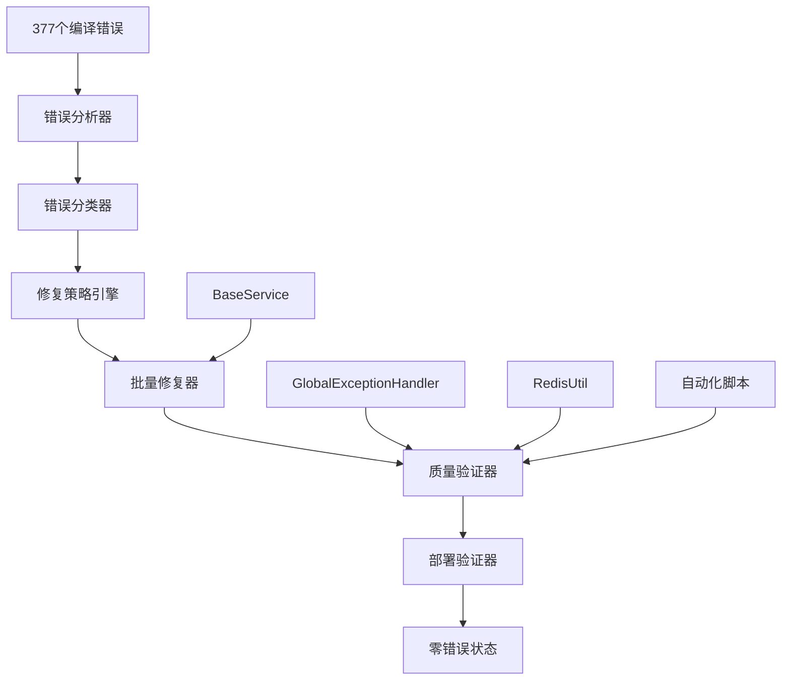

# Design Document

## Overview

本项目设计采用系统化、自动化的377个编译错误修复方案。基于IOE-DREAM项目现有的企业级架构和最佳实践，设计了一个四阶段修复流程：错误分析→批量修复→质量验证→部署确认。该方案充分利用项目现有的BaseService抽象层、统一异常处理机制、缓存服务模板等组件，确保修复工作既高效又保持代码质量标准。

## Steering Document Alignment

### Technical Standards (tech.md)
本设计严格遵循IOE-DREAM项目技术标准：
- **四层架构**：Controller→Service→Manager→DAO，修复过程绝不破坏现有架构
- **依赖注入规范**：统一使用@Resource注解，完全替换@Autowired
- **Jakarta EE合规**：确保Spring Boot 3.x包名100%合规
- **编码规范**：遵循UTF-8编码、命名规范、注释标准

### Project Structure (structure.md)
实现完全符合项目组织约定：
- **模块化设计**：在sa-admin、sa-base、sa-support模块内修复
- **包命名规范**：net.lab1024.sa.{module}.{layer}结构
- **文件组织**：Controller、Service、Manager、DAO分层存放
- **配置管理**：多环境Profile配置保持不变

## Code Reuse Analysis

### Existing Components to Leverage
- **GlobalExceptionHandler**: 利用现有异常处理机制，新增编译错误专用处理逻辑
- **BaseService抽象层**: 利用统一CRUD模板，为修复的Service类提供标准化基础
- **RedisUtil缓存服务**: 利用现有缓存服务，添加修复进度跟踪功能
- **自动化检查脚本**: 复用quick-check.sh、enforce-standards.sh等脚本框架

### Existing Utilities to Extend
- **ErrorAnalysisUtil**: 扩展现有错误分析工具，支持编译错误分类
- **BatchFixTemplate**: 基于现有修复经验，创建标准化修复模板
- **QualityGateValidator**: 扩展质量检查工具，增加编译错误专项检查

### Integration Points
- **Maven构建系统**: 利用现有Maven配置，添加编译错误修复插件
- **Spring Boot应用**: 保持现有启动机制，添加修复状态监控
- **MySQL数据库**: 现有数据库连接池配置保持不变
- **Redis缓存**: 扩展现有缓存机制，支持修复进度缓存

## Architecture

### 修复流程架构


### 模块化设计原则
- **单文件职责**: 每个修复工具专注于特定类型的错误修复
- **组件隔离**: 错误分析、修复执行、质量验证相互独立
- **服务层分离**: 修复策略制定与具体修复实现分离
- **工具模块化**: 批量修复工具、验证工具、监控工具独立开发

## Components and Interfaces

### Component 1: CompilationErrorAnalyzer (错误分析器)
- **Purpose**: 分析377个编译错误，提供详细的分类和统计报告
- **Interfaces**:
  - `analyzeErrors()`: 分析所有编译错误
  - `categorizeErrors()`: 按类型分类错误
  - `generateReport()`: 生成错误分析报告
- **Dependencies**: Maven构建系统、文件系统访问
- **Reuses**: 现有的错误分析框架、日志记录系统

```java
@Component
public class CompilationErrorAnalyzer {

    @Resource
    private MavenBuildService mavenBuildService;

    public ErrorAnalysisReport analyzeErrors() {
        // 执行Maven编译并收集错误信息
        List<CompilationError> errors = collectCompilationErrors();

        // 按类型分类：Lombok、重复定义、缺失方法、类型转换等
        Map<ErrorType, List<CompilationError>> categorizedErrors = categorizeErrors(errors);

        // 生成详细分析报告
        return ErrorAnalysisReport.builder()
            .totalErrors(errors.size())
            .errorCategories(categorizedErrors)
            .severityDistribution(calculateSeverityDistribution(categorizedErrors))
            .moduleDistribution(calculateModuleDistribution(categorizedErrors))
            .build();
    }
}
```

### Component 2: BatchErrorFixer (批量修复器)
- **Purpose**: 根据错误类型应用相应的修复策略
- **Interfaces**:
  - `fixLombokIssues()`: 修复Lombok相关问题
  - `fixDuplicateMethods()`: 修复方法重复定义
  - `fixMissingMethods()`: 添加缺失的方法
  - `fixTypeConversionIssues()`: 修复类型转换问题
- **Dependencies**: 文件系统访问、代码生成器、模板引擎
- **Reuses**: 现有实体类模板、VO类模板、Service类模板

```java
@Component
public class BatchErrorFixer {

    @Resource
    private CodeTemplateService codeTemplateService;

    public FixResult fixLombokIssues(List<CompilationError> lombokErrors) {
        int fixedCount = 0;

        for (CompilationError error : lombokErrors) {
            if (error.isMissingGetterSetter()) {
                boolean fixed = addMissingGetterSetter(error.getFile(), error.getField());
                if (fixed) fixedCount++;
            }
        }

        return FixResult.builder()
            .errorType(ErrorType.LOMBOK)
            .totalErrors(lombokErrors.size())
            .fixedErrors(fixedCount)
            .successRate((double) fixedCount / lombokErrors.size())
            .build();
    }
}
```

### Component 3: QualityValidator (质量验证器)
- **Purpose**: 验证修复后的代码质量，确保不引入新问题
- **Interfaces**:
  - `validateCompilation()`: 验证编译状态
  - `checkCodeQuality()`: 执行代码质量检查
  - `validateFunctionality()`: 验证基础功能
- **Dependencies**: Maven、Checkstyle、PMD、SpotBugs、测试框架
- **Reuses**: 现有质量检查脚本、GlobalExceptionHandler、自动化测试框架

```java
@Component
public class QualityValidator {

    @Resource
    private CompilationService compilationService;

    @Resource
    private CodeQualityService codeQualityService;

    public ValidationResult validateQuality() {
        ValidationResult.ValidationResultBuilder builder = ValidationResult.builder();

        // 1. 编译验证
        CompilationResult compilationResult = compilationService.compile();
        builder.compilationSuccess(compilationResult.isSuccess());
        builder.compilationTime(compilationResult.getDuration());

        // 2. 代码质量检查
        QualityScore qualityScore = codeQualityService.checkQuality();
        builder.qualityScore(qualityScore.getScore());
        builder.styleCompliance(qualityScore.getStyleCompliance());

        // 3. 功能测试
        boolean functionalityPassed = runBasicFunctionalityTests();
        builder.functionalityPassed(functionalityPassed);

        return builder.build();
    }
}
```

### Component 4: DeploymentValidator (部署验证器)
- **Purpose**: 验证修复后的系统可以成功部署和运行
- **Interfaces**:
  - `buildDockerImage()`: 构建Docker镜像
  - `validateContainerStartup()`: 验证容器启动
  - `performHealthChecks()`: 执行健康检查
- **Dependencies**: Docker构建系统、容器运行时、健康检查接口
- **Reuses**: 现有Docker配置、健康检查端点、部署脚本

```java
@Component
public class DeploymentValidator {

    @Resource
    private DockerBuildService dockerBuildService;

    public DeploymentResult validateDeployment() {
        // 1. 构建Docker镜像
        DockerImage image = dockerBuildService.buildImage();

        // 2. 启动容器
        DockerContainer container = startContainer(image);

        // 3. 等待启动完成
        waitForStartup(container);

        // 4. 执行健康检查
        HealthCheckResult healthResult = performHealthChecks(container);

        return DeploymentResult.builder()
            .dockerImageBuilt(true)
            .containerStarted(container.isRunning())
            .healthCheckPassed(healthResult.isHealthy())
            .startupTime(container.getStartupTime())
            .build();
    }
}
```

### Component 5: ProgressTracker (进度跟踪器)
- **Purpose**: 跟踪修复进度，提供实时状态报告
- **Interfaces**:
  - `trackProgress()`: 跟踪修复进度
  - `generateProgressReport()`: 生成进度报告
  - `estimateCompletionTime()`: 估算完成时间
- **Dependencies**: Redis缓存服务、监控系统、日志记录
- **Reuses**: 现有RedisUtil、日志记录系统、监控基础设施

```java
@Component
public class ProgressTracker {

    @Resource
    private RedisUtil redisUtil;

    public ProgressReport trackProgress(FixSession session) {
        ProgressData currentProgress = calculateProgress(session);

        // 缓存进度数据
        redisUtil.set("fix-progress:" + session.getId(), currentProgress, Duration.ofHours(24));

        // 生成报告
        return ProgressReport.builder()
            .sessionId(session.getId())
            .totalErrors(session.getTotalErrors())
            .fixedErrors(currentProgress.getFixedErrors())
            .remainingErrors(currentProgress.getRemainingErrors())
            .progressPercentage(currentProgress.getProgressPercentage())
            .estimatedCompletionTime(estimateCompletionTime(currentProgress))
            .build();
    }
}
```

## Data Models

### Model 1: CompilationError (编译错误)
```java
@Data
@Builder
@AllArgsConstructor
@NoArgsConstructor
public class CompilationError {
    private String id;                    // 错误唯一标识
    private String filePath;              // 文件路径
    private int lineNumber;               // 行号
    private String errorMessage;          // 错误消息
    private ErrorType errorType;          // 错误类型
    private ErrorSeverity severity;        // 错误严重程度
    private String module;                // 所属模块
    private String suggestedFix;          // 建议修复方案
    private LocalDateTime timestamp;      // 发现时间
}
```

### Model 2: ErrorAnalysisReport (错误分析报告)
```java
@Data
@Builder
@AllArgsConstructor
@NoArgsConstructor
public class ErrorAnalysisReport {
    private int totalErrors;                           // 总错误数
    private Map<ErrorType, List<CompilationError>> errorCategories;  // 错误分类
    private Map<String, Integer> moduleDistribution;              // 模块分布
    private Map<ErrorSeverity, Integer> severityDistribution;     // 严重程度分布
    private LocalDateTime analysisTime;                      // 分析时间
    private List<Recommendation> recommendations;            // 修复建议
}
```

### Model 3: FixResult (修复结果)
```java
@Data
@Builder
@AllArgsConstructor
@NoArgsConstructor
public class FixResult {
    private ErrorType errorType;           // 错误类型
    private int totalErrors;             // 总错误数
    private int fixedErrors;             // 修复错误数
    private int failedFixes;             // 修复失败数
    private double successRate;          // 成功率
    private long fixDuration;           // 修复耗时
    private List<String> fixedFiles;      // 修复的文件列表
    private List<String> fixFailures;   // 修复失败信息
}
```

## Error Handling

### Error Scenarios

1. **Scenario 1**: 批量修复过程中引入新的编译错误
   - **Handling**: 实时监控编译状态，立即停止修复并回滚
   - **User Impact**: 系统提示"批量修复中检测到新错误，已停止修复并开始回滚"

2. **Scenario 2**: 修复策略应用失败
   - **Handling**: 记录失败详情，尝试替代修复方案
   - **User Impact**: 系统提供"修复失败，尝试替代方案"的友好提示

3. **Scenario 3**: 质量检查不通过
   - **Handling**: 提供详细的修复建议，自动修复简单问题
   - **User Impact**: 系统显示"质量检查失败，已自动修复部分问题，请手动处理剩余问题"

4. **Scenario 4**: Docker部署失败
   - **Handling**: 分析部署日志，提供具体解决方案
   - **User Impact**: 系统提供"Docker部署失败，查看日志获取详细信息"的指导

## Testing Strategy

### Unit Testing
- **测试范围**: 每个修复组件的核心功能
- **关键组件测试**: CompilationErrorAnalyzer、BatchErrorFixer、QualityValidator
- **修复逻辑测试**: 验证不同错误类型的修复逻辑
- **边界条件测试**: 测试极端情况和异常处理

### Integration Testing
- **测试方法**: 端到端修复流程测试
- **关键流程测试**:
  - 错误分析→修复策略制定→批量修复→质量验证
  - Maven编译→代码质量检查→Docker构建→容器启动
- **数据一致性测试**: 验证修复前后数据库状态一致

### End-to-End Testing
- **测试场景**:
  - 完整的377个错误修复流程
  - 修复后系统的完整功能验证
  - 部署到生产环境的模拟测试
- **用户场景测试**:
  - 开发者提交代码的完整流程
  - CI/CD流水线中的自动修复验证
  - 系统监控和告警功能验证