# 考勤管理模块 - 完整业务流程图设计

## 📋 模块概述

考勤管理模块是IOE-DREAM智慧园区安防综合管理平台的核心业务模块之一，基于Spring Boot 3.5.8 + Spring Cloud 2025.0.0微服务架构，提供完整的考勤管理解决方案。

### 核心功能架构

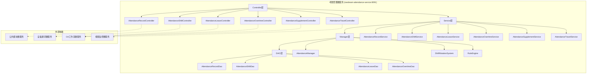

## 1. 考勤记录管理流程

### 1.1 考勤打卡核心流程

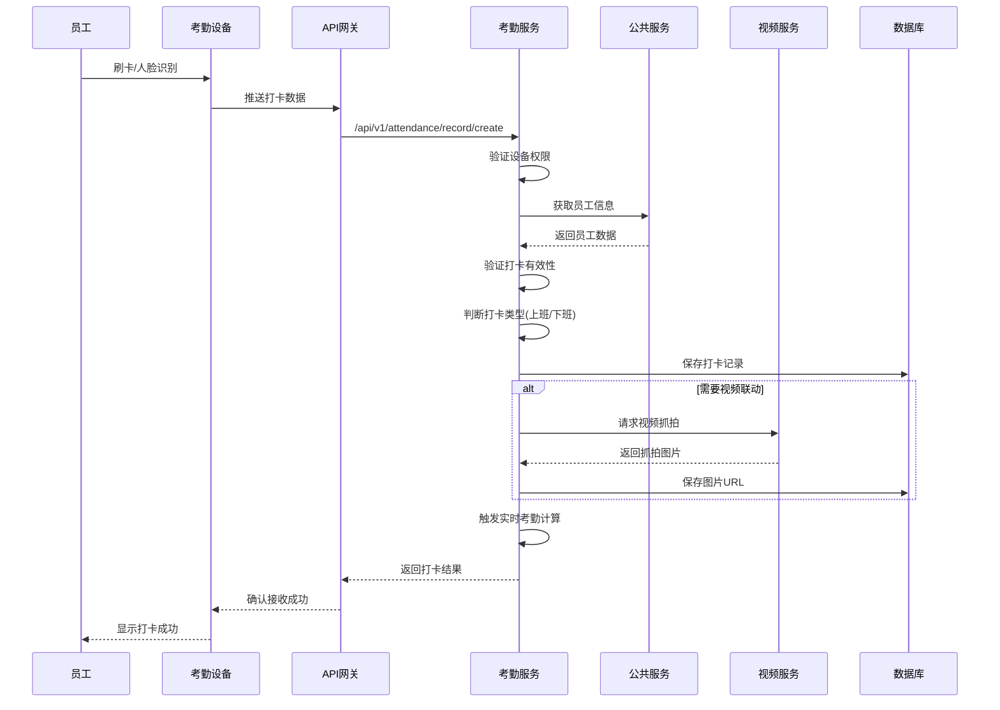

### 1.2 移动端签到流程

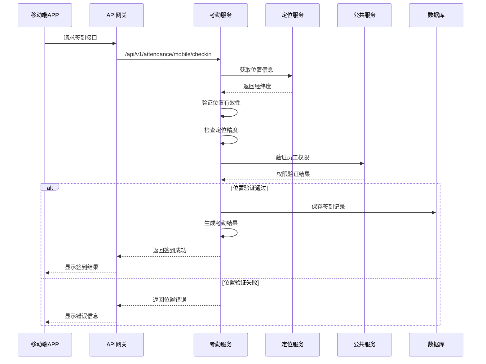

## 2. 排班管理流程

### 2.1 智能排班流程

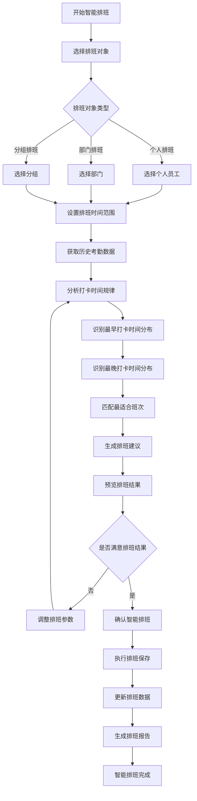

### 2.2 班次轮换流程

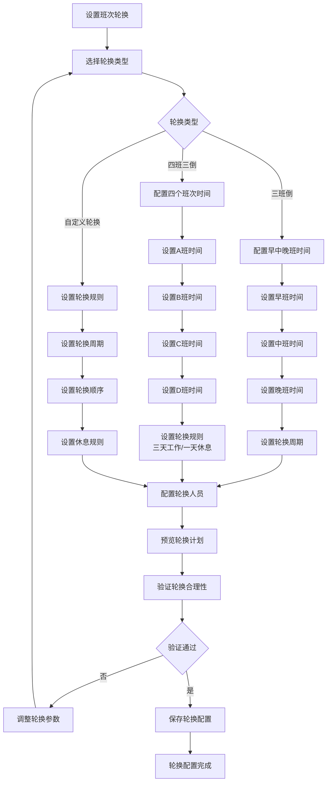

## 3. 异常管理流程

### 3.1 异常申请统一处理流程

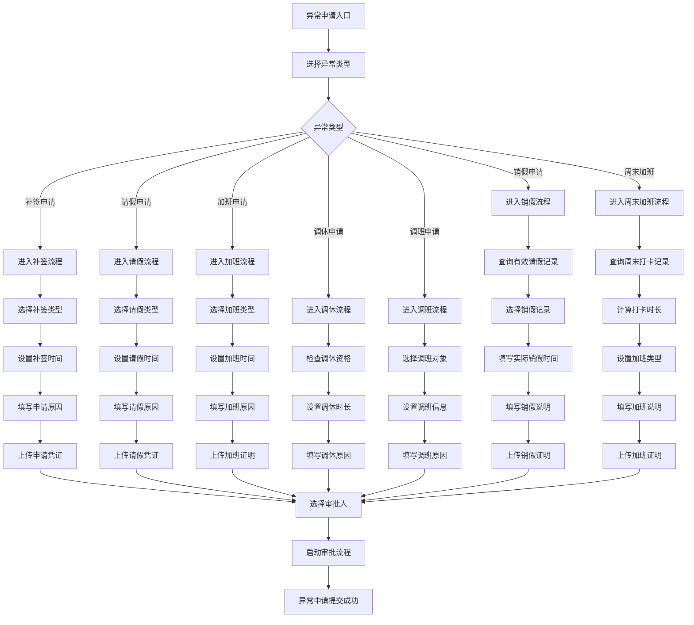

### 3.2 销假特殊处理流程

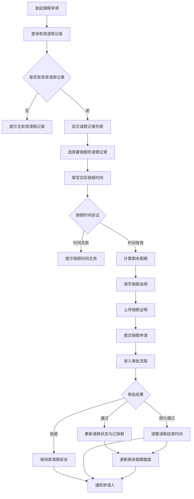

## 4. 考勤计算流程

### 4.1 实时考勤计算引擎

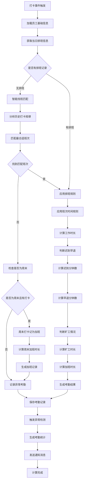

### 4.2 批量考勤计算流程

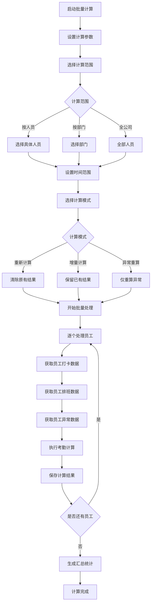

## 5. 报表统计流程

### 5.1 动态报表生成流程

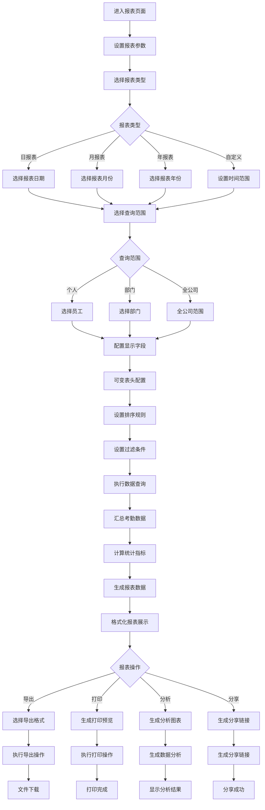

### 5.2 多维度统计分析

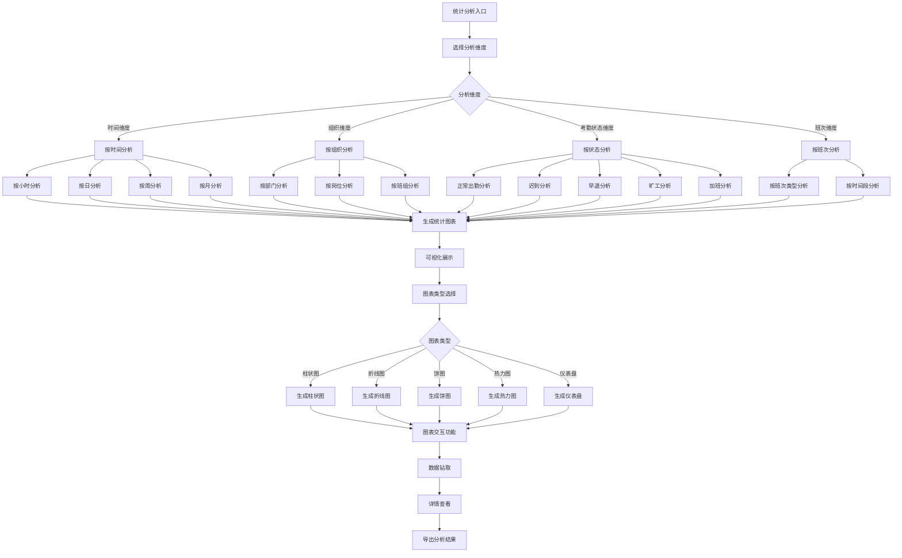

## 6. 移动端功能流程

### 6.1 移动端考勤流程

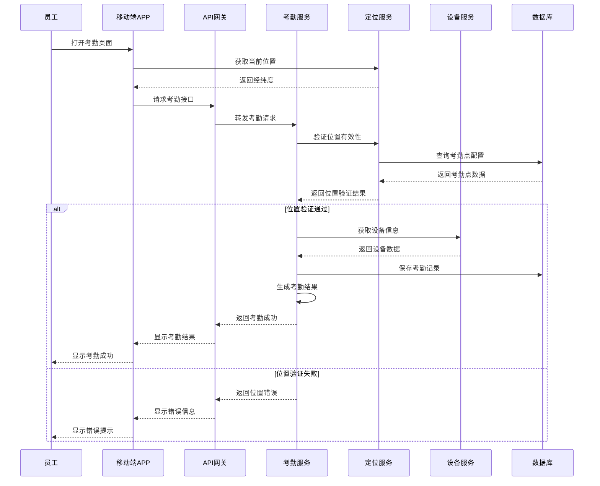

### 6.2 移动端异常申请流程

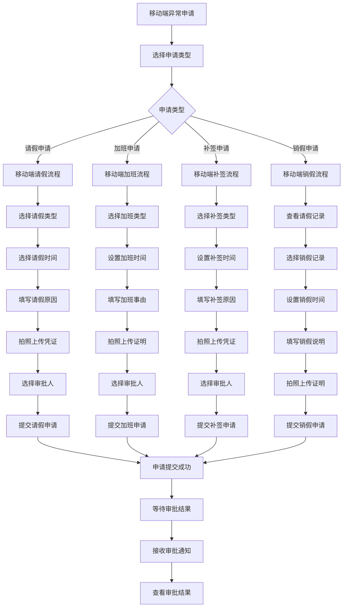

## 7. 系统集成流程

### 7.1 考勤与门禁联动流程

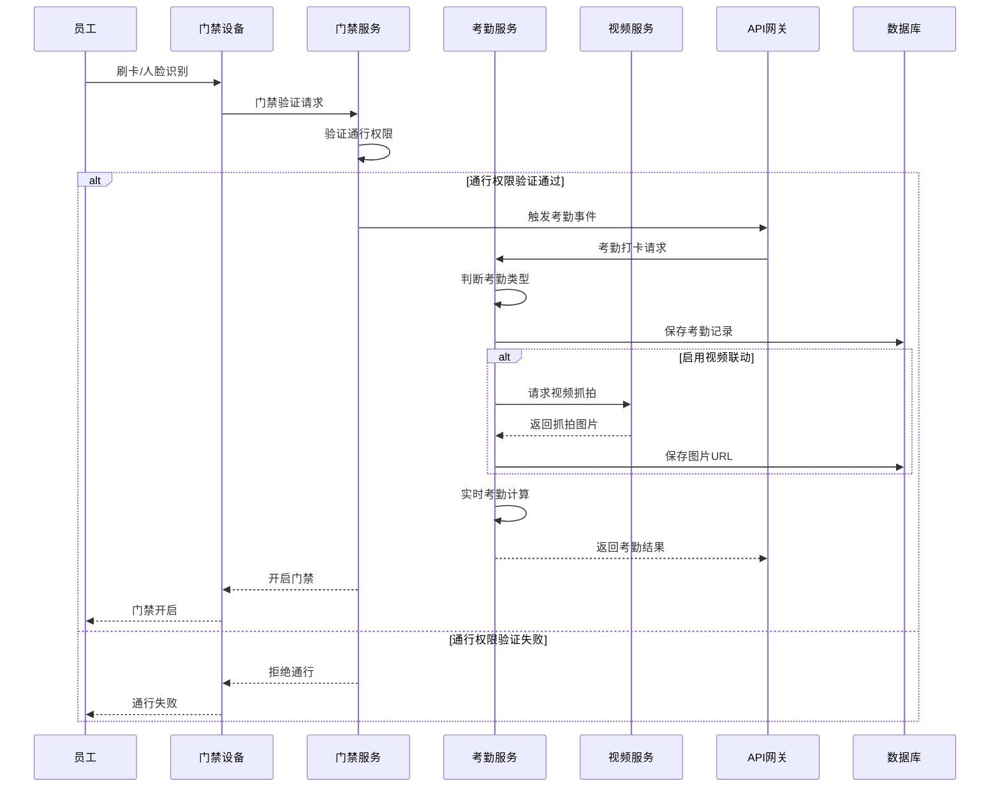

### 7.2 考勤与OA工作流集成

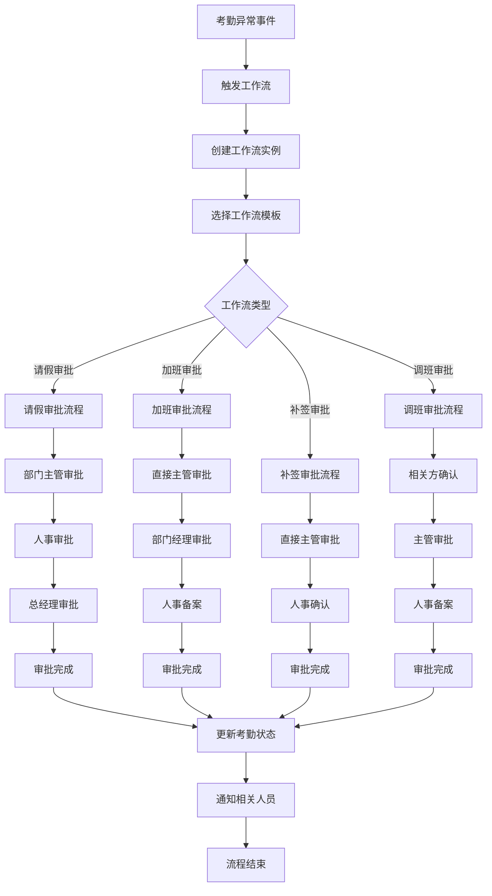

## 8. 数据流转架构

### 8.1 考勤数据完整流转

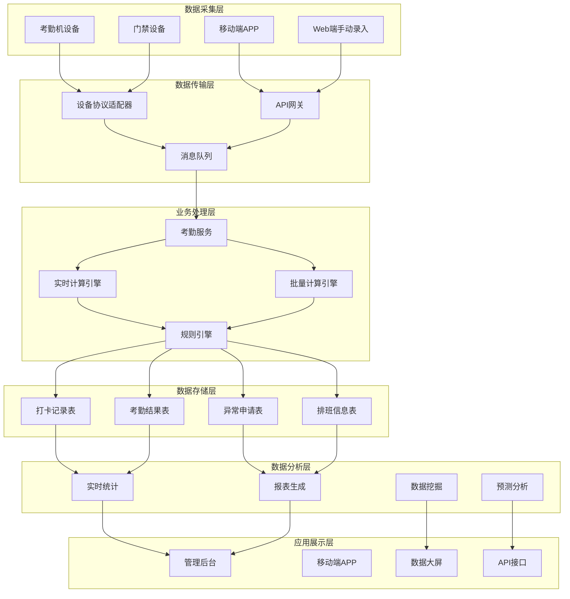

## 9. 性能优化流程

### 9.1 高并发打卡处理

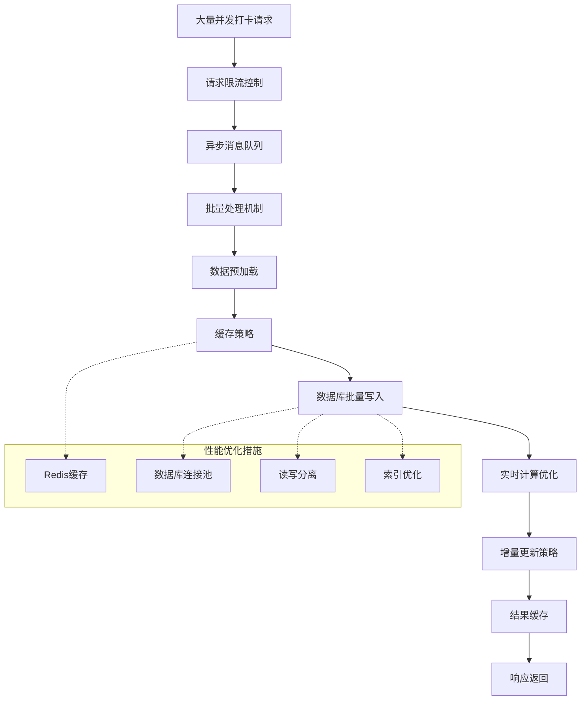

## 10. 安全保障流程

### 10.1 考勤数据安全流程

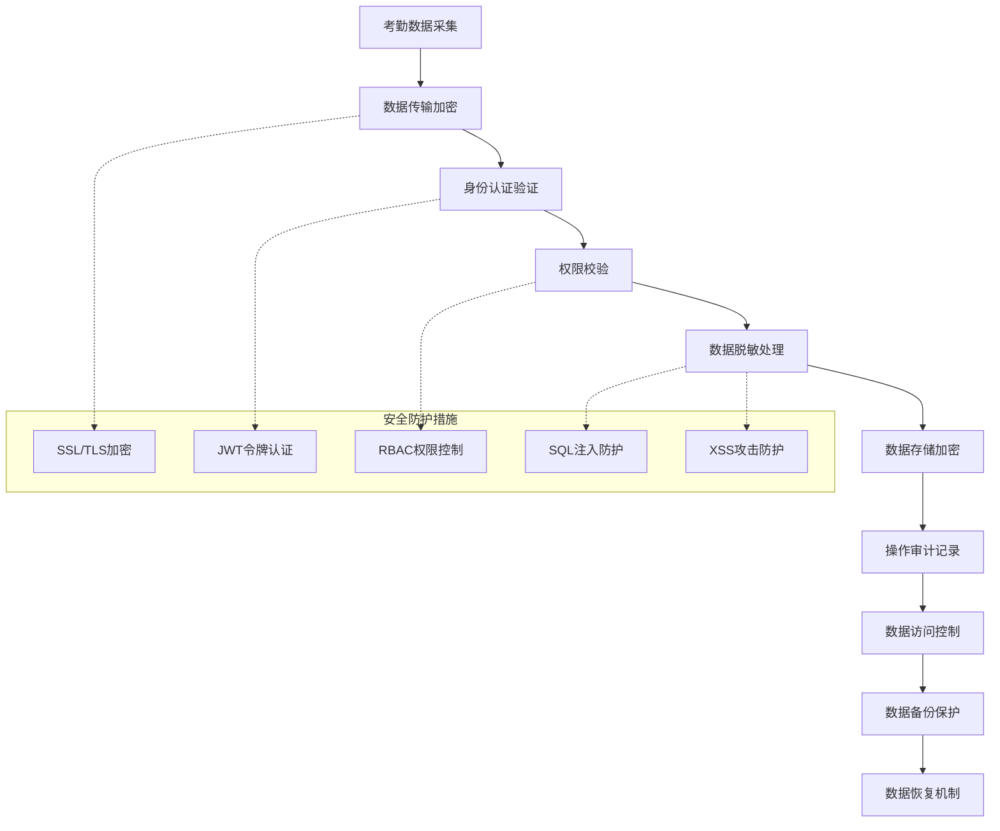

---

## 📊 流程图说明

### 设计原则

1. **用户体验优先**: 简化操作流程，提高用户使用效率
2. **数据一致性**: 确保各环节数据准确性和完整性
3. **系统稳定性**: 支持高并发访问，保证系统稳定运行
4. **扩展性**: 支持功能扩展和业务流程调整
5. **安全性**: 全流程数据安全保障

### 技术实现

1. **微服务架构**: 基于Spring Boot 3.5.8 + Spring Cloud 2025.0.0
2. **实时计算**: 支持实时考勤计算和异常检测
3. **智能算法**: 智能排班、智能找班、异常预测
4. **多端支持**: Web端、移动端、设备端全支持
5. **集成能力**: 与门禁、视频、OA等模块深度集成

### 业务价值

1. **提高效率**: 自动化考勤管理，减少人工干预
2. **降低成本**: 智能排班优化人力资源配置
3. **规范管理**: 标准化考勤流程，提高管理规范
4. **数据驱动**: 基于数据分析的决策支持
5. **风险控制**: 异常预警和风险防控机制

---

*文档版本: v1.0.0*
*创建时间: 2025-01-30*
*更新时间: 2025-01-30*
*维护人员: IOE-DREAM开发团队*