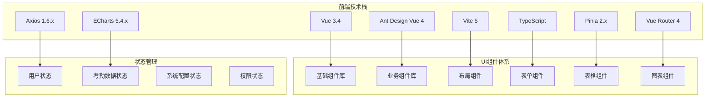

# 考勤管理模块 - 前端界面设计文档

## 📋 模块概述

考勤管理模块前端界面基于Vue 3.4 + Ant Design Vue 4 + Vite 5技术栈，提供现代化、响应式的用户界面，支持PC端和移动端双端适配。

### 技术架构



## 1. 整体界面布局设计

### 1.1 主界面布局结构

```mermaid
layout
    direction TB
    subgraph "考勤管理主界面"
        A[顶部导航栏] --> B[左侧菜单栏]
        B --> C[主内容区域]
        C --> D[底部状态栏]
    end

    subgraph "顶部导航栏"
        A1[系统Logo]
        A2[面包屑导航]
        A3[用户信息]
        A4[消息通知]
        A5[系统设置]
    end

    subgraph "左侧菜单栏"
        B1[考勤记录管理]
        B2[排班管理]
        B3[异常管理]
        B4[考勤报表]
        B5[系统设置]
        B6[基础信息管理]
    end
```

### 1.2 响应式布局适配

| 设备类型 | 屏幕宽度 | 布局调整 | 功能适配 |
|---------|---------|---------|---------|
| PC端 | ≥1200px | 完整布局显示 | 全功能支持 |
| 平板端 | 768px-1199px | 侧边栏可收缩 | 主要功能支持 |
| 手机端 | <768px | 抽屉式菜单 | 移动端专用界面 |

## 2. 核心页面设计

### 2.1 考勤记录管理页面

#### 2.1.1 页面布局

```mermaid
layout
    direction TB
    subgraph "考勤记录管理页面"
        A[页面标题栏] --> B[搜索筛选区域]
        B --> C[操作按钮区域]
        C --> D[数据表格区域]
        D --> E[分页控制区域]
    end

    subgraph "搜索筛选区域"
        B1[员工选择器]
        B2[部门选择器]
        B3[日期范围选择器]
        B4[考勤状态筛选器]
        B5[考勤类型筛选器]
        B6[高级搜索按钮]
    end

    subgraph "操作按钮区域"
        C1[新增记录按钮]
        C2[批量导入按钮]
        C3[导出数据按钮]
        C4[刷新按钮]
        C5[列配置按钮]
    end

    subgraph "数据表格区域"
        D1[可配置列头]
        D2[行选择功能]
        D3[排序功能]
        D4[筛选功能]
        D5[操作列]
    end
```

#### 2.1.2 界面组件设计

**搜索筛选组件**:
```vue
<template>
  <div class="attendance-search-panel">
    <a-row :gutter="16">
      <a-col :span="6">
        <a-form-item label="员工姓名">
          <a-select
            v-model:value="searchForm.employeeId"
            placeholder="请选择员工"
            show-search
            :filter-option="filterEmployee"
            allow-clear
          >
            <a-select-option
              v-for="emp in employeeList"
              :key="emp.id"
              :value="emp.id"
            >
              {{ emp.name }} - {{ emp.employeeNo }}
            </a-select-option>
          </a-select>
        </a-form-item>
      </a-col>

      <a-col :span="6">
        <a-form-item label="部门">
          <a-tree-select
            v-model:value="searchForm.departmentId"
            placeholder="请选择部门"
            :tree-data="departmentTree"
            tree-default-expand-all
            allow-clear
          />
        </a-form-item>
      </a-col>

      <a-col :span="6">
        <a-form-item label="日期范围">
          <a-range-picker
            v-model:value="searchForm.dateRange"
            format="YYYY-MM-DD"
            :placeholder="['开始日期', '结束日期']"
          />
        </a-form-item>
      </a-col>

      <a-col :span="6">
        <a-form-item label="考勤状态">
          <a-select
            v-model:value="searchForm.status"
            placeholder="请选择状态"
            allow-clear
          >
            <a-select-option value="NORMAL">正常</a-select-option>
            <a-select-option value="LATE">迟到</a-select-option>
            <a-select-option value="EARLY">早退</a-select-option>
            <a-select-option value="ABSENT">缺勤</a-select-option>
            <a-select-option value="OVERTIME">加班</a-select-option>
          </a-select>
        </a-form-item>
      </a-col>
    </a-row>

    <a-row>
      <a-col :span="24" class="search-actions">
        <a-space>
          <a-button type="primary" @click="handleSearch">
            <template #icon><SearchOutlined /></template>
            搜索
          </a-button>
          <a-button @click="handleReset">
            <template #icon><ReloadOutlined /></template>
            重置
          </a-button>
          <a-button @click="toggleAdvancedSearch">
            <template #icon><FilterOutlined /></template>
            高级搜索
          </a-button>
        </a-space>
      </a-col>
    </a-row>
  </div>
</template>
```

**数据表格组件**:
```vue
<template>
  <div class="attendance-table-container">
    <a-table
      :columns="tableColumns"
      :data-source="tableData"
      :loading="loading"
      :pagination="false"
      :row-selection="rowSelection"
      :scroll="{ x: 1500 }"
      row-key="id"
      @change="handleTableChange"
    >
      <template #bodyCell="{ column, record }">
        <!-- 员工信息列 -->
        <template v-if="column.key === 'employee'">
          <div class="employee-info">
            <a-avatar :src="record.avatar" :size="32" />
            <div class="employee-details">
              <div class="employee-name">{{ record.employeeName }}</div>
              <div class="employee-no">{{ record.employeeNo }}</div>
            </div>
          </div>
        </template>

        <!-- 考勤状态列 -->
        <template v-else-if="column.key === 'status'">
          <a-tag :color="getStatusColor(record.status)">
            {{ getStatusText(record.status) }}
          </a-tag>
        </template>

        <!-- 打卡时间列 -->
        <template v-else-if="column.key === 'punchTime'">
          <div class="time-info">
            <div>{{ formatTime(record.punchTime) }}</div>
            <div class="time-device">{{ record.deviceName }}</div>
          </div>
        </template>

        <!-- 操作列 -->
        <template v-else-if="column.key === 'action'">
          <a-space>
            <a-button type="link" size="small" @click="viewDetail(record)">
              详情
            </a-button>
            <a-button type="link" size="small" @click="editRecord(record)">
              编辑
            </a-button>
            <a-popconfirm
              title="确定要删除这条记录吗？"
              @confirm="deleteRecord(record.id)"
            >
              <a-button type="link" size="small" danger>
                删除
              </a-button>
            </a-popconfirm>
          </a-space>
        </template>
      </template>
    </a-table>
  </div>
</template>
```

### 2.2 排班管理页面

#### 2.2.1 排班日历界面

```mermaid
layout
    direction TB
    subgraph "排班日历界面"
        A[工具栏] --> B[日历主体区域]
        B --> C[侧边详情面板]
        C --> D[底部操作区域]
    end

    subgraph "工具栏"
        A1[月份选择器]
        A2[部门选择器]
        A3[员工选择器]
        A4[视图切换按钮]
        A5[批量操作按钮]
    end

    subgraph "日历主体区域"
        B1[日期格子]
        B2[排班信息显示]
        B3[异常标记显示]
        B4[节假日标记]
    end

    subgraph "侧边详情面板"
        C1[选中日期信息]
        C2[排班详情列表]
        C3[快速排班操作]
        C4[异常处理入口]
    end
```

#### 2.2.2 日历组件实现

```vue
<template>
  <div class="schedule-calendar">
    <div class="calendar-toolbar">
      <a-space>
        <a-button @click="previousMonth" :disabled="!canPrevious">
          <template #icon><LeftOutlined /></template>
        </a-button>
        <a-month-picker
          v-model:value="currentMonth"
          :format="monthFormat"
          @change="handleMonthChange"
        />
        <a-button @click="nextMonth" :disabled="!canNext">
          <template #icon><RightOutlined /></template>
        </a-button>

        <a-divider type="vertical" />

        <a-select
          v-model:value="selectedDepartment"
          placeholder="选择部门"
          style="width: 200px"
          @change="handleDepartmentChange"
        >
          <a-select-option
            v-for="dept in departments"
            :key="dept.id"
            :value="dept.id"
          >
            {{ dept.name }}
          </a-select-option>
        </a-select>

        <a-select
          v-model:value="selectedEmployee"
          placeholder="选择员工"
          style="width: 200px"
          allow-clear
          @change="handleEmployeeChange"
        >
          <a-select-option
            v-for="emp in employees"
            :key="emp.id"
            :value="emp.id"
          >
            {{ emp.name }}
          </a-select-option>
        </a-select>

        <a-divider type="vertical" />

        <a-radio-group v-model:value="viewMode" @change="handleViewModeChange">
          <a-radio-button value="month">月视图</a-radio-button>
          <a-radio-button value="week">周视图</a-radio-button>
          <a-radio-button value="day">日视图</a-radio-button>
        </a-radio-group>

        <a-button type="primary" @click="showBatchSchedule">
          <template #icon><PlusOutlined /></template>
          批量排班
        </a-button>
      </a-space>
    </div>

    <div class="calendar-content">
      <a-calendar
        v-model:value="selectedDate"
        :fullscreen="false"
        @select="handleDateSelect"
        @panelChange="handlePanelChange"
      >
        <template #dateCellRender="{ current }">
          <div class="schedule-cell">
            <div class="date-number">{{ current.date() }}</div>
            <div class="schedule-info">
              <div
                v-for="schedule in getSchedulesForDate(current)"
                :key="schedule.id"
                class="schedule-item"
                :class="getScheduleClass(schedule)"
                @click.stop="handleScheduleClick(schedule)"
              >
                <a-tooltip :title="getScheduleTooltip(schedule)">
                  <span class="schedule-time">{{ schedule.shiftTime }}</span>
                  <span class="schedule-name">{{ schedule.shiftName }}</span>
                </a-tooltip>
              </div>
            </div>
            <div v-if="hasExceptions(current)" class="exception-indicator">
              <ExclamationCircleOutlined />
            </div>
          </div>
        </template>
      </a-calendar>
    </div>

    <!-- 侧边详情面板 -->
    <a-drawer
      v-model:visible="detailDrawerVisible"
      title="排班详情"
      placement="right"
      width="400"
    >
      <div class="schedule-detail">
        <div class="detail-header">
          <h3>{{ formatDate(selectedDate) }}</h3>
          <a-space>
            <a-button type="primary" size="small" @click="showAddSchedule">
              <template #icon><PlusOutlined /></template>
              添加排班
            </a-button>
            <a-button size="small" @click="showQuickSchedule">
              快速排班
            </a-button>
          </a-space>
        </div>

        <div class="schedule-list">
          <div
            v-for="schedule in selectedDateSchedules"
            :key="schedule.id"
            class="schedule-card"
          >
            <div class="card-header">
              <h4>{{ schedule.shiftName }}</h4>
              <a-space>
                <a-button type="link" size="small" @click="editSchedule(schedule)">
                  编辑
                </a-button>
                <a-popconfirm
                  title="确定要删除这个排班吗？"
                  @confirm="deleteSchedule(schedule.id)"
                >
                  <a-button type="link" size="small" danger>
                    删除
                  </a-button>
                </a-popconfirm>
              </a-space>
            </div>
            <div class="card-content">
              <p><strong>时间:</strong> {{ schedule.startTime }} - {{ schedule.endTime }}</p>
              <p><strong>员工:</strong> {{ schedule.employeeName }}</p>
              <p><strong>部门:</strong> {{ schedule.departmentName }}</p>
              <p><strong>类型:</strong>
                <a-tag :color="getShiftTypeColor(schedule.shiftType)">
                  {{ getShiftTypeText(schedule.shiftType) }}
                </a-tag>
              </p>
            </div>
          </div>
        </div>
      </div>
    </a-drawer>
  </div>
</template>
```

### 2.3 异常管理页面

#### 2.3.1 异常申请界面

```mermaid
layout
    direction TB
    subgraph "异常申请界面"
        A[申请类型选择] --> B[表单填写区域]
        B --> C[附件上传区域]
        C --> D[审批流程选择]
        D --> E[提交操作区域]
    end

    subgraph "申请类型选择"
        A1[请假申请]
        A2[加班申请]
        A3[补签申请]
        A4[调休申请]
        A5[调班申请]
        A6[销假申请]
    end

    subgraph "表单填写区域"
        B1[基本信息填写]
        B2[时间信息填写]
        B3[原因说明填写]
        B4[特殊要求填写]
    end
```

#### 2.3.2 申请表单组件

```vue
<template>
  <div class="exception-apply-form">
    <a-steps :current="currentStep" class="apply-steps">
      <a-step title="选择申请类型" />
      <a-step title="填写申请信息" />
      <a-step title="上传相关附件" />
      <a-step title="选择审批流程" />
      <a-step title="确认提交" />
    </a-steps>

    <div class="form-content">
      <!-- 步骤1: 选择申请类型 -->
      <div v-show="currentStep === 0" class="step-content">
        <h3>请选择申请类型</h3>
        <a-row :gutter="16">
          <a-col :span="8" v-for="type in applyTypes" :key="type.value">
            <div
              class="apply-type-card"
              :class="{ active: selectedType === type.value }"
              @click="selectApplyType(type.value)"
            >
              <div class="card-icon">
                <component :is="type.icon" :style="{ fontSize: '48px', color: type.color }" />
              </div>
              <div class="card-title">{{ type.title }}</div>
              <div class="card-description">{{ type.description }}</div>
            </div>
          </a-col>
        </a-row>
      </div>

      <!-- 步骤2: 填写申请信息 -->
      <div v-show="currentStep === 1" class="step-content">
        <h3>填写申请信息</h3>
        <a-form
          ref="applyFormRef"
          :model="applyForm"
          :rules="formRules"
          layout="vertical"
        >
          <!-- 请假申请表单 -->
          <template v-if="selectedType === 'leave'">
            <a-form-item label="请假类型" name="leaveType">
              <a-select v-model:value="applyForm.leaveType" placeholder="请选择请假类型">
                <a-select-option value="sick">病假</a-select-option>
                <a-select-option value="personal">事假</a-select-option>
                <a-select-option value="annual">年假</a-select-option>
                <a-select-option value="marriage">婚假</a-select-option>
                <a-select-option value="maternity">产假</a-select-option>
              </a-select>
            </a-form-item>

            <a-form-item label="请假时间" name="leaveTime">
              <a-range-picker
                v-model:value="applyForm.leaveTime"
                show-time
                format="YYYY-MM-DD HH:mm"
                :placeholder="['开始时间', '结束时间']"
                style="width: 100%"
              />
            </a-form-item>

            <a-form-item label="请假天数" name="leaveDays">
              <a-input-number
                v-model:value="applyForm.leaveDays"
                :precision="1"
                :min="0.5"
                :max="365"
                style="width: 100%"
              />
              <span class="form-help">系统将自动计算请假天数</span>
            </a-form-item>
          </template>

          <!-- 加班申请表单 -->
          <template v-else-if="selectedType === 'overtime'">
            <a-form-item label="加班类型" name="overtimeType">
              <a-select v-model:value="applyForm.overtimeType" placeholder="请选择加班类型">
                <a-select-option value="workday">工作日加班</a-select-option>
                <a-select-option value="weekend">周末加班</a-select-option>
                <a-select-option value="holiday">节假日加班</a-select-option>
              </a-select>
            </a-form-item>

            <a-form-item label="加班时间" name="overtimeTime">
              <a-range-picker
                v-model:value="applyForm.overtimeTime"
                show-time
                format="YYYY-MM-DD HH:mm"
                :placeholder="['开始时间', '结束时间']"
                style="width: 100%"
              />
            </a-form-item>

            <a-form-item label="加班时长" name="overtimeHours">
              <a-input-number
                v-model:value="applyForm.overtimeHours"
                :precision="1"
                :min="0.5"
                :max="24"
                style="width: 100%"
              />
              <span class="form-help">系统将自动计算加班时长</span>
            </a-form-item>
          </template>

          <!-- 补签申请表单 -->
          <template v-else-if="selectedType === 'supplement'">
            <a-form-item label="补签类型" name="supplementType">
              <a-select v-model:value="applyForm.supplementType" placeholder="请选择补签类型">
                <a-select-option value="checkin">上班补签</a-select-option>
                <a-select-option value="checkout">下班补签</a-select-option>
                <a-select-option value="outing">外出补签</a-select-option>
              </a-select>
            </a-form-item>

            <a-form-item label="补签时间" name="supplementTime">
              <a-date-picker
                v-model:value="applyForm.supplementTime"
                show-time
                format="YYYY-MM-DD HH:mm"
                placeholder="请选择补签时间"
                style="width: 100%"
              />
            </a-form-item>
          </template>

          <a-form-item label="申请原因" name="reason">
            <a-textarea
              v-model:value="applyForm.reason"
              :rows="4"
              placeholder="请详细说明申请原因"
              :maxlength="500"
              show-count
            />
          </a-form-item>
        </a-form>
      </div>

      <!-- 步骤3: 上传附件 -->
      <div v-show="currentStep === 2" class="step-content">
        <h3>上传相关附件</h3>
        <a-upload-dragger
          v-model:file-list="fileList"
          :multiple="true"
          :before-upload="beforeUpload"
          @remove="handleRemove"
        >
          <p class="ant-upload-drag-icon">
            <InboxOutlined />
          </p>
          <p class="ant-upload-text">点击或拖拽文件到此区域上传</p>
          <p class="ant-upload-hint">
            支持单个或批量上传，支持格式：jpg、png、pdf、doc、docx
          </p>
        </a-upload-dragger>

        <div class="attachment-requirements">
          <h4>附件要求：</h4>
          <ul>
            <li v-for="requirement in getAttachmentRequirements()" :key="requirement.type">
              <strong>{{ requirement.type }}：</strong>{{ requirement.description }}
            </li>
          </ul>
        </div>
      </div>

      <!-- 步骤4: 选择审批流程 -->
      <div v-show="currentStep === 3" class="step-content">
        <h3>选择审批流程</h3>
        <a-form layout="vertical">
          <a-form-item label="审批人" name="approvers">
            <a-select
              v-model:value="applyForm.approvers"
              mode="multiple"
              placeholder="请选择审批人"
              :options="approverOptions"
              style="width: 100%"
            />
          </a-form-item>

          <a-form-item label="审批顺序" name="approvalOrder">
            <a-radio-group v-model:value="applyForm.approvalOrder">
              <a-radio value="sequential">依次审批</a-radio>
              <a-radio value="parallel">并行审批</a-radio>
            </a-radio-group>
          </a-form-item>

          <a-form-item label="紧急程度" name="urgency">
            <a-select v-model:value="applyForm.urgency" placeholder="请选择紧急程度">
              <a-select-option value="normal">普通</a-select-option>
              <a-select-option value="urgent">紧急</a-select-option>
              <a-select-option value="very_urgent">非常紧急</a-select-option>
            </a-select>
          </a-form-item>
        </a-form>
      </div>

      <!-- 步骤5: 确认提交 -->
      <div v-show="currentStep === 4" class="step-content">
        <h3>确认申请信息</h3>
        <a-descriptions :column="2" bordered>
          <a-descriptions-item label="申请类型">
            {{ getApplyTypeText(selectedType) }}
          </a-descriptions-item>
          <a-descriptions-item label="申请人">
            {{ userInfo.name }}
          </a-descriptions-item>

          <!-- 根据申请类型显示不同信息 -->
          <template v-if="selectedType === 'leave'">
            <a-descriptions-item label="请假类型">
              {{ getLeaveTypeText(applyForm.leaveType) }}
            </a-descriptions-item>
            <a-descriptions-item label="请假时间">
              {{ formatLeaveTime(applyForm.leaveTime) }}
            </a-descriptions-item>
            <a-descriptions-item label="请假天数">
              {{ applyForm.leaveDays }} 天
            </a-descriptions-item>
          </template>

          <a-descriptions-item label="申请原因" :span="2">
            {{ applyForm.reason }}
          </a-descriptions-item>

          <a-descriptions-item label="附件数量" :span="2">
            {{ fileList.length }} 个文件
          </a-descriptions-item>

          <a-descriptions-item label="审批人" :span="2">
            <a-tag v-for="approver in applyForm.approvers" :key="approver">
              {{ getApproverName(approver) }}
            </a-tag>
          </a-descriptions-item>
        </a-descriptions>
      </div>
    </div>

    <div class="form-actions">
      <a-space>
        <a-button v-if="currentStep > 0" @click="previousStep">
          上一步
        </a-button>
        <a-button v-if="currentStep < 4" type="primary" @click="nextStep">
          下一步
        </a-button>
        <a-button v-if="currentStep === 4" type="primary" @click="submitApply" :loading="submitting">
          提交申请
        </a-button>
        <a-button @click="cancelApply">取消</a-button>
      </a-space>
    </div>
  </div>
</template>
```

### 2.4 考勤报表页面

#### 2.4.1 报表展示界面

```mermaid
layout
    direction TB
    subgraph "考勤报表界面"
        A[报表配置区域] --> B[图表展示区域]
        B --> C[数据表格区域]
        C --> D[操作功能区域]
    end

    subgraph "报表配置区域"
        A1[报表类型选择]
        A2[时间范围选择]
        A3[统计维度选择]
        A4[人员范围选择]
        A5[显示字段配置]
    end

    subgraph "图表展示区域"
        B1[统计图表切换]
        B2[图表类型选择]
        B3[数据钻取功能]
        B4[图表导出功能]
    end
```

#### 2.4.2 图表组件实现

```vue
<template>
  <div class="attendance-report">
    <div class="report-config">
      <a-row :gutter="16">
        <a-col :span="6">
          <a-form-item label="报表类型">
            <a-select v-model:value="reportConfig.type" @change="handleReportTypeChange">
              <a-select-option value="daily">日报表</a-select-option>
              <a-select-option value="weekly">周报表</a-select-option>
              <a-select-option value="monthly">月报表</a-select-option>
              <a-select-option value="yearly">年报表</a-select-option>
              <a-select-option value="custom">自定义报表</a-select-option>
            </a-select>
          </a-form-item>
        </a-col>

        <a-col :span="6">
          <a-form-item label="时间范围">
            <a-range-picker
              v-model:value="reportConfig.dateRange"
              :picker="getDatePickerType()"
              @change="handleDateRangeChange"
            />
          </a-form-item>
        </a-col>

        <a-col :span="6">
          <a-form-item label="统计维度">
            <a-select
              v-model:value="reportConfig.dimension"
              mode="multiple"
              placeholder="请选择统计维度"
            >
              <a-select-option value="department">部门</a-select-option>
              <a-select-option value="employee">员工</a-select-option>
              <a-select-option value="shift">班次</a-select-option>
              <a-select-option value="status">考勤状态</a-select-option>
            </a-select>
          </a-form-item>
        </a-col>

        <a-col :span="6">
          <a-space>
            <a-button type="primary" @click="generateReport" :loading="loading">
              <template #icon><BarChartOutlined /></template>
              生成报表
            </a-button>
            <a-button @click="exportReport">
              <template #icon><ExportOutlined /></template>
              导出报表
            </a-button>
          </a-space>
        </a-col>
      </a-row>
    </div>

    <div class="report-content">
      <!-- 图表展示区域 -->
      <div class="chart-section">
        <div class="chart-header">
          <h3>考勤统计分析</h3>
          <a-radio-group v-model:value="chartType" @change="handleChartTypeChange">
            <a-radio-button value="bar">柱状图</a-radio-button>
            <a-radio-button value="line">折线图</a-radio-button>
            <a-radio-button value="pie">饼图</a-radio-button>
            <a-radio-button value="heatmap">热力图</a-radio-button>
          </a-radio-group>
        </div>

        <div class="chart-container">
          <div ref="chartRef" class="chart"></div>
        </div>
      </div>

      <!-- 数据表格区域 -->
      <div class="table-section">
        <div class="table-header">
          <h3>详细数据</h3>
          <a-space>
            <a-button @click="showColumnConfig">
              <template #icon><SettingOutlined /></template>
              列配置
            </a-button>
            <a-button @click="refreshTable">
              <template #icon><ReloadOutlined /></template>
              刷新
            </a-button>
          </a-space>
        </div>

        <a-table
          :columns="tableColumns"
          :data-source="tableData"
          :loading="tableLoading"
          :pagination="pagination"
          :scroll="{ x: 1500 }"
          row-key="id"
          @change="handleTableChange"
        >
          <template #bodyCell="{ column, record }">
            <!-- 部门列 -->
            <template v-if="column.key === 'department'">
              <a-space>
                <a-avatar :src="record.departmentLogo" :size="24" />
                {{ record.departmentName }}
              </a-space>
            </template>

            <!-- 出勤率列 -->
            <template v-else-if="column.key === 'attendanceRate'">
              <a-progress
                :percent="record.attendanceRate"
                :status="getAttendanceRateStatus(record.attendanceRate)"
                :stroke-color="getAttendanceRateColor(record.attendanceRate)"
              />
            </template>

            <!-- 统计数据列 -->
            <template v-else-if="column.key === 'statistics'">
              <a-space direction="vertical" size="small">
                <div>
                  <span class="stat-label">正常:</span>
                  <span class="stat-value normal">{{ record.normalDays }}</span>
                </div>
                <div>
                  <span class="stat-label">迟到:</span>
                  <span class="stat-value late">{{ record.lateDays }}</span>
                </div>
                <div>
                  <span class="stat-label">早退:</span>
                  <span class="stat-value early">{{ record.earlyDays }}</span>
                </div>
                <div>
                  <span class="stat-label">缺勤:</span>
                  <span class="stat-value absent">{{ record.absentDays }}</span>
                </div>
              </a-space>
            </template>
          </template>
        </a-table>
      </div>
    </div>

    <!-- 列配置弹窗 -->
    <a-modal
      v-model:visible="columnConfigVisible"
      title="列配置"
      @ok="saveColumnConfig"
    >
      <a-checkbox-group v-model:value="selectedColumns">
        <a-row>
          <a-col :span="12" v-for="column in availableColumns" :key="column.key">
            <a-checkbox :value="column.key">{{ column.title }}</a-checkbox>
          </a-col>
        </a-row>
      </a-checkbox-group>
    </a-modal>
  </div>
</template>
```

## 3. 移动端界面设计

### 3.1 移动端考勤打卡界面

```mermaid
layout
    direction TB
    subgraph "移动端打卡界面"
        A[状态显示区域] --> B[打卡操作区域]
        B --> C[位置验证区域]
        C --> D[历史记录区域]
    end

    subgraph "状态显示区域"
        A1[当前时间显示]
        A2[考勤状态显示]
        A3[今日考勤统计]
        A4[个人信息显示]
    end

    subgraph "打卡操作区域"
        B1[上班打卡按钮]
        B2[下班打卡按钮]
        B3[外出打卡按钮]
        B4[返回打卡按钮]
    end
```

### 3.2 移动端组件实现

```vue
<template>
  <div class="mobile-clock-in">
    <!-- 顶部状态栏 -->
    <div class="status-bar">
      <div class="current-time">
        <div class="time">{{ currentTime }}</div>
        <div class="date">{{ currentDate }}</div>
      </div>
      <div class="user-info">
        <a-avatar :src="userInfo.avatar" :size="40" />
        <div class="user-details">
          <div class="name">{{ userInfo.name }}</div>
          <div class="department">{{ userInfo.department }}</div>
        </div>
      </div>
    </div>

    <!-- 考勤状态卡片 -->
    <div class="attendance-status-card">
      <div class="status-header">
        <h3>今日考勤</h3>
        <a-tag :color="getTodayStatusColor()">
          {{ getTodayStatusText() }}
        </a-tag>
      </div>
      <div class="status-content">
        <a-row :gutter="16">
          <a-col :span="8">
            <div class="status-item">
              <div class="status-value">{{ todayStats.checkInTime || '--:--' }}</div>
              <div class="status-label">上班打卡</div>
            </div>
          </a-col>
          <a-col :span="8">
            <div class="status-item">
              <div class="status-value">{{ todayStats.checkOutTime || '--:--' }}</div>
              <div class="status-label">下班打卡</div>
            </div>
          </a-col>
          <a-col :span="8">
            <div class="status-item">
              <div class="status-value">{{ todayStats.workHours || '0' }}h</div>
              <div class="status-label">工作时长</div>
            </div>
          </a-col>
        </a-row>
      </div>
    </div>

    <!-- 打卡操作区域 -->
    <div class="clock-in-area">
      <div class="location-info">
        <a-alert
          v-if="locationStatus === 'valid'"
          message="位置验证通过"
          type="success"
          show-icon
        />
        <a-alert
          v-else-if="locationStatus === 'invalid'"
          :message="locationError"
          type="error"
          show-icon
        />
        <a-alert
          v-else
          message="正在验证位置..."
          type="info"
          show-icon
        />
      </div>

      <div class="clock-buttons">
        <a-button
          type="primary"
          size="large"
          :loading="clockingIn"
          :disabled="!canClockIn || locationStatus !== 'valid'"
          @click="handleClockIn"
          class="clock-button"
        >
          <template #icon><LoginOutlined /></template>
          上班打卡
        </a-button>

        <a-button
          type="primary"
          size="large"
          :loading="clockingOut"
          :disabled="!canClockOut || locationStatus !== 'valid'"
          @click="handleClockOut"
          class="clock-button"
        >
          <template #icon><LogoutOutlined /></template>
          下班打卡
        </a-button>
      </div>

      <div class="extra-buttons">
        <a-space>
          <a-button @click="handleOuting">
            <template #icon><ExportOutlined /></template>
            外出打卡
          </a-button>
          <a-button @click="handleReturn">
            <template #icon><ImportOutlined /></template>
            返回打卡
          </a-button>
        </a-space>
      </div>
    </div>

    <!-- 历史记录 -->
    <div class="recent-records">
      <div class="section-header">
        <h3>最近打卡记录</h3>
        <a-button type="link" @click="viewAllRecords">查看全部</a-button>
      </div>

      <div class="record-list">
        <div
          v-for="record in recentRecords"
          :key="record.id"
          class="record-item"
        >
          <div class="record-time">{{ formatTime(record.clockTime) }}</div>
          <div class="record-type">
            <a-tag :color="getRecordTypeColor(record.recordType)">
              {{ getRecordTypeText(record.recordType) }}
            </a-tag>
          </div>
          <div class="record-location">
            <EnvironmentOutlined />
            {{ record.location }}
          </div>
        </div>
      </div>
    </div>
  </div>
</template>
```

## 4. 组件库设计

### 4.1 基础组件规范

#### 4.1.1 组件命名规范

| 组件类型 | 命名规范 | 示例 |
|---------|---------|------|
| 页面组件 | `XxxPage.vue` | `AttendanceRecordPage.vue` |
| 业务组件 | `XxxComponent.vue` | `ScheduleCalendar.vue` |
| 通用组件 | `Xxx.vue` | `DataTable.vue` |
| 布局组件 | `XxxLayout.vue` | `PageLayout.vue` |

#### 4.1.2 组件目录结构

```
src/
├── components/
│   ├── common/              # 通用组件
│   │   ├── DataTable.vue
│   │   ├── SearchPanel.vue
│   │   ├── FormModal.vue
│   │   └── index.ts
│   ├── business/            # 业务组件
│   │   ├── attendance/
│   │   │   ├── AttendanceCalendar.vue
│   │   │   ├── ClockInButton.vue
│   │   │   ├── ExceptionCard.vue
│   │   │   └── index.ts
│   │   └── schedule/
│   ├── layout/              # 布局组件
│   │   ├── PageHeader.vue
│   │   ├── Sidebar.vue
│   │   ├── ContentWrapper.vue
│   │   └── index.ts
│   └── charts/              # 图表组件
│       ├── AttendanceChart.vue
│       ├── StatisticsChart.vue
│       └── index.ts
```

### 4.2 主题设计系统

#### 4.2.1 颜色规范

```scss
// 主色调
$primary-color: #1890ff;
$success-color: #52c41a;
$warning-color: #faad14;
$error-color: #ff4d4f;
$info-color: #1890ff;

// 考勤专用颜色
$attendance-normal: #52c41a;
$attendance-late: #faad14;
$attendance-early: #fa8c16;
$attendance-absent: #ff4d4f;
$attendance-overtime: #722ed1;

// 中性色
$text-color: rgba(0, 0, 0, 0.85);
$text-color-secondary: rgba(0, 0, 0, 0.65);
$text-color-disabled: rgba(0, 0, 0, 0.25);
$border-color: #d9d9d9;
$background-color: #fafafa;
```

#### 4.2.2 字体规范

```scss
// 字体大小
$font-size-xs: 12px;
$font-size-sm: 14px;
$font-size-base: 16px;
$font-size-lg: 18px;
$font-size-xl: 20px;
$font-size-xxl: 24px;

// 字体权重
$font-weight-normal: 400;
$font-weight-medium: 500;
$font-weight-semibold: 600;
$font-weight-bold: 700;

// 行高
$line-height-base: 1.5;
$line-height-sm: 1.2;
$line-height-lg: 1.8;
```

## 5. 交互设计规范

### 5.1 操作反馈

| 操作类型 | 反馈方式 | 实现方式 |
|---------|---------|---------|
| 成功操作 | 成功提示 | message.success() |
| 失败操作 | 错误提示 | message.error() |
| 警告操作 | 警告提示 | message.warning() |
| 加载操作 | 加载状态 | loading状态 + spin组件 |
| 异步操作 | 进度提示 | progress组件 |

### 5.2 表单验证

```vue
<template>
  <a-form
    ref="formRef"
    :model="form"
    :rules="rules"
    layout="vertical"
    @finish="handleSubmit"
    @finishFailed="handleFinishFailed"
  >
    <a-form-item
      label="员工姓名"
      name="employeeName"
      :rules="[
        { required: true, message: '请输入员工姓名' },
        { min: 2, max: 20, message: '姓名长度在2到20个字符之间' }
      ]"
    >
      <a-input
        v-model:value="form.employeeName"
        placeholder="请输入员工姓名"
        @blur="validateField('employeeName')"
      />
    </a-form-item>
  </a-form>
</template>
```

## 6. 性能优化

### 6.1 组件懒加载

```javascript
// 路由级懒加载
const AttendanceRecordPage = () => import('@/pages/attendance/AttendanceRecordPage.vue');

// 组件级懒加载
const HeavyComponent = defineAsyncComponent(() => import('./HeavyComponent.vue'));
```

### 6.2 数据优化

```vue
<script setup>
import { ref, computed, onMounted } from 'vue';
import { debounce } from 'lodash-es';

// 防抖搜索
const searchKeyword = ref('');
const debouncedSearch = debounce((value) => {
  performSearch(value);
}, 300);

// 计算属性缓存
const filteredData = computed(() => {
  return rawData.value.filter(item =>
    item.name.includes(searchKeyword.value)
  );
});

// 虚拟滚动
const virtualListData = ref([]);
const visibleData = computed(() => {
  const start = scrollTop.value / itemHeight.value;
  const end = start + visibleCount.value;
  return virtualListData.value.slice(start, end);
});
</script>
```

## 7. 响应式设计

### 7.1 断点设置

```scss
// 响应式断点
$screen-xs: 480px;
$screen-sm: 576px;
$screen-md: 768px;
$screen-lg: 992px;
$screen-xl: 1200px;
$screen-xxl: 1600px;

// 媒体查询
@mixin respond-to($breakpoint) {
  @if $breakpoint == xs {
    @media (max-width: $screen-xs) { @content; }
  }
  @if $breakpoint == sm {
    @media (min-width: $screen-sm) { @content; }
  }
  // ... 其他断点
}
```

### 7.2 移动端适配

```vue
<template>
  <div class="responsive-container">
    <!-- PC端布局 -->
    <div class="desktop-layout">
      <Sidebar />
      <MainContent />
    </div>

    <!-- 移动端布局 -->
    <div class="mobile-layout">
      <MobileHeader />
      <MobileContent />
      <MobileTabBar />
    </div>
  </div>
</template>

<style scoped>
.responsive-container {
  width: 100%;
  height: 100vh;
}

.desktop-layout {
  display: flex;
  height: 100%;
}

.mobile-layout {
  display: none;
  height: 100%;
}

@media (max-width: 768px) {
  .desktop-layout {
    display: none;
  }

  .mobile-layout {
    display: flex;
    flex-direction: column;
  }
}
</style>
```

## 8. 国际化支持

### 8.1 语言配置

```javascript
// i18n配置
import { createI18n } from 'vue-i18n';
import zhCN from './locales/zh-CN';
import enUS from './locales/en-US';

const i18n = createI18n({
  legacy: false,
  locale: 'zh-CN',
  fallbackLocale: 'en-US',
  messages: {
    'zh-CN': zhCN,
    'en-US': enUS,
  },
});

export default i18n;
```

### 8.2 多语言文本

```vue
<template>
  <div>
    <h1>{{ $t('attendance.title') }}</h1>
    <a-button>{{ $t('common.search') }}</a-button>
    <p>{{ $t('attendance.description') }}</p>
  </div>
</template>
```

---

## 📋 总结

考勤管理模块前端界面设计遵循现代化UI/UX设计原则，基于Vue 3.4 + Ant Design Vue 4技术栈，提供：

1. **统一的视觉体验**: 遵循设计系统规范，确保界面一致性
2. **优秀的用户体验**: 简化操作流程，提高用户使用效率
3. **完善的响应式设计**: 支持PC端和移动端双端适配
4. **高性能渲染**: 组件懒加载、数据优化、虚拟滚动等
5. **国际化支持**: 多语言切换，适配不同地区用户
6. **可维护性**: 模块化设计，组件复用，代码规范

---

*文档版本: v1.0.0*
*创建时间: 2025-01-30*
*更新时间: 2025-01-30*
*维护人员: IOE-DREAM前端团队*