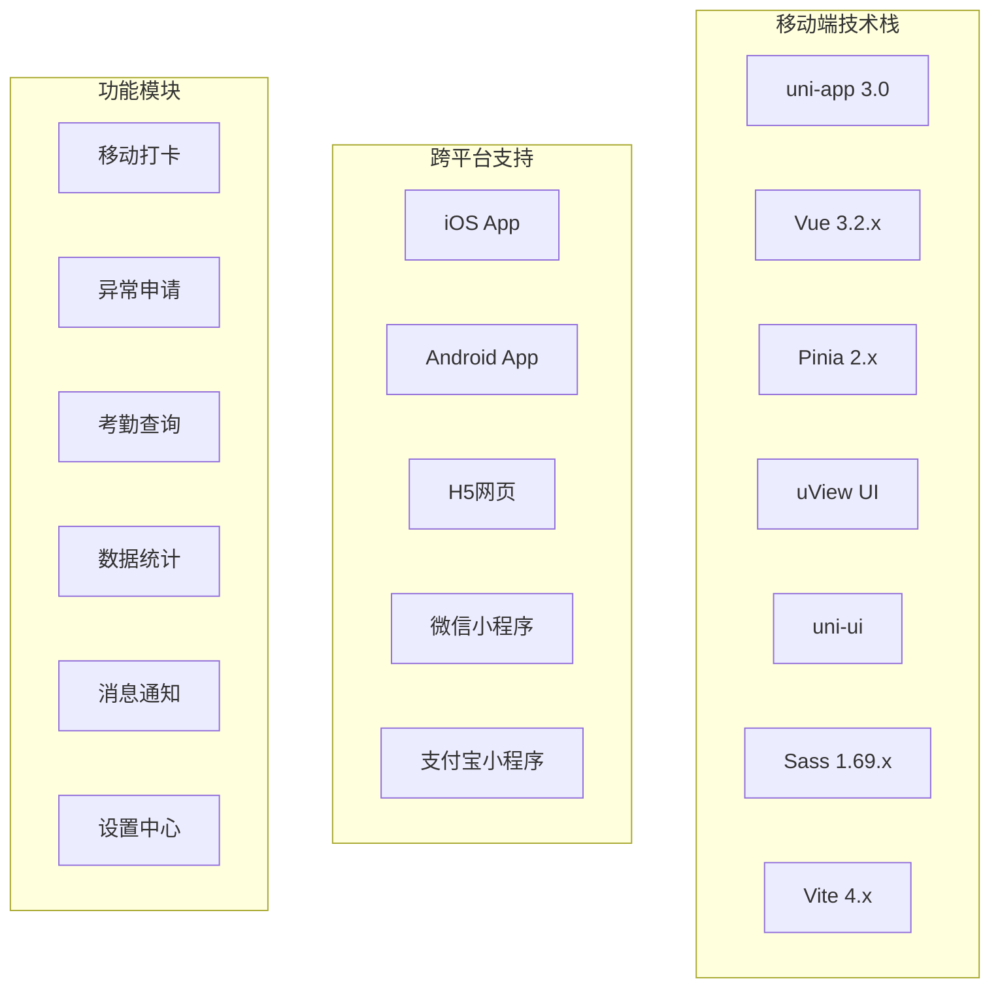
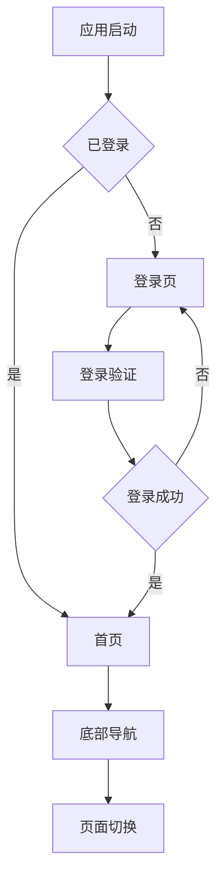
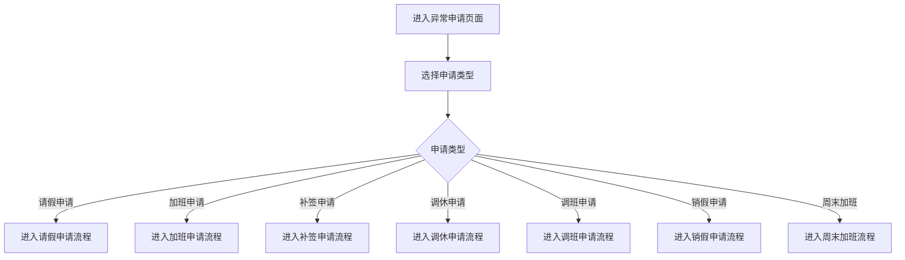

# 考勤管理模块 - 移动端设计文档

## 📋 模块概述

考勤管理模块移动端基于uni-app 3.0框架开发，支持iOS、Android、H5等多平台，提供便捷的移动考勤体验，包括移动打卡、异常申请、考勤查询、数据统计等功能。

### 技术架构



## 1. 整体界面设计

### 1.1 移动端界面结构

```mermaid
layout
    direction TB
    subgraph "移动端应用结构"
        A[启动页] --> B[登录页]
        B --> C[首页]
        C --> D[功能页面]
        D --> E[个人中心]

        subgraph "底部导航栏"
            C1[考勤打卡]
            C2[排班管理]
            C3[异常申请]
            C4[数据统计]
            C5[我的]
        end
    end
```

### 1.2 页面导航设计



## 2. 核心功能页面设计

### 2.1 首页 - 考勤打卡

#### 2.1.1 页面布局结构

```mermaid
layout
    direction TB
    subgraph "考勤打卡页面"
        A[顶部状态栏] --> B[时间显示区域]
        B --> C[用户信息区域]
        C --> D[考勤状态卡片]
        D --> E[打卡操作区域]
        E --> F[位置验证区域]
        F --> G[今日统计区域]
        G --> H[快速功能入口]
    end

    subgraph "顶部状态栏"
        A1[系统时间]
        A2[网络状态]
        A3[电池电量]
        A4[消息通知]
    end

    subgraph "打卡操作区域"
        E1[上班打卡按钮]
        E2[下班打卡按钮]
        E3[外出打卡按钮]
        E4[返回打卡按钮]
    end

    subgraph "快速功能入口"
        H1[请假申请]
        H2[加班申请]
        H3[考勤查询]
        H4[排班查看]
    end
```

#### 2.1.2 页面组件实现

```vue
<template>
  <view class="mobile-attendance">
    <!-- 顶部状态栏 -->
    <view class="status-bar">
      <view class="time-info">{{ currentTime }}</view>
      <view class="status-icons">
        <text class="icon-signal"></text>
        <text class="icon-wifi"></text>
        <text class="icon-battery"></text>
        <view class="notification-dot" v-if="hasNotification"></view>
      </view>
    </view>

    <!-- 用户信息区域 -->
    <view class="user-info">
      <view class="user-avatar">
        <image :src="userInfo.avatar" mode="aspectFill" />
      </view>
      <view class="user-details">
        <text class="user-name">{{ userInfo.name }}</text>
        <text class="user-dept">{{ userInfo.department }}</text>
      </view>
      <view class="user-more" @tap="showUserMenu">
        <text class="icon-more"></text>
      </view>
    </view>

    <!-- 考勤状态卡片 -->
    <view class="attendance-status-card">
      <view class="card-header">
        <text class="card-title">今日考勤</text>
        <view class="status-tag" :class="getTodayStatusClass()">
          {{ getTodayStatusText() }}
        </view>
      </view>
      <view class="card-content">
        <view class="status-row">
          <view class="status-item">
            <text class="status-value">{{ todayStats.checkInTime || '--:--' }}</text>
            <text class="status-label">上班打卡</text>
          </view>
          <view class="status-item">
            <text class="status-value">{{ todayStats.checkOutTime || '--:--' }}</text>
            <text class="status-label">下班打卡</text>
          </view>
        </view>
        <view class="status-row">
          <view class="status-item">
            <text class="status-value">{{ todayStats.workHours || '0' }}h</text>
            <text class="status-label">工作时长</text>
          </view>
          <view class="status-item">
            <text class="status-value">{{ todayStats.overtimeHours || '0' }}h</text>
            <text class="status-label">加班时长</text>
          </view>
        </view>
      </view>
    </view>

    <!-- 位置验证区域 -->
    <view class="location-verification">
      <view class="verification-status" :class="locationStatus.class">
        <text class="status-icon">{{ locationStatus.icon }}</text>
        <text class="status-text">{{ locationStatus.text }}</text>
      </view>
      <view class="location-info" v-if="locationInfo.address">
        <text class="icon-location"></text>
        <text class="location-text">{{ locationInfo.address }}</text>
        <text class="location-distance">{{ locationInfo.distance }}m</text>
      </view>
    </view>

    <!-- 打卡操作区域 -->
    <view class="clock-in-area">
      <view class="clock-buttons">
        <button
          class="clock-btn checkin-btn"
          :class="{ disabled: !canCheckIn }"
          :loading="checkingIn"
          @tap="handleCheckIn"
        >
          <text class="btn-icon">上班打卡</text>
          <text class="btn-time">{{ getCurrentTime() }}</text>
        </button>
        <button
          class="clock-btn checkout-btn"
          :class="{ disabled: !canCheckOut }"
          :loading="checkingOut"
          @tap="handleCheckOut"
        >
          <text class="btn-icon">下班打卡</text>
          <text class="btn-time">{{ getCurrentTime() }}</text>
        </button>
      </view>

      <view class="extra-buttons">
        <button class="extra-btn" @tap="handleOuting">
          <text class="icon-outing"></text>
          <text>外出</text>
        </button>
        <button class="extra-btn" @tap="handleReturn">
          <text class="icon-return"></text>
          <text>返回</text>
        </button>
      </view>
    </view>

    <!-- 今日统计 -->
    <view class="today-stats">
      <view class="stats-header">
        <text class="stats-title">今日统计</text>
        <text class="stats-more" @tap="viewDetailStats">查看详情 ></text>
      </view>
      <view class="stats-content">
        <view class="stats-grid">
          <view class="stats-item">
            <text class="stats-number">{{ todayStats.totalRecords }}</text>
            <text class="stats-label">打卡次数</text>
          </view>
          <view class="stats-item">
            <text class="stats-number">{{ todayStats.normalDays }}</text>
            <text class="stats-label">正常天数</text>
          </view>
          <view class="stats-item">
            <text class="stats-number">{{ todayStats.exceptionDays }}</text>
            <text class="stats-label">异常天数</text>
          </view>
          <view class="stats-item">
            <text class="stats-number">{{ todayStats.overtimeHours }}h</text>
            <text class="stats-label">加班时长</text>
          </view>
        </view>
      </view>
    </view>

    <!-- 快速功能入口 -->
    <view class="quick-actions">
      <view class="actions-header">
        <text class="actions-title">快速功能</text>
      </view>
      <view class="actions-grid">
        <view class="action-item" @tap="goToLeaveApply">
          <view class="action-icon leave-icon">
            <text class="icon-calendar"></text>
          </view>
          <text class="action-text">请假申请</text>
        </view>
        <view class="action-item" @tap="goToOvertimeApply">
          <view class="action-icon overtime-icon">
            <text class="icon-time"></text>
          </view>
          <text class="action-text">加班申请</text>
        </view>
        <view class="action-item" @tap="goToAttendanceQuery">
          <view class="action-icon query-icon">
            <text class="icon-search"></text>
          </view>
          <text class="action-text">考勤查询</text>
        </view>
        <view class="action-item" @tap="goToScheduleView">
          <view class="action-icon schedule-icon">
            <text class="icon-schedule"></text>
          </view>
          <text class="action-text">排班查看</text>
        </view>
      </view>
    </view>
  </view>
</template>

<script>
import { ref, computed, onMounted, onUnmounted } from 'vue'
import { useUserStore } from '@/stores/user'
import { useAttendanceStore } from '@/stores/attendance'

export default {
  name: 'MobileAttendance',
  setup() {
    const userStore = useUserStore()
    const attendanceStore = useAttendanceStore()

    // 响应式数据
    const currentTime = ref('')
    const hasNotification = ref(false)
    const checkingIn = ref(false)
    const checkingOut = ref(false)

    // 计算属性
    const userInfo = computed(() => userStore.userInfo)
    const todayStats = computed(() => attendanceStore.todayStats)
    const canCheckIn = computed(() => !todayStats.value.checkInTime)
    const canCheckOut = computed(() => todayStats.value.checkInTime && !todayStats.value.checkOutTime)

    const locationStatus = computed(() => {
      if (attendanceStore.locationVerification) {
        return attendanceStore.locationVerification.valid ?
          { class: 'valid', icon: '✓', text: '位置验证通过' } :
          { class: 'invalid', icon: '✗', text: '位置超出范围' }
      }
      return { class: 'checking', icon: '⟳', text: '正在验证位置...' }
    })

    const locationInfo = computed(() => attendanceStore.locationInfo)

    // 方法
    const getCurrentTime = () => {
      const now = new Date()
      return now.toTimeString()
    }

    const updateCurrentTime = () => {
      currentTime.value = getCurrentTime()
    }

    const handleCheckIn = async () => {
      if (!canCheckIn.value) return

      checkingIn.value = true
      try {
        await attendanceService.checkIn({
          type: 'CHECK_IN',
          location: locationInfo.value
        })
        uni.showToast({
          title: '打卡成功',
          icon: 'success'
        })
      } catch (error) {
        uni.showToast({
          title: error.message,
          icon: 'none'
        })
      } finally {
        checkingIn.value = false
      }
    }

    const handleCheckOut = async () => {
      if (!canCheckOut.value) return

      checkingOut.value = true
      try {
        await attendanceService.checkOut({
          type: 'CHECK_OUT',
          location: locationInfo.value
        })
        uni.showToast({
          title: '打卡成功',
          icon: 'success'
        })
      } catch (error) {
        uni.showToast({
          title: error.message,
          icon: 'none'
        })
      } finally {
        checkingOut.value = false
      }
    }

    // 生命周期
    onMounted(() => {
      updateCurrentTime()
      setInterval(updateCurrentTime, 1000)
      attendanceStore.loadTodayStats()
      attendanceService.startLocationMonitoring()
    })

    onUnmounted(() => {
      attendanceService.stopLocationMonitoring()
    })

    return {
      currentTime,
      hasNotification,
      checkingIn,
      checkingOut,
      userInfo,
      todayStats,
      canCheckIn,
      canCheckOut,
      locationStatus,
      locationInfo,
      getCurrentTime,
      handleCheckIn,
      handleCheckOut
    }
  }
}
</script>

<style lang="scss" scoped>
.mobile-attendance {
  padding: 0;
  background-color: #f5f5f5;
  min-height: 100vh;
}

.status-bar {
  display: flex;
  justify-content: space-between;
  align-items: center;
  padding: 10px 15px;
  background-color: #ffffff;
  border-bottom: 1px solid #eee;

  .time-info {
    font-size: 18px;
    font-weight: 600;
    color: #333;
  }

  .status-icons {
    display: flex;
    gap: 10px;

    .status-dot {
      width: 8px;
      height: 8px;
      border-radius: 50%;
      background-color: #ff4757;
      position: relative;

      &::after {
        content: '';
        position: absolute;
        top: -2px;
        right: -2px;
        width: 12px;
        height: 12px;
        border-radius: 50%;
        border: 2px solid #ff4757;
        animation: pulse 1s infinite;
      }
    }
  }
}

.user-info {
  display: flex;
  align-items: center;
  padding: 20px 15px;
  background-color: #ffffff;
  margin-bottom: 10px;

  .user-avatar {
    width: 50px;
    height: 50px;
    border-radius: 25px;
    overflow: hidden;
    margin-right: 15px;

    image {
      width: 100%;
      height: 100%;
    }
  }

  .user-details {
    flex: 1;

    .user-name {
      display: block;
      font-size: 18px;
      font-weight: 600;
      color: #333;
      margin-bottom: 5px;
    }

    .user-dept {
      font-size: 14px;
      color: #666;
    }
  }

  .user-more {
    padding: 10px;

    .icon-more {
      font-size: 20px;
      color: #666;
    }
  }
}

.attendance-status-card {
  margin: 0 15px 15px 15px;
  background-color: #ffffff;
  border-radius: 12px;
  padding: 20px;
  box-shadow: 0 2px 8px rgba(0,0,0,0.1);

  .card-header {
    display: flex;
    justify-content: space-between;
    align-items: center;
    margin-bottom: 20px;

    .card-title {
      font-size: 16px;
      font-weight: 600;
      color: #333;
    }

    .status-tag {
      padding: 4px 8px;
      border-radius: 4px;
      font-size: 12px;

      &.normal {
        background-color: #f6ffed;
        color: #52c41a;
      }

      &.late {
        background-color: #fffbe6;
        color: #faad14;
      }

      &.early {
        background-color: #fff7e6;
        color: #fa8c16;
      }
    }
  }

  .card-content {
    .status-row {
      display: flex;
      margin-bottom: 15px;

      &:last-child {
        margin-bottom: 0;
      }
    }

    .status-item {
      flex: 1;
      text-align: center;

      .status-value {
        display: block;
        font-size: 20px;
        font-weight: 600;
        color: #333;
        margin-bottom: 5px;
      }

      .status-label {
        font-size: 12px;
        color: #666;
      }
    }
  }
}

.location-verification {
  margin: 0 15px 15px 15px;

  .verification-status {
    display: flex;
    align-items: center;
    padding: 10px 15px;
    border-radius: 8px;
    margin-bottom: 10px;

    &.valid {
      background-color: #f6ffed;
      color: #52c41a;
    }

    &.invalid {
      background-color: #fff1f0;
      color: #ff4d4f;
    }

    &.checking {
      background-color: #e6f7ff;
      color: #1890ff;
    }

    .status-icon {
      font-size: 16px;
      margin-right: 8px;
    }
  }

  .location-info {
    display: flex;
    align-items: center;
    padding: 10px 15px;
    background-color: #f0f0f0;
    border-radius: 8px;

    .icon-location {
      margin-right: 8px;
      color: #666;
    }

    .location-text {
      flex: 1;
      font-size: 14px;
      color: #333;
      margin-right: 10px;
    }

    .location-distance {
      font-size: 12px;
      color: #666;
    }
  }
}

.clock-in-area {
  margin: 0 15px 15px 15px;

  .clock-buttons {
    display: flex;
    gap: 15px;
    margin-bottom: 20px;

    .clock-btn {
      flex: 1;
      height: 120px;
      border-radius: 12px;
      display: flex;
      flex-direction: column;
      justify-content: center;
      align-items: center;
      border: none;

      &.checkin-btn {
        background: linear-gradient(135deg, #1890ff 0%, #096dd9 100%);
      }

      &.checkout-btn {
        background: linear-gradient(135deg, #52c41a 0%, #389e0d 100%);
      }

      &.disabled {
        background: #f5f5f5;
        color: #ccc;
      }

      .btn-icon {
        font-size: 20px;
        color: #ffffff;
        margin-bottom: 8px;
      }

      .btn-time {
        font-size: 16px;
        color: #ffffff;
      }
    }
  }

  .extra-buttons {
    display: flex;
    gap: 10px;

    .extra-btn {
      flex: 1;
      height: 50px;
      border-radius: 8px;
      background-color: #ffffff;
      border: 1px solid #e8e8e8;
      display: flex;
      flex-direction: column;
      justify-content: center;
      align-items: center;

      .icon-outing,
      .icon-return {
        font-size: 20px;
        color: #666;
        margin-bottom: 2px;
      }

      text {
        font-size: 12px;
        color: #666;
      }
    }
  }
}

.today-stats {
  margin: 0 15px 15px 15px;
  background-color: #ffffff;
  border-radius: 12px;
  padding: 20px;
  box-shadow: 0 2px 8px rgba(0,0,0,0.1);

  .stats-header {
    display: flex;
    justify-content: space-between;
    align-items: center;
    margin-bottom: 15px;

    .stats-title {
      font-size: 16px;
      font-weight: 600;
      color: #333;
    }

    .stats-more {
      font-size: 14px;
      color: #1890ff;
    }
  }

  .stats-content {
    .stats-grid {
      display: grid;
      grid-template-columns: 1fr 1fr;
      gap: 15px;

      .stats-item {
        text-align: center;

        .stats-number {
          font-size: 24px;
          font-weight: 600;
          color: #333;
          margin-bottom: 5px;
        }

        .stats-label {
          font-size: 12px;
          color: #666;
        }
      }
    }
  }
}

.quick-actions {
  margin: 0 15px 15px 15px;
  background-color: #ffffff;
  border-radius: 12px;
  padding: 20px;
  box-shadow: 0 2px 8px rgba(0,0,0,0.1);

  .actions-header {
    margin-bottom: 15px;

    .actions-title {
      font-size: 16px;
      font-weight: 600;
      color: #333;
    }
  }

  .actions-grid {
    display: grid;
    grid-template-columns: repeat(4, 1fr);
    gap: 15px;

    .action-item {
      display: flex;
      flex-direction: column;
      align-items: center;

      .action-icon {
        width: 50px;
        height: 50px;
        border-radius: 25px;
        display: flex;
        justify-content: center;
        align-items: center;
        margin-bottom: 8px;

        &.leave-icon {
          background: linear-gradient(135deg, #ff9800 0%, #ff5722 100%);
        }

        &.overtime-icon {
          background: linear-gradient(135deg, #9c27b0 0%, #673ab7 100%);
        }

        &.query-icon {
          background: linear-gradient(135deg, #4caf50 0%, #2196f3 100%);
        }

        &.schedule-icon {
          background: linear-gradient(135deg, #ff9800 0%, #ff5722 100%);
        }

        .icon-calendar,
        .icon-time,
        .icon-search,
        .icon-schedule {
          font-size: 24px;
          color: #ffffff;
        }
      }

      .action-text {
        font-size: 12px;
        color: #666;
      }
    }
  }
}

@keyframes pulse {
  0% {
    transform: scale(1);
    opacity: 1;
  }
  50% {
    transform: scale(1.2);
    opacity: 0.7;
  }
  100% {
    transform: scale(1);
    opacity: 1;
  }
}
</style>
```

### 2.2 异常申请页面

#### 2.2.1 申请类型选择



#### 2.2.2 申请表单组件

```vue
<template>
  <view class="exception-apply">
    <!-- 申请类型选择 -->
    <view v-if="currentStep === 0" class="type-selection">
      <view class="selection-header">
        <text class="selection-title">选择申请类型</text>
      </view>
      <view class="type-grid">
        <view
          v-for="type in applyTypes"
          :key="type.value"
          class="type-item"
          :class="{ active: selectedType === type.value }"
          @tap="selectType(type.value)"
        >
          <view class="type-icon" :style="{ backgroundColor: type.color }">
            <text :style="{ color: '#ffffff' }">{{ type.icon }}</text>
          </view>
          <text class="type-title">{{ type.title }}</text>
          <text class="type-desc">{{ type.description }}</text>
        </view>
      </view>
    </view>

    <!-- 表单填写 -->
    <view v-else-if="currentStep === 1" class="form-section">
      <view class="form-header">
        <text class="form-title">{{ getFormTitle() }}</text>
        <text class="form-step">1/3</text>
      </view>

      <view class="form-content">
        <!-- 请假申请表单 -->
        <template v-if="selectedType === 'leave'">
          <view class="form-item">
            <text class="form-label">请假类型</text>
            <picker
              :range="leaveTypes"
              range-key="value"
              @change="onLeaveTypeChange"
            >
              <view class="picker-value">
                {{ getLeaveTypeText(form.leaveType) }}
              </view>
            </picker>
          </view>

          <view class="form-item">
            <text class="form-label">请假时间</text>
            <view class="time-range">
              <picker
                mode="date"
                :value="form.startDate"
                @change="onStartDateChange"
              >
                <view class="time-picker">
                  {{ form.startDate || '开始日期' }}
                </view>
              </picker>
              <text class="time-separator">至</text>
              <picker
                mode="date"
                :value="form.endDate"
                @change="onEndDateChange"
              >
                <view class="time-picker">
                  {{ form.endDate || '结束日期' }}
                </view>
              </picker>
            </view>
          </view>

          <view class="form-item">
            <text class="form-label">请假天数</text>
            <input
              v-model="form.leaveDays"
              type="number"
              placeholder="系统自动计算"
              disabled
              class="form-input"
            />
          </view>
        </template>

        <!-- 加班申请表单 -->
        <template v-else-if="selectedType === 'overtime'">
          <view class="form-item">
            <text class="form-label">加班类型</text>
            <picker
              :range="overtimeTypes"
              range-key="value"
              @change="onOvertimeTypeChange"
            >
              <view class="picker-value">
                {{ getOvertimeTypeText(form.overtimeType) }}
              </view>
            </picker>
          </view>

          <view class="form-item">
            <text class="form-label">加班时间</text>
            <view class="time-range">
              <picker
                mode="datetime"
                :value="form.startTime"
                @change="onStartTimeChange"
              >
                <view class="time-picker">
                  {{ form.startTime || '开始时间' }}
                </view>
              </picker>
              <text class="time-separator">至</text>
              <picker
                mode="datetime"
                :value="form.endTime"
                @change="onEndTimeChange"
              >
                <view class="time-picker">
                  {{ form.endTime || '结束时间' }}
                </view>
              </picker>
            </view>
          </view>

          <view class="form-item">
            <text class="form-label">加班时长</text>
            <input
              v-model="form.overtimeHours"
              type="number"
              placeholder="系统自动计算"
              disabled
              class="form-input"
            />
          </view>
        </template>
      </view>
    </view>

    <!-- 附件上传 -->
    <view v-else-if="currentStep === 2" class="upload-section">
      <view class="upload-header">
        <text class="upload-title">上传相关附件</text>
        <text class="upload-step">2/3</text>
      </view>

      <view class="upload-content">
        <view class="upload-area" @tap="chooseFile">
          <text class="upload-icon">📷</text>
          <text class="upload-text">点击或拖拽文件到此处上传</text>
          <text class="upload-hint">支持格式：jpg、png、pdf、doc、docx</text>
        </view>

        <view v-if="fileList.length > 0" class="file-list">
          <view
            v-for="(file, index) in fileList"
            :key="index"
            class="file-item"
          >
            <view class="file-info">
              <text class="file-icon">{{ getFileIcon(file.type) }}</text>
              <view class="file-details">
                <text class="file-name">{{ file.name }}</text>
                <text class="file-size">{{ formatFileSize(file.size) }}</text>
              </view>
            </view>
            <view class="file-actions">
              <text class="action-btn remove" @tap="removeFile(index)">删除</text>
            </view>
          </view>
        </view>
      </view>
    </view>

    <!-- 审认提交 -->
    <view v-else-if="currentStep === 3" class="confirm-section">
      <view class="confirm-header">
        <text class="confirm-title">确认申请信息</text>
        <text class="confirm-step">3/3</text>
      </view>

      <view class="confirm-content">
        <view class="confirm-summary">
          <view class="summary-item">
            <text class="summary-label">申请类型：</text>
            <text class="summary-value">{{ getApplyTypeText(selectedType) }}</text>
          </view>
          <view class="summary-item">
            <text class="summary-label">申请人：</text>
            <text class="summary-value">{{ userInfo.name }}</text>
          </view>

          <template v-if="selectedType === 'leave'">
            <view class="summary-item">
              <text class="summary-label">请假类型：</text>
              <text class="summary-value">{{ getLeaveTypeText(form.leaveType) }}</text>
            </view>
            <view class="summary-item">
              <summary-label>请假时间：</summary-label>
              <summary-value>{{ formatDateRange(form.startDate, form.endDate) }}</summary-value>
            </view>
            <view class="summary-item">
              <summary-label>请假天数：</summary-label>
              <summary-value>{{ form.leaveDays }} 天</summary-value>
            </view>
          </template>

          <view class="summary-item">
            <text class="summary-label">申请原因：</text>
            <text class="summary-value">{{ form.reason }}</text>
          </view>

          <view class="summary-item">
            <text class="summary-label">附件数量：</text>
            <text class="summary-value">{{ fileList.length }} 个文件</text>
          </view>
        </view>
      </view>
    </view>

    <!-- 操作按钮 -->
    <view class="form-actions">
      <button
        v-if="currentStep > 0"
        class="action-btn secondary"
        @tap="previousStep"
      >
        上一步
      </button>

      <button
        v-if="currentStep < 3"
        class="action-btn primary"
        @tap="nextStep"
      >
        下一步
      </button>

      <button
        v-if="currentStep === 3"
        class="action-btn primary"
        :loading="submitting"
        @tap="submitApply"
      >
        提交申请
      </button>

      <button class="action-btn" @tap="cancelApply">
        取消
      </button>
    </view>
  </view>
</template>
```

## 3. 页面导航设计

### 3.1 底部导航栏

```vue
<template>
  <view class="tab-bar">
    <view
      v-for="(tab, index) in tabList"
      :key="tab.id"
      class="tab-item"
      :class="{ active: currentTab === tab.id }"
      @tap="switchTab(tab.id)"
    >
      <view class="tab-icon">
        <text :class="tab.icon">{{ tab.icon }}</text>
      </view>
      <text class="tab-text">{{ tab.text }}</text>
      <view
        v-if="tab.badge > 0"
        class="tab-badge"
      >
        {{ tab.badge }}
      </view>
    </view>
  </view>
</template>

<script>
export default {
  data() {
    return {
      currentTab: 'attendance',
      tabList: [
        {
          id: 'attendance',
          text: '考勤打卡',
          icon: '👤',
          badge: 0
        },
        {
          id: 'schedule',
          text: '排班管理',
          icon: '📅',
          badge: 0
        },
        {
          id: 'exception',
          text: '异常申请',
          icon: '📝',
          badge: 3
        },
        {
          id: 'statistics',
          text: '数据统计',
          icon: '📊',
          badge: 0
        },
        {
          id: 'profile',
          text: '我的',
          icon: '👤',
          badge: 0
        }
      ]
    }
  },
  methods: {
    switchTab(tabId) {
      this.currentTab = tabId
      uni.switchTab({
        url: `/pages/${tabId}/${tabId}`
      })
    }
  }
}
</script>
```

## 4. 状态管理

### 4.1 Pinia Store设计

```javascript
// stores/attendance.js
import { defineStore } from 'pinia'
import { ref, computed } from 'vue'

export const useAttendanceStore = defineStore('attendance', {
  state: () => ({
    todayStats: {
      checkInTime: null,
      checkOutTime: null,
      workHours: 0,
      overtimeHours: 0,
      totalRecords: 0,
      normalDays: 0,
      exceptionDays: 0
    },
    locationInfo: {
      longitude: null,
      latitude: null,
      address: null,
      distance: 0
    },
    locationVerification: null,
    recentRecords: []
  }),

  getters: {
    isWorkTime: (state) => {
      const now = new Date()
      const workStartTime = new Date()
      workStartTime.setHours(9, 0, 0, 0)
      const workEndTime = new Date()
      workEndTime.setHours(18, 0, 0, 0)
      return now >= workStartTime && now <= workEndTime
    },

    canCheckIn: (state) => !state.todayStats.checkInTime,
    canCheckOut: (state) => state.todayStats.checkInTime && !state.todayStats.checkOutOut
  },

  actions: {
    async loadTodayStats() {
      try {
        const response = await attendanceService.getTodayStats()
        this.todayStats = response.data
      } catch (error) {
        uni.showToast({
          title: '获取今日统计失败',
          icon: 'none'
        })
      }
    },

    updateLocationInfo(info) {
      this.locationInfo = info
    },

    setLocationVerification(result) {
      this.locationVerification = result
    },

    addRecord(record) {
      this.recentRecords.unshift(record)
      if (this.recentRecords.length > 10) {
        this.recentRecords = this.recentRecords.slice(0, 10)
      }
    }
  }
})
```

## 5. 组件库设计

### 5.1 通用组件

#### 5.1.1 页面头部组件

```vue
<template>
  <view class="page-header">
    <view class="header-left">
      <text v-if="showBack" class="back-btn" @tap="goBack">
        <text class="icon-arrow-left"></text>
      </text>
      <text class="page-title">{{ title }}</text>
    </view>
    <view class="header-right">
      <slot name="actions"></slot>
    </view>
  </view>
</template>
```

#### 5.1.2 表单组件

```vue
<template>
  <view class="form-container">
    <view
      v-for="(field, index) in fields"
      :key="index"
      class="form-field"
    >
      <text class="form-label">{{ field.label }}</text>
      <view class="form-control">
        <input
          v-if="field.type === 'input'"
          v-model="formData[field.key]"
          :placeholder="field.placeholder"
          :type="field.inputType || 'text'"
          class="form-input"
          @input="onFieldChange"
        />

        <picker
          v-else-if="field.type === 'select'"
          :range="field.options"
          range-key="value"
          :value="formData[field.key]"
          @change="onFieldChange"
        >
          <view class="picker-value">
            {{ getSelectedText(field, formData[field.key]) }}
          </view>
        </picker>

        <textarea
          v-else-if="field.type === 'textarea'"
          v-model="formData[field.key]"
          :placeholder="field.placeholder"
          :maxlength="field.maxLength"
          class="form-textarea"
          @input="onFieldChange"
        />
      </view>
      <text v-if="field.error" class="form-error">{{ field.error }}</text>
    </view>
  </view>
</template>
```

## 6. 数据持久化

### 6.1 本地存储

```javascript
// utils/storage.js
class Storage {
  set(key, value) {
    try {
      uni.setStorageSync(key, JSON.stringify(value))
    } catch (error) {
      console.error('Storage set error:', error)
    }
  }

  get(key, defaultValue = null) {
    try {
      const value = uni.getStorageSync(key)
      return value ? JSON.parse(value) : defaultValue
    } catch (error) {
      console.error('Storage get error:', error)
      return defaultValue
    }
  }

  remove(key) {
    try {
      uni.removeStorageSync(key)
    } catch (error) {
      console.error('Storage remove error:', error)
    }
  }

  clear() {
    try {
      uni.clearStorageSync()
    } catch (error) {
      console.error('Storage clear error:', error)
    }
  }
}

export default new Storage()
```

### 6.2 缓存策略

```javascript
// utils/cache.js
class CacheManager {
  constructor() {
    this.cache = new Map()
    this.maxSize = 100
  }

  set(key, value, ttl = 5 * 60 * 1000) {
    const item = {
      value,
      expiry: Date.now() + ttl,
      timestamp: Date.now()
    }

    if (this.cache.size >= this.maxSize) {
      // LRU策略删除最旧的数据
      const firstKey = this.cache.keys().next().value
      this.cache.delete(firstKey)
    }

    this.cache.set(key, item)
  }

  get(key) {
    const item = this.cache.get(key)

    if (!item) {
      return null
    }

    if (Date.now() > item.expiry) {
      this.cache.delete(key)
      return null
    }

    return item.value
  }

  clear() {
    this.cache.clear()
  }
}
```

## 7. 网络请求封装

### 7.1 HTTP请求拦截器

```javascript
// utils/request.js
import { getToken } from './auth'

const baseURL = 'https://api.example.com/api/v1'

class Request {
  constructor() {
    this.baseURL = baseURL
    this.timeout = 10000
    this.interceptors = {
      request: [],
      response: []
    }
  }

  request(options) {
    return new Promise((resolve, reject) => {
      const config = {
        url: this.baseURL + options.url,
        method: options.method || 'GET',
        data: options.data,
        header: {
          'Content-Type': 'application/json',
          'Authorization': getToken()
        },
        timeout: this.timeout
      }

      // 请求拦截器
      this.interceptors.request.forEach(interceptor => {
        config = interceptor(config)
      })

      uni.request({
        ...config,
        success: (response) => {
          // 响应拦截器
          this.interceptors.response.forEach(interceptor => {
            response = interceptor(response)
          })
          resolve(response)
        },
        fail: (error) => {
          reject(error)
        }
      })
    })
  }

  get(url, params = {}) {
    return this.request({
      url,
      method: 'GET',
      data: params
    })
  }

  post(url, data = {}) {
    return this.request({
      url,
      method: 'POST',
      data
    })
  }

  put(url, data = {}) {
    return this.request({
      url,
      method: 'PUT',
      data
    })
  }

  delete(url, data = {}) {
    return this.request({
      url,
      method: 'DELETE',
      data
    })
  }
}

export default new Request()
```

## 8. 跨平台适配

### 8.1 平台检测

```javascript
// utils/platform.js
export const getPlatform = () => {
  const systemInfo = uni.getSystemInfoSync()
  return {
    platform: systemInfo.platform,
    system: systemInfo.system,
    version: systemInfo.version,
    model: systemInfo.model
  }
}

export const isIOS = () => {
  return getPlatform().platform === 'ios'
}

export const isAndroid = () => {
  return getPlatform().platform === 'android'
}

export const isH5 = () => {
  return getPlatform().platform === 'h5'
}
```

### 8.2 条件编译

```javascript
// #ifdef APP-PLUS
// App端特有功能
export const takePhoto = () => {
  return new Promise((resolve, reject) => {
    uni.chooseImage({
      count: 1,
      sourceType: ['camera'],
      success: resolve,
      fail: reject
    })
  })
}
// #endif

// #ifdef H5
// H5端特有功能
export const takePhoto = () => {
  return new Promise((resolve, reject) => {
    // H5端使用Web API
    navigator.mediaDevices.getUserMedia({ video: true })
      .then(resolve)
      .catch(reject)
  })
}
// #endif
```

## 9. 性能优化

### 9.1 图片懒加载

```vue
<template>
  <image
    :src="imageSrc"
    :lazy-load="true"
    mode="aspectFill"
    @load="onImageLoad"
    @error="onImageError"
  />
</template>

<script>
export default {
  data() {
    return {
      imageSrc: '/static/placeholder.png'
    }
  },
  methods: {
    onImageLoad(e) {
      // 图片加载完成
    },
    onImageError(e) {
      // 图片加载失败，使用默认图片
      this.imageSrc = '/static/default.png'
    }
  }
}
</script>
```

### 9.2 列表虚拟滚动

```vue
<template>
  <scroll-view
    :scroll-top="scrollTop"
    :scroll-y="true"
    :scroll-anchoring="true"
    @scroll="onScroll"
    class="virtual-list"
  >
    <view class="list-item" v-for="item in visibleItems" :key="item.id">
      <!-- 列表项内容 -->
    </view>
  </scroll-view>
</template>

<script>
export default {
  data() {
    return {
      itemHeight: 50,
      visibleCount: 20,
      scrollTop: 0,
      allItems: []
    }
  },
  computed: {
    visibleItems() {
      const start = Math.floor(this.scrollTop / this.itemHeight)
      const end = start + this.visibleCount
      return this.allItems.slice(start, end)
    }
  },
  methods: {
    onScroll(e) {
      this.scrollTop = e.detail.scrollTop
    }
  }
}
</script>
```

## 10. 错误处理

### 10.1 全局错误处理

```javascript
// utils/errorHandler.js
class ErrorHandler {
  static handle(error) {
    console.error('Global error:', error)

    // 显示错误提示
    uni.showToast({
      title: this.getErrorMessage(error),
      icon: 'none',
      duration: 3000
    })

    // 上报错误到服务器
    this.reportError(error)
  }

  static getErrorMessage(error) {
    if (typeof error === 'string') {
      return error
    }

    if (error.errMsg) {
      return error.errMsg
    }

    if (error.message) {
      return error.message
    }

    return '未知错误'
  }

  static reportError(error) {
    // 错误上报逻辑
    if (process.env.NODE_ENV === 'production') {
      // 上报到错误监控服务
    }
  }
}

// 全局错误捕获
uni.onError((error) => {
  ErrorHandler.handle(error)
})

export default ErrorHandler
```

---

## 📋 总结

考勤管理模块移动端设计基于uni-app 3.0框架，提供跨平台支持：

1. **多平台适配**: iOS、Android、H5、小程序全平台支持
2. **用户体验**: 便捷的移动打卡、直观的界面设计
3. **功能完整**: 涵盖考勤全流程，支持离线操作
4. **性能优化**: 虚拟滚动、懒加载、本地缓存
5. **状态管理**: 统一的状态管理、数据持久化

---

*文档版本: v1.0.0*
*创建时间: 2025-01-30*
*更新时间: 2025-01-30*
*维护人员: IOE-DREAM移动端团队*